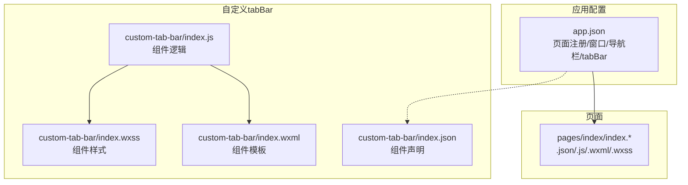
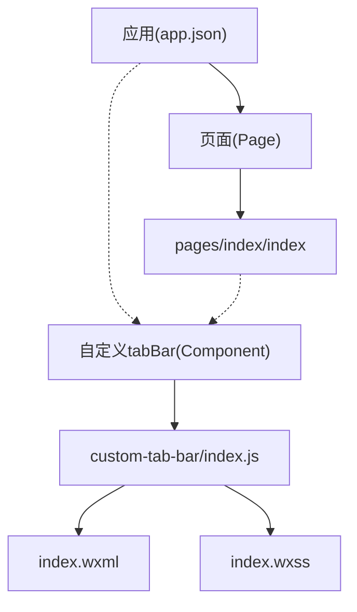
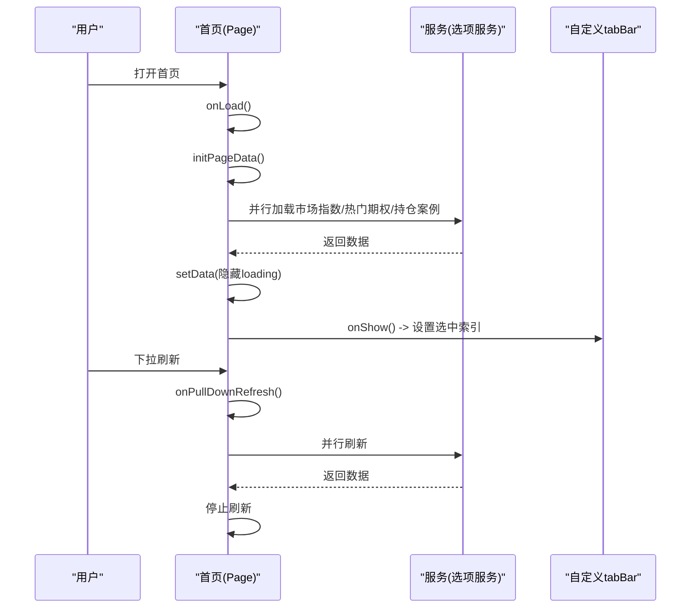
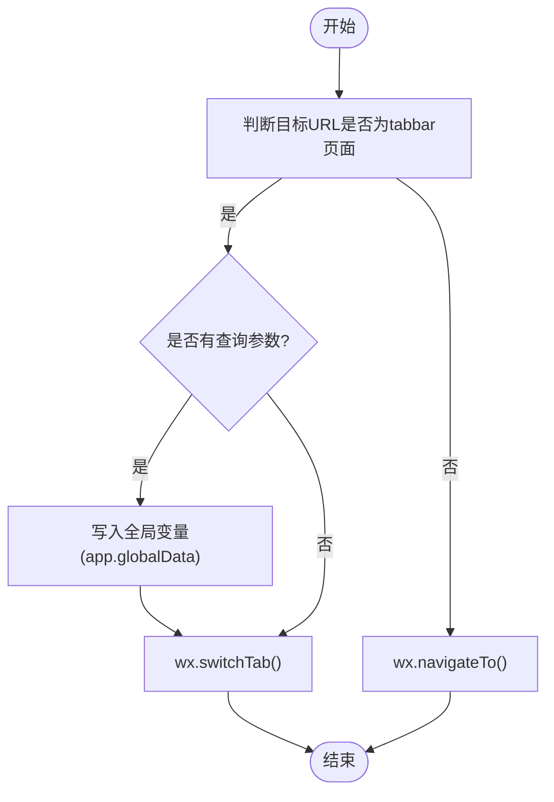
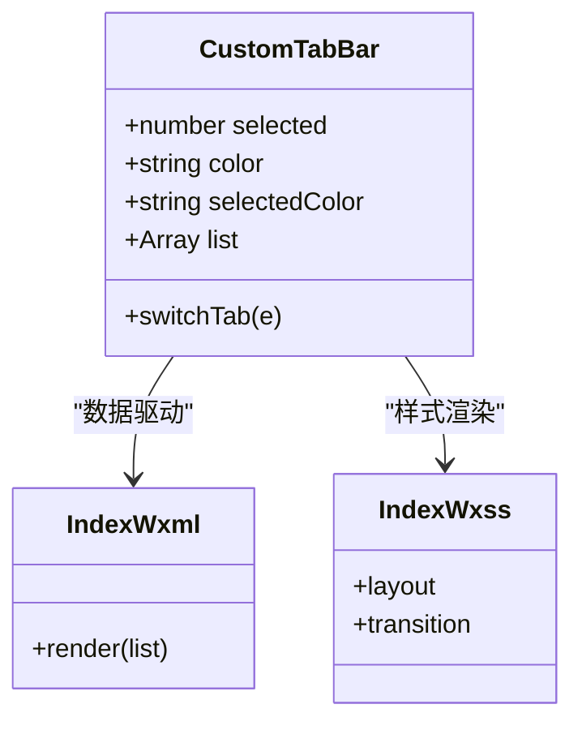
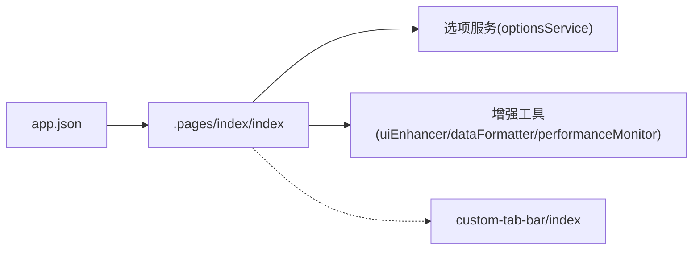

# 页面系统

<cite>
**本文引用的文件**
- [miniprogram/app.json](file://miniprogram/app.json)
- [miniprogram/custom-tab-bar/index.json](file://miniprogram/custom-tab-bar/index.json)
- [miniprogram/custom-tab-bar/index.js](file://miniprogram/custom-tab-bar/index.js)
- [miniprogram/custom-tab-bar/index.wxml](file://miniprogram/custom-tab-bar/index.wxml)
- [miniprogram/custom-tab-bar/index.wxss](file://miniprogram/custom-tab-bar/index.wxss)
- [miniprogram/pages/index/index.json](file://miniprogram/pages/index/index.json)
- [miniprogram/pages/index/index.js](file://miniprogram/pages/index/index.js)
- [miniprogram/pages/index/index.wxml](file://miniprogram/pages/index/index.wxml)
- [miniprogram/pages/index/index.wxss](file://miniprogram/pages/index/index.wxss)
</cite>

## 目录
1. [简介](#简介)
2. [项目结构](#项目结构)
3. [核心组件](#核心组件)
4. [架构总览](#架构总览)
5. [详细组件分析](#详细组件分析)
6. [依赖关系分析](#依赖关系分析)
7. [性能考量](#性能考量)
8. [故障排查指南](#故障排查指南)
9. [结论](#结论)
10. [附录](#附录)

## 简介
本文件系统性梳理微信小程序页面系统，围绕页面架构、生命周期与路由机制展开，结合仓库中的实际页面与自定义 tabbar 实现，给出页面配置(.json)、逻辑(.js)、模板(.wxml)、样式(.wxss)的职责边界与编写规范；详解页面间跳转、参数传递与返回栈管理；覆盖自定义 tabbar 的实现方式、页面缓存策略与性能优化要点，并提供最佳实践、常见问题排查与调试技巧。

## 项目结构
本项目采用“按页面分目录”的组织方式，页面统一注册在应用配置中，自定义 tabbar 以组件形式独立存在，便于跨页面复用与统一风格。

图表来源
- [miniprogram/app.json](file://miniprogram/app.json#L1-L78)
- [miniprogram/pages/index/index.json](file://miniprogram/pages/index/index.json#L1-L6)
- [miniprogram/pages/index/index.js](file://miniprogram/pages/index/index.js#L1-L710)
- [miniprogram/pages/index/index.wxml](file://miniprogram/pages/index/index.wxml#L1-L241)
- [miniprogram/pages/index/index.wxss](file://miniprogram/pages/index/index.wxss#L1-L1080)
- [miniprogram/custom-tab-bar/index.json](file://miniprogram/custom-tab-bar/index.json#L1-L3)
- [miniprogram/custom-tab-bar/index.js](file://miniprogram/custom-tab-bar/index.js#L1-L31)
- [miniprogram/custom-tab-bar/index.wxml](file://miniprogram/custom-tab-bar/index.wxml#L1-L7)
- [miniprogram/custom-tab-bar/index.wxss](file://miniprogram/custom-tab-bar/index.wxss#L1-L52)

章节来源
- [miniprogram/app.json](file://miniprogram/app.json#L1-L78)

## 核心组件
- 应用配置(app.json)
  - 页面注册：决定小程序的页面清单与启动页
  - 窗口与导航栏：统一设置导航栏背景、标题、文字颜色等
  - 自定义 tabbar：启用自定义 tabbar 并配置各 tab 的页面路径、图标与文案
- 页面组件(pages/index/index)
  - 配置(.json)：设置页面导航栏标题、下拉刷新、背景等
  - 逻辑(.js)：承载页面数据、生命周期、交互事件、业务方法与跳转逻辑
  - 模板(.wxml)：描述页面结构与数据绑定
  - 样式(.wxss)：页面样式与动画
- 自定义 tabbar(custom-tab-bar)
  - 组件声明(index.json)：标记为组件
  - 组件逻辑(index.js)：维护选中态、tab 列表、点击切换
  - 组件模板(index.wxml)：渲染 tab 项与图标
  - 组件样式(index.wxss)：布局、过渡与遮罩适配

章节来源
- [miniprogram/app.json](file://miniprogram/app.json#L1-L78)
- [miniprogram/pages/index/index.json](file://miniprogram/pages/index/index.json#L1-L6)
- [miniprogram/pages/index/index.js](file://miniprogram/pages/index/index.js#L1-L710)
- [miniprogram/pages/index/index.wxml](file://miniprogram/pages/index/index.wxml#L1-L241)
- [miniprogram/pages/index/index.wxss](file://miniprogram/pages/index/index.wxss#L1-L1080)
- [miniprogram/custom-tab-bar/index.json](file://miniprogram/custom-tab-bar/index.json#L1-L3)
- [miniprogram/custom-tab-bar/index.js](file://miniprogram/custom-tab-bar/index.js#L1-L31)
- [miniprogram/custom-tab-bar/index.wxml](file://miniprogram/custom-tab-bar/index.wxml#L1-L7)
- [miniprogram/custom-tab-bar/index.wxss](file://miniprogram/custom-tab-bar/index.wxss#L1-L52)

## 架构总览
微信小程序页面系统由“应用配置—页面—组件”三层构成。应用配置集中声明页面与 tabbar；页面通过 Page 构造器挂载生命周期与事件；自定义 tabbar 作为组件注入到需要的页面中，实现统一的底部导航体验。

图表来源
- [miniprogram/app.json](file://miniprogram/app.json#L1-L78)
- [miniprogram/pages/index/index.js](file://miniprogram/pages/index/index.js#L1-L710)
- [miniprogram/custom-tab-bar/index.js](file://miniprogram/custom-tab-bar/index.js#L1-L31)

## 详细组件分析

### 页面生命周期与控制流
- 关键生命周期
  - onLoad：页面加载时初始化数据与任务
  - onShow：页面显示时更新 tabbar 选中态、触发刷新
  - onPullDownRefresh：支持下拉刷新，完成后停止刷新
- 控制流示例（首页）
  - 进入页面：onLoad -> initPageData -> Promise.all 并行加载市场指数、热门期权、持仓案例
  - 显示页面：onShow -> 设置 tabbar 选中索引 -> 若已登录则刷新数据
  - 下拉刷新：onPullDownRefresh -> Promise.all 并行刷新 -> 停止刷新

图表来源
- [miniprogram/pages/index/index.js](file://miniprogram/pages/index/index.js#L267-L323)
- [miniprogram/pages/index/index.js](file://miniprogram/pages/index/index.js#L292-L306)
- [miniprogram/pages/index/index.js](file://miniprogram/pages/index/index.js#L285-L289)

章节来源
- [miniprogram/pages/index/index.js](file://miniprogram/pages/index/index.js#L267-L323)
- [miniprogram/pages/index/index.js](file://miniprogram/pages/index/index.js#L292-L306)
- [miniprogram/pages/index/index.js](file://miniprogram/pages/index/index.js#L285-L289)

### 页面路由与跳转机制
- 页面间跳转
  - navigateTo：保留当前页，打开新页面（非 tabbar 页面）
  - switchTab：关闭所有非 tabbar 页面，仅保留目标 tabbar 页面（tabbar 页面）
- 参数传递
  - 通过 URL 查询字符串传参
  - 对于 tabbar 页面，若带参，可写入全局变量供目标页 onShow 时读取
- 返回栈管理
  - navigateTo 增加一条记录；navigateBack 可按栈顺序返回
  - switchTab 不改变返回栈，仅切换 tabbar 页面

图表来源
- [miniprogram/pages/index/index.js](file://miniprogram/pages/index/index.js#L225-L265)

章节来源
- [miniprogram/pages/index/index.js](file://miniprogram/pages/index/index.js#L225-L265)

### 页面配置文件(.json)、逻辑文件(.js)、模板文件(.wxml)、样式文件(.wxss)职责
- .json：页面级配置（如导航栏标题、下拉刷新、背景等），应用级配置（app.json）决定页面注册与 tabbar
- .js：页面状态、生命周期、事件处理、业务方法、跳转逻辑与性能监控
- .wxml：页面结构与数据绑定，使用 wx:for、bindtap 等指令
- .wxss：页面样式与动画，含增强卡片、轮播图、搜索结果等样式

章节来源
- [miniprogram/pages/index/index.json](file://miniprogram/pages/index/index.json#L1-L6)
- [miniprogram/pages/index/index.js](file://miniprogram/pages/index/index.js#L1-L710)
- [miniprogram/pages/index/index.wxml](file://miniprogram/pages/index/index.wxml#L1-L241)
- [miniprogram/pages/index/index.wxss](file://miniprogram/pages/index/index.wxss#L1-L1080)

### 自定义 tabbar 实现
- 组件声明：index.json 声明为组件
- 组件逻辑：index.js 维护选中索引、颜色、列表与 switchTab 方法
- 组件模板：index.wxml 使用 wx:for 渲染 tab 项，bindtap 触发切换
- 组件样式：index.wxss 定义布局、边框、过渡与安全区适配

图表来源
- [miniprogram/custom-tab-bar/index.js](file://miniprogram/custom-tab-bar/index.js#L1-L31)
- [miniprogram/custom-tab-bar/index.wxml](file://miniprogram/custom-tab-bar/index.wxml#L1-L7)
- [miniprogram/custom-tab-bar/index.wxss](file://miniprogram/custom-tab-bar/index.wxss#L1-L52)

章节来源
- [miniprogram/custom-tab-bar/index.json](file://miniprogram/custom-tab-bar/index.json#L1-L3)
- [miniprogram/custom-tab-bar/index.js](file://miniprogram/custom-tab-bar/index.js#L1-L31)
- [miniprogram/custom-tab-bar/index.wxml](file://miniprogram/custom-tab-bar/index.wxml#L1-L7)
- [miniprogram/custom-tab-bar/index.wxss](file://miniprogram/custom-tab-bar/index.wxss#L1-L52)

### 页面缓存策略
- onShow/onHide：利用页面显示/隐藏时机进行数据刷新或暂停任务
- 数据持久化：使用本地存储缓存搜索历史、用户信息等
- 并行加载：initPageData 使用 Promise.all 并行请求，减少首屏等待
- 图片懒加载/占位：轮播图图片加载时先占位，成功后再渐显，避免闪烁

章节来源
- [miniprogram/pages/index/index.js](file://miniprogram/pages/index/index.js#L274-L283)
- [miniprogram/pages/index/index.js](file://miniprogram/pages/index/index.js#L292-L306)
- [miniprogram/pages/index/index.js](file://miniprogram/pages/index/index.js#L630-L651)
- [miniprogram/pages/index/index.wxml](file://miniprogram/pages/index/index.wxml#L67-L80)
- [miniprogram/pages/index/index.wxss](file://miniprogram/pages/index/index.wxss#L195-L205)

### 页面性能优化
- 并行初始化：Promise.all 并行加载多个数据源
- 防抖搜索：输入防抖降低频繁请求
- 列表渲染优化：使用 wx:key、合理拆分 DOM、避免深层嵌套
- 图片资源：懒加载与错误兜底，减少首屏阻塞
- 动画与过渡：使用 CSS 动画与过渡，避免 JS 高频操作

章节来源
- [miniprogram/pages/index/index.js](file://miniprogram/pages/index/index.js#L294-L298)
- [miniprogram/pages/index/index.js](file://miniprogram/pages/index/index.js#L461-L469)
- [miniprogram/pages/index/index.wxml](file://miniprogram/pages/index/index.wxml#L1-L241)
- [miniprogram/pages/index/index.wxss](file://miniprogram/pages/index/index.wxss#L1-L1080)

## 依赖关系分析
- 应用配置(app.json)对页面与 tabbar 的依赖
- 页面(index)对服务与工具的依赖（选项服务、UI增强、数据格式化、性能监控）
- 自定义 tabbar 对页面的依赖（通过 getTabBar 在页面中设置选中态）

图表来源
- [miniprogram/app.json](file://miniprogram/app.json#L1-L78)
- [miniprogram/pages/index/index.js](file://miniprogram/pages/index/index.js#L2-L3)

章节来源
- [miniprogram/app.json](file://miniprogram/app.json#L1-L78)
- [miniprogram/pages/index/index.js](file://miniprogram/pages/index/index.js#L2-L3)

## 性能考量
- 首屏加载
  - 使用并行初始化减少等待时间
  - 图片懒加载与占位提升感知速度
- 交互流畅度
  - 输入防抖、按钮互斥防止重复请求
  - 合理使用 setData，避免一次性更新过多字段
- 内存与渲染
  - 列表渲染使用 wx:key，减少重排
  - 避免在 wxml 中进行复杂计算，尽量在 js 中预处理

## 故障排查指南
- 页面无法显示或空白
  - 检查 app.json 中页面路径是否正确
  - 检查页面 .json/.js/.wxml/.wxss 是否齐全且命名正确
- tabbar 不生效
  - 确认 app.json 中 tabBar.custom=true 且 list 配置正确
  - 确认自定义 tabbar 组件声明与导出路径正确
- 跳转异常
  - 非 tabbar 页面使用 navigateTo，tabbar 页面使用 switchTab
  - 参数传递需使用 URL 查询字符串，tabbar 页面参数可通过全局变量在 onShow 读取
- 下拉刷新无效
  - 确保页面 .json 开启 enablePullDownRefresh
  - onPullDownRefresh 中完成刷新逻辑并调用停止刷新

章节来源
- [miniprogram/app.json](file://miniprogram/app.json#L31-L62)
- [miniprogram/pages/index/index.json](file://miniprogram/pages/index/index.json#L3)
- [miniprogram/pages/index/index.js](file://miniprogram/pages/index/index.js#L225-L265)
- [miniprogram/pages/index/index.js](file://miniprogram/pages/index/index.js#L285-L289)

## 结论
本项目以清晰的应用配置与页面结构为基础，结合自定义 tabbar 组件实现了统一的导航体验；通过并行初始化、防抖与懒加载等手段优化了页面性能；在路由层面严格区分非 tabbar 与 tabbar 页面的跳转方式，确保返回栈与参数传递的正确性。遵循本文的编写规范与最佳实践，可进一步提升页面稳定性与用户体验。

## 附录
- 页面配置(.json)编写规范
  - 导航栏标题：根据页面语义设置
  - 下拉刷新：在需要的页面开启
  - 背景与文字：与整体视觉保持一致
- 逻辑(.js)编写规范
  - 生命周期：在 onLoad/onShow 中做初始化与刷新
  - 事件：bindtap 等事件处理函数内避免阻塞操作
  - 跳转：根据目标页面类型选择 navigateTo 或 switchTab
- 模板(.wxml)编写规范
  - 使用 wx:for 与 wx:key 提升渲染性能
  - 数据绑定简洁明确，避免复杂表达式
- 样式(.wxss)编写规范
  - 使用增强卡片、阴影与过渡提升交互质感
  - 注意安全区适配与响应式布局