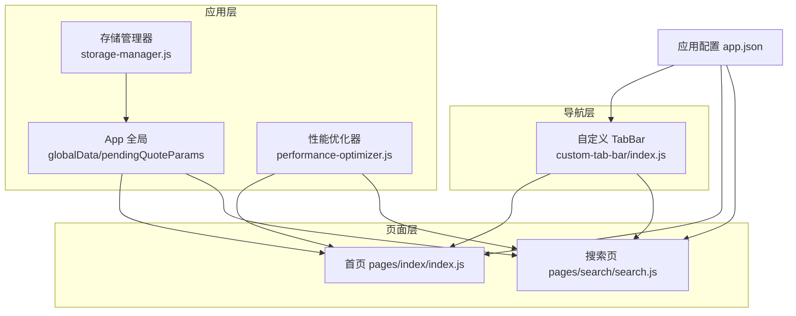
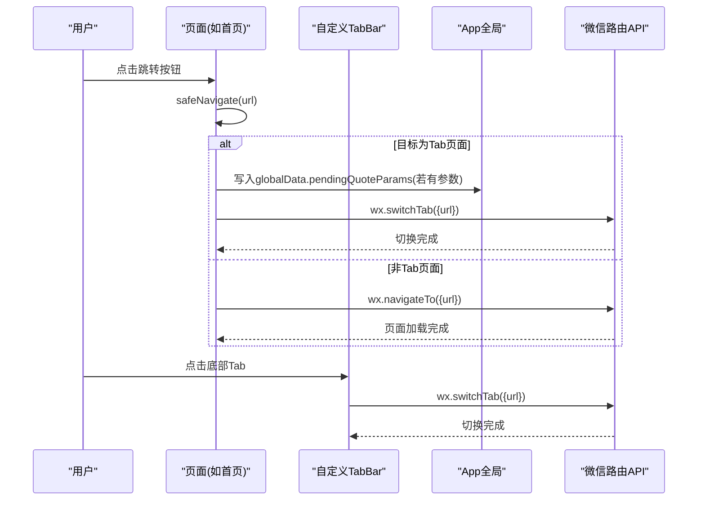
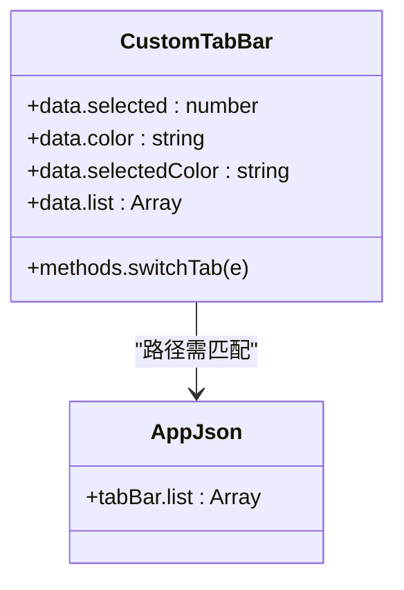
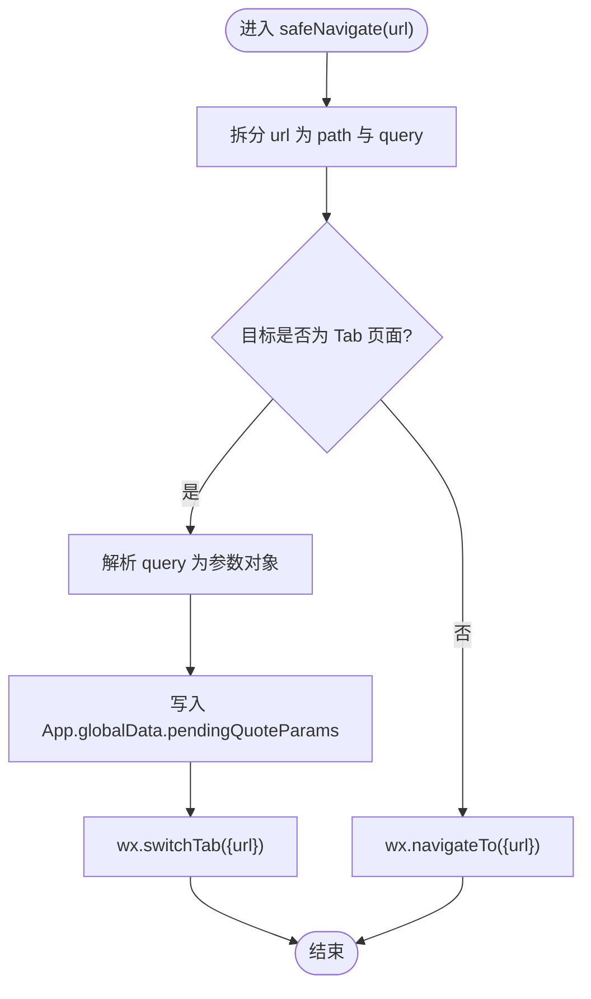
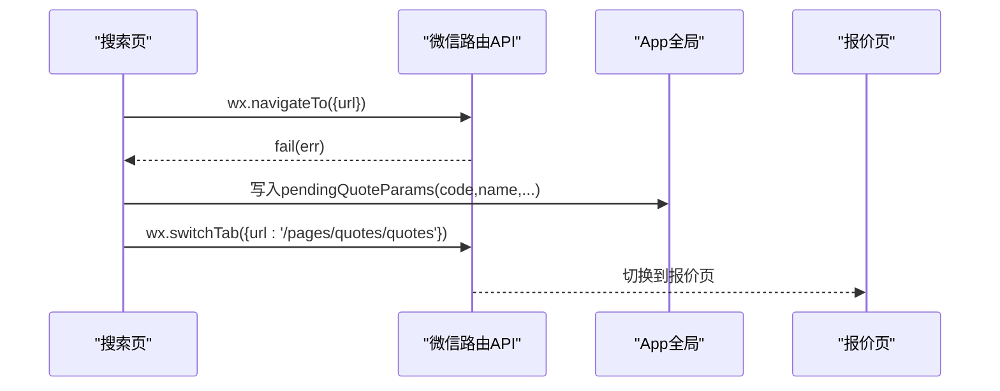
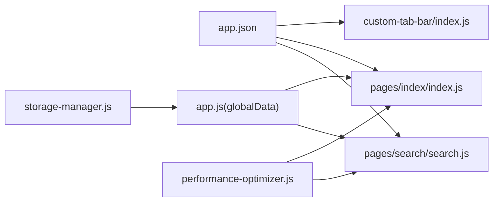

# 页面路由管理

<cite>
**本文引用的文件**
- [miniprogram/app.json](file://miniprogram/app.json)
- [miniprogram/app.js](file://miniprogram/app.js)
- [miniprogram/custom-tab-bar/index.js](file://miniprogram/custom-tab-bar/index.js)
- [miniprogram/custom-tab-bar/index.json](file://miniprogram/custom-tab-bar/index.json)
- [miniprogram/custom-tab-bar/index.wxml](file://miniprogram/custom-tab-bar/index.wxml)
- [miniprogram/pages/index/index.js](file://miniprogram/pages/index/index.js)
- [miniprogram/pages/search/search.js](file://miniprogram/pages/search/search.js)
- [miniprogram/utils/storage-manager.js](file://miniprogram/utils/storage-manager.js)
- [miniprogram/utils/performance-optimizer.js](file://miniprogram/utils/performance-optimizer.js)
- [miniprogram/sitemap.json](file://miniprogram/sitemap.json)
</cite>

## 目录
1. [引言](#引言)
2. [项目结构](#项目结构)
3. [核心组件](#核心组件)
4. [架构总览](#架构总览)
5. [详细组件分析](#详细组件分析)
6. [依赖关系分析](#依赖关系分析)
7. [性能考量](#性能考量)
8. [故障排查指南](#故障排查指南)
9. [结论](#结论)
10. [附录](#附录)

## 引言
本文件系统性梳理微信小程序页面路由管理机制与实现，围绕页面栈管理、跳转方式（redirectTo、navigateTo、switchTab）、参数传递、返回处理、路由拦截与配置规则展开，并结合项目中的自定义 TabBar、全局参数透传、性能监控与存储策略给出工程化实践建议与排障指引。

## 项目结构
- 小程序路由配置集中在应用级配置文件中，声明页面列表与 TabBar 列表。
- 页面跳转逻辑在业务页面中实现，部分通过统一的安全跳转封装，部分直接使用原生 API。
- 自定义 TabBar 组件负责底部导航栏的点击跳转，统一走 switchTab。
- 全局参数通过 App 全局数据与存储管理器协同，实现跨页面参数透传与持久化。

图表来源
- [miniprogram/app.json](file://miniprogram/app.json#L1-L78)
- [miniprogram/app.js](file://miniprogram/app.js#L1-L225)
- [miniprogram/custom-tab-bar/index.js](file://miniprogram/custom-tab-bar/index.js#L1-L31)
- [miniprogram/pages/index/index.js](file://miniprogram/pages/index/index.js#L220-L272)
- [miniprogram/pages/search/search.js](file://miniprogram/pages/search/search.js#L240-L260)
- [miniprogram/utils/performance-optimizer.js](file://miniprogram/utils/performance-optimizer.js#L1-L800)
- [miniprogram/utils/storage-manager.js](file://miniprogram/utils/storage-manager.js#L1-L776)

章节来源
- [miniprogram/app.json](file://miniprogram/app.json#L1-L78)
- [miniprogram/app.js](file://miniprogram/app.js#L1-L225)

## 核心组件
- 应用配置与 TabBar
  - 应用配置集中声明页面与 TabBar，决定页面栈与 Tab 切换边界。
- 自定义 TabBar
  - 统一承载 Tab 列表、图标与文本，点击事件触发 switchTab。
- 安全跳转封装
  - 在首页等页面对跳转进行判断：若目标为 Tab 页面则透传参数至全局，再 switchTab；否则使用 navigateTo。
- 全局参数透传
  - 通过 App 的 globalData.pendingQuoteParams 临时存放跳转参数，供 Tab 页面 onShow/onLoad 时消费。
- 存储与性能
  - 存储管理器提供智能缓存、批量操作、观察者与同步；性能优化器提供懒加载、监控与告警。

章节来源
- [miniprogram/app.json](file://miniprogram/app.json#L31-L62)
- [miniprogram/custom-tab-bar/index.js](file://miniprogram/custom-tab-bar/index.js#L1-L31)
- [miniprogram/pages/index/index.js](file://miniprogram/pages/index/index.js#L225-L265)
- [miniprogram/app.js](file://miniprogram/app.js#L9-L24)
- [miniprogram/utils/storage-manager.js](file://miniprogram/utils/storage-manager.js#L1-L776)
- [miniprogram/utils/performance-optimizer.js](file://miniprogram/utils/performance-optimizer.js#L1-L800)

## 架构总览
下图展示从用户点击到页面跳转的关键流程，以及参数透传与 Tab 切换的协作关系。

图表来源
- [miniprogram/pages/index/index.js](file://miniprogram/pages/index/index.js#L225-L265)
- [miniprogram/custom-tab-bar/index.js](file://miniprogram/custom-tab-bar/index.js#L24-L31)
- [miniprogram/app.js](file://miniprogram/app.js#L9-L24)

## 详细组件分析

### 自定义 TabBar 组件
- 职责
  - 维护 Tab 列表、当前选中态与样式。
  - 处理点击事件，统一调用 wx.switchTab 切换页面。
- 关键点
  - 列表来自组件 data.list，绑定到 wxml 的 tap 事件，事件中读取 dataset.path 并传给 switchTab。
  - 与应用配置中的 tabBar.list 对应，确保路径一致。

图表来源
- [miniprogram/custom-tab-bar/index.js](file://miniprogram/custom-tab-bar/index.js#L1-L31)
- [miniprogram/app.json](file://miniprogram/app.json#L31-L62)

章节来源
- [miniprogram/custom-tab-bar/index.js](file://miniprogram/custom-tab-bar/index.js#L1-L31)
- [miniprogram/custom-tab-bar/index.wxml](file://miniprogram/custom-tab-bar/index.wxml#L1-L7)
- [miniprogram/custom-tab-bar/index.json](file://miniprogram/custom-tab-bar/index.json#L1-L3)
- [miniprogram/app.json](file://miniprogram/app.json#L31-L62)

### 安全跳转封装（首页）
- 职责
  - 统一处理跳转：识别是否为 Tab 页面，若是则将查询参数解析并写入 App 全局，再 switchTab；否则 navigateTo。
- 参数解析
  - 从 url 中拆分 path 与 query 字符串，解析为键值对对象，支持中文解码。
- 防重复跳转
  - 通过页面内部状态标记，避免并发多次跳转导致的状态混乱。

图表来源
- [miniprogram/pages/index/index.js](file://miniprogram/pages/index/index.js#L225-L265)

章节来源
- [miniprogram/pages/index/index.js](file://miniprogram/pages/index/index.js#L225-L265)

### 搜索页降级跳转
- 职责
  - 当 navigateTo 跳转股票详情失败时，将关键参数写入 App 全局，再 switchTab 到 Tab 页面，实现“降级”到报价页。
- 适用场景
  - 跨页面参数透传与兜底策略，保证用户体验连续性。

图表来源
- [miniprogram/pages/search/search.js](file://miniprogram/pages/search/search.js#L240-L260)

章节来源
- [miniprogram/pages/search/search.js](file://miniprogram/pages/search/search.js#L240-L260)

### App 全局参数透传
- 设计
  - 在 App 全局数据中预留 pendingQuoteParams 字段，用于在 Tab 切换前临时存放参数。
- 生命周期
  - onLaunch 初始化核心服务时可配合使用；页面 onShow/onLoad 时读取并清理。
- 注意
  - 该字段仅用于本次切换的参数透传，避免长期驻留造成污染。

章节来源
- [miniprogram/app.js](file://miniprogram/app.js#L9-L24)

### 存储与性能协同
- 存储管理器
  - 提供智能缓存、批量操作、观察者与同步队列，支持 TTL、压缩、加解密与 LRU。
- 性能优化器
  - 提供懒加载、图片懒加载、分包预下载、内存警告清理、API/渲染/交互延迟监控与性能报告。
- 协同点
  - App 启动时预加载关键资源，减少首屏等待；页面跳转前后可利用性能监控定位瓶颈。

章节来源
- [miniprogram/utils/storage-manager.js](file://miniprogram/utils/storage-manager.js#L1-L776)
- [miniprogram/utils/performance-optimizer.js](file://miniprogram/utils/performance-optimizer.js#L1-L800)
- [miniprogram/app.js](file://miniprogram/app.js#L93-L119)

## 依赖关系分析
- 配置驱动
  - app.json 的 pages 与 tabBar.list 决定可用页面与 Tab 切换范围。
- 组件耦合
  - 自定义 TabBar 与 app.json 的 tabBar.list 路径强关联，需保持一致。
- 页面耦合
  - 首页安全跳转封装依赖 App 全局参数；搜索页降级跳转依赖 App 全局参数与 Tab 页面。
- 工具链
  - 性能优化器与存储管理器作为通用能力被页面与 App 共享。

图表来源
- [miniprogram/app.json](file://miniprogram/app.json#L1-L78)
- [miniprogram/custom-tab-bar/index.js](file://miniprogram/custom-tab-bar/index.js#L1-L31)
- [miniprogram/pages/index/index.js](file://miniprogram/pages/index/index.js#L225-L265)
- [miniprogram/pages/search/search.js](file://miniprogram/pages/search/search.js#L240-L260)
- [miniprogram/app.js](file://miniprogram/app.js#L9-L24)
- [miniprogram/utils/performance-optimizer.js](file://miniprogram/utils/performance-optimizer.js#L1-L800)
- [miniprogram/utils/storage-manager.js](file://miniprogram/utils/storage-manager.js#L1-L776)

章节来源
- [miniprogram/app.json](file://miniprogram/app.json#L1-L78)
- [miniprogram/custom-tab-bar/index.js](file://miniprogram/custom-tab-bar/index.js#L1-L31)
- [miniprogram/pages/index/index.js](file://miniprogram/pages/index/index.js#L225-L265)
- [miniprogram/pages/search/search.js](file://miniprogram/pages/search/search.js#L240-L260)
- [miniprogram/app.js](file://miniprogram/app.js#L9-L24)
- [miniprogram/utils/performance-optimizer.js](file://miniprogram/utils/performance-optimizer.js#L1-L800)
- [miniprogram/utils/storage-manager.js](file://miniprogram/utils/storage-manager.js#L1-L776)

## 性能考量
- 预加载与懒加载
  - App 启动阶段预加载关键模块；通用工具类采用懒加载与缓存，降低首屏压力。
- 内存与缓存
  - 监听内存警告，清理低优先级缓存；定期生成性能报告，指导优化方向。
- 图片与网络
  - 提供图片懒加载与分包预下载；API 请求监控与网络状态变化联动，必要时清理缓存。
- 页面跳转
  - 使用安全跳转封装避免重复跳转；Tab 切换统一走 switchTab，非 Tab 页面走 navigateTo，减少页面栈冗余。

章节来源
- [miniprogram/app.js](file://miniprogram/app.js#L93-L119)
- [miniprogram/utils/performance-optimizer.js](file://miniprogram/utils/performance-optimizer.js#L42-L64)
- [miniprogram/utils/performance-optimizer.js](file://miniprogram/utils/performance-optimizer.js#L188-L212)
- [miniprogram/utils/performance-optimizer.js](file://miniprogram/utils/performance-optimizer.js#L217-L284)
- [miniprogram/utils/performance-optimizer.js](file://miniprogram/utils/performance-optimizer.js#L465-L475)
- [miniprogram/utils/performance-optimizer.js](file://miniprogram/utils/performance-optimizer.js#L537-L567)
- [miniprogram/pages/index/index.js](file://miniprogram/pages/index/index.js#L225-L265)

## 故障排查指南
- Tab 页面无法接收参数
  - 检查是否通过安全跳转封装进行跳转，确认参数已写入 App.globalData.pendingQuoteParams。
  - 确认 app.json 中 tabBar.list 的 pagePath 与组件路径一致。
- navigateTo 失败降级
  - 检查降级逻辑是否正确写入 App.globalData.pendingQuoteParams，并调用 wx.switchTab 切换到 Tab 页面。
- 页面栈异常或重复
  - 避免在短时间内多次触发跳转；使用页面内状态标记防止并发跳转。
- 性能问题
  - 查看性能报告与告警，关注页面加载、API 响应、渲染与交互延迟指标；按建议优化。
- 存储异常
  - 检查存储统计与缓存细节，确认 TTL、压缩与加解密设置是否符合预期。

章节来源
- [miniprogram/pages/index/index.js](file://miniprogram/pages/index/index.js#L225-L265)
- [miniprogram/pages/search/search.js](file://miniprogram/pages/search/search.js#L240-L260)
- [miniprogram/app.json](file://miniprogram/app.json#L31-L62)
- [miniprogram/utils/performance-optimizer.js](file://miniprogram/utils/performance-optimizer.js#L306-L426)
- [miniprogram/utils/storage-manager.js](file://miniprogram/utils/storage-manager.js#L529-L558)

## 结论
本项目通过应用配置驱动页面与 TabBar，结合自定义 TabBar 组件与安全跳转封装，实现了清晰的路由控制与参数透传。配合性能优化器与存储管理器，形成从配置、导航、参数、性能到存储的完整闭环。遵循本文的最佳实践与排障建议，可在保证体验的同时提升稳定性与可维护性。

## 附录

### 路由跳转方式与使用场景
- switchTab
  - 仅用于 Tab 页面之间的切换，会清空非当前 Tab 的页面栈。
  - 适合首页、报价、账户、我的等 Tab 页面之间切换。
- navigateTo
  - 打开新页面并入栈，适合普通页面跳转。
  - 适合搜索结果详情、下单流程等需要返回的场景。
- redirectTo
  - 关闭当前页面并打开目标页面，适合一次性跳转。
  - 适合登录后跳转、授权后跳转等场景。
- navigateBack
  - 返回上一页或多页，适合返回流程。
- reLaunch
  - 关闭所有页面并打开应用内某个页面，适合重新初始化场景。

章节来源
- [miniprogram/custom-tab-bar/index.js](file://miniprogram/custom-tab-bar/index.js#L24-L31)
- [miniprogram/pages/index/index.js](file://miniprogram/pages/index/index.js#L225-L265)

### 路由参数传递与返回处理
- 参数传递
  - 使用 URL 查询字符串传递简单参数；复杂参数可通过 App.globalData.pendingQuoteParams 临时透传。
- 返回处理
  - 使用 navigateBack 返回上一页；Tab 页面返回时注意参数清理，避免下次进入复用旧参数。
- 降级策略
  - 当 navigateTo 失败时，将关键参数写入 App.globalData.pendingQuoteParams，再 switchTab 到 Tab 页面。

章节来源
- [miniprogram/pages/index/index.js](file://miniprogram/pages/index/index.js#L225-L265)
- [miniprogram/pages/search/search.js](file://miniprogram/pages/search/search.js#L240-L260)
- [miniprogram/app.js](file://miniprogram/app.js#L9-L24)

### 路由配置规则与页面路径规范
- 页面路径
  - app.json 的 pages 与 tabBar.list 中的 pagePath 必须与实际页面路径一致。
- TabBar 限制
  - TabBar 页面数量与图标路径需满足微信平台要求。
- Sitemap
  - sitemap.json 控制页面索引权限，确保页面可被搜索引擎收录。

章节来源
- [miniprogram/app.json](file://miniprogram/app.json#L1-L78)
- [miniprogram/sitemap.json](file://miniprogram/sitemap.json#L1-L7)

### 路由性能优化策略
- 预加载与懒加载
  - App 启动阶段预加载关键模块；通用工具类采用懒加载与缓存。
- 缓存与内存
  - 监听内存警告，清理低优先级缓存；定期生成性能报告。
- 图片与网络
  - 图片懒加载与分包预下载；网络状态变化联动缓存清理。
- 页面跳转
  - 使用安全跳转封装避免重复跳转；合理选择 switchTab 与 navigateTo。

章节来源
- [miniprogram/app.js](file://miniprogram/app.js#L93-L119)
- [miniprogram/utils/performance-optimizer.js](file://miniprogram/utils/performance-optimizer.js#L42-L64)
- [miniprogram/utils/performance-optimizer.js](file://miniprogram/utils/performance-optimizer.js#L188-L212)
- [miniprogram/utils/performance-optimizer.js](file://miniprogram/utils/performance-optimizer.js#L217-L284)
- [miniprogram/utils/performance-optimizer.js](file://miniprogram/utils/performance-optimizer.js#L465-L475)
- [miniprogram/utils/performance-optimizer.js](file://miniprogram/utils/performance-optimizer.js#L537-L567)
- [miniprogram/pages/index/index.js](file://miniprogram/pages/index/index.js#L225-L265)

### 路由开发最佳实践
- 统一入口
  - 所有跳转尽量通过安全跳转封装，避免分散逻辑。
- 参数规范
  - 简单参数用 URL，复杂参数用 App.globalData.pendingQuoteParams，并及时清理。
- Tab 页面
  - 严格区分 Tab 页面与普通页面，避免在 Tab 页面使用 navigateTo 导致页面栈膨胀。
- 性能监控
  - 使用性能优化器监控关键指标，持续优化页面加载与交互延迟。
- 存储策略
  - 合理设置 TTL、压缩与加解密，利用观察者与批量操作提升一致性与效率。

章节来源
- [miniprogram/pages/index/index.js](file://miniprogram/pages/index/index.js#L225-L265)
- [miniprogram/app.js](file://miniprogram/app.js#L9-L24)
- [miniprogram/utils/performance-optimizer.js](file://miniprogram/utils/performance-optimizer.js#L306-L426)
- [miniprogram/utils/storage-manager.js](file://miniprogram/utils/storage-manager.js#L118-L185)
- [miniprogram/utils/storage-manager.js](file://miniprogram/utils/storage-manager.js#L342-L394)