# API路由系统

<cite>
**本文档引用的文件**
- [routes/__init__.py](file://routes/__init__.py)
- [routes/auth.py](file://routes/auth.py)
- [routes/admin.py](file://routes/admin.py)
- [routes/customer.py](file://routes/customer.py)
- [routes/group.py](file://routes/group.py)
- [routes/inquiry.py](file://routes/inquiry.py)
- [routes/trade.py](file://routes/trade.py)
- [routes/stock.py](file://routes/stock.py)
- [routes/test_stock_routes.py](file://routes/test_stock_routes.py)
- [routes/config.py](file://routes/config.py)
- [backend_utils/response.py](file://backend_utils/response.py)
- [backend_utils/security.py](file://backend_utils/security.py)
- [services/auth_service.py](file://services/auth_service.py)
</cite>

## 目录
1. [简介](#简介)
2. [项目结构](#项目结构)
3. [核心组件](#核心组件)
4. [架构概览](#架构概览)
5. [详细组件分析](#详细组件分析)
6. [依赖关系分析](#依赖关系分析)
7. [性能考虑](#性能考虑)
8. [故障排除指南](#故障排除指南)
9. [结论](#结论)

## 简介

本项目采用Flask框架构建的API路由系统，采用蓝图(BP)架构设计，实现了完整的RESTful API服务。系统通过模块化的路由组织方式，提供了认证授权、客户管理、交易管理、股票数据查询等核心功能模块。

该API路由系统具有以下特点：
- 基于Flask蓝图的模块化架构
- 统一的响应格式和错误处理机制
- 多层次的安全防护体系
- 支持多种认证方式（JWT、微信登录等）
- 完善的权限控制和审计日志

## 项目结构

API路由系统采用清晰的分层架构，按照功能模块进行组织：

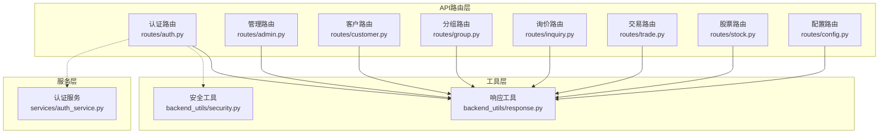

**图表来源**
- [routes/auth.py](file://routes/auth.py#L1-L353)
- [routes/admin.py](file://routes/admin.py#L1-L937)
- [routes/customer.py](file://routes/customer.py#L1-L217)
- [routes/group.py](file://routes/group.py#L1-L269)
- [routes/inquiry.py](file://routes/inquiry.py#L1-L175)
- [routes/trade.py](file://routes/trade.py#L1-L330)
- [routes/stock.py](file://routes/stock.py#L1-L353)
- [routes/config.py](file://routes/config.py#L1-L118)

**章节来源**
- [routes/__init__.py](file://routes/__init__.py#L1-L1)

## 核心组件

### 蓝图架构设计

系统采用Flask蓝图(BP)作为核心架构模式，每个功能模块都有独立的蓝图定义：

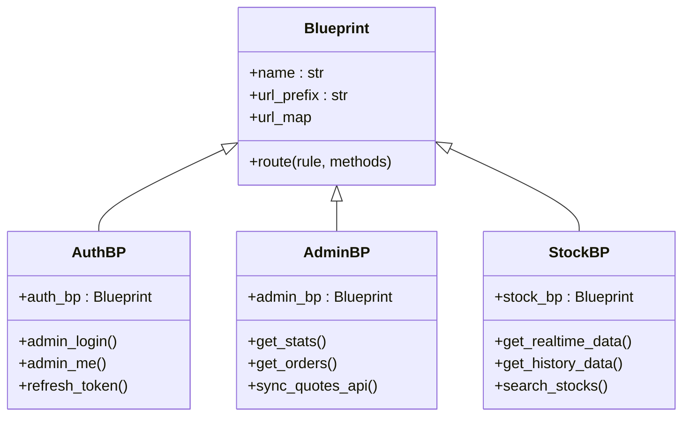

**图表来源**
- [routes/auth.py](file://routes/auth.py#L14-L353)
- [routes/admin.py](file://routes/admin.py#L24-L937)
- [routes/stock.py](file://routes/stock.py#L18-L353)

### 路由前缀管理

系统通过URL前缀实现路由的模块化组织：

| 模块 | 蓝图名称 | URL前缀 | 主要功能 |
|------|----------|---------|----------|
| 认证模块 | auth_bp | 无 | 用户认证、令牌管理、权限控制 |
| 管理模块 | admin_bp | 无 | 后台管理、数据同步、批量操作 |
| 股票模块 | stock_bp | /api/stock | 实时行情、历史数据、报价比较 |
| 客户模块 | customer_bp | 无 | 客户信息管理、分组管理 |
| 分组模块 | group_bp | 无 | 股票分组、成员管理 |
| 交易模块 | trade_bp | 无 | 持仓管理、订单处理、资金管理 |
| 询价模块 | inquiry_bp | 无 | 询价提交、状态管理、统计分析 |
| 配置模块 | config_bp | 无 | 系统配置管理 |

**章节来源**
- [routes/stock.py](file://routes/stock.py#L18-L18)

### HTTP方法映射

系统遵循RESTful API设计原则，采用标准的HTTP方法：

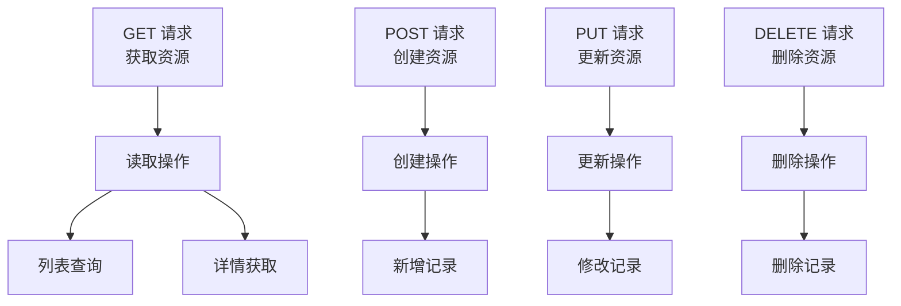

## 架构概览

API路由系统采用分层架构设计，确保各层职责清晰、耦合度低：

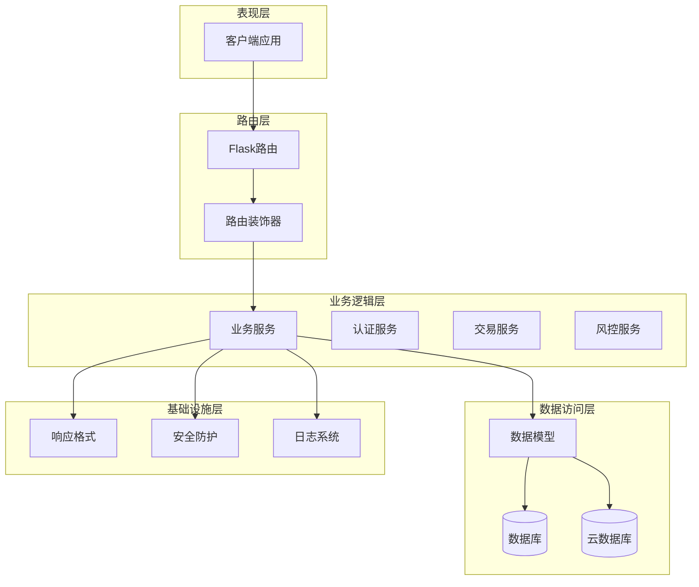

**图表来源**
- [routes/auth.py](file://routes/auth.py#L1-L353)
- [routes/admin.py](file://routes/admin.py#L1-L937)
- [backend_utils/response.py](file://backend_utils/response.py#L1-L118)
- [backend_utils/security.py](file://backend_utils/security.py#L1-L117)

## 详细组件分析

### 认证路由系统

认证路由系统实现了完整的用户身份验证和权限管理功能：

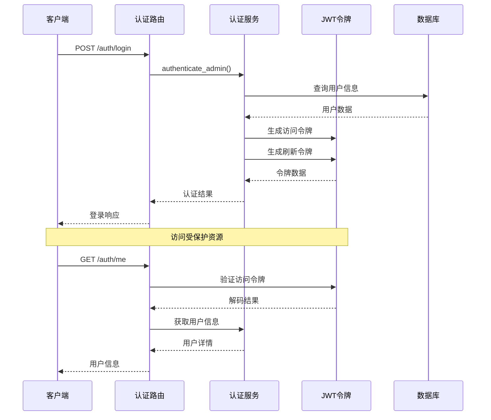

**图表来源**
- [routes/auth.py](file://routes/auth.py#L74-L128)
- [services/auth_service.py](file://services/auth_service.py#L196-L210)

#### 路由装饰器使用

系统实现了多层装饰器来处理认证和权限控制：

| 装饰器 | 功能 | 应用场景 |
|--------|------|----------|
| require_auth | JWT令牌验证 | 所有需要认证的路由 |
| require_roles | 角色权限检查 | 管理员操作 |
| rate_limit | 速率限制 | 高频操作接口 |
| audit_log | 审计日志 | 关键业务操作 |

**章节来源**
- [routes/auth.py](file://routes/auth.py#L33-L72)
- [backend_utils/security.py](file://backend_utils/security.py#L17-L45)

### 管理后台路由

管理后台路由提供了完整的后台管理功能：

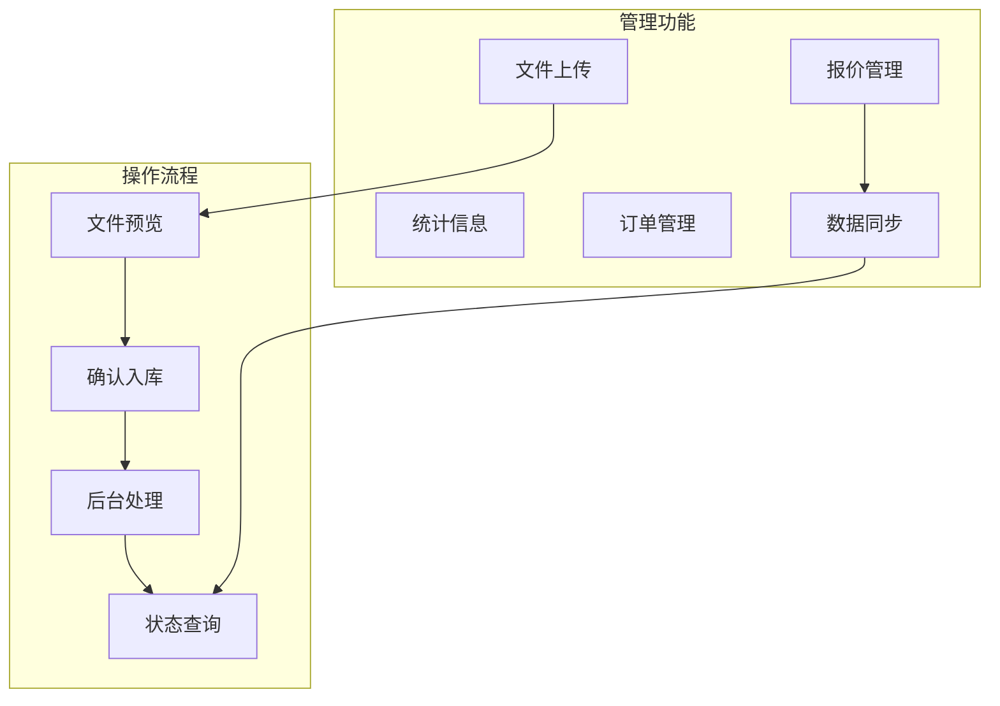

**图表来源**
- [routes/admin.py](file://routes/admin.py#L557-L685)
- [routes/admin.py](file://routes/admin.py#L313-L335)

#### 异步任务处理

系统采用异步方式处理耗时操作，避免阻塞主线程：

**章节来源**
- [routes/admin.py](file://routes/admin.py#L338-L387)
- [routes/admin.py](file://routes/admin.py#L268-L311)

### 股票数据路由

股票数据路由实现了完整的金融数据查询功能：

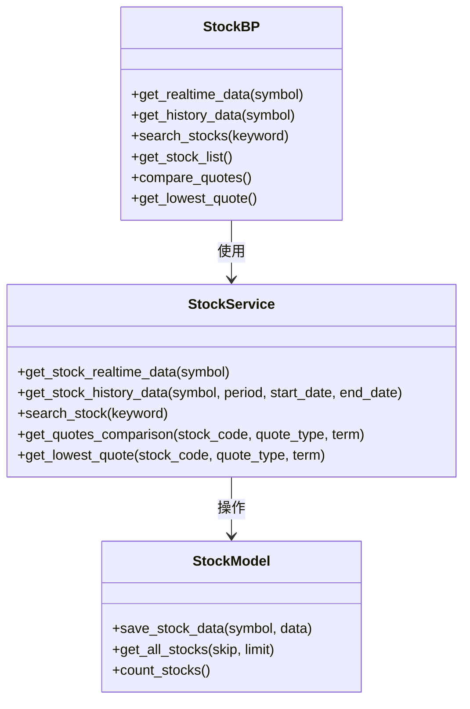

**图表来源**
- [routes/stock.py](file://routes/stock.py#L21-L353)

#### URL模式规范

股票数据路由遵循RESTful设计原则：

| 资源 | HTTP方法 | URL模式 | 功能描述 |
|------|----------|---------|----------|
| 实时数据 | GET | /api/stock/realtime/:symbol | 获取股票实时数据 |
| 历史数据 | GET | /api/stock/history/:symbol | 获取股票历史数据 |
| 搜索功能 | GET | /api/stock/search | 搜索股票 |
| 股票列表 | GET | /api/stock/list | 获取股票列表 |
| 报价比较 | GET | /api/stock/quotes/compare | 跨交易商报价比较 |
| 最低报价 | GET | /api/stock/quotes/lowest | 获取最低报价 |

**章节来源**
- [routes/stock.py](file://routes/stock.py#L21-L353)

### 交易管理路由

交易管理路由提供了完整的交易生命周期管理：

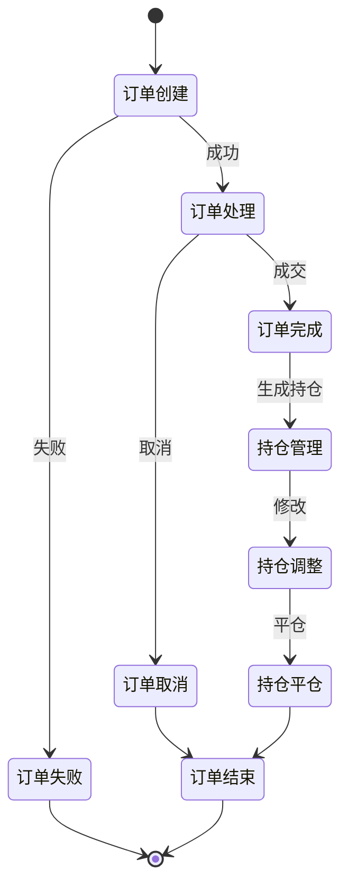

**图表来源**
- [routes/trade.py](file://routes/trade.py#L190-L262)

#### 风险控制集成

系统集成了完整的风控检查机制：

**章节来源**
- [routes/trade.py](file://routes/trade.py#L19-L53)

## 依赖关系分析

API路由系统的依赖关系呈现清晰的分层结构：

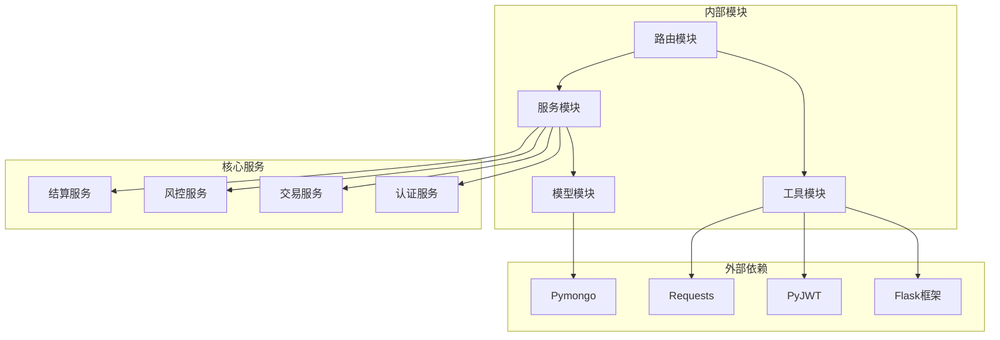

**图表来源**
- [routes/auth.py](file://routes/auth.py#L9-L12)
- [services/auth_service.py](file://services/auth_service.py#L1-L416)

### 模块间耦合度

系统通过接口抽象降低了模块间的耦合度：

| 模块 | 主要依赖 | 依赖类型 | 影响程度 |
|------|----------|----------|----------|
| 路由层 | 工具层 | 直接依赖 | 低 |
| 服务层 | 模型层 | 直接依赖 | 中 |
| 工具层 | 外部库 | 直接依赖 | 中 |
| 模型层 | 数据库驱动 | 直接依赖 | 高 |

**章节来源**
- [backend_utils/response.py](file://backend_utils/response.py#L1-L118)
- [backend_utils/security.py](file://backend_utils/security.py#L1-L117)

## 性能考虑

### 缓存策略

系统采用了多层次的缓存策略来提升性能：

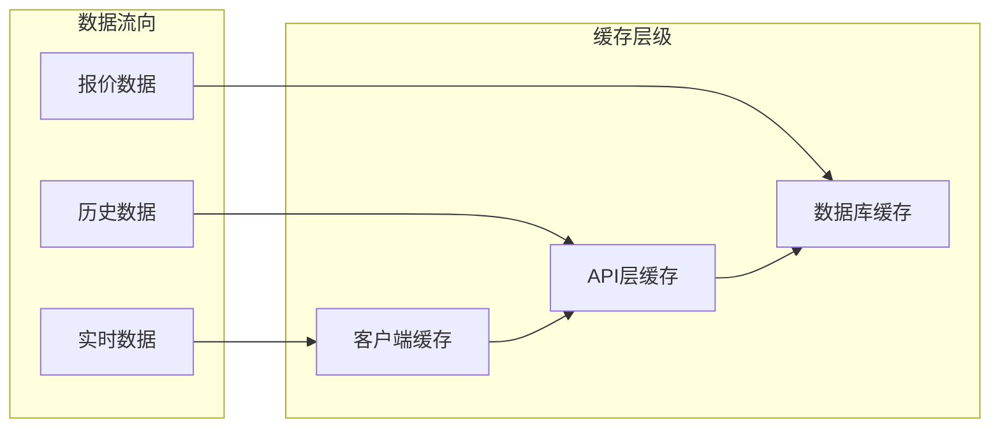

### 异步处理

对于耗时操作，系统采用异步处理机制：

**章节来源**
- [routes/admin.py](file://routes/admin.py#L338-L387)
- [routes/admin.py](file://routes/admin.py#L268-L311)

## 故障排除指南

### 常见问题诊断

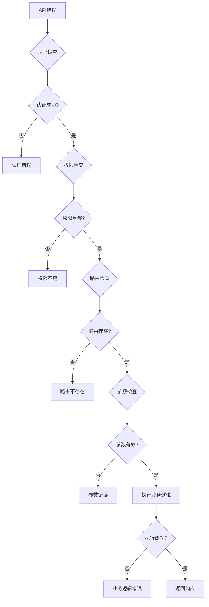

### 调试技巧

1. **日志分析**：利用系统内置的日志记录功能进行问题定位
2. **响应格式**：统一的响应格式便于快速识别错误类型
3. **装饰器调试**：通过装饰器的执行顺序分析问题根源
4. **异步任务监控**：对后台任务的状态进行实时监控

**章节来源**
- [backend_utils/security.py](file://backend_utils/security.py#L87-L117)
- [routes/admin.py](file://routes/admin.py#L338-L387)

## 结论

本API路由系统通过蓝图架构设计实现了高度模块化的API服务，具有以下优势：

1. **架构清晰**：采用分层架构，职责分离明确
2. **扩展性强**：蓝图模式便于功能模块的扩展和维护
3. **安全性高**：多层安全防护机制保障系统安全
4. **性能优秀**：异步处理和缓存策略提升系统性能
5. **易于维护**：统一的响应格式和错误处理机制便于维护

系统在认证授权、数据管理、业务逻辑等方面都体现了良好的设计原则，为后续的功能扩展和性能优化奠定了坚实基础。