# Flask应用核心

<cite>
**本文档引用的文件**
- [app.py](file://app.py)
- [config.py](file://config.py)
- [requirements.txt](file://requirements.txt)
- [.env.example](file://.env.example)
- [routes/inquiry.py](file://routes/inquiry.py)
- [routes/auth.py](file://routes/auth.py)
- [backend_utils/response.py](file://backend_utils/response.py)
- [services/cloud_db.py](file://services/cloud_db.py)
- [services/sync_service.py](file://services/sync_service.py)
- [services/trade_service.py](file://services/trade_service.py)
- [models/inquiry.py](file://models/inquiry.py)
- [services/auth_service.py](file://services/auth_service.py)
</cite>

## 目录
1. [简介](#简介)
2. [项目结构](#项目结构)
3. [核心组件](#核心组件)
4. [架构概览](#架构概览)
5. [详细组件分析](#详细组件分析)
6. [依赖关系分析](#依赖关系分析)
7. [性能考虑](#性能考虑)
8. [故障排除指南](#故障排除指南)
9. [结论](#结论)
10. [附录](#附录)

## 简介

这是一个基于Flask框架构建的场外期权交易系统后端服务。该应用集成了多种数据源架构，包括MongoDB本地数据库、微信云数据库以及实时行情数据爬取服务。系统采用现代化的微服务架构设计，支持多环境部署、完善的错误处理机制和丰富的监控功能。

主要特性包括：
- 多数据源架构：支持本地MongoDB和微信云数据库的混合使用
- 实时行情同步：自动抓取和同步股票期权行情数据
- 完整的权限管理体系：支持JWT认证和基于角色的访问控制
- 统一响应格式：标准化的API响应结构
- 生产级部署：支持Docker容器化部署和负载均衡

## 项目结构

该项目采用模块化的组织方式，按照功能层次进行划分：

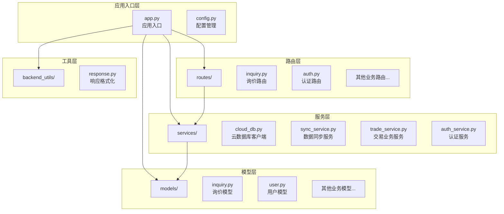
```mermaid
graph TB
subgraph "应用入口层"
A[app.py<br/>应用入口]
B[config.py<br/>配置管理]
end
subgraph "路由层"
C[routes/]
C1[inquiry.py<br/>询价路由]
C2[auth.py<br/>认证路由]
C3[其他业务路由...]
end
subgraph "服务层"
D[services/]
D1[cloud_db.py<br/>云数据库客户端]
D2[sync_service.py<br/>数据同步服务]
D3[trade_service.py<br/>交易业务服务]
D4[auth_service.py<br/>认证服务]
end
subgraph "模型层"
E[models/]
E1[inquiry.py<br/>询价模型]
E2[user.py<br/>用户模型]
E3[其他业务模型...]
end
subgraph "工具层"
F[backend_utils/]
F1[response.py<br/>响应格式化]
end
A --> C
A --> D
A --> E
A --> F
C --> D
D --> E
```

**图表来源**
- [app.py](file://app.py#L103-L276)
- [config.py](file://config.py#L22-L132)

**章节来源**
- [app.py](file://app.py#L1-L350)
- [config.py](file://config.py#L1-L132)

## 核心组件

### 应用初始化流程

应用启动过程遵循严格的初始化顺序，确保各个组件能够正确配置和运行：

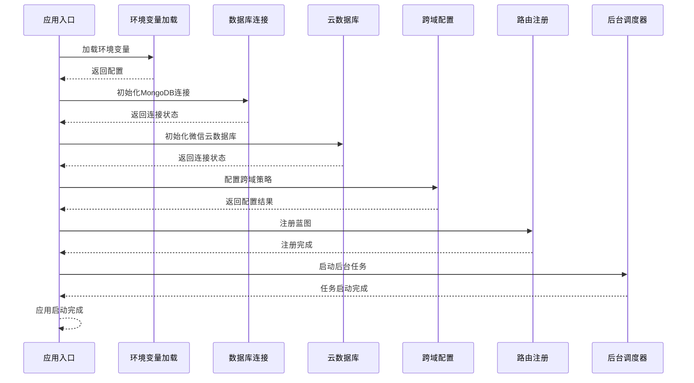
```mermaid
sequenceDiagram
participant Main as 应用入口
participant Env as 环境变量加载
participant DB as 数据库连接
participant Cloud as 云数据库
participant CORS as 跨域配置
participant Routes as 路由注册
participant Scheduler as 后台调度器
Main->>Env : 加载环境变量
Env-->>Main : 返回配置
Main->>DB : 初始化MongoDB连接
DB-->>Main : 返回连接状态
Main->>Cloud : 初始化微信云数据库
Cloud-->>Main : 返回连接状态
Main->>CORS : 配置跨域策略
CORS-->>Main : 返回配置结果
Main->>Routes : 注册蓝图
Routes-->>Main : 注册完成
Main->>Scheduler : 启动后台任务
Scheduler-->>Main : 任务启动完成
Main-->>Main : 应用启动完成
```

**图表来源**
- [app.py](file://app.py#L37-L101)
- [app.py](file://app.py#L103-L166)

### 自定义JSON序列化器

系统实现了自定义的JSON序列化器，专门处理MongoDB的ObjectId和Python datetime对象：

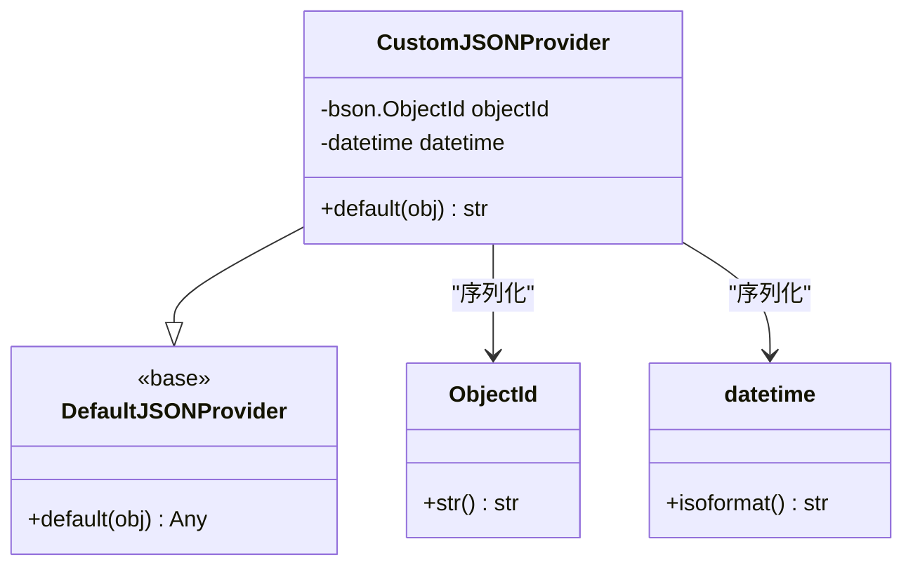
```mermaid
classDiagram
class CustomJSONProvider {
+default(obj) str
-bson.ObjectId objectId
-datetime datetime
}
class DefaultJSONProvider {
<<base>>
+default(obj) Any
}
class ObjectId {
+str() str
}
class datetime {
+isoformat() str
}
CustomJSONProvider --|> DefaultJSONProvider
CustomJSONProvider --> ObjectId : "序列化"
CustomJSONProvider --> datetime : "序列化"
```

**图表来源**
- [app.py](file://app.py#L16-L22)

**章节来源**
- [app.py](file://app.py#L16-L22)

### 数据库连接管理

系统支持两种数据库连接模式，具有智能的连接管理和故障转移机制：

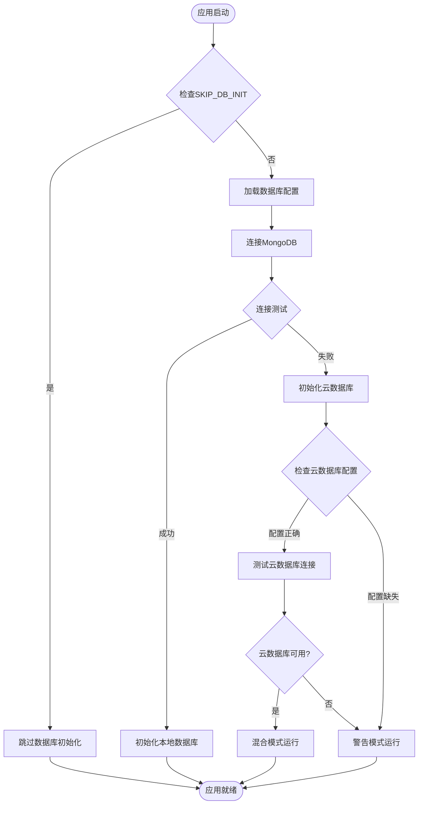
```mermaid
flowchart TD
Start([应用启动]) --> CheckSkip{"检查SKIP_DB_INIT"}
CheckSkip --> |是| SkipDB["跳过数据库初始化"]
CheckSkip --> |否| LoadEnv["加载数据库配置"]
LoadEnv --> ConnectMongo["连接MongoDB"]
ConnectMongo --> TestConnection{"连接测试"}
TestConnection --> |成功| InitLocalDB["初始化本地数据库"]
TestConnection --> |失败| InitCloudDB["初始化云数据库"]
InitCloudDB --> CloudConfig{"检查云数据库配置"}
CloudConfig --> |配置正确| TestCloud["测试云数据库连接"]
CloudConfig --> |配置缺失| WarnMode["警告模式运行"]
TestCloud --> CloudOK{"云数据库可用?"}
CloudOK --> |是| UseHybrid["混合模式运行"]
CloudOK --> |否| WarnMode
UseHybrid --> Ready([应用就绪])
InitLocalDB --> Ready
SkipDB --> Ready
WarnMode --> Ready
```

**图表来源**
- [app.py](file://app.py#L64-L88)
- [app.py](file://app.py#L121-L152)

**章节来源**
- [app.py](file://app.py#L64-L88)
- [app.py](file://app.py#L121-L152)

### 云数据库集成

系统实现了完整的微信云数据库集成方案，支持高并发和自动重试机制：

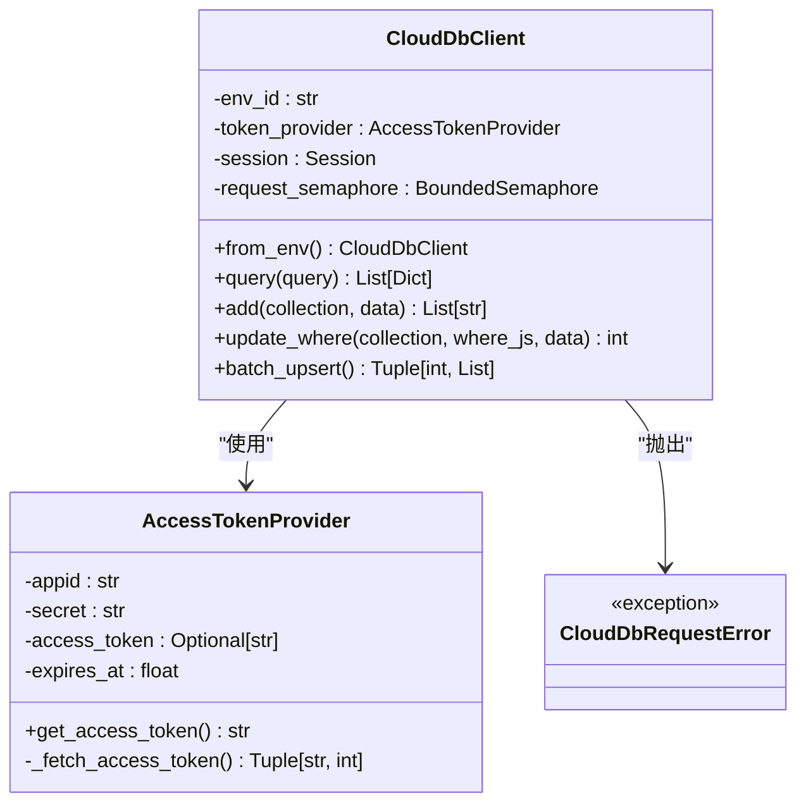
```mermaid
classDiagram
class CloudDbClient {
-env_id : str
-token_provider : AccessTokenProvider
-session : Session
-request_semaphore : BoundedSemaphore
+from_env() CloudDbClient
+query(query) List[Dict]
+add(collection, data) List[str]
+update_where(collection, where_js, data) int
+batch_upsert() Tuple[int, List]
}
class AccessTokenProvider {
-appid : str
-secret : str
-access_token : Optional[str]
-expires_at : float
+get_access_token() str
-_fetch_access_token() Tuple[str, int]
}
class CloudDbRequestError {
<<exception>>
}
CloudDbClient --> AccessTokenProvider : "使用"
CloudDbClient --> CloudDbRequestError : "抛出"
```

**图表来源**
- [services/cloud_db.py](file://services/cloud_db.py#L108-L208)
- [services/cloud_db.py](file://services/cloud_db.py#L36-L106)

**章节来源**
- [services/cloud_db.py](file://services/cloud_db.py#L108-L208)
- [services/cloud_db.py](file://services/cloud_db.py#L36-L106)

### CORS配置策略

系统实现了灵活的跨域资源共享配置，支持多域名和多方法的精细控制：

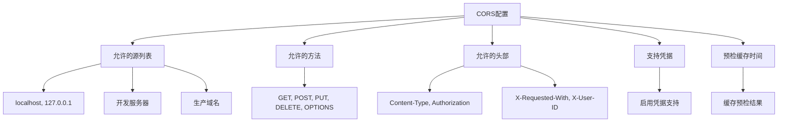
```mermaid
flowchart TD
Config[CORS配置] --> Origins["允许的源列表"]
Config --> Methods["允许的方法"]
Config --> Headers["允许的头部"]
Config --> Credentials["支持凭据"]
Config --> MaxAge["预检缓存时间"]
Origins --> Localhost["localhost, 127.0.0.1"]
Origins --> DevServer["开发服务器"]
Origins --> ProdDomain["生产域名"]
Methods --> CRUD["GET, POST, PUT, DELETE, OPTIONS"]
Headers --> Standard["Content-Type, Authorization"]
Headers --> Custom["X-Requested-With, X-User-ID"]
Credentials --> Enable["启用凭据支持"]
MaxAge --> Cache["缓存预检结果"]
```

**图表来源**
- [app.py](file://app.py#L168-L181)

**章节来源**
- [app.py](file://app.py#L168-L181)

### 错误处理机制

系统建立了多层次的错误处理体系，确保应用的稳定性和用户体验：

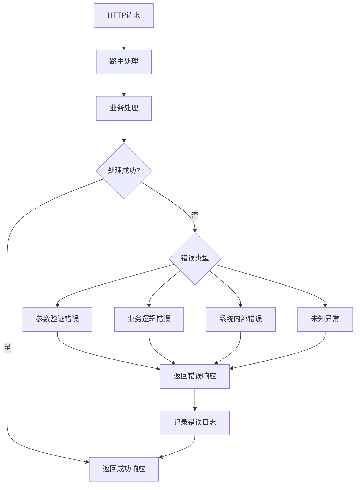
```mermaid
flowchart TD
Request[HTTP请求] --> Route[路由处理]
Route --> Handler[业务处理]
Handler --> Success{处理成功?}
Success --> |是| SuccessResp["返回成功响应"]
Success --> |否| ErrorType{"错误类型"}
ErrorType --> Validation["参数验证错误"]
ErrorType --> Business["业务逻辑错误"]
ErrorType --> System["系统内部错误"]
ErrorType --> Unknown["未知异常"]
Validation --> ErrorResp["返回错误响应"]
Business --> ErrorResp
System --> ErrorResp
Unknown --> ErrorResp
ErrorResp --> Log["记录错误日志"]
Log --> SuccessResp
```

**图表来源**
- [app.py](file://app.py#L252-L274)
- [backend_utils/response.py](file://backend_utils/response.py#L23-L32)

**章节来源**
- [app.py](file://app.py#L252-L274)
- [backend_utils/response.py](file://backend_utils/response.py#L23-L32)

### 日志记录系统

系统实现了完整的日志记录机制，支持控制台输出和文件持久化：

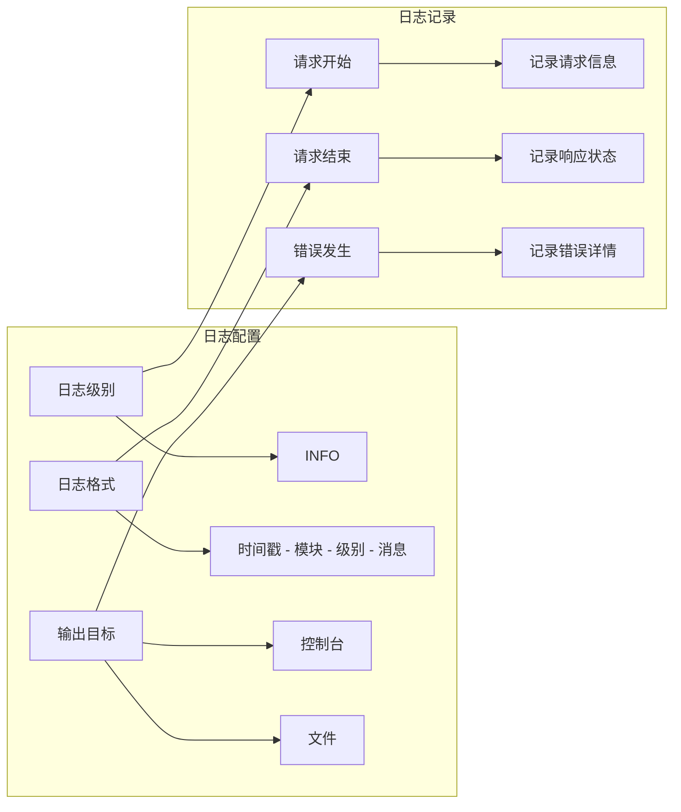
```mermaid
graph LR
subgraph "日志配置"
A[日志级别] --> B[INFO]
C[日志格式] --> D[时间戳 - 模块 - 级别 - 消息]
E[输出目标] --> F[控制台]
E --> G[文件]
end
subgraph "日志记录"
H[请求开始] --> I[记录请求信息]
J[请求结束] --> K[记录响应状态]
L[错误发生] --> M[记录错误详情]
end
A --> H
C --> J
E --> L
```

**图表来源**
- [app.py](file://app.py#L24-L35)

**章节来源**
- [app.py](file://app.py#L24-L35)

### 蓝图注册机制

系统采用蓝图(Buleprint)模式组织路由，实现清晰的功能模块分离：

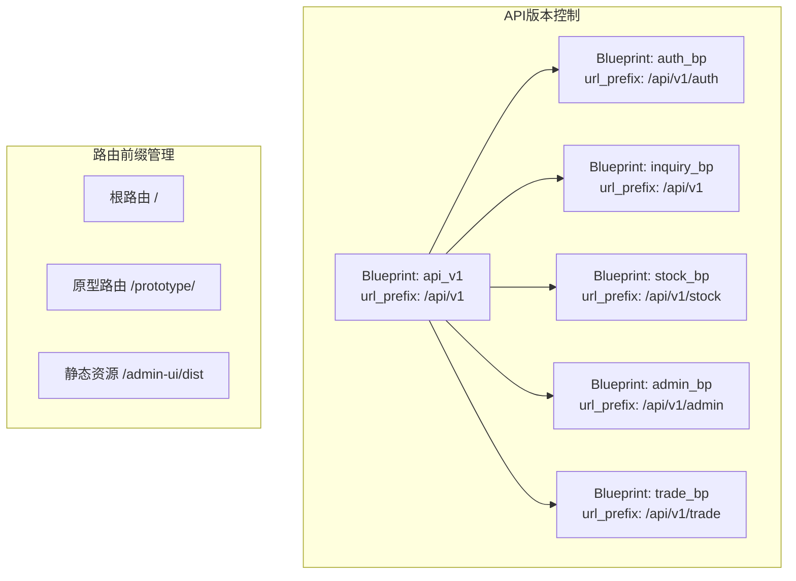
```mermaid
graph TB
subgraph "API版本控制"
V1[Blueprint: api_v1<br/>url_prefix: /api/v1]
Auth[Blueprint: auth_bp<br/>url_prefix: /api/v1/auth]
Inquiry[Blueprint: inquiry_bp<br/>url_prefix: /api/v1]
Stock[Blueprint: stock_bp<br/>url_prefix: /api/v1/stock]
Admin[Blueprint: admin_bp<br/>url_prefix: /api/v1/admin]
Trade[Blueprint: trade_bp<br/>url_prefix: /api/v1/trade]
end
subgraph "路由前缀管理"
Root[根路由 /]
Prototype[原型路由 /prototype/]
Static[静态资源 /admin-ui/dist]
end
V1 --> Auth
V1 --> Inquiry
V1 --> Stock
V1 --> Admin
V1 --> Trade
```

**图表来源**
- [app.py](file://app.py#L183-L209)

**章节来源**
- [app.py](file://app.py#L183-L209)

### 静态资源服务

系统提供了完整的静态资源服务，支持React前端应用的托管：

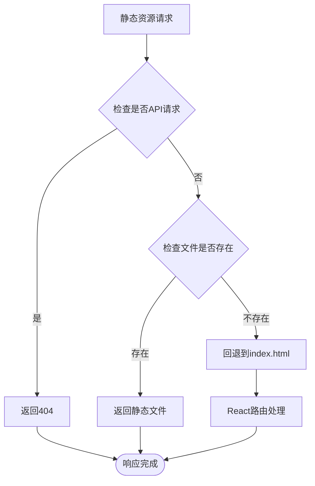
```mermaid
flowchart TD
Request[静态资源请求] --> CheckAPI{"检查是否API请求"}
CheckAPI --> |是| NotFound["返回404"]
CheckAPI --> |否| CheckFile{"检查文件是否存在"}
CheckFile --> |存在| ServeFile["返回静态文件"]
CheckFile --> |不存在| Fallback["回退到index.html"]
Fallback --> ReactRoute["React路由处理"]
ServeFile --> End([响应完成])
NotFound --> End
ReactRoute --> End
```

**图表来源**
- [app.py](file://app.py#L226-L250)

**章节来源**
- [app.py](file://app.py#L226-L250)

### 环境变量加载策略

系统实现了灵活的环境变量加载机制，支持多环境配置：

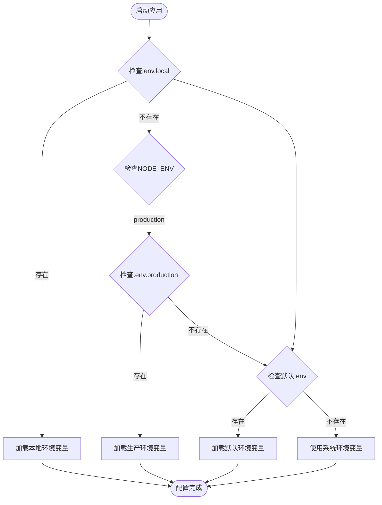
```mermaid
flowchart TD
Start([启动应用]) --> CheckLocal{"检查.env.local"}
CheckLocal --> |存在| LoadLocal["加载本地环境变量"]
CheckLocal --> |不存在| CheckNodeEnv{"检查NODE_ENV"}
CheckNodeEnv --> |production| CheckProd{"检查.env.production"}
CheckProd --> |存在| LoadProd["加载生产环境变量"]
CheckProd --> |不存在| CheckDefault{"检查默认.env"}
CheckLocal --> CheckDefault
CheckDefault --> |存在| LoadDefault["加载默认环境变量"]
CheckDefault --> |不存在| LoadSystem["使用系统环境变量"]
LoadLocal --> End([配置完成])
LoadProd --> End
LoadDefault --> End
LoadSystem --> End
```

**图表来源**
- [app.py](file://app.py#L37-L57)

**章节来源**
- [app.py](file://app.py#L37-L57)
- [.env.example](file://.env.example#L1-L50)

### 端口解析逻辑

系统提供了智能的端口解析机制，支持开发和生产的差异化配置：

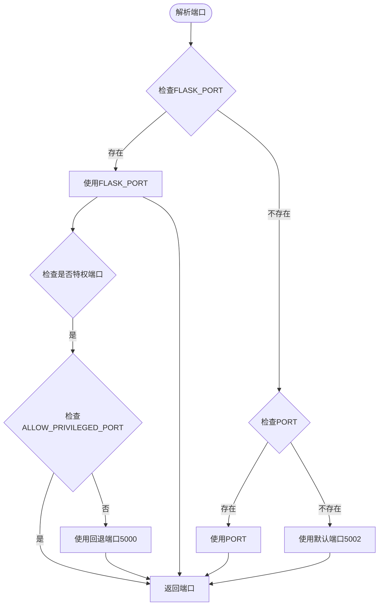
```mermaid
flowchart TD
Start([解析端口]) --> CheckFlaskPort{"检查FLASK_PORT"}
CheckFlaskPort --> |存在| UseFlaskPort["使用FLASK_PORT"]
CheckFlaskPort --> |不存在| CheckPort{"检查PORT"}
CheckPort --> |存在| UsePort["使用PORT"]
CheckPort --> |不存在| UseDefault["使用默认端口5002"]
UseFlaskPort --> CheckPrivPort{"检查是否特权端口"}
CheckPrivPort --> |是| CheckEnv{"检查ALLOW_PRIVILEGED_PORT"}
CheckEnv --> |是| ReturnPort["返回端口"]
CheckEnv --> |否| UseFallback["使用回退端口5000"]
UseFlaskPort --> ReturnPort
UsePort --> ReturnPort
UseDefault --> ReturnPort
UseFallback --> ReturnPort
```

**图表来源**
- [app.py](file://app.py#L90-L100)

**章节来源**
- [app.py](file://app.py#L90-L100)

### 后台调度器启动

系统实现了自动化的后台任务调度机制，支持定时行情同步：

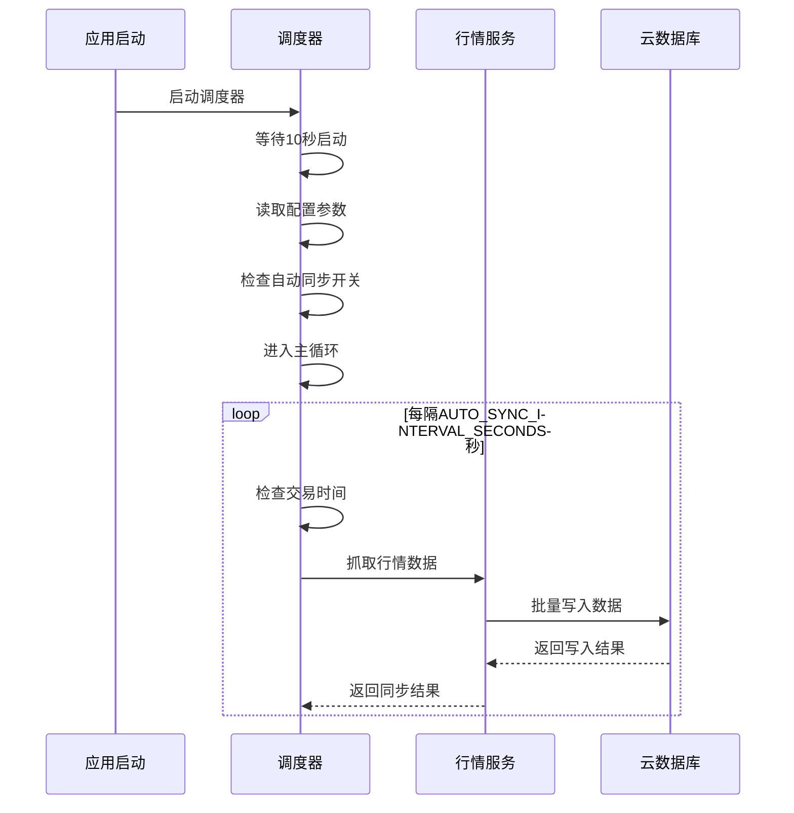
```mermaid
sequenceDiagram
participant App as 应用启动
participant Scheduler as 调度器
participant QuoteService as 行情服务
participant CloudDB as 云数据库
App->>Scheduler : 启动调度器
Scheduler->>Scheduler : 等待10秒启动
Scheduler->>Scheduler : 读取配置参数
Scheduler->>Scheduler : 检查自动同步开关
Scheduler->>Scheduler : 进入主循环
loop 每隔AUTO_SYNC_INTERVAL_SECONDS秒
Scheduler->>Scheduler : 检查交易时间
Scheduler->>QuoteService : 抓取行情数据
QuoteService->>CloudDB : 批量写入数据
CloudDB-->>QuoteService : 返回写入结果
QuoteService-->>Scheduler : 返回同步结果
end
```

**图表来源**
- [app.py](file://app.py#L279-L330)
- [services/sync_service.py](file://services/sync_service.py#L241-L265)

**章节来源**
- [app.py](file://app.py#L279-L330)
- [services/sync_service.py](file://services/sync_service.py#L241-L265)

## 架构概览

系统采用分层架构设计，各层职责明确，耦合度低：

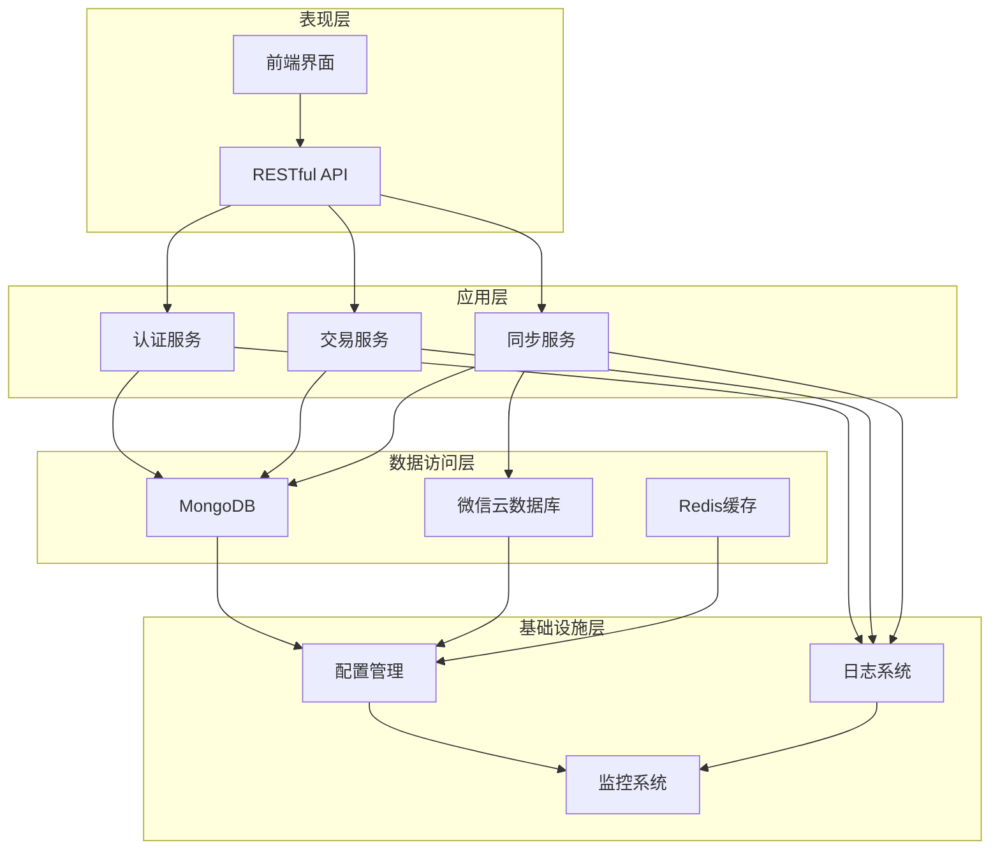
```mermaid
graph TB
subgraph "表现层"
UI[前端界面]
API[RESTful API]
end
subgraph "应用层"
Auth[认证服务]
Trade[交易服务]
Sync[同步服务]
end
subgraph "数据访问层"
Mongo[MongoDB]
CloudDB[微信云数据库]
Cache[Redis缓存]
end
subgraph "基础设施层"
Config[配置管理]
Log[日志系统]
Monitor[监控系统]
end
UI --> API
API --> Auth
API --> Trade
API --> Sync
Auth --> Mongo
Trade --> Mongo
Sync --> CloudDB
Sync --> Mongo
Mongo --> Config
CloudDB --> Config
Cache --> Config
Auth --> Log
Trade --> Log
Sync --> Log
Config --> Monitor
Log --> Monitor
```

**图表来源**
- [app.py](file://app.py#L103-L166)
- [services/trade_service.py](file://services/trade_service.py#L8-L34)

## 详细组件分析

### 认证与授权系统

系统实现了完整的认证授权机制，支持多种登录方式和权限控制：

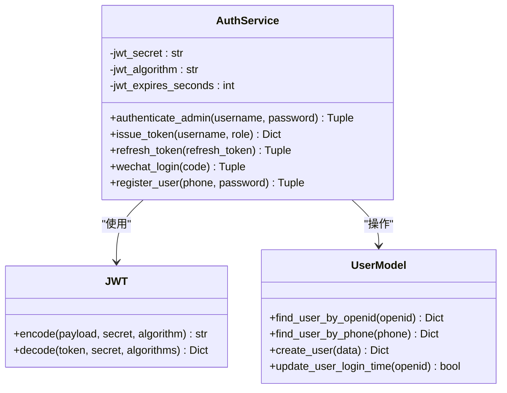
```mermaid
classDiagram
class AuthService {
-jwt_secret : str
-jwt_algorithm : str
-jwt_expires_seconds : int
+authenticate_admin(username, password) Tuple
+issue_token(username, role) Dict
+refresh_token(refresh_token) Tuple
+wechat_login(code) Tuple
+register_user(phone, password) Tuple
}
class JWT {
+encode(payload, secret, algorithm) str
+decode(token, secret, algorithms) Dict
}
class UserModel {
+find_user_by_openid(openid) Dict
+find_user_by_phone(phone) Dict
+create_user(data) Dict
+update_user_login_time(openid) bool
}
AuthService --> JWT : "使用"
AuthService --> UserModel : "操作"
```

**图表来源**
- [services/auth_service.py](file://services/auth_service.py#L14-L44)
- [routes/auth.py](file://routes/auth.py#L33-L54)

**章节来源**
- [services/auth_service.py](file://services/auth_service.py#L14-L44)
- [routes/auth.py](file://routes/auth.py#L33-L54)

### 业务服务层

交易服务封装了复杂的业务逻辑，提供了统一的接口：

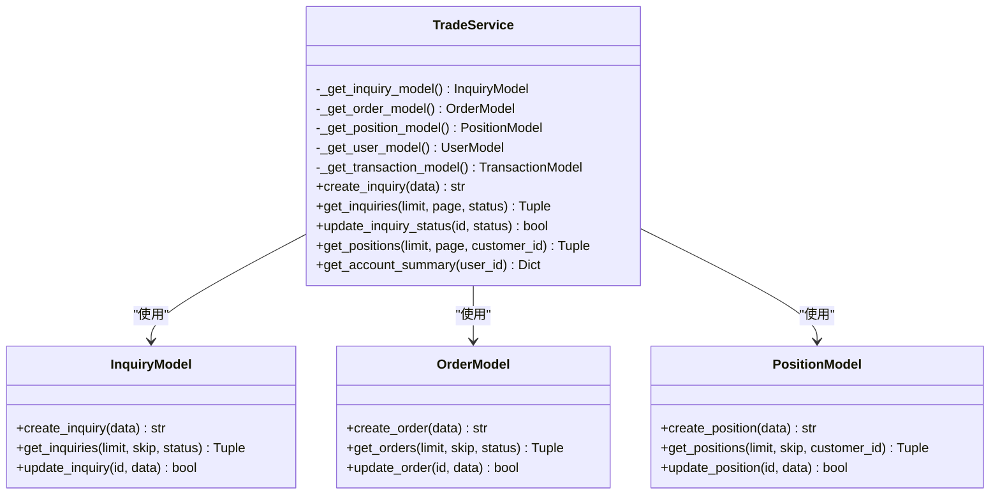
```mermaid
classDiagram
class TradeService {
-_get_inquiry_model() InquiryModel
-_get_order_model() OrderModel
-_get_position_model() PositionModel
-_get_user_model() UserModel
-_get_transaction_model() TransactionModel
+create_inquiry(data) str
+get_inquiries(limit, page, status) Tuple
+update_inquiry_status(id, status) bool
+get_positions(limit, page, customer_id) Tuple
+get_account_summary(user_id) Dict
}
class InquiryModel {
+create_inquiry(data) str
+get_inquiries(limit, skip, status) Tuple
+update_inquiry(id, data) bool
}
class OrderModel {
+create_order(data) str
+get_orders(limit, skip, status) Tuple
+update_order(id, data) bool
}
class PositionModel {
+create_position(data) str
+get_positions(limit, skip, customer_id) Tuple
+update_position(id, data) bool
}
TradeService --> InquiryModel : "使用"
TradeService --> OrderModel : "使用"
TradeService --> PositionModel : "使用"
```

**图表来源**
- [services/trade_service.py](file://services/trade_service.py#L8-L34)
- [models/inquiry.py](file://models/inquiry.py#L10-L23)

**章节来源**
- [services/trade_service.py](file://services/trade_service.py#L8-L34)
- [models/inquiry.py](file://models/inquiry.py#L10-L23)

### 数据模型层

系统实现了灵活的数据模型抽象，支持本地和云端数据源：

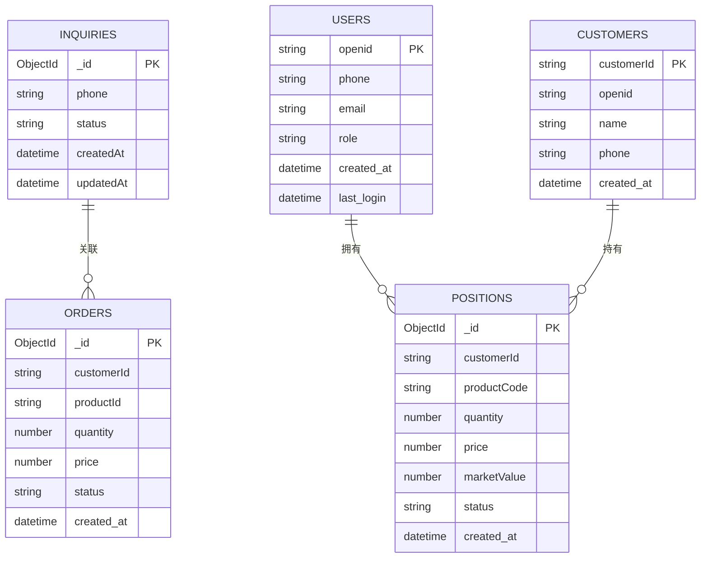
```mermaid
erDiagram
INQUIRIES {
ObjectId _id PK
string phone
string status
datetime createdAt
datetime updatedAt
}
USERS {
string openid PK
string phone
string email
string role
datetime created_at
datetime last_login
}
ORDERS {
ObjectId _id PK
string customerId
string productId
number quantity
number price
string status
datetime created_at
}
POSITIONS {
ObjectId _id PK
string customerId
string productCode
number quantity
number price
number marketValue
string status
datetime created_at
}
CUSTOMERS {
string customerId PK
string openid
string name
string phone
datetime created_at
}
INQUIRIES ||--o{ ORDERS : "关联"
USERS ||--o{ POSITIONS : "拥有"
CUSTOMERS ||--o{ POSITIONS : "持有"
```

**图表来源**
- [models/inquiry.py](file://models/inquiry.py#L32-L53)

**章节来源**
- [models/inquiry.py](file://models/inquiry.py#L32-L53)

### API路由设计

系统采用RESTful API设计原则，提供了清晰的资源访问接口：

```mermaid
graph LR
subgraph "认证相关"
A1[/api/v1/auth/login]
A2[/api/v1/auth/me]
A3[/api/v1/auth/register]
A4[/api/v1/auth/wechat/login]
end
subgraph "询价管理"
B1[/api/v1/inquiry]
B2[/api/v1/admin/inquiries]
B3[/api/v1/admin/inquiries/<id>/status]
B4[/api/v1/admin/inquiries/statistics]
end
subgraph "交易相关"
C1[/api/v1/trade/orders]
C2[/api/v1/trade/positions]
C3[/api/v1/trade/account]
end
subgraph "股票数据"
D1[/api/v1/stock/quotes]
D2[/api/v1/stock/codes]
end
A1 --> B1
B2 --> C1
C2 --> D1
```

**图表来源**
- [routes/auth.py](file://routes/auth.py#L74-L96)
- [routes/inquiry.py](file://routes/inquiry.py#L11-L34)

**章节来源**
- [routes/auth.py](file://routes/auth.py#L74-L96)
- [routes/inquiry.py](file://routes/inquiry.py#L11-L34)

## 依赖关系分析

系统依赖关系清晰，遵循依赖倒置原则：

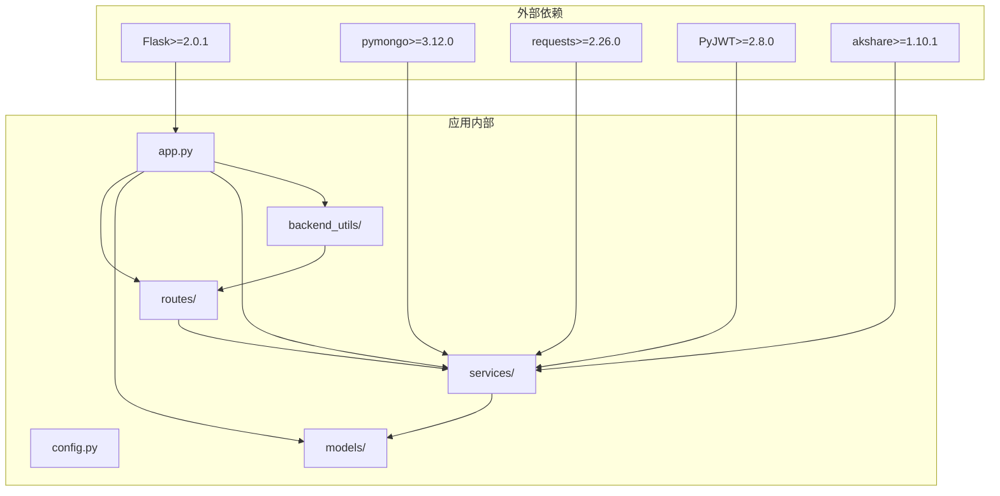
```mermaid
graph TB
subgraph "外部依赖"
Flask[Flask>=2.0.1]
PyMongo[pymongo>=3.12.0]
Requests[requests>=2.26.0]
JWT[PyJWT>=2.8.0]
AkShare[akshare>=1.10.1]
end
subgraph "应用内部"
App[app.py]
Config[config.py]
Utils[backend_utils/]
Services[services/]
Models[models/]
Routes[routes/]
end
Flask --> App
PyMongo --> Services
Requests --> Services
JWT --> Services
AkShare --> Services
App --> Utils
App --> Services
App --> Models
App --> Routes
Services --> Models
Routes --> Services
Utils --> Routes
```

**图表来源**
- [requirements.txt](file://requirements.txt#L1-L12)

**章节来源**
- [requirements.txt](file://requirements.txt#L1-L12)

## 性能考虑

### 数据库性能优化

系统采用了多种数据库性能优化策略：

1. **连接池管理**：MongoDB连接设置超时时间为1秒，避免长时间阻塞
2. **索引优化**：为常用查询字段建立索引，如createdAt、status、phone等
3. **查询优化**：使用投影和分页减少数据传输量
4. **批量操作**：云数据库支持批量插入和更新操作

### 缓存策略

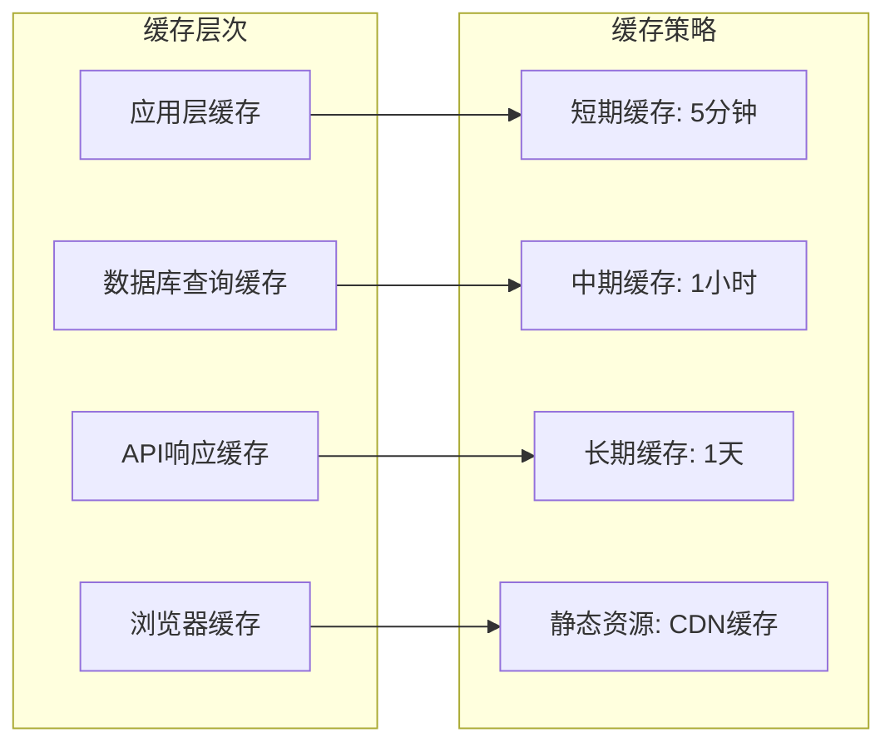
```mermaid
graph LR
subgraph "缓存层次"
A[应用层缓存]
B[数据库查询缓存]
C[API响应缓存]
D[浏览器缓存]
end
subgraph "缓存策略"
E[短期缓存: 5分钟]
F[中期缓存: 1小时]
G[长期缓存: 1天]
H[静态资源: CDN缓存]
end
A --> E
B --> F
C --> G
D --> H
```

### 并发处理

系统支持高并发处理，采用以下策略：

1. **线程池管理**：使用ThreadPoolExecutor处理并发请求
2. **信号量控制**：限制同时进行的数据库操作数量
3. **异步任务**：后台定时任务独立运行，不影响主线程
4. **连接池复用**：HTTP请求连接池复用，减少连接开销

## 故障排除指南

### 常见问题诊断

#### 数据库连接问题

**症状**：应用启动时报数据库连接失败

**诊断步骤**：
1. 检查MONGO_URI配置是否正确
2. 验证MongoDB服务是否正常运行
3. 确认网络连接和防火墙设置
4. 查看详细的错误日志信息

**解决方案**：
```bash
# 检查MongoDB连接
mongosh mongodb://localhost:27017/option_data

# 查看应用日志
tail -f server.log
```

#### 云数据库配置问题

**症状**：微信云数据库初始化失败

**诊断步骤**：
1. 验证WX_CLOUD_ENV、WX_APPID、WX_SECRET配置
2. 检查微信云开发环境是否正确配置
3. 确认SSL证书验证设置
4. 查看具体的错误信息

**解决方案**：
```bash
# 验证环境变量
echo $WX_CLOUD_ENV
echo $WX_APPID
echo $WX_SECRET

# 检查网络连通性
curl -I https://api.weixin.qq.com/cgi-bin/token
```

#### CORS跨域问题

**症状**：前端请求被浏览器拦截

**诊断步骤**：
1. 检查ALLOWED_ORIGINS配置
2. 验证请求头是否包含必要的认证信息
3. 确认预检请求是否正确处理

**解决方案**：
```javascript
// 前端请求示例
fetch('http://localhost:5000/api/v1/auth/login', {
    method: 'POST',
    credentials: 'include', // 关键：包含凭据
    headers: {
        'Content-Type': 'application/json',
        'Authorization': 'Bearer ' + token
    }
});
```

#### 性能问题

**症状**：API响应缓慢

**诊断步骤**：
1. 检查数据库查询执行计划
2. 监控CPU和内存使用情况
3. 分析慢查询日志
4. 评估并发连接数

**优化建议**：
```python
# 添加数据库索引
db.inquiries.create_index("createdAt")
db.inquiries.create_index("status")

# 优化查询条件
query = {"status": "pending", "createdAt": {"$gte": start_date}}
cursor = db.inquiries.find(query).sort("createdAt", -1).limit(20)
```

### 日志分析

系统提供了详细的日志记录，便于问题诊断：

```mermaid
flowchart TD
LogStart[日志开始] --> Level{"日志级别"}
Level --> Info["INFO<br/>一般信息"]
Level --> Warning["WARNING<br/>警告信息"]
Level --> Error["ERROR<br/>错误信息"]
Level --> Debug["DEBUG<br/>调试信息"]
Info --> Console["控制台输出"]
Warning --> Console
Error --> Console
Debug --> Console
Info --> File["文件记录"]
Warning --> File
Error --> File
Debug --> File
File --> Rotate["文件轮转"]
Rotate --> Archive["归档保存"]
```

**章节来源**
- [app.py](file://app.py#L24-L35)
- [services/cloud_db.py](file://services/cloud_db.py#L209-L248)

## 结论

该Flask应用展现了现代Web应用开发的最佳实践，具有以下特点：

**架构优势**：
- 清晰的分层架构，职责分离明确
- 支持多数据源的混合架构设计
- 完善的错误处理和日志记录机制
- 灵活的配置管理策略

**技术亮点**：
- 自定义JSON序列化器解决特殊数据类型
- 智能的数据库连接管理和故障转移
- 高并发的云数据库客户端实现
- 完整的认证授权体系

**扩展性**：
- 模块化的代码组织便于功能扩展
- 插件化的服务架构支持新功能集成
- 标准化的API设计便于前端对接

**部署友好**：
- 支持Docker容器化部署
- 灵活的环境配置适应不同部署场景
- 完善的监控和日志系统

该应用为场外期权交易系统提供了坚实的技术基础，具备良好的可维护性和扩展性。

## 附录

### 环境变量参考

| 变量名 | 类型 | 必需 | 默认值 | 说明 |
|--------|------|------|--------|------|
| NODE_ENV | string | 否 | development | 应用环境 |
| FLASK_PORT | int | 否 | 5002 | Flask服务端口 |
| MONGO_URI | string | 否 | mongodb://localhost:27017/option_data | MongoDB连接字符串 |
| DATABASE_NAME | string | 否 | option_trading | 数据库名称 |
| JWT_SECRET | string | 是 | - | JWT密钥 |
| JWT_ALGORITHM | string | 否 | HS256 | JWT算法 |
| JWT_EXPIRES_SECONDS | int | 否 | 86400 | JWT过期时间 |
| WX_APPID | string | 否 | - | 微信应用ID |
| WX_SECRET | string | 否 | - | 微信应用密钥 |
| WX_CLOUD_ENV | string | 否 | - | 微信云环境ID |

### 部署建议

1. **生产环境配置**：
   - 使用HTTPS协议
   - 配置反向代理服务器
   - 设置适当的超时参数
   - 启用Gunicorn进程管理

2. **监控配置**：
   - 集成APM监控工具
   - 设置告警规则
   - 定期备份数据库
   - 监控系统资源使用

3. **安全加固**：
   - 定期更换JWT密钥
   - 实施输入验证和清理
   - 配置防火墙规则
   - 启用WAF防护