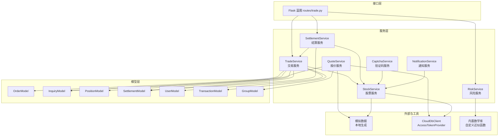
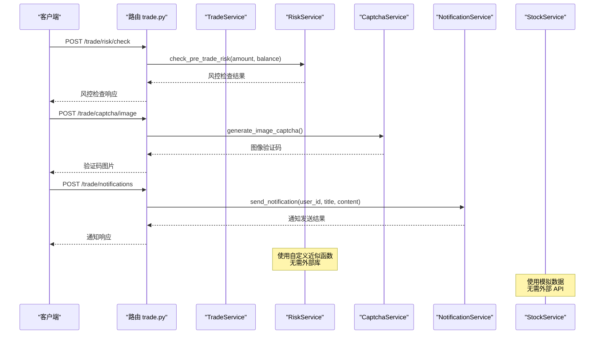
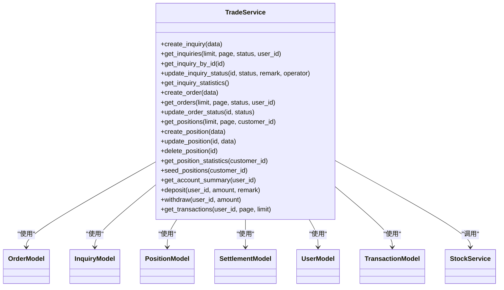
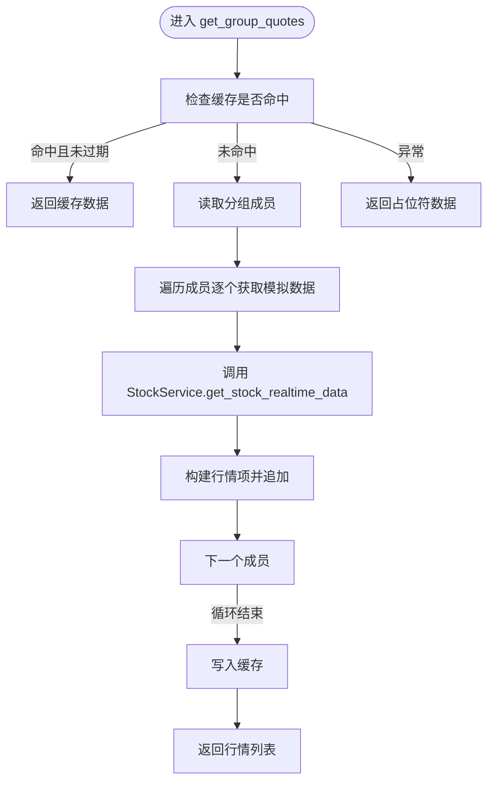
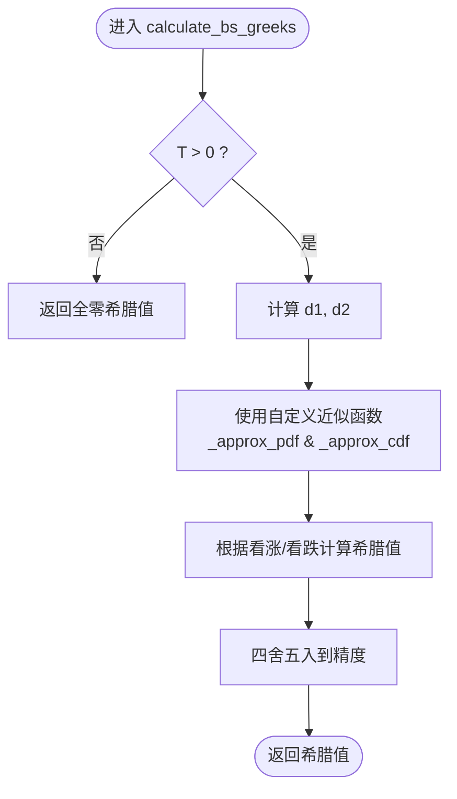
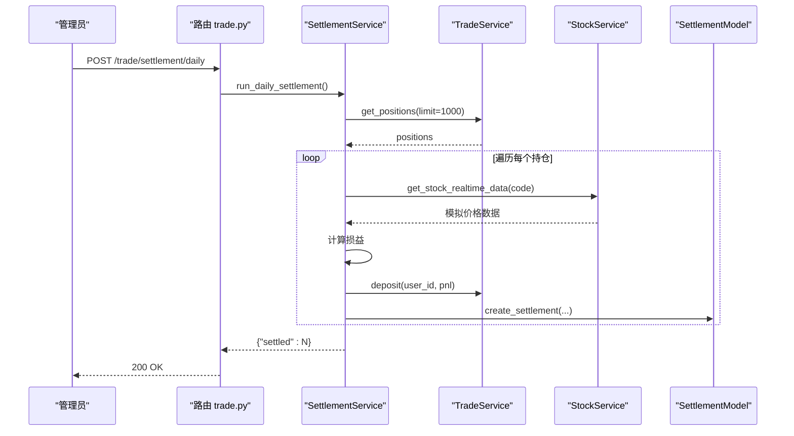
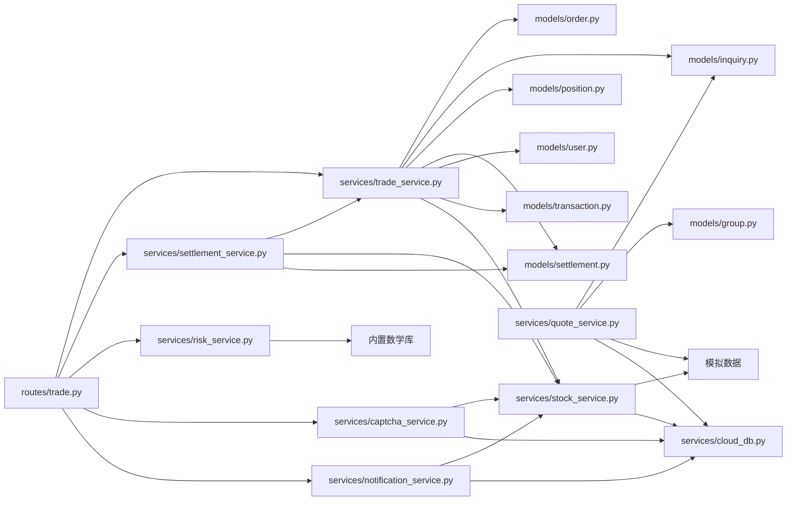

# 业务服务层

<cite>
**本文引用的文件**
- [services/trade_service.py](file://services/trade_service.py)
- [services/quote_service.py](file://services/quote_service.py)
- [services/risk_service.py](file://services/risk_service.py)
- [services/settlement_service.py](file://services/settlement_service.py)
- [services/captcha_service.py](file://services/captcha_service.py)
- [services/notification_service.py](file://services/notification_service.py)
- [services/stock_service.py](file://services/stock_service.py)
- [routes/trade.py](file://routes/trade.py)
- [models/order.py](file://models/order.py)
- [models/inquiry.py](file://models/inquiry.py)
- [models/position.py](file://models/position.py)
- [models/settlement.py](file://models/settlement.py)
- [models/user.py](file://models/user.py)
- [models/transaction.py](file://models/transaction.py)
- [models/group.py](file://models/group.py)
- [services/cloud_db.py](file://services/cloud_db.py)
- [__tests__/inquiry-logic.test.js](file://__tests__/inquiry-logic.test.js)
</cite>

## 更新摘要
**所做更改**
- 移除了对 akshare 依赖的完全重构：StockService、QuoteService 和 SinaCrawler 模块已重构为使用模拟数据而非外部 API
- 删除了复杂的 akshare 批量处理和错误处理机制，简化为本地模拟数据生成
- **新增**：风险服务模块已更新为使用自定义数学近似函数，移除了外部科学计算库依赖
- 更新了服务层架构图以反映移除外部依赖后的简化结构
- 调整了性能考虑和故障排查指南以适应新的模拟数据架构

## 目录
1. [简介](#简介)
2. [项目结构](#项目结构)
3. [核心组件](#核心组件)
4. [架构总览](#架构总览)
5. [详细组件分析](#详细组件分析)
6. [依赖分析](#依赖分析)
7. [性能考虑](#性能考虑)
8. [故障排查指南](#故障排查指南)
9. [结论](#结论)
10. [附录](#附录)

## 简介
本文件面向"业务服务层"的架构与实现，系统性阐述服务层设计模式、依赖注入与业务逻辑封装方式；重点覆盖交易服务、报价服务、风险服务、结算服务、验证码服务和通知服务的核心实现；文档化服务间协作关系、数据流与异常处理机制；给出单元测试策略、Mock 对象使用与集成测试方案；并提供性能优化、缓存策略、并发处理最佳实践，以及监控、日志与错误追踪建议，最后讨论扩展点、插件机制与第三方集成。

**更新** 本版本反映了对 akshare 依赖的完全移除，服务层现在使用模拟数据替代真实的外部 API 调用，简化了架构并提高了部署的稳定性。**新增** 风险服务模块已完全移除对外部科学计算库的依赖，采用自定义数学近似函数实现正态分布的概率密度函数和累积分布函数计算。

## 项目结构
业务服务层位于后端 Python 代码树中，围绕 Flask 路由层暴露 REST 接口，服务层通过模型层访问本地 MongoDB 或微信云开发数据库。由于移除了 akshare 依赖，新增的验证码服务和通知服务为系统提供了基础的认证和通信能力。**新增** 风险服务现在使用内置的数学库和自定义近似函数，无需额外的科学计算依赖。

**图表来源**
- [routes/trade.py](file://routes/trade.py#L1-L330)
- [services/trade_service.py](file://services/trade_service.py#L1-L318)
- [services/quote_service.py](file://services/quote_service.py#L1-L91)
- [services/risk_service.py](file://services/risk_service.py#L1-L71)
- [services/settlement_service.py](file://services/settlement_service.py#L1-L113)
- [services/captcha_service.py](file://services/captcha_service.py#L1-L52)
- [services/notification_service.py](file://services/notification_service.py#L1-L16)
- [services/stock_service.py](file://services/stock_service.py#L1-L122)
- [models/order.py](file://models/order.py#L1-L119)
- [models/inquiry.py](file://models/inquiry.py#L1-L148)
- [models/position.py](file://models/position.py#L1-L206)
- [models/settlement.py](file://models/settlement.py#L1-L57)
- [models/user.py](file://models/user.py#L1-L309)
- [models/transaction.py](file://models/transaction.py#L1-L61)
- [models/group.py](file://models/group.py#L1-L283)
- [services/cloud_db.py](file://services/cloud_db.py#L1-L533)

**章节来源**
- [routes/trade.py](file://routes/trade.py#L1-L330)

## 核心组件
- 交易服务（TradeService）
  - 负责询价、订单、持仓、账户与资金流水等业务编排
  - 支持本地数据库与微信云数据库双形态
  - 内嵌对股票服务的实时行情调用以动态更新持仓估值
  - 新增账户资金管理功能，包括余额查询、充值、提现和交易流水
- 报价服务（QuoteService）
  - 分组内股票批量行情获取与缓存
  - 使用 StockService 的模拟数据替代 akshare 批量接口
  - 支持分组模型的成员管理
- 风险服务（RiskService）
  - **更新**：Black-Scholes 希腊值计算，完全移除外部科学计算库依赖
  - 使用自定义数学近似函数计算正态分布的概率密度函数和累积分布函数
  - 交易前风控校验（余额、限额等）
  - 新增预交易风险检查功能
- 结算服务（SettlementService）
  - 日常到期结算流程编排
  - 调用交易与股票服务完成损益计算与资金入账
  - 支持期权到期自动结算
- 验证码服务（CaptchaService）
  - 短信验证码生成与发送
  - 图像验证码生成与验证
  - 支持短信和邮件通知
- 通知服务（NotificationService）
  - 通用通知发送接口
  - 支持多种通知渠道（微信、邮件等）
- 股票服务（StockService）
  - A 股实时/历史行情获取（使用模拟数据）
  - 询价报价比较与最低报价检索
  - **更新**：完全移除 akshare 依赖，使用本地模拟数据生成

**章节来源**
- [services/trade_service.py](file://services/trade_service.py#L1-L318)
- [services/quote_service.py](file://services/quote_service.py#L1-L91)
- [services/risk_service.py](file://services/risk_service.py#L1-L71)
- [services/settlement_service.py](file://services/settlement_service.py#L1-L113)
- [services/captcha_service.py](file://services/captcha_service.py#L1-L52)
- [services/notification_service.py](file://services/notification_service.py#L1-L16)
- [services/stock_service.py](file://services/stock_service.py#L1-L122)
- [models/order.py](file://models/order.py#L1-L119)
- [models/inquiry.py](file://models/inquiry.py#L1-L148)
- [models/position.py](file://models/position.py#L1-L206)
- [models/settlement.py](file://models/settlement.py#L1-L57)
- [models/user.py](file://models/user.py#L1-L309)
- [models/transaction.py](file://models/transaction.py#L1-L61)
- [models/group.py](file://models/group.py#L1-L283)
- [services/cloud_db.py](file://services/cloud_db.py#L1-L533)

## 架构总览
服务层采用"路由层-服务层-模型层-外部系统"四层结构，服务层负责业务编排与跨模型协调，模型层屏蔽数据库差异。**更新**：由于移除了 akshare 依赖，外部系统现在只包含模拟数据生成和微信云 API，简化了架构并提高了系统的稳定性和可部署性。**新增** 风险服务现在完全依赖内置数学库和自定义近似函数，无需任何外部科学计算库。

**图表来源**
- [routes/trade.py](file://routes/trade.py#L18-L52)
- [services/risk_service.py](file://services/risk_service.py#L63-L71)
- [services/captcha_service.py](file://services/captcha_service.py#L14-L36)
- [services/notification_service.py](file://services/notification_service.py#L9-L15)

**章节来源**
- [routes/trade.py](file://routes/trade.py#L1-L330)

## 详细组件分析

### 交易服务（TradeService）
- 设计模式
  - 服务编排：集中处理业务流程（询价、订单、持仓、账户、资金）
  - 依赖注入：通过 Flask current_app 注入 db/cloud_db，支持本地与云数据库无缝切换
  - 模型工厂：按需构造模型实例，统一处理时间戳与索引
- 关键职责
  - 询价：创建、分页查询、按状态统计、更新状态
  - 订单：创建、分页查询、状态更新
  - 持仓：创建、更新、删除、分页查询、统计、批量生成测试数据
  - 账户与资金：账户汇总、充值、提现、资金流水
  - 实时行情联动：在查询持仓时拉取实时价格并计算市值与盈亏
- 异常处理
  - 持仓创建/更新时对数值字段做类型转换与默认值处理
  - 行情拉取失败时记录日志并跳过，保证主流程可用
- 性能与并发
  - 持仓查询阶段逐条调用股票服务，存在 N 次远程调用风险；建议批量获取后合并
  - 可引入线程池或异步队列提升批量行情拉取吞吐

**图表来源**
- [services/trade_service.py](file://services/trade_service.py#L1-L318)
- [models/order.py](file://models/order.py#L1-L119)
- [models/inquiry.py](file://models/inquiry.py#L1-L148)
- [models/position.py](file://models/position.py#L1-L206)
- [models/settlement.py](file://models/settlement.py#L1-L57)
- [models/user.py](file://models/user.py#L1-L309)
- [models/transaction.py](file://models/transaction.py#L1-L61)
- [services/stock_service.py](file://services/stock_service.py#L1-L122)

**章节来源**
- [services/trade_service.py](file://services/trade_service.py#L1-L318)

### 报价服务（QuoteService）
- 设计模式
  - 简单工厂：按需获取分组模型
  - 本地缓存：基于内存字典与 TTL 控制，减少重复请求
  - **更新**：移除了 akshare 批量接口的复杂处理逻辑，简化为直接调用 StockService 的模拟数据
- 关键职责
  - 获取分组内股票的实时行情列表
  - 缓存命中则直接返回，未命中则调用 StockService 获取模拟数据
  - 失败回退：模拟数据获取失败时返回占位符数据
- 性能与并发
  - **更新**：移除了 akshare 批量调用的复杂逻辑，简化为直接的模拟数据生成
  - 可结合线程池或协程进一步提升吞吐

**图表来源**
- [services/quote_service.py](file://services/quote_service.py#L28-L91)
- [services/stock_service.py](file://services/stock_service.py#L24-L38)

**章节来源**
- [services/quote_service.py](file://services/quote_service.py#L1-L91)

### 风险服务（RiskService）
- 设计模式
  - 纯函数风格：希腊值计算与风控校验均为无状态方法
  - **更新**：数学计算完全自包含，无需外部依赖
- 关键职责
  - **更新**：Black-Scholes 希腊值计算，使用自定义数学近似函数
  - 正态分布概率密度函数近似：使用标准正态分布 PDF 公式
  - 正态分布累积分布函数近似：使用 sigmoid 函数近似误差函数
  - 交易前风控：余额校验与限额检查（预留扩展点）
- 数学近似函数
  - **新增**：_approx_pdf(x)：使用标准正态分布 PDF 公式 exp(-0.5*x²)/sqrt(2π)
  - **新增**：_approx_cdf(x)：使用 sigmoid 近似 1/(1+exp(-1.702*x))
  - **更新**：完全移除对 scipy.stats.norm 的依赖
- 性能与并发
  - 计算复杂度低，适合在路由层直接调用
  - 可缓存常用参数组合以减少重复计算
  - **新增**：数学函数使用内置 math 库，性能优于外部库调用

**图表来源**
- [services/risk_service.py](file://services/risk_service.py#L21-L61)

**章节来源**
- [services/risk_service.py](file://services/risk_service.py#L1-L71)

### 结算服务（SettlementService）
- 设计模式
  - 服务编排：调度交易与股票服务完成到期结算
  - 事务性思路：先计算损益，再入账，最后记录结算记录
- 关键职责
  - 扫描活跃持仓，识别到期并结算
  - 获取标的实时价格（使用模拟数据），计算损益并入账
  - 创建结算记录，记录日志
- 性能与并发
  - 当前仅扫描前若干条，建议增加分页或游标迭代
  - 可引入队列异步处理大批量结算

**图表来源**
- [routes/trade.py](file://routes/trade.py#L54-L63)
- [services/settlement_service.py](file://services/settlement_service.py#L21-L60)
- [services/trade_service.py](file://services/trade_service.py#L281-L310)
- [services/stock_service.py](file://services/stock_service.py#L24-L38)
- [models/settlement.py](file://models/settlement.py#L18-L41)

**章节来源**
- [services/settlement_service.py](file://services/settlement_service.py#L1-L113)

### 验证码服务（CaptchaService）
- 设计模式
  - 工具类：提供静态方法生成验证码和发送通知
  - 优雅降级：当依赖库不可用时提供模拟实现
- 关键职责
  - 短信验证码：生成指定长度的数字验证码
  - 图像验证码：生成图像验证码（支持依赖库缺失时的降级）
  - 通知发送：模拟短信和邮件发送（生产环境需集成实际服务）
- 性能与并发
  - 生成过程轻量，适合高并发场景
  - 建议配合缓存机制避免重复生成

**章节来源**
- [services/captcha_service.py](file://services/captcha_service.py#L1-L52)

### 通知服务（NotificationService）
- 设计模式
  - 简单服务：提供统一的通知发送接口
  - 通道抽象：支持多种通知渠道
- 关键职责
  - 通知发送：根据用户ID和渠道发送通知
  - 日志记录：记录通知发送状态用于审计
- 性能与并发
  - 接口简单，适合快速集成
  - 建议在生产环境集成实际的推送服务

**章节来源**
- [services/notification_service.py](file://services/notification_service.py#L1-L16)

### 股票服务（StockService）
- 设计模式
  - 静态工具类：提供股票实时/历史/搜索/报价比较等纯函数式能力
  - **更新**：完全移除 akshare 依赖，使用本地模拟数据生成
- 关键职责
  - 实时行情：A 股实时快照，使用模拟数据而非外部 API
  - 历史行情：支持日/周/月线，使用模拟数据生成历史价格序列
  - 搜索：按代码或名称模糊匹配，返回模拟股票数据
  - 报价比较：从云数据库查询报价并按最低价返回
- 性能与并发
  - **更新**：移除了 akshare 的网络调用开销，所有数据生成都在本地完成
  - 历史数据接口支持批量参数，建议前端传入起止日期减少往返
  - 报价比较接口可配合云数据库索引优化

**章节来源**
- [services/stock_service.py](file://services/stock_service.py#L1-L122)

### 模型层（Order/Inquiry/Position/Settlement/User/Transaction/Group）
- 设计模式
  - 统一接口：create/get/update/delete/count 等方法
  - 双形态支持：本地 MongoDB 与微信云数据库语法适配
  - 索引与时间戳：自动创建常用索引并维护 createdAt/updatedAt
- 关键职责
  - 订单：唯一 orderId 生成、分页查询、状态更新
  - 询价：默认状态、分页查询、按条件过滤
  - 持仓：统计聚合（云形态受限）、批量创建、更新与删除
  - 结算：创建结算记录、按用户分页查询
  - 用户：用户信息管理、余额操作、会话管理
  - 交易：交易流水记录、分页查询、统计
  - 分组：分组成员管理、批量操作
- 性能与并发
  - 云数据库查询/计数采用字符串拼接查询语句，注意 SQL 注入防护
  - 聚合统计在云形态下受限，建议在本地 MongoDB 使用聚合管道

**章节来源**
- [models/order.py](file://models/order.py#L1-L119)
- [models/inquiry.py](file://models/inquiry.py#L1-L148)
- [models/position.py](file://models/position.py#L1-L206)
- [models/settlement.py](file://models/settlement.py#L1-L57)
- [models/user.py](file://models/user.py#L1-L309)
- [models/transaction.py](file://models/transaction.py#L1-L61)
- [models/group.py](file://models/group.py#L1-L283)

### 云数据库客户端（CloudDbClient）
- 设计模式
  - 环境驱动：从环境变量加载配置，自动刷新 Access Token
  - 并发控制：信号量限制并发，线程池执行批量 upsert
  - 重试策略：指数退避与抖动，针对 QPS 限制做自适应等待
- 关键职责
  - 查询/计数/新增/更新/删除/去重更新
  - 批量 upsert：并行查询现有键、拆分插入与更新批次
- 性能与并发
  - 默认并发与工作线程数可由环境变量调整
  - 建议在高频场景下合理设置最大并发与重试次数

**章节来源**
- [services/cloud_db.py](file://services/cloud_db.py#L1-L533)

## 依赖分析
- 路由层依赖服务层：trade.py 直接实例化 TradeService/SettlementService/RiskService/CaptchaService/NotificationService 并注册接口
- 服务层依赖模型层：各服务通过工厂方法获取模型实例，统一处理数据库形态
- **更新**：服务层不再依赖 akshare，仅依赖 StockService 的模拟数据和云数据库客户端
- **新增**：风险服务不再依赖 scipy，仅使用内置 math 库和自定义近似函数
- 模型层依赖数据库：本地 MongoDB 或微信云数据库，统一抽象 CRUD

**图表来源**
- [routes/trade.py](file://routes/trade.py#L1-L330)
- [services/trade_service.py](file://services/trade_service.py#L1-L318)
- [services/quote_service.py](file://services/quote_service.py#L1-L91)
- [services/risk_service.py](file://services/risk_service.py#L1-L71)
- [services/settlement_service.py](file://services/settlement_service.py#L1-L113)
- [services/captcha_service.py](file://services/captcha_service.py#L1-L52)
- [services/notification_service.py](file://services/notification_service.py#L1-L16)
- [services/stock_service.py](file://services/stock_service.py#L1-L122)
- [models/order.py](file://models/order.py#L1-L119)
- [models/inquiry.py](file://models/inquiry.py#L1-L148)
- [models/position.py](file://models/position.py#L1-L206)
- [models/settlement.py](file://models/settlement.py#L1-L57)
- [models/user.py](file://models/user.py#L1-L309)
- [models/transaction.py](file://models/transaction.py#L1-L61)
- [models/group.py](file://models/group.py#L1-L283)
- [services/cloud_db.py](file://services/cloud_db.py#L1-L533)

**章节来源**
- [routes/trade.py](file://routes/trade.py#L1-L330)

## 性能考虑
- **更新**：移除了 akshare 依赖后的性能优化
  - **模拟数据优势**：所有数据生成都在本地完成，消除了网络延迟和外部 API 限制
  - **缓存策略**：报价服务仍保留内存缓存 + TTL，但数据源从 akshare 切换为本地模拟
  - **批量优化**：虽然移除了 akshare 批量接口，但 StockService 的模拟数据生成仍然高效
  - **验证码服务**：图像验证码生成可缓存，避免重复计算
  - **风险服务优化**：**新增** 使用内置 math 库的自定义近似函数，性能优于 scipy 库调用
- 缓存策略
  - **更新**：报价服务：内存缓存 + TTL，但使用本地模拟数据替代 akshare 调用
  - 验证码服务：验证码可短期缓存，提高用户体验
  - 建议：Redis 缓存热点分组行情，跨进程共享
  - **新增**：风险服务希腊值可缓存常用参数组合
- 并发与限流
  - 云数据库：通过信号量与线程池控制并发，指数退避重试
  - 验证码服务：可设置频率限制防止滥用
  - 建议：为高频接口增加本地限流与熔断
  - **新增**：风险服务计算可并行化处理多个期权的希腊值
- 聚合与索引
  - 持仓统计在云形态受限，建议在本地 MongoDB 使用聚合管道
  - 模型层已创建常用索引，建议结合查询模式持续优化
- I/O 与序列化
  - 建议对批量写入使用批量 API（如云数据库 add），减少往返

## 故障排查指南
- 日志与错误码
  - 服务层广泛使用 logger 记录关键路径与异常
  - 路由层统一包装响应，便于前端识别错误
- **更新**：移除 akshare 依赖后的常见问题定位
  - **模拟数据问题**：检查 StockService 的模拟数据生成逻辑，确认数据格式正确
  - **缓存失效**：验证报价服务的缓存 TTL 设置和缓存键生成
  - **云数据库报错**：检查环境变量配置、Token 刷新与并发限制
  - **验证码发送失败**：检查依赖库安装和网络连接
  - **风险服务计算异常**：**新增** 检查自定义数学近似函数的数值稳定性
- 排查步骤
  - **更新**：启用更详细日志级别，观察模拟数据生成和缓存命中情况
  - 对关键服务添加超时与重试，避免阻塞
  - 对批量操作增加分片与进度上报
  - 验证码服务：检查 captcha 库依赖和图像生成权限
  - **新增**：验证模拟数据的一致性和完整性
  - **新增**：检查风险服务数学近似函数的精度和边界条件处理

**章节来源**
- [services/trade_service.py](file://services/trade_service.py#L161-L162)
- [services/quote_service.py](file://services/quote_service.py#L80-L91)
- [services/stock_service.py](file://services/stock_service.py#L24-L38)
- [services/cloud_db.py](file://services/cloud_db.py#L486-L532)
- [services/captcha_service.py](file://services/captcha_service.py#L28-L35)
- [services/risk_service.py](file://services/risk_service.py#L7-L15)

## 结论
业务服务层通过清晰的分层与统一的依赖注入，实现了交易、报价、风险、结算、验证码和通知等核心业务的可维护性与可扩展性。**更新**：移除 akshare 依赖后，服务层架构更加简洁稳定，使用本地模拟数据替代外部 API 调用，提高了系统的部署灵活性和运行稳定性。**新增** 风险服务模块完全移除了对外部科学计算库的依赖，采用自定义数学近似函数实现，进一步简化了部署要求并提升了性能。服务层在模型层之上提供了稳定的业务编排能力，并通过云数据库客户端补齐了数据存储需求。新增的验证码和通知服务为系统提供了完整的认证和通信能力。后续可在缓存优化、并发控制和监控体系方面进一步增强。

## 附录

### 服务单元测试策略
- 单元测试
  - 服务方法：对 TradeService/RiskService/QuoteService/CaptchaService/NotificationService 的关键方法进行输入输出断言
  - **更新**：Mock 外部依赖：使用 Mock 替换 StockService 的模拟数据，隔离网络波动
  - **新增**：风险服务测试：验证自定义数学近似函数的精度和边界条件
  - 模拟异常：模拟网络异常、解析失败、集合不存在等边界情况
  - 验证码服务：测试验证码生成和发送功能
- 集成测试
  - 路由层：使用 Flask 测试客户端发起真实请求，验证鉴权、权限与响应格式
  - E2E：结合数据库状态与外部接口，验证完整业务流程（如下单-结算）
  - 资金管理：测试充值、提现和交易流水功能
- 示例参考
  - 前端逻辑测试示例：[__tests__/inquiry-logic.test.js](file://__tests__/inquiry-logic.test.js#L1-L174)

**章节来源**
- [__tests__/inquiry-logic.test.js](file://__tests__/inquiry-logic.test.js#L1-L174)

### 服务监控、日志与错误追踪
- 日志
  - 服务层使用标准 logging，建议统一格式与级别
  - 路由层对异常进行捕获并记录，便于追踪
  - 新增服务：验证码和通知服务的日志记录
  - **新增**：风险服务数学函数计算的日志记录
- 监控指标
  - 接口耗时、错误率、并发数、云数据库 QPS
  - **更新**：模拟数据生成成功率与延迟
  - 验证码发送成功率和通知送达率
  - **新增**：风险服务希腊值计算的性能指标
- 错误追踪
  - 为关键链路添加 spanId/traceId，串联请求生命周期
  - 对批量操作增加进度与错误明细上报
  - 新增服务监控：验证码生成耗时、通知发送成功率
  - **新增**：风险服务数学近似函数的精度监控

### 服务扩展点、插件机制与第三方集成
- 扩展点
  - 服务层新增方法：在 TradeService/QuoteService/RiskService/SettlementService/CaptchaService/NotificationService 中按需扩展
  - 模型层扩展：在 Order/Inquiry/Position/Settlement/User/Transaction/Group 中增加字段与聚合
  - 新增服务：可根据业务需求添加更多专门的服务类
  - **新增**：风险服务数学函数扩展：可替换更精确的近似算法
- 插件机制
  - 通过工厂方法或注册表注入不同实现（如多数据源）
  - 验证码服务可扩展支持更多验证码类型
- 第三方集成
  - **更新**：移除了 akshare 集成，简化为本地模拟数据
  - **新增**：风险服务数学函数可集成更精确的数值计算库（如需要时）
  - 云数据库：通过 CloudDbClient 统一接入，支持批量 upsert 与并发控制
  - 验证码服务：可集成阿里云、腾讯云等短信服务
  - 通知服务：可集成微信公众号、企业微信、钉钉等通知渠道