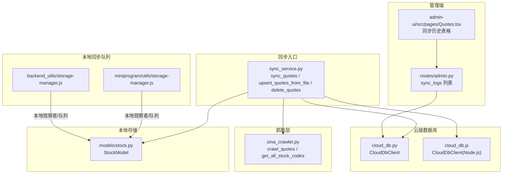
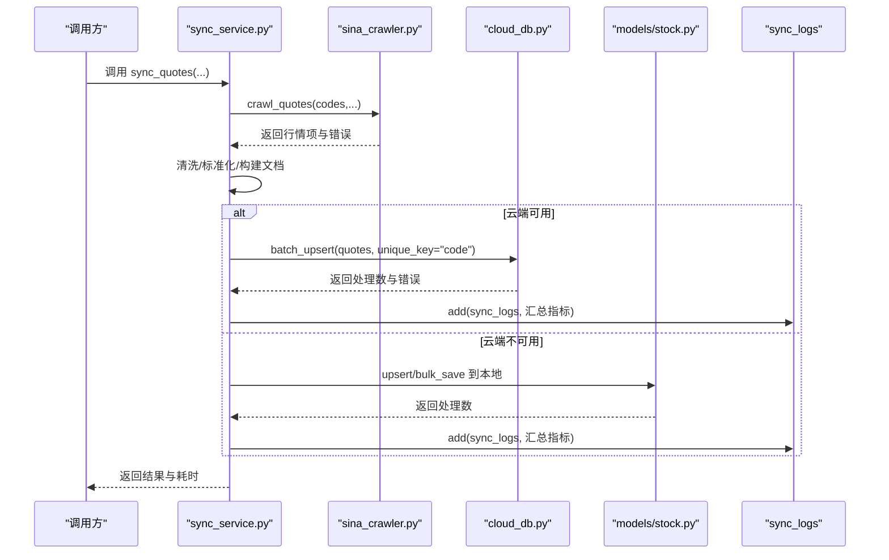
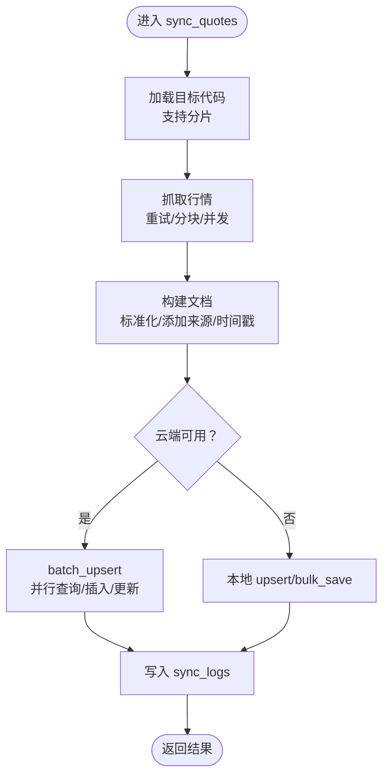
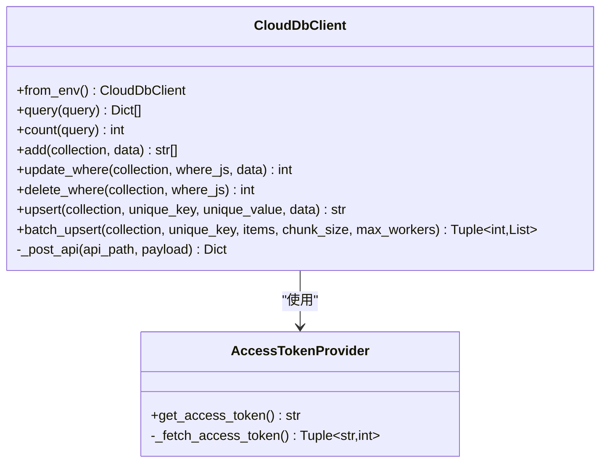
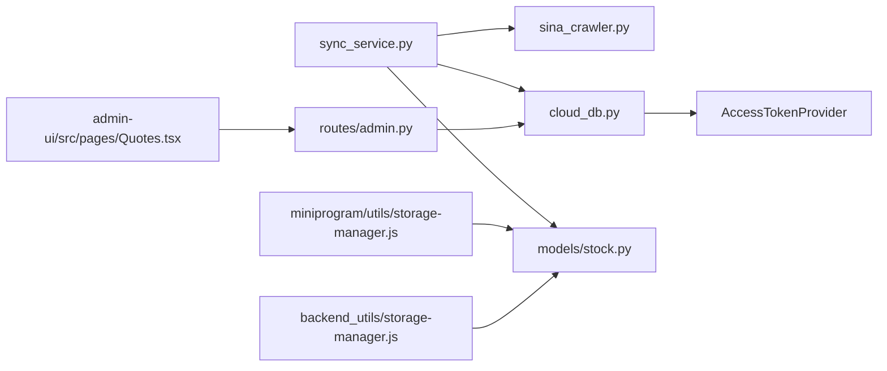

# 同步服务

<cite>
**本文引用的文件**
- [services/sync_service.py](file://services/sync_service.py)
- [services/cloud_db.py](file://services/cloud_db.py)
- [services/cloud_db.js](file://services/cloud_db.js)
- [services/sina_crawler.py](file://services/sina_crawler.py)
- [models/stock.py](file://models/stock.py)
- [scripts/benchmark_sync.py](file://scripts/benchmark_sync.py)
- [routes/admin.py](file://routes/admin.py)
- [admin-ui/src/pages/Quotes.tsx](file://admin-ui/src/pages/Quotes.tsx)
- [miniprogram/utils/storage-manager.js](file://miniprogram/utils/storage-manager.js)
- [backend_utils/storage-manager.js](file://backend_utils/storage-manager.js)
</cite>

## 目录
1. [简介](#简介)
2. [项目结构](#项目结构)
3. [核心组件](#核心组件)
4. [架构总览](#架构总览)
5. [详细组件分析](#详细组件分析)
6. [依赖关系分析](#依赖关系分析)
7. [性能考量](#性能考量)
8. [故障排查指南](#故障排查指南)
9. [结论](#结论)
10. [附录](#附录)

## 简介
本文件面向“同步服务”的实现与使用，系统性阐述数据同步机制、云端与本地双栈策略、增量与全量同步、冲突处理与一致性保障、版本控制思路、性能优化与批量处理、异步同步最佳实践，以及与数据库的集成、事务与回滚机制、测试与故障恢复策略。目标是帮助开发者快速理解并安全地扩展与维护同步服务。

## 项目结构
同步服务主要由以下模块组成：
- Python 同步入口与业务逻辑：services/sync_service.py
- 云端数据库客户端（Python/Node.js）：services/cloud_db.py、services/cloud_db.js
- 行情抓取器：services/sina_crawler.py
- 本地存储模型（MongoDB/文件）：models/stock.py
- 性能基准脚本：scripts/benchmark_sync.py
- 管理端路由与前端展示：routes/admin.py、admin-ui/src/pages/Quotes.tsx
- 小程序与后端通用存储管理器（本地同步队列与观察者）：miniprogram/utils/storage-manager.js、backend_utils/storage-manager.js

图表来源
- [services/sync_service.py](file://services/sync_service.py#L72-L265)
- [services/sina_crawler.py](file://services/sina_crawler.py#L45-L66)
- [services/cloud_db.py](file://services/cloud_db.py#L108-L533)
- [services/cloud_db.js](file://services/cloud_db.js#L7-L327)
- [models/stock.py](file://models/stock.py#L23-L386)
- [routes/admin.py](file://routes/admin.py#L522-L554)
- [admin-ui/src/pages/Quotes.tsx](file://admin-ui/src/pages/Quotes.tsx#L846-L872)
- [miniprogram/utils/storage-manager.js](file://miniprogram/utils/storage-manager.js#L7-L538)
- [backend_utils/storage-manager.js](file://backend_utils/storage-manager.js#L7-L538)

章节来源
- [services/sync_service.py](file://services/sync_service.py#L72-L265)
- [services/cloud_db.py](file://services/cloud_db.py#L108-L533)
- [services/cloud_db.js](file://services/cloud_db.js#L7-L327)
- [services/sina_crawler.py](file://services/sina_crawler.py#L45-L66)
- [models/stock.py](file://models/stock.py#L23-L386)
- [routes/admin.py](file://routes/admin.py#L522-L554)
- [admin-ui/src/pages/Quotes.tsx](file://admin-ui/src/pages/Quotes.tsx#L846-L872)
- [miniprogram/utils/storage-manager.js](file://miniprogram/utils/storage-manager.js#L7-L538)
- [backend_utils/storage-manager.js](file://backend_utils/storage-manager.js#L7-L538)

## 核心组件
- 同步入口与调度
  - 同步行情：sync_quotes、sync_all_quotes
  - 文件上传清洗入库：upsert_quotes_from_file
  - 删除数据：delete_quotes
- 云端数据库客户端
  - Python 客户端：CloudDbClient（支持 upsert/batch_upsert/query/count/add/update/delete）
  - Node.js 客户端：CloudDbClient（支持 upsert/batchUpsert/query/add/updateWhere/deleteWhere/count）
- 抓取器
  - sina_crawler：抓取 A 股行情，过滤停牌，输出标准格式
- 本地存储模型
  - StockModel：MongoDB 或本地 JSON 文件的读写封装，支持 upsert/bulk_save/delete/get/count
- 管理端与前端
  - routes/admin.py：列出 sync_logs
  - admin-ui/src/pages/Quotes.tsx：展示同步历史

章节来源
- [services/sync_service.py](file://services/sync_service.py#L72-L265)
- [services/cloud_db.py](file://services/cloud_db.py#L108-L533)
- [services/cloud_db.js](file://services/cloud_db.js#L7-L327)
- [services/sina_crawler.py](file://services/sina_crawler.py#L45-L66)
- [models/stock.py](file://models/stock.py#L23-L386)
- [routes/admin.py](file://routes/admin.py#L522-L554)
- [admin-ui/src/pages/Quotes.tsx](file://admin-ui/src/pages/Quotes.tsx#L846-L872)

## 架构总览
同步服务采用“抓取-清洗-入库-日志”的流水线架构，并提供云端与本地双栈回退能力。核心流程如下：
- 云端优先：若配置就绪，优先写入微信云开发数据库；否则回退到本地存储（MongoDB 或文件 JSON）
- 并发与限流：通过环境变量控制并发、重试、分片大小等参数，避免 QPS 抖动
- 日志与可观测：每次同步写入 sync_logs 集合，便于审计与排障

图表来源
- [services/sync_service.py](file://services/sync_service.py#L72-L238)
- [services/sina_crawler.py](file://services/sina_crawler.py#L45-L66)
- [services/cloud_db.py](file://services/cloud_db.py#L331-L484)
- [models/stock.py](file://models/stock.py#L135-L264)

## 详细组件分析

### 同步入口与业务逻辑（sync_service.py）
- 关键函数
  - sync_quotes：抓取指定/分片股票代码行情，清洗后批量 upsert，记录同步日志
  - sync_all_quotes：获取全量股票代码后统一同步
  - upsert_quotes_from_file：从文件批量清洗并入库，支持进度回调
  - delete_quotes：按代码或全量删除，支持进度回调
- 数据清洗与校验
  - clean_and_validate_item：标准化股票代码、区分期权矩阵与标准行情、数值字段清洗、生成唯一 code
- 并发与分片
  - _shard_codes：基于 MD5 的分片策略，支持多进程/多实例并行
  - 环境变量控制：抓取重试、分块大小、最大并发、upsert 分块大小
- 日志与可观测
  - 同步完成后写入 sync_logs，包含类型、来源、处理数、错误数、耗时等

图表来源
- [services/sync_service.py](file://services/sync_service.py#L72-L238)
- [services/sync_service.py](file://services/sync_service.py#L334-L474)
- [services/sync_service.py](file://services/sync_service.py#L477-L596)

章节来源
- [services/sync_service.py](file://services/sync_service.py#L72-L265)
- [services/sync_service.py](file://services/sync_service.py#L268-L333)
- [services/sync_service.py](file://services/sync_service.py#L334-L474)
- [services/sync_service.py](file://services/sync_service.py#L477-L596)

### 云端数据库客户端（Python）
- CloudDbClient
  - from_env：从环境变量加载 WX_CLOUD_ENV/WX_APPID/WX_SECRET
  - query/count/add/update_where/delete_where/upsert/batch_upsert
  - 并发与限流：连接池大小、信号量、最大并发、最大重试
  - 重试策略：指数退避，区分速率限制与瞬时错误
- AccessTokenProvider：拉取/缓存 access_token，带过期 margin

图表来源
- [services/cloud_db.py](file://services/cloud_db.py#L108-L533)

章节来源
- [services/cloud_db.py](file://services/cloud_db.py#L108-L533)

### 云端数据库客户端（Node.js）
- CloudDbClient（Node.js）
  - fromEnv：从环境变量加载 WX_CLOUD_ENV/WX_APPID/WX_SECRET
  - query/add/updateWhere/deleteWhere/upsert/batchUpsert
  - 限流：自定义 acquire/release 控制并发
  - 重试：指数退避，区分速率限制与瞬时错误

章节来源
- [services/cloud_db.js](file://services/cloud_db.js#L7-L327)

### 抓取器（sina_crawler.py）
- get_all_stock_codes：优先使用 ak.stock_zh_a_spot_em，后备 ak.stock_info_a_code_name
- crawl_quotes：并发抓取，过滤停牌，转为标准格式

章节来源
- [services/sina_crawler.py](file://services/sina_crawler.py#L10-L66)

### 本地存储模型（models/stock.py）
- StockModel
  - save_stock_data/bulk_save_stock_data：MongoDB 或本地 JSON 文件 upsert
  - delete_stock_data：按代码或全量删除
  - get_stock_data/get_all_stocks/count_stocks：查询与分页
  - FILE_DB_PATH 环境变量控制本地 JSON 文件路径

章节来源
- [models/stock.py](file://models/stock.py#L23-L386)

### 管理端与前端（routes/admin.py、admin-ui/src/pages/Quotes.tsx）
- routes/admin.py：查询 sync_logs 集合，分页返回
- admin-ui/src/pages/Quotes.tsx：展示同步历史表格，包含类型、来源、写入数、错误数、耗时、时间

章节来源
- [routes/admin.py](file://routes/admin.py#L522-L554)
- [admin-ui/src/pages/Quotes.tsx](file://admin-ui/src/pages/Quotes.tsx#L846-L872)

### 本地同步队列与观察者（miniprogram/utils/storage-manager.js、backend_utils/storage-manager.js）
- StorageManager
  - 观察者模式：notifyObservers
  - 同步队列：addToSyncQueue/processSyncQueue
  - 批量同步：syncBatchToServer（模拟）
  - 统计：命中率、队列长度、成功/失败次数

章节来源
- [miniprogram/utils/storage-manager.js](file://miniprogram/utils/storage-manager.js#L7-L538)
- [backend_utils/storage-manager.js](file://backend_utils/storage-manager.js#L7-L538)

## 依赖关系分析
- 同步入口依赖抓取器与云端/本地存储
- 云端客户端依赖访问令牌提供器与 HTTP 会话
- 管理端依赖云端客户端查询日志
- 前端依赖管理端接口展示日志

图表来源
- [services/sync_service.py](file://services/sync_service.py#L72-L238)
- [services/sina_crawler.py](file://services/sina_crawler.py#L45-L66)
- [services/cloud_db.py](file://services/cloud_db.py#L108-L207)
- [models/stock.py](file://models/stock.py#L23-L386)
- [routes/admin.py](file://routes/admin.py#L522-L554)
- [admin-ui/src/pages/Quotes.tsx](file://admin-ui/src/pages/Quotes.tsx#L846-L872)
- [miniprogram/utils/storage-manager.js](file://miniprogram/utils/storage-manager.js#L7-L538)
- [backend_utils/storage-manager.js](file://backend_utils/storage-manager.js#L7-L538)

章节来源
- [services/sync_service.py](file://services/sync_service.py#L72-L238)
- [services/cloud_db.py](file://services/cloud_db.py#L108-L207)
- [routes/admin.py](file://routes/admin.py#L522-L554)
- [admin-ui/src/pages/Quotes.tsx](file://admin-ui/src/pages/Quotes.tsx#L846-L872)
- [miniprogram/utils/storage-manager.js](file://miniprogram/utils/storage-manager.js#L7-L538)
- [backend_utils/storage-manager.js](file://backend_utils/storage-manager.js#L7-L538)

## 性能考量
- 并发与限流
  - 环境变量 WX_DB_MAX_INFLIGHT/WX_DB_MAX_WORKERS/WX_DB_MAX_RETRIES 控制并发与重试
  - Python 客户端使用连接池与信号量，Node.js 客户端使用 acquire/release
- 分片与分块
  - _shard_codes 基于哈希分片，支持多实例并行
  - 抓取 chunk_size、upsert chunk_size 限制单次批量大小
- 重试与抖动
  - 指数退避，区分速率限制与瞬时错误，避免雪崩
- 性能基准
  - scripts/benchmark_sync.py 提供抓取、全量同步的耗时统计，便于评估目标达成情况

章节来源
- [services/sync_service.py](file://services/sync_service.py#L105-L131)
- [services/cloud_db.py](file://services/cloud_db.py#L141-L160)
- [services/cloud_db.py](file://services/cloud_db.py#L486-L533)
- [services/cloud_db.js](file://services/cloud_db.js#L39-L51)
- [services/cloud_db.js](file://services/cloud_db.js#L106-L139)
- [scripts/benchmark_sync.py](file://scripts/benchmark_sync.py#L14-L57)

## 故障排查指南
- 云端配置缺失
  - CloudDbConfigError：WX_CLOUD_ENV/WX_APPID/WX_SECRET 未配置或为空
- 云端请求失败
  - CloudDbRequestError：errcode/errmsg，集合不存在、QPS 限制等
  - 建议：检查环境变量、集合是否存在、重试策略
- 本地回退
  - 当云端不可用时，自动回退到本地存储（MongoDB 或文件 JSON）
- 同步日志
  - sync_logs：记录每次同步的类型、来源、处理数、错误数、耗时、时间
  - 管理端可分页查看，前端展示表格
- 本地同步队列
  - StorageManager：观察者回调、队列长度、成功/失败统计，便于定位本地侧问题

章节来源
- [services/cloud_db.py](file://services/cloud_db.py#L15-L21)
- [services/cloud_db.py](file://services/cloud_db.py#L197-L207)
- [services/cloud_db.py](file://services/cloud_db.py#L515-L520)
- [routes/admin.py](file://routes/admin.py#L522-L554)
- [admin-ui/src/pages/Quotes.tsx](file://admin-ui/src/pages/Quotes.tsx#L846-L872)
- [miniprogram/utils/storage-manager.js](file://miniprogram/utils/storage-manager.js#L472-L538)
- [backend_utils/storage-manager.js](file://backend_utils/storage-manager.js#L472-L538)

## 结论
同步服务通过“抓取-清洗-入库-日志”闭环，结合云端与本地双栈回退、并发与限流、重试与抖动控制，实现了高可靠、可观测、可扩展的行情与数据同步能力。建议在生产环境中：
- 明确配置环境变量，确保云端可用
- 合理设置并发与分片，避免 QPS 波动
- 关注 sync_logs，建立告警与巡检
- 在本地侧使用观察者与队列，保障离线场景下的数据最终一致

## 附录

### 同步规则与配置要点
- 代码分片：_shard_codes 基于 MD5，确保多实例均匀分布
- 清洗规则：clean_and_validate_item 标准化股票代码、区分期权矩阵与标准行情、数值字段清洗
- 唯一键：quotes 集合使用 code 作为唯一键
- 环境变量
  - WX_CLOUD_ENV/WX_APPID/WX_SECRET：云端配置
  - WX_DB_MAX_INFLIGHT/WX_DB_MAX_WORKERS/WX_DB_MAX_RETRIES：并发/重试
  - WX_DB_UPSERT_CHUNK_SIZE：批量 upsert 分块大小
  - SINA_*：抓取超时、重试、分块、并发
  - FILE_DB_PATH：本地 JSON 文件路径

章节来源
- [services/sync_service.py](file://services/sync_service.py#L53-L103)
- [services/sync_service.py](file://services/sync_service.py#L268-L333)
- [services/sync_service.py](file://services/sync_service.py#L105-L131)
- [models/stock.py](file://models/stock.py#L53-L54)

### 增量与全量同步实现
- 增量同步
  - batch_upsert：先查询现有键，再并行插入/更新，适合高频增量
- 全量同步
  - sync_all_quotes：获取全量股票代码后统一同步
  - delete_quotes：支持按代码或全量删除，配合全量重建

章节来源
- [services/cloud_db.py](file://services/cloud_db.py#L331-L484)
- [services/sync_service.py](file://services/sync_service.py#L241-L265)
- [services/sync_service.py](file://services/sync_service.py#L477-L596)

### 冲突处理与一致性保障
- 冲突处理
  - upsert：存在则更新，不存在则插入，统一更新时间戳
  - batch_upsert：先查询存在键，再并行处理，减少竞争
- 一致性
  - 云端：集合不存在时抛出明确错误，便于提前发现
  - 本地：原子写入 JSON，失败回滚临时文件
  - 日志：sync_logs 记录每次同步的指标，便于审计

章节来源
- [services/cloud_db.py](file://services/cloud_db.py#L305-L329)
- [services/cloud_db.py](file://services/cloud_db.py#L331-L484)
- [models/stock.py](file://models/stock.py#L87-L111)

### 版本控制机制
- 时间戳字段：created_at/updated_at 用于排序与审计
- 唯一键：code（股票代码或期权唯一码）保证去重
- 日志：sync_logs 记录每次同步的来源与耗时，便于追踪版本变更

章节来源
- [services/sync_service.py](file://services/sync_service.py#L42-L50)
- [services/sync_service.py](file://services/sync_service.py#L299-L311)
- [services/cloud_db.py](file://services/cloud_db.py#L326-L328)

### 异步同步最佳实践
- 前端/小程序侧
  - 使用 StorageManager 的观察者与队列，定期批量同步
  - 控制批量大小与重试次数，避免阻塞主线程
- 后端侧
  - 使用 ThreadPoolExecutor 并行清洗与入库
  - 通过环境变量控制并发与分片，避免 QPS 抖动

章节来源
- [services/sync_service.py](file://services/sync_service.py#L375-L402)
- [services/sync_service.py](file://services/sync_service.py#L424-L436)
- [miniprogram/utils/storage-manager.js](file://miniprogram/utils/storage-manager.js#L472-L524)
- [backend_utils/storage-manager.js](file://backend_utils/storage-manager.js#L472-L524)

### 与数据库的集成、事务与回滚
- 云端
  - 无事务语义，通过 upsert 与日志实现最终一致
  - 集合不存在时抛错，需在控制台创建集合
- 本地
  - MongoDB：upsert 与批量写入
  - 文件 JSON：原子写入（临时文件 + replace），失败回滚

章节来源
- [services/cloud_db.py](file://services/cloud_db.py#L515-L520)
- [models/stock.py](file://models/stock.py#L87-L111)
- [models/stock.py](file://models/stock.py#L210-L226)

### 测试与验证
- 性能基准
  - scripts/benchmark_sync.py：抓取、全量同步耗时统计
- 管理端验证
  - routes/admin.py：查询 sync_logs
  - admin-ui/src/pages/Quotes.tsx：展示同步历史

章节来源
- [scripts/benchmark_sync.py](file://scripts/benchmark_sync.py#L14-L57)
- [routes/admin.py](file://routes/admin.py#L522-L554)
- [admin-ui/src/pages/Quotes.tsx](file://admin-ui/src/pages/Quotes.tsx#L846-L872)