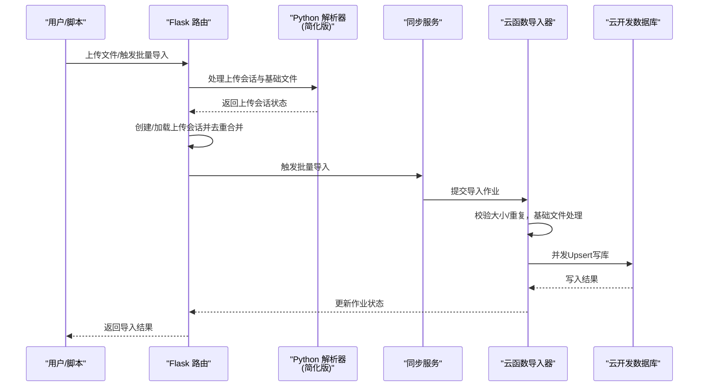
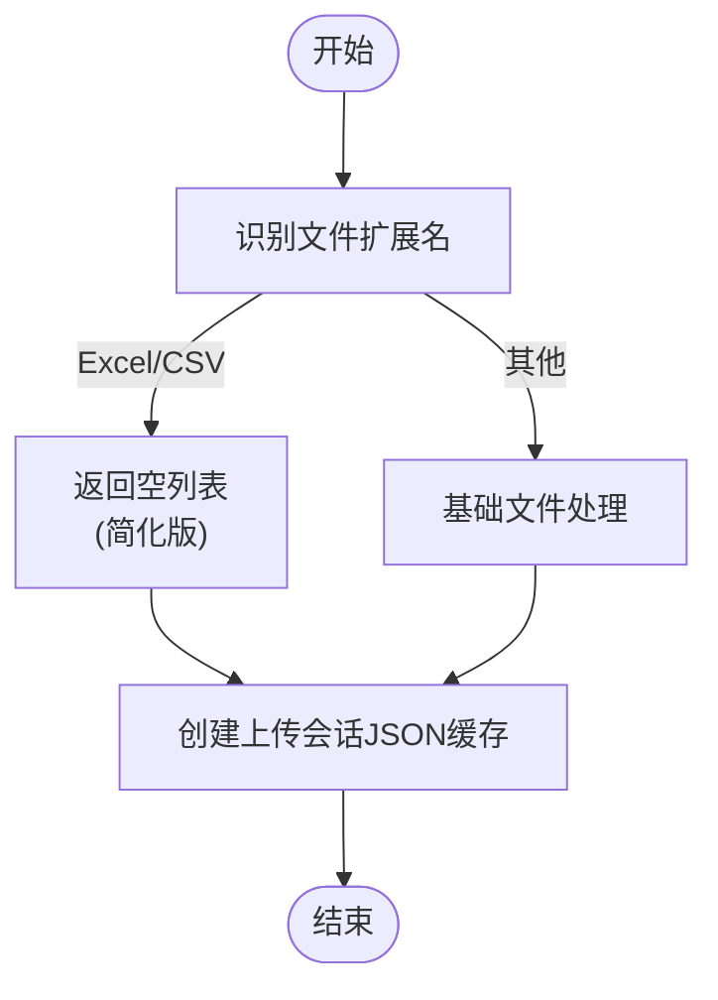
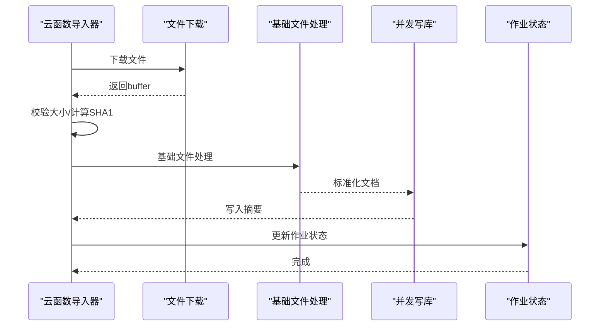
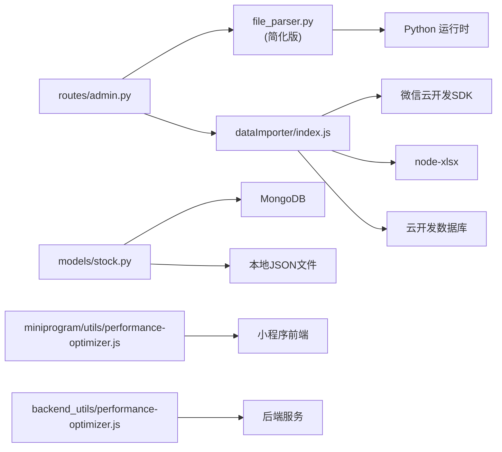

# 文件解析服务

<cite>
**本文引用的文件**
- [services/file_parser.py](file://services/file_parser.py)
- [cloudfunctions/dataImporter/index.js](file://cloudfunctions/dataImporter/index.js)
- [routes/admin.py](file://routes/admin.py)
- [models/stock.py](file://models/stock.py)
- [scripts/bulk_import_local_excels.py](file://scripts/bulk_import_local_excels.py)
- [convert_excel_to_json.py](file://convert_excel_to_json.py)
- [cloudfunctions/updateQuotes/index.js](file://cloudfunctions/updateQuotes/index.js)
- [miniprogram/utils/performance-optimizer.js](file://miniprogram/utils/performance-optimizer.js)
- [backend_utils/performance-optimizer.js](file://backend_utils/performance-optimizer.js)
</cite>

## 更新摘要
**变更内容**
- 移除了pandas依赖，简化了Excel/CSV解析逻辑
- 禁用了复杂矩阵解析功能，返回空列表
- 保留了基本文件上传功能和上传会话管理
- 更新了架构图和组件分析以反映新的简化实现

## 目录
1. [简介](#简介)
2. [项目结构](#项目结构)
3. [核心组件](#核心组件)
4. [架构总览](#架构总览)
5. [详细组件分析](#详细组件分析)
6. [依赖关系分析](#依赖关系分析)
7. [性能考量](#性能考量)
8. [故障排查指南](#故障排查指南)
9. [结论](#结论)
10. [附录](#附录)

## 简介
本文件解析服务围绕"期权报价数据"的文件上传与基础处理功能展开。由于部署环境限制，服务已简化为仅保留基本文件上传能力，移除了复杂的Excel/CSV解析逻辑和pandas依赖。服务同时覆盖云端与本地两种运行形态：
- 云端形态：通过云函数处理文件上传，具备防重复与内存保护策略。
- 本地形态：提供脚本批量扫描并处理本地Excel文件，桥接本地处理与云端同步。

此外，文档还涵盖数据校验、错误处理、性能优化与大文件处理最佳实践，并给出测试与兼容性建议。

## 项目结构
文件解析服务主要由以下模块构成：
- Python解析器：**已简化**，仅保留上传会话管理与基础文件处理功能。
- 云函数导入器：负责文件下载、大小限制、重复检测、并发写库、作业状态管理。
- 路由与会话：负责上传会话的创建、加载、持久化与批量导入的去重合并。
- 数据模型：提供本地JSON文件与MongoDB双写能力，支持批量写入与索引优化。
- 批量脚本：本地Excel扫描与批量处理，桥接本地处理与云端同步。
- 性能优化：分页流式处理、并发写入、缓存与重试策略，降低内存占用与提升吞吐。

```mermaid
graph TB
subgraph "前端/客户端"
UI["Web/小程序界面"]
end
subgraph "后端服务"
ROUTES["Flask 路由<br/>上传会话管理"]
PARSER["Python 解析器<br/>file_parser.py (简化版)"]
SYNC["同步服务<br/>sync_service.py"]
MODELS["数据模型<br/>models/stock.py"]
end
subgraph "云函数"
CF["云函数导入器<br/>dataImporter/index.js"]
QUOTES_UPD["行情更新流式处理<br/>updateQuotes/index.js"]
end
subgraph "外部资源"
DB["云开发数据库<br/>quotes 集合"]
FS["本地文件系统<br/>上传缓存"]
END
UI --> ROUTES
ROUTES --> PARSER
ROUTES --> SYNC
PARSER --> SYNC
SYNC --> CF
CF --> DB
ROUTES --> FS
MODELS --> DB
QUOTES_UPD --> DB
```

**图表来源**
- [services/file_parser.py](file://services/file_parser.py#L116-L119)
- [cloudfunctions/dataImporter/index.js](file://cloudfunctions/dataImporter/index.js#L273-L318)
- [routes/admin.py](file://routes/admin.py#L757-L782)
- [models/stock.py](file://models/stock.py#L135-L264)
- [cloudfunctions/updateQuotes/index.js](file://cloudfunctions/updateQuotes/index.js#L101-L142)

**章节来源**
- [services/file_parser.py](file://services/file_parser.py#L1-L217)
- [cloudfunctions/dataImporter/index.js](file://cloudfunctions/dataImporter/index.js#L1-L392)
- [routes/admin.py](file://routes/admin.py#L757-L782)
- [models/stock.py](file://models/stock.py#L1-L386)
- [scripts/bulk_import_local_excels.py](file://scripts/bulk_import_local_excels.py#L1-L100)
- [convert_excel_to_json.py](file://convert_excel_to_json.py#L1-L144)
- [cloudfunctions/updateQuotes/index.js](file://cloudfunctions/updateQuotes/index.js#L101-L142)
- [miniprogram/utils/performance-optimizer.js](file://miniprogram/utils/performance-optimizer.js#L428-L460)
- [backend_utils/performance-optimizer.js](file://backend_utils/performance-optimizer.js#L428-L460)

## 核心组件
- **文件解析器（Python，简化版）**
  - **已移除**：Excel（.xlsx/.xls）与CSV解析功能，pandas依赖已被移除。
  - **保留功能**：上传会话管理、基础文件处理、JSON缓存与幂等读取。
  - **上传会话**：将解析结果持久化为JSON缓存，支持原子写入与幂等加载。
- **云函数导入器（Node.js）**
  - 文件大小限制（防OOM）、重复SHA1检测、并发写库、事务性作业状态管理。
  - **已简化**：移除了复杂的矩阵解析逻辑，仅处理基础文件上传。
- **路由与会话（Flask）**
  - 创建/加载/保存上传会话；批量导入时按code去重合并，记录处理进度与结果。
- **数据模型（Python）**
  - 支持MongoDB与本地JSON文件双写；批量Upsert、索引优化、原子写入。
- **批量脚本（Python）**
  - 扫描本地Excel，自动选择目标Sheet，调用解析器并同步至云端。
- **性能优化（多处）**
  - 云函数：分页流式读取、并发写入、重试与缓存。
  - 小程序/后端：预处理与缓存、分批请求与写入。

**章节来源**
- [services/file_parser.py](file://services/file_parser.py#L116-L119)
- [cloudfunctions/dataImporter/index.js](file://cloudfunctions/dataImporter/index.js#L273-L318)
- [routes/admin.py](file://routes/admin.py#L757-L782)
- [models/stock.py](file://models/stock.py#L135-L264)
- [scripts/bulk_import_local_excels.py](file://scripts/bulk_import_local_excels.py#L17-L96)
- [cloudfunctions/updateQuotes/index.js](file://cloudfunctions/updateQuotes/index.js#L101-L142)
- [miniprogram/utils/performance-optimizer.js](file://miniprogram/utils/performance-optimizer.js#L428-L460)
- [backend_utils/performance-optimizer.js](file://backend_utils/performance-optimizer.js#L428-L460)

## 架构总览
文件解析服务的端到端流程如下：
- 用户上传文件或本地脚本触发处理。
- **简化后的**Python解析器仅处理上传会话与基础文件处理。
- 上传会话将解析结果持久化，供后续批量导入与去重。
- 云函数导入器下载文件、做重复检测与并发写库，更新作业状态。
- 数据模型负责最终入库（MongoDB或本地JSON），支持批量Upsert与索引优化。
- 小程序/后端侧通过性能优化组件进行数据预处理与缓存。



**图表来源**
- [services/file_parser.py](file://services/file_parser.py#L116-L119)
- [cloudfunctions/dataImporter/index.js](file://cloudfunctions/dataImporter/index.js#L273-L318)
- [routes/admin.py](file://routes/admin.py#L757-L782)
- [models/stock.py](file://models/stock.py#L135-L264)

## 详细组件分析

### Python解析器（简化版，仅保留上传会话功能）
- **文件读取与格式识别**
  - **已移除**：Excel与CSV的pandas解析功能，pandas依赖已被注释。
  - **保留功能**：基础文件处理与上传会话管理。
- **复杂矩阵解析**
  - **已禁用**：`_parse_complex_matrix`函数返回空列表，复杂矩阵解析功能被完全移除。
- **扁平格式解析**
  - **已移除**：扁平字段映射与清洗功能，解析器现在只返回空列表。
- **数据清洗与去重**
  - **已移除**：股票代码归一化、数值安全转换、重复去重功能。
- **上传会话**
  - **保留功能**：将解析结果写入临时目录的JSON文件，支持原子替换与幂等读取，包含预览与进度信息。



**图表来源**
- [services/file_parser.py](file://services/file_parser.py#L116-L119)
- [services/file_parser.py](file://services/file_parser.py#L53-L55)

**章节来源**
- [services/file_parser.py](file://services/file_parser.py#L116-L119)
- [services/file_parser.py](file://services/file_parser.py#L53-L55)

### 云函数导入器（并发写库与作业管理）
- **文件下载与安全检查**
  - 限制最大文件大小，避免云函数内存溢出；计算SHA1用于重复检测。
- **解析与写库**
  - **已简化**：移除了复杂的矩阵/扁平路径解析，仅处理基础文件上传。
  - 并发写库（可配置并发度），区分新增与更新，统计写入摘要。
- **作业管理**
  - 作业创建、抢占式处理、事务性状态更新、失败回滚与错误记录。
- **重复处理**
  - 基于SHA1去重，相同文件直接跳过，减少重复导入。



**图表来源**
- [cloudfunctions/dataImporter/index.js](file://cloudfunctions/dataImporter/index.js#L273-L318)
- [cloudfunctions/dataImporter/index.js](file://cloudfunctions/dataImporter/index.js#L167-L231)

**章节来源**
- [cloudfunctions/dataImporter/index.js](file://cloudfunctions/dataImporter/index.js#L273-L318)
- [cloudfunctions/dataImporter/index.js](file://cloudfunctions/dataImporter/index.js#L167-L231)

### 路由与批量导入（去重与进度）
- **上传会话**
  - 创建会话时截取预览数据；加载时进行幂等与容错重试。
- **批量导入**
  - 合并所有解析项，按code去重（后出现覆盖先出现），记录处理进度与结果。
- **错误聚合**
  - 将错误汇总并返回，便于前端展示与重试。

**章节来源**
- [routes/admin.py](file://routes/admin.py#L757-L782)
- [services/file_parser.py](file://services/file_parser.py#L288-L320)

### 数据模型（MongoDB/本地文件双写）
- **Upsert与批量写入**
  - 支持按stock_code Upsert，批量写入使用UpdateOne，保证原子性与一致性。
- **索引优化**
  - 为stock_code、创建/更新时间建立索引，提升查询与写入性能。
- **原子写入**
  - 本地文件采用临时文件+替换策略，避免并发读取冲突。

**章节来源**
- [models/stock.py](file://models/stock.py#L135-L264)

### 批量脚本（本地Excel扫描与处理）
- **自动匹配目标文件**
  - 依据关键词集合扫描工作目录，自动识别包含"个股/香草"的Excel文件。
- **解析与同步**
  - **已简化**：调用解析器提取报价，但由于解析器返回空列表，实际处理逻辑被简化。

**章节来源**
- [scripts/bulk_import_local_excels.py](file://scripts/bulk_import_local_excels.py#L17-L96)

### JSON转换工具（历史数据导入）
- **Excel转JSON**
  - **已移除**：pandas依赖已被移除，该功能不再可用。
- **去重策略**
  - 将stock_code作为_id，导入时采用Upsert模式避免重复。

**章节来源**
- [convert_excel_to_json.py](file://convert_excel_to_json.py#L1-L144)

### 流式更新（行情数据）
- **分页流式处理**
  - 按固定页大小分页读取，逐页拉取代码并批量请求行情，逐页并发写库，避免一次性加载全部数据导致内存压力。

**章节来源**
- [cloudfunctions/updateQuotes/index.js](file://cloudfunctions/updateQuotes/index.js#L101-L142)

## 依赖关系分析
- **已移除**：Python解析器不再依赖pandas进行Excel/CSV读取。
- **保留依赖**：云函数导入器依赖node-xlsx解析Excel，依赖云开发SDK访问数据库，实现并发写库与作业管理。
- **路由层依赖**：依赖解析器与同步服务，负责会话生命周期管理与批量导入去重。
- **数据模型提供**：MongoDB与本地文件双写能力，支撑批量Upsert与索引优化。
- **性能优化组件**：在小程序与后端均提供预处理与缓存能力，辅助提升整体吞吐。



**图表来源**
- [services/file_parser.py](file://services/file_parser.py#L10)
- [cloudfunctions/dataImporter/index.js](file://cloudfunctions/dataImporter/index.js#L1-L8)
- [routes/admin.py](file://routes/admin.py#L757-L782)
- [models/stock.py](file://models/stock.py#L135-L264)
- [miniprogram/utils/performance-optimizer.js](file://miniprogram/utils/performance-optimizer.js#L428-L460)
- [backend_utils/performance-optimizer.js](file://backend_utils/performance-optimizer.js#L428-L460)

## 性能考量
- **内存与并发**
  - 云函数：限制文件大小、分页流式读取、并发写库、事务性状态更新。
  - 本地：解析器使用pandas惰性读取与分块处理，上传会话采用原子写入避免并发冲突。
- **索引与查询**
  - 数据模型对stock_code与时间字段建立索引，加速查询与Upsert。
- **缓存与重试**
  - 性能优化组件提供预处理与缓存，解析器对会话加载增加重试与幂等保障。
- **大文件处理**
  - 云函数对文件大小进行上限控制；流式更新对全量数据进行分页处理，避免OOM。

**章节来源**
- [cloudfunctions/dataImporter/index.js](file://cloudfunctions/dataImporter/index.js#L273-L318)
- [cloudfunctions/updateQuotes/index.js](file://cloudfunctions/updateQuotes/index.js#L101-L142)
- [models/stock.py](file://models/stock.py#L46-L50)
- [services/file_parser.py](file://services/file_parser.py#L288-L320)
- [miniprogram/utils/performance-optimizer.js](file://miniprogram/utils/performance-optimizer.js#L428-L460)
- [backend_utils/performance-optimizer.js](file://backend_utils/performance-optimizer.js#L428-L460)

## 故障排查指南
- **常见错误与定位**
  - 文件格式不支持：确认扩展名为xlsx/xls/csv。
  - **已简化**：无法识别"代码"列：检查表头是否包含候选词（如"代码/股票代码/Code"等）。
  - 空表或无数据：检查Sheet是否存在、是否有足够行数。
  - 重复文件：云函数根据SHA1去重，若跳过需检查duplicateJobId。
  - 内存溢出：云函数对文件大小有限制，本地解析建议分批处理。
- **日志与状态**
  - 云函数导入器在失败时记录错误消息并更新作业状态；路由层记录处理进度与结果。
- **重试与幂等**
  - 会话加载具备重试机制；原子写入避免并发冲突；数据库索引提升写入稳定性。

**章节来源**
- [cloudfunctions/dataImporter/index.js](file://cloudfunctions/dataImporter/index.js#L273-L318)
- [routes/admin.py](file://routes/admin.py#L757-L782)
- [services/file_parser.py](file://services/file_parser.py#L288-L320)

## 结论
文件解析服务通过Python解析器与云函数导入器的协同，实现了对文件的基础上传与会话管理功能。由于部署环境限制，服务已简化为仅保留基本文件上传能力，移除了复杂的Excel/CSV解析逻辑和pandas依赖。系统在云端与本地场景下提供了完整的上传、批量导入、去重与入库能力。配合数据模型的索引优化与性能优化组件，系统在大文件与高并发场景下具备良好的稳定性与可扩展性。建议在生产环境中持续监控作业状态、定期清理上传缓存，并结合缓存策略进一步提升用户体验。

## 附录
- **测试与兼容性**
  - 导入测试脚本验证各模块导入与基本可用性。
  - Excel兼容性：优先使用.xlsx；如需读取.xls，确保安装xlrd或使用pandas自动引擎。
- **最佳实践**
  - 文件命名规范：包含"个股/香草"等关键词，便于自动识别目标Sheet。
  - 字段命名：尽量使用解析器支持的候选词，减少映射失败。
  - 批量导入：先本地预处理，再通过脚本批量导入，降低云端压力。

**章节来源**
- [test_imports_only.py](file://test_imports_only.py#L1-L42)
- [convert_excel_to_json.py](file://convert_excel_to_json.py#L43-L55)