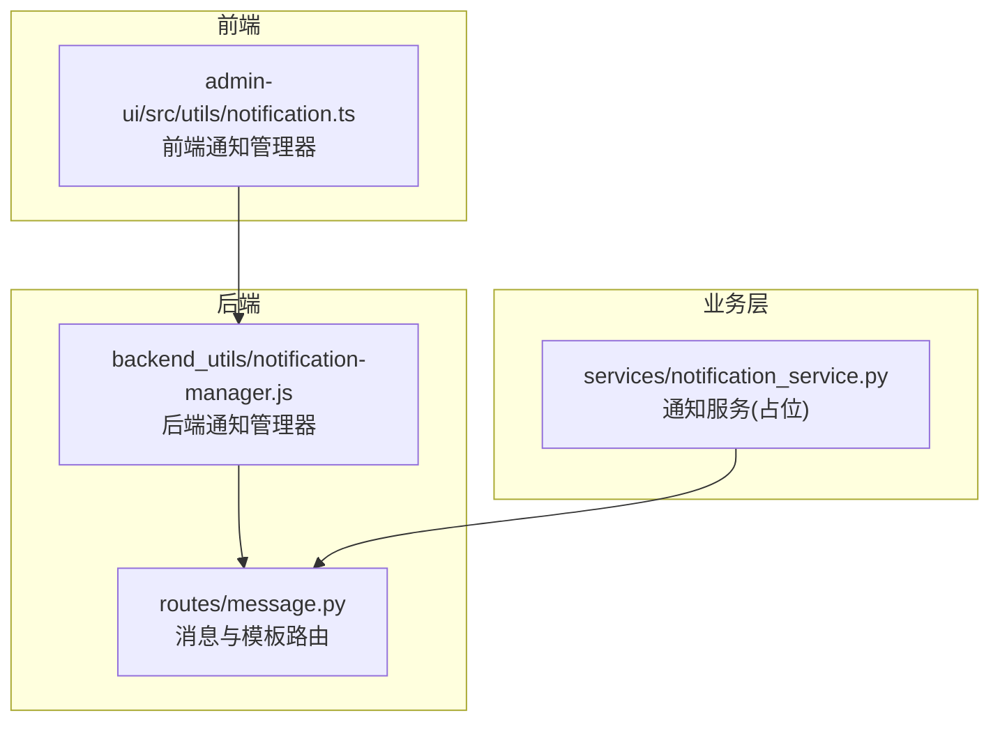
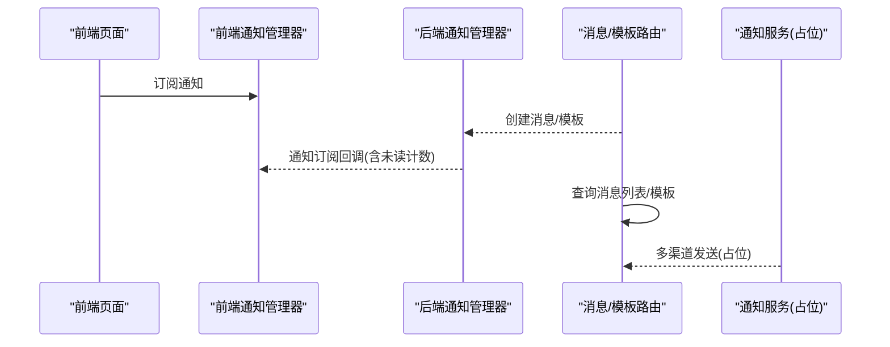
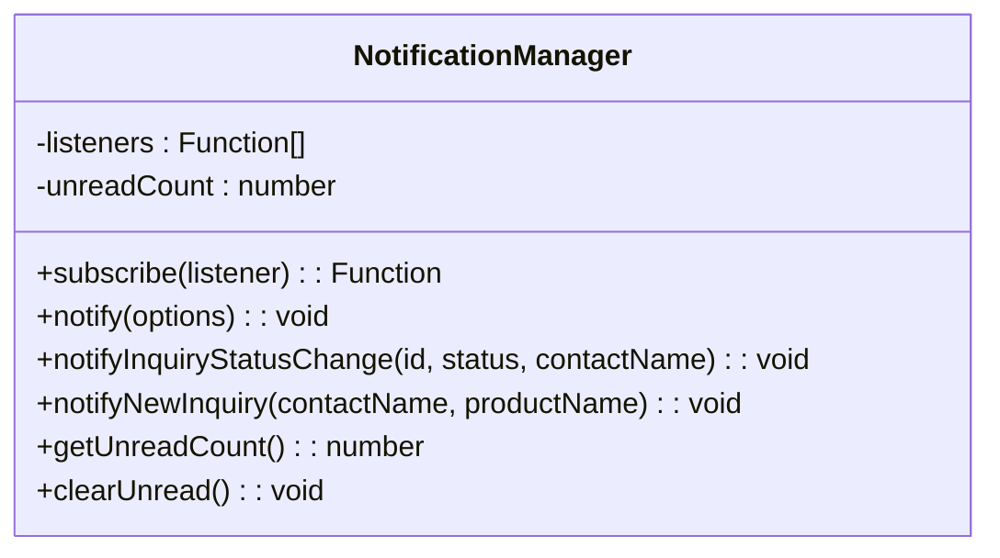
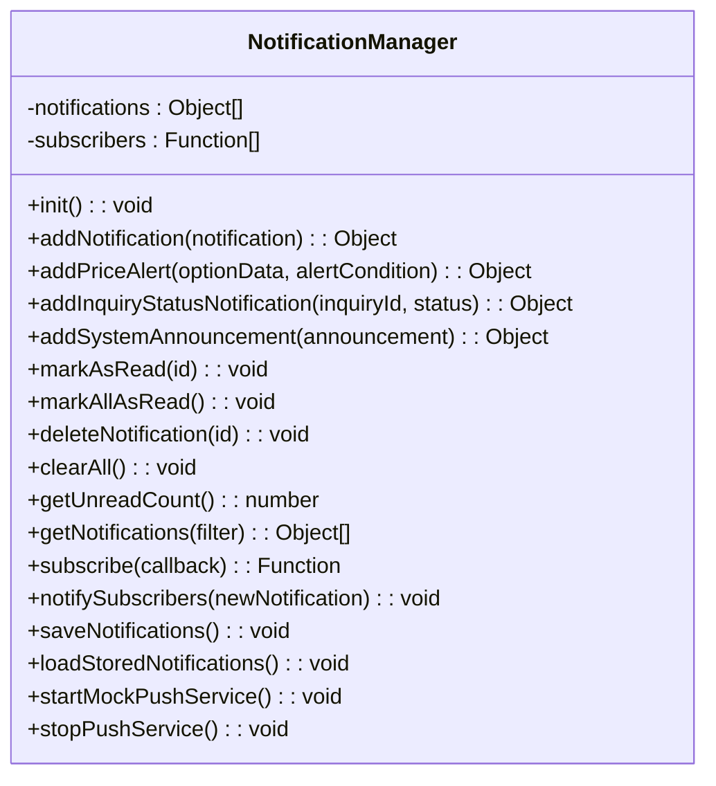
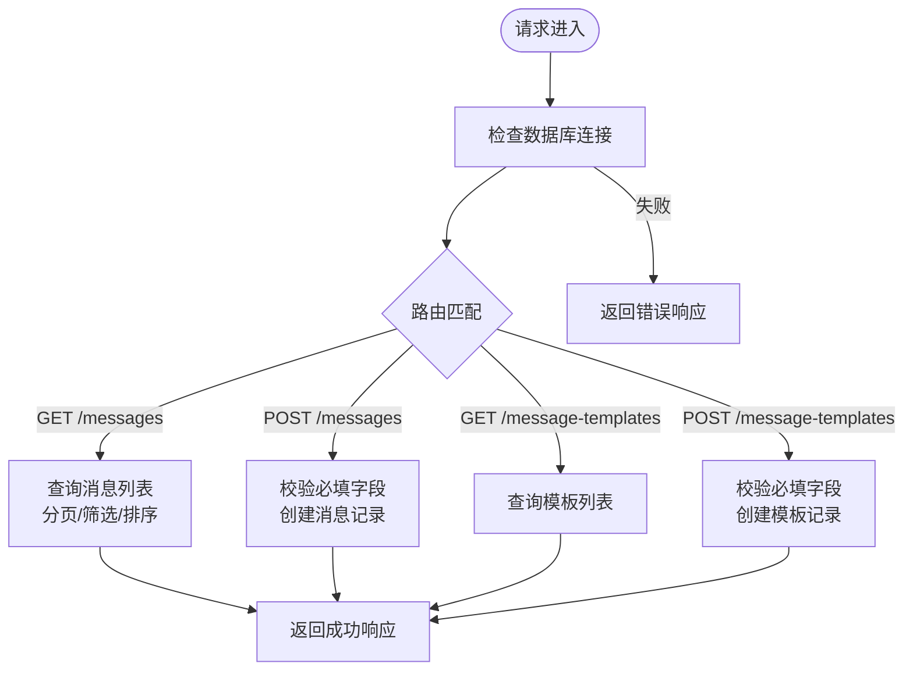
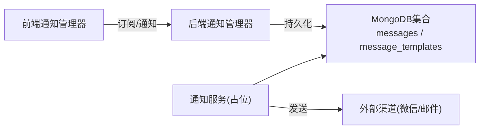

# 通知服务

<cite>
**本文引用的文件**
- [services/notification_service.py](file://services/notification_service.py)
- [admin-ui/src/utils/notification.ts](file://admin-ui/src/utils/notification.ts)
- [backend_utils/notification-manager.js](file://backend_utils/notification-manager.js)
- [miniprogram/utils/notification-manager.js](file://miniprogram/utils/notification-manager.js)
- [routes/message.py](file://routes/message.py)
- [admin-ui/src/pages/MessageTemplates.tsx](file://admin-ui/src/pages/MessageTemplates.tsx)
</cite>

## 目录
1. [简介](#简介)
2. [项目结构](#项目结构)
3. [核心组件](#核心组件)
4. [架构总览](#架构总览)
5. [组件详解](#组件详解)
6. [依赖关系分析](#依赖关系分析)
7. [性能与并发](#性能与并发)
8. [故障排查与监控](#故障排查与监控)
9. [结论](#结论)
10. [附录](#附录)

## 简介
本文件面向“通知服务”的实现与使用，覆盖消息通知机制、推送通知与邮件通知的实现思路；涵盖通知模板管理、多渠道通知与个性化推送的设计要点；文档化通知队列处理、重试与失败处理策略；说明通知内容格式化、国际化支持与主题定制方法；提供通知服务性能优化、并发处理与限流策略；阐述通知服务与业务流程的集成方式、事件触发与状态更新；最后给出测试、监控告警与用户体验优化建议。

## 项目结构
通知服务由三层组成：
- 前端通知管理器：负责本地通知展示、订阅与未读计数。
- 后端通知管理器：负责通知持久化、订阅分发与本地存储。
- 业务路由与模板：提供消息创建、模板管理与消息列表接口。

图表来源
- [admin-ui/src/utils/notification.ts](file://admin-ui/src/utils/notification.ts#L1-L84)
- [backend_utils/notification-manager.js](file://backend_utils/notification-manager.js#L1-L205)
- [routes/message.py](file://routes/message.py#L1-L179)
- [services/notification_service.py](file://services/notification_service.py#L1-L16)

章节来源
- [admin-ui/src/utils/notification.ts](file://admin-ui/src/utils/notification.ts#L1-L84)
- [backend_utils/notification-manager.js](file://backend_utils/notification-manager.js#L1-L205)
- [routes/message.py](file://routes/message.py#L1-L179)
- [services/notification_service.py](file://services/notification_service.py#L1-L16)

## 核心组件
- 前端通知管理器：提供订阅回调、发送通知、未读计数与清理能力，并内置询价状态变更与新询价两类通知模板。
- 后端通知管理器：提供通知添加、标记已读/全部已读、删除、清空、按过滤条件查询、订阅分发与本地存储持久化。
- 消息与模板路由：提供消息列表查询、创建消息、消息模板列表查询与创建消息模板的REST接口。
- 通知服务(占位)：当前为占位实现，预留微信/邮件等多渠道发送接口。

章节来源
- [admin-ui/src/utils/notification.ts](file://admin-ui/src/utils/notification.ts#L14-L83)
- [backend_utils/notification-manager.js](file://backend_utils/notification-manager.js#L2-L203)
- [routes/message.py](file://routes/message.py#L13-L179)
- [services/notification_service.py](file://services/notification_service.py#L5-L15)

## 架构总览
通知服务采用“前端订阅 + 后端持久化 + 路由编排”的模式。前端通过订阅回调接收通知；后端负责通知生命周期管理与本地存储；业务路由提供消息与模板的增删改查能力；通知服务作为扩展点预留多渠道发送。

图表来源
- [admin-ui/src/utils/notification.ts](file://admin-ui/src/utils/notification.ts#L21-L34)
- [backend_utils/notification-manager.js](file://backend_utils/notification-manager.js#L127-L143)
- [routes/message.py](file://routes/message.py#L70-L179)
- [services/notification_service.py](file://services/notification_service.py#L9-L15)

## 组件详解

### 前端通知管理器
- 职责
  - 订阅通知回调，维护监听者列表与未读计数。
  - 发送通知，支持标题、消息体、类型、持续时间与点击回调。
  - 提供询价状态变更与新询价两类通知模板，自动映射状态文案与类型。
- 关键行为
  - notify：向所有监听者广播通知。
  - notifyInquiryStatusChange：根据状态码映射中文状态并设置通知类型。
  - notifyNewInquiry：生成新询价通知。
  - getUnreadCount/clearUnread：未读计数管理。

图表来源
- [admin-ui/src/utils/notification.ts](file://admin-ui/src/utils/notification.ts#L14-L83)

章节来源
- [admin-ui/src/utils/notification.ts](file://admin-ui/src/utils/notification.ts#L14-L83)

### 后端通知管理器
- 职责
  - 维护通知列表、订阅者集合与本地存储。
  - 提供通知添加、标记已读/全部已读、删除、清空、按过滤条件查询。
  - 订阅分发：变更时通知订阅者。
  - 本地存储：限制存储数量并持久化。
- 关键行为
  - addNotification：统一构造通知对象并入队。
  - addPriceAlert/addInquiryStatusNotification/addSystemAnnouncement：三类内置通知模板。
  - markAsRead/markAllAsRead/deleteNotification/clearAll：通知生命周期管理。
  - subscribe/notifySubscribers：订阅与分发。
  - saveNotifications/loadStoredNotifications：本地存储读写。
  - startMockPushService/stopPushService：模拟推送服务。

图表来源
- [backend_utils/notification-manager.js](file://backend_utils/notification-manager.js#L2-L203)

章节来源
- [backend_utils/notification-manager.js](file://backend_utils/notification-manager.js#L2-L203)

### 消息与模板路由
- 能力
  - 获取消息列表：分页、类型筛选、排序。
  - 创建消息：校验必填字段，写入数据库。
  - 获取消息模板列表：按创建时间倒序。
  - 创建消息模板：校验必填字段，写入数据库。
- 关键字段
  - 消息：type、title、content、targetType(all/group/user)、targetIds、status、readCount、totalCount、createdAt、updatedAt。
  - 模板：name、type、title、content、variables、createdAt、updatedAt。

图表来源
- [routes/message.py](file://routes/message.py#L13-L179)

章节来源
- [routes/message.py](file://routes/message.py#L13-L179)

### 通知服务(占位)
- 当前实现为占位，预留多渠道发送接口，便于后续接入微信/邮件等外部服务。
- 建议在生产环境中在此处调用具体渠道API，并记录发送结果与失败重试。

章节来源
- [services/notification_service.py](file://services/notification_service.py#L5-L15)

### 通知模板管理
- 模板设计
  - 模板字段：name、type、title、content、variables、createdAt、updatedAt。
  - variables用于参数化内容，支持个性化推送。
- 前端模板
  - admin-ui/src/pages/MessageTemplates.tsx目前为占位页面，提示“功能开发中”。

章节来源
- [routes/message.py](file://routes/message.py#L111-L179)
- [admin-ui/src/pages/MessageTemplates.tsx](file://admin-ui/src/pages/MessageTemplates.tsx#L1-L13)

### 多渠道通知与个性化推送
- 多渠道
  - 当前后端通知管理器与前端通知管理器主要负责本地展示与持久化；多渠道发送建议在通知服务中实现。
- 个性化
  - 模板变量支持参数化，结合用户偏好可实现个性化内容。
  - 前端通知管理器支持按状态映射文案，便于本地个性化展示。

章节来源
- [routes/message.py](file://routes/message.py#L142-L179)
- [admin-ui/src/utils/notification.ts](file://admin-ui/src/utils/notification.ts#L39-L64)

### 通知队列处理、重试与失败处理
- 队列与持久化
  - 后端通知管理器维护通知列表并限制存储数量，避免无限增长。
  - 本地存储读写封装在saveNotifications/loadStoredNotifications中。
- 重试与失败
  - 当前未见显式的异步队列与重试逻辑；建议在通知服务中引入消息队列与失败重试策略（如Redis/RabbitMQ + 指数退避）。
  - 对于发送失败的场景，应记录失败原因并提供人工干预与重试入口。

章节来源
- [backend_utils/notification-manager.js](file://backend_utils/notification-manager.js#L146-L166)
- [services/notification_service.py](file://services/notification_service.py#L9-L15)

### 内容格式化、国际化与主题定制
- 内容格式化
  - 模板变量支持动态填充，便于格式化标题与正文。
- 国际化
  - 建议将文案抽取至国际化资源文件，按用户语言选择对应文案。
- 主题定制
  - 前端通知类型(type)与样式可结合UI主题进行定制。

章节来源
- [routes/message.py](file://routes/message.py#L150-L179)
- [admin-ui/src/utils/notification.ts](file://admin-ui/src/utils/notification.ts#L39-L64)

### 与业务流程的集成、事件触发与状态更新
- 事件触发
  - 后端通知管理器提供订阅分发，前端通过subscribe接收通知。
  - 询价状态变更与新询价两类模板已在前端管理器中实现。
- 状态更新
  - 后端提供标记已读/全部已读/删除/清空等操作，前端可据此更新未读计数与界面状态。

章节来源
- [admin-ui/src/utils/notification.ts](file://admin-ui/src/utils/notification.ts#L21-L34)
- [backend_utils/notification-manager.js](file://backend_utils/notification-manager.js#L79-L107)

## 依赖关系分析
- 前端依赖后端通知管理器提供的订阅分发能力。
- 后端依赖MongoDB集合(messages、message_templates)存储消息与模板。
- 通知服务作为扩展点，可被业务流程调用以触发多渠道发送。

图表来源
- [admin-ui/src/utils/notification.ts](file://admin-ui/src/utils/notification.ts#L21-L34)
- [backend_utils/notification-manager.js](file://backend_utils/notification-manager.js#L146-L166)
- [routes/message.py](file://routes/message.py#L70-L179)
- [services/notification_service.py](file://services/notification_service.py#L9-L15)

章节来源
- [admin-ui/src/utils/notification.ts](file://admin-ui/src/utils/notification.ts#L14-L83)
- [backend_utils/notification-manager.js](file://backend_utils/notification-manager.js#L1-L205)
- [routes/message.py](file://routes/message.py#L1-L179)
- [services/notification_service.py](file://services/notification_service.py#L1-L16)

## 性能与并发
- 前端
  - 通知订阅采用数组遍历广播，适合中小规模监听者；若监听者较多，建议使用更高效的发布订阅库或事件总线。
  - 未读计数仅在notify时递增，避免频繁计算。
- 后端
  - 通知列表限制存储数量，防止内存与存储膨胀。
  - 订阅分发notifySubscribers每次变更都会通知所有订阅者，建议在高并发场景下考虑批量推送或去抖。
- 通知服务
  - 建议引入异步队列与限流策略，避免瞬时高峰导致下游拥塞。
  - 对于邮件/短信等外部服务，建议实现指数退避与熔断保护。

章节来源
- [backend_utils/notification-manager.js](file://backend_utils/notification-manager.js#L146-L166)
- [admin-ui/src/utils/notification.ts](file://admin-ui/src/utils/notification.ts#L31-L34)

## 故障排查与监控
- 常见问题
  - 本地存储读写异常：检查wx.getStorageSync/wx.setStorageSync调用是否抛错。
  - 订阅回调未触发：确认subscribe返回的取消函数未被提前调用。
  - 模板变量缺失：确保模板创建时提供variables并在渲染时正确替换。
- 监控建议
  - 业务指标：每日新增消息数、模板使用次数。
  - 性能指标：消息创建/查询延迟、模板渲染耗时。
  - 系统指标：通知队列长度、发送失败率、外部渠道响应时间。
- 告警阈值
  - API响应时间 > 3s
  - 错误率 > 5%

章节来源
- [backend_utils/notification-manager.js](file://backend_utils/notification-manager.js#L157-L166)
- [admin-ui/src/utils/notification.ts](file://admin-ui/src/utils/notification.ts#L21-L34)
- [INQUIRY_ENHANCEMENT_REPORT.md](file://INQUIRY_ENHANCEMENT_REPORT.md#L522-L542)

## 结论
通知服务当前以“前端订阅 + 后端持久化 + 路由编排”为核心，具备基础的消息与模板管理能力。建议后续完善：
- 引入异步队列与重试机制，增强可靠性；
- 在通知服务中实现多渠道发送与限流策略；
- 完善国际化与主题定制能力；
- 补齐消息模板管理页面与测试用例；
- 建立完善的监控与告警体系。

## 附录
- 快速参考
  - 前端通知：订阅/发送/未读计数
  - 后端通知：添加/标记/删除/清空/订阅分发
  - 路由接口：消息列表/创建、模板列表/创建
  - 通知服务：预留多渠道发送

章节来源
- [admin-ui/src/utils/notification.ts](file://admin-ui/src/utils/notification.ts#L14-L83)
- [backend_utils/notification-manager.js](file://backend_utils/notification-manager.js#L14-L203)
- [routes/message.py](file://routes/message.py#L13-L179)
- [services/notification_service.py](file://services/notification_service.py#L5-L15)