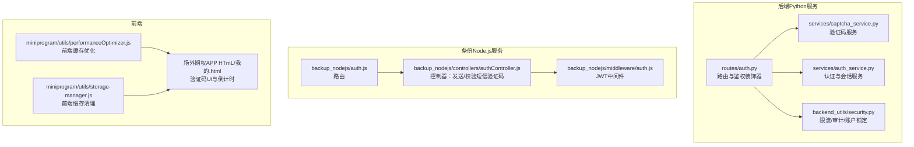
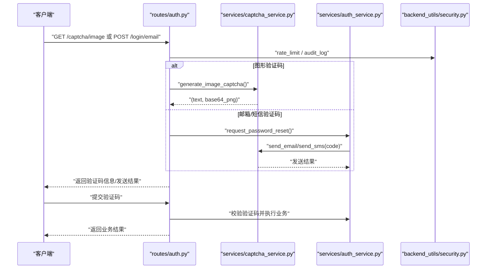
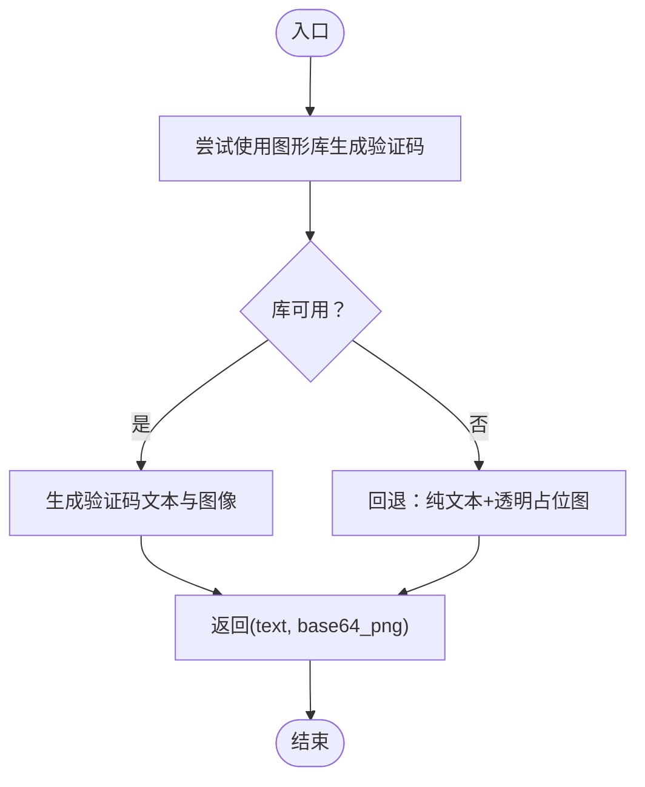
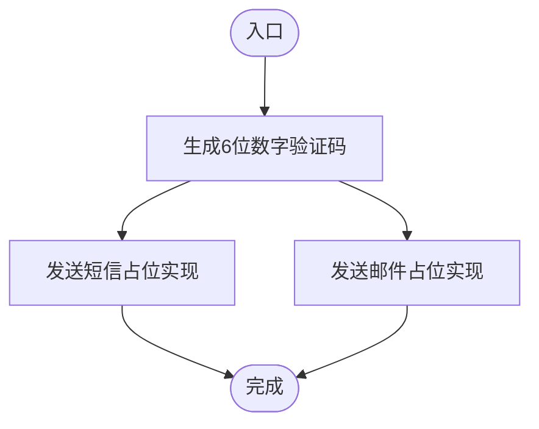
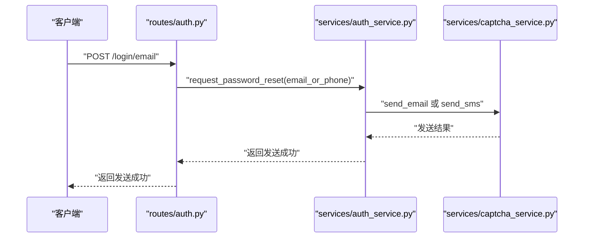
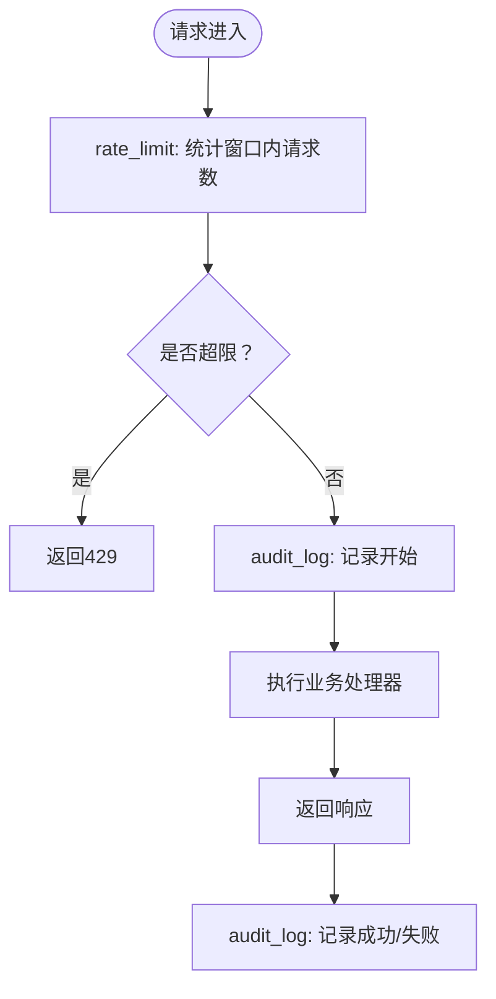
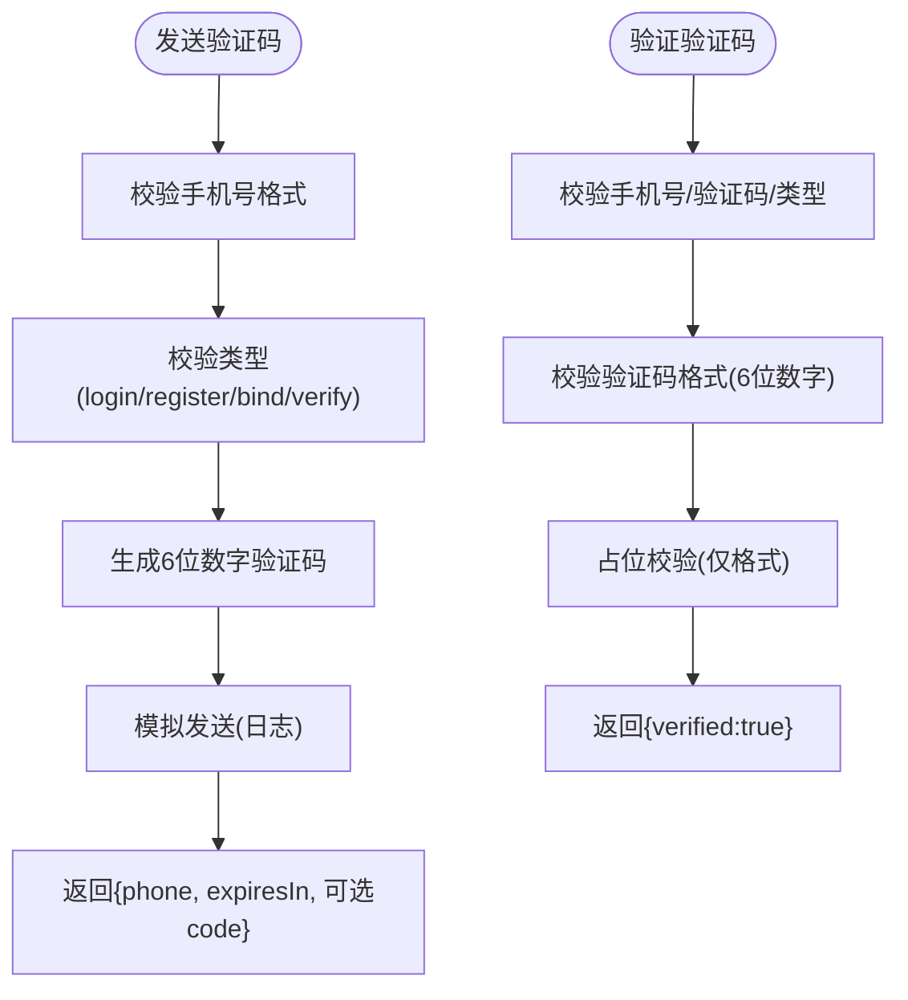
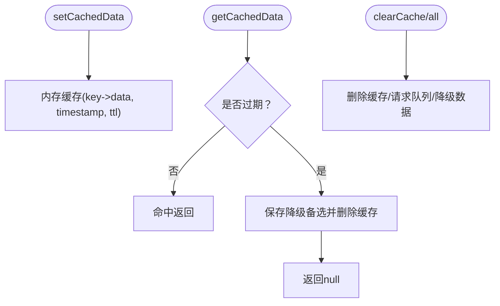
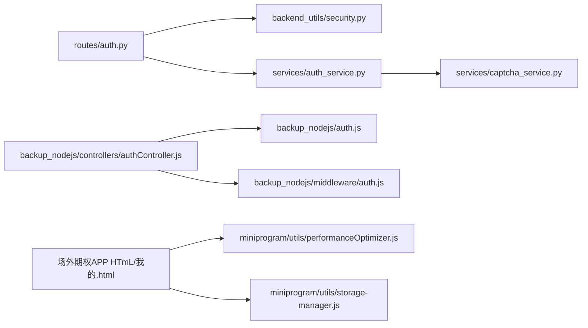

# 验证码服务

<cite>
**本文引用的文件**
- [services/captcha_service.py](file://services/captcha_service.py)
- [services/auth_service.py](file://services/auth_service.py)
- [routes/auth.py](file://routes/auth.py)
- [backup_nodejs/controllers/authController.js](file://backup_nodejs/controllers/authController.js)
- [backup_nodejs/auth.js](file://backup_nodejs/auth.js)
- [backup_nodejs/middleware/auth.js](file://backup_nodejs/middleware/auth.js)
- [backend_utils/security.py](file://backend_utils/security.py)
- [miniprogram/utils/performanceOptimizer.js](file://miniprogram/utils/performanceOptimizer.js)
- [miniprogram/utils/storage-manager.js](file://miniprogram/utils/storage-manager.js)
- [场外期权APP HTmL/我的.html](file://场外期权APP HTmL/我的.html)
</cite>

## 目录
1. [简介](#简介)
2. [项目结构](#项目结构)
3. [核心组件](#核心组件)
4. [架构总览](#架构总览)
5. [组件详解](#组件详解)
6. [依赖关系分析](#依赖关系分析)
7. [性能与并发](#性能与并发)
8. [安全机制与防护](#安全机制与防护)
9. [故障排查](#故障排查)
10. [结论](#结论)
11. [附录](#附录)

## 简介
本文件面向验证码服务的安全设计与实现，覆盖图形验证码与短信验证码的生成、发送、校验、存储与过期处理；详述防暴力破解与频率限制策略；梳理验证码服务与认证系统的集成路径；并给出性能优化、缓存策略、并发处理、安全最佳实践、防攻击措施、漏洞防护、与认证系统集成、用户体验优化、错误处理、测试与安全审计、合规检查等建议。

## 项目结构
验证码服务横跨后端Python服务、备份Node.js服务、前端小程序与HTML页面，以及通用安全与缓存工具模块。下图展示与验证码相关的关键文件与模块：

图表来源
- [routes/auth.py](file://routes/auth.py#L1-L200)
- [services/auth_service.py](file://services/auth_service.py#L1-L416)
- [services/captcha_service.py](file://services/captcha_service.py#L1-L52)
- [backend_utils/security.py](file://backend_utils/security.py#L1-L117)
- [backup_nodejs/auth.js](file://backup_nodejs/auth.js#L1-L23)
- [backup_nodejs/controllers/authController.js](file://backup_nodejs/controllers/authController.js#L1-L348)
- [backup_nodejs/middleware/auth.js](file://backup_nodejs/middleware/auth.js#L1-L85)
- [miniprogram/utils/performanceOptimizer.js](file://miniprogram/utils/performanceOptimizer.js#L86-L138)
- [miniprogram/utils/storage-manager.js](file://miniprogram/utils/storage-manager.js#L534-L622)
- [场外期权APP HTmL/我的.html](file://场外期权APP HTmL/我的.html#L5593-L10324)

章节来源
- [routes/auth.py](file://routes/auth.py#L1-L200)
- [services/captcha_service.py](file://services/captcha_service.py#L1-L52)
- [services/auth_service.py](file://services/auth_service.py#L1-L416)
- [backup_nodejs/controllers/authController.js](file://backup_nodejs/controllers/authController.js#L1-L348)
- [miniprogram/utils/performanceOptimizer.js](file://miniprogram/utils/performanceOptimizer.js#L86-L138)
- [miniprogram/utils/storage-manager.js](file://miniprogram/utils/storage-manager.js#L534-L622)
- [场外期权APP HTmL/我的.html](file://场外期权APP HTmL/我的.html#L5593-L10324)

## 核心组件
- 图形验证码服务：负责生成图形验证码文本与图片，提供发送邮件/短信的占位实现。
- 短信验证码服务：负责生成6位数字验证码，提供发送短信/邮件的占位实现。
- 认证服务：与验证码服务协作，支持邮箱/短信验证码触发与重置密码流程。
- 路由与鉴权：提供验证码接口、登录接口、限流与审计日志装饰器。
- 安全工具：提供基础限流、账户锁定与审计日志能力。
- 前端缓存与UI：提供验证码UI、倒计时与缓存清理能力。

章节来源
- [services/captcha_service.py](file://services/captcha_service.py#L1-L52)
- [services/auth_service.py](file://services/auth_service.py#L180-L194)
- [routes/auth.py](file://routes/auth.py#L187-L200)
- [backend_utils/security.py](file://backend_utils/security.py#L17-L117)
- [miniprogram/utils/performanceOptimizer.js](file://miniprogram/utils/performanceOptimizer.js#L86-L138)
- [miniprogram/utils/storage-manager.js](file://miniprogram/utils/storage-manager.js#L534-L622)
- [场外期权APP HTmL/我的.html](file://场外期权APP HTmL/我的.html#L5593-L10324)

## 架构总览
验证码服务整体流程：客户端请求验证码接口 → 后端生成验证码 → 选择性调用短信/邮件发送 → 客户端轮询/倒计时等待 → 提交验证码 → 后端校验并完成业务操作（如登录/重置密码）。

图表来源
- [routes/auth.py](file://routes/auth.py#L187-L200)
- [services/captcha_service.py](file://services/captcha_service.py#L14-L51)
- [services/auth_service.py](file://services/auth_service.py#L180-L194)
- [backend_utils/security.py](file://backend_utils/security.py#L17-L117)

## 组件详解

### 图形验证码组件
- 生成算法：优先使用第三方库生成图形验证码；若不可用则回退为“纯文本+透明占位图”，保证可用性但安全性降低。
- 输出格式：返回验证码文本与Base64 PNG数据，便于前端直接渲染。
- 存储与过期：当前示例将文本返回给前端用于调试；生产应将文本与UUID关联并存入Redis/Session，设置过期时间。

图表来源
- [services/captcha_service.py](file://services/captcha_service.py#L14-L35)

章节来源
- [services/captcha_service.py](file://services/captcha_service.py#L14-L35)

### 短信/邮箱验证码组件
- 生成算法：6位数字验证码，随机生成。
- 发送接口：提供短信与邮件发送占位实现，生产需接入阿里云/腾讯云短信与SMTP邮件服务。
- 过期策略：当前示例返回5分钟过期；生产需结合Redis/数据库记录验证码与过期时间。

图表来源
- [services/captcha_service.py](file://services/captcha_service.py#L11-L12)
- [services/captcha_service.py](file://services/captcha_service.py#L38-L51)

章节来源
- [services/captcha_service.py](file://services/captcha_service.py#L11-L12)
- [services/captcha_service.py](file://services/captcha_service.py#L38-L51)

### 认证服务与验证码联动
- 触发验证码：重置密码流程中根据输入的邮箱或手机号选择对应发送方式。
- 业务处理：验证码校验通过后执行后续业务（如重置密码），当前示例中验证码校验逻辑为占位。

图表来源
- [services/auth_service.py](file://services/auth_service.py#L180-L194)
- [services/captcha_service.py](file://services/captcha_service.py#L46-L51)
- [routes/auth.py](file://routes/auth.py#L195-L200)

章节来源
- [services/auth_service.py](file://services/auth_service.py#L180-L194)
- [routes/auth.py](file://routes/auth.py#L195-L200)

### 路由与鉴权装饰器
- 限流装饰器：基于IP+端点维度统计请求时间窗，超过阈值返回429。
- 审计日志装饰器：记录动作、用户、IP与状态（成功/失败/错误）。
- 鉴权中间件：解析Authorization头，校验JWT有效性。

图表来源
- [backend_utils/security.py](file://backend_utils/security.py#L17-L45)
- [backend_utils/security.py](file://backend_utils/security.py#L87-L117)
- [routes/auth.py](file://routes/auth.py#L1-L200)

章节来源
- [backend_utils/security.py](file://backend_utils/security.py#L17-L45)
- [backend_utils/security.py](file://backend_utils/security.py#L87-L117)
- [routes/auth.py](file://routes/auth.py#L1-L200)

### 备份Node.js验证码实现
- 发送短信验证码：校验手机号与类型，生成6位数字验证码，返回过期时间。
- 验证短信验证码：校验参数格式与类型，当前为占位校验（仅格式校验）。

图表来源
- [backup_nodejs/controllers/authController.js](file://backup_nodejs/controllers/authController.js#L241-L284)
- [backup_nodejs/controllers/authController.js](file://backup_nodejs/controllers/authController.js#L289-L339)

章节来源
- [backup_nodejs/controllers/authController.js](file://backup_nodejs/controllers/authController.js#L241-L284)
- [backup_nodejs/controllers/authController.js](file://backup_nodejs/controllers/authController.js#L289-L339)

### 前端缓存与UI
- 性能优化：提供内存缓存、TTL过期、降级备选数据与批量清理能力。
- 缓存清理：定期清理过期缓存项，支持小程序本地存储清理。
- UI倒计时：页面包含验证码输入、重新发送按钮与倒计时提示。

图表来源
- [miniprogram/utils/performanceOptimizer.js](file://miniprogram/utils/performanceOptimizer.js#L86-L138)
- [miniprogram/utils/storage-manager.js](file://miniprogram/utils/storage-manager.js#L560-L622)
- [场外期权APP HTmL/我的.html](file://场外期权APP HTmL/我的.html#L5593-L10324)

章节来源
- [miniprogram/utils/performanceOptimizer.js](file://miniprogram/utils/performanceOptimizer.js#L86-L138)
- [miniprogram/utils/storage-manager.js](file://miniprogram/utils/storage-manager.js#L560-L622)
- [场外期权APP HTmL/我的.html](file://场外期权APP HTmL/我的.html#L5593-L10324)

## 依赖关系分析
- 路由层依赖安全工具（限流/审计）、认证服务与验证码服务。
- 认证服务依赖验证码服务进行验证码发送。
- Node.js控制器依赖响应封装与JWT中间件，提供短信验证码发送/校验。
- 前端工具依赖UI页面进行验证码交互与倒计时。

图表来源
- [routes/auth.py](file://routes/auth.py#L1-L200)
- [services/auth_service.py](file://services/auth_service.py#L1-L416)
- [services/captcha_service.py](file://services/captcha_service.py#L1-L52)
- [backup_nodejs/controllers/authController.js](file://backup_nodejs/controllers/authController.js#L1-L348)
- [backup_nodejs/auth.js](file://backup_nodejs/auth.js#L1-L23)
- [backup_nodejs/middleware/auth.js](file://backup_nodejs/middleware/auth.js#L1-L85)
- [miniprogram/utils/performanceOptimizer.js](file://miniprogram/utils/performanceOptimizer.js#L86-L138)
- [miniprogram/utils/storage-manager.js](file://miniprogram/utils/storage-manager.js#L534-L622)
- [场外期权APP HTmL/我的.html](file://场外期权APP HTmL/我的.html#L5593-L10324)

章节来源
- [routes/auth.py](file://routes/auth.py#L1-L200)
- [services/auth_service.py](file://services/auth_service.py#L1-L416)
- [services/captcha_service.py](file://services/captcha_service.py#L1-L52)
- [backup_nodejs/controllers/authController.js](file://backup_nodejs/controllers/authController.js#L1-L348)
- [backup_nodejs/auth.js](file://backup_nodejs/auth.js#L1-L23)
- [backup_nodejs/middleware/auth.js](file://backup_nodejs/middleware/auth.js#L1-L85)
- [miniprogram/utils/performanceOptimizer.js](file://miniprogram/utils/performanceOptimizer.js#L86-L138)
- [miniprogram/utils/storage-manager.js](file://miniprogram/utils/storage-manager.js#L534-L622)
- [场外期权APP HTmL/我的.html](file://场外期权APP HTmL/我的.html#L5593-L10324)

## 性能与并发
- 限流策略：按IP+端点维度统计时间窗内请求数，超限返回429，避免突发流量冲击。
- 并发控制：建议在高并发场景引入分布式锁或Redis原子计数，避免竞态条件。
- 缓存优化：前端采用内存缓存+TTL，支持降级备选与批量清理，减少重复请求。
- 存储策略：图形验证码文本应与UUID绑定并存入Redis，设置合理过期时间；短信/邮箱验证码建议持久化并带索引。
- 异步发送：短信/邮件发送建议异步化，避免阻塞主请求线程。

章节来源
- [backend_utils/security.py](file://backend_utils/security.py#L17-L45)
- [miniprogram/utils/performanceOptimizer.js](file://miniprogram/utils/performanceOptimizer.js#L86-L138)
- [miniprogram/utils/storage-manager.js](file://miniprogram/utils/storage-manager.js#L560-L622)
- [services/captcha_service.py](file://services/captcha_service.py#L14-L35)

## 安全机制与防护
- 验证码强度：6位数字验证码满足一般场景；对高安全场景建议使用字母+数字混合或图形验证码。
- 防暴力破解：
  - 限流：基于IP+端点维度限制请求频率。
  - 账户锁定：连续失败达到阈值（如5次）锁定一段时间（如15分钟）。
  - 审计日志：记录动作、用户、IP与状态，便于追踪与取证。
- 存储安全：验证码文本不应明文存储；应与UUID关联并设置过期时间；敏感信息加密传输。
- 传输安全：强制HTTPS，避免明文传输验证码。
- 输入校验：严格校验手机号/邮箱格式、验证码长度与字符集。
- 风险提示：在UI层显示倒计时与“重新发送”按钮，避免用户反复点击导致风控误判。

章节来源
- [backend_utils/security.py](file://backend_utils/security.py#L47-L86)
- [routes/auth.py](file://routes/auth.py#L195-L200)
- [backup_nodejs/controllers/authController.js](file://backup_nodejs/controllers/authController.js#L241-L284)
- [backup_nodejs/controllers/authController.js](file://backup_nodejs/controllers/authController.js#L289-L339)
- [场外期权APP HTmL/我的.html](file://场外期权APP HTmL/我的.html#L5593-L10324)

## 故障排查
- 验证码无法显示/为空：
  - 检查图形库是否安装；若未安装，将回退为占位图。
  - 确认返回的验证码文本与UUID是否正确传递到前端。
- 验证码发送失败：
  - 检查短信/邮件服务接入配置与日志。
  - 确认手机号/邮箱格式与类型参数。
- 验证码校验失败：
  - 当前Node.js实现为占位校验，需对接Redis/数据库进行真实校验。
- 限流触发：
  - 检查IP与端点维度的请求频率，适当提高窗口或阈值。
- 前端缓存异常：
  - 检查TTL设置与过期清理逻辑，确认降级备选数据是否生效。

章节来源
- [services/captcha_service.py](file://services/captcha_service.py#L14-L35)
- [services/captcha_service.py](file://services/captcha_service.py#L38-L51)
- [backup_nodejs/controllers/authController.js](file://backup_nodejs/controllers/authController.js#L241-L284)
- [backup_nodejs/controllers/authController.js](file://backup_nodejs/controllers/authController.js#L289-L339)
- [backend_utils/security.py](file://backend_utils/security.py#L17-L45)
- [miniprogram/utils/storage-manager.js](file://miniprogram/utils/storage-manager.js#L560-L622)

## 结论
验证码服务在当前代码库中提供了基础的图形与短信/邮箱验证码能力，并通过限流、审计与账户锁定等安全工具增强防护。生产落地建议补齐以下关键点：验证码存储与过期、真实验证码校验、分布式限流与锁、异步发送、前端缓存与倒计时优化、安全审计与合规检查。

## 附录

### 接口定义（示意）
- 获取图形验证码
  - 方法：GET
  - 路径：/captcha/image
  - 响应：包含图片Base64与验证码文本（调试用途）
- 请求邮箱/短信验证码（重置密码）
  - 方法：POST
  - 路径：/login/email
  - 参数：email_or_phone
  - 响应：发送成功提示
- 发送短信验证码（备份Node.js）
  - 方法：POST
  - 路径：/send-sms-code
  - 参数：phone, type
  - 响应：{phone, expiresIn, 可选code}
- 验证短信验证码（备份Node.js）
  - 方法：POST
  - 路径：/verify-sms-code
  - 参数：phone, code, type
  - 响应：{verified:true}

章节来源
- [routes/auth.py](file://routes/auth.py#L187-L200)
- [services/auth_service.py](file://services/auth_service.py#L180-L194)
- [backup_nodejs/auth.js](file://backup_nodejs/auth.js#L17-L22)
- [backup_nodejs/controllers/authController.js](file://backup_nodejs/controllers/authController.js#L241-L284)
- [backup_nodejs/controllers/authController.js](file://backup_nodejs/controllers/authController.js#L289-L339)