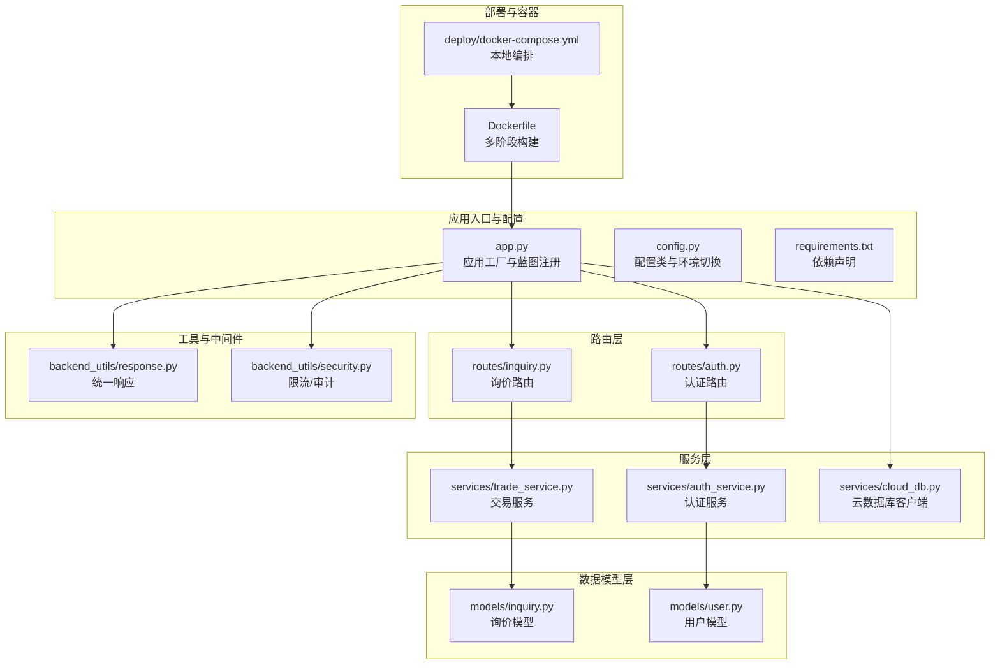
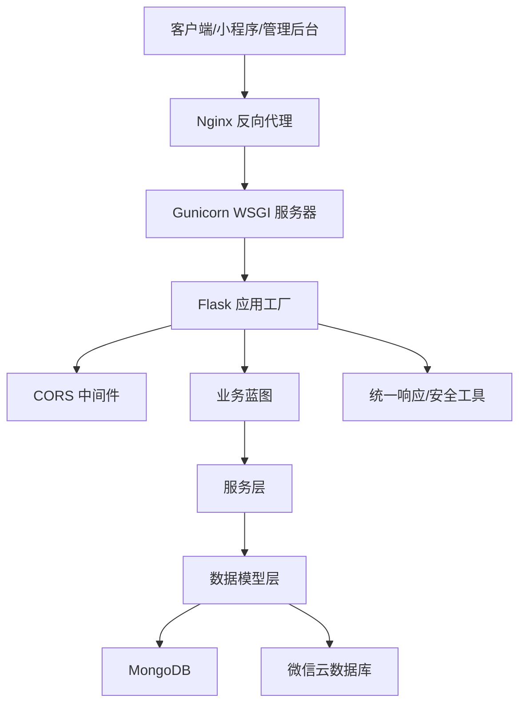
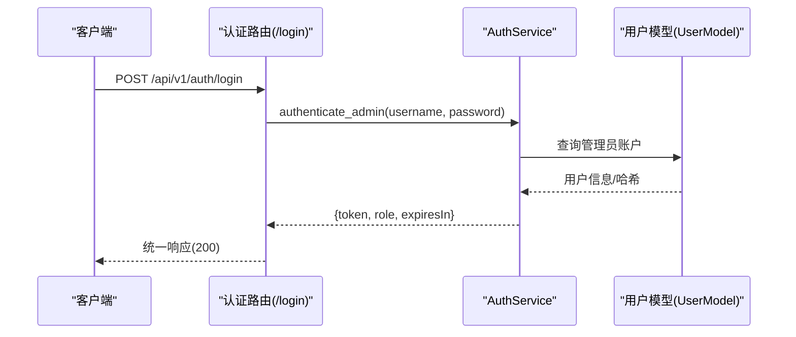
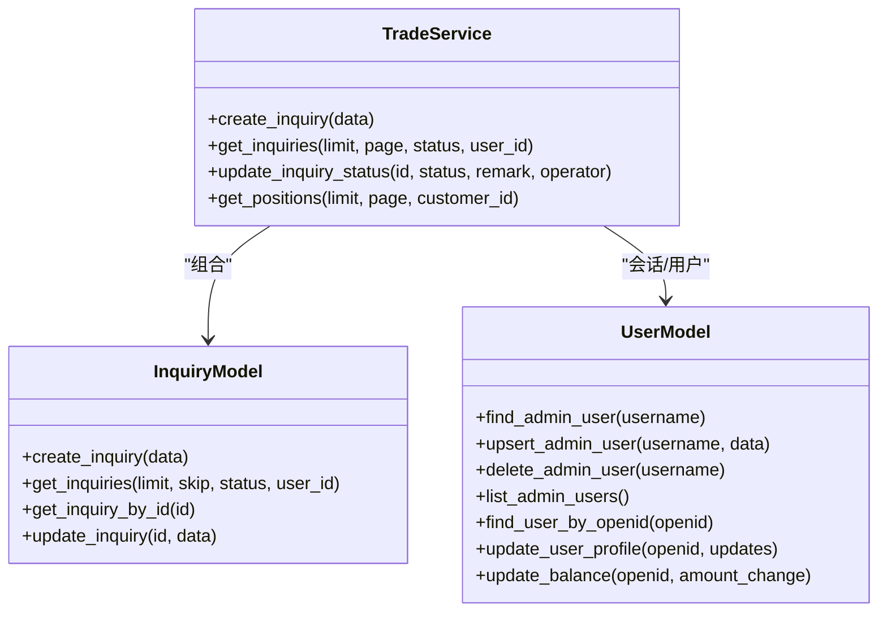
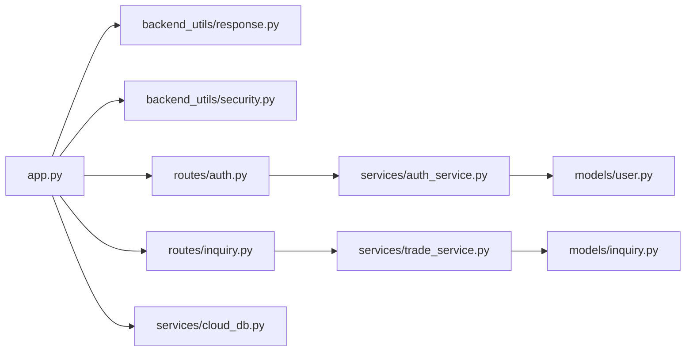

# 后端系统

<cite>
**本文引用的文件**
- [app.py](file://app.py)
- [config.py](file://config.py)
- [requirements.txt](file://requirements.txt)
- [Dockerfile](file://Dockerfile)
- [deploy/docker-compose.yml](file://deploy/docker-compose.yml)
- [routes/inquiry.py](file://routes/inquiry.py)
- [routes/auth.py](file://routes/auth.py)
- [models/inquiry.py](file://models/inquiry.py)
- [models/user.py](file://models/user.py)
- [services/auth_service.py](file://services/auth_service.py)
- [services/trade_service.py](file://services/trade_service.py)
- [backend_utils/response.py](file://backend_utils/response.py)
- [backend_utils/security.py](file://backend_utils/security.py)
- [services/cloud_db.py](file://services/cloud_db.py)
</cite>

## 目录
1. [简介](#简介)
2. [项目结构](#项目结构)
3. [核心组件](#核心组件)
4. [架构总览](#架构总览)
5. [详细组件分析](#详细组件分析)
6. [依赖关系分析](#依赖关系分析)
7. [性能考虑](#性能考虑)
8. [故障排查指南](#故障排查指南)
9. [结论](#结论)
10. [附录](#附录)

## 简介
本文件面向后端系统开发与运维人员，系统性梳理基于 Flask 的期权交易相关后端服务，涵盖应用初始化与配置、中间件与路由设计、RESTful 接口与认证授权、服务层与数据模型、错误处理与日志、性能与并发、安全与 CORS、API 版本管理、部署与高可用等主题。文档同时提供可视化图示与实践建议，帮助快速理解与迭代系统。

## 项目结构
后端采用“蓝图 + 服务层 + 模型层”的分层组织方式，配合统一响应与安全工具模块，形成清晰的职责边界与扩展点。前端静态资源由 Nginx 提供，后端通过 Gunicorn 托管。

图表来源
- [app.py](file://app.py#L103-L276)
- [config.py](file://config.py#L22-L132)
- [routes/auth.py](file://routes/auth.py#L1-L200)
- [routes/inquiry.py](file://routes/inquiry.py#L1-L175)
- [services/auth_service.py](file://services/auth_service.py#L1-L200)
- [services/trade_service.py](file://services/trade_service.py#L1-L200)
- [models/inquiry.py](file://models/inquiry.py#L1-L148)
- [models/user.py](file://models/user.py#L1-L309)
- [backend_utils/response.py](file://backend_utils/response.py#L1-L118)
- [backend_utils/security.py](file://backend_utils/security.py#L1-L117)
- [services/cloud_db.py](file://services/cloud_db.py#L108-L200)
- [Dockerfile](file://Dockerfile#L1-L48)
- [deploy/docker-compose.yml](file://deploy/docker-compose.yml#L1-L42)

章节来源
- [app.py](file://app.py#L103-L276)
- [config.py](file://config.py#L22-L132)
- [requirements.txt](file://requirements.txt#L1-L12)
- [Dockerfile](file://Dockerfile#L1-L48)
- [deploy/docker-compose.yml](file://deploy/docker-compose.yml#L1-L42)

## 核心组件
- 应用工厂与蓝图注册：集中初始化数据库、云数据库、CORS、日志、健康检查与静态资源路由，并注册各业务蓝图。
- 统一响应与安全工具：提供标准 JSON 响应、分页响应与通用错误处理；内置简单限流与审计日志装饰器。
- 认证与授权：基于 JWT 的管理员登录、令牌签发与刷新、角色校验；支持邮箱验证码登录入口。
- 服务层：封装业务逻辑，按需桥接本地 MongoDB 与微信云数据库，屏蔽数据源差异。
- 数据模型层：抽象集合访问与索引初始化，兼容云数据库与本地数据库的查询/更新语义。
- 部署与容器：多阶段构建前端与后端，使用 Gunicorn 托管，docker-compose 编排 Nginx 与应用。

章节来源
- [app.py](file://app.py#L103-L276)
- [backend_utils/response.py](file://backend_utils/response.py#L1-L118)
- [backend_utils/security.py](file://backend_utils/security.py#L1-L117)
- [services/auth_service.py](file://services/auth_service.py#L1-L200)
- [services/trade_service.py](file://services/trade_service.py#L1-L200)
- [models/inquiry.py](file://models/inquiry.py#L1-L148)
- [models/user.py](file://models/user.py#L1-L309)
- [services/cloud_db.py](file://services/cloud_db.py#L108-L200)

## 架构总览
系统采用“应用工厂 + 蓝图 + 服务层 + 模型层 + 工具模块”的分层架构，结合微信云数据库与本地 MongoDB 的双数据源能力，满足小程序端直连云数据库与管理后台复杂查询的需求。

图表来源
- [app.py](file://app.py#L168-L210)
- [routes/auth.py](file://routes/auth.py#L1-L200)
- [routes/inquiry.py](file://routes/inquiry.py#L1-L175)
- [services/trade_service.py](file://services/trade_service.py#L1-L200)
- [services/cloud_db.py](file://services/cloud_db.py#L108-L200)
- [Dockerfile](file://Dockerfile#L46-L48)

## 详细组件分析

### 应用初始化与配置
- 环境变量加载顺序：优先 .env.local，其次根据 NODE_ENV 判断加载 .env.production，最后回退 .env；同时记录 WX_CLOUD_ENV 状态。
- 数据库连接：支持 SKIP_DB_INIT 与 testing 环境跳过；MongoDB 使用短超时避免启动阻塞；云数据库通过 CloudDbClient.from_env 初始化并进行连接测试。
- CORS 配置：对 /api/* 路径开放 GET/POST/PUT/DELETE/OPTIONS，允许 Content-Type、Authorization、X-Requested-With、X-User-ID，支持凭据与缓存。
- 健康检查：/api/v1/health 返回服务状态、数据库连接状态、版本与环境。
- 静态资源：/ 与 /prototype/ 路由回退至前端产物，React 路由友好。
- 错误处理：全局 404/500 与未捕获异常处理，生产环境隐藏堆栈细节。

章节来源
- [app.py](file://app.py#L37-L101)
- [app.py](file://app.py#L116-L181)
- [app.py](file://app.py#L185-L210)
- [app.py](file://app.py#L226-L275)

### 路由系统设计
- 蓝图注册：统一在 create_app 中注册 api_v1 以及 auth、inquiry、stock、admin、group、fee、customer、trade、message、config 等蓝图，便于按模块维护。
- 认证路由：提供 /login、/me、/users 等管理端接口，支持角色校验与审计日志装饰器。
- 询价路由：提供提交询价、管理后台查询/更新状态、批量更新、导出等功能，支持分页与 Excel 导出。

章节来源
- [app.py](file://app.py#L183-L209)
- [routes/auth.py](file://routes/auth.py#L74-L200)
- [routes/inquiry.py](file://routes/inquiry.py#L11-L175)

### RESTful API 设计与请求响应规范
- 统一响应：success/error/paginated 三种格式，Flask 层提供 flask_success_response/flask_error_response/flask_paginated_response。
- 请求头：Authorization: Bearer <token>，支持 X-User-ID 等自定义头。
- 响应体字段：success、message、code、data；分页响应包含 items 与 pagination。
- 状态码：遵循语义化 HTTP 状态码，错误响应 code 字段与 HTTP 状态一致。

章节来源
- [backend_utils/response.py](file://backend_utils/response.py#L11-L118)
- [app.py](file://app.py#L168-L181)

### 认证授权机制
- 登录与令牌：管理员登录返回 access_token/refresh_token，access_token 默认 15 分钟，refresh_token 7 天；刷新时进行会话校验与旋转。
- 角色与权限：require_auth 解析 Bearer 令牌注入 g.admin；require_roles 校验角色等级。
- 审计与限流：审计装饰器记录用户、IP、动作与结果；rate_limit 提供简单限流。
- 邮箱登录：提供 /auth/captcha/image 获取图形验证码，/auth/login/email 支持邮件登录入口（后续可接入 Redis 存储验证码）。

图表来源
- [routes/auth.py](file://routes/auth.py#L74-L96)
- [services/auth_service.py](file://services/auth_service.py#L196-L200)
- [models/user.py](file://models/user.py#L95-L147)

章节来源
- [routes/auth.py](file://routes/auth.py#L33-L72)
- [routes/auth.py](file://routes/auth.py#L74-L200)
- [services/auth_service.py](file://services/auth_service.py#L86-L161)
- [models/user.py](file://models/user.py#L95-L177)

### 服务层设计模式
- 服务层职责：封装业务规则，协调模型层与外部服务；TradeService 聚合 Inquiry/Order/Position 等模型；AuthService 负责认证与会话。
- 数据源适配：通过 current_app.ensure_db/db/cloud_db 获取数据库句柄，模型层自动选择云数据库或本地数据库。
- 位置计算：get_positions 动态拉取实时行情并计算市值与盈亏，保证展示准确性。

章节来源
- [services/trade_service.py](file://services/trade_service.py#L8-L34)
- [services/trade_service.py](file://services/trade_service.py#L125-L164)
- [services/auth_service.py](file://services/auth_service.py#L33-L43)

### 数据模型与数据库操作
- 模型抽象：InquiryModel/PositionModel/UserModel 统一封装 CRUD 与索引；云数据库与本地数据库通过字符串脚本/驱动 API 对齐行为。
- 索引与查询：模型初始化时建立常用索引；查询支持条件过滤、排序、分页与总数统计。
- 原子更新：余额更新采用读取-计算-更新流程，确保一致性。

图表来源
- [models/user.py](file://models/user.py#L10-L309)
- [models/inquiry.py](file://models/inquiry.py#L10-L148)
- [services/trade_service.py](file://services/trade_service.py#L8-L200)

章节来源
- [models/user.py](file://models/user.py#L10-L309)
- [models/inquiry.py](file://models/inquiry.py#L10-L148)
- [services/trade_service.py](file://services/trade_service.py#L38-L94)

### 错误处理策略与日志记录
- 统一错误响应：flask_error_response 输出标准结构，便于前端解析。
- 全局异常捕获：未处理异常与 500 错误记录堆栈，生产环境隐藏细节。
- 日志：控制台与文件双通道输出，支持轮转；审计日志记录关键动作与状态。

章节来源
- [backend_utils/response.py](file://backend_utils/response.py#L80-L93)
- [app.py](file://app.py#L252-L274)
- [config.py](file://config.py#L73-L93)
- [backend_utils/security.py](file://backend_utils/security.py#L87-L116)

### 性能与并发
- Gunicorn：多进程多线程部署，提升并发吞吐。
- 云数据库并发：CloudDbClient 使用连接池与信号量控制最大并发与重试次数。
- 后台任务：定时同步行情，仅在交易时间段执行，降低非活跃时段开销。
- 前端静态资源：Nginx 提供静态文件与反向代理，减轻后端压力。

章节来源
- [Dockerfile](file://Dockerfile#L46-L48)
- [services/cloud_db.py](file://services/cloud_db.py#L121-L139)
- [app.py](file://app.py#L279-L330)
- [deploy/docker-compose.yml](file://deploy/docker-compose.yml#L22-L37)

### 安全配置、CORS 与 API 版本管理
- CORS：限定 /api/* 路径，允许指定头部与凭据，设置缓存时间。
- 安全装饰器：审计日志与简单限流，支持失败尝试锁定策略。
- API 版本：通过 url_prefix /api/v1 管理版本演进，新增接口沿用该前缀。

章节来源
- [app.py](file://app.py#L168-L181)
- [backend_utils/security.py](file://backend_utils/security.py#L17-L45)
- [app.py](file://app.py#L183-L199)

### 开发环境配置、调试技巧与测试策略
- 环境变量：支持 .env.local/.env.production/.env 与系统环境变量覆盖；NODE_ENV 控制调试模式与端口策略。
- 调试：开发模式关闭 reloader 提升稳定性；日志输出到控制台与文件。
- 测试：存在单元与集成测试目录，建议补充接口测试与覆盖率统计。

章节来源
- [app.py](file://app.py#L37-L57)
- [app.py](file://app.py#L336-L350)
- [config.py](file://config.py#L95-L125)

### 部署配置、负载均衡与高可用
- 容器化：多阶段构建前端与后端，暴露 80 端口，使用 Gunicorn。
- 编排：docker-compose 启动 Flask 与 Nginx，挂载日志与环境文件。
- 负载均衡：Nginx 作为反向代理，支持 HTTPS 证书挂载与日志目录映射。
- 高可用：容器重启策略与网络隔离；建议引入健康检查与自动扩缩容。

章节来源
- [Dockerfile](file://Dockerfile#L1-L48)
- [deploy/docker-compose.yml](file://deploy/docker-compose.yml#L1-L42)

## 依赖关系分析

图表来源
- [app.py](file://app.py#L103-L209)
- [routes/auth.py](file://routes/auth.py#L1-L200)
- [routes/inquiry.py](file://routes/inquiry.py#L1-L175)
- [services/auth_service.py](file://services/auth_service.py#L1-L200)
- [services/trade_service.py](file://services/trade_service.py#L1-L200)
- [models/inquiry.py](file://models/inquiry.py#L1-L148)
- [models/user.py](file://models/user.py#L1-L309)
- [services/cloud_db.py](file://services/cloud_db.py#L108-L200)
- [backend_utils/response.py](file://backend_utils/response.py#L1-L118)
- [backend_utils/security.py](file://backend_utils/security.py#L1-L117)

章节来源
- [app.py](file://app.py#L103-L209)
- [routes/auth.py](file://routes/auth.py#L1-L200)
- [routes/inquiry.py](file://routes/inquiry.py#L1-L175)
- [services/auth_service.py](file://services/auth_service.py#L1-L200)
- [services/trade_service.py](file://services/trade_service.py#L1-L200)
- [models/inquiry.py](file://models/inquiry.py#L1-L148)
- [models/user.py](file://models/user.py#L1-L309)
- [services/cloud_db.py](file://services/cloud_db.py#L108-L200)
- [backend_utils/response.py](file://backend_utils/response.py#L1-L118)
- [backend_utils/security.py](file://backend_utils/security.py#L1-L117)

## 性能考虑
- 云数据库并发：合理设置 WX_CLOUD_MAX_INFLIGHT/WX_CLOUD_MAX_RETRIES，避免过度并发导致限流。
- 后台任务节流：仅在交易时间执行行情同步，减少非活跃时段资源消耗。
- 前端静态资源：Nginx 提供静态文件与缓存，降低后端 I/O 压力。
- 日志轮转：生产环境启用轮转，避免磁盘膨胀。

## 故障排查指南
- 数据库连接失败：检查 MONGO_URI 与网络连通性；确认 SKIP_DB_INIT 与 NODE_ENV 设置。
- 云数据库初始化失败：核对 WX_CLOUD_ENV/WX_APPID/WX_SECRET；查看连接测试日志。
- 认证失败：确认 Authorization 头格式与令牌有效期；检查角色权限。
- CORS 跨域问题：确认 ALLOWED_ORIGINS 与允许的请求头；确保 /api/* 前缀正确。
- 500 错误：查看 server.log 与堆栈信息，定位具体异常。

章节来源
- [app.py](file://app.py#L64-L88)
- [app.py](file://app.py#L121-L152)
- [routes/auth.py](file://routes/auth.py#L33-L54)
- [app.py](file://app.py#L168-L181)
- [app.py](file://app.py#L256-L274)

## 结论
该后端系统以 Flask 为基础，通过蓝图与服务层解耦业务，结合统一响应与安全工具，实现了清晰的 RESTful 接口与可扩展的认证授权体系。双数据源设计兼顾小程序直连云数据库与管理后台复杂查询场景。建议在生产环境中完善令牌存储、限流策略与监控告警，并持续优化后台任务与日志策略。

## 附录
- 环境变量建议：SECRET_KEY、JWT_SECRET、MONGO_URI、WX_CLOUD_ENV、WX_APPID、WX_SECRET、ALLOWED_ORIGINS、FLASK_PORT、NODE_ENV。
- 健康检查：GET /api/v1/health。
- 静态资源：根路径回退到前端产物，支持 React 路由。