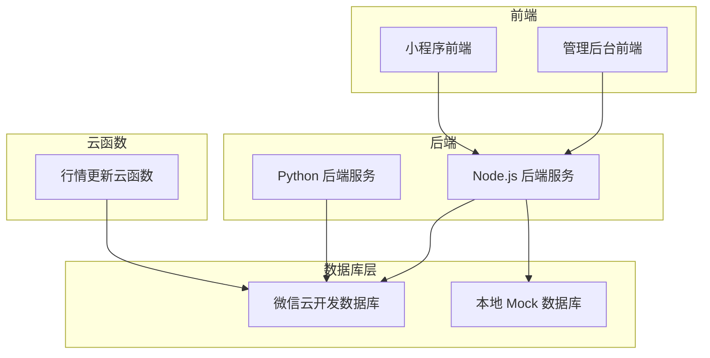
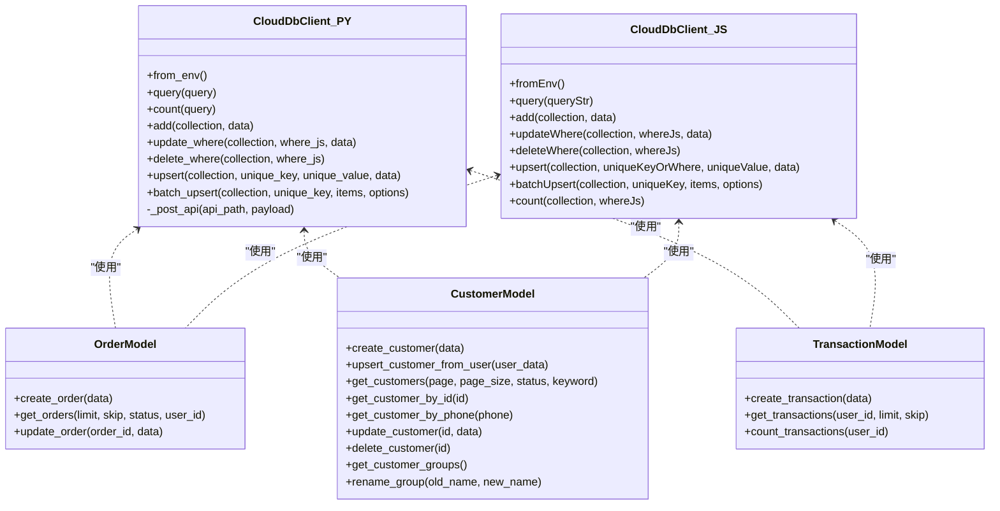
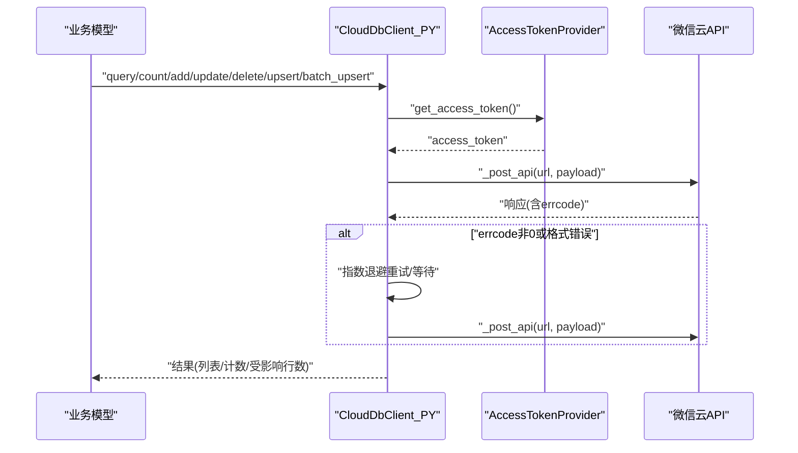
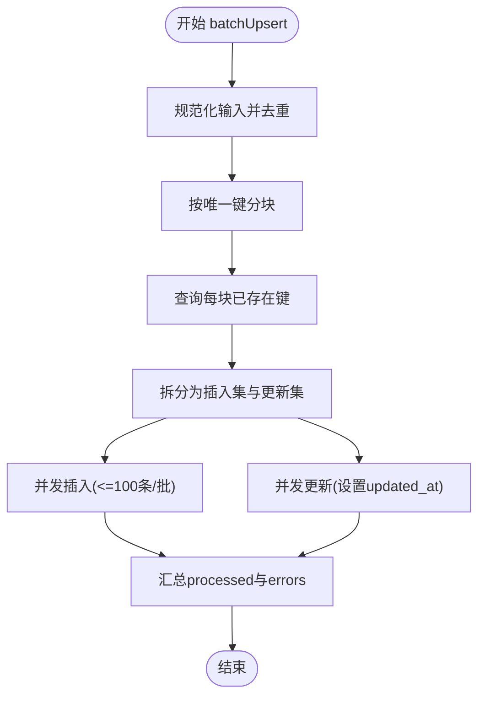
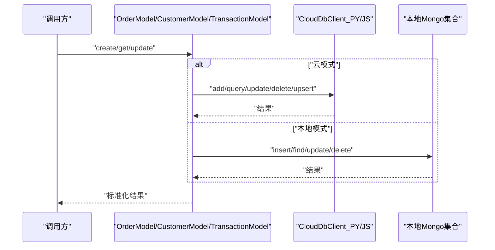
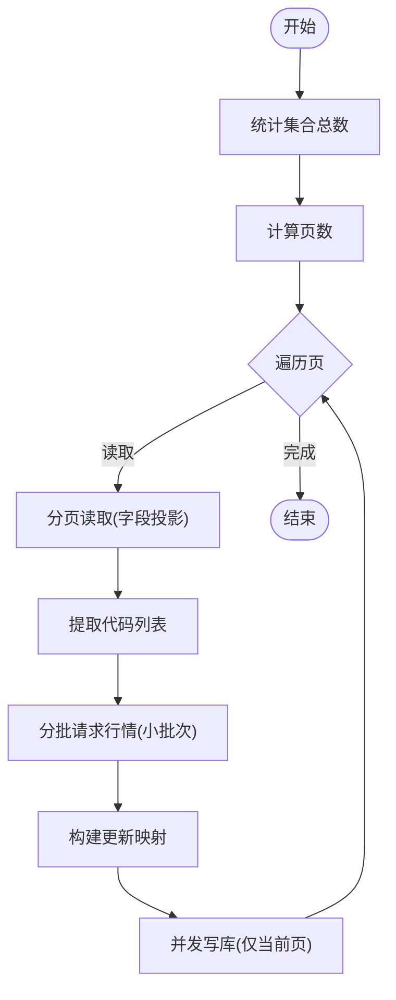
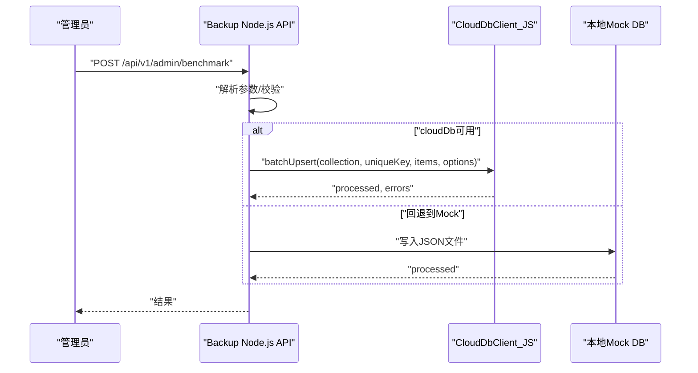
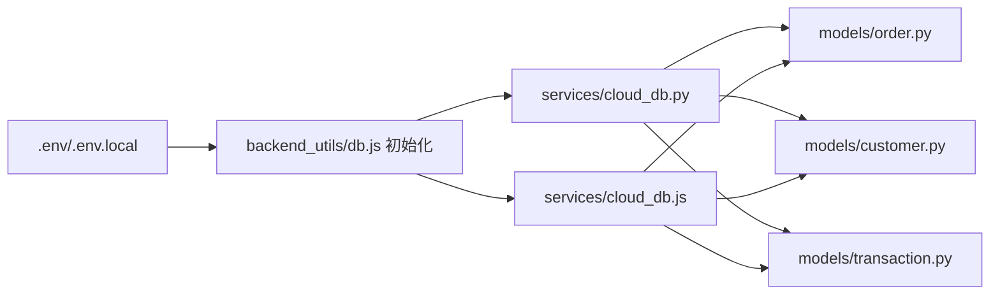

# 数据库集成

<cite>
**本文引用的文件**
- [services/cloud_db.py](file://services/cloud_db.py)
- [services/cloud_db.js](file://services/cloud_db.js)
- [backend_utils/db.js](file://backend_utils/db.js)
- [models/order.py](file://models/order.py)
- [models/customer.py](file://models/customer.py)
- [models/transaction.py](file://models/transaction.py)
- [cloudfunctions/updateQuotes/index.js](file://cloudfunctions/updateQuotes/index.js)
- [backup_nodejs/app.js](file://backup_nodejs/app.js)
- [scripts/migrate_identity.py](file://scripts/migrate_identity.py)
- [.env](file://.env)
- [.env.local](file://.env.local)
- [routes/admin.py](file://routes/admin.py)
</cite>

## 目录
1. [简介](#简介)
2. [项目结构](#项目结构)
3. [核心组件](#核心组件)
4. [架构总览](#架构总览)
5. [详细组件分析](#详细组件分析)
6. [依赖关系分析](#依赖关系分析)
7. [性能考量](#性能考量)
8. [故障排查指南](#故障排查指南)
9. [结论](#结论)
10. [附录](#附录)

## 简介
本文件面向数据库集成的技术文档，围绕以下目标展开：MongoDB 连接池管理、事务处理与数据一致性、云数据库集成与本地回退、故障转移机制、数据库操作封装与查询优化、索引策略、数据迁移与备份恢复、性能监控与慢查询分析、安全配置与访问控制、以及测试策略与压力测试。文档基于仓库中的实际实现进行梳理，并提供可视化图示帮助理解。

## 项目结构
该项目采用前后端分离与云函数协同的架构：
- 后端 Node.js 服务负责 API、路由与业务编排，支持云数据库与本地 Mock 双模式运行。
- Python 后端提供部分服务与脚本，用于迁移与安全校验。
- 云函数负责高频行情数据的流式处理与批量写入。
- 前端通过代理访问后端 API。

图表来源
- [services/cloud_db.js](file://services/cloud_db.js#L1-L327)
- [services/cloud_db.py](file://services/cloud_db.py#L1-L533)
- [backend_utils/db.js](file://backend_utils/db.js#L1-L64)
- [cloudfunctions/updateQuotes/index.js](file://cloudfunctions/updateQuotes/index.js#L101-L142)

章节来源
- [services/cloud_db.js](file://services/cloud_db.js#L1-L327)
- [services/cloud_db.py](file://services/cloud_db.py#L1-L533)
- [backend_utils/db.js](file://backend_utils/db.js#L1-L64)

## 核心组件
- 云数据库客户端（Python/Node.js 双实现）：统一抽象云数据库的查询、计数、增删改、Upsert 与批量 Upsert，内置重试、限流与连接池配置。
- 数据模型封装：订单、客户、交易等模型对云/本地双形态进行适配，屏蔽差异。
- 云函数：针对行情数据的流式分页读取与并发写入，避免 OOM。
- 备份与基准测试服务：提供批量 Upsert 的基准能力与统计接口。
- 环境配置：通过环境变量控制云数据库开关、SSL 校验、并发与重试等参数。

章节来源
- [services/cloud_db.py](file://services/cloud_db.py#L108-L533)
- [services/cloud_db.js](file://services/cloud_db.js#L7-L327)
- [models/order.py](file://models/order.py#L10-L119)
- [models/customer.py](file://models/customer.py#L10-L300)
- [models/transaction.py](file://models/transaction.py#L6-L60)
- [cloudfunctions/updateQuotes/index.js](file://cloudfunctions/updateQuotes/index.js#L101-L142)
- [backup_nodejs/app.js](file://backup_nodejs/app.js#L1-L1085)
- [.env](file://.env#L1-L32)
- [.env.local](file://.env.local#L1-L16)

## 架构总览
下图展示云数据库客户端在不同语言中的实现与调用链，以及与业务模型的关系。

图表来源
- [services/cloud_db.py](file://services/cloud_db.py#L108-L533)
- [services/cloud_db.js](file://services/cloud_db.js#L7-L327)
- [models/order.py](file://models/order.py#L10-L119)
- [models/customer.py](file://models/customer.py#L10-L300)
- [models/transaction.py](file://models/transaction.py#L6-L60)

## 详细组件分析

### 云数据库客户端（Python）
- 连接池与并发：通过 HTTPAdapter 配置连接池大小，与最大并发数一致；使用有界信号量限制同时请求数。
- 访问令牌：AccessTokenProvider 负责拉取与续期 access_token，并带刷新余量。
- 请求重试：指数退避重试，区分速率限制与一般错误，自动等待。
- 查询与计数：query 返回列表，count 返回整数；对集合不存在等特殊错误做降级处理。
- Upsert 与批量 Upsert：先查后写，支持并发与分块，保证幂等性与一致性。

图表来源
- [services/cloud_db.py](file://services/cloud_db.py#L486-L533)
- [services/cloud_db.py](file://services/cloud_db.py#L36-L106)

章节来源
- [services/cloud_db.py](file://services/cloud_db.py#L108-L533)

### 云数据库客户端（Node.js）
- 并发控制：自定义 acquire/release 限流队列，避免超出最大并发。
- 重试策略：与 Python 版类似，区分速率限制与一般错误，指数退避。
- 批量 Upsert：分块查询现有键，再并发插入/更新，支持写入并发度与分块大小配置。

图表来源
- [services/cloud_db.js](file://services/cloud_db.js#L224-L314)

章节来源
- [services/cloud_db.js](file://services/cloud_db.js#L7-L327)

### 数据模型封装（订单/客户/交易）
- 统一入口：构造函数接收 db 与 cloud_client，内部根据是否存在 cloud_client 决定走云还是本地。
- 订单模型：创建时生成 orderId；查询支持状态与用户过滤；更新统一设置 updatedAt。
- 客户模型：创建前检查手机号唯一；支持按关键字模糊查询；分组名聚合与重命名。
- 交易模型：创建时写入 created_at；查询按用户与分页排序；统计总数。

图表来源
- [models/order.py](file://models/order.py#L28-L97)
- [models/customer.py](file://models/customer.py#L23-L177)
- [models/transaction.py](file://models/transaction.py#L19-L60)

章节来源
- [models/order.py](file://models/order.py#L10-L119)
- [models/customer.py](file://models/customer.py#L10-L300)
- [models/transaction.py](file://models/transaction.py#L6-L60)

### 云函数：行情数据流式处理与批量写入
- 分页与流式：先统计总数，按固定页大小分页读取，逐页处理，避免一次性加载过多导致内存溢出。
- 并发写入：每页内对股票代码分批请求行情，再并发写库，写入阶段仅处理当前页数据。
- 时间戳：统一使用服务器时间，保证数据时效性。

图表来源
- [cloudfunctions/updateQuotes/index.js](file://cloudfunctions/updateQuotes/index.js#L101-L142)

章节来源
- [cloudfunctions/updateQuotes/index.js](file://cloudfunctions/updateQuotes/index.js#L101-L142)

### 备份与基准测试服务（Node.js）
- 环境变量加载：优先 .env.local 覆盖 .env，便于本地调试。
- 基准接口：支持 upsert/delete/roundtrip 三种模式，可配置写入并发与分块大小。
- 统计接口：快速统计各集合数量，辅助运维与容量评估。

图表来源
- [backup_nodejs/app.js](file://backup_nodejs/app.js#L1024-L1085)
- [backup_nodejs/app.js](file://backup_nodejs/app.js#L1-L1085)
- [services/cloud_db.js](file://services/cloud_db.js#L224-L314)

章节来源
- [backup_nodejs/app.js](file://backup_nodejs/app.js#L1-L1085)
- [services/cloud_db.js](file://services/cloud_db.js#L224-L314)

### 数据迁移工具（Python）
- 应用上下文：根据环境变量选择云数据库或本地 MongoDB。
- 用户到客户的迁移：分页扫描用户，逐条 upsert 客户记录，记录成功/失败统计。
- ID 规范化：确保 _id 为字符串，避免类型不一致引发的问题。

章节来源
- [scripts/migrate_identity.py](file://scripts/migrate_identity.py#L18-L102)

## 依赖关系分析
- 云数据库客户端被多个模型复用，形成“模型-云客户端”依赖。
- Node.js 侧 db.js 在启动时尝试初始化云客户端，失败则回退到本地 Mock。
- 环境变量控制云数据库开关与行为（如 SSL 校验、并发、重试、分块大小等）。

图表来源
- [backend_utils/db.js](file://backend_utils/db.js#L1-L64)
- [services/cloud_db.py](file://services/cloud_db.py#L162-L208)
- [services/cloud_db.js](file://services/cloud_db.js#L27-L37)
- [models/order.py](file://models/order.py#L10-L26)
- [models/customer.py](file://models/customer.py#L10-L21)
- [models/transaction.py](file://models/transaction.py#L6-L14)

章节来源
- [backend_utils/db.js](file://backend_utils/db.js#L1-L64)
- [.env](file://.env#L1-L32)
- [.env.local](file://.env.local#L1-L16)

## 性能考量
- 连接池与并发
  - Python 客户端：连接池大小与最大并发一致，避免阻塞；信号量限制同时请求数。
  - Node.js 客户端：自定义限流队列，避免超卖并发。
- 批量与分块
  - Python 客户端批量 add 限制在 100 条以内；批量 Upsert 默认分块大小与写入并发可由环境变量调整。
  - Node.js 客户端默认分块大小与写入并发可由环境变量控制。
- 查询优化
  - 云函数采用分页+字段投影，避免全量读取；并发写入仅处理当前页。
  - 模型查询尽量使用索引字段（如订单号、创建时间）。
- 索引策略
  - 订单模型在 orderId（唯一）、createdAt 上建立索引，提升查询与去重效率。
- 重试与退避
  - 对速率限制类错误采用指数退避，降低抖动影响。
- 基准测试
  - 提供批量 Upsert 基准接口，支持多并发与分块大小对比，辅助容量规划。

章节来源
- [services/cloud_db.py](file://services/cloud_db.py#L121-L138)
- [services/cloud_db.py](file://services/cloud_db.py#L331-L484)
- [services/cloud_db.js](file://services/cloud_db.js#L39-L51)
- [services/cloud_db.js](file://services/cloud_db.js#L224-L314)
- [models/order.py](file://models/order.py#L17-L21)
- [cloudfunctions/updateQuotes/index.js](file://cloudfunctions/updateQuotes/index.js#L101-L142)
- [backup_nodejs/app.js](file://backup_nodejs/app.js#L1024-L1085)

## 故障排查指南
- 云数据库不可用或集合不存在
  - Python 客户端对“集合不存在”进行降级处理并返回空结果；可在日志中定位具体错误。
  - Node.js 客户端同样对速率限制与 QPS 过高进行退避重试。
- 配置缺失
  - 环境变量 WX_CLOUD_ENV/WX_APPID/WX_SECRET 未正确设置或仍为占位符时，客户端初始化会抛错。
- 本地回退
  - Node.js 启动时若无法初始化云客户端，会回退到本地 Mock 文件存储，确保服务可用。
- 常见问题定位
  - 查看日志输出，确认是否进入云模式或本地模式。
  - 使用统计接口快速判断集合数量与服务健康状态。

章节来源
- [services/cloud_db.py](file://services/cloud_db.py#L241-L247)
- [services/cloud_db.py](file://services/cloud_db.py#L515-L519)
- [services/cloud_db.js](file://services/cloud_db.js#L124-L132)
- [services/cloud_db.js](file://services/cloud_db.js#L32-L36)
- [backend_utils/db.js](file://backend_utils/db.js#L5-L11)
- [backup_nodejs/app.js](file://backup_nodejs/app.js#L154-L184)

## 结论
本项目通过统一的云数据库客户端抽象，实现了对云数据库与本地存储的无缝切换；通过严格的重试与并发控制保障稳定性；通过流式处理与批量 Upsert 提升性能；通过迁移脚本与备份接口支撑数据治理与运维。建议在生产环境中结合监控与告警，持续优化并发与分块参数，并完善索引策略以进一步提升查询性能。

## 附录

### 环境变量一览
- 云数据库相关
  - WX_APPID/WX_SECRET/WX_CLOUD_ENV/WX_VERIFY_SSL
- 并发与重试
  - WX_DB_MAX_INFLIGHT/WX_DB_MAX_RETRIES/WX_DB_MAX_WORKERS/WX_DB_CHUNK_SIZE
- 其他
  - FILE_DB_PATH、JWT_SECRET、ADMIN_JWT_SECRET、JWT_EXPIRES_SECONDS、ALLOWED_ORIGINS 等

章节来源
- [.env](file://.env#L1-L32)
- [.env.local](file://.env.local#L1-L16)
- [services/cloud_db.py](file://services/cloud_db.py#L141-L160)
- [services/cloud_db.js](file://services/cloud_db.js#L39-L51)
- [services/cloud_db.js](file://services/cloud_db.js#L224-L230)