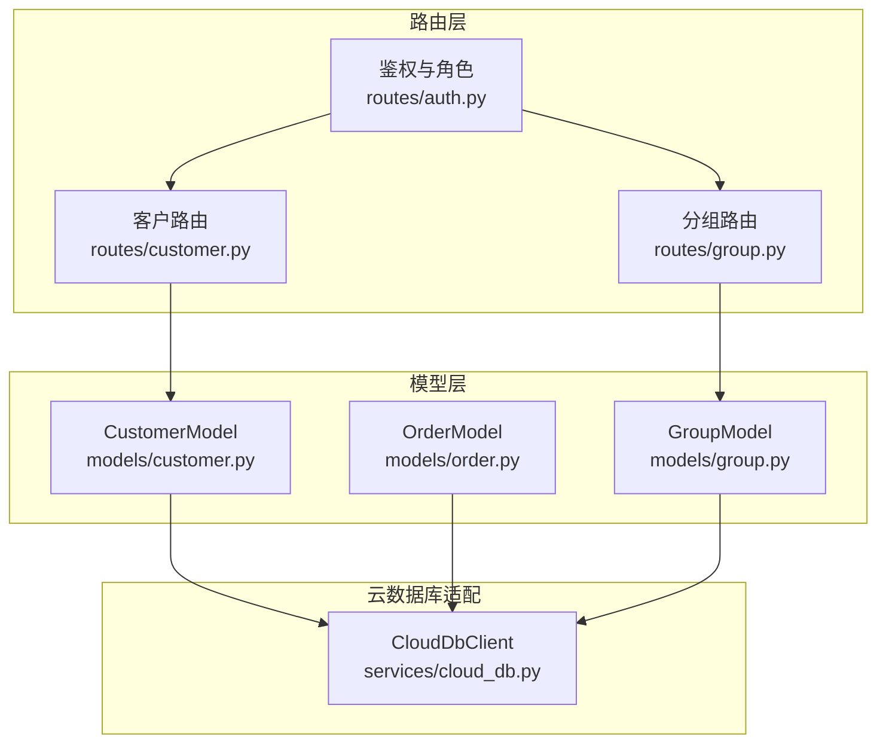
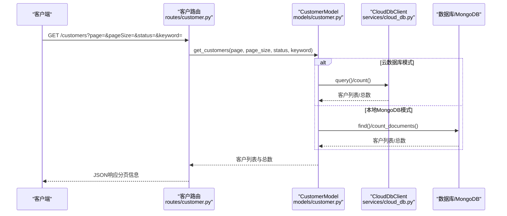
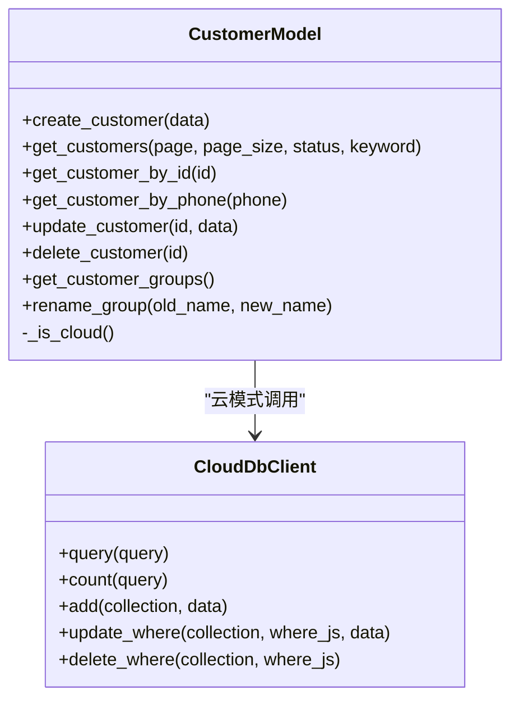
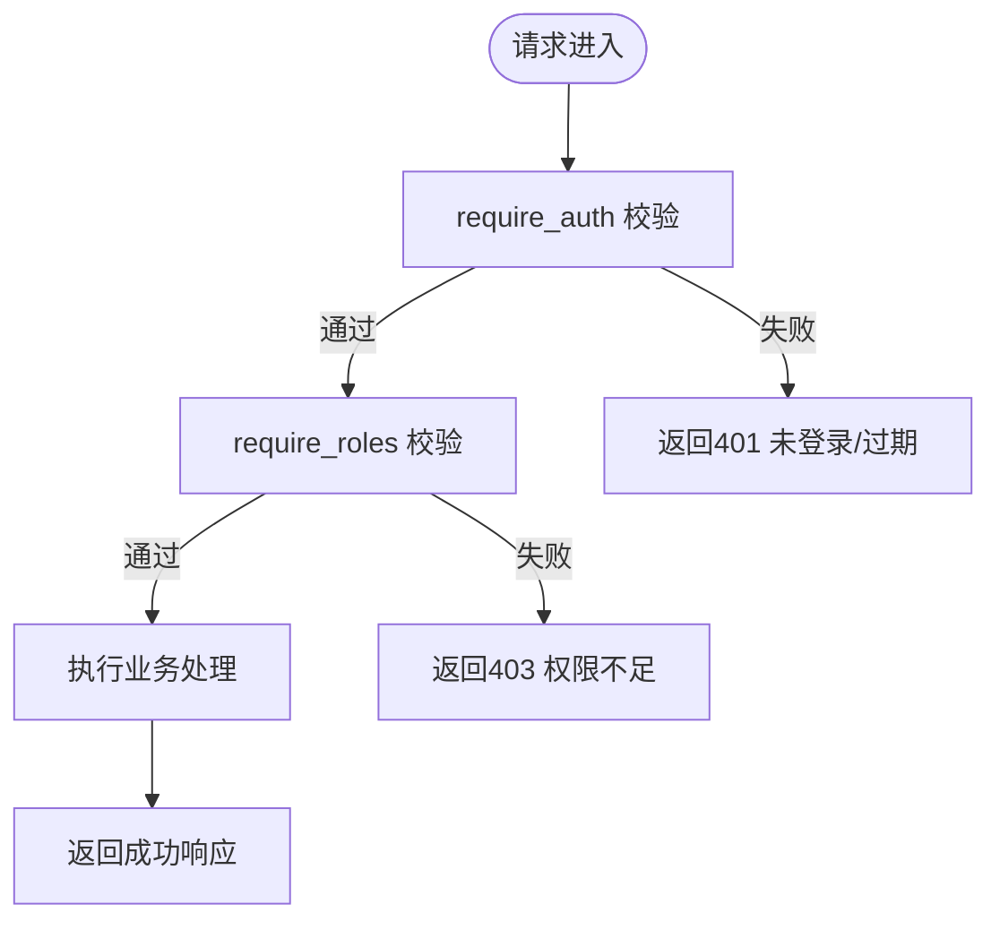
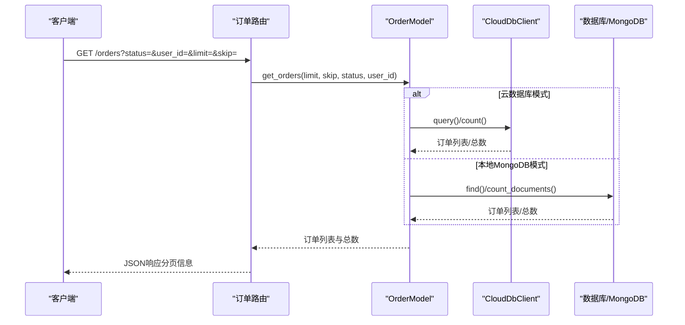
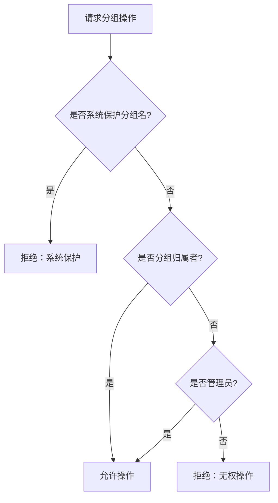
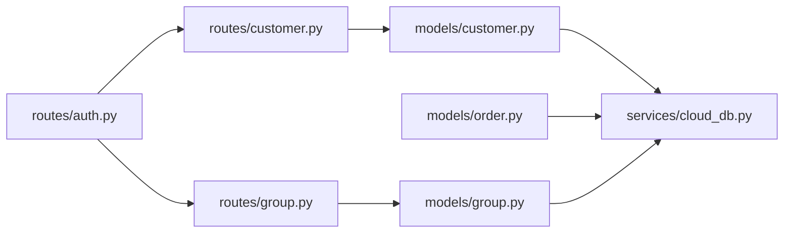

# 客户模型

<cite>
**本文引用的文件**
- [models/customer.py](file://models/customer.py)
- [routes/customer.py](file://routes/customer.py)
- [services/cloud_db.py](file://services/cloud_db.py)
- [routes/auth.py](file://routes/auth.py)
- [models/order.py](file://models/order.py)
- [models/group.py](file://models/group.py)
- [routes/group.py](file://routes/group.py)
- [README.md](file://README.md)
</cite>

## 目录
1. [简介](#简介)
2. [项目结构](#项目结构)
3. [核心组件](#核心组件)
4. [架构总览](#架构总览)
5. [详细组件分析](#详细组件分析)
6. [依赖分析](#依赖分析)
7. [性能考量](#性能考量)
8. [故障排查指南](#故障排查指南)
9. [结论](#结论)
10. [附录](#附录)

## 简介
本文件系统化梳理“客户数据模型”的设计与实现，覆盖字段定义、数据类型规范、客户分组机制、权限控制与角色管理、客户与询价/订单的关联关系与数据完整性保障、信息验证规则、数据安全与隐私保护、查询优化与分页策略，以及模型扩展、字段演进与数据迁移方案。文档面向开发者与运维人员，兼顾非技术读者的理解需求。

## 项目结构
围绕客户模型的关键文件组织如下：
- 模型层：models/customer.py 定义客户实体与数据访问；models/order.py 定义订单模型；models/group.py 定义分组模型。
- 路由层：routes/customer.py 提供客户管理接口；routes/group.py 提供分组管理接口；routes/auth.py 提供鉴权与角色校验。
- 云数据库适配：services/cloud_db.py 提供云数据库客户端封装，统一本地与云环境的CRUD与查询能力。

**图表来源**
- [models/customer.py](file://models/customer.py#L10-L300)
- [routes/customer.py](file://routes/customer.py#L1-L217)
- [services/cloud_db.py](file://services/cloud_db.py#L108-L533)
- [models/order.py](file://models/order.py#L10-L119)
- [models/group.py](file://models/group.py#L10-L283)
- [routes/group.py](file://routes/group.py#L1-L269)
- [routes/auth.py](file://routes/auth.py#L33-L72)

**章节来源**
- [models/customer.py](file://models/customer.py#L10-L300)
- [routes/customer.py](file://routes/customer.py#L1-L217)
- [services/cloud_db.py](file://services/cloud_db.py#L108-L533)
- [models/order.py](file://models/order.py#L10-L119)
- [models/group.py](file://models/group.py#L10-L283)
- [routes/group.py](file://routes/group.py#L1-L269)
- [routes/auth.py](file://routes/auth.py#L33-L72)

## 核心组件
- 客户模型 CustomerModel：负责客户实体的创建、查询、更新、删除、分组管理与重命名等操作，并支持本地MongoDB与微信云数据库两种后端。
- 订单模型 OrderModel：负责订单的创建、查询与更新，内部维护订单号唯一索引与时间索引。
- 分组模型 GroupModel：负责分组的创建、查询、成员管理与权限控制。
- 路由 customer.py：提供客户列表、详情、创建、更新、删除、分组列表与重命名等接口，并结合鉴权中间件进行权限控制。
- 路由 group.py：提供分组的创建、查询、更新、删除、成员增删与行情查询接口，并内置系统保护分组名与权限校验。
- 鉴权与角色 routes/auth.py：提供 require_auth 与 require_roles 装饰器，用于接口级鉴权与角色校验。

**章节来源**
- [models/customer.py](file://models/customer.py#L10-L300)
- [models/order.py](file://models/order.py#L10-L119)
- [models/group.py](file://models/group.py#L10-L283)
- [routes/customer.py](file://routes/customer.py#L26-L217)
- [routes/group.py](file://routes/group.py#L42-L269)
- [routes/auth.py](file://routes/auth.py#L33-L72)

## 架构总览
客户模型在系统中的位置与交互如下：
- 客户路由 routes/customer.py 通过 CustomerModel 访问数据层。
- CustomerModel 在本地模式下直接操作 MongoDB；在云模式下通过 CloudDbClient 发起云数据库查询/更新。
- 订单模型 OrderModel 与客户模型解耦，但可通过字段关联（如 openid/user_id）建立业务关联。
- 分组模型 GroupModel 与客户模型在业务上通过 groupName 字段产生弱关联，便于按组筛选与统计。
- 鉴权中间件 require_auth 与 require_roles 保证接口访问的安全性与最小权限原则。

**图表来源**
- [routes/customer.py](file://routes/customer.py#L26-L69)
- [models/customer.py](file://models/customer.py#L119-L177)
- [services/cloud_db.py](file://services/cloud_db.py#L209-L271)

**章节来源**
- [routes/customer.py](file://routes/customer.py#L26-L69)
- [models/customer.py](file://models/customer.py#L119-L177)
- [services/cloud_db.py](file://services/cloud_db.py#L209-L271)

## 详细组件分析

### 客户模型 CustomerModel
- 数据结构与字段
  - 必填字段：name、phone
  - 常用字段：email、status、groupName、user_id、openid、totalOrders、createdAt、updatedAt
  - 关键约束：phone 唯一性（创建时校验）
- 查询与分页
  - 支持按 status 与 keyword（名称模糊）过滤
  - 云数据库与本地MongoDB分别实现，均支持分页与总数统计
- 更新与删除
  - update_customer 仅允许更新白名单字段
  - delete_customer 支持软/硬删除策略（当前实现为硬删除）
- 分组管理
  - get_customer_groups 通过 groupName 字段去重获取
  - rename_group 支持批量重命名分组并更新 updatedAt

**图表来源**
- [models/customer.py](file://models/customer.py#L10-L300)
- [services/cloud_db.py](file://services/cloud_db.py#L108-L533)

**章节来源**
- [models/customer.py](file://models/customer.py#L23-L64)
- [models/customer.py](file://models/customer.py#L119-L177)
- [models/customer.py](file://models/customer.py#L219-L258)
- [models/customer.py](file://models/customer.py#L260-L299)

### 客户路由与权限控制
- 接口一览
  - GET /customers：分页查询客户列表
  - GET /customers/<id>：获取客户详情
  - POST /customers：创建客户（admin/editor）
  - PUT /customers/<id>：更新客户（admin/editor）
  - DELETE /customers/<id>：删除客户（admin）
  - GET /customer-groups：获取分组列表
  - PUT /customer-groups/<name>：重命名分组（admin/editor）
- 权限控制
  - require_auth：所有客户接口均需登录
  - require_roles：创建/更新/删除与分组重命名需要 admin/editor 权限

**图表来源**
- [routes/auth.py](file://routes/auth.py#L33-L72)
- [routes/customer.py](file://routes/customer.py#L26-L217)

**章节来源**
- [routes/customer.py](file://routes/customer.py#L26-L217)
- [routes/auth.py](file://routes/auth.py#L33-L72)

### 订单模型与客户关联
- 订单模型 OrderModel
  - 订单号 orderId 唯一索引
  - createdAt 时间索引
  - 支持按 status 与 openid（用户标识）查询
- 客户与订单关联
  - 客户与订单通过 user_id/openid 建立弱关联
  - 可通过订单查询接口按用户标识筛选，实现“客户-订单”数据聚合

**图表来源**
- [models/order.py](file://models/order.py#L54-L97)
- [services/cloud_db.py](file://services/cloud_db.py#L209-L271)

**章节来源**
- [models/order.py](file://models/order.py#L10-L119)

### 分组模型与权限
- 分组模型 GroupModel
  - 支持创建、查询、更新、删除分组
  - 支持成员（股票）增删
  - 通过 creator_id 控制分组归属
- 分组路由与保护
  - PROTECTED_GROUP_NAMES 列表保护系统保留分组名
  - 删除/重命名/成员操作需校验分组归属或管理员角色
  - 分组与客户通过 groupName 字段产生弱关联，便于按组筛选客户

**图表来源**
- [routes/group.py](file://routes/group.py#L8-L21)
- [routes/group.py](file://routes/group.py#L108-L184)
- [models/group.py](file://models/group.py#L10-L283)

**章节来源**
- [models/group.py](file://models/group.py#L10-L283)
- [routes/group.py](file://routes/group.py#L42-L269)

## 依赖分析
- 耦合关系
  - 路由层依赖模型层；模型层依赖云数据库适配层或本地MongoDB。
  - 客户模型与订单模型在业务上通过用户标识关联，但数据模型层面保持解耦。
  - 分组模型与客户模型通过 groupName 字段弱关联，便于按组筛选。
- 外部依赖
  - 云数据库服务：通过 CloudDbClient 封装查询、计数、更新、删除等操作。
  - 鉴权中间件：require_auth 与 require_roles 提供统一的认证与授权。

**图表来源**
- [routes/customer.py](file://routes/customer.py#L1-L217)
- [routes/group.py](file://routes/group.py#L1-L269)
- [routes/auth.py](file://routes/auth.py#L33-L72)
- [models/customer.py](file://models/customer.py#L10-L300)
- [models/order.py](file://models/order.py#L10-L119)
- [models/group.py](file://models/group.py#L10-L283)
- [services/cloud_db.py](file://services/cloud_db.py#L108-L533)

**章节来源**
- [routes/customer.py](file://routes/customer.py#L1-L217)
- [routes/group.py](file://routes/group.py#L1-L269)
- [routes/auth.py](file://routes/auth.py#L33-L72)
- [models/customer.py](file://models/customer.py#L10-L300)
- [models/order.py](file://models/order.py#L10-L119)
- [models/group.py](file://models/group.py#L10-L283)
- [services/cloud_db.py](file://services/cloud_db.py#L108-L533)

## 性能考量
- 查询与分页
  - 客户列表：支持按 status 与 keyword 过滤，云数据库与本地MongoDB均实现分页与总数统计。
  - 订单列表：支持按 status 与 openid 过滤，具备 createdAt 索引，有利于排序与筛选。
- 索引建议（参考项目其他模块的索引实践）
  - createdAt：时间排序
  - status：状态筛选
  - phone：电话查询
  - (contactName, status)：组合查询
  - selectedProduct.name/code：全文索引（产品搜索）
- 缓存与批量操作
  - 可借鉴其他模块的缓存策略（TTL、批量更新）以提升高频查询与批量操作性能。
- 云数据库并发
  - CloudDbClient 支持并发连接池与重试机制，适合高并发场景。

**章节来源**
- [models/customer.py](file://models/customer.py#L119-L177)
- [models/order.py](file://models/order.py#L54-L97)
- [services/cloud_db.py](file://services/cloud_db.py#L141-L160)
- [services/cloud_db.py](file://services/cloud_db.py#L486-L533)

## 故障排查指南
- 常见错误与定位
  - “数据库未连接”：检查本地MongoDB或云数据库配置；确认 ensure_db/db/cloud_db 注入。
  - “集合不存在”：云数据库模式下，需在云开发控制台创建对应集合。
  - “手机号已存在”：创建客户时 phone 唯一性校验失败。
  - “权限不足/未登录”：检查 Authorization 头与 require_roles 配置。
- 日志与追踪
  - 路由层与模型层均有日志记录，便于定位异常。
  - 云数据库异常会抛出 CloudDbRequestError，包含详细错误信息。
- 修复建议
  - 集合缺失：在云开发控制台创建 customers、orders、groups 等集合。
  - 数据一致性：在创建客户时先查询 phone，避免并发冲突。
  - 权限配置：确保 admin/editor 角色与用户绑定正确。

**章节来源**
- [routes/customer.py](file://routes/customer.py#L30-L69)
- [models/customer.py](file://models/customer.py#L38-L64)
- [routes/auth.py](file://routes/auth.py#L33-L72)
- [services/cloud_db.py](file://services/cloud_db.py#L241-L247)

## 结论
客户数据模型在本项目中实现了清晰的职责分离：路由层负责接口与权限，模型层负责数据访问与业务逻辑，云数据库适配层屏蔽底层差异。通过 phone 唯一性、分组弱关联、角色权限与鉴权中间件，系统在可用性与安全性之间取得平衡。建议在后续迭代中引入索引优化、缓存与批量操作能力，并完善数据迁移与字段演进方案，持续提升性能与可维护性。

## 附录

### 字段定义与数据类型规范
- 客户实体字段
  - name：字符串，必填
  - phone：字符串，必填且唯一
  - email：字符串，可选
  - status：字符串，枚举值（如 active、inactive），默认 active
  - groupName：字符串，用于分组筛选
  - user_id：字符串，关联用户系统
  - openid：字符串，关联微信用户
  - totalOrders：整数，累计订单数
  - createdAt/updatedAt：时间戳（ISO格式或DateTime对象）

- 订单实体字段
  - orderId：字符串，唯一
  - status：字符串，枚举值
  - openid：字符串，关联客户
  - createdAt/updatedAt：时间戳

- 分组实体字段
  - name：字符串，必填
  - creator_id：字符串，分组归属者
  - members：数组，成员（股票）列表
  - created_at/updated_at：时间戳

**章节来源**
- [models/customer.py](file://models/customer.py#L23-L36)
- [models/order.py](file://models/order.py#L28-L35)
- [models/group.py](file://models/group.py#L23-L36)

### 客户分组机制与权限控制
- 分组保护：系统保留分组名不可创建或重命名
- 权限校验：分组操作需为分组归属者或管理员
- 与客户关联：通过 groupName 字段实现按组筛选与统计

**章节来源**
- [routes/group.py](file://routes/group.py#L8-L21)
- [routes/group.py](file://routes/group.py#L108-L184)
- [models/customer.py](file://models/customer.py#L260-L299)

### 客户与询价/订单的关联关系与数据完整性
- 客户与订单：通过 user_id/openid 建立弱关联，可在订单查询中按用户标识筛选
- 数据完整性：通过 phone 唯一性约束与索引优化保障查询性能与数据一致性
- 关联查询：建议在业务层聚合“客户-订单”数据，避免跨集合复杂事务

**章节来源**
- [models/order.py](file://models/order.py#L54-L97)
- [models/customer.py](file://models/customer.py#L23-L64)

### 客户信息验证规则、数据安全与隐私保护
- 必填字段：name、phone
- 唯一性：phone 唯一
- 更新白名单：update_customer 仅允许更新指定字段
- 鉴权：require_auth 与 require_roles
- 隐私：建议对敏感字段（如 phone/email）在前端与后端进行脱敏与最小化暴露

**章节来源**
- [routes/customer.py](file://routes/customer.py#L114-L128)
- [models/customer.py](file://models/customer.py#L224-L227)
- [routes/auth.py](file://routes/auth.py#L33-L72)

### 查询优化、搜索索引与分页策略
- 索引建议：createdAt、status、phone、(contactName, status)、selectedProduct.name/code
- 分页：统一使用 page/pageSize 参数，返回 total 与 items
- 云数据库：使用 count() 与 orderBy/skip/limit 实现分页与排序
- 本地MongoDB：使用 sort/skip/limit 与 count_documents

**章节来源**
- [models/customer.py](file://models/customer.py#L119-L177)
- [models/order.py](file://models/order.py#L54-L97)
- [INQUIRY_ENHANCEMENT_REPORT.md](file://INQUIRY_ENHANCEMENT_REPORT.md#L154-L164)

### 模型扩展、字段演进与数据迁移方案
- 扩展设计：在模型层预留字段与白名单更新机制，避免破坏现有接口
- 字段演进：通过版本化字段与兼容读取策略，逐步迁移旧数据
- 数据迁移：建议采用批次导入与回滚机制，结合索引重建与缓存清理

**章节来源**
- [models/customer.py](file://models/customer.py#L224-L227)
- [models/order.py](file://models/order.py#L18-L21)