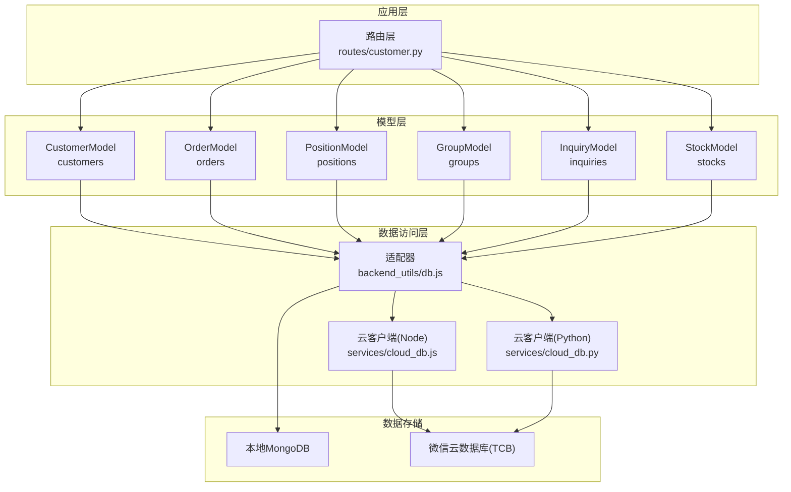
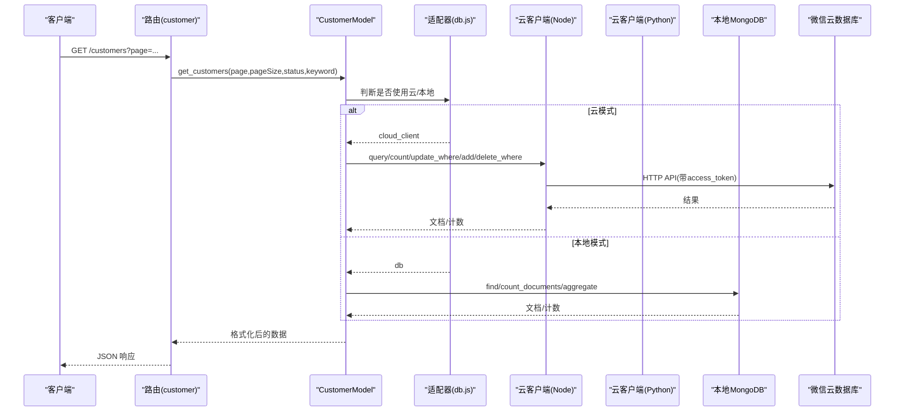
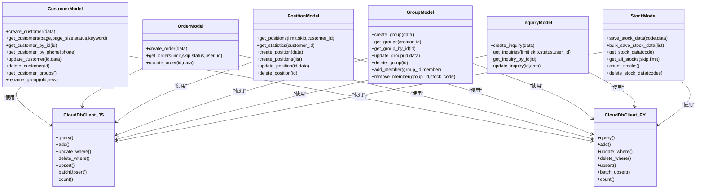

# 数据库架构

<cite>
**本文引用的文件**
- [backend_utils/db.js](file://backend_utils/db.js)
- [services/cloud_db.js](file://services/cloud_db.js)
- [services/cloud_db.py](file://services/cloud_db.py)
- [models/customer.py](file://models/customer.py)
- [models/order.py](file://models/order.py)
- [models/position.py](file://models/position.py)
- [models/group.py](file://models/group.py)
- [models/inquiry.py](file://models/inquiry.py)
- [models/stock.py](file://models/stock.py)
- [routes/customer.py](file://routes/customer.py)
</cite>

## 目录
1. [简介](#简介)
2. [项目结构](#项目结构)
3. [核心组件](#核心组件)
4. [架构总览](#架构总览)
5. [详细组件分析](#详细组件分析)
6. [依赖关系分析](#依赖关系分析)
7. [性能考量](#性能考量)
8. [故障排查指南](#故障排查指南)
9. [结论](#结论)
10. [附录](#附录)

## 简介
本文件面向“场外期权”项目的数据库架构设计，聚焦于以下目标：
- 明确集合设计、文档结构与字段命名规范
- 解释索引策略、查询优化与性能调优
- 文档化数据完整性约束、事务处理与一致性保障
- 规划数据库迁移策略、版本管理与向后兼容
- 提供备份恢复、灾难恢复与高可用方案
- 给出监控、性能分析与容量规划建议

本项目同时支持本地 MongoDB 与微信云开发数据库（Tencent Cloud Base，TCB）两种后端，通过统一的模型层实现跨后端的一致行为。

## 项目结构
围绕数据库的关键目录与文件如下：
- 后端工具与适配：backend_utils/db.js（本地/云适配、分页解析、本地 Mock 文件）
- 云数据库客户端（Node/Python）：services/cloud_db.js、services/cloud_db.py
- 模型层（集合与文档结构）：models/customer.py、models/order.py、models/position.py、models/group.py、models/inquiry.py、models/stock.py
- 路由层（业务入口）：routes/customer.py（示例）

图表来源
- [routes/customer.py](file://routes/customer.py#L1-L217)
- [backend_utils/db.js](file://backend_utils/db.js#L1-L64)
- [services/cloud_db.js](file://services/cloud_db.js#L1-L327)
- [services/cloud_db.py](file://services/cloud_db.py#L1-L533)
- [models/customer.py](file://models/customer.py#L1-L300)
- [models/order.py](file://models/order.py#L1-L119)
- [models/position.py](file://models/position.py#L1-L206)
- [models/group.py](file://models/group.py#L1-L283)
- [models/inquiry.py](file://models/inquiry.py#L1-L148)
- [models/stock.py](file://models/stock.py#L1-L386)

章节来源
- [routes/customer.py](file://routes/customer.py#L1-L217)
- [backend_utils/db.js](file://backend_utils/db.js#L1-L64)
- [services/cloud_db.js](file://services/cloud_db.js#L1-L327)
- [services/cloud_db.py](file://services/cloud_db.py#L1-L533)
- [models/customer.py](file://models/customer.py#L1-L300)
- [models/order.py](file://models/order.py#L1-L119)
- [models/position.py](file://models/position.py#L1-L206)
- [models/group.py](file://models/group.py#L1-L283)
- [models/inquiry.py](file://models/inquiry.py#L1-L148)
- [models/stock.py](file://models/stock.py#L1-L386)

## 核心组件
- 适配器与环境检测：backend_utils/db.js 负责检测是否启用云数据库、加载本地 Mock 文件路径、解析分页参数，并导出云客户端实例。
- 云数据库客户端（Node/Python）：services/cloud_db.js 与 services/cloud_db.py 提供统一的查询、新增、更新、删除、upsert、批量 upsert、计数等能力；内置并发控制、重试与速率限制退避。
- 模型层：各领域模型封装集合名、文档结构、索引初始化、CRUD 与聚合查询逻辑，自动区分本地 MongoDB 与云数据库行为。
- 路由层：routes/customer.py 展示如何注入 db 或 cloud_db，并通过 CustomerModel 提供 REST 接口。

章节来源
- [backend_utils/db.js](file://backend_utils/db.js#L1-L64)
- [services/cloud_db.js](file://services/cloud_db.js#L1-L327)
- [services/cloud_db.py](file://services/cloud_db.py#L1-L533)
- [models/customer.py](file://models/customer.py#L1-L300)
- [routes/customer.py](file://routes/customer.py#L1-L217)

## 架构总览
下图展示请求在路由、模型、适配器与存储之间的流转，以及本地与云两种后端的切换。

图表来源
- [routes/customer.py](file://routes/customer.py#L26-L69)
- [models/customer.py](file://models/customer.py#L119-L177)
- [backend_utils/db.js](file://backend_utils/db.js#L5-L11)
- [services/cloud_db.js](file://services/cloud_db.js#L144-L180)
- [services/cloud_db.py](file://services/cloud_db.py#L209-L270)

## 详细组件分析

### 集合与文档结构规范
- customers（客户）
  - 关键字段：name、phone（唯一性）、email、status、groupName、user_id、openid、totalOrders、createdAt、updatedAt
  - 约束与要点：创建时按 phone 唯一性检查；支持按 phone、openid 关联用户；支持按状态与关键词检索。
- orders（订单）
  - 关键字段：orderId（唯一性）、status、openid、createdAt、updatedAt
  - 约束与要点：orderId 自动生成；按 createdAt 倒序查询；支持按 status 与 openid 过滤。
- positions（持仓）
  - 关键字段：customerId、productCode、status、currency、market、marketValue、profitLoss、createdAt、updatedAt
  - 约束与要点：按 customerId、productCode 建立索引；支持统计聚合（云侧受限，采用小规模拉取求和）。
- groups（分组）
  - 关键字段：name、creator_id、members（数组，含 stock_code、market、name、added_at）、created_at、updated_at
  - 约束与要点：members 去重通过应用层逻辑实现；支持添加/移除成员。
- inquiries（询价）
  - 关键字段：status、phone、openid、createdAt、updatedAt
  - 约束与要点：按 createdAt、status、phone 建索引；支持按状态与用户标识过滤。
- stocks（行情）
  - 关键字段：stock_code（唯一性）、updated_at、created_at 及各类行情指标字段
  - 约束与要点：按 stock_code 唯一；支持 upsert 与批量 upsert；本地使用 JSON 文件缓存。

章节来源
- [models/customer.py](file://models/customer.py#L23-L64)
- [models/order.py](file://models/order.py#L28-L53)
- [models/position.py](file://models/position.py#L10-L23)
- [models/group.py](file://models/group.py#L23-L51)
- [models/inquiry.py](file://models/inquiry.py#L32-L54)
- [models/stock.py](file://models/stock.py#L135-L193)

### 索引策略
- 本地 MongoDB（模型层显式创建）
  - customers：phone（唯一）、groupName（用于分组去重）
  - orders：orderId（唯一）、createdAt
  - positions：customerId、productCode
  - inquiries：createdAt、status、phone
  - stocks：stock_code（唯一）、created_at、updated_at
- 云数据库（TCB）
  - 通过查询条件与聚合命令实现高效检索；对高频过滤字段建立索引可显著降低查询成本。

章节来源
- [models/customer.py](file://models/customer.py#L14-L18)
- [models/order.py](file://models/order.py#L17-L21)
- [models/position.py](file://models/position.py#L16-L21)
- [models/inquiry.py](file://models/inquiry.py#L24-L30)
- [models/stock.py](file://models/stock.py#L45-L50)

### 查询优化与性能调优
- 云客户端并发与重试
  - Node 客户端：最大并发、最大重试次数、速率限制退避；请求排队与释放机制。
  - Python 客户端：连接池大小与并发信号量；指数退避与资源限制处理。
- 本地 MongoDB
  - 使用 upsert 与批量写入减少往返；对热点字段建立索引；避免全表扫描。
- 云侧限制与规避
  - 聚合复杂度受限时，采用分批查询+内存聚合；对大列表分页与限制单次拉取数量。
- 分页与输入校验
  - 适配器对分页参数进行严格校验，防止异常输入导致资源浪费。

章节来源
- [services/cloud_db.js](file://services/cloud_db.js#L39-L51)
- [services/cloud_db.js](file://services/cloud_db.js#L57-L70)
- [services/cloud_db.js](file://services/cloud_db.js#L106-L139)
- [services/cloud_db.py](file://services/cloud_db.py#L141-L160)
- [services/cloud_db.py](file://services/cloud_db.py#L486-L532)
- [backend_utils/db.js](file://backend_utils/db.js#L38-L55)

### 数据完整性约束、事务与一致性
- 唯一性约束
  - customers.phone、orders.orderId、stocks.stock_code 在模型层或数据库层面强制唯一。
- 一致性保障
  - 云侧 upsert 与 fetch-update 语义保证幂等；本地 MongoDB 使用 upsert 与原子更新。
  - 时间戳字段 created_at/updated_at 在创建与更新时统一维护。
- 事务与多文档一致性
  - 云侧不支持跨文档事务；通过应用层幂等逻辑与最小化变更来维持一致性。
  - 本地 MongoDB 支持事务，可在需要时引入（如批量导入与对账场景）。

章节来源
- [models/customer.py](file://models/customer.py#L38-L46)
- [models/order.py](file://models/order.py#L33-L35)
- [models/stock.py](file://models/stock.py#L152-L157)
- [models/group.py](file://models/group.py#L200-L229)

### 迁移策略、版本管理与向后兼容
- 迁移策略
  - 集合结构变更：先在云控制台创建新集合，再通过批量 upsert 将旧数据迁移至新结构，最后切换读写路径。
  - 字段演进：新增字段默认值与向后兼容逻辑（如 status 默认值、货币/市场默认值）。
- 版本管理
  - 通过环境变量控制并发与批大小（如 WX_DB_MAX_INFLIGHT、WX_DB_CHUNK_SIZE、WX_DB_MAX_WORKERS），便于灰度与回滚。
- 向后兼容
  - 读取侧兼容旧字段与格式；写入侧统一规范化（如日期字符串、默认值填充）。

章节来源
- [services/cloud_db.js](file://services/cloud_db.js#L224-L231)
- [services/cloud_db.py](file://services/cloud_db.py#L331-L378)
- [models/position.py](file://models/position.py#L124-L135)
- [models/order.py](file://models/order.py#L29-L31)

### 备份恢复、灾难恢复与高可用
- 备份
  - 本地 MongoDB：定期导出集合或使用副本集快照；对关键集合（orders、positions、inquiries）增加备份频率。
  - 云数据库：利用 TCB 的备份与恢复能力；导出重要集合为 JSON/CSV 作为补充。
- 恢复
  - 优先使用官方备份恢复；若需自管，通过批量 upsert 将历史数据回灌。
- 高可用
  - 云侧：开启多地域部署与读写分离；设置健康检查与自动故障转移。
  - 本地：部署副本集/分片集群，配置仲裁节点与自动故障转移。

（本节为通用实践建议，不直接分析具体文件）

### 监控、性能分析与容量规划
- 监控指标
  - 云侧：QPS、错误率、延迟、access_token 刷新频率；本地：连接数、慢查询、锁等待。
- 性能分析
  - 使用云侧日志与本地慢查询日志定位瓶颈；结合索引使用情况与查询计划。
- 容量规划
  - 评估写入峰值与查询 QPS，按并发与批大小参数动态调整；预留 30%~50% 缓冲。

（本节为通用实践建议，不直接分析具体文件）

## 依赖关系分析

图表来源
- [models/customer.py](file://models/customer.py#L10-L300)
- [models/order.py](file://models/order.py#L10-L119)
- [models/position.py](file://models/position.py#L10-L206)
- [models/group.py](file://models/group.py#L10-L283)
- [models/inquiry.py](file://models/inquiry.py#L10-L148)
- [models/stock.py](file://models/stock.py#L23-L386)
- [services/cloud_db.js](file://services/cloud_db.js#L7-L327)
- [services/cloud_db.py](file://services/cloud_db.py#L108-L533)

## 性能考量
- 并发与限流
  - 云客户端内置并发上限与重试退避，避免触发平台 QPS 限制。
- 批处理与分页
  - 批量 upsert 与分页查询减少网络往返；对大集合采用分块与并行处理。
- 索引与查询
  - 为高频过滤字段建立索引；避免在云侧使用复杂聚合；必要时在本地使用聚合管道。
- 本地缓存
  - 股票数据模型提供文件缓存与原子写入，降低频繁读写开销。

章节来源
- [services/cloud_db.js](file://services/cloud_db.js#L224-L231)
- [services/cloud_db.js](file://services/cloud_db.js#L259-L268)
- [services/cloud_db.py](file://services/cloud_db.py#L331-L378)
- [models/stock.py](file://models/stock.py#L55-L112)

## 故障排查指南
- 云数据库配置未就绪
  - 现象：初始化失败或抛出配置错误
  - 处理：检查 WX_CLOUD_ENV、WX_APPID、WX_SECRET 是否正确设置且非占位符
- 集合不存在
  - 现象：查询/计数返回空或抛出“集合不存在”
  - 处理：在云开发控制台创建对应集合；确认集合名与模型一致
- 请求超时/限流
  - 现象：QPS 过高导致重试与延迟
  - 处理：降低并发、增大批大小、启用指数退避；优化查询条件
- 本地 Mock 文件异常
  - 现象：读取 mock_db.json 失败
  - 处理：检查文件路径与权限；确保 JSON 格式正确

章节来源
- [backend_utils/db.js](file://backend_utils/db.js#L6-L11)
- [services/cloud_db.js](file://services/cloud_db.js#L32-L36)
- [services/cloud_db.py](file://services/cloud_db.py#L197-L204)
- [models/customer.py](file://models/customer.py#L52-L54)

## 结论
本项目通过统一的模型层与云客户端，实现了本地 MongoDB 与微信云数据库的无缝切换。集合设计遵循业务域划分，字段命名清晰，索引覆盖常用过滤条件。云侧通过并发控制与重试机制保障稳定性，本地侧通过索引与批处理提升性能。建议在生产环境中进一步完善监控与告警、灾备演练与容量规划，持续迭代索引与查询策略以适应业务增长。

## 附录
- 环境变量参考
  - WX_CLOUD_ENV/WX_ENV_ID：云环境 ID
  - WX_APPID/WX_SECRET：应用凭据
  - WX_DB_MAX_INFLIGHT/WX_DB_MAX_RETRIES：云侧并发与重试
  - WX_DB_CHUNK_SIZE/WX_DB_MAX_WORKERS：批量与并发参数
  - FILE_DB_PATH：本地 Mock 文件路径

章节来源
- [services/cloud_db.js](file://services/cloud_db.js#L27-L51)
- [services/cloud_db.py](file://services/cloud_db.py#L162-L176)
- [backend_utils/db.js](file://backend_utils/db.js#L13-L15)