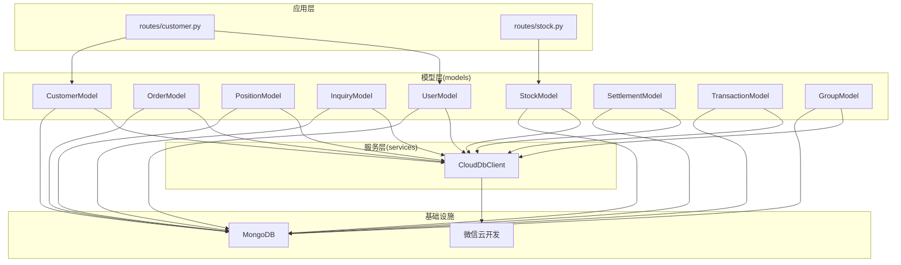
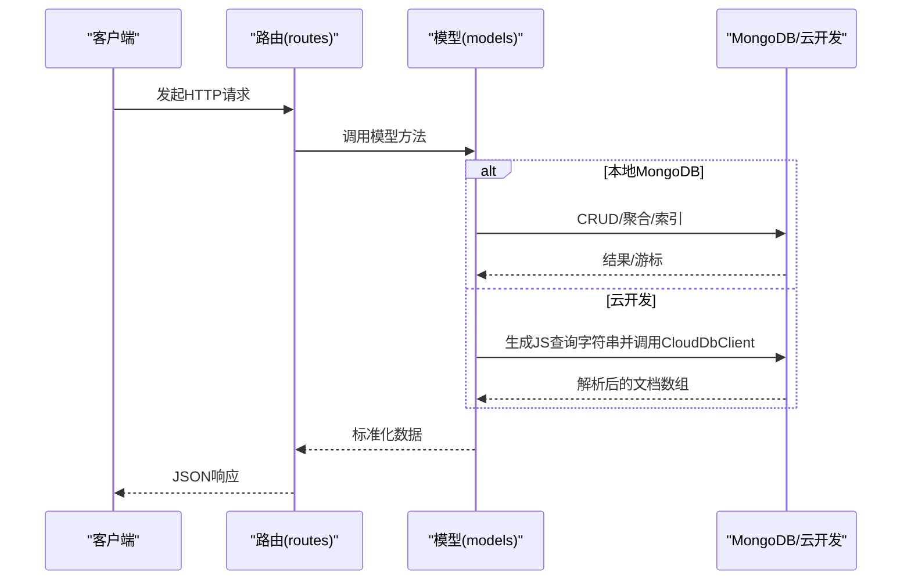
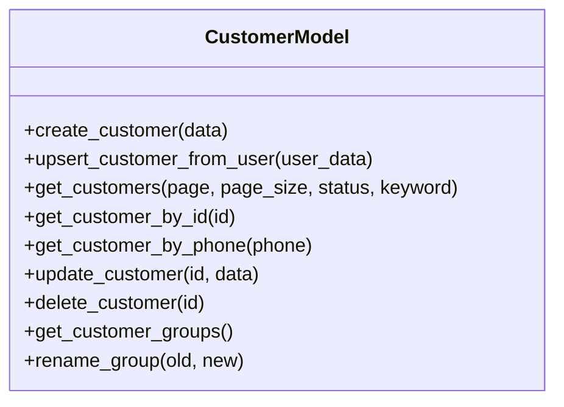
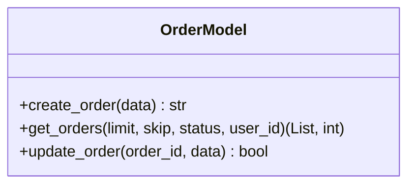
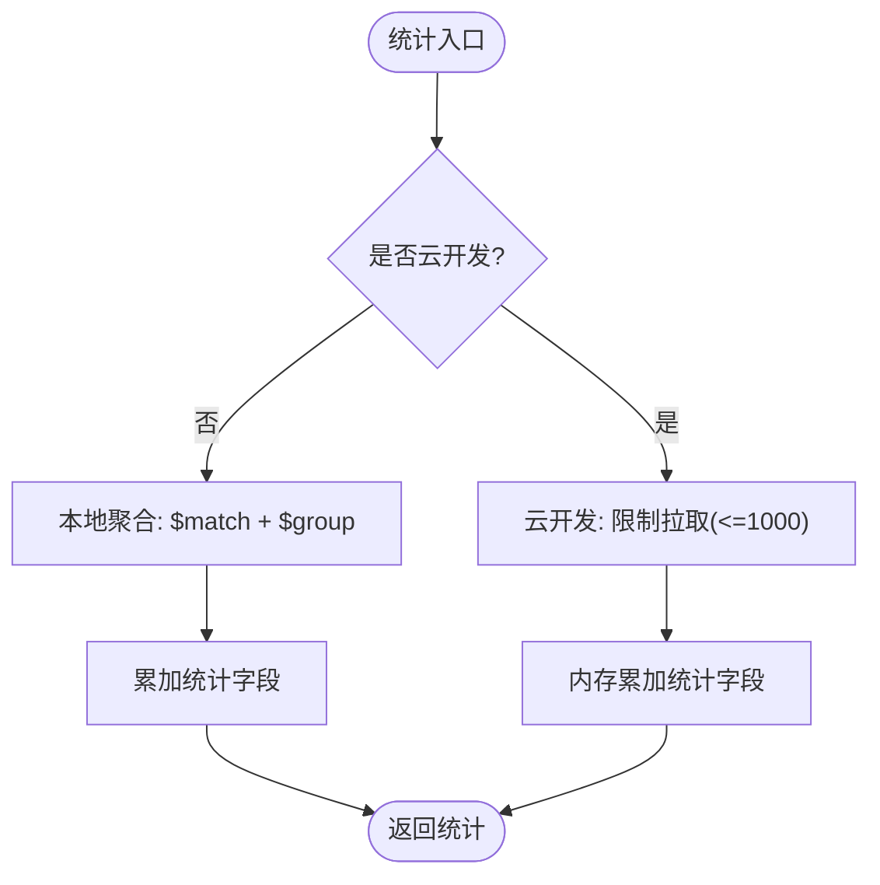
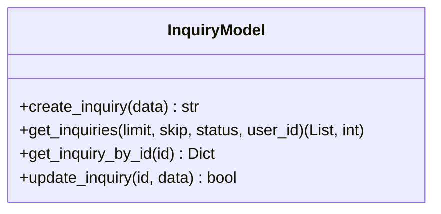
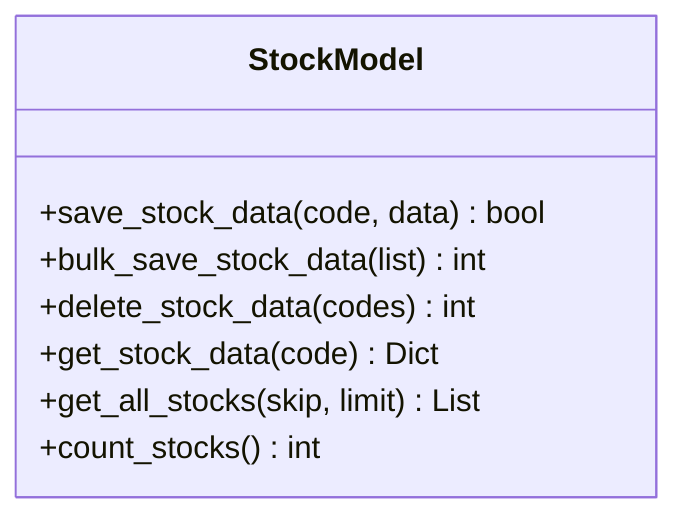
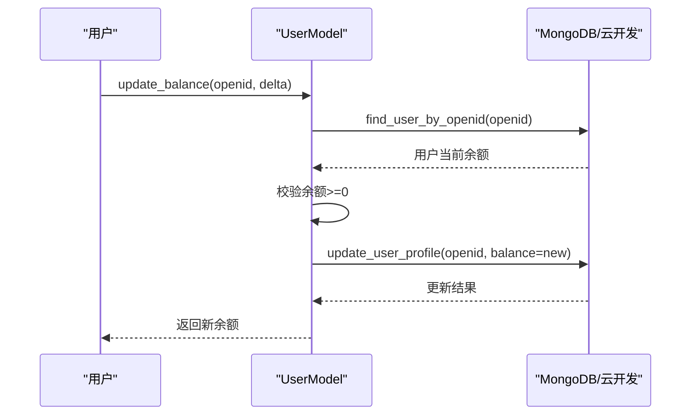
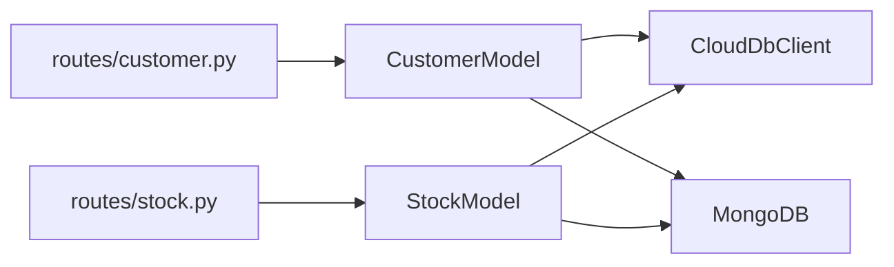

# 数据模型

<cite>
**本文引用的文件**
- [models/customer.py](file://models/customer.py)
- [models/order.py](file://models/order.py)
- [models/position.py](file://models/position.py)
- [models/inquiry.py](file://models/inquiry.py)
- [models/stock.py](file://models/stock.py)
- [models/user.py](file://models/user.py)
- [models/settlement.py](file://models/settlement.py)
- [models/transaction.py](file://models/transaction.py)
- [models/group.py](file://models/group.py)
- [services/cloud_db.py](file://services/cloud_db.py)
- [routes/customer.py](file://routes/customer.py)
- [routes/stock.py](file://routes/stock.py)
- [app.py](file://app.py)
</cite>

## 目录
1. [简介](#简介)
2. [项目结构](#项目结构)
3. [核心组件](#核心组件)
4. [架构总览](#架构总览)
5. [详细组件分析](#详细组件分析)
6. [依赖分析](#依赖分析)
7. [性能考量](#性能考量)
8. [故障排查指南](#故障排查指南)
9. [结论](#结论)
10. [附录](#附录)

## 简介
本文件面向“场外期权”项目，系统化梳理数据模型设计，覆盖文档结构、字段定义、数据类型规范、实体关系、索引策略、数据验证与完整性、模型继承与扩展点、迁移与版本管理、性能优化、查询与聚合、以及测试与数据质量保障。文档同时结合实际代码实现，给出可视化图示与落地建议，帮助开发者与运维人员高效理解与维护数据层。

## 项目结构
数据模型主要位于 models 目录，围绕客户、订单、持仓、询价、股票、用户、结算、交易流水、分组等核心实体构建；服务层通过 services/cloud_db.py 提供云数据库适配；路由层 routes/* 将模型与API对接；应用入口 app.py 提供数据库连接初始化。

图表来源
- [routes/customer.py](file://routes/customer.py#L15-L24)
- [routes/stock.py](file://routes/stock.py#L18-L18)
- [models/customer.py](file://models/customer.py#L10-L18)
- [models/order.py](file://models/order.py#L10-L23)
- [models/position.py](file://models/position.py#L10-L23)
- [models/inquiry.py](file://models/inquiry.py#L10-L19)
- [models/stock.py](file://models/stock.py#L23-L51)
- [models/user.py](file://models/user.py#L10-L22)
- [models/settlement.py](file://models/settlement.py#L5-L13)
- [models/transaction.py](file://models/transaction.py#L6-L14)
- [models/group.py](file://models/group.py#L10-L18)
- [services/cloud_db.py](file://services/cloud_db.py#L108-L139)

章节来源
- [routes/customer.py](file://routes/customer.py#L15-L24)
- [routes/stock.py](file://routes/stock.py#L18-L18)
- [models/customer.py](file://models/customer.py#L10-L18)
- [models/order.py](file://models/order.py#L10-L23)
- [models/position.py](file://models/position.py#L10-L23)
- [models/inquiry.py](file://models/inquiry.py#L10-L19)
- [models/stock.py](file://models/stock.py#L23-L51)
- [models/user.py](file://models/user.py#L10-L22)
- [models/settlement.py](file://models/settlement.py#L5-L13)
- [models/transaction.py](file://models/transaction.py#L6-L14)
- [models/group.py](file://models/group.py#L10-L18)
- [services/cloud_db.py](file://services/cloud_db.py#L108-L139)

## 核心组件
- 客户(CustomerModel)：统一客户资料、分组、去重校验、跨平台关联（用户ID/微信OpenID）。
- 订单(OrderModel)：订单创建、查询、状态过滤、时间索引。
- 持仓(PositionModel)：多仓批量入库、统计聚合（本地聚合）、索引优化。
- 询价(InquiryModel)：询价创建、查询、状态/手机号索引。
- 股票(StockModel)：实时/历史行情入库、批量写入、本地JSON缓存、索引。
- 用户(UserModel)：会话管理、管理员/普通用户、微信用户、余额原子更新。
- 结算(SettlementModel)：到期/行权结算记录。
- 交易(TransactionModel)：资金流水（出入金、买卖、手续费）。
- 分组(GroupModel)：自定义分组、成员（股票）管理、去重添加。

章节来源
- [models/customer.py](file://models/customer.py#L10-L300)
- [models/order.py](file://models/order.py#L10-L119)
- [models/position.py](file://models/position.py#L10-L206)
- [models/inquiry.py](file://models/inquiry.py#L10-L148)
- [models/stock.py](file://models/stock.py#L23-L386)
- [models/user.py](file://models/user.py#L10-L309)
- [models/settlement.py](file://models/settlement.py#L5-L57)
- [models/transaction.py](file://models/transaction.py#L6-L61)
- [models/group.py](file://models/group.py#L10-L283)

## 架构总览
数据访问层通过统一的云数据库适配器 CloudDbClient 支持本地MongoDB与微信云开发两种后端，模型层在构造时根据 db/cloud_client 判断运行模式，自动切换查询/更新逻辑与索引策略。

图表来源
- [routes/customer.py](file://routes/customer.py#L26-L69)
- [routes/stock.py](file://routes/stock.py#L21-L84)
- [services/cloud_db.py](file://services/cloud_db.py#L209-L248)
- [models/customer.py](file://models/customer.py#L119-L177)
- [models/order.py](file://models/order.py#L54-L97)
- [models/position.py](file://models/position.py#L28-L63)

## 详细组件分析

### 客户模型(CustomerModel)
- 文档结构与字段
  - 关键字段：name、phone（唯一性约束）、email、status、groupName、user_id、openid、totalOrders、createdAt、updatedAt。
  - 唯一性：电话号码在本地MongoDB与云开发中均进行存在性检查，避免重复。
- 索引策略
  - 本地MongoDB：集合初始化时创建索引（如需）。
  - 云开发：通过查询语法实现过滤与排序，不直接创建索引。
- 查询与分页
  - 支持按状态、关键词（名称/电话）过滤，支持分页与总数统计。
- 业务规则
  - 创建客户前强制检查电话唯一；更新仅允许白名单字段；分组重命名批量更新。
- 云/本地一致性
  - 统一时间格式（ISO字符串）与ID字符串化，确保序列化一致。

图表来源
- [models/customer.py](file://models/customer.py#L10-L300)

章节来源
- [models/customer.py](file://models/customer.py#L23-L64)
- [models/customer.py](file://models/customer.py#L119-L177)
- [models/customer.py](file://models/customer.py#L260-L281)

### 订单模型(OrderModel)
- 文档结构与字段
  - 关键字段：orderId（唯一索引）、createdAt、updatedAt、status、openid（用户标识）。
- 索引策略
  - 本地MongoDB：orderId（唯一）、createdAt。
- 查询与分页
  - 支持按状态与用户ID过滤，倒序分页。
- 业务规则
  - 未传入orderId时自动生成；创建失败记录日志并返回空串。

图表来源
- [models/order.py](file://models/order.py#L10-L119)

章节来源
- [models/order.py](file://models/order.py#L18-L21)
- [models/order.py](file://models/order.py#L28-L52)
- [models/order.py](file://models/order.py#L54-L97)

### 持仓模型(PositionModel)
- 文档结构与字段
  - 关键字段：customerId、productCode、status、currency、market、createdAt、updatedAt、以及数值型统计字段（如市场价值、盈亏）。
- 索引策略
  - 本地MongoDB：customerId、productCode。
- 聚合与统计
  - 本地：使用聚合管道计算总市值、总盈亏与数量；云开发：受限于客户端能力，采用拉取小规模数据并内存求和。
- 批量写入
  - 支持批量插入，统一设置默认字段与时间戳。

图表来源
- [models/position.py](file://models/position.py#L65-L118)

章节来源
- [models/position.py](file://models/position.py#L17-L21)
- [models/position.py](file://models/position.py#L65-L118)
- [models/position.py](file://models/position.py#L120-L150)

### 询价模型(InquiryModel)
- 文档结构与字段
  - 关键字段：createdAt、updatedAt、status（默认pending）、phone、openid、以及业务相关字段。
- 索引策略
  - 本地MongoDB：createdAt、status、phone。
- 查询与分页
  - 支持按状态与用户ID过滤，倒序分页。

图表来源
- [models/inquiry.py](file://models/inquiry.py#L10-L148)

章节来源
- [models/inquiry.py](file://models/inquiry.py#L24-L30)
- [models/inquiry.py](file://models/inquiry.py#L55-L101)

### 股票模型(StockModel)
- 文档结构与字段
  - 关键字段：stock_code（唯一索引）、created_at、updated_at、以及行情字段（开盘/最高/最低/收盘/成交量/成交额/涨跌幅等）。
- 索引策略
  - 本地MongoDB：stock_code（唯一）、created_at、updated_at。
- 本地缓存
  - 支持本地JSON文件作为Mock DB，带原子写入与缓存失效机制，提升离线/测试可用性。
- 批量写入
  - 使用MongoDB的批量写入与Upsert，提升吞吐。

图表来源
- [models/stock.py](file://models/stock.py#L23-L386)

章节来源
- [models/stock.py](file://models/stock.py#L45-L50)
- [models/stock.py](file://models/stock.py#L135-L192)
- [models/stock.py](file://models/stock.py#L194-L264)
- [models/stock.py](file://models/stock.py#L312-L386)

### 用户模型(UserModel)
- 文档结构与字段
  - 管理员用户：username、created_at、updated_at、密码哈希等。
  - 普通用户：openid、phone、email、昵称、头像、余额、最后登录时间等。
  - 会话：user_id、device_info、ip、refresh_token_hash、expires_at、is_active。
- 业务规则
  - 余额更新采用“读取-计算-更新”，云开发环境下需注意原子性；余额不足抛出异常。
  - 会话管理：创建、查找、吊销、列出活动会话。
- 云/本地一致性
  - 时间字段在云开发下统一为ISO字符串，本地为datetime对象。

图表来源
- [models/user.py](file://models/user.py#L291-L309)

章节来源
- [models/user.py](file://models/user.py#L27-L44)
- [models/user.py](file://models/user.py#L291-L309)

### 结算模型(SettlementModel)
- 文档结构与字段
  - date、position_id、user_id、type（expiry/exercise）、strike_price、settlement_price、pnl、status、created_at。
- 查询
  - 支持按用户ID过滤与倒序分页。

章节来源
- [models/settlement.py](file://models/settlement.py#L18-L56)

### 交易模型(TransactionModel)
- 文档结构与字段
  - user_id、type（deposit/withdraw/buy/sell/fee）、amount、balance_after、remark、created_at。
- 查询
  - 支持按用户ID过滤、计数与分页。

章节来源
- [models/transaction.py](file://models/transaction.py#L19-L60)

### 分组模型(GroupModel)
- 文档结构与字段
  - name、creator_id、members（stock_code、market、name、added_at）、created_at、updated_at。
- 业务规则
  - 成员去重添加；支持增删成员；分组列表按创建时间倒序。

章节来源
- [models/group.py](file://models/group.py#L23-L50)
- [models/group.py](file://models/group.py#L192-L253)
- [models/group.py](file://models/group.py#L255-L282)

## 依赖分析
- 模型与服务
  - 所有模型在初始化时注入 db/cloud_client，若 cloud_client 存在则走云开发路径；否则走本地MongoDB。
  - 云开发通过 CloudDbClient 提供 query/count/add/update_where/delete_where/upsert/batch_upsert 等能力。
- 路由与模型
  - 路由层通过 get_model() 获取模型实例，统一处理认证与权限，再调用模型方法并封装响应。
- 数据库连接
  - 应用启动时通过 init_db() 建立MongoDB连接，失败时以“无数据库模式”运行，部分功能降级。

图表来源
- [routes/customer.py](file://routes/customer.py#L15-L24)
- [routes/stock.py](file://routes/stock.py#L68-L69)
- [services/cloud_db.py](file://services/cloud_db.py#L108-L139)
- [app.py](file://app.py#L69-L88)

章节来源
- [routes/customer.py](file://routes/customer.py#L15-L24)
- [routes/stock.py](file://routes/stock.py#L68-L69)
- [services/cloud_db.py](file://services/cloud_db.py#L108-L139)
- [app.py](file://app.py#L69-L88)

## 性能考量
- 索引策略
  - 订单：orderId（唯一）、createdAt；询价：createdAt/status/phone；持仓：customerId/productCode；股票：stock_code（唯一）。
- 查询优化
  - 云开发查询通过 where/orderBy/skip/limit 组合实现分页与过滤；本地MongoDB使用索引字段进行过滤与排序。
- 聚合与统计
  - 持仓统计在本地使用聚合管道；云开发受限时采用小规模拉取并在内存汇总。
- 批量写入
  - 股票与持仓支持批量写入与Upsert，减少往返次数。
- 会话与缓存
  - 股票模型内置本地JSON缓存与原子写入，降低频繁I/O影响。

章节来源
- [models/order.py](file://models/order.py#L18-L21)
- [models/inquiry.py](file://models/inquiry.py#L24-L30)
- [models/position.py](file://models/position.py#L17-L21)
- [models/stock.py](file://models/stock.py#L45-L50)
- [models/position.py](file://models/position.py#L65-L118)
- [models/stock.py](file://models/stock.py#L210-L226)

## 故障排查指南
- 云数据库集合不存在
  - CloudDbClient 在查询/统计时对“集合不存在”进行特殊处理并返回空结果或0计数；模型层捕获并抛出明确错误提示。
- 数据库连接失败
  - 应用启动时连接MongoDB失败将记录告警并以无数据库模式运行；路由层检测到db/cloud_client均不可用时返回503。
- 字段缺失或类型不符
  - 客户创建/更新严格校验字段；用户余额更新前校验余额不得为负。
- 云开发请求限流/繁忙
  - CloudDbClient 内置信号量与重试策略，遇到速率限制/过于频繁会指数退避重试。

章节来源
- [services/cloud_db.py](file://services/cloud_db.py#L241-L247)
- [services/cloud_db.py](file://services/cloud_db.py#L514-L520)
- [services/cloud_db.py](file://services/cloud_db.py#L491-L532)
- [app.py](file://app.py#L74-L88)
- [models/customer.py](file://models/customer.py#L38-L54)
- [models/user.py](file://models/user.py#L297-L305)

## 结论
本项目数据模型以MongoDB为核心，辅以微信云开发适配器，形成“云/本地双栈”能力。模型层围绕客户、订单、持仓、询价、股票、用户、结算、交易流水、分组等实体构建，具备完善的索引策略、查询与聚合能力，并在云开发受限场景下提供降级方案。通过严格的字段校验、时间与ID规范化、批量写入与原子更新，保障了数据完整性与一致性。建议后续在云开发侧补充必要的索引与聚合能力，持续完善数据字典与迁移策略。

## 附录

### 数据模型与字段规范
- 客户(Customer)
  - 关键字段：name、phone（唯一）、email、status、groupName、user_id、openid、totalOrders、createdAt、updatedAt。
- 订单(Order)
  - 关键字段：orderId（唯一）、createdAt、updatedAt、status、openid。
- 持仓(Position)
  - 关键字段：customerId、productCode、status、currency、market、createdAt、updatedAt、数值统计字段。
- 询价(Inquiry)
  - 关键字段：createdAt、updatedAt、status、phone、openid。
- 股票(Stock)
  - 关键字段：stock_code（唯一）、created_at、updated_at、行情字段。
- 用户(User)
  - 管理员：username、created_at、updated_at、密码哈希。
  - 普通用户：openid、phone、email、昵称、头像、余额、最后登录时间。
  - 会话：user_id、device_info、ip、refresh_token_hash、expires_at、is_active。
- 结算(Settlement)
  - 关键字段：date、position_id、user_id、type、strike_price、settlement_price、pnl、status、created_at。
- 交易(Transaction)
  - 关键字段：user_id、type、amount、balance_after、remark、created_at。
- 分组(Group)
  - 关键字段：name、creator_id、members（stock_code、market、name、added_at）、created_at、updated_at。

章节来源
- [models/customer.py](file://models/customer.py#L25-L36)
- [models/order.py](file://models/order.py#L29-L35)
- [models/position.py](file://models/position.py#L152-L161)
- [models/inquiry.py](file://models/inquiry.py#L33-L36)
- [models/stock.py](file://models/stock.py#L148-L150)
- [models/user.py](file://models/user.py#L27-L44)
- [models/settlement.py](file://models/settlement.py#L20-L29)
- [models/transaction.py](file://models/transaction.py#L21-L27)
- [models/group.py](file://models/group.py#L30-L36)

### 实体关系与约束
- 主键/唯一性
  - orderId（订单）、stock_code（股票）、phone（客户唯一）。
- 外键/引用
  - customer.user_id → 用户集合；order.openid → 用户集合；position.customerId → 客户集合；settlement.user_id → 用户集合；transaction.user_id → 用户集合；group.creator_id → 用户集合。
- 索引
  - 订单：orderId（唯一）、createdAt；询价：createdAt/status/phone；持仓：customerId/productCode；股票：stock_code（唯一）。

章节来源
- [models/order.py](file://models/order.py#L18-L21)
- [models/stock.py](file://models/stock.py#L46-L48)
- [models/inquiry.py](file://models/inquiry.py#L26-L28)
- [models/position.py](file://models/position.py#L18-L19)
- [models/customer.py](file://models/customer.py#L38-L61)

### 索引策略与查询优化
- 建议
  - 在云开发侧补充常用过滤字段索引（如订单status/openid、询价status/phone、持仓customerId等）。
  - 对高频统计字段建立复合索引，减少聚合扫描。
  - 对股票行情按日期范围查询建立索引，提升历史数据检索效率。

章节来源
- [models/order.py](file://models/order.py#L18-L21)
- [models/inquiry.py](file://models/inquiry.py#L26-L28)
- [models/position.py](file://models/position.py#L18-L19)
- [models/stock.py](file://models/stock.py#L46-L48)

### 数据验证与完整性
- 字段校验
  - 客户创建要求name、phone；用户余额更新要求余额非负。
- 时间与ID
  - 云开发统一ISO字符串；本地MongoDB使用datetime对象；ID统一字符串化。
- 去重与幂等
  - 客户电话唯一检查；分组成员去重添加；批量Upsert保证幂等。

章节来源
- [models/customer.py](file://models/customer.py#L114-L123)
- [models/customer.py](file://models/customer.py#L38-L61)
- [models/group.py](file://models/group.py#L207-L209)
- [models/user.py](file://models/user.py#L297-L305)

### 模型继承与扩展点
- 当前模型均为独立类，未见显式继承关系。
- 扩展建议
  - 可抽象出 BaseMongoModel，统一ID处理、时间格式化、云/本地分支逻辑。
  - 引入Schema校验（如基于Pydantic）增强字段约束与文档校验。

章节来源
- [models/customer.py](file://models/customer.py#L10-L18)
- [models/order.py](file://models/order.py#L10-L17)
- [models/position.py](file://models/position.py#L10-L17)
- [models/inquiry.py](file://models/inquiry.py#L10-L16)
- [models/stock.py](file://models/stock.py#L23-L44)
- [models/user.py](file://models/user.py#L10-L18)
- [models/settlement.py](file://models/settlement.py#L5-L9)
- [models/transaction.py](file://models/transaction.py#L6-L10)
- [models/group.py](file://models/group.py#L10-L14)

### 数据模型迁移与版本管理
- 建议
  - 为各集合引入version字段，配合迁移脚本逐版本升级。
  - 对新增字段提供默认值与回填策略；对删除字段保留映射以兼容旧客户端。
  - 云开发侧通过集合结构变更与索引重建，本地MongoDB通过迁移脚本与备份恢复。

章节来源
- [models/order.py](file://models/order.py#L32-L35)
- [models/stock.py](file://models/stock.py#L153-L157)

### 性能优化与查询优化
- 批量写入
  - 股票与持仓使用批量写入与Upsert，减少往返。
- 聚合与统计
  - 本地聚合优先；云开发受限时小规模拉取并内存汇总。
- 会话与缓存
  - 股票模型本地JSON缓存与原子写入，降低I/O压力。

章节来源
- [models/stock.py](file://models/stock.py#L210-L226)
- [models/position.py](file://models/position.py#L103-L117)
- [models/stock.py](file://models/stock.py#L87-L111)

### 数据质量与测试
- 建议
  - 为各模型编写单元测试，覆盖字段校验、唯一性、索引命中、聚合准确性。
  - 引入数据字典与字段变更审计，确保跨团队协作一致性。
  - 对云开发路径增加断言与日志埋点，便于定位性能瓶颈。

章节来源
- [models/customer.py](file://models/customer.py#L114-L123)
- [models/position.py](file://models/position.py#L65-L118)
- [models/stock.py](file://models/stock.py#L87-L111)