# 用户模型

<cite>
**本文档引用的文件**
- [models/user.py](file://models/user.py)
- [services/auth_service.py](file://services/auth_service.py)
- [routes/auth.py](file://routes/auth.py)
- [models/customer.py](file://models/customer.py)
- [routes/customer.py](file://routes/customer.py)
- [backend_utils/security.py](file://backend_utils/security.py)
- [services/captcha_service.py](file://services/captcha_service.py)
- [backend_utils/response.py](file://backend_utils/response.py)
- [backend_utils/loginService.js](file://backend_utils/loginService.js)
- [cloudfunctions/login/index.js](file://cloudfunctions/login/index.js)
- [backend_utils/performance-optimizer.js](file://backend_utils/performance-optimizer.js)
</cite>

## 更新摘要
**变更内容**
- 增强了用户档案管理功能，新增高级用户信息维护能力
- 完善了权限管理体系，支持更精细的角色控制
- 新增余额原子性更新功能，确保资金安全
- 优化了用户资料同步机制，提升数据一致性

## 目录
1. [简介](#简介)
2. [项目结构](#项目结构)
3. [核心组件](#核心组件)
4. [架构概览](#架构概览)
5. [详细组件分析](#详细组件分析)
6. [依赖关系分析](#依赖关系分析)
7. [性能考虑](#性能考虑)
8. [故障排除指南](#故障排除指南)
9. [结论](#结论)

## 简介

本文件详细阐述了场外期权项目的用户数据模型设计，涵盖用户账户结构、认证信息、权限体系、用户与客户的关系映射、身份统一化以及安全验证机制。系统支持多种登录方式（手机号、邮箱、微信），提供完整的会话管理、令牌轮换和审计日志功能，并通过统一的身份映射确保用户与客户数据的一致性。

**更新** 新增高级用户档案管理功能，包括用户信息维护、权限管理和余额原子性更新等核心能力。

## 项目结构

该项目采用分层架构，主要围绕用户模型、认证服务、路由控制器和数据模型展开：

- **模型层**：用户模型（UserModel）、客户模型（CustomerModel）
- **服务层**：认证服务（AuthService）、验证码服务（CaptchaService）
- **路由层**：认证路由（auth.py）、客户管理路由（customer.py）
- **工具层**：安全装饰器（security.py）、响应格式化（response.py）、前端登录服务（loginService.js）、云函数登录（cloudfunctions/login/index.js）
- **性能层**：性能优化器（performance-optimizer.js）

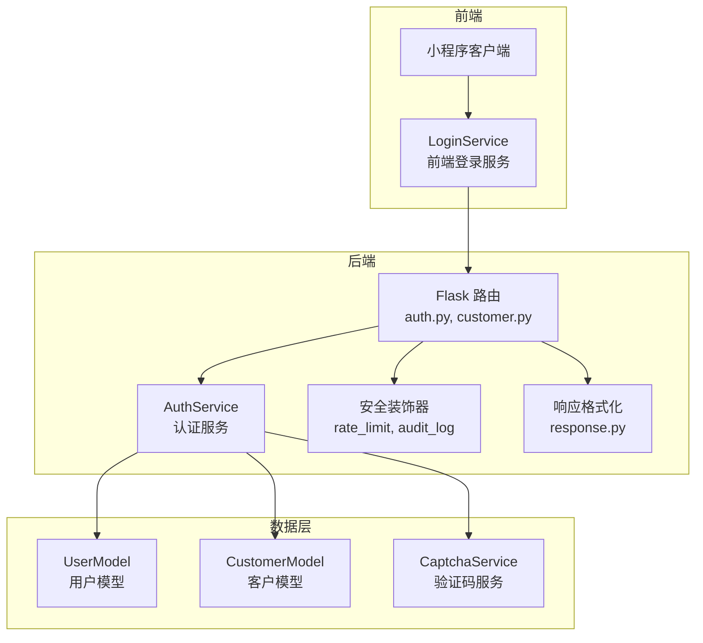

**图表来源**
- [routes/auth.py](file://routes/auth.py#L1-L437)
- [services/auth_service.py](file://services/auth_service.py#L1-L510)
- [models/user.py](file://models/user.py#L1-L309)
- [models/customer.py](file://models/customer.py#L1-L300)
- [backend_utils/security.py](file://backend_utils/security.py#L1-L117)
- [backend_utils/response.py](file://backend_utils/response.py#L1-L118)
- [backend_utils/loginService.js](file://backend_utils/loginService.js#L1-L325)
- [cloudfunctions/login/index.js](file://cloudfunctions/login/index.js#L1-L92)

**章节来源**
- [routes/auth.py](file://routes/auth.py#L1-L437)
- [services/auth_service.py](file://services/auth_service.py#L1-L510)
- [models/user.py](file://models/user.py#L1-L309)
- [models/customer.py](file://models/customer.py#L1-L300)
- [backend_utils/security.py](file://backend_utils/security.py#L1-L117)
- [backend_utils/response.py](file://backend_utils/response.py#L1-L118)
- [backend_utils/loginService.js](file://backend_utils/loginService.js#L1-L325)
- [cloudfunctions/login/index.js](file://cloudfunctions/login/index.js#L1-L92)

## 核心组件

### 用户模型（UserModel）

UserModel负责用户数据的持久化操作，支持以下核心功能：
- 会话管理：创建、查找、撤销、列出活动会话
- 管理员用户：查询、新增/更新、删除、列出管理员用户
- 普通用户：按微信OpenID、手机号、邮箱查询用户
- 用户资料：创建用户、更新登录时间、更新用户资料、余额原子性更新

**更新** 新增高级用户档案管理功能，包括用户信息维护和权限管理的完整实现。

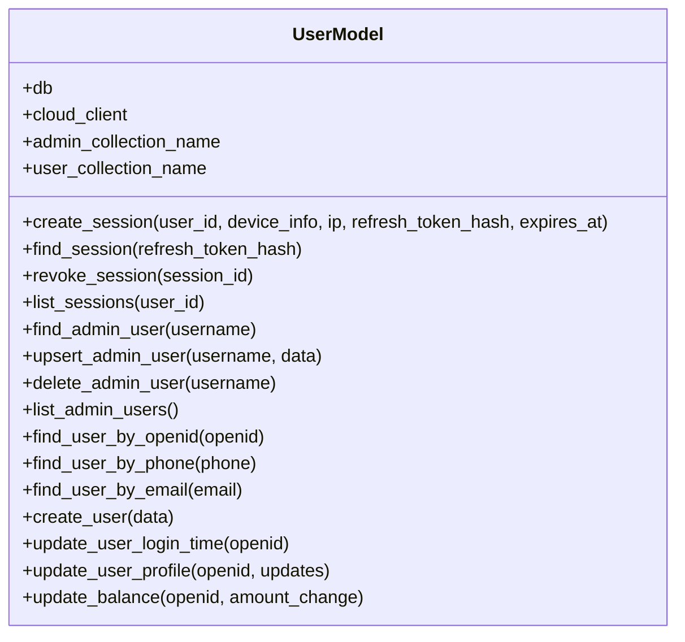

**图表来源**
- [models/user.py](file://models/user.py#L10-L309)

**章节来源**
- [models/user.py](file://models/user.py#L1-L309)

### 认证服务（AuthService）

AuthService提供完整的认证与授权能力：
- JWT令牌签发与刷新：支持Access Token（15分钟）和Refresh Token（7天）
- 密码哈希：PBKDF2-HMAC-SHA256，支持迭代次数配置
- 多种登录方式：管理员登录、邮箱登录、手机号登录、微信登录
- 权限管理：角色规范化、角色排序、权限校验
- 身份同步：将用户数据同步到客户集合，确保统一身份

**更新** 增强了用户档案管理功能，支持用户资料更新和余额原子性操作。

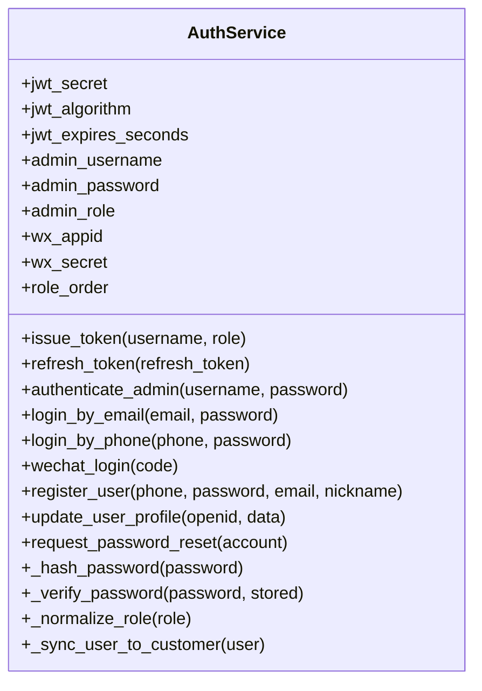

**图表来源**
- [services/auth_service.py](file://services/auth_service.py#L14-L510)

**章节来源**
- [services/auth_service.py](file://services/auth_service.py#L1-L510)

### 客户模型（CustomerModel）

CustomerModel负责客户数据管理，支持：
- 客户创建与更新：基于手机号唯一性约束
- 统一身份映射：从用户数据同步到客户集合
- 客户查询：分页查询、按ID/手机号查询、分组管理
- 客户分组：获取分组列表、重命名分组

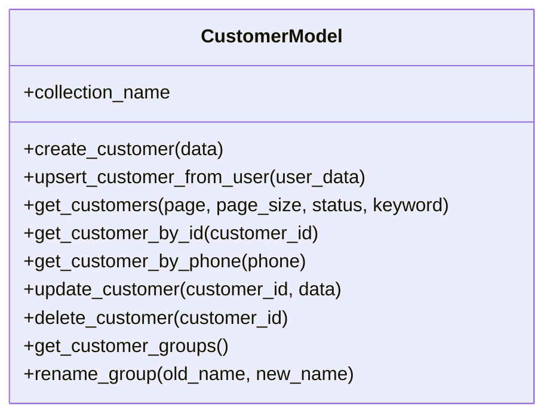

**图表来源**
- [models/customer.py](file://models/customer.py#L10-L300)

**章节来源**
- [models/customer.py](file://models/customer.py#L1-L300)

### 路由与安全

- 认证路由：提供登录、令牌刷新、用户管理、验证码等接口
- 安全装饰器：速率限制、账户锁定、审计日志
- 响应格式化：统一的API响应结构

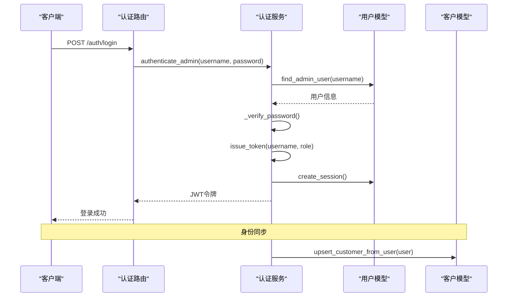

**图表来源**
- [routes/auth.py](file://routes/auth.py#L74-L96)
- [services/auth_service.py](file://services/auth_service.py#L86-L131)
- [models/user.py](file://models/user.py#L27-L44)
- [models/customer.py](file://models/customer.py#L66-L117)

**章节来源**
- [routes/auth.py](file://routes/auth.py#L1-L437)
- [backend_utils/security.py](file://backend_utils/security.py#L1-L117)
- [backend_utils/response.py](file://backend_utils/response.py#L1-L118)

## 架构概览

系统采用前后端分离架构，前端通过LoginService进行登录操作，后端通过AuthService处理认证逻辑，UserModel和CustomerModel负责数据持久化。

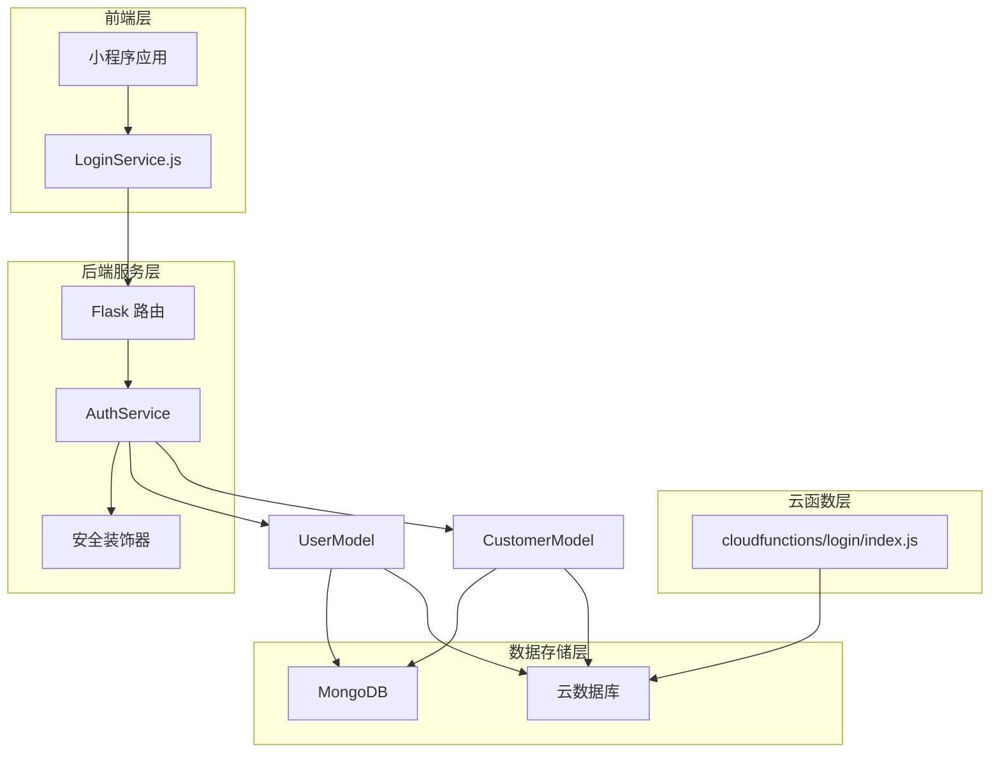

**图表来源**
- [backend_utils/loginService.js](file://backend_utils/loginService.js#L1-L325)
- [cloudfunctions/login/index.js](file://cloudfunctions/login/index.js#L1-L92)
- [routes/auth.py](file://routes/auth.py#L1-L437)
- [services/auth_service.py](file://services/auth_service.py#L1-L510)
- [models/user.py](file://models/user.py#L1-L309)
- [models/customer.py](file://models/customer.py#L1-L300)

## 详细组件分析

### 用户登录机制

系统支持多种登录方式，每种方式都有相应的安全措施：

#### 管理员登录
- 支持环境变量配置的默认管理员账户
- 支持数据库中的管理员用户
- 密码使用PBKDF2哈希存储
- 登录成功后签发JWT令牌

#### 手机号登录
- 支持短信验证码登录
- 支持密码登录
- 登录成功后更新最后登录时间
- 同步用户数据到客户集合

#### 邮箱登录
- 支持邮箱+密码登录
- 提供忘记密码功能
- 发送验证码到邮箱

#### 微信登录
- 支持微信JS-Code交换
- 开发模式下支持模拟登录
- 自动创建或更新用户记录
- 同步用户头像、昵称等信息

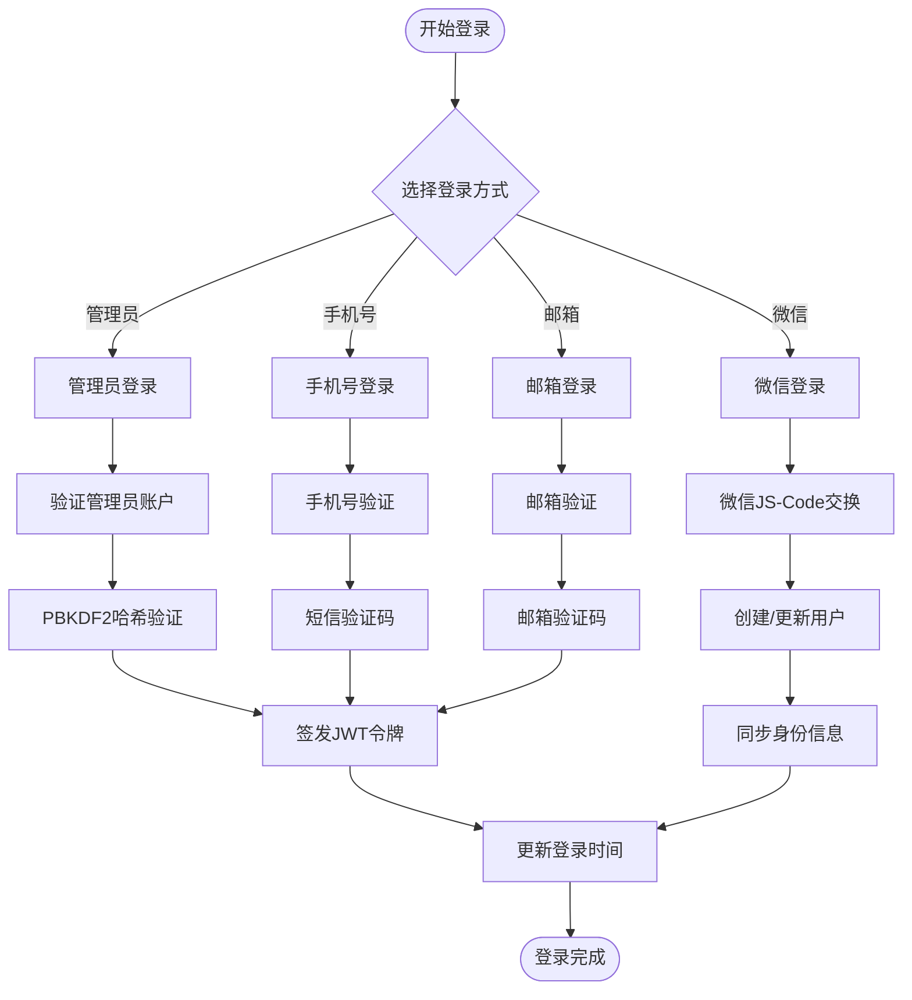

**图表来源**
- [services/auth_service.py](file://services/auth_service.py#L196-L229)
- [services/auth_service.py](file://services/auth_service.py#L356-L411)
- [services/auth_service.py](file://services/auth_service.py#L253-L331)

**章节来源**
- [services/auth_service.py](file://services/auth_service.py#L1-L510)
- [routes/auth.py](file://routes/auth.py#L74-L437)

### 会话管理与令牌管理

系统采用JWT令牌机制，支持令牌轮换和会话管理：

#### 令牌结构
- Access Token：15分钟有效期，用于短期访问
- Refresh Token：7天有效期，用于刷新Access Token
- 令牌包含：用户标识、角色、签发时间、过期时间、令牌类型

#### 会话管理
- 令牌刷新时撤销旧会话，防止重放攻击
- 会话存储在user_sessions集合中
- 支持主动撤销会话
- 支持查询用户的所有活动会话

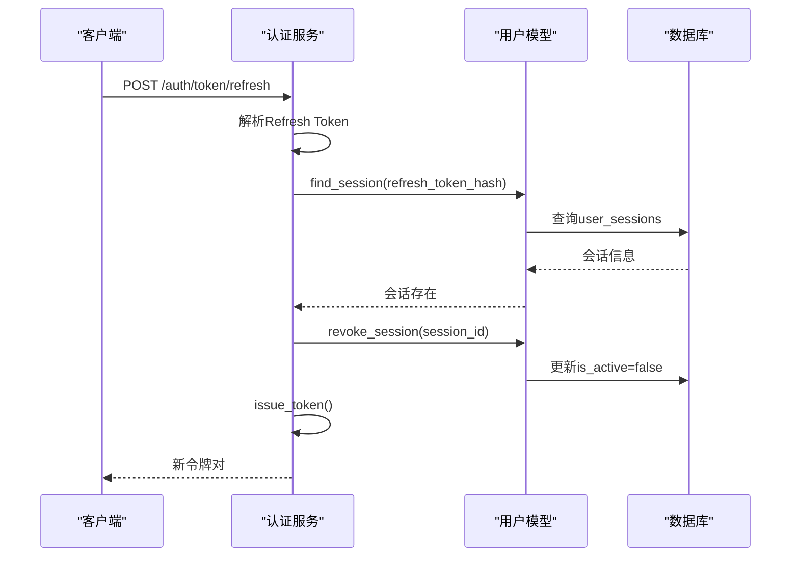

**图表来源**
- [services/auth_service.py](file://services/auth_service.py#L133-L160)
- [models/user.py](file://models/user.py#L45-L91)

**章节来源**
- [services/auth_service.py](file://services/auth_service.py#L86-L160)
- [models/user.py](file://models/user.py#L27-L91)

### 权限体系与访问控制

系统采用基于角色的访问控制（RBAC）：

#### 角色定义
- viewer：只读权限
- editor：编辑权限
- admin：管理员权限
- user：普通用户权限

**更新** 新增普通用户权限控制，支持用户个人资料修改功能。

#### 权限校验
- 路由级权限装饰器
- 角色规范化处理
- 权限不足时返回403错误

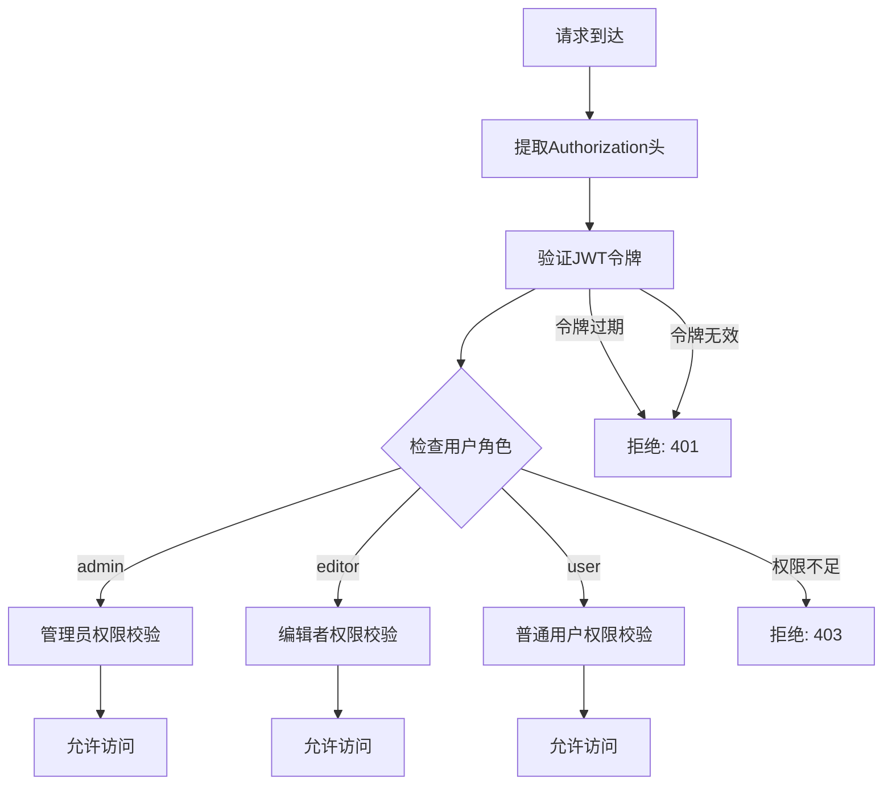

**图表来源**
- [routes/auth.py](file://routes/auth.py#L33-L72)
- [services/auth_service.py](file://services/auth_service.py#L27-L47)

**章节来源**
- [routes/auth.py](file://routes/auth.py#L56-L72)
- [services/auth_service.py](file://services/auth_service.py#L27-L47)

### 高级用户档案管理

**新增功能** 系统现在提供完整的高级用户档案管理功能：

#### 用户信息维护
- 支持昵称、头像、手机号等字段更新
- 自动同步用户资料到客户集合
- 支持部分字段更新，避免覆盖其他数据

#### 权限管理
- 普通用户只能修改自己的资料
- 管理员用户拥有完整的用户管理权限
- 支持用户角色的精细化控制

#### 数据一致性保证
- 更新操作完成后自动重新获取用户数据
- 确保客户集合中的用户信息同步更新
- 防止数据不一致的情况发生

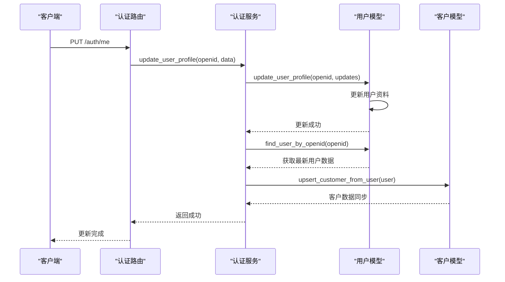

**图表来源**
- [services/auth_service.py](file://services/auth_service.py#L427-L448)
- [models/user.py](file://models/user.py#L273-L289)
- [models/customer.py](file://models/customer.py#L66-L117)

**章节来源**
- [services/auth_service.py](file://services/auth_service.py#L427-L448)
- [models/user.py](file://models/user.py#L273-L289)

### 余额原子性管理

**新增功能** 系统提供安全的余额原子性更新机制：

#### 原子性操作
- 通过查找-更新模式确保操作的原子性
- 防止并发操作导致的数据不一致
- 支持正负金额的灵活调整

#### 安全验证
- 检查用户是否存在
- 验证余额不足的情况
- 防止负余额的产生

#### 返回新余额
- 操作完成后返回新的余额值
- 支持业务逻辑的后续处理
- 提供完整的操作结果反馈

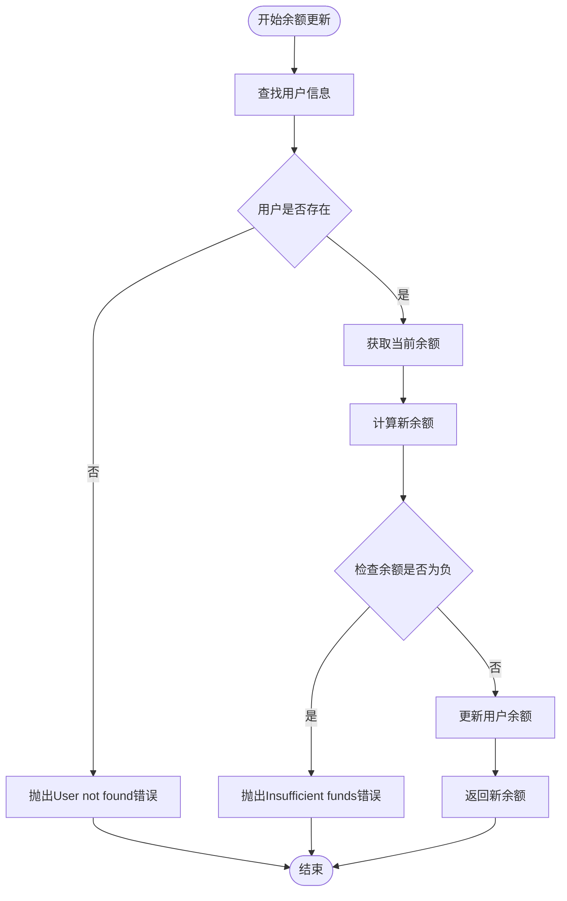

**图表来源**
- [models/user.py](file://models/user.py#L291-L308)

**章节来源**
- [models/user.py](file://models/user.py#L291-L308)

### 用户与客户关联关系

系统通过统一身份映射确保用户与客户数据一致：

#### 身份映射策略
- 用户数据同步到客户集合
- 基于手机号或OpenID建立关联
- 客户集合包含用户的核心信息
- 支持客户分组管理

#### 数据一致性保证
- 同步发生在用户登录或资料更新时
- 客户数据包含用户头像、昵称、联系方式
- 支持客户信息的独立维护

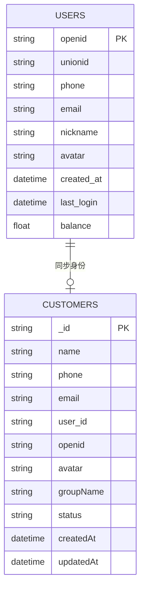

**图表来源**
- [models/user.py](file://models/user.py#L181-L237)
- [models/customer.py](file://models/customer.py#L66-L117)
- [services/auth_service.py](file://services/auth_service.py#L242-L251)

**章节来源**
- [models/user.py](file://models/user.py#L181-L237)
- [models/customer.py](file://models/customer.py#L66-L117)
- [services/auth_service.py](file://services/auth_service.py#L242-L251)

### 安全验证与防护

#### 密码安全
- PBKDF2-HMAC-SHA256哈希算法
- 可配置的迭代次数
- 防止彩虹表攻击

#### 速率限制
- 基于IP和端点的限流
- 登录接口特殊保护
- 频繁请求返回429错误

#### 账户锁定
- 连续失败登录锁定
- 15分钟锁定时间
- 锁定状态自动清理

#### 审计日志
- 记录用户操作
- 包含用户ID、IP地址、操作类型
- 支持异常状态追踪

**章节来源**
- [services/auth_service.py](file://services/auth_service.py#L49-L84)
- [backend_utils/security.py](file://backend_utils/security.py#L17-L117)

### 用户信息查询优化

#### 查询策略
- 按OpenID、手机号、邮箱的快速查询
- 客户端缓存机制
- 分页查询支持
- 关键字段索引优化

#### 缓存策略
- 前端模块懒加载缓存
- API响应时间监控
- 性能指标统计
- 内存警告自动清理

**章节来源**
- [models/user.py](file://models/user.py#L181-L237)
- [backend_utils/performance-optimizer.js](file://backend_utils/performance-optimizer.js#L1-L800)

## 依赖关系分析

系统各组件之间的依赖关系如下：

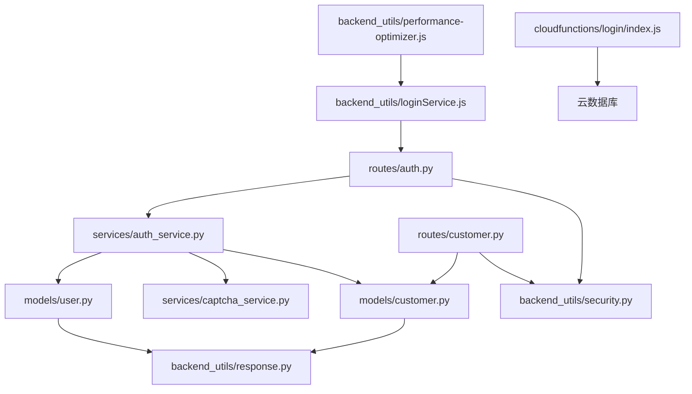

**图表来源**
- [routes/auth.py](file://routes/auth.py#L1-L437)
- [routes/customer.py](file://routes/customer.py#L1-L217)
- [services/auth_service.py](file://services/auth_service.py#L1-L510)
- [models/user.py](file://models/user.py#L1-L309)
- [models/customer.py](file://models/customer.py#L1-L300)
- [backend_utils/security.py](file://backend_utils/security.py#L1-L117)
- [backend_utils/response.py](file://backend_utils/response.py#L1-L118)
- [backend_utils/loginService.js](file://backend_utils/loginService.js#L1-L325)
- [cloudfunctions/login/index.js](file://cloudfunctions/login/index.js#L1-L92)
- [backend_utils/performance-optimizer.js](file://backend_utils/performance-optimizer.js#L1-L800)

**章节来源**
- [routes/auth.py](file://routes/auth.py#L1-L437)
- [routes/customer.py](file://routes/customer.py#L1-L217)
- [services/auth_service.py](file://services/auth_service.py#L1-L510)
- [models/user.py](file://models/user.py#L1-L309)
- [models/customer.py](file://models/customer.py#L1-L300)
- [backend_utils/security.py](file://backend_utils/security.py#L1-L117)
- [backend_utils/response.py](file://backend_utils/response.py#L1-L118)
- [backend_utils/loginService.js](file://backend_utils/loginService.js#L1-L325)
- [cloudfunctions/login/index.js](file://cloudfunctions/login/index.js#L1-L92)
- [backend_utils/performance-optimizer.js](file://backend_utils/performance-optimizer.js#L1-L800)

## 性能考虑

### 前端性能优化
- 模块懒加载：减少初始加载时间
- 缓存管理：智能缓存命中率统计
- 图片懒加载：提升滚动性能
- 交互延迟监控：识别性能瓶颈

### 后端性能优化
- 会话缓存：减少数据库查询
- 批量操作：支持批量更新
- 连接池管理：优化数据库连接
- 错误重试机制：提高系统稳定性

### 监控与告警
- 性能指标收集：加载时间、响应时间、缓存命中率
- 自动告警：超过阈值时触发警告
- 性能报告：定期生成性能分析报告
- 内存管理：自动清理低优先级缓存

## 故障排除指南

### 常见问题诊断

#### 登录失败
- 检查用户名密码是否正确
- 验证数据库连接状态
- 查看JWT密钥配置
- 确认用户是否存在

#### 令牌过期
- 使用Refresh Token刷新
- 检查服务器时间同步
- 验证令牌签名算法
- 确认会话状态

#### 权限不足
- 检查用户角色配置
- 验证权限装饰器使用
- 确认路由访问控制
- 查看审计日志

#### 数据同步问题
- 检查用户数据完整性
- 验证客户集合存在性
- 确认同步触发条件
- 查看错误日志

#### 用户档案更新失败
- 检查用户权限是否正确
- 验证更新字段的有效性
- 确认用户是否存在
- 查看同步过程中的错误

#### 余额更新异常
- 检查用户余额是否充足
- 验证金额变化的合理性
- 确认用户数据的完整性
- 查看原子性操作的日志

**章节来源**
- [services/auth_service.py](file://services/auth_service.py#L196-L229)
- [models/user.py](file://models/user.py#L45-L91)
- [routes/auth.py](file://routes/auth.py#L33-L72)
- [backend_utils/security.py](file://backend_utils/security.py#L87-L117)

## 结论

本用户模型设计实现了完整的用户生命周期管理，包括多渠道登录、统一身份映射、细粒度权限控制和全面的安全防护。通过JWT令牌机制和会话管理，系统提供了安全可靠的用户认证体验。同时，通过性能监控和缓存策略，确保了系统的高性能运行。

**更新** 新增的高级用户档案管理功能显著增强了系统的实用性，包括：
- 完整的用户信息维护能力
- 精细化的权限管理体系  
- 安全的余额原子性更新机制
- 更好的数据一致性保证

建议在生产环境中进一步完善：
- 引入Redis缓存层
- 增强密码复杂度策略
- 实现双因子认证
- 完善审计日志功能
- 建立监控告警体系
- 添加用户行为分析功能