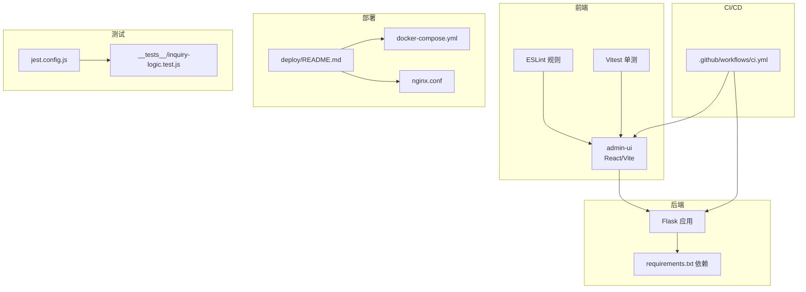
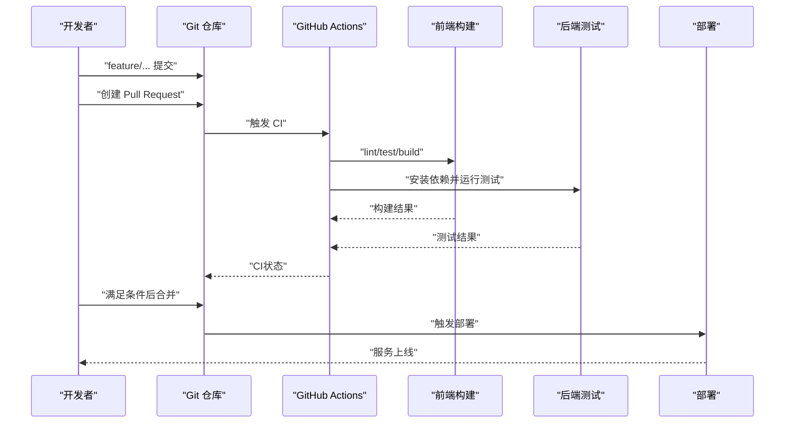
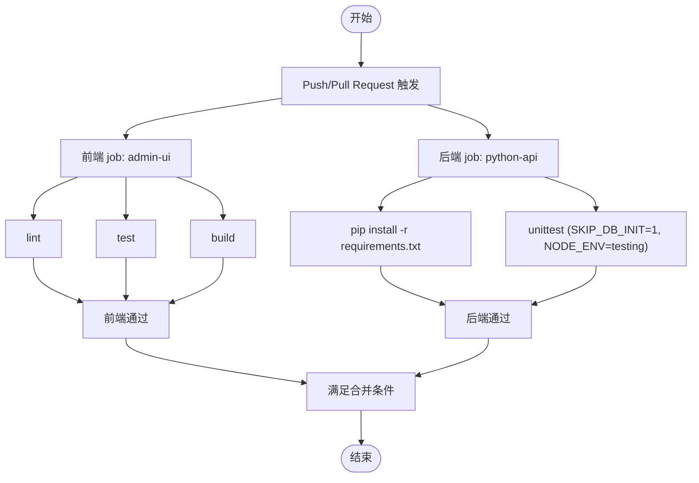
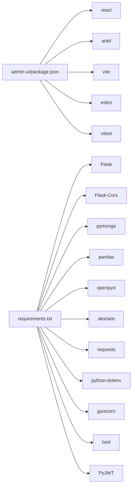

# Git工作流程

<cite>
**本文引用的文件**
- [.github/workflows/ci.yml](file://.github/workflows/ci.yml)
- [CONTRIBUTING.md](file://CONTRIBUTING.md)
- [README.md](file://README.md)
- [.gitignore](file://.gitignore)
- [package.json](file://package.json)
- [admin-ui/package.json](file://admin-ui/package.json)
- [admin-ui/vite.config.ts](file://admin-ui/vite.config.ts)
- [jest.config.js](file://jest.config.js)
- [.eslintrc.json](file://.eslintrc.json)
- [requirements.txt](file://requirements.txt)
- [deploy/README.md](file://deploy/README.md)
- [__tests__/inquiry-logic.test.js](file://__tests__/inquiry-logic.test.js)
</cite>

## 目录
1. [引言](#引言)
2. [项目结构](#项目结构)
3. [核心组件](#核心组件)
4. [架构总览](#架构总览)
5. [详细组件分析](#详细组件分析)
6. [依赖关系分析](#依赖关系分析)
7. [性能考虑](#性能考虑)
8. [故障排除指南](#故障排除指南)
9. [结论](#结论)
10. [附录](#附录)

## 引言
本文件旨在为本仓库建立标准化的Git工作流程规范，涵盖分支管理、提交信息、Pull Request流程、自动化测试与CI/CD、版本与发布、权限与密钥安全、协作最佳实践等，帮助团队高效协作、保证质量与可追溯性。

## 项目结构
本仓库采用多模块并存的结构：
- 前端管理界面：admin-ui（React/Vite，含ESLint、Vitest）
- 后端API（Flask）：Python后端，配合requirements.txt
- CI/CD：GitHub Actions工作流
- 部署：Docker Compose与Nginx部署说明
- 测试：Jest配置与单元测试示例

图表来源
- [.github/workflows/ci.yml](file://.github/workflows/ci.yml#L1-L35)
- [admin-ui/package.json](file://admin-ui/package.json#L1-L38)
- [admin-ui/vite.config.ts](file://admin-ui/vite.config.ts#L1-L78)
- [requirements.txt](file://requirements.txt#L1-L12)
- [deploy/README.md](file://deploy/README.md#L1-L44)
- [jest.config.js](file://jest.config.js#L1-L10)
- [__tests__/inquiry-logic.test.js](file://__tests__/inquiry-logic.test.js#L1-L174)

章节来源
- [README.md](file://README.md#L1-L90)
- [.github/workflows/ci.yml](file://.github/workflows/ci.yml#L1-L35)
- [admin-ui/package.json](file://admin-ui/package.json#L1-L38)
- [requirements.txt](file://requirements.txt#L1-L12)
- [deploy/README.md](file://deploy/README.md#L1-L44)
- [jest.config.js](file://jest.config.js#L1-L10)

## 核心组件
- 分支与提交规范：见贡献指南中的分支命名、提交信息格式与类型分类
- PR流程：从功能到主干的合并策略与审查要求
- CI/CD：GitHub Actions流水线，分别对前端与后端进行lint、测试与构建
- 测试：Jest/Vitest配置与单元测试用例
- 部署：Docker Compose与Nginx部署指引
- 安全与权限：分支保护、密钥与环境变量管理

章节来源
- [CONTRIBUTING.md](file://CONTRIBUTING.md#L1-L63)
- [.github/workflows/ci.yml](file://.github/workflows/ci.yml#L1-L35)
- [jest.config.js](file://jest.config.js#L1-L10)
- [deploy/README.md](file://deploy/README.md#L1-L44)

## 架构总览
下图展示从开发者到CI再到部署的整体流程：

图表来源
- [.github/workflows/ci.yml](file://.github/workflows/ci.yml#L1-L35)
- [deploy/README.md](file://deploy/README.md#L1-L44)

## 详细组件分析

### 分支管理策略
- 功能分支：feature/<简短英文或拼音>
- 修复分支：fix/<问题简述>
- 预发布分支：release/<版本号>
- 热修复分支：hotfix/<问题简述>
- 合并策略：
  - feature → develop：Squash 合并；由模块负责人 Review
  - release → main：Merge 并创建 Tag；更新 CHANGELOG.md 与发布说明
  - hotfix → main：Merge 并打补丁版本；回灌 develop

章节来源
- [CONTRIBUTING.md](file://CONTRIBUTING.md#L8-L40)

### 提交信息规范
- 格式：type(scope): subject [#TAPD-<ID>]
- 类型：feat/fix/refactor/docs/test/chore
- 示例：fix(login): 离线回退避免刷屏日志 #TAPD-102938
- 建议在 PR 描述中列出变更摘要、影响范围与验证步骤

章节来源
- [CONTRIBUTING.md](file://CONTRIBUTING.md#L14-L18)

### Pull Request 流程
- 创建：基于对应分支创建PR，填写变更摘要、影响范围与验证步骤
- 代码审查：至少1-2人Review，关注接口可用性、错误处理、测试覆盖与配置一致性
- 合并：满足CI通过、Review通过后合并；hotfix需回灌develop

章节来源
- [CONTRIBUTING.md](file://CONTRIBUTING.md#L27-L40)

### 自动化测试与CI/CD
- CI触发：push/pull_request
- 前端（admin-ui）：
  - 步骤：checkout → setup-node → npm ci → lint → test → build
  - 工作目录：admin-ui
- 后端（Python API）：
  - 步骤：checkout → setup-python → pip install -r requirements.txt → unittest
  - 环境：SKIP_DB_INIT=1 NODE_ENV=testing
- 测试工具与配置：
  - Jest：jest.config.js，roots包含miniprogram与tests，测试匹配模式与setup
  - Vitest：admin-ui/vite.config.ts中配置test环境为jsdom
  - ESLint：.eslintrc.json定义环境与规则

图表来源
- [.github/workflows/ci.yml](file://.github/workflows/ci.yml#L1-L35)
- [jest.config.js](file://jest.config.js#L1-L10)
- [admin-ui/vite.config.ts](file://admin-ui/vite.config.ts#L68-L76)

章节来源
- [.github/workflows/ci.yml](file://.github/workflows/ci.yml#L1-L35)
- [jest.config.js](file://jest.config.js#L1-L10)
- [admin-ui/vite.config.ts](file://admin-ui/vite.config.ts#L68-L76)
- [.eslintrc.json](file://.eslintrc.json#L1-L24)

### 版本管理与发布
- 版本号规则：vMAJOR.MINOR.PATCH（语义化版本）
- 标签：v1.0.0、v1.0.1
- 发布说明：在Releases记录新增/修复/破坏性改动与TAPD链接
- 发布流程：release → main时创建Tag并更新发布说明

章节来源
- [CONTRIBUTING.md](file://CONTRIBUTING.md#L55-L59)

### 仓库权限与密钥安全
- 分支保护：main/develop设为保护分支，禁止直接push，仅允许PR合并
- 审查要求：合并前至少1-2人Review
- 密钥与环境变量：
  - 本地环境变量放在 .env.local（已被.gitignore忽略），只提交.env.example
  - 禁止提交：.env*、私钥、日志、数据库文件、temp_uploads/、Office临时文件（~$*）
  - 生产环境使用统一密钥管理/凭证下发流程
- SSH Key或个人Access Token（最小权限）

章节来源
- [CONTRIBUTING.md](file://CONTRIBUTING.md#L42-L54)
- [.gitignore](file://.gitignore#L122-L131)

### 协作最佳实践
- 提交频次：保持原子性与可读性，每次聚焦一个改动
- 代码规范：避免硬编码环境差异，统一走环境变量；对外部输入做格式校验与边界限制；统一错误响应结构；日志不打印敏感信息
- 测试建议：前端运行lint/test/build；后端运行unittest（tests/test_*.py）

章节来源
- [CONTRIBUTING.md](file://CONTRIBUTING.md#L20-L36)

### 部署流程
- Docker Compose（推荐）：安装Docker与Docker Compose，上传项目，修改.env.production，执行docker-compose up -d
- 手动部署Nginx：复制配置文件，测试并重启Nginx
- 前端构建：在部署前确保构建Admin UI，产物位于admin-ui/dist

章节来源
- [deploy/README.md](file://deploy/README.md#L1-L44)

## 依赖关系分析
- 前端依赖：React、Ant Design、Vite、ESLint、Vitest
- 后端依赖：Flask、Flask-Cors、PyMongo、pandas、openpyxl、akshare、requests、python-dotenv、gunicorn、lxml、PyJWT
- 测试依赖：Jest、Vitest、jsdom、eslint-plugin等

图表来源
- [admin-ui/package.json](file://admin-ui/package.json#L1-L38)
- [requirements.txt](file://requirements.txt#L1-L12)

章节来源
- [admin-ui/package.json](file://admin-ui/package.json#L1-L38)
- [requirements.txt](file://requirements.txt#L1-L12)

## 性能考虑
- CI阶段拆分：前端与后端分别执行，缩短反馈周期
- 前端缓存：Actions使用npm缓存，减少重复安装时间
- 测试隔离：Jest/Vitest分别配置roots与匹配规则，避免不必要的扫描
- 构建优化：Vite按需加载与代理配置，降低开发时等待

章节来源
- [.github/workflows/ci.yml](file://.github/workflows/ci.yml#L10-L23)
- [jest.config.js](file://jest.config.js#L1-L10)
- [admin-ui/vite.config.ts](file://admin-ui/vite.config.ts#L61-L76)

## 故障排除指南
- CI失败
  - 前端：检查lint/test/build是否通过；确认admin-ui工作目录正确
  - 后端：检查requirements.txt安装与unittest执行；确认环境变量SKIP_DB_INIT与NODE_ENV设置
- 本地开发
  - ESLint报错：根据.eslintrc.json规则修正；避免未使用变量与未定义变量
  - Vitest/Jest测试失败：核对测试匹配模式与setup；确保测试文件路径正确
- 部署问题
  - Docker Compose：确认容器日志与端口映射；检查.env.production配置
  - Nginx：确认配置文件复制与软链接；执行nginx -t与reload

章节来源
- [.github/workflows/ci.yml](file://.github/workflows/ci.yml#L1-L35)
- [.eslintrc.json](file://.eslintrc.json#L1-L24)
- [jest.config.js](file://jest.config.js#L1-L10)
- [deploy/README.md](file://deploy/README.md#L1-L44)

## 结论
本规范以贡献指南为核心，结合现有CI/CD、测试与部署配置，形成从分支到发布的闭环流程。建议团队严格遵循分支命名、提交信息、PR审查与合并策略，持续完善测试覆盖率与自动化流程，保障交付质量与安全性。

## 附录
- 关键文件索引
  - CI配置：.github/workflows/ci.yml
  - 贡献与规范：CONTRIBUTING.md
  - 前端包与脚本：admin-ui/package.json
  - 前端构建与代理：admin-ui/vite.config.ts
  - 测试配置：jest.config.js
  - ESLint规则：.eslintrc.json
  - 后端依赖：requirements.txt
  - 部署指南：deploy/README.md
  - 示例测试：__tests__/inquiry-logic.test.js