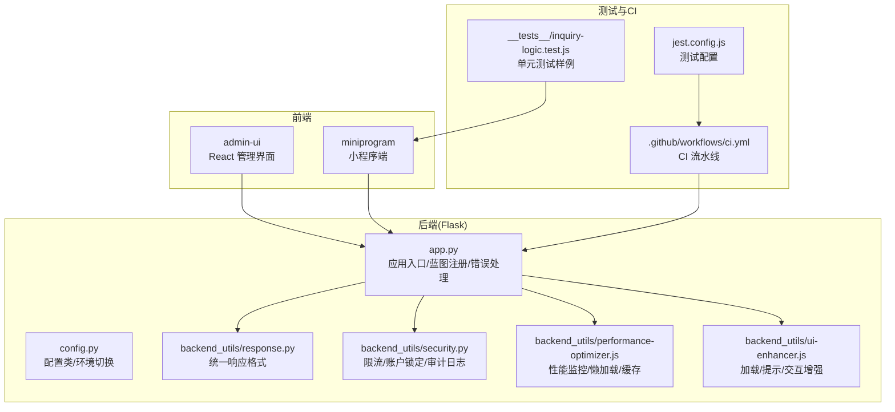
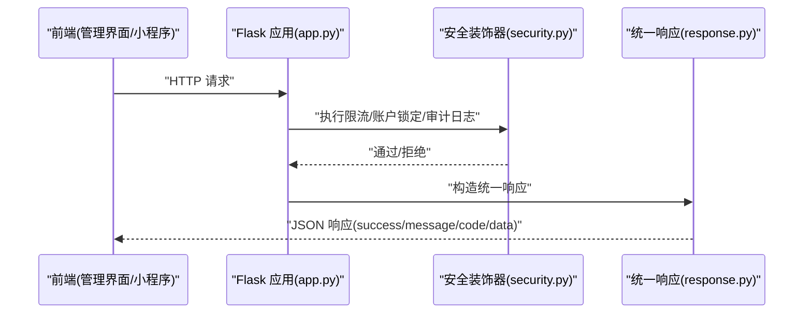
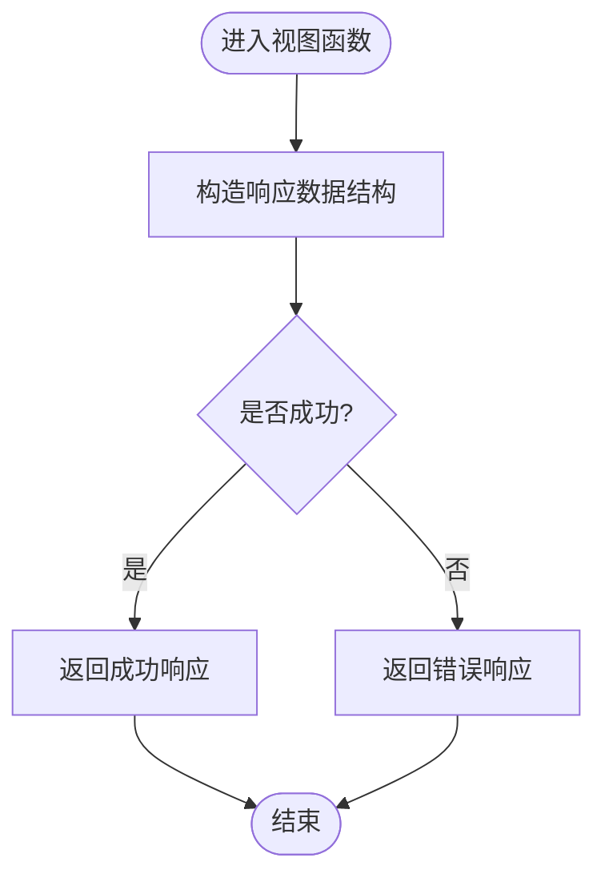
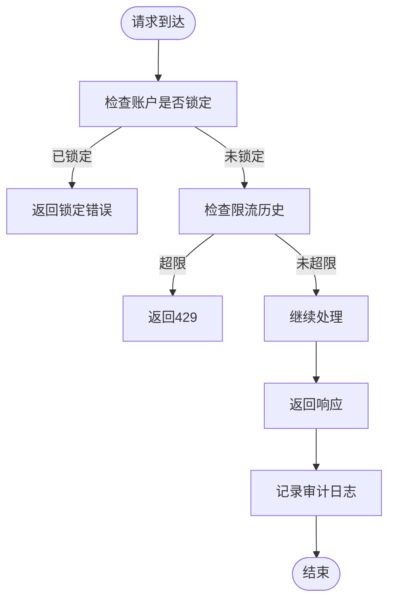
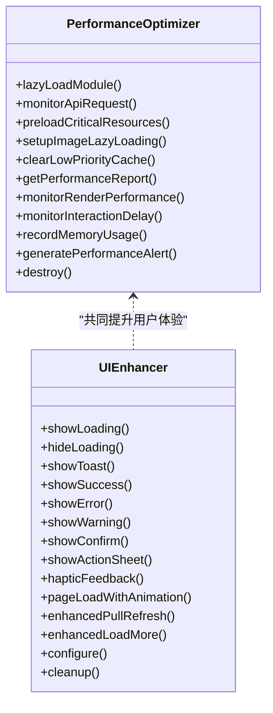
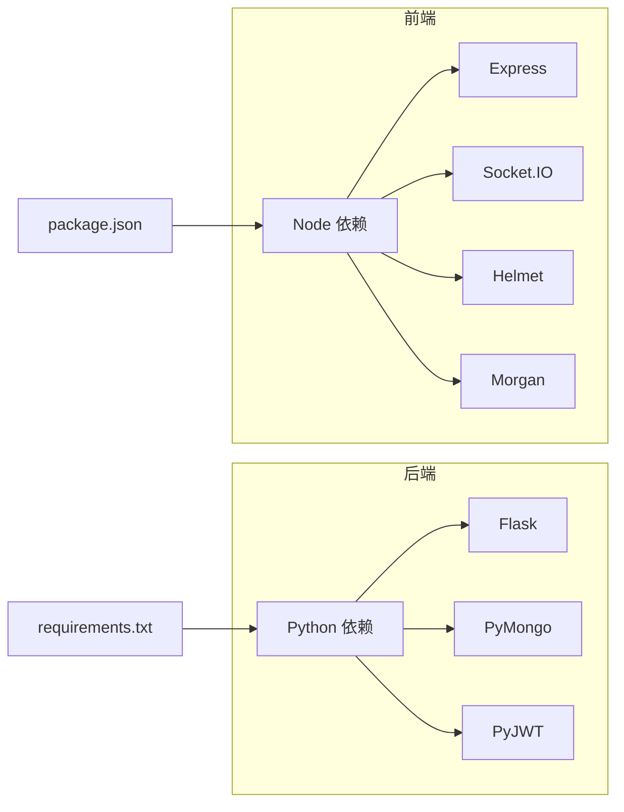

# 代码审查清单

<cite>
**本文引用的文件**
- [README.md](file://README.md)
- [CONTRIBUTING.md](file://CONTRIBUTING.md)
- [jest.config.js](file://jest.config.js)
- [.eslintrc.json](file://.eslintrc.json)
- [.github/workflows/ci.yml](file://.github/workflows/ci.yml)
- [requirements.txt](file://requirements.txt)
- [package.json](file://package.json)
- [app.py](file://app.py)
- [config.py](file://config.py)
- [backend_utils/security.py](file://backend_utils/security.py)
- [backend_utils/response.py](file://backend_utils/response.py)
- [backend_utils/performance-optimizer.js](file://backend_utils/performance-optimizer.js)
- [backend_utils/ui-enhancer.js](file://backend_utils/ui-enhancer.js)
- [__tests__/inquiry-logic.test.js](file://__tests__/inquiry-logic.test.js)
</cite>

## 目录
1. [引言](#引言)
2. [项目结构](#项目结构)
3. [核心组件](#核心组件)
4. [架构概览](#架构概览)
5. [详细组件分析](#详细组件分析)
6. [依赖关系分析](#依赖关系分析)
7. [性能考量](#性能考量)
8. [故障排查指南](#故障排查指南)
9. [结论](#结论)
10. [附录](#附录)

## 引言
本文件旨在为本项目建立系统化的代码质量保证流程与审查清单，覆盖功能正确性、代码可读性、性能影响、安全性评估、测试覆盖率、API 设计审查、可维护性与技术债务控制等方面。审查标准结合项目现有配置与实现（如统一响应格式、安全装饰器、性能监控工具、CI 流水线等），帮助团队在开发、评审与发布各阶段持续提升质量。

## 项目结构
项目采用多语言混合架构：后端 Python/Flask 提供 API 服务，前端包含 React 管理界面与小程序端，同时具备 CI 流水线与基础测试配置。关键质量基础设施包括：
- 统一响应格式与错误处理
- 安全装饰器（限流、账户锁定、审计日志）
- 性能监控与 UI 体验增强工具
- CI 流水线（前端 Lint/测试/构建、Python 单元测试）

图表来源
- [app.py](file://app.py#L103-L276)
- [config.py](file://config.py#L22-L132)
- [backend_utils/response.py](file://backend_utils/response.py#L11-L118)
- [backend_utils/security.py](file://backend_utils/security.py#L17-L117)
- [backend_utils/performance-optimizer.js](file://backend_utils/performance-optimizer.js#L7-L817)
- [backend_utils/ui-enhancer.js](file://backend_utils/ui-enhancer.js#L7-L439)
- [jest.config.js](file://jest.config.js#L1-L10)
- [.github/workflows/ci.yml](file://.github/workflows/ci.yml#L1-L35)
- [__tests__/inquiry-logic.test.js](file://__tests__/inquiry-logic.test.js#L1-L174)

章节来源
- [README.md](file://README.md#L1-L90)
- [CONTRIBUTING.md](file://CONTRIBUTING.md#L1-L63)
- [app.py](file://app.py#L103-L276)
- [config.py](file://config.py#L22-L132)

## 核心组件
- 统一响应格式与错误处理：确保前后端一致的响应结构，便于前端消费与错误定位。
- 安全装饰器：提供速率限制、账户锁定与审计日志，降低滥用与攻击风险。
- 性能监控工具：涵盖懒加载、缓存、API 响应时间、渲染性能、交互延迟与内存监控。
- UI 体验增强：加载提示、Toast 队列、触觉反馈、确认对话框、下拉刷新增强等。
- CI 与测试：前端 Lint/测试/构建与 Python 单测流水线，配合 Jest 配置与测试样例。

章节来源
- [backend_utils/response.py](file://backend_utils/response.py#L11-L118)
- [backend_utils/security.py](file://backend_utils/security.py#L17-L117)
- [backend_utils/performance-optimizer.js](file://backend_utils/performance-optimizer.js#L7-L817)
- [backend_utils/ui-enhancer.js](file://backend_utils/ui-enhancer.js#L7-L439)
- [.github/workflows/ci.yml](file://.github/workflows/ci.yml#L1-L35)
- [jest.config.js](file://jest.config.js#L1-L10)
- [__tests__/inquiry-logic.test.js](file://__tests__/inquiry-logic.test.js#L1-L174)

## 架构概览
后端通过 Flask 蓝图组织 API，统一响应与安全装饰器贯穿请求生命周期；前端通过管理界面与小程序端调用后端接口；CI 负责自动化质量门禁。

图表来源
- [app.py](file://app.py#L185-L276)
- [backend_utils/security.py](file://backend_utils/security.py#L17-L117)
- [backend_utils/response.py](file://backend_utils/response.py#L11-L118)

## 详细组件分析

### 组件A：统一响应格式与错误处理
- 功能要点
  - 成功/错误/分页三类响应结构统一，字段包含 success、message、code、data。
  - Flask 响应封装，便于在蓝图中直接返回。
- 审查要点
  - 是否所有接口均使用统一响应？是否存在直接返回原始数据的情况？
  - 错误码是否语义化且与前端约定一致？是否区分 4xx/5xx 场景？
  - 分页响应是否包含页码、每页数量、总数与总页数？

图表来源
- [backend_utils/response.py](file://backend_utils/response.py#L11-L118)

章节来源
- [backend_utils/response.py](file://backend_utils/response.py#L11-L118)
- [app.py](file://app.py#L252-L276)

### 组件B：安全装饰器（限流/账户锁定/审计日志）
- 功能要点
  - 基于 IP+端点的简单限流，超过阈值返回 429。
  - 登录失败次数统计与账户锁定（多次失败锁定一段时间）。
  - 审计日志记录用户行为、IP、状态（成功/失败/错误）。
- 审查要点
  - 限流窗口与阈值是否合理？是否需要持久化存储替代内存存储？
  - 账户锁定策略是否可配置？是否支持管理员解锁？
  - 审计日志是否包含必要上下文且不泄露敏感信息？

图表来源
- [backend_utils/security.py](file://backend_utils/security.py#L17-L117)

章节来源
- [backend_utils/security.py](file://backend_utils/security.py#L17-L117)
- [app.py](file://app.py#L252-L276)

### 组件C：性能监控与 UI 体验增强
- 功能要点
  - 懒加载、模块缓存、关键资源预加载、图片懒加载、分包预下载。
  - API 请求耗时监控、渲染性能监控、交互延迟监控、内存使用记录、网络状态变化处理。
  - UI 增强：加载提示、Toast 队列、成功/错误/警告提示、确认对话框、下拉刷新增强、加载更多增强。
- 审查要点
  - 性能阈值是否可配置？是否支持动态调整？
  - 缓存 TTL 与清理策略是否合理？是否区分高/低优先级缓存？
  - UI 增强是否与业务解耦？是否支持主题切换与自定义动画？

图表来源
- [backend_utils/performance-optimizer.js](file://backend_utils/performance-optimizer.js#L7-L817)
- [backend_utils/ui-enhancer.js](file://backend_utils/ui-enhancer.js#L7-L439)

章节来源
- [backend_utils/performance-optimizer.js](file://backend_utils/performance-optimizer.js#L7-L817)
- [backend_utils/ui-enhancer.js](file://backend_utils/ui-enhancer.js#L7-L439)

### 组件D：API 设计审查
- 设计要点
  - 路由蓝图组织清晰，健康检查与版本信息端点明确。
  - 统一响应格式，错误处理覆盖 404/500/未处理异常。
- 审查要点
  - 接口是否具备幂等性与一致性？是否对必填参数与边界进行校验？
  - 是否提供 OpenAPI/Swagger 文档或等效契约？参数与响应是否标注类型与约束？
  - 是否区分鉴权失败与业务错误（如 401 vs 400/422）？

章节来源
- [app.py](file://app.py#L185-L276)
- [backend_utils/response.py](file://backend_utils/response.py#L11-L118)

### 组件E：测试与覆盖率要求
- 现状
  - Jest 配置指定测试根目录与匹配规则，支持 setup 文件。
  - CI 流水线包含前端 Lint/测试/构建与 Python 单元测试。
  - 存在前端逻辑测试样例，展示断言风格与测试组织方式。
- 要求
  - 单元测试：核心逻辑（如分组迁移、计数计算）需覆盖成功/失败/边界场景。
  - 集成测试：端到端覆盖关键业务链路（登录、询价、下单、分页）。
  - 覆盖率：建议行/分支/函数/语句覆盖率不低于 80%，关键路径不低于 90%。
  - 静态检查：ESLint 配置需严格执行，禁止未使用变量与未定义变量。

章节来源
- [jest.config.js](file://jest.config.js#L1-L10)
- [.github/workflows/ci.yml](file://.github/workflows/ci.yml#L1-L35)
- [__tests__/inquiry-logic.test.js](file://__tests__/inquiry-logic.test.js#L1-L174)
- [.eslintrc.json](file://.eslintrc.json#L1-L24)

## 依赖关系分析
- 后端依赖
  - Flask、Flask-CORS、PyMongo、AkShare、gunicorn、PyJWT 等。
  - 建议：固定版本范围，启用依赖扫描与漏洞检测。
- 前端依赖
  - Node 版本要求与常用依赖（Express、Socket.IO、Helmet、Morgan 等）。
  - 建议：定期更新与安全扫描，避免重复依赖与废弃包。

图表来源
- [requirements.txt](file://requirements.txt#L1-L12)
- [package.json](file://package.json#L27-L48)

章节来源
- [requirements.txt](file://requirements.txt#L1-L12)
- [package.json](file://package.json#L27-L48)

## 性能考量
- 内存使用
  - 性能监控器记录内存使用与警告，支持清理低优先级缓存。
- 网络请求优化
  - API 响应时间监控与网络速度估算，支持断网时清理缓存。
- 用户体验
  - 渲染性能与交互延迟监控，Toast 队列与触觉反馈减少感知延迟。
- 建议
  - 阈值可配置化，支持 A/B 调优；对热点接口增加缓存层与 CDN。

章节来源
- [backend_utils/performance-optimizer.js](file://backend_utils/performance-optimizer.js#L465-L767)
- [backend_utils/ui-enhancer.js](file://backend_utils/ui-enhancer.js#L77-L107)

## 故障排查指南
- 健康检查与错误处理
  - 健康检查端点返回服务状态与数据库连接状态。
  - 404/500/未处理异常均有统一错误响应，便于前端识别。
- 安全相关
  - 限流触发返回 429；账户锁定时审计日志记录。
- 建议
  - 增加更细粒度的错误码与错误详情字段，便于前端精准提示与埋点分析。

章节来源
- [app.py](file://app.py#L185-L276)
- [backend_utils/security.py](file://backend_utils/security.py#L36-L84)

## 结论
本项目已在统一响应、安全装饰器、性能监控与 UI 增强方面形成较为完善的质量基线，并通过 CI 流水线与测试配置保障自动化质量门禁。建议在后续迭代中进一步完善 API 文档、提升测试覆盖率、强化依赖治理与安全扫描，以持续提升系统的可靠性与可维护性。

## 附录
- 代码审查清单（可直接用于评审）
  - 功能正确性
    - 是否满足需求与边界条件？是否覆盖异常与边界场景？
    - 是否有充分的单元测试与集成测试？
  - 代码可读性
    - 命名是否清晰、函数是否单一职责、注释是否必要且准确？
    - 是否遵循 ESLint/Python 风格规范？
  - 性能影响
    - 是否存在阻塞操作与长耗时逻辑？是否使用性能监控工具进行观测？
    - 是否对热点接口进行缓存与降载？
  - 安全评估
    - 输入是否校验与限界？是否避免硬编码密钥与敏感信息？
    - 是否启用必要的安全中间件（CORS、Helmet、CSRF 等）？
  - API 设计
    - 接口是否幂等、参数是否明确、错误码是否语义化？
    - 是否提供契约文档并与前端保持一致？
  - 测试覆盖率
    - 单测、集成测、端到端测是否齐全？覆盖率是否达标？
  - 可维护性
    - 代码结构是否清晰、模块间耦合是否合理、依赖是否受控？
    - 是否存在技术债清单并制定偿还计划？