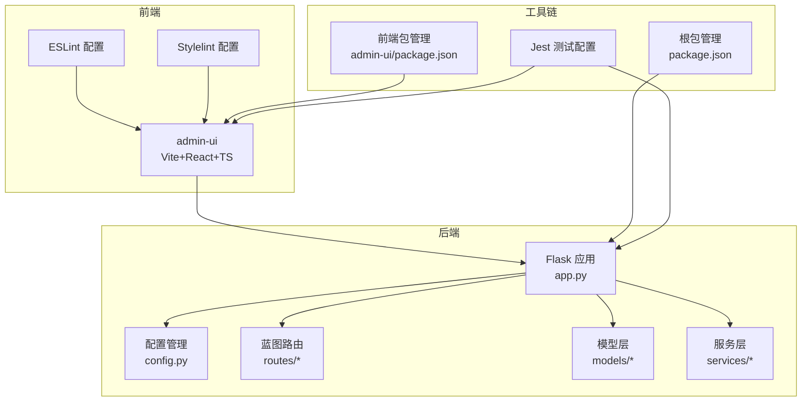
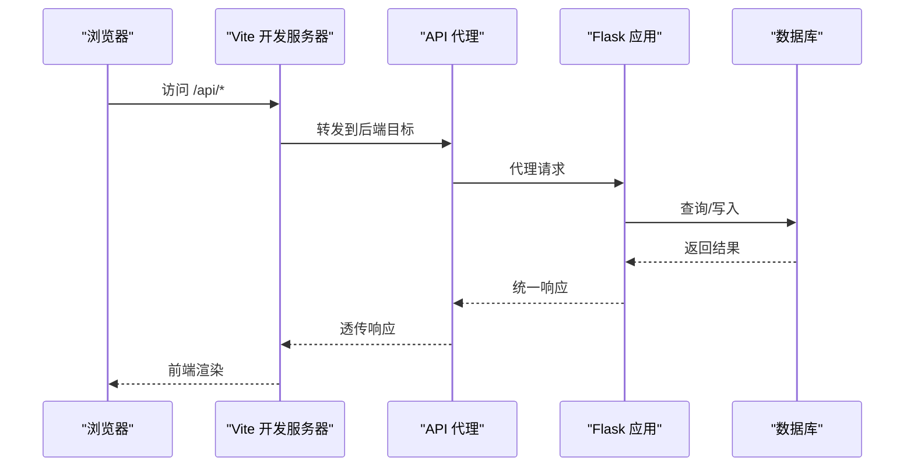
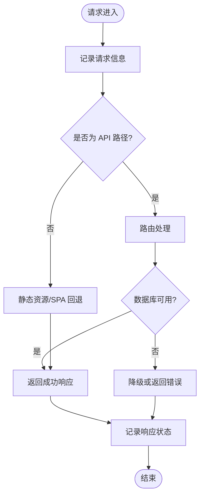
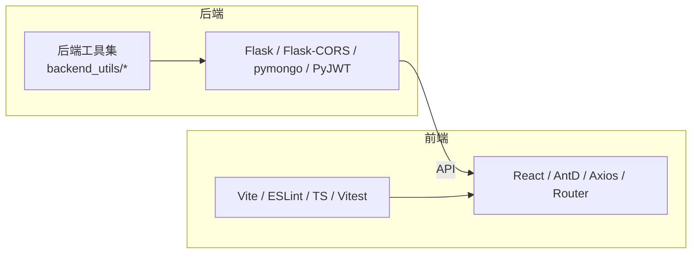

# 代码规范

<cite>
**本文引用的文件**
- [package.json](file://package.json)
- [.eslintrc.json](file://.eslintrc.json)
- [admin-ui/eslint.config.js](file://admin-ui/eslint.config.js)
- [.stylelintrc.json](file://.stylelintrc.json)
- [jest.config.js](file://jest.config.js)
- [CONTRIBUTING.md](file://CONTRIBUTING.md)
- [README.md](file://README.md)
- [requirements.txt](file://requirements.txt)
- [app.py](file://app.py)
- [config.py](file://config.py)
- [admin-ui/package.json](file://admin-ui/package.json)
- [admin-ui/src/App.tsx](file://admin-ui/src/App.tsx)
- [admin-ui/vite.config.ts](file://admin-ui/vite.config.ts)
- [models/customer.py](file://models/customer.py)
- [routes/admin.py](file://routes/admin.py)
- [services/auth_service.py](file://services/auth_service.py)
</cite>

## 目录
1. [引言](#引言)
2. [项目结构](#项目结构)
3. [核心组件](#核心组件)
4. [架构总览](#架构总览)
5. [详细组件分析](#详细组件分析)
6. [依赖关系分析](#依赖关系分析)
7. [性能考虑](#性能考虑)
8. [故障排查指南](#故障排查指南)
9. [结论](#结论)
10. [附录](#附录)

## 引言
本文件旨在建立统一的代码规范与最佳实践指南，覆盖后端 Python/Flask、前端 React/TypeScript、样式 CSS/SCSS、Git 提交与分支管理、Pull Request 流程，以及代码审查清单与质量检查标准。规范来源于现有仓库中的配置文件、脚本与实现，确保团队协作效率与代码质量。

## 项目结构
- 后端采用 Flask 应用，提供 API 与静态资源托管，支持云数据库与本地数据库双数据源模式。
- 前端采用 Vite + React + TypeScript，通过代理访问后端 API，并内置 ESLint/Vitest。
- 样式规范通过 Stylelint 统一约束，支持小程序 WXSS 扩展语法。
- Git 规范与 CI/CD 流程通过贡献指南定义，包含分支命名、提交信息格式、PR 流程与权限策略。

图表来源
- [app.py](file://app.py#L103-L276)
- [config.py](file://config.py#L22-L132)
- [admin-ui/vite.config.ts](file://admin-ui/vite.config.ts#L1-L78)
- [admin-ui/src/App.tsx](file://admin-ui/src/App.tsx#L1-L57)
- [package.json](file://package.json#L1-L50)
- [admin-ui/package.json](file://admin-ui/package.json#L1-L38)
- [jest.config.js](file://jest.config.js#L1-L10)

章节来源
- [README.md](file://README.md#L1-L90)
- [package.json](file://package.json#L1-L50)
- [admin-ui/package.json](file://admin-ui/package.json#L1-L38)

## 核心组件
- Flask 应用与蓝图路由：统一健康检查、CORS、错误处理与静态资源托管；API v1 命名空间下挂载多组蓝图。
- 配置管理：基于环境变量的多环境配置类，支持生产密钥强制、日志轮转与跨域白名单。
- 模型层：抽象数据源差异，支持云数据库与本地数据库，提供统一的 CRUD 与聚合查询。
- 服务层：认证、同步、文件解析等业务服务，配合会话与令牌管理。
- 前端应用：React 路由组织、代理后端 API、ESLint/Vitest/TypeScript 配置。

章节来源
- [app.py](file://app.py#L103-L276)
- [config.py](file://config.py#L22-L132)
- [models/customer.py](file://models/customer.py#L10-L300)
- [services/auth_service.py](file://services/auth_service.py#L14-L416)
- [admin-ui/src/App.tsx](file://admin-ui/src/App.tsx#L1-L57)

## 架构总览
后端通过蓝图组织 API，前端通过 Vite 代理访问后端，样式与脚本分别由 ESLint/Stylelint/Vitest 管控，测试配置覆盖小程序与 tests 目录。

图表来源
- [admin-ui/vite.config.ts](file://admin-ui/vite.config.ts#L21-L59)
- [app.py](file://app.py#L183-L251)

章节来源
- [admin-ui/vite.config.ts](file://admin-ui/vite.config.ts#L1-L78)
- [app.py](file://app.py#L183-L251)

## 详细组件分析

### Flask 应用与错误处理
- 自定义 JSON 提供者：对 ObjectId 与 datetime 进行序列化适配。
- 环境变量加载顺序：优先 .env.local，其次生产环境 .env.production，最后回退 .env。
- 数据库初始化：支持跳过初始化与测试环境，连接超时与失败降级。
- CORS 配置：限定 API 资源、允许的方法与头部，支持凭据与缓存。
- 健康检查：统一返回结构，包含服务状态、数据库状态与环境信息。
- 错误处理：404/500 与通用异常捕获，生产环境隐藏堆栈细节。
- 静态资源托管：回退到 React SPA 的 index.html，避免 API 路径冲突。

图表来源
- [app.py](file://app.py#L211-L274)

章节来源
- [app.py](file://app.py#L16-L35)
- [app.py](file://app.py#L46-L57)
- [app.py](file://app.py#L69-L88)
- [app.py](file://app.py#L168-L181)
- [app.py](file://app.py#L185-L197)
- [app.py](file://app.py#L252-L274)

### 配置管理（Flask）
- 基础配置类：集中管理密钥、数据库、云数据库、AkShare 数据源、日志、CORS、应用名与调试开关。
- 环境类：开发/生产/测试三套配置，生产必须设置 SECRET_KEY，测试使用独立数据库。
- 日志轮转：生产环境启用文件轮转与 INFO 级别日志。

章节来源
- [config.py](file://config.py#L22-L63)
- [config.py](file://config.py#L95-L125)

### 模型层（以客户为例）
- 统一数据源：通过云数据库客户端或本地集合，屏蔽差异。
- 关键能力：创建、查询、更新、删除、分组与去重。
- 安全与健壮性：存在性检查、异常转换、ID 类型转换与时间格式化。

章节来源
- [models/customer.py](file://models/customer.py#L10-L300)

### 服务层（认证）
- JWT 签发与刷新：Access/Refresh Token 生命周期与旋转。
- 用户管理：邮箱/手机登录、密码哈希、管理员账户、用户资料更新。
- 微信登录：支持开发模式模拟与真实接口调用。
- 会话持久化：刷新令牌哈希存储与撤销。

章节来源
- [services/auth_service.py](file://services/auth_service.py#L14-L416)

### 前端应用（React/TypeScript）
- 路由组织：基于 React Router DOM 的嵌套路由与受保护页面。
- 代理配置：根据环境变量切换本地或云端代理目标，失败时返回统一错误结构。
- 包管理：依赖 React、Ant Design、Axios、React Router，开发依赖 ESLint、TypeScript、Vitest、Vite。

章节来源
- [admin-ui/src/App.tsx](file://admin-ui/src/App.tsx#L1-L57)
- [admin-ui/vite.config.ts](file://admin-ui/vite.config.ts#L1-L78)
- [admin-ui/package.json](file://admin-ui/package.json#L1-L38)

### 样式规范（CSS/SCSS）
- Stylelint 规则：类名正则、颜色大小写、引号、空块校验；小程序 WXSS 使用自定义语法。
- 建议：统一命名前缀、BEM 风格、变量与混入复用、媒体查询断点规划。

章节来源
- [.stylelintrc.json](file://.stylelintrc.json#L1-L16)

### JavaScript/TypeScript 前端代码规范
- ESLint 配置：基础推荐规则、全局对象声明、禁用未使用变量与未定义、允许 warn/error 级别的 console。
- Vite 项目 ESLint 配置：Flat 配置、TS/TSX、React Hooks、React Refresh 扩展。
- 建议：类型严格、函数单一职责、组件拆分、Hook 使用规范、错误边界与加载状态。

章节来源
- [.eslintrc.json](file://.eslintrc.json#L1-L24)
- [admin-ui/eslint.config.js](file://admin-ui/eslint.config.js#L1-L24)

### 测试与质量检查
- Jest：Node 环境、测试目录匹配、全局初始化、假时钟、忽略后端目录。
- 建议：单元测试覆盖关键分支、集成测试覆盖 API 代理与错误场景、覆盖率阈值。

章节来源
- [jest.config.js](file://jest.config.js#L1-L10)

## 依赖关系分析
- 后端依赖：Flask、Flask-CORS、pymongo、akshare、requests、python-dotenv、gunicorn、lxml、PyJWT。
- 前端依赖：React、React DOM、Ant Design、Axios、React Router DOM。
- 开发依赖：ESLint、TypeScript、Vitest、Vite、Jest、Concurrently、Nodemon。

图表来源
- [requirements.txt](file://requirements.txt#L1-L12)
- [package.json](file://package.json#L27-L48)
- [admin-ui/package.json](file://admin-ui/package.json#L13-L36)

章节来源
- [requirements.txt](file://requirements.txt#L1-L12)
- [package.json](file://package.json#L27-L48)
- [admin-ui/package.json](file://admin-ui/package.json#L13-L36)

## 性能考虑
- 后端
  - 数据库连接超时与失败降级，避免启动阻塞。
  - 定时任务仅在交易时间执行，减少无效开销。
  - 健康检查与错误日志分级，便于快速定位。
- 前端
  - 代理错误统一返回，便于前端快速反馈。
  - Vite 构建与缓存策略，提升开发体验。

章节来源
- [app.py](file://app.py#L78-L88)
- [app.py](file://app.py#L299-L326)
- [admin-ui/vite.config.ts](file://admin-ui/vite.config.ts#L21-L59)

## 故障排查指南
- 后端
  - 环境变量缺失：检查 .env/.env.local/.env.production 加载顺序与 NODE_ENV。
  - 数据库连接失败：查看日志与降级提示，确认 MONGO_URI 与网络连通。
  - 404/500：查看错误处理器与堆栈日志，生产环境隐藏细节。
- 前端
  - API 代理失败：确认 Vite 代理目标与端口，查看代理错误回调。
  - 路由回退：确认静态资源路径与 SPA 回退逻辑。
- 测试
  - Jest 配置：确保测试目录匹配与环境隔离。

章节来源
- [app.py](file://app.py#L46-L57)
- [app.py](file://app.py#L252-L274)
- [admin-ui/vite.config.ts](file://admin-ui/vite.config.ts#L21-L59)
- [jest.config.js](file://jest.config.js#L1-L10)

## 结论
本规范以现有仓库配置与实现为基础，明确了后端 Flask、前端 React/TypeScript、样式与工具链的统一标准，并配套 Git 分支与提交规范、PR 流程与代码审查清单，有助于提升团队协作效率与代码质量。

## 附录

### Git 提交信息规范与分支命名
- 提交信息格式：type(scope): subject [#TAPD-<ID>]，类型包括 feat/fix/refactor/docs/test/chore。
- 分支命名：功能 feature/<描述>、修复 fix/<问题简述>、预发布 release/<版本号>、热修复 hotfix/<问题简述>。
- 提交流程：feature → develop → release → main，Squash/Rebase 策略与 Review 要求见贡献指南。

章节来源
- [CONTRIBUTING.md](file://CONTRIBUTING.md#L14-L18)
- [CONTRIBUTING.md](file://CONTRIBUTING.md#L37-L40)

### Pull Request 流程与权限策略
- PR 描述：变更摘要、影响范围与验证步骤。
- 合并策略：feature → develop（Squash）、release → main（Merge+Tag）、hotfix → main（回灌 develop）。
- 分支保护：main/develop 保护分支、禁止直推、CI 通过方可合并、SSH/Token 管理。

章节来源
- [CONTRIBUTING.md](file://CONTRIBUTING.md#L18-L47)

### 代码审查清单
- 接口可用性与错误提示、4xx/5xx 区分、单元测试覆盖、配置默认值与本地复现、CI 通过。

章节来源
- [CONTRIBUTING.md](file://CONTRIBUTING.md#L27-L31)
- [CONTRIBUTING.md](file://CONTRIBUTING.md#L33-L35)

### 后端命名约定与模块组织
- 应用工厂：create_app 统一注册蓝图、CORS、日志与错误处理。
- 蓝图：按功能划分（auth/admin/inquiry/stock/trade/message/config/group/fee/customer），统一前缀与命名。
- 配置：多环境类分离，生产密钥强制，日志轮转。

章节来源
- [app.py](file://app.py#L103-L210)
- [config.py](file://config.py#L95-L132)

### 前端命名约定与组件开发规范
- 组件：功能单一、Props 明确、Hook 抽象、错误边界与加载态。
- 路由：嵌套路由与受保护页面，basename 与回退策略。
- 代理：统一错误结构与可读提示，开发环境日志输出。

章节来源
- [admin-ui/src/App.tsx](file://admin-ui/src/App.tsx#L1-L57)
- [admin-ui/vite.config.ts](file://admin-ui/vite.config.ts#L1-L78)

### 样式编写规范与文件组织
- 类名：小写开头，中划线/双下划线组合；颜色十六进制小写；字符串双引号；禁止空块。
- 文件组织：按页面/组件拆分，变量与混入集中管理，媒体查询断点统一。

章节来源
- [.stylelintrc.json](file://.stylelintrc.json#L1-L16)

### 错误处理标准
- 后端：统一 success/message/code/data 结构，404/500/通用异常捕获，生产隐藏堆栈。
- 前端：代理错误统一返回，错误提示与重试策略。

章节来源
- [app.py](file://app.py#L252-L274)
- [admin-ui/vite.config.ts](file://admin-ui/vite.config.ts#L21-L59)