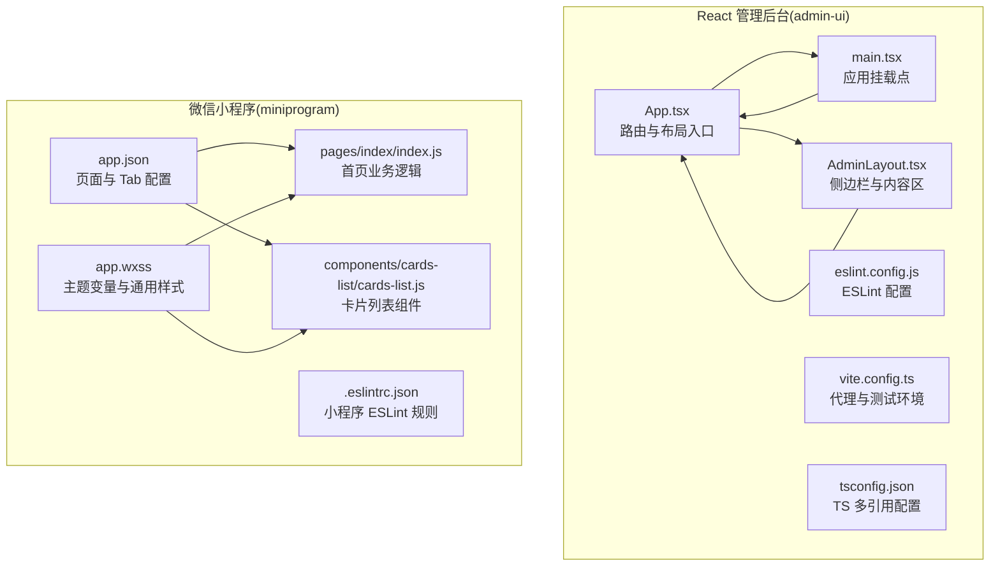
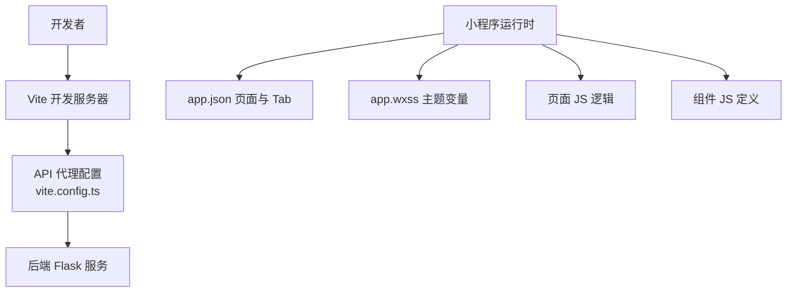
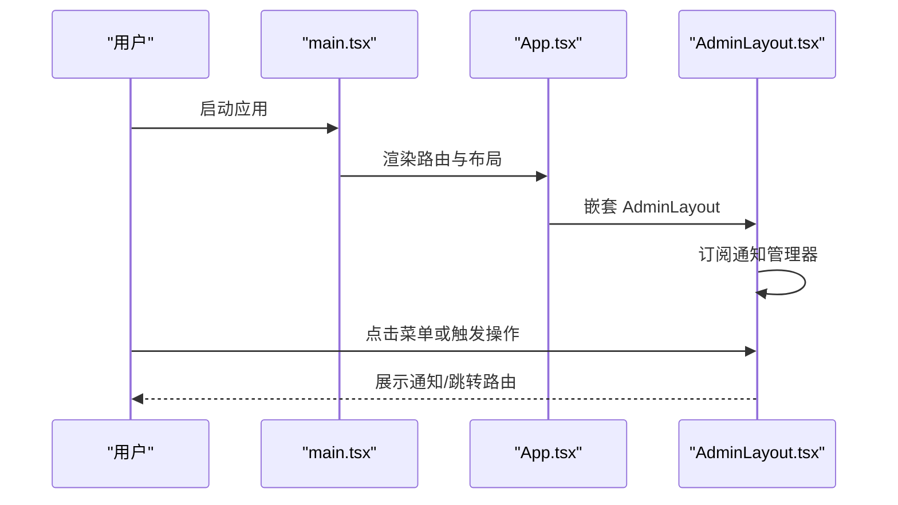
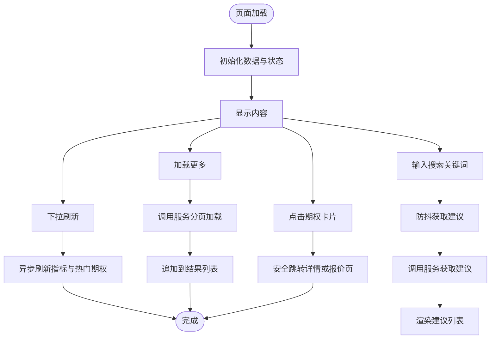
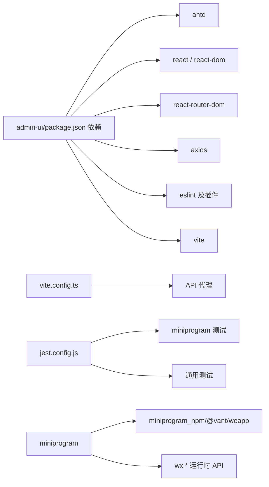

# 前端代码规范

<cite>
**本文引用的文件**
- [admin-ui/eslint.config.js](file://admin-ui/eslint.config.js)
- [admin-ui/package.json](file://admin-ui/package.json)
- [admin-ui/vite.config.ts](file://admin-ui/vite.config.ts)
- [admin-ui/src/App.tsx](file://admin-ui/src/App.tsx)
- [admin-ui/src/main.tsx](file://admin-ui/src/main.tsx)
- [admin-ui/src/components/AdminLayout.tsx](file://admin-ui/src/components/AdminLayout.tsx)
- [admin-ui/src/index.css](file://admin-ui/src/index.css)
- [miniprogram/.eslintrc.json](file://miniprogram/.eslintrc.json)
- [.eslintrc.json](file://.eslintrc.json)
- [miniprogram/app.json](file://miniprogram/app.json)
- [miniprogram/app.wxss](file://miniprogram/app.wxss)
- [miniprogram/pages/index/index.js](file://miniprogram/pages/index/index.js)
- [miniprogram/components/cards-list/cards-list.js](file://miniprogram/components/cards-list/cards-list.js)
- [jest.config.js](file://jest.config.js)
- [admin-ui/tsconfig.json](file://admin-ui/tsconfig.json)
</cite>

## 目录
1. [引言](#引言)
2. [项目结构](#项目结构)
3. [核心组件](#核心组件)
4. [架构总览](#架构总览)
5. [详细组件分析](#详细组件分析)
6. [依赖关系分析](#依赖关系分析)
7. [性能考虑](#性能考虑)
8. [故障排查指南](#故障排查指南)
9. [结论](#结论)
10. [附录](#附录)

## 引言
本规范文档面向 React 管理后台与微信小程序两类前端产物，统一制定 JavaScript/TypeScript 编码风格、组件开发规范、样式组织与主题定制、小程序页面与组件封装、代码组织与模块导入、可访问性与性能优化等要求。旨在提升团队协作效率、降低维护成本，并确保跨端一致性与可扩展性。

## 项目结构
仓库包含三类前端相关产物：
- React 管理后台（admin-ui）：基于 Vite + React 19 + TypeScript + Ant Design，采用路由嵌套布局与按需构建。
- 微信小程序（miniprogram）：基于原生小程序框架，使用 WXML/WXSS/JS 组织页面与组件，内置 ESLint 规则与主题变量。
- 公共测试与校验：Jest 配置覆盖小程序与通用测试场景。



图表来源
- [admin-ui/src/App.tsx](file://admin-ui/src/App.tsx#L1-L57)
- [admin-ui/src/main.tsx](file://admin-ui/src/main.tsx#L1-L14)
- [admin-ui/src/components/AdminLayout.tsx](file://admin-ui/src/components/AdminLayout.tsx#L1-L180)
- [admin-ui/eslint.config.js](file://admin-ui/eslint.config.js#L1-L24)
- [admin-ui/vite.config.ts](file://admin-ui/vite.config.ts#L1-L78)
- [admin-ui/tsconfig.json](file://admin-ui/tsconfig.json#L1-L8)
- [miniprogram/app.json](file://miniprogram/app.json#L1-L78)
- [miniprogram/app.wxss](file://miniprogram/app.wxss#L1-L140)
- [miniprogram/pages/index/index.js](file://miniprogram/pages/index/index.js#L1-L710)
- [miniprogram/components/cards-list/cards-list.js](file://miniprogram/components/cards-list/cards-list.js#L1-L16)
- [.eslintrc.json](file://.eslintrc.json#L1-L24)

章节来源
- [admin-ui/src/App.tsx](file://admin-ui/src/App.tsx#L1-L57)
- [admin-ui/src/main.tsx](file://admin-ui/src/main.tsx#L1-L14)
- [admin-ui/src/components/AdminLayout.tsx](file://admin-ui/src/components/AdminLayout.tsx#L1-L180)
- [admin-ui/eslint.config.js](file://admin-ui/eslint.config.js#L1-L24)
- [admin-ui/vite.config.ts](file://admin-ui/vite.config.ts#L1-L78)
- [admin-ui/tsconfig.json](file://admin-ui/tsconfig.json#L1-L8)
- [miniprogram/app.json](file://miniprogram/app.json#L1-L78)
- [miniprogram/app.wxss](file://miniprogram/app.wxss#L1-L140)
- [miniprogram/pages/index/index.js](file://miniprogram/pages/index/index.js#L1-L710)
- [miniprogram/components/cards-list/cards-list.js](file://miniprogram/components/cards-list/cards-list.js#L1-L16)
- [.eslintrc.json](file://.eslintrc.json#L1-L24)

## 核心组件
- React 应用入口与路由：通过 BrowserRouter 管理路由，AdminLayout 提供统一侧边栏与内容区，支持嵌套路由与权限守卫占位。
- 小程序应用配置：app.json 统一声明页面与 TabBar，app.wxss 定义主题变量与通用样式类。
- 小程序页面与组件：页面以 Page 构造函数组织数据与方法；组件通过 Component 构造函数定义属性与事件。

章节来源
- [admin-ui/src/App.tsx](file://admin-ui/src/App.tsx#L1-L57)
- [admin-ui/src/main.tsx](file://admin-ui/src/main.tsx#L1-L14)
- [admin-ui/src/components/AdminLayout.tsx](file://admin-ui/src/components/AdminLayout.tsx#L1-L180)
- [miniprogram/app.json](file://miniprogram/app.json#L1-L78)
- [miniprogram/app.wxss](file://miniprogram/app.wxss#L1-L140)
- [miniprogram/pages/index/index.js](file://miniprogram/pages/index/index.js#L1-L710)
- [miniprogram/components/cards-list/cards-list.js](file://miniprogram/components/cards-list/cards-list.js#L1-L16)

## 架构总览
React 管理后台通过 Vite 提供开发服务器与代理，支持本地与云端后端切换；小程序通过 app.json 统一页面与 Tab 配置，app.wxss 提供主题变量与通用样式。



图表来源
- [admin-ui/vite.config.ts](file://admin-ui/vite.config.ts#L1-L78)
- [miniprogram/app.json](file://miniprogram/app.json#L1-L78)
- [miniprogram/app.wxss](file://miniprogram/app.wxss#L1-L140)
- [miniprogram/pages/index/index.js](file://miniprogram/pages/index/index.js#L1-L710)
- [miniprogram/components/cards-list/cards-list.js](file://miniprogram/components/cards-list/cards-list.js#L1-L16)

## 详细组件分析

### React 应用与路由
- 应用入口：在 main.tsx 中以 AntdApp 包裹，启用 React StrictMode，保证开发阶段严格模式检查。
- 路由与布局：App.tsx 使用 BrowserRouter 与嵌套路由，AdminLayout 提供侧边菜单与内容区 Outlet。
- 权限与通知：AdminLayout 内部订阅通知管理器，统一展示通知；提供退出登录逻辑。



图表来源
- [admin-ui/src/main.tsx](file://admin-ui/src/main.tsx#L1-L14)
- [admin-ui/src/App.tsx](file://admin-ui/src/App.tsx#L1-L57)
- [admin-ui/src/components/AdminLayout.tsx](file://admin-ui/src/components/AdminLayout.tsx#L1-L180)

章节来源
- [admin-ui/src/main.tsx](file://admin-ui/src/main.tsx#L1-L14)
- [admin-ui/src/App.tsx](file://admin-ui/src/App.tsx#L1-L57)
- [admin-ui/src/components/AdminLayout.tsx](file://admin-ui/src/components/AdminLayout.tsx#L1-L180)

### 微信小程序页面与组件
- 页面逻辑：首页 index.js 使用 Page 构造函数，集中管理 data、生命周期、事件处理与业务方法；支持下拉刷新、搜索建议、分页加载等。
- 组件定义：cards-list 组件通过 Component 定义 properties 与 methods，向上触发 rowtap、togglefavorite、inquiry 事件，便于父页面接收处理。



图表来源
- [miniprogram/pages/index/index.js](file://miniprogram/pages/index/index.js#L1-L710)

章节来源
- [miniprogram/pages/index/index.js](file://miniprogram/pages/index/index.js#L1-L710)
- [miniprogram/components/cards-list/cards-list.js](file://miniprogram/components/cards-list/cards-list.js#L1-L16)

### 类与组件关系图（代码级）
```mermaid
classDiagram
class AdminLayout {
+collapsed : boolean
+menuItems : items[]
+handleLogout() : void
}
class App {
+routes : JSX.Element
}
class Main {
+render() : void
}
class CardsList {
+properties : list[], selectedSet{}, favoritesById{}, animatingFavoriteId, disableFavoriteActions, isEditing
+methods : onRowTap(), onToggleFavorite(), onInquiry()
}
App --> AdminLayout : "嵌套"
Main --> App : "渲染"
AdminLayout --> App : "导航"
CardsList --> App : "事件冒泡"
```

图表来源
- [admin-ui/src/components/AdminLayout.tsx](file://admin-ui/src/components/AdminLayout.tsx#L1-L180)
- [admin-ui/src/App.tsx](file://admin-ui/src/App.tsx#L1-L57)
- [admin-ui/src/main.tsx](file://admin-ui/src/main.tsx#L1-L14)
- [miniprogram/components/cards-list/cards-list.js](file://miniprogram/components/cards-list/cards-list.js#L1-L16)

## 依赖关系分析
- React 管理后台依赖：Ant Design、React、React Router、Axios、ESLint 插件与 Vite。
- 小程序依赖：Vant Weapp 字体资源、小程序运行时 API（如 wx 对象）。
- 代理与测试：Vite 提供 API 代理与测试环境配置；Jest 配置覆盖小程序与通用测试目录。



图表来源
- [admin-ui/package.json](file://admin-ui/package.json#L1-L38)
- [admin-ui/vite.config.ts](file://admin-ui/vite.config.ts#L1-L78)
- [jest.config.js](file://jest.config.js#L1-L10)
- [miniprogram/app.json](file://miniprogram/app.json#L1-L78)

章节来源
- [admin-ui/package.json](file://admin-ui/package.json#L1-L38)
- [admin-ui/vite.config.ts](file://admin-ui/vite.config.ts#L1-L78)
- [jest.config.js](file://jest.config.js#L1-L10)
- [miniprogram/app.json](file://miniprogram/app.json#L1-L78)

## 性能考虑
- React 管理后台
  - 使用 React 19 与 Strict Mode，减少无效渲染与内存泄漏风险。
  - Vite 代理超时与错误处理，避免阻塞前端开发体验。
  - Ant Design 的按需加载与主题变量，减少打包体积与样式冲突。
- 小程序
  - 使用 app.wxss 主题变量与通用样式类，统一视觉与减少重复样式。
  - 页面内使用 Promise.all 并行加载数据，减少首屏等待时间。
  - 防抖与分页加载策略，降低频繁请求与渲染压力。

章节来源
- [admin-ui/src/main.tsx](file://admin-ui/src/main.tsx#L1-L14)
- [admin-ui/vite.config.ts](file://admin-ui/vite.config.ts#L1-L78)
- [admin-ui/src/index.css](file://admin-ui/src/index.css#L1-L25)
- [miniprogram/app.wxss](file://miniprogram/app.wxss#L1-L140)
- [miniprogram/pages/index/index.js](file://miniprogram/pages/index/index.js#L292-L323)

## 故障排查指南
- API 代理失败
  - 现象：开发环境下代理错误返回，提示后端未启动。
  - 排查：确认 Vite 代理目标与后端服务端口配置，检查网络连通性。
- 小程序页面跳转异常
  - 现象：非 tabBar 页面参数丢失或 tabBar 页面无法传参。
  - 排查：确认 safeNavigate 中对 tabBar 页面的特殊处理与参数序列化。
- ESLint 规则不生效
  - 现象：TypeScript 或小程序 JS 规则未被识别。
  - 排查：核对 ESLint 配置文件路径与规则继承，确保编辑器正确加载配置。

章节来源
- [admin-ui/vite.config.ts](file://admin-ui/vite.config.ts#L21-L59)
- [miniprogram/pages/index/index.js](file://miniprogram/pages/index/index.js#L225-L265)
- [admin-ui/eslint.config.js](file://admin-ui/eslint.config.js#L1-L24)
- [miniprogram/.eslintrc.json](file://miniprogram/.eslintrc.json#L1-L15)
- [.eslintrc.json](file://.eslintrc.json#L1-L24)

## 结论
本规范文档从编码风格、组件结构、样式体系、小程序页面与组件、依赖与代理、测试与质量保障等方面提供了统一标准。建议团队在日常开发中严格遵循，持续迭代以适配业务演进与技术升级。

## 附录

### JavaScript/TypeScript 编码规范（摘要）
- ESLint 配置
  - React 管理后台：使用 flat 配置与推荐规则，启用 hooks 与 react-refresh 支持。
  - 小程序：启用 es6/browser/node 环境，推荐规则与变量/未定义/相等比较/大括号/常量声明等规则。
  - 顶层项目：为小程序运行时 API（如 wx/App/Page/getApp）设置只读全局。
- 代码格式化与类型检查
  - 使用 TypeScript 与 tsconfig 多引用配置，确保编译与类型安全。
  - Vite 提供开发与构建脚本，配合 lint 脚本进行静态检查。
- 变量命名与函数设计
  - 避免未使用变量与未定义引用，优先使用常量声明，保持函数单一职责。

章节来源
- [admin-ui/eslint.config.js](file://admin-ui/eslint.config.js#L1-L24)
- [admin-ui/package.json](file://admin-ui/package.json#L1-L38)
- [admin-ui/tsconfig.json](file://admin-ui/tsconfig.json#L1-L8)
- [miniprogram/.eslintrc.json](file://miniprogram/.eslintrc.json#L1-L15)
- [.eslintrc.json](file://.eslintrc.json#L1-L24)

### React 组件开发规范（摘要）
- 组件结构
  - 使用函数组件与 Hooks，分离关注点，避免复杂类组件。
  - 布局组件 AdminLayout 提供统一侧边栏与内容区，支持折叠与主题。
- Props 类型定义
  - 使用 TypeScript 明确 props 类型，组件内部属性与事件回调保持一致的类型约束。
- 状态管理模式
  - 页面内状态集中于 data，业务逻辑拆分为独立方法；必要时引入外部状态管理库。
- 生命周期使用
  - 使用 useEffect 管理副作用，注意清理函数与依赖数组，避免重复订阅。

章节来源
- [admin-ui/src/components/AdminLayout.tsx](file://admin-ui/src/components/AdminLayout.tsx#L1-L180)
- [admin-ui/src/App.tsx](file://admin-ui/src/App.tsx#L1-L57)

### CSS/SCSS 样式编写规范（摘要）
- 主题变量与通用样式
  - 小程序：在 app.wxss 中定义主题变量与通用样式类，页面复用统一变量。
  - React：在 index.css 中设置根字体与基础布局，结合 Ant Design 主题定制。
- 样式组织结构
  - 页面样式与组件样式分离，避免全局污染；使用语义化类名，减少选择器层级。
- 响应式设计与主题定制
  - 使用 rpx（小程序）与 rem/em（Web）适配多端；通过 CSS 变量实现主题切换。

章节来源
- [miniprogram/app.wxss](file://miniprogram/app.wxss#L1-L140)
- [admin-ui/src/index.css](file://admin-ui/src/index.css#L1-L25)

### 小程序开发规范（摘要）
- 页面结构
  - 在 app.json 中统一声明页面与 TabBar，确保导航一致性。
- 组件封装
  - 组件通过 properties 接收数据，通过 triggerEvent 向父组件传递事件。
- 数据绑定与云开发集成
  - 页面通过服务模块获取数据，结合工具模块进行格式化与性能监控；云开发相关能力在服务层抽象，页面仅负责调用与展示。

章节来源
- [miniprogram/app.json](file://miniprogram/app.json#L1-L78)
- [miniprogram/components/cards-list/cards-list.js](file://miniprogram/components/cards-list/cards-list.js#L1-L16)
- [miniprogram/pages/index/index.js](file://miniprogram/pages/index/index.js#L1-L710)

### 代码组织规范（摘要）
- 文件命名与目录结构
  - React：页面与组件按功能划分目录，入口文件清晰标识。
  - 小程序：页面与组件按功能域组织，公共资源集中存放。
- 模块导入与依赖管理
  - 使用相对路径导入，避免循环依赖；第三方库在 package.json 中统一管理。
- 代理与测试
  - Vite 提供 API 代理与测试环境；Jest 配置覆盖小程序与通用测试目录。

章节来源
- [admin-ui/vite.config.ts](file://admin-ui/vite.config.ts#L1-L78)
- [jest.config.js](file://jest.config.js#L1-L10)
- [admin-ui/package.json](file://admin-ui/package.json#L1-L38)

### 可访问性规范与性能优化建议（摘要）
- 可访问性
  - 为交互元素提供明确的标签与键盘可达性；避免仅依赖颜色传达信息。
- 性能
  - 并行加载与分页策略；合理使用缓存与防抖；减少不必要的重渲染与样式回流。

章节来源
- [miniprogram/pages/index/index.js](file://miniprogram/pages/index/index.js#L292-L323)
- [admin-ui/vite.config.ts](file://admin-ui/vite.config.ts#L1-L78)