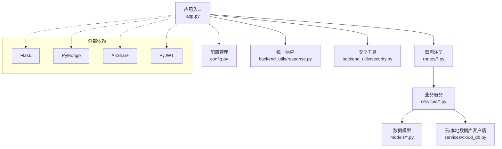
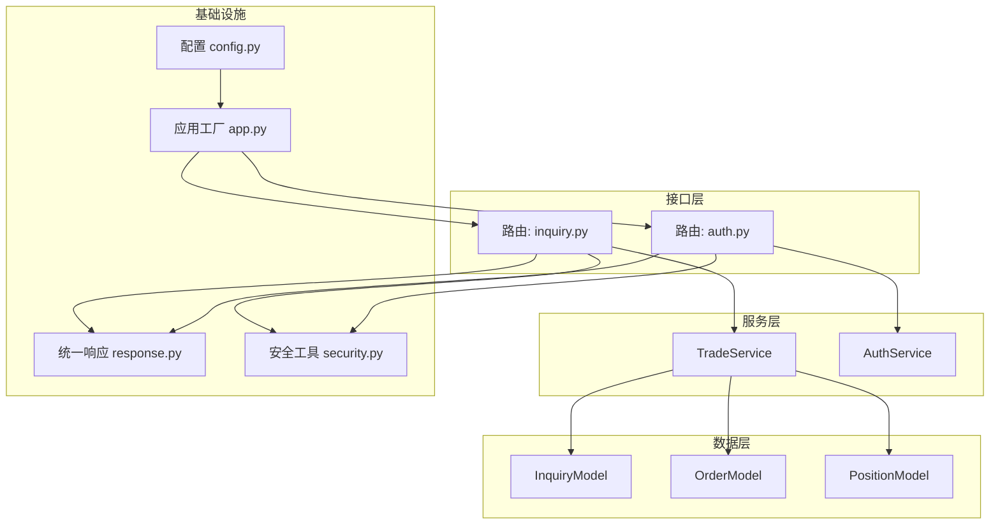
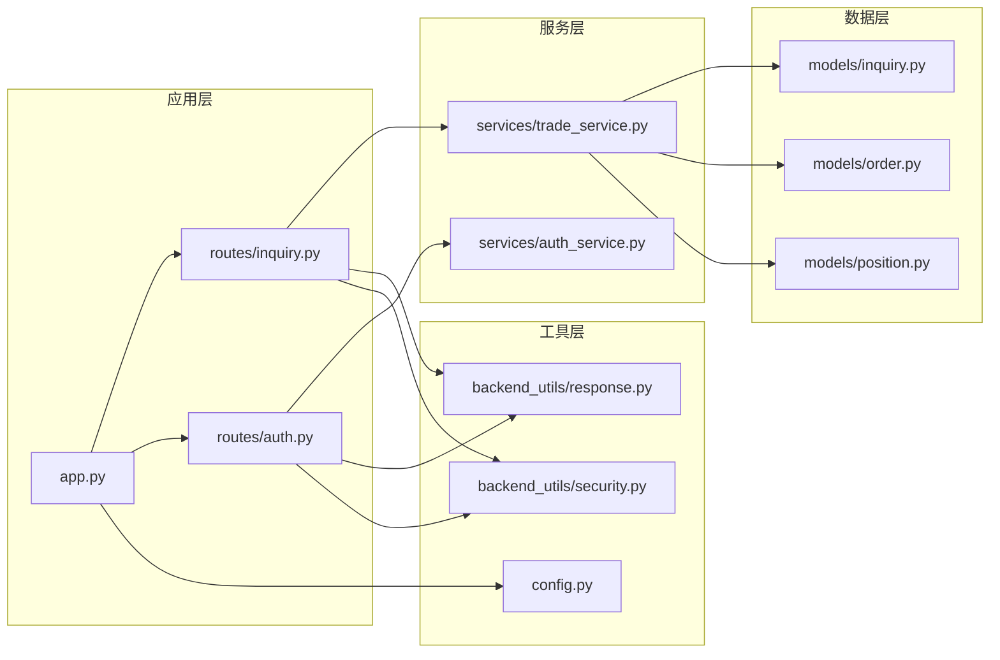

# 后端代码规范

<cite>
**本文引用的文件**
- [app.py](file://app.py)
- [config.py](file://config.py)
- [response.py](file://response.py)
- [requirements.txt](file://requirements.txt)
- [README.md](file://README.md)
- [routes/__init__.py](file://routes/__init__.py)
- [routes/inquiry.py](file://routes/inquiry.py)
- [routes/auth.py](file://routes/auth.py)
- [services/__init__.py](file://services/__init__.py)
- [services/trade_service.py](file://services/trade_service.py)
- [models/__init__.py](file://models/__init__.py)
- [models/inquiry.py](file://models/inquiry.py)
- [backend_utils/security.py](file://backend_utils/security.py)
- [.env.example](file://.env.example)
</cite>

## 目录
1. [简介](#简介)
2. [项目结构](#项目结构)
3. [核心组件](#核心组件)
4. [架构总览](#架构总览)
5. [组件详解](#组件详解)
6. [依赖关系分析](#依赖关系分析)
7. [性能考量](#性能考量)
8. [故障排查指南](#故障排查指南)
9. [结论](#结论)
10. [附录](#附录)

## 简介
本规范面向基于 Flask 的后端开发，聚焦于代码风格、Flask 架构组织、数据模型设计、错误处理、业务封装、日志与安全、性能优化等最佳实践。文档结合仓库现有实现进行提炼，并给出可落地的规范与建议。

## 项目结构
项目采用“蓝图+服务层+模型层”的分层组织方式，配合统一响应与安全工具，形成清晰的职责边界与扩展性。

图表来源
- [app.py](file://app.py#L103-L276)
- [routes/inquiry.py](file://routes/inquiry.py#L1-L175)
- [routes/auth.py](file://routes/auth.py#L1-L200)
- [services/trade_service.py](file://services/trade_service.py#L1-L200)
- [models/inquiry.py](file://models/inquiry.py#L1-L148)
- [backend_utils/security.py](file://backend_utils/security.py#L1-L117)

章节来源
- [app.py](file://app.py#L103-L276)
- [routes/__init__.py](file://routes/__init__.py#L1-L1)
- [services/__init__.py](file://services/__init__.py#L1-L1)
- [models/__init__.py](file://models/__init__.py#L1-L1)

## 核心组件
- 应用工厂与启动：集中初始化 CORS、蓝图、数据库与云数据库客户端、日志、调度器等。
- 统一响应：提供成功/错误/分页三类响应，统一结构与时间戳。
- 安全工具：鉴权装饰器、角色校验、审计日志、简单限流。
- 服务层：TradeService 聚合业务逻辑，按领域拆分模型，解耦路由与数据访问。
- 数据模型：InquiryModel 等封装集合操作，兼容云数据库与本地 MongoDB。

章节来源
- [app.py](file://app.py#L103-L276)
- [response.py](file://response.py#L1-L78)
- [backend_utils/security.py](file://backend_utils/security.py#L1-L117)
- [services/trade_service.py](file://services/trade_service.py#L1-L200)
- [models/inquiry.py](file://models/inquiry.py#L1-L148)

## 架构总览
Flask 应用通过蓝图划分功能域，服务层承担业务编排，模型层抽象数据访问，响应与安全工具贯穿各层。

图表来源
- [routes/inquiry.py](file://routes/inquiry.py#L1-L175)
- [routes/auth.py](file://routes/auth.py#L1-L200)
- [services/trade_service.py](file://services/trade_service.py#L1-L200)
- [models/inquiry.py](file://models/inquiry.py#L1-L148)
- [response.py](file://response.py#L1-L78)
- [backend_utils/security.py](file://backend_utils/security.py#L1-L117)
- [config.py](file://config.py#L1-L132)
- [app.py](file://app.py#L103-L276)

## 组件详解

### Python 代码风格规范
- 编码与头部
  - 文件统一使用 UTF-8 编码；在文件开头声明编码注释。
  - 顶层模块与包遵循清晰的导入顺序：标准库、第三方库、项目内模块。
- 命名约定
  - 模块与包：小写、下划线分隔（如 routes、services、models）。
  - 类：大驼峰（CamelCase，如 TradeService、InquiryModel）。
  - 函数与方法：小驼峰（如 create_inquiry、get_inquiries）。
  - 常量：全大写加下划线（如 SECRET_KEY、DATABASE_NAME）。
  - 私有成员：前缀下划线（如 _get_inquiry_model）。
- 缩进与空行
  - 统一使用 4 空格缩进；类与函数之间空两行；模块内函数/类之间空一行。
- 注释与文档字符串
  - 模块顶部添加简要说明；复杂函数/类提供 docstring；行内注释简洁明确。
- 导入组织
  - 分组导入：标准库、第三方、项目内；每组内字母序排列；组间空行分隔。
- 行宽与换行
  - 单行不超过 88 字符；必要时使用括号断行；二元运算符前后留空格。
- 异常与返回
  - 明确异常类型与错误码；函数应有明确返回类型提示与默认值处理。

章节来源
- [app.py](file://app.py#L1-L350)
- [config.py](file://config.py#L1-L132)
- [routes/inquiry.py](file://routes/inquiry.py#L1-L175)
- [routes/auth.py](file://routes/auth.py#L1-L200)
- [services/trade_service.py](file://services/trade_service.py#L1-L200)
- [models/inquiry.py](file://models/inquiry.py#L1-L148)
- [backend_utils/security.py](file://backend_utils/security.py#L1-L117)

### Flask 应用架构规范
- 蓝图组织
  - 按功能域划分蓝图（如 inquiry、auth、admin、trade 等），统一在应用工厂中注册。
  - 路由前缀清晰且一致，便于版本化与扩展。
- 路由设计
  - REST 风格命名与动词使用：POST 提交、GET 查询、PUT 更新、DELETE 删除。
  - 参数传递：查询参数用于过滤与分页；请求体用于创建/更新。
  - 静态资源与 SPA 回退：根路径回退至 index.html，避免 API 路径误入静态资源。
- 请求处理与响应格式
  - 统一使用统一响应工具输出，保证 code、success、message、data、timestamp 结构一致。
  - 分页响应包含 total、page、pageSize、totalPages。
- 错误处理
  - 404/500 与通用异常分别处理，生产环境隐藏具体错误堆栈，仅返回通用提示。

章节来源
- [app.py](file://app.py#L183-L276)
- [routes/inquiry.py](file://routes/inquiry.py#L1-L175)
- [routes/auth.py](file://routes/auth.py#L1-L200)
- [response.py](file://response.py#L1-L78)

### 数据模型设计原则
- 文档结构
  - 采用嵌套对象与数组表达复杂业务实体；统一字段命名风格（如 camelCase）。
  - 时间字段统一存储为 ISO 字符串或 BSON 时间类型，序列化时转换为 ISO。
- 字段命名
  - 业务相关字段语义明确，避免缩写；用户标识使用 openid 或自定义唯一键。
- 索引策略
  - 对高频查询字段建立索引（如 createdAt、status、phone），减少聚合与全表扫描。
- 数据验证
  - 路由层进行基础参数校验；服务层补充业务规则校验；模型层确保持久化一致性。
- 多数据源兼容
  - 模型层对云数据库与本地 MongoDB 的差异进行封装，屏蔽上层差异。

章节来源
- [models/inquiry.py](file://models/inquiry.py#L1-L148)
- [services/trade_service.py](file://services/trade_service.py#L1-L200)
- [app.py](file://app.py#L16-L22)

### 错误处理规范
- 统一异常处理模式
  - 使用应用工厂注册全局错误处理器，捕获 404、500 与通用异常。
  - 生产环境返回通用错误信息，开发环境可返回详细信息以便调试。
- 错误响应结构
  - 使用统一响应工具输出错误，包含 code、success、message、data、timestamp。
- 日志记录
  - 记录请求/响应状态、异常堆栈与关键业务事件，便于追踪与审计。

章节来源
- [app.py](file://app.py#L252-L274)
- [response.py](file://response.py#L27-L45)

### 业务逻辑封装规范
- 服务层设计原则
  - 以领域模型为中心，封装 CRUD 与组合查询；对外暴露清晰的方法签名。
  - 通过依赖注入（在构造函数中传入 db/cloud 客户端）实现可替换的数据源。
- 依赖注入模式
  - 服务类在初始化时接收 db/cloud 客户端，路由层仅负责参数解析与调用服务。
  - 通过工厂方法（如 _get_inquiry_model）延迟导入模型，降低耦合。

章节来源
- [services/trade_service.py](file://services/trade_service.py#L1-L200)
- [models/inquiry.py](file://models/inquiry.py#L1-L148)

### 日志记录规范
- 日志级别与输出
  - 开发环境输出到控制台与文件；生产环境使用轮转文件处理器，限制单文件大小与备份数。
- 日志内容
  - 记录请求方法、URL、用户 ID、响应状态；异常时记录堆栈。
- 审计日志
  - 关键操作使用审计装饰器记录用户、IP、动作与结果。

章节来源
- [config.py](file://config.py#L73-L93)
- [app.py](file://app.py#L24-L35)
- [app.py](file://app.py#L211-L220)
- [backend_utils/security.py](file://backend_utils/security.py#L87-L117)

### 安全编码实践
- 鉴权与授权
  - 使用 Bearer Token 进行鉴权；装饰器解析 JWT 并注入 g.admin；支持角色校验。
- 限流与锁
  - 提供简单限流装饰器；记录登录失败次数并锁定账户一段时间。
- 审计日志
  - 对登录、用户管理等关键操作记录审计日志，便于追踪。
- 环境变量与密钥
  - 生产环境必须设置强随机密钥；敏感信息通过环境变量注入。

章节来源
- [routes/auth.py](file://routes/auth.py#L33-L72)
- [routes/auth.py](file://routes/auth.py#L74-L96)
- [backend_utils/security.py](file://backend_utils/security.py#L17-L45)
- [backend_utils/security.py](file://backend_utils/security.py#L47-L86)
- [.env.example](file://.env.example#L13-L17)

### 性能优化建议
- 数据库连接与重试
  - 启动阶段设置较短超时，失败时降级为无数据库模式；提供按需重建连接的 ensure_db。
- 定时任务与交易时间
  - 后台定时同步仅在交易时间内执行，避免非工作时段开销。
- 响应序列化
  - 自定义 JSON 提供者，将 ObjectId 与 datetime 正确序列化，避免额外转换开销。
- 跨域与缓存
  - 合理配置 CORS 与缓存头，减少重复请求与预检开销。

章节来源
- [app.py](file://app.py#L69-L88)
- [app.py](file://app.py#L279-L330)
- [app.py](file://app.py#L16-L22)
- [app.py](file://app.py#L168-L181)

## 依赖关系分析

图表来源
- [app.py](file://app.py#L103-L276)
- [routes/inquiry.py](file://routes/inquiry.py#L1-L175)
- [routes/auth.py](file://routes/auth.py#L1-L200)
- [services/trade_service.py](file://services/trade_service.py#L1-L200)
- [models/inquiry.py](file://models/inquiry.py#L1-L148)
- [response.py](file://response.py#L1-L78)
- [backend_utils/security.py](file://backend_utils/security.py#L1-L117)
- [config.py](file://config.py#L1-L132)

章节来源
- [requirements.txt](file://requirements.txt#L1-L12)
- [README.md](file://README.md#L1-L90)

## 性能考量
- 启动与连接
  - 启动时短超时连接数据库，失败快速降级；按需重建连接，避免阻塞。
- 同步策略
  - 仅在交易时间段执行行情同步，降低非活跃时段负载。
- 序列化与传输
  - 自定义 JSON 提供者减少类型转换成本；统一响应结构利于前端解析。
- 资源与静态
  - 根路径回退到 SPA 入口，避免静态资源误判；合理配置缓存与跨域。

章节来源
- [app.py](file://app.py#L69-L88)
- [app.py](file://app.py#L279-L330)
- [app.py](file://app.py#L16-L22)
- [app.py](file://app.py#L226-L250)

## 故障排查指南
- 健康检查
  - 访问健康端点确认服务与数据库状态；查看日志定位异常。
- 数据库连接
  - 检查 MONGO_URI 与 DATABASE_NAME；确认网络连通与认证配置。
- 云数据库
  - 校验 WX_APPID/WX_SECRET/WX_CLOUD_ENV；查看初始化日志与测试查询结果。
- 鉴权失败
  - 检查 Authorization 头、JWT 密钥与算法；确认 token 未过期。
- 错误响应
  - 查看统一错误响应结构与日志堆栈；生产环境关注 500 错误并记录堆栈。

章节来源
- [app.py](file://app.py#L185-L197)
- [app.py](file://app.py#L121-L152)
- [routes/auth.py](file://routes/auth.py#L33-L54)
- [app.py](file://app.py#L252-L274)

## 结论
本规范总结了项目在 Flask 架构、服务与模型封装、统一响应与安全、日志与性能等方面的最佳实践。建议在后续迭代中持续完善：
- 引入更严格的类型注解与 mypy/linter；
- 增加单元测试与集成测试覆盖；
- 逐步引入异步任务与消息队列；
- 完善 API 文档与契约校验。

## 附录

### API 路由与响应示例（路径参考）
- 询价相关
  - 提交询价：POST /api/v1/inquiry
  - 获取列表（管理后台）：GET /api/v1/admin/inquiries
  - 更新状态（管理后台）：PUT /api/v1/admin/inquiries/<id>/status
  - 批量更新（管理后台）：POST /api/v1/admin/inquiries/batch-update
  - 导出（管理后台）：GET /api/v1/admin/inquiries/export
- 鉴权相关
  - 登录：POST /api/v1/auth/login
  - 当前用户：GET /api/v1/auth/me
  - 用户管理（管理员）：GET/POST/DELETE /api/v1/auth/users

章节来源
- [routes/inquiry.py](file://routes/inquiry.py#L11-L175)
- [routes/auth.py](file://routes/auth.py#L74-L186)

### 配置项一览（节选）
- 应用与安全
  - NODE_ENV、FLASK_PORT、JWT_SECRET、JWT_ALGORITHM、JWT_EXPIRES_SECONDS
- 数据源
  - MONGO_URI、DATABASE_NAME、WX_CLOUD_ENV、WX_APPID、WX_SECRET
- 日志与跨域
  - LOG_LEVEL、LOG_FILE、ALLOWED_ORIGINS

章节来源
- [.env.example](file://.env.example#L5-L50)
- [config.py](file://config.py#L32-L62)