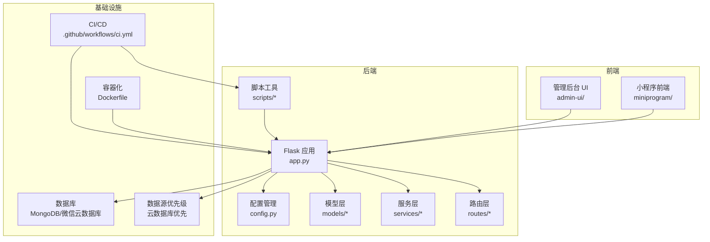
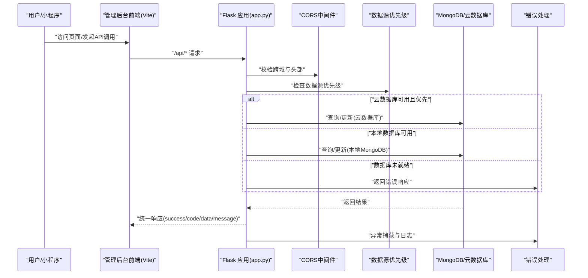
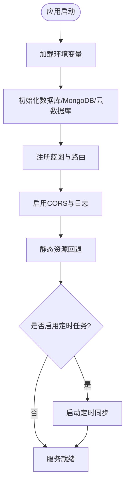
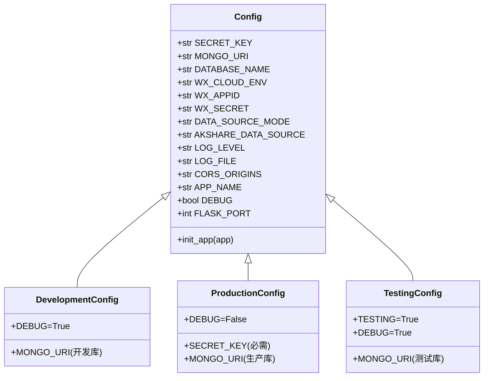
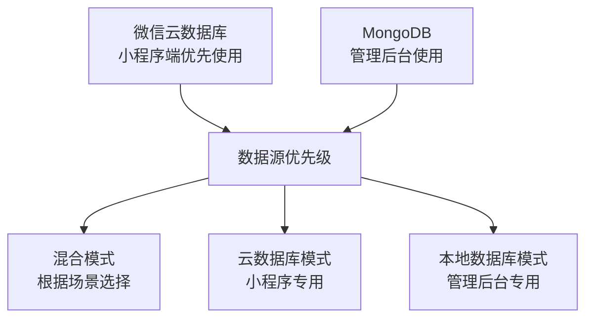
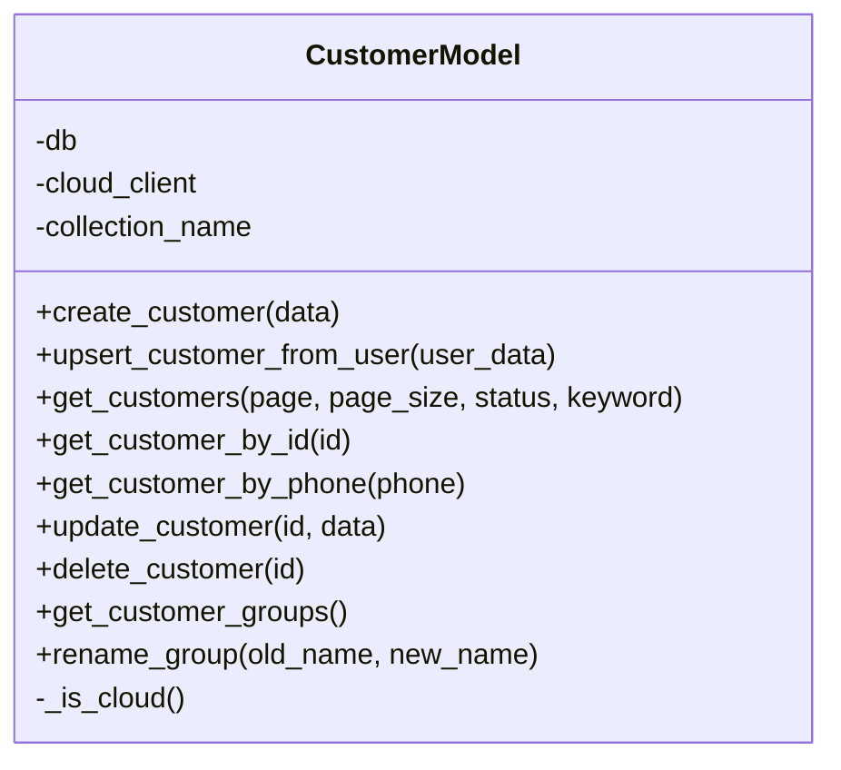
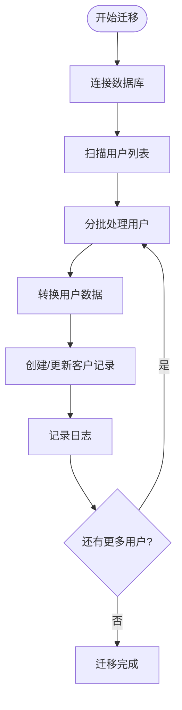
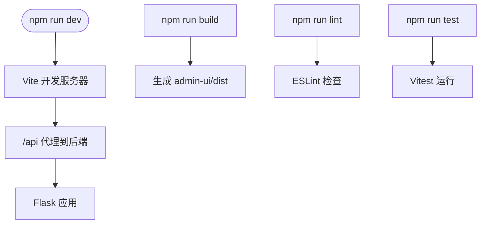
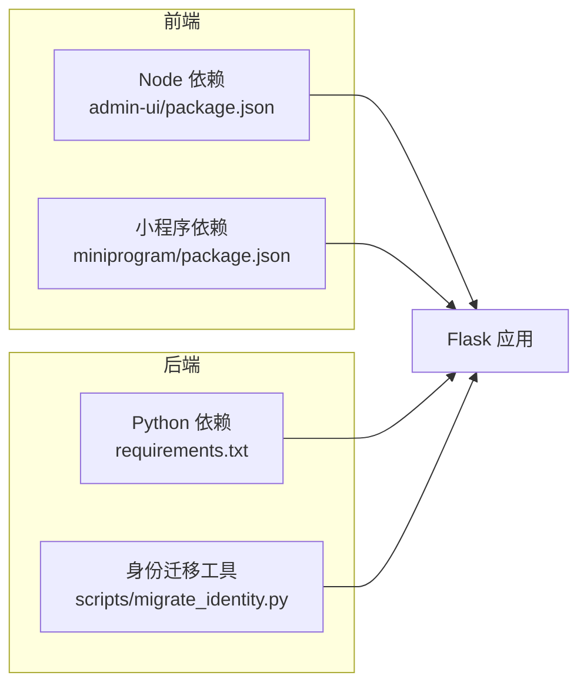

# 开发指南

<cite>
**本文引用的文件**
- [README.md](file://README.md)
- [package.json](file://package.json)
- [CONTRIBUTING.md](file://CONTRIBUTING.md)
- [.github/workflows/ci.yml](file://.github/workflows/ci.yml)
- [admin-ui/package.json](file://admin-ui/package.json)
- [miniprogram/package.json](file://miniprogram/package.json)
- [requirements.txt](file://requirements.txt)
- [Dockerfile](file://Dockerfile)
- [.eslintrc.json](file://.eslintrc.json)
- [jest.config.js](file://jest.config.js)
- [admin-ui/eslint.config.js](file://admin-ui/eslint.config.js)
- [admin-ui/vite.config.ts](file://admin-ui/vite.config.ts)
- [miniprogram/.eslintrc.json](file://miniprogram/.eslintrc.json)
- [app.py](file://app.py)
- [config.py](file://config.py)
- [models/customer.py](file://models/customer.py)
- [models/user.py](file://models/user.py)
- [services/auth_service.py](file://services/auth_service.py)
- [services/cloud_db.py](file://services/cloud_db.py)
- [scripts/migrate_identity.py](file://scripts/migrate_identity.py)
- [export_data_to_cloud.py](file://export_data_to_cloud.py)
</cite>

## 目录
1. [简介](#简介)
2. [项目结构](#项目结构)
3. [核心组件](#核心组件)
4. [架构总览](#架构总览)
5. [详细组件分析](#详细组件分析)
6. [依赖关系分析](#依赖关系分析)
7. [性能考虑](#性能考虑)
8. [故障排查指南](#故障排查指南)
9. [结论](#结论)
10. [附录](#附录)

## 简介
本开发指南面向参与"场外期权"项目的开发者，提供从环境搭建、代码规范、Git 工作流、模块划分、测试策略、代码审查、质量保证、CI 配置、调试与性能分析，到开发工具与 IDE 设置、团队协作与知识分享的全流程实践说明。文档内容均基于仓库现有配置与实现进行提炼总结，帮助新成员快速上手并维持高质量交付。

**更新** 本版本新增了数据源优先级架构说明和身份迁移工具的使用指南。

## 项目结构
该项目采用多语言混合架构，包含：
- 后端服务（Python Flask + MongoDB/微信云数据库）
- 管理后台前端（React + Vite + TypeScript）
- 微信小程序前端（基于原生小程序框架）
- 持续集成（GitHub Actions）
- Docker 容器化部署
- 单元测试与端到端测试配置
- **新增** 数据源优先级架构和身份迁移工具



**图表来源**
- [app.py](file://app.py#L104-L284)
- [config.py](file://config.py#L6-L12)
- [.github/workflows/ci.yml](file://.github/workflows/ci.yml#L1-L35)
- [Dockerfile](file://Dockerfile#L1-L48)
- [scripts/migrate_identity.py](file://scripts/migrate_identity.py#L1-L102)

**章节来源**
- [README.md](file://README.md#L5-L14)
- [package.json](file://package.json#L1-L50)
- [admin-ui/package.json](file://admin-ui/package.json#L1-L38)
- [miniprogram/package.json](file://miniprogram/package.json#L1-L15)

## 核心组件
- Flask 应用与蓝图路由：统一健康检查、CORS、日志、错误处理、静态资源回退与后台任务调度。
- 配置管理：基于类的环境配置（开发/生产/测试），支持多种数据源模式与日志轮转。
- **增强** 数据源优先级架构：明确微信云数据库优先的架构设计，支持混合模式操作。
- 模型层：以 CustomerModel 为例，抽象云数据库与本地数据库的差异，提供统一的 CRUD 与聚合能力。
- 前端工程：管理后台使用 React + Vite + TS，小程序使用原生框架；分别配置 ESLint、TypeScript、测试与构建脚本。
- CI/CD：GitHub Actions 分别对前端与后端执行 Lint、Test、Build。
- 容器化：Docker 多阶段构建，前端产物与后端合并，使用 gunicorn 提供服务。
- **新增** 身份迁移工具：提供用户到客户的身份映射和同步功能。

**章节来源**
- [app.py](file://app.py#L104-L284)
- [config.py](file://config.py#L6-L12)
- [models/customer.py](file://models/customer.py#L1-L300)
- [admin-ui/package.json](file://admin-ui/package.json#L1-L38)
- [miniprogram/package.json](file://miniprogram/package.json#L1-L15)
- [.github/workflows/ci.yml](file://.github/workflows/ci.yml#L1-L35)
- [Dockerfile](file://Dockerfile#L1-L48)
- [scripts/migrate_identity.py](file://scripts/migrate_identity.py#L1-L102)

## 架构总览
下图展示从浏览器/小程序到后端 Flask 的典型请求链路，包括代理、CORS、数据库与云数据库的选择、以及错误处理。



**图表来源**
- [app.py](file://app.py#L171-L182)
- [config.py](file://config.py#L27-L30)
- [services/cloud_db.py](file://services/cloud_db.py#L163-L207)

## 详细组件分析

### Flask 应用与路由
- 统一 JSON 序列化：自定义 JSON 提供者，处理 ObjectId 与 datetime。
- 环境变量加载：优先级与容错处理，支持 .env.local、.env.production、.env。
- 数据库初始化：MongoDB 连接与云数据库客户端初始化，失败降级为无数据库模式。
- 蓝图注册：认证、询价、股票、管理员、交易、消息、配置等模块。
- 静态资源回退：React SPA 路由回退至 index.html。
- 错误处理：404/500 与通用异常捕获，生产环境隐藏堆栈细节。
- 后台任务：定时同步行情，仅在交易时间执行，受环境变量控制。



**图表来源**
- [app.py](file://app.py#L37-L101)
- [app.py](file://app.py#L104-L284)

**章节来源**
- [app.py](file://app.py#L16-L35)
- [app.py](file://app.py#L37-L101)
- [app.py](file://app.py#L104-L284)

### 配置管理
- 基础配置类：集中管理密钥、数据库、日志、CORS、应用参数。
- 环境配置：开发/生产/测试三套配置，生产必须设置 SECRET_KEY。
- 日志轮转：生产环境自动轮转与文件落盘。
- **增强** 数据源优先级：明确微信云数据库优先的架构设计，支持 'cloud'、'local'、'hybrid' 模式。
- **新增** 数据源架构说明：详细描述微信云数据库、MongoDB、数据同步的工作原理。



**图表来源**
- [config.py](file://config.py#L22-L132)

**章节来源**
- [config.py](file://config.py#L6-L12)
- [config.py](file://config.py#L22-L132)

### 数据源优先级架构
**新增** 项目采用了明确的数据源优先级架构设计：

- **微信云数据库优先**：小程序端直接读取，用于 quotes、inquiries、groups 等集合
- **MongoDB 作为管理后台**：用于数据管理后台、数据处理和复杂查询  
- **数据同步机制**：通过 export_data_to_cloud.py 定期将 MongoDB 数据同步到云数据库



**图表来源**
- [config.py](file://config.py#L6-L12)
- [config.py](file://config.py#L45-L46)

**章节来源**
- [config.py](file://config.py#L6-L12)
- [config.py](file://config.py#L45-L46)

### 模型层示例：CustomerModel
- 统一接口：创建、查询、更新、删除、分组名聚合与重命名。
- 云/本地适配：通过 _is_cloud 判断，分别调用云数据库或本地集合。
- 查询差异：云数据库使用 JS 表达式与正则，本地使用 MongoDB 原生语法。
- 时间字段处理：云数据库返回 ISO 字符串，本地返回 datetime 对象。



**图表来源**
- [models/customer.py](file://models/customer.py#L10-L300)

**章节来源**
- [models/customer.py](file://models/customer.py#L10-L300)

### 身份迁移工具
**新增** `scripts/migrate_identity.py` 提供了完整的用户身份迁移功能：

- **用户到客户映射**：遍历所有用户，确保对应的客户记录存在
- **批量处理**：支持分页批量迁移，避免一次性处理大量数据
- **ID 格式修复**：自动修复 ObjectId 格式问题
- **错误处理**：详细的日志记录和错误统计
- **云/本地兼容**：支持云数据库和本地 MongoDB 的迁移



**图表来源**
- [scripts/migrate_identity.py](file://scripts/migrate_identity.py#L46-L98)

**章节来源**
- [scripts/migrate_identity.py](file://scripts/migrate_identity.py#L1-L102)

### 管理后台前端（React/Vite/TS）
- 脚本：dev/build/lint/test/preview。
- 代理：Vite 代理到本地 Flask 或云端目标，开发时提供明确错误提示。
- ESLint：Flat 配置，推荐规则集，支持 React Hooks 与 React Refresh。
- 测试：Vitest + jsdom。



**图表来源**
- [admin-ui/package.json](file://admin-ui/package.json#L6-L12)
- [admin-ui/vite.config.ts](file://admin-ui/vite.config.ts#L21-L59)
- [admin-ui/eslint.config.js](file://admin-ui/eslint.config.js#L8-L23)

**章节来源**
- [admin-ui/package.json](file://admin-ui/package.json#L1-L38)
- [admin-ui/vite.config.ts](file://admin-ui/vite.config.ts#L1-L78)
- [admin-ui/eslint.config.js](file://admin-ui/eslint.config.js#L1-L24)

### 小程序前端
- 依赖：@vant/weapp。
- 测试：Jest，通过根目录 jest.config.js 驱动。
- ESLint：基础规则，关闭 console，强调严格性。

**章节来源**
- [miniprogram/package.json](file://miniprogram/package.json#L1-L15)
- [miniprogram/.eslintrc.json](file://miniprogram/.eslintrc.json#L1-L15)
- [jest.config.js](file://jest.config.js#L1-L10)

### CI/CD（GitHub Actions）
- 前端 job：安装 Node，执行 lint/test/build。
- 后端 job：安装 Python，安装依赖，运行单元测试（测试环境变量控制）。

**章节来源**
- [.github/workflows/ci.yml](file://.github/workflows/ci.yml#L1-L35)

### 容器化（Docker）
- 多阶段构建：先构建前端，再安装 Python 依赖，复制前端产物与项目文件。
- 系统依赖：编译工具链与 XML/XSLT/zlib。
- 启动：gunicorn 绑定 0.0.0.0:80，多进程多线程。

**章节来源**
- [Dockerfile](file://Dockerfile#L1-L48)

## 依赖关系分析
- 后端依赖：Flask、Flask-CORS、pymongo、akshare、gunicorn、lxml、PyJWT 等。
- 前端依赖：React、Ant Design、Axios、React Router、Vite、ESLint、TypeScript、Vitest。
- 小程序依赖：@vant/weapp、Jest。
- 开发工具：concurrently、nodemon、eslint、jest、miniprogram-automator。
- **新增** 身份迁移工具：依赖 Flask 应用、AuthService、UserModel、CustomerModel。



**图表来源**
- [requirements.txt](file://requirements.txt#L1-L12)
- [admin-ui/package.json](file://admin-ui/package.json#L13-L36)
- [miniprogram/package.json](file://miniprogram/package.json#L5-L10)
- [scripts/migrate_identity.py](file://scripts/migrate_identity.py#L1-L16)

**章节来源**
- [requirements.txt](file://requirements.txt#L1-L12)
- [package.json](file://package.json#L27-L48)

## 性能考虑
- 后端性能
  - 定时任务仅在交易时间执行，减少无效开销。
  - 数据库连接超时与降级策略，避免启动阻塞。
  - 生产环境使用 gunicorn 多进程/多线程。
  - **增强** 云数据库连接池优化，默认并发数提升至64，工作线程数提升至32。
- 前端性能
  - Vite 构建优化与代理错误提示，缩短调试反馈链路。
  - ESLint 规则减少潜在性能隐患（如未使用变量、console）。
- 容器化
  - 多阶段构建减少镜像体积，系统依赖按需安装，国内镜像加速 pip。
- **新增** 身份迁移性能优化
  - 批量处理机制，每页100条记录
  - 并行查询和更新操作
  - 详细的进度日志和错误统计

**章节来源**
- [app.py](file://app.py#L287-L299)
- [services/cloud_db.py](file://services/cloud_db.py#L141-L149)
- [services/cloud_db.py](file://services/cloud_db.py#L370-L378)
- [scripts/migrate_identity.py](file://scripts/migrate_identity.py#L62-L96)
- [Dockerfile](file://Dockerfile#L22-L35)
- [admin-ui/vite.config.ts](file://admin-ui/vite.config.ts#L21-L59)

## 故障排查指南
- 启动端口冲突
  - 若绑定失败，应用会回退到安全端口并记录日志，检查端口占用与权限。
- 数据库连接失败
  - 后端会在日志中记录连接失败与警告，必要时设置 SKIP_DB_INIT=1 或切换数据源模式。
- 代理不可用
  - Vite 代理错误时返回统一错误响应，检查 FLASK_PORT、VITE_PROXY_MODE 与后端是否启动。
- 云数据库配置
  - 缺少 WX_CLOUD_ENV/WX_APPID/WX_SECRET 时会记录警告，按提示补齐环境变量。
- 生产环境密钥
  - 生产配置要求设置 SECRET_KEY，否则启动即报错，确保从环境变量注入。
- **新增** 数据源优先级问题
  - 检查 DATA_SOURCE_MODE 环境变量，确认云数据库和本地数据库的配置状态。
- **新增** 身份迁移失败
  - 查看迁移脚本的日志输出，确认用户数据格式和客户集合是否存在。

**章节来源**
- [app.py](file://app.py#L91-L101)
- [app.py](file://app.py#L69-L88)
- [app.py](file://app.py#L122-L152)
- [admin-ui/vite.config.ts](file://admin-ui/vite.config.ts#L26-L59)
- [config.py](file://config.py#L108-L112)
- [config.py](file://config.py#L27-L30)
- [scripts/migrate_identity.py](file://scripts/migrate_identity.py#L14-L42)

## 结论
本项目提供了清晰的多端架构与完善的工程化实践：后端以 Flask 为核心，结合云数据库与本地数据库的灵活切换；前端采用现代工具链保障开发体验与质量；CI/CD 与容器化确保交付一致性。**新增**的数据源优先级架构明确了微信云数据库优先的设计理念，配合身份迁移工具实现了用户数据的统一管理。遵循本文档的开发流程、代码规范与审查清单，可显著提升开发效率与系统稳定性。

## 附录

### 开发环境搭建
- 克隆仓库后，安装后端依赖与前端依赖：
  - 后端：pip install -r requirements.txt
  - 前端：npm install（在项目根目录与 admin-ui 子目录分别执行）
- 准备环境变量文件：参考 .env.example，创建 .env.local（本地忽略提交）
- 启动方式：
  - 根目录：npm run dev（同时启动 Node/Flask/UI）
  - 或分别启动：npm run dev:node、npm run dev:flask、npm run dev:ui

**章节来源**
- [README.md](file://README.md#L24-L28)
- [package.json](file://package.json#L6-L14)
- [requirements.txt](file://requirements.txt#L1-L12)

### 代码规范与 Git 工作流
- 提交流程：feature → develop → release → main
- 分支命名：feature/*、fix/*、release/*、hotfix/*
- 提交信息：type(scope): subject [#TAPD-<ID>]，类型包括 feat/fix/refactor/docs/test/chore
- 代码规范要点：避免硬编码环境差异、统一错误响应结构、日志不打印敏感信息、向后兼容
- 代码审查清单：接口可用性、错误分类、测试覆盖、配置默认值、本地可复现
- 合并策略：feature → develop 使用 Squash；release → main 打 Tag；hotfix → main 并回灌 develop
- CI 要求：lint/build 通过方可合并

**章节来源**
- [CONTRIBUTING.md](file://CONTRIBUTING.md#L3-L48)

### 测试策略
- 前端（admin-ui）：ESLint、Vitest、构建产物校验
- 后端：Python 单元测试（unittest），测试环境变量控制
- 小程序：Jest 驱动，根 jest.config.js 统一配置
- CI：Actions 分别执行前端 lint/test/build 与后端 unittest

**章节来源**
- [admin-ui/package.json](file://admin-ui/package.json#L9-L10)
- [jest.config.js](file://jest.config.js#L1-L10)
- [.github/workflows/ci.yml](file://.github/workflows/ci.yml#L25-L33)

### 调试技巧与问题排查
- 后端：查看 server.log，关注数据库连接、云数据库初始化、定时任务状态
- 前端：利用 Vite 代理错误响应定位后端不可用场景
- 数据源：通过 DATA_SOURCE_MODE 切换云/本地数据库，观察行为差异
- 生产：确保 SECRET_KEY、日志轮转、CORS 白名单与端口暴露
- **新增** 身份迁移：使用 python scripts/migrate_identity.py 命令执行迁移

**章节来源**
- [app.py](file://app.py#L24-L35)
- [app.py](file://app.py#L122-L152)
- [config.py](file://config.py#L74-L93)
- [scripts/migrate_identity.py](file://scripts/migrate_identity.py#L100-L102)

### 开发工具与 IDE 设置
- ESLint：根目录与 admin-ui 分别配置，保持一致规则
- TypeScript：admin-ui 使用 TypeScript 与推荐插件
- VS Code：tasks.json 可辅助本地任务编排（如启动脚本）
- **新增** 身份迁移工具：支持命令行参数和环境变量配置

**章节来源**
- [.eslintrc.json](file://.eslintrc.json#L1-L24)
- [admin-ui/eslint.config.js](file://admin-ui/eslint.config.js#L1-L24)
- [admin-ui/package.json](file://admin-ui/package.json#L21-L36)

### 团队协作与知识分享
- TAPD 协作：在 TAPD 建立迭代与任务，提交与 PR 关联 #TAPD-<ID>
- 文档与报告：项目内包含多份实施与优化报告，建议沉淀为知识库条目
- 代码审查：按清单逐项核验，确保接口可用、错误清晰、测试完备、配置可复现

**章节来源**
- [CONTRIBUTING.md](file://CONTRIBUTING.md#L60-L63)

### 数据源优先级配置
**新增** 详细配置指南：

- **环境变量配置**：
  - WX_CLOUD_ENV：微信云数据库环境ID（优先使用）
  - MONGO_URI：MongoDB 连接字符串（本地数据库）
  - DATA_SOURCE_MODE：数据源模式（cloud/local/hybrid）

- **模式说明**：
  - cloud：仅使用云数据库（小程序端）
  - local：仅使用本地数据库（管理后台）
  - hybrid：混合模式（根据场景自动选择）

- **使用场景**：
  - 小程序端：建议使用 cloud 模式
  - 管理后台：建议使用 hybrid 模式
  - 开发环境：可根据需要调整

**章节来源**
- [config.py](file://config.py#L27-L46)
- [config.py](file://config.py#L127-L132)

### 身份迁移工具使用
**新增** 完整使用指南：

- **基本用法**：
  ```bash
  python scripts/migrate_identity.py
  ```

- **迁移流程**：
  1. 确保数据库连接正常
  2. 脚本自动检测云数据库或本地数据库
  3. 分页扫描用户数据
  4. 转换并创建/更新客户记录
  5. 记录迁移进度和错误

- **注意事项**：
  - 迁移过程可能耗时较长，建议在维护窗口执行
  - 迁移前建议备份数据库
  - 查看日志文件了解迁移状态
  - 如遇错误，根据日志信息进行修复

**章节来源**
- [scripts/migrate_identity.py](file://scripts/migrate_identity.py#L1-L102)