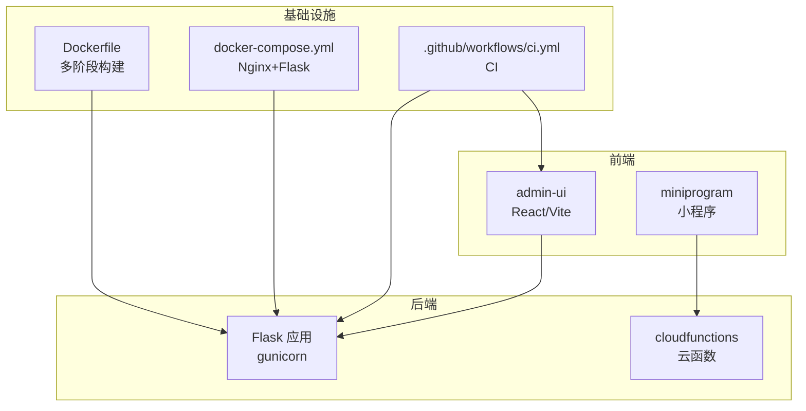
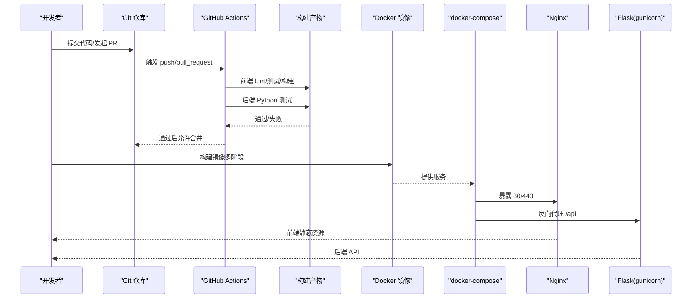
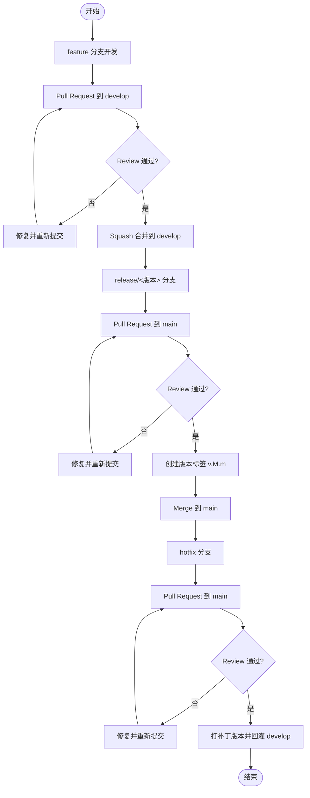
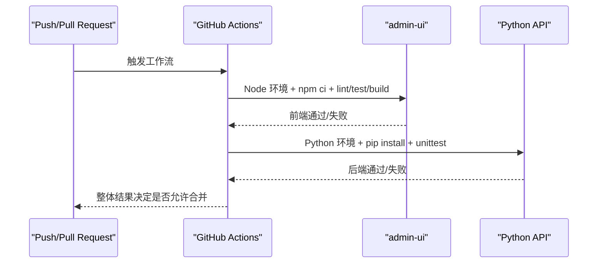
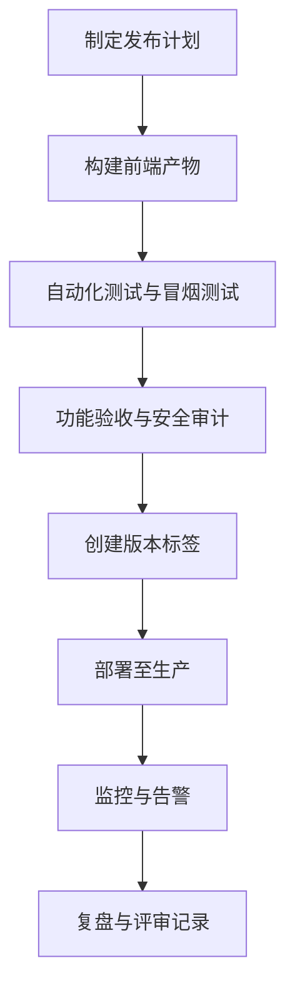
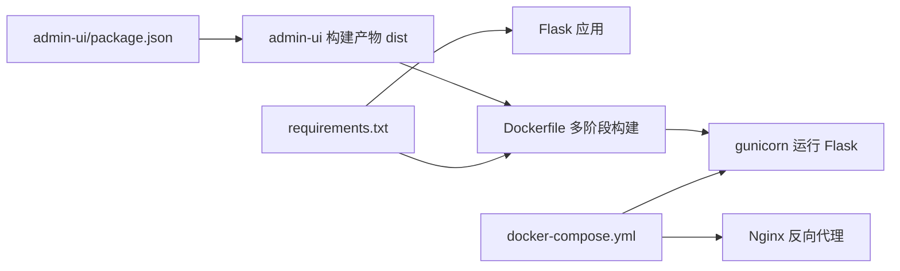

# 开发流程

<cite>
**本文引用的文件**
- [.github/workflows/ci.yml](file://.github/workflows/ci.yml)
- [CONTRIBUTING.md](file://CONTRIBUTING.md)
- [README.md](file://README.md)
- [package.json](file://package.json)
- [jest.config.js](file://jest.config.js)
- [.eslintrc.json](file://.eslintrc.json)
- [.stylelintrc.json](file://.stylelintrc.json)
- [admin-ui/package.json](file://admin-ui/package.json)
- [requirements.txt](file://requirements.txt)
- [Dockerfile](file://Dockerfile)
- [deploy/README.md](file://deploy/README.md)
- [deploy/docker-compose.yml](file://deploy/docker-compose.yml)
- [admin-ui/vite.config.ts](file://admin-ui/vite.config.ts)
- [admin-ui/eslint.config.js](file://admin-ui/eslint.config.js)
- [RELEASE_MANIFEST_V1.0.0.md](file://RELEASE_MANIFEST_V1.0.0.md)
- [miniprogram/app.js](file://miniprogram/app.js)
- [cloudfunctions/dataImporter/index.js](file://cloudfunctions/dataImporter/index.js)
</cite>

## 目录
1. [简介](#简介)
2. [项目结构](#项目结构)
3. [核心组件](#核心组件)
4. [架构总览](#架构总览)
5. [详细组件分析](#详细组件分析)
6. [依赖关系分析](#依赖关系分析)
7. [性能考虑](#性能考虑)
8. [故障排除指南](#故障排除指南)
9. [结论](#结论)
10. [附录](#附录)

## 简介
本文件旨在建立一套标准化的软件开发生命周期管理规范，覆盖 Git 工作流、分支策略、提交规范、Pull Request 流程、持续集成与持续部署（CI/CD）、代码审查与质量门禁、版本发布流程、团队协作与知识分享机制，以及开发工具与 IDE 最佳实践。文档内容基于仓库现有配置与规范文件整理而成，确保团队成员在不同技术栈（前端、后端、小程序、云开发）上遵循一致的流程与质量标准。

## 项目结构
项目采用多模块并行的组织方式，包含：
- 前端管理界面（React + Vite）：admin-ui
- 后端 API（Python Flask + gunicorn）：根目录后端服务
- 小程序（WeChat Mini Program）：miniprogram
- 云开发函数：cloudfunctions
- 部署与容器化：Dockerfile、docker-compose
- GitHub Actions CI：.github/workflows/ci.yml
- 测试与质量工具：Jest、ESLint、StyleLint
- 发布与运维文档：RELEASE_MANIFEST_V1.0.0.md、deploy/README.md

图表来源
- [Dockerfile](file://Dockerfile#L1-L48)
- [deploy/docker-compose.yml](file://deploy/docker-compose.yml#L1-L42)
- [.github/workflows/ci.yml](file://.github/workflows/ci.yml#L1-L35)
- [admin-ui/vite.config.ts](file://admin-ui/vite.config.ts#L1-L78)
- [cloudfunctions/dataImporter/index.js](file://cloudfunctions/dataImporter/index.js#L1-L392)

章节来源
- [README.md](file://README.md#L1-L90)
- [deploy/README.md](file://deploy/README.md#L1-L44)

## 核心组件
- Git 工作流与分支策略：采用 feature → develop → release → main 的线性演进路径，配合 hotfix 分支进行紧急修复。
- 提交规范：统一使用 type(scope): subject [#TAPD-<ID>] 格式，确保可追溯性与自动化关联。
- CI/CD：GitHub Actions 负责前端 Lint/测试/构建与后端 Python 单元测试，确保合并前的质量门禁。
- 代码审查：定义审查清单，强调错误提示、错误码区分、测试覆盖率与配置一致性。
- 发布与版本：语义化版本 vMAJOR.MINOR.PATCH，使用标签与发布说明记录变更。
- 团队协作：TAPD 任务与缺陷跟踪，提交与 PR 中附带 #TAPD-<ID>，实现端到端追踪。
- 开发工具：ESLint、StyleLint、Vitest/Jest、Vite 开发代理与测试环境配置。

章节来源
- [CONTRIBUTING.md](file://CONTRIBUTING.md#L1-L63)
- [.github/workflows/ci.yml](file://.github/workflows/ci.yml#L1-L35)
- [admin-ui/package.json](file://admin-ui/package.json#L1-L38)
- [requirements.txt](file://requirements.txt#L1-L12)
- [RELEASE_MANIFEST_V1.0.0.md](file://RELEASE_MANIFEST_V1.0.0.md#L1-L111)

## 架构总览
下图展示了从开发到发布的整体流程，包括本地开发、CI 检查、容器化部署与 Nginx 反向代理。

图表来源
- [.github/workflows/ci.yml](file://.github/workflows/ci.yml#L1-L35)
- [Dockerfile](file://Dockerfile#L1-L48)
- [deploy/docker-compose.yml](file://deploy/docker-compose.yml#L1-L42)
- [admin-ui/vite.config.ts](file://admin-ui/vite.config.ts#L1-L78)

## 详细组件分析

### Git 工作流与分支策略
- 分支命名规范：feature/<描述>、fix/<描述>、release/<版本号>、hotfix/<描述>。
- 合并策略：
  - feature → develop：Squash 合并，模块负责人 Review。
  - release → main：Merge 并创建 Tag，更新 CHANGELOG 与发布说明。
  - hotfix → main：Merge 并打补丁版本，回灌 develop。
- 保护分支与权限：main/develop 保护分支，禁止直接 push，启用 CI 作为合并前置条件，SSH Key 或个人 Token 最小权限。

章节来源
- [CONTRIBUTING.md](file://CONTRIBUTING.md#L3-L48)

### 提交信息规范与 PR 描述
- 提交信息格式：type(scope): subject [#TAPD-<ID>]，类型包括 feat/fix/refactor/docs/test/chore。
- PR 描述建议：变更摘要、影响范围、验证步骤，便于 Review 与回归测试。

章节来源
- [CONTRIBUTING.md](file://CONTRIBUTING.md#L14-L18)

### 代码规范与质量门禁
- 通用规范：避免硬编码环境差异，统一错误响应结构，日志不泄露敏感信息，变更向后兼容。
- 前端规范：ESLint/StyleLint 规则，React Hooks/Refresh 插件，测试环境 jsdom。
- 后端规范：Python 依赖集中管理，unittest 作为测试框架，CI 中运行测试。

章节来源
- [CONTRIBUTING.md](file://CONTRIBUTING.md#L20-L35)
- [.eslintrc.json](file://.eslintrc.json#L1-L24)
- [.stylelintrc.json](file://.stylelintrc.json#L1-L16)
- [admin-ui/eslint.config.js](file://admin-ui/eslint.config.js#L1-L24)
- [jest.config.js](file://jest.config.js#L1-L10)
- [requirements.txt](file://requirements.txt#L1-L12)

### 持续集成与自动化测试
- 触发条件：push/pull_request。
- 前端任务：checkout → setup-node → npm ci → lint → test → build。
- 后端任务：checkout → setup-python → pip install -r requirements.txt → unittest（测试环境变量）。

图表来源
- [.github/workflows/ci.yml](file://.github/workflows/ci.yml#L1-L35)

章节来源
- [.github/workflows/ci.yml](file://.github/workflows/ci.yml#L1-L35)

### 代码审查流程与质量门禁
- 审查清单要点：接口错误提示明确、4xx/5xx 区分清晰、补充单元测试、更新默认配置、本地可复现。
- 合并前置条件：CI 通过、Review 通过、分支保护策略生效。

章节来源
- [CONTRIBUTING.md](file://CONTRIBUTING.md#L27-L47)

### 版本发布流程
- 版本号：vMAJOR.MINOR.PATCH（语义化版本）。
- 标签与发布说明：在 Releases 记录新增/修复/破坏性改动与 TAPD 链接。
- 发布清单：包含功能变更、资源与配置、测试验证、灰度与回滚、监控告警与评审记录。

图表来源
- [RELEASE_MANIFEST_V1.0.0.md](file://RELEASE_MANIFEST_V1.0.0.md#L1-L111)

章节来源
- [CONTRIBUTING.md](file://CONTRIBUTING.md#L55-L58)
- [RELEASE_MANIFEST_V1.0.0.md](file://RELEASE_MANIFEST_V1.0.0.md#L1-L111)

### 团队协作规范与知识分享
- TAPD 协作：建立迭代与任务分派，测试用例执行后关联缺陷。
- 提交与 PR 关联：在提交与 PR 中附带 #TAPD-<ID>，实现端到端追踪。
- 知识分享：文档化最佳实践与流程，定期复盘与评审。

章节来源
- [CONTRIBUTING.md](file://CONTRIBUTING.md#L60-L63)

### 开发工具配置与 IDE 最佳实践
- 前端开发代理：Vite 配置支持本地与云端代理切换，开发模式下输出代理目标，错误时返回统一结构。
- 测试环境：Vitest（前端）、Jest（后端），jsdom 环境，定时器模拟。
- 代码质量：ESLint/StyleLint 规则，TS/React 插件，忽略 dist 目录。
- 本地开发脚本：统一的 dev/dev:node/dev:flask/dev:ui/dev:node-ui 组合脚本，便于多栈并行开发。

章节来源
- [admin-ui/vite.config.ts](file://admin-ui/vite.config.ts#L1-L78)
- [admin-ui/eslint.config.js](file://admin-ui/eslint.config.js#L1-L24)
- [jest.config.js](file://jest.config.js#L1-L10)
- [package.json](file://package.json#L1-L50)
- [admin-ui/package.json](file://admin-ui/package.json#L1-L38)

## 依赖关系分析
- 前端 admin-ui 依赖 React/Ant Design/axios 等，使用 Vite 构建与 Vitest 测试。
- 后端依赖 Flask、pymongo、requests、PyJWT 等，使用 gunicorn 生产运行。
- Dockerfile 多阶段构建：先构建前端产物，再安装 Python 依赖，复制前端产物，最终以 gunicorn 启动。
- docker-compose 将 Flask 与 Nginx 组织为服务网络，暴露 80/443，挂载日志与证书。

图表来源
- [admin-ui/package.json](file://admin-ui/package.json#L1-L38)
- [requirements.txt](file://requirements.txt#L1-L12)
- [Dockerfile](file://Dockerfile#L1-L48)
- [deploy/docker-compose.yml](file://deploy/docker-compose.yml#L1-L42)

章节来源
- [admin-ui/package.json](file://admin-ui/package.json#L1-L38)
- [requirements.txt](file://requirements.txt#L1-L12)
- [Dockerfile](file://Dockerfile#L1-L48)
- [deploy/docker-compose.yml](file://deploy/docker-compose.yml#L1-L42)

## 性能考虑
- 前端性能：Vite 开发代理支持错误透传与统一响应，避免重复请求；测试环境 jsdom 保证 DOM API 可用。
- 后端性能：gunicorn 多进程/多线程配置，适合高并发场景；数据库连接池与查询优化建议在路由层实施。
- 容器化：多阶段构建减少镜像体积；Nginx 作为反向代理与静态资源服务，提升响应效率。
- 小程序性能：App 初始化时懒加载与预加载关键资源，内存告警时清理低优先级缓存，定期生成性能报告。

章节来源
- [admin-ui/vite.config.ts](file://admin-ui/vite.config.ts#L1-L78)
- [Dockerfile](file://Dockerfile#L1-L48)
- [miniprogram/app.js](file://miniprogram/app.js#L1-L225)

## 故障排除指南
- CI 失败定位：
  - 前端：检查 Lint/测试/构建日志，确认 Node 版本与缓存路径。
  - 后端：检查依赖安装与测试执行，确认测试环境变量与数据库初始化开关。
- 开发代理问题：
  - 确认 Vite 代理目标（本地/云端），代理错误时查看统一错误响应与目标地址。
- 部署问题：
  - docker-compose 端口冲突、证书挂载、日志目录权限；Nginx 配置文件路径与语法。
- 小程序异常：
  - 全局错误捕获与上报，内存告警时清理缓存，定期检查性能报告。

章节来源
- [.github/workflows/ci.yml](file://.github/workflows/ci.yml#L1-L35)
- [admin-ui/vite.config.ts](file://admin-ui/vite.config.ts#L1-L78)
- [deploy/docker-compose.yml](file://deploy/docker-compose.yml#L1-L42)
- [miniprogram/app.js](file://miniprogram/app.js#L1-L225)

## 结论
本标准化文档将 Git 工作流、CI/CD、代码审查、版本发布与团队协作整合为统一的生命周期规范，并结合前端、后端、小程序与云开发的实际配置落地。建议团队在日常开发中严格遵循上述流程与规范，持续优化质量门禁与发布策略，确保交付稳定、可追溯、可复现的高质量产品。

## 附录
- 术语
  - TAPD：企业级项目管理与协同平台。
  - Squash 合并：将多个提交压缩为单个提交，保持历史整洁。
  - 语义化版本：根据功能新增、修复与破坏性变更决定主/次/补丁版本号。
- 参考文件
  - [CONTRIBUTING.md](file://CONTRIBUTING.md)
  - [.github/workflows/ci.yml](file://.github/workflows/ci.yml)
  - [RELEASE_MANIFEST_V1.0.0.md](file://RELEASE_MANIFEST_V1.0.0.md)
  - [deploy/README.md](file://deploy/README.md)
  - [deploy/docker-compose.yml](file://deploy/docker-compose.yml)
  - [Dockerfile](file://Dockerfile)
  - [admin-ui/vite.config.ts](file://admin-ui/vite.config.ts)
  - [admin-ui/eslint.config.js](file://admin-ui/eslint.config.js)
  - [jest.config.js](file://jest.config.js)
  - [.eslintrc.json](file://.eslintrc.json)
  - [.stylelintrc.json](file://.stylelintrc.json)
  - [package.json](file://package.json)
  - [admin-ui/package.json](file://admin-ui/package.json)
  - [requirements.txt](file://requirements.txt)
  - [miniprogram/app.js](file://miniprogram/app.js)
  - [cloudfunctions/dataImporter/index.js](file://cloudfunctions/dataImporter/index.js)