# 开发环境搭建

<cite>
**本文档引用的文件**
- [package.json](file://package.json)
- [requirements.txt](file://requirements.txt)
- [.env.example](file://.env.example)
- [config.py](file://config.py)
- [startup.ps1](file://startup.ps1)
- [start_backend.ps1](file://start_backend.ps1)
- [install_and_start.ps1](file://install_and_start.ps1)
- [Dockerfile](file://Dockerfile)
- [app.py](file://app.py)
- [admin-ui/package.json](file://admin-ui/package.json)
- [admin-ui/.env](file://admin-ui/.env)
- [admin-ui/vite.config.ts](file://admin-ui/vite.config.ts)
- [backend_utils/db.js](file://backend_utils/db.js)
</cite>

## 目录
1. [简介](#简介)
2. [项目结构](#项目结构)
3. [核心组件](#核心组件)
4. [架构概览](#架构概览)
5. [详细组件分析](#详细组件分析)
6. [依赖分析](#依赖分析)
7. [性能考虑](#性能考虑)
8. [故障排除指南](#故障排除指南)
9. [结论](#结论)
10. [附录](#附录)

## 简介

本指南旨在为开发者提供完整的本地开发环境搭建流程，涵盖Node.js、Python、MongoDB等核心依赖的安装和配置方法。文档详细说明了前后端项目的依赖安装步骤，包括npm install、pip install等命令的具体执行顺序。同时解释了环境变量配置，包括.env文件的设置和敏感信息的安全管理，并提供了开发服务器启动方法，包括后端Flask服务和前端React应用的启动命令。

该系统采用前后端分离架构，后端使用Python Flask框架提供RESTful API服务，前端使用React技术栈构建管理界面。系统支持多种数据源模式，包括本地MongoDB、微信云数据库以及混合模式，为不同部署场景提供灵活的数据存储方案。

## 项目结构

该项目采用多模块架构设计，主要包含以下核心组件：

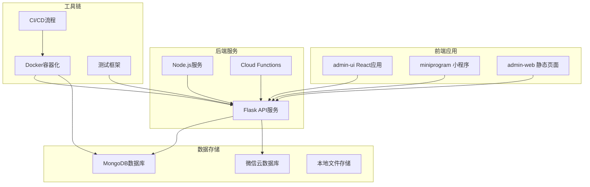

**图表来源**
- [package.json](file://package.json#L1-L50)
- [requirements.txt](file://requirements.txt#L1-L12)
- [Dockerfile](file://Dockerfile#L1-L48)

项目采用模块化设计，每个组件都有明确的职责分工：

- **admin-ui**: 基于React的管理后台前端应用
- **miniprogram**: 微信小程序客户端
- **admin-web**: 静态页面展示
- **Flask后端**: 提供RESTful API服务
- **Node.js服务**: 辅助服务和工具
- **Cloud Functions**: 云端函数处理

**章节来源**
- [package.json](file://package.json#L1-L50)
- [requirements.txt](file://requirements.txt#L1-L12)
- [Dockerfile](file://Dockerfile#L1-L48)

## 核心组件

### 后端服务组件

后端服务采用Flask框架构建，支持多种部署模式和数据源配置：

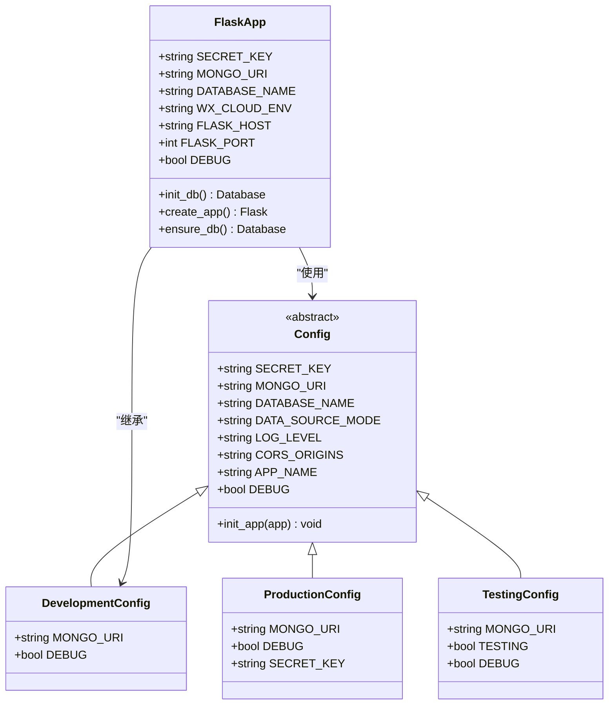

**图表来源**
- [config.py](file://config.py#L22-L132)
- [app.py](file://app.py#L103-L200)

### 前端组件

前端采用React技术栈，支持现代化开发工具链：

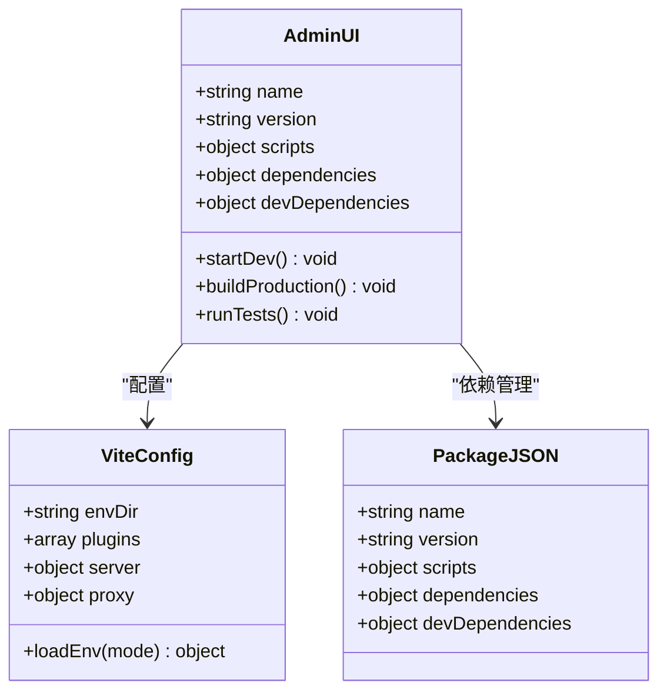

**图表来源**
- [admin-ui/package.json](file://admin-ui/package.json#L1-L38)
- [admin-ui/vite.config.ts](file://admin-ui/vite.config.ts#L1-L78)

**章节来源**
- [config.py](file://config.py#L1-L132)
- [admin-ui/package.json](file://admin-ui/package.json#L1-L38)
- [admin-ui/vite.config.ts](file://admin-ui/vite.config.ts#L1-L78)

## 架构概览

系统采用微服务架构，支持多种部署模式和数据源配置：

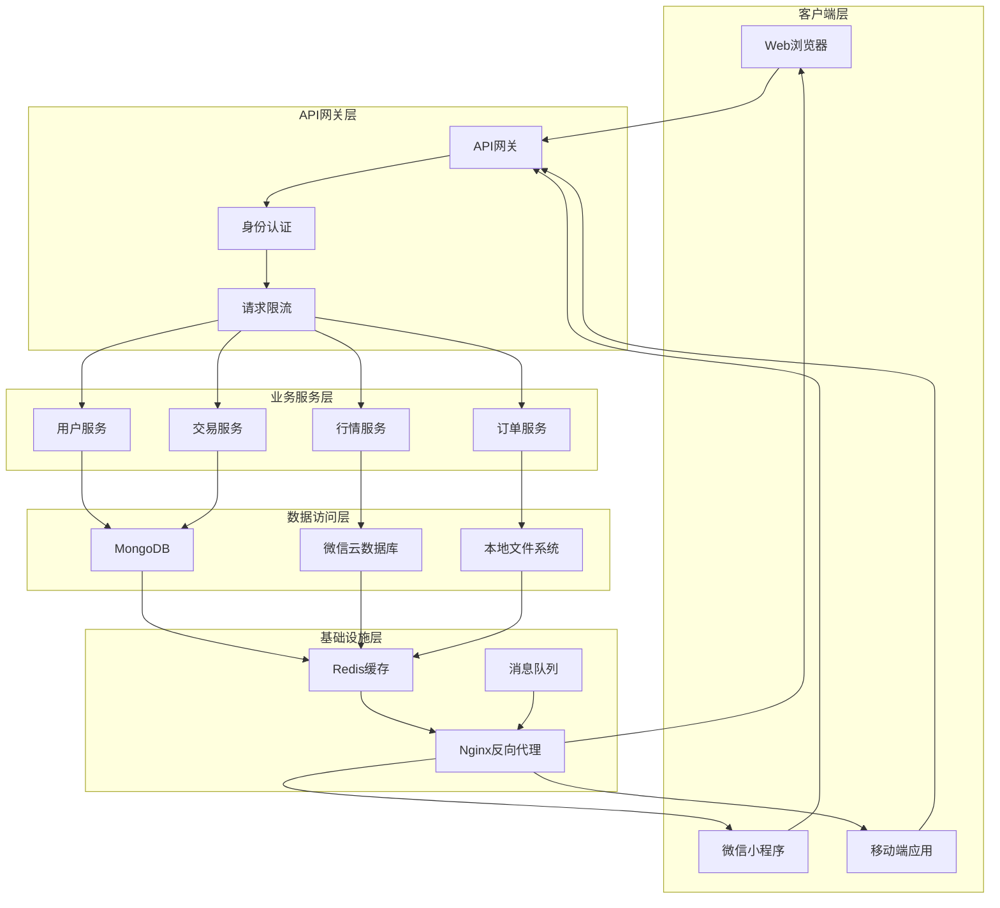

**图表来源**
- [app.py](file://app.py#L1-L200)
- [config.py](file://config.py#L1-L132)
- [Dockerfile](file://Dockerfile#L1-L48)

## 详细组件分析

### 环境变量配置

系统支持多环境配置，通过.env文件管理敏感信息和配置参数：

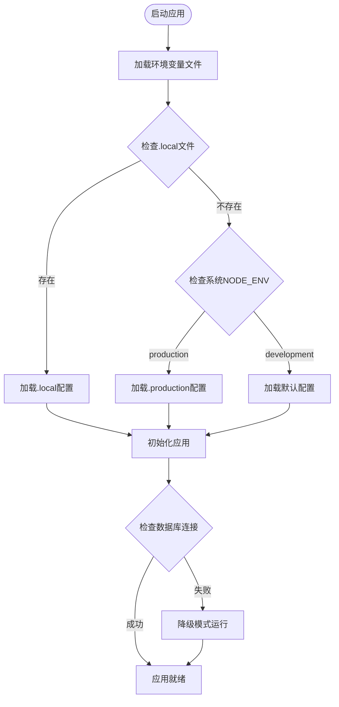

**图表来源**
- [app.py](file://app.py#L37-L58)
- [.env.example](file://.env.example#L1-L50)

环境变量配置要点：

1. **安全配置**: JWT密钥、数据库凭据等敏感信息
2. **数据源配置**: MongoDB连接字符串、微信云数据库配置
3. **API配置**: 数据源类型、缓存配置
4. **日志配置**: 日志级别、日志文件路径
5. **跨域配置**: 允许的源地址列表

**章节来源**
- [.env.example](file://.env.example#L1-L50)
- [config.py](file://config.py#L19-L62)
- [app.py](file://app.py#L37-L58)

### 后端服务启动流程

后端服务支持多种启动方式，包括独立启动和组合启动：

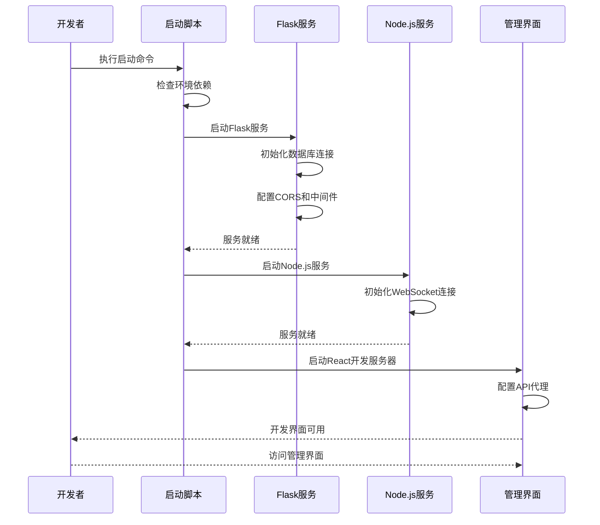

**图表来源**
- [startup.ps1](file://startup.ps1#L67-L139)
- [package.json](file://package.json#L6-L15)

启动流程的关键步骤：

1. **环境检测**: 检查Node.js、Python、MongoDB等依赖
2. **服务启动**: 按顺序启动Flask、Node.js、React服务
3. **健康检查**: 验证各服务的运行状态
4. **端口管理**: 处理端口冲突和分配
5. **日志记录**: 记录启动过程和错误信息

**章节来源**
- [startup.ps1](file://startup.ps1#L67-L139)
- [start_backend.ps1](file://start_backend.ps1#L1-L62)
- [install_and_start.ps1](file://install_and_start.ps1#L1-L156)

### 前端开发服务器配置

前端开发服务器支持本地代理和云端代理两种模式：

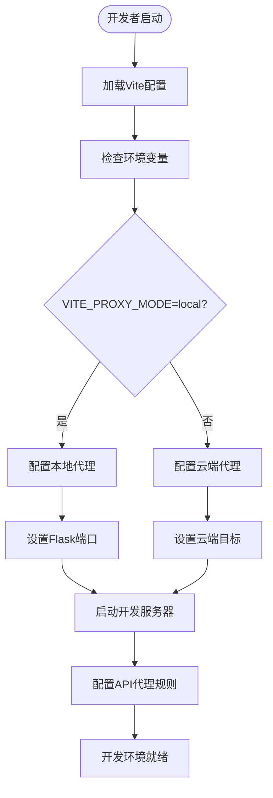

**图表来源**
- [admin-ui/vite.config.ts](file://admin-ui/vite.config.ts#L6-L20)

前端开发配置要点：

1. **代理配置**: 支持本地和云端两种代理模式
2. **端口配置**: 根据环境变量动态设置端口
3. **热重载**: 支持开发时的自动刷新
4. **TypeScript支持**: 完整的类型检查和智能提示
5. **测试集成**: 内置Vitest测试框架

**章节来源**
- [admin-ui/vite.config.ts](file://admin-ui/vite.config.ts#L1-L78)
- [admin-ui/.env](file://admin-ui/.env#L1-L2)

### 数据库连接管理

系统支持多种数据库连接模式，包括本地MongoDB、微信云数据库和混合模式：

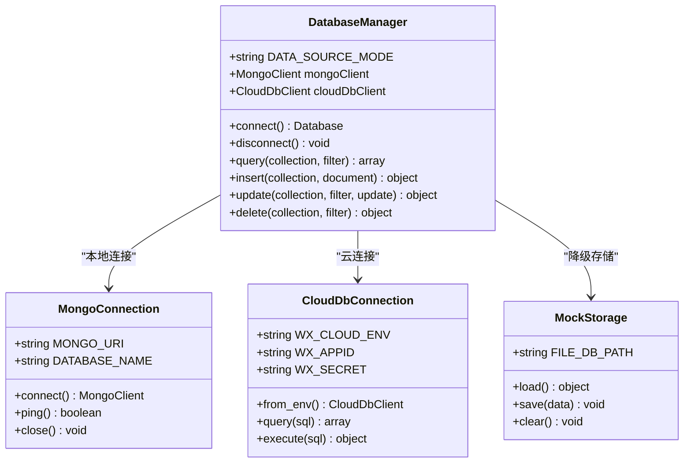

**图表来源**
- [backend_utils/db.js](file://backend_utils/db.js#L1-L64)
- [config.py](file://config.py#L22-L46)

数据库连接策略：

1. **优先级模式**: 微信云数据库优先，本地MongoDB作为后备
2. **混合模式**: 同时维护多个数据源的同步
3. **降级模式**: 当所有数据源都不可用时使用本地文件存储
4. **连接池管理**: 优化数据库连接的生命周期管理

**章节来源**
- [backend_utils/db.js](file://backend_utils/db.js#L1-L64)
- [config.py](file://config.py#L22-L46)

## 依赖分析

### 核心依赖矩阵

系统依赖分为多个层次，包括运行时依赖、开发依赖和可选依赖：

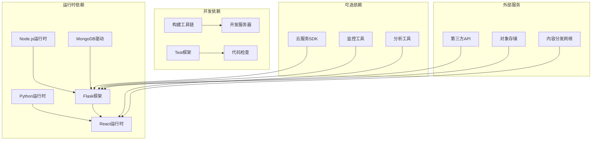

**图表来源**
- [package.json](file://package.json#L27-L48)
- [requirements.txt](file://requirements.txt#L1-L12)

### 依赖版本管理

系统采用严格的版本管理策略，确保开发环境的一致性：

| 组件类别 | 关键依赖 | 版本要求 | 最小版本 |
|---------|---------|---------|---------|
| Node.js | 运行时环境 | >=18.0.0 | 18.x |
| npm | 包管理器 | >=9.0.0 | 9.x |
| Python | 运行时环境 | >=3.9.0 | 3.9+ |
| Flask | Web框架 | >=2.0.1 | 2.x |
| MongoDB | 数据库驱动 | >=3.12.0 | 3.x |
| React | 前端框架 | >=19.2.0 | 19.x |
| Vite | 构建工具 | >=7.2.4 | 7.x |

**章节来源**
- [package.json](file://package.json#L23-L26)
- [requirements.txt](file://requirements.txt#L1-L12)

## 性能考虑

### 启动性能优化

系统在启动过程中采用了多项性能优化措施：

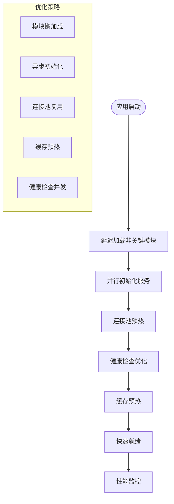

### 运行时性能监控

系统内置了完善的性能监控机制：

1. **数据库连接池**: 优化MongoDB连接复用
2. **API响应时间**: 监控关键API的响应时间
3. **内存使用**: 跟踪应用内存使用情况
4. **错误率统计**: 统计API错误发生频率
5. **资源利用率**: 监控CPU和内存使用率

## 故障排除指南

### 常见环境问题

#### 端口冲突问题

当开发服务器启动时遇到端口占用问题：

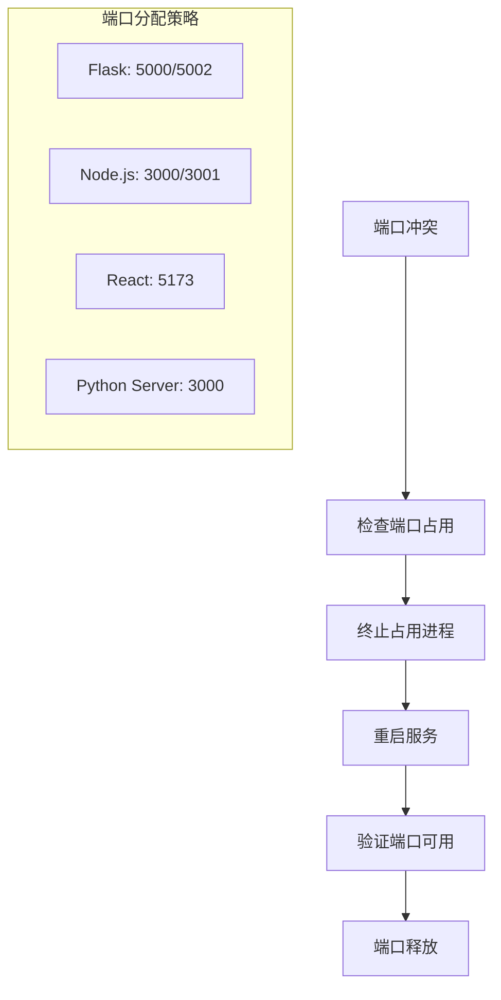

**解决步骤**:
1. 使用netstat检查端口占用情况
2. 终止占用端口的进程
3. 修改配置文件中的端口号
4. 重启相关服务

#### 依赖版本不兼容

当遇到依赖版本冲突时：

**解决步骤**:
1. 检查package.json和requirements.txt中的版本要求
2. 更新到兼容的版本范围
3. 清理node_modules和venv目录
4. 重新安装所有依赖
5. 运行测试验证兼容性

#### 数据库连接失败

当Flask服务无法连接MongoDB时：

**诊断步骤**:
1. 检查MONGO_URI格式是否正确
2. 验证MongoDB服务是否正在运行
3. 确认网络连接和防火墙设置
4. 检查认证凭据是否正确
5. 查看日志文件获取详细错误信息

#### 环境变量配置错误

当应用无法正确加载环境变量时：

**检查清单**:
1. 确认.env文件存在于项目根目录
2. 验证环境变量名称拼写正确
3. 检查敏感信息是否正确编码
4. 确认不同环境的配置文件正确加载
5. 验证环境变量的优先级顺序

**章节来源**
- [startup.ps1](file://startup.ps1#L97-L115)
- [install_and_start.ps1](file://install_and_start.ps1#L97-L115)
- [app.py](file://app.py#L69-L88)

## 结论

本开发环境搭建指南提供了完整的本地开发环境配置流程，涵盖了从基础依赖安装到服务启动的全过程。系统采用现代化的技术栈和架构设计，支持多种部署模式和数据源配置，为不同规模的项目需求提供了灵活的解决方案。

关键优势包括：
- **多环境支持**: 完善的开发、测试、生产环境配置
- **数据源灵活性**: 支持本地数据库、云数据库和混合模式
- **开发效率**: 热重载、类型检查、代码质量工具
- **运维友好**: Docker容器化、健康检查、日志管理

建议开发者在开始项目前仔细阅读本指南，按照推荐的步骤进行环境配置，以确保开发过程的顺利进行。

## 附录

### 快速启动命令

```bash
# 安装Python依赖
pip install -r requirements.txt

# 安装Node.js依赖
npm install

# 启动Flask后端
python app.py

# 启动React前端
cd admin-ui
npm run dev

# 启动完整开发环境
npm run dev
```

### 环境变量参考

| 变量名 | 类型 | 描述 | 默认值 |
|-------|------|------|--------|
| NODE_ENV | string | Node.js环境类型 | development |
| FLASK_PORT | number | Flask服务端口号 | 5002 |
| MONGO_URI | string | MongoDB连接字符串 | mongodb://localhost:27017/option_data |
| SECRET_KEY | string | Flask密钥 | dev-secret-key-change-in-production |
| WX_CLOUD_ENV | string | 微信云环境ID | develop-8gx7kh9g045e6c9a |
| FLASK_DEBUG | boolean | Flask调试模式 | False |
| ALLOWED_ORIGINS | string | 允许的CORS源 | localhost,127.0.0.1 |