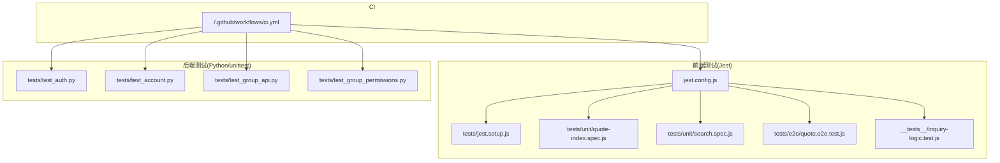
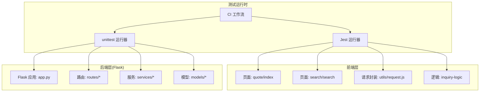
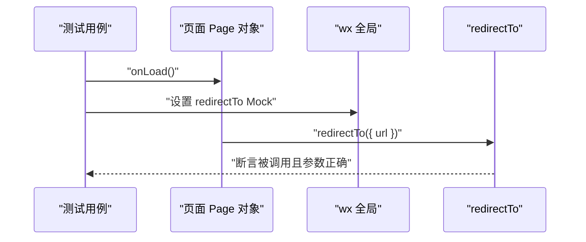
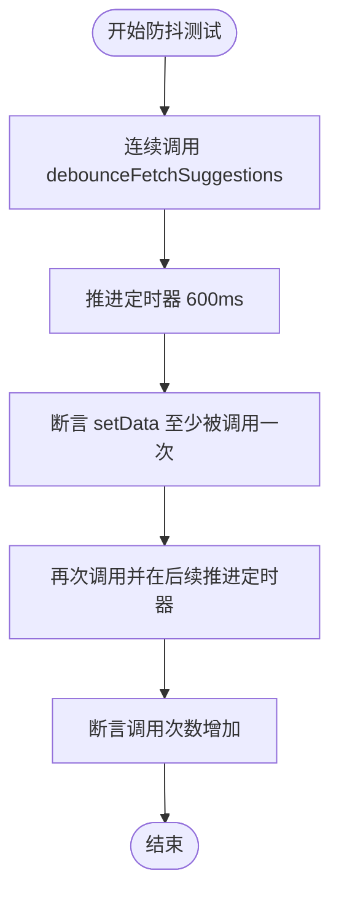
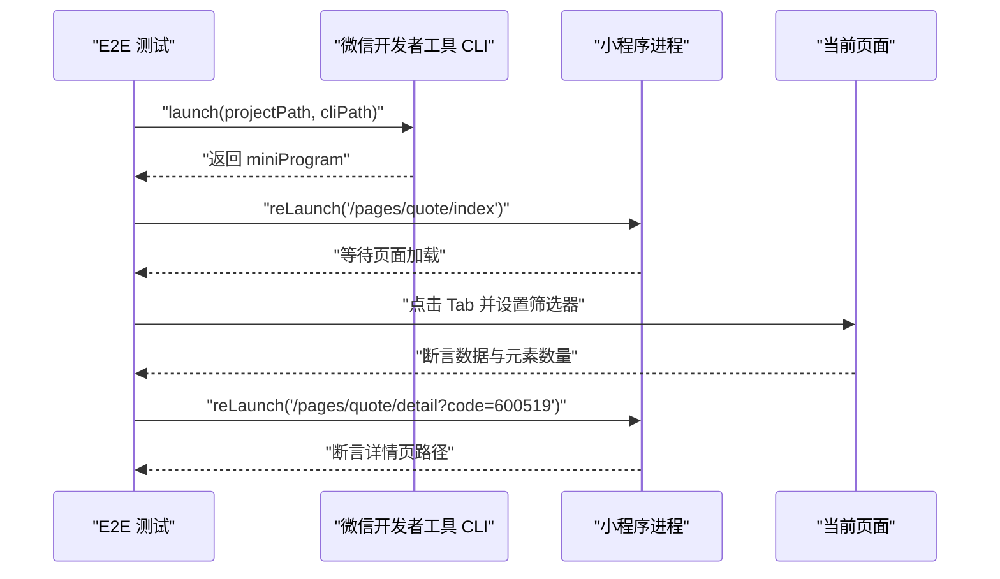
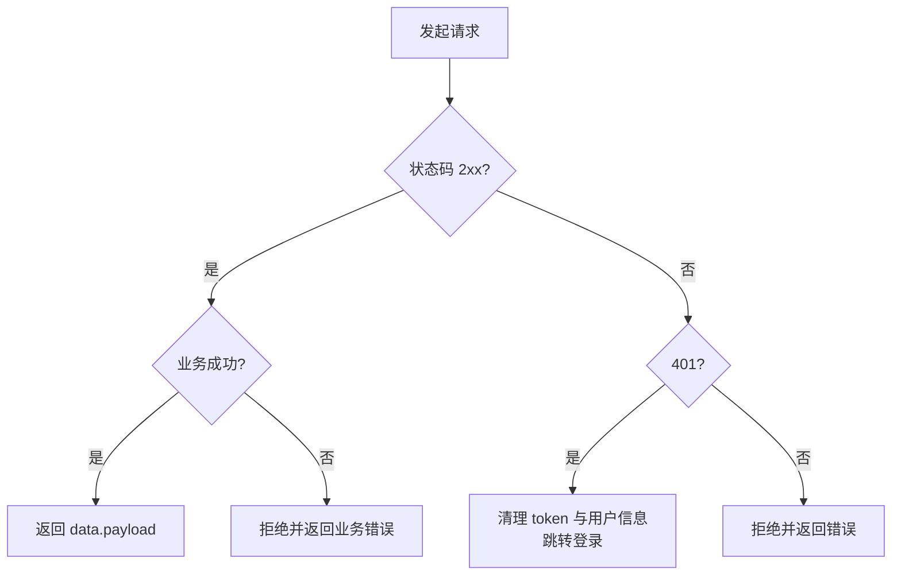
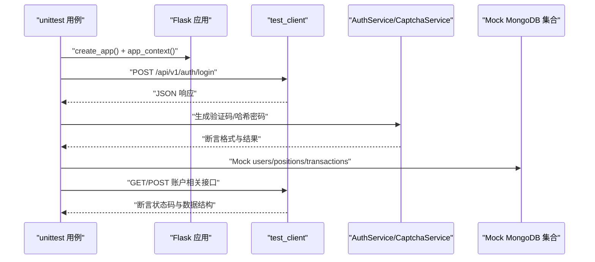
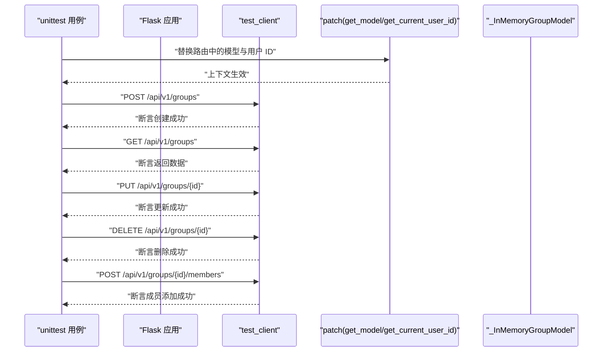
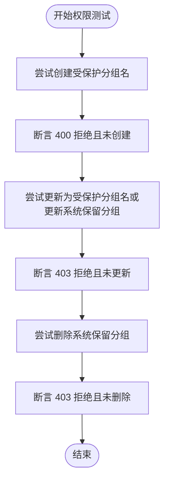
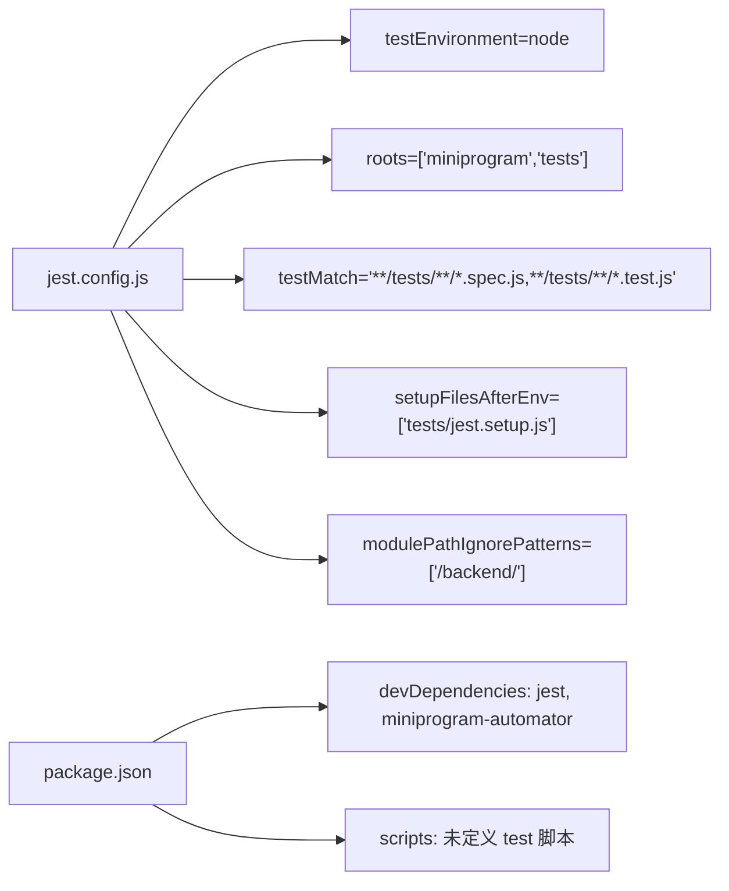

# 单元测试

<cite>
**本文引用的文件**
- [jest.config.js](file://jest.config.js)
- [package.json](file://package.json)
- [tests/jest.setup.js](file://tests/jest.setup.js)
- [__tests__/inquiry-logic.test.js](file://__tests__/inquiry-logic.test.js)
- [tests/unit/quote-index.spec.js](file://tests/unit/quote-index.spec.js)
- [tests/unit/search.spec.js](file://tests/unit/search.spec.js)
- [tests/e2e/quote.e2e.test.js](file://tests/e2e/quote.e2e.test.js)
- [utils/request.js](file://utils/request.js)
- [tests/test_auth.py](file://tests/test_auth.py)
- [tests/test_account.py](file://tests/test_account.py)
- [tests/test_group_api.py](file://tests/test_group_api.py)
- [tests/test_group_permissions.py](file://tests/test_group_permissions.py)
- [.github/workflows/ci.yml](file://.github/workflows/ci.yml)
</cite>

## 目录
1. [引言](#引言)
2. [项目结构](#项目结构)
3. [核心组件](#核心组件)
4. [架构总览](#架构总览)
5. [详细组件分析](#详细组件分析)
6. [依赖分析](#依赖分析)
7. [性能考虑](#性能考虑)
8. [故障排除指南](#故障排除指南)
9. [结论](#结论)
10. [附录](#附录)

## 引言
本文件系统性地梳理并文档化当前仓库的单元测试与测试体系，覆盖以下目标：
- 建立完整的 Python 与 JavaScript 单元测试规范与最佳实践
- 详述 Flask 应用测试、服务层测试与数据模型测试的编写方法
- 解释 Jest 在前端组件测试中的应用：React 组件测试、API 调用测试与状态管理测试
- 总结测试用例设计原则：边界条件、异常情况与业务逻辑验证
- 提供测试数据准备与 Mock 对象使用的最佳实践
- 汇总测试覆盖率统计与持续集成中的测试执行配置

## 项目结构
当前测试体系由三部分组成：
- 前端小程序与通用 JS 测试：Jest 配置与用例，覆盖逻辑校验、页面行为与端到端流程
- Flask 后端 Python 测试：unittest 用例，覆盖认证、账户流、分组 API 与权限控制
- CI 集成：GitHub Actions 工作流驱动测试执行

图表来源
- [jest.config.js](file://jest.config.js#L1-L10)
- [tests/jest.setup.js](file://tests/jest.setup.js#L1-L13)
- [tests/unit/quote-index.spec.js](file://tests/unit/quote-index.spec.js#L1-L18)
- [tests/unit/search.spec.js](file://tests/unit/search.spec.js#L1-L48)
- [tests/e2e/quote.e2e.test.js](file://tests/e2e/quote.e2e.test.js#L1-L67)
- [__tests__/inquiry-logic.test.js](file://__tests__/inquiry-logic.test.js#L1-L174)
- [tests/test_auth.py](file://tests/test_auth.py#L1-L69)
- [tests/test_account.py](file://tests/test_account.py#L1-L103)
- [tests/test_group_api.py](file://tests/test_group_api.py#L1-L158)
- [tests/test_group_permissions.py](file://tests/test_group_permissions.py#L1-L76)
- [.github/workflows/ci.yml](file://.github/workflows/ci.yml)

章节来源
- [jest.config.js](file://jest.config.js#L1-L10)
- [package.json](file://package.json#L1-L50)

## 核心组件
- Jest 前端测试框架与配置：统一测试环境、匹配规则、全局 Mock 与定时器伪造
- Python unittest：Flask 应用测试客户端、服务层与路由层的模拟与断言
- 端到端测试：基于微信开发者工具 CLI 的自动化流程测试
- 请求封装与鉴权：小程序侧请求工具对后端 API 的调用与 401 处理

章节来源
- [jest.config.js](file://jest.config.js#L1-L10)
- [tests/jest.setup.js](file://tests/jest.setup.js#L1-L13)
- [utils/request.js](file://utils/request.js#L1-L70)
- [tests/test_auth.py](file://tests/test_auth.py#L1-L69)

## 架构总览
下图展示测试体系在不同层次的职责与交互关系。

图表来源
- [jest.config.js](file://jest.config.js#L1-L10)
- [tests/jest.setup.js](file://tests/jest.setup.js#L1-L13)
- [utils/request.js](file://utils/request.js#L1-L70)
- [tests/test_auth.py](file://tests/test_auth.py#L1-L69)

## 详细组件分析

### 前端组件测试（Jest）
- 页面重定向测试：通过捕获 Page 对象与 Mock wx 接口，验证 onLoad 触发的导航行为
- 防抖与存储测试：使用伪造定时器与 Mock 存储接口，验证多次输入后的去重与长度限制
- 端到端流程：基于微信开发者工具 CLI 的自动化，验证 Tab 切换、筛选器交互、搜索与询价弹窗

图表来源
- [tests/unit/quote-index.spec.js](file://tests/unit/quote-index.spec.js#L1-L18)

图表来源
- [tests/unit/search.spec.js](file://tests/unit/search.spec.js#L1-L48)

图表来源
- [tests/e2e/quote.e2e.test.js](file://tests/e2e/quote.e2e.test.js#L1-L67)

章节来源
- [tests/unit/quote-index.spec.js](file://tests/unit/quote-index.spec.js#L1-L18)
- [tests/unit/search.spec.js](file://tests/unit/search.spec.js#L1-L48)
- [tests/e2e/quote.e2e.test.js](file://tests/e2e/quote.e2e.test.js#L1-L67)
- [__tests__/inquiry-logic.test.js](file://__tests__/inquiry-logic.test.js#L1-L174)

### 前端逻辑与 API 调用测试
- 逻辑校验：对分组名验证、迁移计数、分组项迁移等纯函数进行单元断言
- 请求封装：统一处理鉴权头、状态码与业务码，401 时清理本地存储并跳转登录

图表来源
- [utils/request.js](file://utils/request.js#L1-L70)

章节来源
- [utils/request.js](file://utils/request.js#L1-L70)

### Flask 应用测试（Python/unittest）
- 认证与验证码：验证密码哈希、令牌生成与验证码图像生成
- 账户流：通过 Mock JWT、Mongo 集合与实时股价接口，完整覆盖登录、查询余额、充值、提现与交易记录
- 分组 API：通过内存模型替换真实模型，验证创建、查询、更新、删除与成员添加
- 权限控制：针对受保护分组名与系统保留分组的更新/删除进行拒绝断言

图表来源
- [tests/test_auth.py](file://tests/test_auth.py#L1-L69)
- [tests/test_account.py](file://tests/test_account.py#L1-L103)

图表来源
- [tests/test_group_api.py](file://tests/test_group_api.py#L1-L158)

图表来源
- [tests/test_group_permissions.py](file://tests/test_group_permissions.py#L1-L76)

章节来源
- [tests/test_auth.py](file://tests/test_auth.py#L1-L69)
- [tests/test_account.py](file://tests/test_account.py#L1-L103)
- [tests/test_group_api.py](file://tests/test_group_api.py#L1-L158)
- [tests/test_group_permissions.py](file://tests/test_group_permissions.py#L1-L76)

## 依赖分析
- Jest 配置与脚本
  - jest.config.js 指定测试环境为 node，根目录包含 miniprogram 与 tests，匹配规则为 *.spec.js 与 *.test.js，并加载 tests/jest.setup.js 进行全局 Mock
  - package.json 中未定义 npm test 脚本，当前仅输出提示信息；建议补充测试脚本以配合 CI 执行
- 前端依赖
  - jest 作为开发依赖，miniprogram-automator 用于端到端测试
- 后端依赖
  - Flask 及相关扩展用于后端服务，unittest 为标准库无需额外安装

图表来源
- [jest.config.js](file://jest.config.js#L1-L10)
- [package.json](file://package.json#L1-L50)

章节来源
- [jest.config.js](file://jest.config.js#L1-L10)
- [package.json](file://package.json#L1-L50)

## 性能考虑
- 使用伪造定时器（fakeTimers）减少测试耗时，确保异步事件在可控时间点推进
- Mock 外部依赖（如网络请求、数据库、云服务）以消除不确定性，提升稳定性与速度
- 将端到端测试置于可选执行路径（通过环境变量控制），避免在常规 CI 中阻塞

## 故障排除指南
- 端到端测试失败
  - 确认微信开发者工具 CLI 路径存在且可执行，或设置 WECHAT_DEVTOOLS_CLI 环境变量
  - 检查页面选择器是否随 UI 变更而失效，必要时更新选择器或采用更稳定的定位策略
- 401 未授权处理
  - 若后端返回业务 401 或状态码 401，请求封装会清理本地存储并跳转登录；检查鉴权头与登录流程
- Python 测试数据库连接
  - 若测试中出现数据库未连接错误，需在测试前配置测试数据库或在路由层进行模型替换（参考分组 API 测试中的 patch 方案）

章节来源
- [tests/e2e/quote.e2e.test.js](file://tests/e2e/quote.e2e.test.js#L1-L67)
- [utils/request.js](file://utils/request.js#L1-L70)
- [tests/test_group_api.py](file://tests/test_group_api.py#L1-L158)

## 结论
本仓库已具备较为完善的前后端测试基础：
- 前端：Jest 配置与用例覆盖页面行为、逻辑校验与端到端流程
- 后端：unittest 用例覆盖认证、账户流、分组 API 与权限控制
- CI：工作流可直接运行上述测试
建议进一步完善：
- 补充 npm test 脚本以标准化执行
- 引入测试覆盖率统计与阈值配置
- 将端到端测试纳入 CI 的可选矩阵，按需启用

## 附录

### 测试用例设计原则
- 边界条件测试：字符串长度、数组长度、数值范围
- 异常情况测试：401 未授权、业务错误码、空数据、重复项
- 业务逻辑验证：分组迁移计数、去重与排序、权限拦截

### 测试数据准备与 Mock 最佳实践
- 前端
  - 使用全局 Mock（如 wx.getStorageSync/setStorageSync）模拟存储
  - 使用 jest.useFakeTimers 与 jest.advanceTimersByTime 控制异步时机
  - 通过 jest.resetModules 与全局捕获 Page 对象隔离用例
- 后端
  - 使用 unittest.mock.patch 替换路由中的模型与用户解析函数
  - 在 app_context 下构造测试客户端，避免真实数据库依赖

### 测试覆盖率与 CI 执行
- 当前未见覆盖率统计配置与脚本
- 建议在 jest.config.js 中加入覆盖率收集选项，并在 CI 工作流中执行测试脚本

章节来源
- [jest.config.js](file://jest.config.js#L1-L10)
- [.github/workflows/ci.yml](file://.github/workflows/ci.yml)