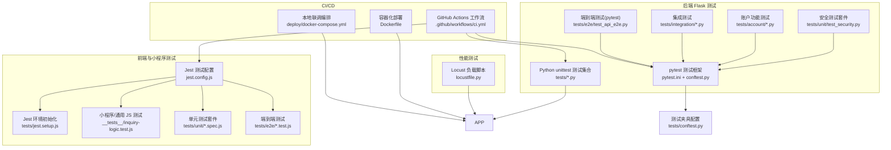
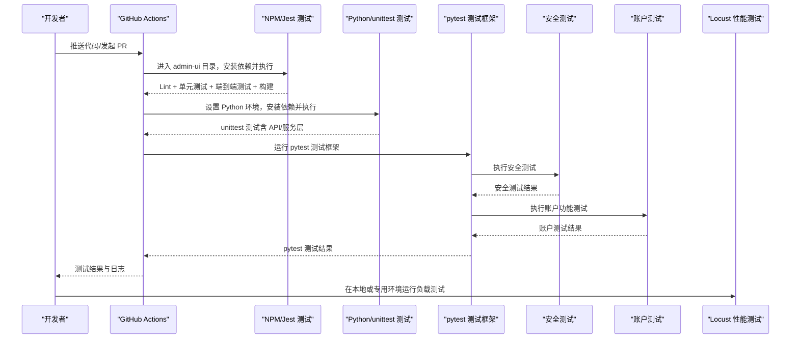
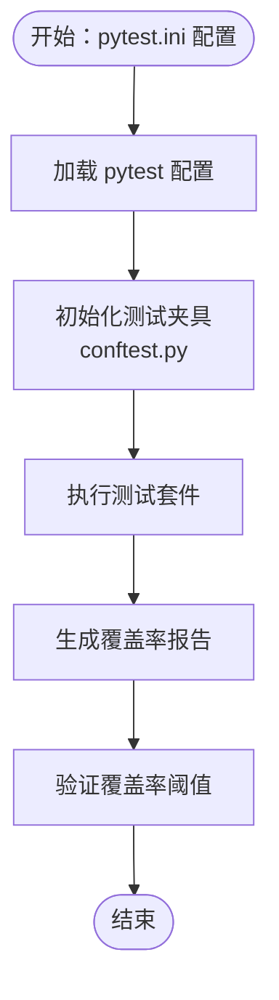
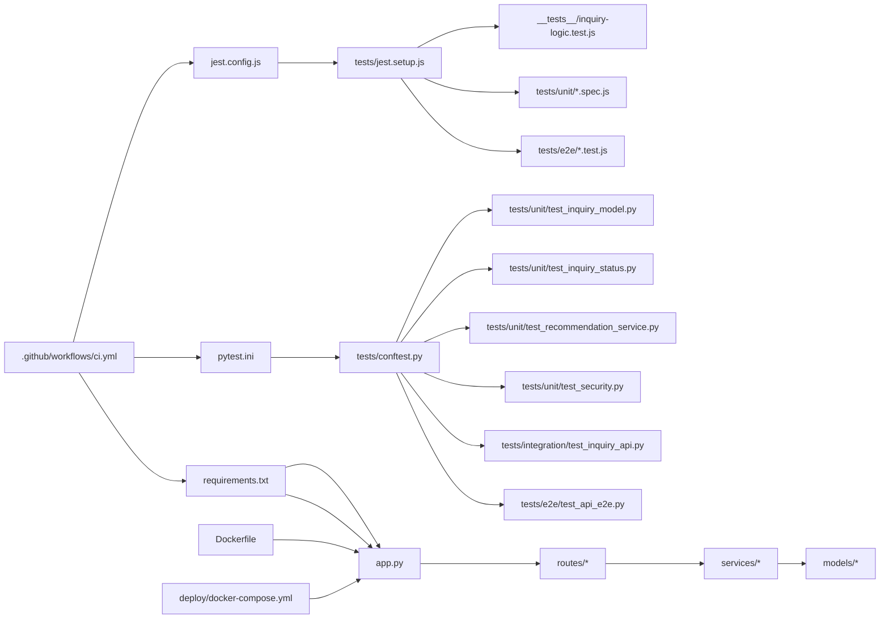

# 测试策略

<cite>
**本文引用的文件**
- [pytest.ini](file://pytest.ini)
- [tests/conftest.py](file://tests/conftest.py)
- [tests/unit/test_inquiry_model.py](file://tests/unit/test_inquiry_model.py)
- [tests/unit/test_inquiry_status.py](file://tests/unit/test_inquiry_status.py)
- [tests/unit/test_recommendation_service.py](file://tests/unit/test_recommendation_service.py)
- [tests/unit/test_security.py](file://tests/unit/test_security.py)
- [tests/integration/test_inquiry_api.py](file://tests/integration/test_inquiry_api.py)
- [tests/e2e/test_api_e2e.py](file://tests/e2e/test_api_e2e.py)
- [tests/account/account_api_validator.py](file://tests/account/account_api_validator.py)
- [tests/account/account_test_data.py](file://tests/account/account_test_data.py)
- [tests/test_fixes.py](file://tests/test_fixes.py)
- [tests/test_refactor.py](file://tests/test_refactor.py)
- [.github/workflows/ci.yml](file://.github/workflows/ci.yml)
- [jest.config.js](file://jest.config.js)
- [tests/jest.setup.js](file://tests/jest.setup.js)
- [package.json](file://package.json)
- [requirements.txt](file://requirements.txt)
- [__tests__/inquiry-logic.test.js](file://__tests__/inquiry-logic.test.js)
- [tests/test_account.py](file://tests/test_account.py)
- [tests/test_auth.py](file://tests/test_auth.py)
- [tests/test_group_api.py](file://tests/test_group_api.py)
- [tests/test_group_permissions.py](file://tests/test_group_permissions.py)
- [tests/test_security_config.py](file://tests/test_security_config.py)
- [tests/test_sina_quotes.py](file://tests/test_sina_quotes.py)
- [tests/test_admin_api.py](file://tests/test_admin_api.py)
- [tests/e2e/quote.e2e.test.js](file://tests/e2e/quote.e2e.test.js)
- [tests/unit/quote-index.spec.js](file://tests/unit/quote-index.spec.js)
- [tests/unit/search.spec.js](file://tests/unit/search.spec.js)
- [locustfile.py](file://locustfile.py)
- [Dockerfile](file://Dockerfile)
- [deploy/docker-compose.yml](file://deploy/docker-compose.yml)
</cite>

## 更新摘要
**所做更改**
- 新增pytest测试框架配置和完整测试体系
- 添加单元测试、集成测试和端到端测试的详细实现
- 增强安全测试和账户功能测试覆盖
- 完善测试数据管理和测试夹具配置
- 更新测试覆盖率要求和报告生成方法

## 目录
1. [引言](#引言)
2. [项目结构](#项目结构)
3. [核心组件](#核心组件)
4. [架构总览](#架构总览)
5. [详细组件分析](#详细组件分析)
6. [依赖关系分析](#依赖关系分析)
7. [性能考虑](#性能考虑)
8. [故障排查指南](#故障排查指南)
9. [结论](#结论)
10. [附录](#附录)

## 引言
本测试策略文档旨在为场外期权系统建立完善的测试体系与质量保证流程，覆盖单元测试、集成测试、端到端测试、性能与压力测试，并明确测试覆盖率与报告生成、自动化测试在 CI/CD 中的执行方式以及测试数据管理最佳实践。文档同时给出可操作的测试用例设计原则与落地建议，帮助团队持续提升系统稳定性与可靠性。

**更新** 新增pytest测试框架配置、完整的单元测试套件、集成测试和端到端测试体系，包括询价模型测试、状态机测试、推荐服务测试、安全测试、账户功能测试等。

## 项目结构
当前仓库包含多语言与多层技术栈的测试实践：
- 前端与小程序：基于 Jest 的单元测试与模拟环境配置
- 后端 Flask 应用：Python unittest 单元测试与 API 接口测试
- pytest测试框架：现代化的Python测试框架，支持更丰富的测试特性
- 安全测试：全面的安全防护测试，包括XSS、CSRF、SQL注入等
- 账户功能测试：基于真实用户数据的账户功能验证器
- 性能测试：Locust 压力与负载测试脚本
- CI/CD：GitHub Actions 工作流，分别运行前端与后端测试

**图表来源**
- [pytest.ini:1-26](file://pytest.ini#L1-L26)
- [tests/conftest.py:1-134](file://tests/conftest.py#L1-L134)
- [tests/unit/test_security.py:1-389](file://tests/unit/test_security.py#L1-L389)
- [tests/account/account_api_validator.py:1-810](file://tests/account/account_api_validator.py#L1-L810)
- [tests/integration/test_inquiry_api.py:1-453](file://tests/integration/test_inquiry_api.py#L1-L453)
- [tests/e2e/test_api_e2e.py:1-350](file://tests/e2e/test_api_e2e.py#L1-L350)

**章节来源**
- [pytest.ini:1-26](file://pytest.ini#L1-L26)
- [tests/conftest.py:1-134](file://tests/conftest.py#L1-L134)
- [tests/unit/test_security.py:1-389](file://tests/unit/test_security.py#L1-L389)
- [tests/account/account_api_validator.py:1-810](file://tests/account/account_api_validator.py#L1-L810)
- [tests/integration/test_inquiry_api.py:1-453](file://tests/integration/test_inquiry_api.py#L1-L453)
- [tests/e2e/test_api_e2e.py:1-350](file://tests/e2e/test_api_e2e.py#L1-L350)

## 核心组件
- 前端与小程序测试（Jest）
  - 使用 jest.config.js 配置测试环境、匹配规则与全局初始化
  - tests/jest.setup.js 提供小程序 Page、App、wx 存储等 API 的模拟
  - __tests__/inquiry-logic.test.js 展示了对分组校验、统计与迁移逻辑的单元测试
  - tests/unit/ 目录包含报价页面重定向和搜索功能的单元测试
  - tests/e2e/ 目录包含微信小程序端到端测试，使用 miniprogram-automator 进行自动化测试
- 后端 Python 测试（unittest）
  - tests/test_account.py：账户流程端到端（通过 Flask test client）与服务层 Mock
  - tests/test_auth.py：密码哈希、验证码生成、管理员登录接口的基本断言
  - tests/test_fixes.py：修复验证测试，包含分组安全验证和 CRUD 操作
  - tests/test_refactor.py：重构集成测试，覆盖管理员登录、微信登录、询价流程和交易流程
  - tests/test_group_api.py：路由层 API 行为与内存模型的集成测试
  - tests/test_group_permissions.py：分组权限测试，验证受保护分组名称和操作的拒绝
  - tests/test_security_config.py：安全配置测试，验证生产环境配置要求
  - tests/test_sina_quotes.py：新浪行情解析测试，验证代码标准化、数据解析和报价转换
  - tests/test_admin_api.py：管理员 API 测试，包含健康检查、统计信息和分页验证
- pytest测试框架
  - pytest.ini：配置测试路径、匹配规则、覆盖率要求和警告过滤
  - tests/conftest.py：配置测试夹具、数据库模拟、认证头和测试环境变量
  - 单元测试：询价模型测试、状态机测试、推荐服务测试、安全测试
  - 集成测试：API集成测试，覆盖完整的业务流程
  - 端到端测试：基于pytest的E2E测试，包含认证、询价、推荐等完整流程
- 安全测试
  - XSS防护测试：HTML实体编码、危险标签移除、事件处理器清理
  - CSRF保护测试：Token生成与验证、会话绑定、过期处理
  - SQL注入检测：危险模式识别、参数验证、请求数据净化
  - 文件上传验证：扩展名检查、大小限制、路径穿越防护
- 账户功能测试
  - account_api_validator.py：基于真实用户数据的全面功能验证器
  - account_test_data.py：真实用户数据工厂、登录历史生成器、测试场景
  - 支持微信登录、手机号登录、邮箱登录、管理员登录、游客模式等
- 性能测试（Locust）
  - locustfile.py：定义用户行为、任务权重与请求路径，支持并发与延时控制
- CI/CD（GitHub Actions）
  - .github/workflows/ci.yml：分别在 admin-ui 与 Python 环境中执行 Lint、测试与构建

**章节来源**
- [pytest.ini:1-26](file://pytest.ini#L1-L26)
- [tests/conftest.py:1-134](file://tests/conftest.py#L1-L134)
- [tests/unit/test_inquiry_model.py:1-288](file://tests/unit/test_inquiry_model.py#L1-L288)
- [tests/unit/test_inquiry_status.py:1-162](file://tests/unit/test_inquiry_status.py#L1-L162)
- [tests/unit/test_recommendation_service.py:1-442](file://tests/unit/test_recommendation_service.py#L1-L442)
- [tests/unit/test_security.py:1-389](file://tests/unit/test_security.py#L1-L389)
- [tests/integration/test_inquiry_api.py:1-453](file://tests/integration/test_inquiry_api.py#L1-L453)
- [tests/e2e/test_api_e2e.py:1-350](file://tests/e2e/test_api_e2e.py#L1-L350)
- [tests/account/account_api_validator.py:1-810](file://tests/account/account_api_validator.py#L1-L810)
- [tests/account/account_test_data.py:1-386](file://tests/account/account_test_data.py#L1-L386)

## 架构总览
下图展示了测试体系在 CI/CD 中的执行顺序与各组件之间的关系：

**图表来源**
- [.github/workflows/ci.yml:1-35](file://.github/workflows/ci.yml#L1-L35)
- [pytest.ini:1-26](file://pytest.ini#L1-L26)
- [tests/conftest.py:1-134](file://tests/conftest.py#L1-L134)

**章节来源**
- [.github/workflows/ci.yml:1-35](file://.github/workflows/ci.yml#L1-L35)

## 详细组件分析

### pytest测试框架
- 配置要点
  - 测试路径：tests 目录
  - 匹配规则：test_*.py、Test* 类、test_* 函数
  - 覆盖率要求：--cov-fail-under=80，确保代码覆盖率不低于80%
  - 警告过滤：忽略 DeprecationWarning 和 PendingDeprecationWarning
  - 覆盖率配置：排除 tests/*、node_modules/*、__pycache__/* 等目录
- 测试夹具（fixtures）
  - app：创建测试Flask应用，配置 TESTING 和 DEBUG 环境
  - client：测试客户端，用于HTTP请求测试
  - runner：测试CLI运行器
  - mock_db：模拟MongoDB客户端
  - mock_cloud_db：模拟云数据库客户端
  - auth_headers：生成认证请求头，包含JWT token
  - sample_*：各种测试数据样本，如询价、行情、用户数据
  - 自动环境设置：设置 NODE_ENV、JWT_SECRET、SECRET_KEY 等环境变量

**图表来源**
- [pytest.ini:1-26](file://pytest.ini#L1-L26)
- [tests/conftest.py:1-134](file://tests/conftest.py#L1-L134)

**章节来源**
- [pytest.ini:1-26](file://pytest.ini#L1-L26)
- [tests/conftest.py:1-134](file://tests/conftest.py#L1-L134)

### 单元测试套件
- 询价模型测试（TestInquiryModel）
  - 模型初始化：支持本地模式和云模式
  - 数据库操作：创建、查询、更新询价记录
  - 状态管理：状态更新并记录历史
  - 用户关联：关联询价到用户，批量关联功能
  - 边界条件：空数据库、None值处理
- 询价状态机测试（TestInquiryStatus）
  - 状态枚举：PENDING、PROCESSING、QUOTED、COMPLETED、REJECTED
  - 状态标签：中文标签获取
  - 颜色映射：不同状态的颜色标识
  - 状态流转：合法流转验证、非法流转检测
  - 终态检查：已完成和拒绝状态不可逆
- 推荐服务测试（TestRecommendationService）
  - 执行价推荐：看涨看跌期权的ATM、ITM、OTM推荐
  - 期限推荐：基于投资期限、市场观点的风险评估
  - 策略推荐：雪球、凤凰等期权策略推荐
  - 交易商匹配：基于产品类型、金额、紧急程度的匹配
  - 价格估算：期权费估算、希腊字母计算
- 安全测试（TestSecurity）
  - XSS防护：HTML实体编码、危险标签移除
  - CSRF保护：Token生成、验证、过期处理
  - SQL注入检测：危险模式识别、参数验证
  - 数据脱敏：手机号、邮箱、身份证号脱敏
  - 文件上传验证：扩展名、大小、路径检查

**章节来源**
- [tests/unit/test_inquiry_model.py:1-288](file://tests/unit/test_inquiry_model.py#L1-L288)
- [tests/unit/test_inquiry_status.py:1-162](file://tests/unit/test_inquiry_status.py#L1-L162)
- [tests/unit/test_recommendation_service.py:1-442](file://tests/unit/test_recommendation_service.py#L1-L442)
- [tests/unit/test_security.py:1-389](file://tests/unit/test_security.py#L1-L389)

### 集成测试
- 询价API集成测试（TestInquiryCreateAPI）
  - 成功创建询价：验证200/201状态码
  - 参数验证：缺少产品信息、无效手机号、超限金额等
  - 业务规则：行权价限制、名义本金限制
  - 错误处理：400参数错误、401认证错误
- 询价查询API测试（TestInquiryQueryAPI）
  - 用户列表查询：按状态筛选、分页处理
  - 详情查询：存在性和不存在的情况
  - 权限验证：用户和管理员权限区分
- 状态更新API测试（TestInquiryStatusUpdateAPI）
  - 管理员权限：状态更新需要管理员token
  - 状态流转：合法和非法状态转换验证
  - 历史记录：状态变更记录保存
- 批量操作测试（TestBatchOperationsAPI）
  - 批量更新：ID列表验证、数量限制
  - 错误处理：空ID列表、超限ID数量
- 限流测试（TestRateLimiting）
  - 并发请求：触发限流机制
  - 速率控制：防止滥用和攻击
- 响应格式测试（TestResponseFormat）
  - 统一响应格式：success/data/message/error字段
  - 错误响应格式：一致性验证

**章节来源**
- [tests/integration/test_inquiry_api.py:1-453](file://tests/integration/test_inquiry_api.py#L1-L453)

### 端到端测试（pytest）
- E2E测试配置
  - --run-e2e 选项：控制E2E测试执行
  - 基础URL配置：http://localhost:5000
  - 测试用户：手机号+验证码测试账户
- 认证流程测试（TestAuthFlow）
  - 健康检查：系统可用性验证
  - 登录流程：验证码发送、登录、用户信息获取
  - 跳过机制：未设置--run-e2e时不执行
- 询价流程测试（TestInquiryFlow）
  - 完整流程：创建询价→查询详情→获取列表
  - 认证头：自动获取和使用token
  - 错误处理：401未认证、404不存在等情况
- 推荐服务测试（TestRecommendationFlow）
  - 行权价推荐：基于标的物和期权类型的推荐
  - 期限推荐：投资期限和市场观点的综合评估
  - 价格估算：希腊字母和期权费估算
- 安全性测试（TestSecurityFlow）
  - 速率限制：并发请求测试
  - SQL注入防护：恶意输入测试
  - XSS防护：跨站脚本攻击测试
- 性能测试（TestPerformance）
  - 响应时间：健康检查响应时间验证
  - 并发请求：20个并发请求测试
  - 性能基准：响应时间<2秒的要求

**章节来源**
- [tests/e2e/test_api_e2e.py:1-350](file://tests/e2e/test_api_e2e.py#L1-L350)

### 账户功能测试
- 账户API验证器（AccountAPIValidator）
  - 认证功能：微信登录、手机号验证码登录、邮箱密码登录、管理员登录、游客登录
  - 用户资料：获取和更新用户信息
  - 安全功能：登出、修改密码、Token黑名单机制
  - 设备管理：获取登录设备列表、撤销指定设备
  - 登录历史：获取登录历史记录
  - 安全验证：XSS防护、SQL注入防护、角色权限控制
  - 数据完整性：用户数据结构和类型验证
- 真实用户数据工厂（RealUserDataFactory）
  - 微信用户：OpenID、昵称、头像、VIP等级
  - 手机号用户：手机号、密码、用户统计信息
  - 邮箱用户：邮箱地址、密码、用户统计信息
  - 游客用户：临时用户ID、游客角色
  - 管理员用户：用户名、密码、权限信息
- 测试数据场景（TestDataScenarios）
  - 正常场景：新用户、活跃用户、VIP用户、企业用户
  - 边界场景：零余额、最大余额、长昵称、特殊字符昵称
  - 安全场景：XSS攻击、SQL注入、CSRF攻击、角色欺骗
  - 性能场景：批量用户、并发登录用户

**章节来源**
- [tests/account/account_api_validator.py:1-810](file://tests/account/account_api_validator.py#L1-L810)
- [tests/account/account_test_data.py:1-386](file://tests/account/account_test_data.py#L1-L386)

### 前端与小程序测试（Jest）
- 配置要点
  - 测试环境：Node 环境
  - 匹配范围：miniprogram 与 tests 目录下的 *.test.js 和 *.spec.js
  - 初始化：加载 tests/jest.setup.js，注入小程序 Page、App 与 wx 存储等模拟对象
  - 时钟：启用 fakeTimers，便于时间相关逻辑测试
- 典型用例
  - 分组校验与迁移：覆盖空名、超长名、重名、有效名等边界条件
  - 统计与迁移：从收藏映射计算各分组数量、批量迁移项并保留其他属性
  - 报价页面重定向：测试页面加载时的重定向逻辑
  - 搜索功能去抖：验证连续调用在300ms内的去抖机制
  - 搜索历史管理：测试去重和长度限制功能
- 最佳实践
  - 为每个页面或工具模块编写独立测试文件，聚焦单一职责
  - 使用 describe/it 分层组织用例，清晰标注前置条件与期望结果
  - 对异步与定时逻辑使用 fakeTimers 控制时序

**章节来源**
- [jest.config.js:1-10](file://jest.config.js#L1-L10)
- [tests/jest.setup.js:1-13](file://tests/jest.setup.js#L1-L13)
- [tests/unit/quote-index.spec.js:1-18](file://tests/unit/quote-index.spec.js#L1-L18)
- [tests/unit/search.spec.js:1-48](file://tests/unit/search.spec.js#L1-L48)
- [__tests__/inquiry-logic.test.js:1-174](file://__tests__/inquiry-logic.test.js#L1-L174)

### 后端 Python 测试（unittest）
- 账户流程测试（端到端）
  - 使用 Flask test client 发起请求
  - Mock JWT 解码、MongoDB 集合与实时行情服务，隔离外部依赖
  - 覆盖登录、账户概览、充值、提现、交易历史等链路
- 认证与验证码测试
  - 断言密码哈希前缀与校验逻辑
  - 验证码图片生成格式
  - 管理员登录接口返回 JSON 结构
- 修复验证测试
  - 分组安全验证：测试无令牌访问分组路由应返回401
  - 分组 CRUD 操作：创建、列出、更新、添加成员、删除的完整流程
  - 客户扩展功能：创建客户、批量重命名分组、删除客户
- 重构集成测试
  - 管理员登录：验证管理员凭据和令牌生成
  - 微信登录：模拟微信授权流程和用户注册
  - 询价流程：应用创建询价和管理员列表查看
  - 交易流程：订单创建和持仓查询
- 分组 API 集成测试
  - 使用内存模型替代真实数据库，通过 patch 替换路由层依赖
  - 覆盖创建、查询、更新、删除与成员添加等完整 CRUD 场景
- 权限测试
  - 受保护分组名称拒绝：验证特定名称的分组创建被拒绝
  - 分组更新权限：验证受保护分组的更新操作被拒绝
  - 分组删除权限：验证受保护分组的删除操作被拒绝
- 安全配置测试
  - 生产环境密钥验证：测试 SECRET_KEY 环境变量的强制要求
- 新浪行情测试
  - 代码标准化：验证股票代码格式转换
  - 数据解析：测试新浪行情数据解析
  - 报价转换：验证字段到报价对象的转换
- 管理员 API 测试
  - 健康检查：验证系统健康状态
  - 统计信息：测试管理员统计数据接口
  - 分页验证：验证分页参数的验证逻辑

**章节来源**
- [tests/test_account.py:1-103](file://tests/test_account.py#L1-L103)
- [tests/test_auth.py:1-69](file://tests/test_auth.py#L1-L69)
- [tests/test_fixes.py:1-96](file://tests/test_fixes.py#L1-L96)
- [tests/test_refactor.py:1-151](file://tests/test_refactor.py#L1-L151)
- [tests/test_group_api.py:1-158](file://tests/test_group_api.py#L1-L158)
- [tests/test_group_permissions.py:1-76](file://tests/test_group_permissions.py#L1-L76)
- [tests/test_security_config.py:1-38](file://tests/test_security_config.py#L1-L38)
- [tests/test_sina_quotes.py:1-46](file://tests/test_sina_quotes.py#L1-L46)
- [tests/test_admin_api.py:1-54](file://tests/test_admin_api.py#L1-L54)

### 端到端测试（小程序）
- 测试框架：使用 miniprogram-automator 进行微信小程序自动化测试
- 环境检测：通过 RUN_MINIPROGRAM_E2E 环境变量控制测试执行
- 测试场景：
  - 报价页面启动：验证页面启动和标签切换
  - Tab 切换与筛选器：测试表格数据和筛选器交互
  - 搜索到详情：验证搜索功能和详情页面跳转
  - 询价弹窗：测试询价弹窗的显示和关闭
- 执行条件：需要微信开发者工具 CLI 路径存在才执行 E2E 测试

**章节来源**
- [tests/e2e/quote.e2e.test.js:1-67](file://tests/e2e/quote.e2e.test.js#L1-L67)

### 性能与压力测试（Locust）
- 用户行为定义
  - 登录后携带 Token
  - 搜索行情、查询账户、查询持仓、计算希腊字母等任务
  - 任务权重与等待时间可调，模拟真实用户行为
- 执行方式
  - 在本地或专用压测环境启动 Locust，访问 Web 控制台配置用户数与 Spawn 速率
  - 关注关键接口的响应时间、吞吐量与错误率

**章节来源**
- [locustfile.py:1-38](file://locustfile.py#L1-L38)

### 测试数据管理与环境配置
- 测试环境变量
  - NODE_ENV=testing，SKIP_DB_INIT=1，避免真实数据库初始化
  - JWT_SECRET=test-secret 用于测试环境的 JWT 密钥
- 数据准备
  - 使用内存模型或 Mock 替代 MongoDB，减少依赖耦合
  - 对外部服务（如实时行情）进行 Mock，确保测试可重复
- 测试隔离
  - 使用 app_context 与 setUp/tearDown 管理 Flask 上下文
  - 对路由层依赖使用 patch 进行替换，避免真实数据库交互
- 端到端测试环境
  - 通过环境变量控制测试执行，避免在 CI 环境中不必要的测试运行
- pytest测试配置
  - 覆盖率要求：--cov-fail-under=80，确保代码覆盖率不低于80%
  - 警告过滤：忽略 DeprecationWarning 和 PendingDeprecationWarning
  - 自动环境设置：使用 autouse fixture 设置测试环境变量

**章节来源**
- [pytest.ini:1-26](file://pytest.ini#L1-L26)
- [tests/conftest.py:126-134](file://tests/conftest.py#L126-L134)
- [tests/test_account.py:1-103](file://tests/test_account.py#L1-L103)
- [tests/test_refactor.py:1-151](file://tests/test_refactor.py#L1-L151)
- [tests/test_group_api.py:1-158](file://tests/test_group_api.py#L1-L158)
- [tests/e2e/quote.e2e.test.js:1-67](file://tests/e2e/quote.e2e.test.js#L1-L67)

## 依赖关系分析
- 前端测试依赖
  - jest.config.js 决定测试根目录、匹配规则与初始化脚本
  - tests/jest.setup.js 注入小程序运行时 API，使测试可在 Node 环境下运行
  - package.json 提供 Jest、miniprogram-automator 等前端测试依赖
- 后端测试依赖
  - requirements.txt 提供 Flask、Mongo、JWT 等依赖
  - pytest.ini 提供 pytest 配置和覆盖率要求
  - tests/conftest.py 提供测试夹具和环境配置
  - app.py 提供 Flask 应用入口，unittest 通过 test_client 发起请求
  - 多个测试文件依赖不同的服务模块和路由模块
- CI/CD 依赖
  - GitHub Actions 分别在 admin-ui 与 Python 环境执行 Lint、测试与构建
  - Dockerfile 与 docker-compose.yml 支持本地联调与生产镜像构建

**图表来源**
- [pytest.ini:1-26](file://pytest.ini#L1-L26)
- [tests/conftest.py:1-134](file://tests/conftest.py#L1-L134)
- [jest.config.js:1-10](file://jest.config.js#L1-L10)
- [tests/jest.setup.js:1-13](file://tests/jest.setup.js#L1-L13)
- [requirements.txt:1-12](file://requirements.txt#L1-L12)
- [app.py](file://app.py)
- [routes/*](file://routes/__init__.py)
- [services/*](file://services/__init__.py)
- [models/*](file://models/__init__.py)
- [.github/workflows/ci.yml:1-35](file://.github/workflows/ci.yml#L1-L35)
- [Dockerfile:1-48](file://Dockerfile#L1-L48)
- [deploy/docker-compose.yml:1-42](file://deploy/docker-compose.yml#L1-L42)

**章节来源**
- [pytest.ini:1-26](file://pytest.ini#L1-L26)
- [tests/conftest.py:1-134](file://tests/conftest.py#L1-L134)
- [jest.config.js:1-10](file://jest.config.js#L1-L10)
- [tests/jest.setup.js:1-13](file://tests/jest.setup.js#L1-L13)
- [requirements.txt:1-12](file://requirements.txt#L1-L12)
- [.github/workflows/ci.yml:1-35](file://.github/workflows/ci.yml#L1-L35)
- [Dockerfile:1-48](file://Dockerfile#L1-L48)
- [deploy/docker-compose.yml:1-42](file://deploy/docker-compose.yml#L1-L42)

## 性能考虑
- 压测目标
  - 关键接口：行情搜索、账户查询、持仓查询、希腊字母计算
  - 指标：平均响应时间、P95/P99 延迟、吞吐量、错误率
- 执行建议
  - 使用 Locust 的任务权重模拟真实用户行为
  - 逐步增加并发用户数，观察系统瓶颈（CPU、内存、数据库连接池）
  - 与 CI/CD 集成，设置阈值告警，防止回归
- pytest性能测试
  - E2E测试中的并发请求测试，验证系统在高并发下的稳定性
  - 响应时间测试，确保关键操作在合理时间内完成

**章节来源**
- [locustfile.py:1-38](file://locustfile.py#L1-L38)
- [tests/e2e/test_api_e2e.py:300-337](file://tests/e2e/test_api_e2e.py#L300-L337)

## 故障排查指南
- 前端测试常见问题
  - Page/wx API 未注入：检查 jest.setup.js 是否正确加载
  - 测试无法匹配：核对 jest.config.js 的 roots 与 testMatch
  - 端到端测试未执行：检查 RUN_MINIPROGRAM_E2E 环境变量和微信开发者工具路径
- 后端测试常见问题
  - 数据库连接失败：确认 NODE_ENV=testing 且 SKIP_DB_INIT=1
  - 路由层依赖缺失：使用 patch 替换 get_model/get_current_user_id
  - JWT 验证失败：检查 JWT_SECRET 环境变量设置
  - pytest夹具问题：检查 conftest.py 中的fixture定义和导入
- pytest测试常见问题
  - 覆盖率不足：检查 pytest.ini 中的覆盖率配置和 --cov-fail-under 设置
  - 测试数据问题：验证 conftest.py 中的sample_* fixtures是否正确
  - 环境变量问题：确认 autouse fixture是否正确设置了测试环境变量
- CI/CD 常见问题
  - Node/Python 版本不一致：核对 GitHub Actions 与本地版本
  - 依赖安装失败：检查 requirements.txt 与 package.json 的依赖版本
  - 环境变量缺失：确保测试所需的环境变量在 CI 环境中正确配置

**章节来源**
- [pytest.ini:1-26](file://pytest.ini#L1-L26)
- [tests/conftest.py:1-134](file://tests/conftest.py#L1-L134)
- [jest.config.js:1-10](file://jest.config.js#L1-L10)
- [tests/jest.setup.js:1-13](file://tests/jest.setup.js#L1-L13)
- [tests/test_account.py:1-103](file://tests/test_account.py#L1-L103)
- [tests/test_refactor.py:1-151](file://tests/test_refactor.py#L1-L151)
- [tests/test_group_api.py:1-158](file://tests/test_group_api.py#L1-L158)
- [tests/e2e/quote.e2e.test.js:1-67](file://tests/e2e/quote.e2e.test.js#L1-L67)
- [.github/workflows/ci.yml:1-35](file://.github/workflows/ci.yml#L1-L35)

## 结论
本测试策略以 Jest 与 unittest 为核心，结合 pytest 测试框架、Locust 性能测试与 GitHub Actions 自动化流水线，形成了覆盖单元、集成、端到端与性能的完整测试体系。通过 Mock 与内存模型隔离外部依赖，配合 CI/CD 的统一执行，能够持续保障系统质量与稳定性。

**新增的pytest测试框架**提供了更现代化的测试体验，支持丰富的测试夹具、更好的错误报告和覆盖率统计。**完整的测试套件**进一步完善了测试覆盖范围，包括询价模型、状态机、推荐服务、安全防护、账户功能等多个关键功能领域。

**增强的安全测试**涵盖了XSS、CSRF、SQL注入等常见安全威胁的防护验证。**基于真实用户数据的账户功能测试**确保了用户认证、权限控制、数据安全等核心功能的正确性。

后续建议补充更详细的测试覆盖率报告、完善E2E测试套件，并在 CI 中加入性能回归阈值，以进一步提升测试体系的完整性和有效性。

## 附录
- 测试用例设计原则
  - 单一职责：每个用例聚焦一个功能点或边界条件
  - 可重复：使用 Mock 与固定种子数据，避免随机性
  - 可读性：用例命名清晰，前置条件与断言明确
  - 全面性：覆盖正常流程、异常处理和边界条件
  - 可维护性：使用pytest夹具和测试数据工厂，提高代码复用性
- 测试数据管理最佳实践
  - 使用内存模型或 Mock 替代真实数据库
  - 对外部服务进行 Mock，确保测试可重复
  - 在 CI 中使用只读环境变量控制测试模式
  - E2E 测试通过环境变量控制执行，避免不必要的资源消耗
  - 使用测试数据工厂生成真实场景的测试数据
- 测试分类与覆盖范围
  - 单元测试：服务层逻辑、工具函数、业务规则
  - 集成测试：API 接口、路由层、数据库交互
  - 端到端测试：用户流程、页面交互、小程序功能
  - 安全测试：XSS防护、CSRF保护、SQL注入检测、文件上传验证
  - 账户测试：认证流程、权限控制、数据完整性验证
  - 性能测试：负载能力、响应时间、并发处理
- 测试覆盖率要求
  - pytest覆盖率：--cov-fail-under=80，确保代码覆盖率不低于80%
  - 覆盖率配置：排除测试目录、node_modules、缓存目录等
  - 报告生成：term-missing格式，显示未覆盖的代码行
- 测试报告生成
  - pytest：使用-v详细输出，--tb=short简化回溯信息
  - 覆盖率：term-missing显示未覆盖代码，支持fail-under阈值
  - 前端测试：Jest内置报告，支持HTML和JSON格式
  - 性能测试：Locust Web界面，支持实时监控和报告导出