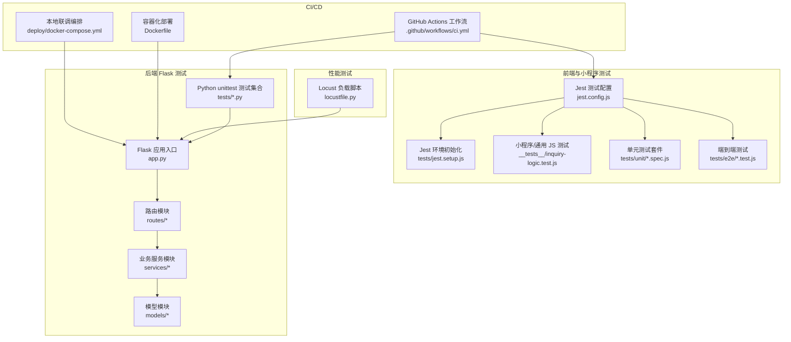
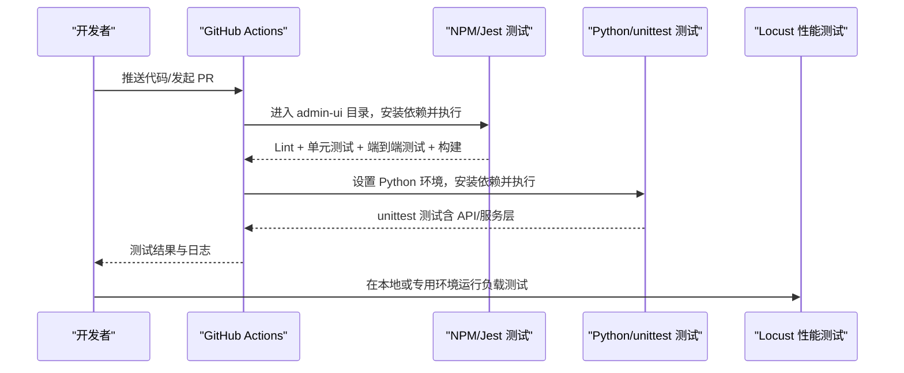
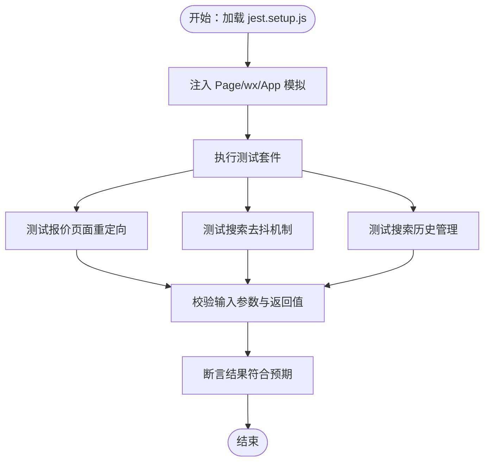
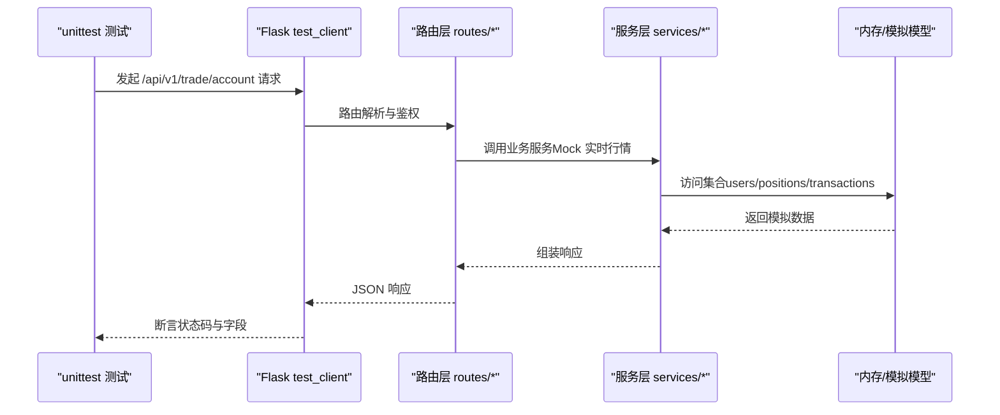
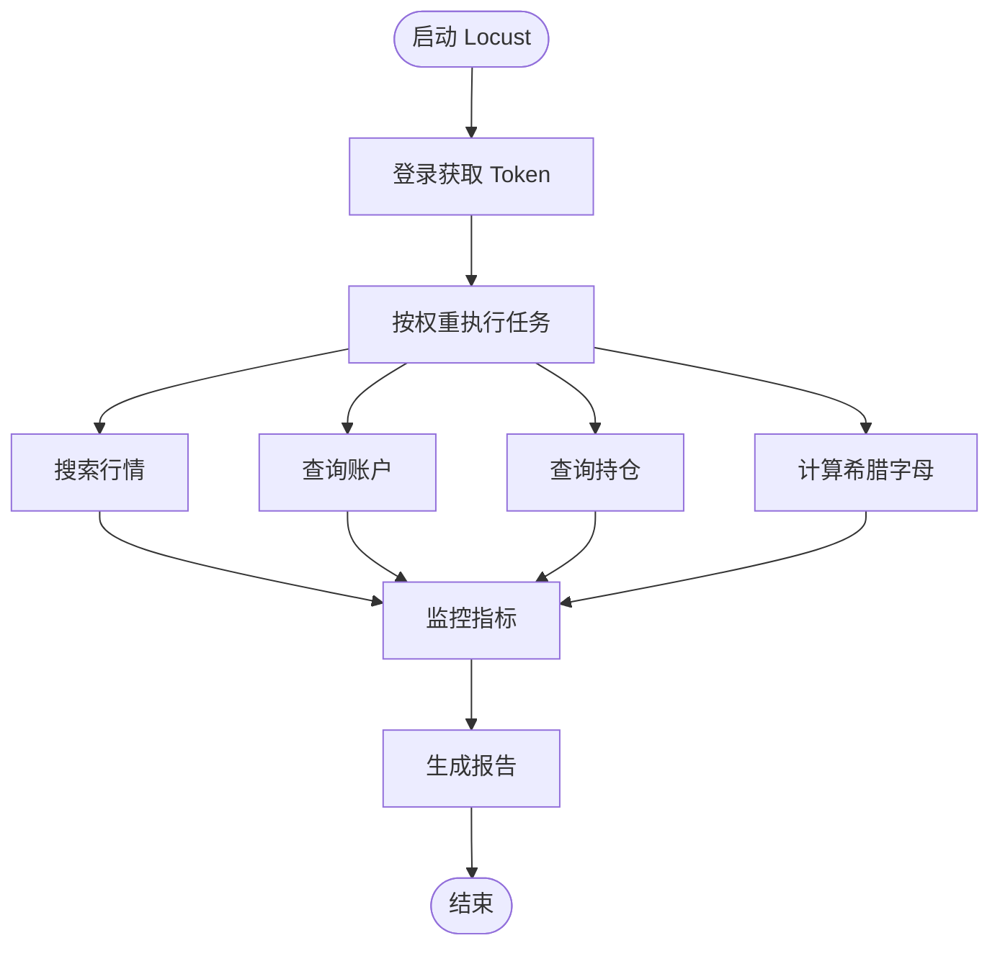
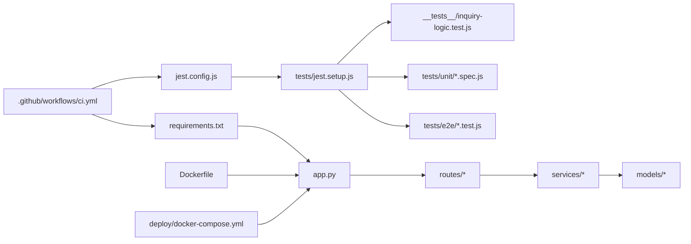

# 测试策略

<cite>
**本文引用的文件**
- [.github/workflows/ci.yml](file://.github/workflows/ci.yml)
- [jest.config.js](file://jest.config.js)
- [tests/jest.setup.js](file://tests/jest.setup.js)
- [package.json](file://package.json)
- [requirements.txt](file://requirements.txt)
- [__tests__/inquiry-logic.test.js](file://__tests__/inquiry-logic.test.js)
- [tests/test_account.py](file://tests/test_account.py)
- [tests/test_auth.py](file://tests/test_auth.py)
- [tests/test_fixes.py](file://tests/test_fixes.py)
- [tests/test_refactor.py](file://tests/test_refactor.py)
- [tests/test_group_api.py](file://tests/test_group_api.py)
- [tests/test_group_permissions.py](file://tests/test_group_permissions.py)
- [tests/test_security_config.py](file://tests/test_security_config.py)
- [tests/test_sina_quotes.py](file://tests/test_sina_quotes.py)
- [tests/test_admin_api.py](file://tests/test_admin_api.py)
- [tests/e2e/quote.e2e.test.js](file://tests/e2e/quote.e2e.test.js)
- [tests/unit/quote-index.spec.js](file://tests/unit/quote-index.spec.js)
- [tests/unit/search.spec.js](file://tests/unit/search.spec.js)
- [locustfile.py](file://locustfile.py)
- [Dockerfile](file://Dockerfile)
- [deploy/docker-compose.yml](file://deploy/docker-compose.yml)
</cite>

## 目录
1. [引言](#引言)
2. [项目结构](#项目结构)
3. [核心组件](#核心组件)
4. [架构总览](#架构总览)
5. [详细组件分析](#详细组件分析)
6. [依赖关系分析](#依赖关系分析)
7. [性能考虑](#性能考虑)
8. [故障排查指南](#故障排查指南)
9. [结论](#结论)
10. [附录](#附录)

## 引言
本测试策略文档旨在为场外期权系统建立完善的测试体系与质量保证流程，覆盖单元测试、集成测试、端到端测试、性能与压力测试，并明确测试覆盖率与报告生成、自动化测试在 CI/CD 中的执行方式以及测试数据管理最佳实践。文档同时给出可操作的测试用例设计原则与落地建议，帮助团队持续提升系统稳定性与可靠性。

**更新** 新增多个测试文件，包括账户管理测试、认证测试、修复验证测试、重构集成测试、分组API测试、权限测试、安全配置测试、新浪行情测试、管理员API测试、端到端测试和单元测试套件，以及负载测试脚本。

## 项目结构
当前仓库包含多语言与多层技术栈的测试实践：
- 前端与小程序：基于 Jest 的单元测试与模拟环境配置
- 后端 Flask 应用：Python unittest 单元测试与 API 接口测试
- 性能测试：Locust 压力与负载测试脚本
- CI/CD：GitHub Actions 工作流，分别运行前端与后端测试

**图表来源**
- [jest.config.js](file://jest.config.js#L1-L10)
- [tests/jest.setup.js](file://tests/jest.setup.js#L1-L13)
- [__tests__/inquiry-logic.test.js](file://__tests__/inquiry-logic.test.js#L1-L174)
- [tests/unit/quote-index.spec.js](file://tests/unit/quote-index.spec.js#L1-L18)
- [tests/unit/search.spec.js](file://tests/unit/search.spec.js#L1-L48)
- [tests/e2e/quote.e2e.test.js](file://tests/e2e/quote.e2e.test.js#L1-L67)
- [tests/test_account.py](file://tests/test_account.py#L1-L103)
- [tests/test_auth.py](file://tests/test_auth.py#L1-L69)
- [tests/test_fixes.py](file://tests/test_fixes.py#L1-L96)
- [tests/test_refactor.py](file://tests/test_refactor.py#L1-L151)
- [tests/test_group_api.py](file://tests/test_group_api.py#L1-L158)
- [tests/test_group_permissions.py](file://tests/test_group_permissions.py#L1-L76)
- [tests/test_security_config.py](file://tests/test_security_config.py#L1-L38)
- [tests/test_sina_quotes.py](file://tests/test_sina_quotes.py#L1-L46)
- [tests/test_admin_api.py](file://tests/test_admin_api.py#L1-L54)
- [locustfile.py](file://locustfile.py#L1-L38)
- [.github/workflows/ci.yml](file://.github/workflows/ci.yml#L1-L35)
- [Dockerfile](file://Dockerfile#L1-L48)
- [deploy/docker-compose.yml](file://deploy/docker-compose.yml#L1-L42)

**章节来源**
- [jest.config.js](file://jest.config.js#L1-L10)
- [tests/jest.setup.js](file://tests/jest.setup.js#L1-L13)
- [__tests__/inquiry-logic.test.js](file://__tests__/inquiry-logic.test.js#L1-L174)
- [tests/unit/quote-index.spec.js](file://tests/unit/quote-index.spec.js#L1-L18)
- [tests/unit/search.spec.js](file://tests/unit/search.spec.js#L1-L48)
- [tests/e2e/quote.e2e.test.js](file://tests/e2e/quote.e2e.test.js#L1-L67)
- [tests/test_account.py](file://tests/test_account.py#L1-L103)
- [tests/test_auth.py](file://tests/test_auth.py#L1-L69)
- [tests/test_fixes.py](file://tests/test_fixes.py#L1-L96)
- [tests/test_refactor.py](file://tests/test_refactor.py#L1-L151)
- [tests/test_group_api.py](file://tests/test_group_api.py#L1-L158)
- [tests/test_group_permissions.py](file://tests/test_group_permissions.py#L1-L76)
- [tests/test_security_config.py](file://tests/test_security_config.py#L1-L38)
- [tests/test_sina_quotes.py](file://tests/test_sina_quotes.py#L1-L46)
- [tests/test_admin_api.py](file://tests/test_admin_api.py#L1-L54)
- [locustfile.py](file://locustfile.py#L1-L38)
- [.github/workflows/ci.yml](file://.github/workflows/ci.yml#L1-L35)
- [Dockerfile](file://Dockerfile#L1-L48)
- [deploy/docker-compose.yml](file://deploy/docker-compose.yml#L1-L42)

## 核心组件
- 前端与小程序测试（Jest）
  - 使用 jest.config.js 配置测试环境、匹配规则与全局初始化
  - tests/jest.setup.js 提供小程序 Page、App、wx 存储等 API 的模拟
  - __tests__/inquiry-logic.test.js 展示了对分组校验、统计与迁移逻辑的单元测试
  - tests/unit/ 目录包含报价页面重定向和搜索功能的单元测试
  - tests/e2e/ 目录包含微信小程序端到端测试，使用 miniprogram-automator 进行自动化测试
- 后端 Python 测试（unittest）
  - tests/test_account.py：账户流程端到端（通过 Flask test client）与服务层 Mock
  - tests/test_auth.py：密码哈希、验证码生成、管理员登录接口的基本断言
  - tests/test_fixes.py：修复验证测试，包含分组安全验证和 CRUD 操作
  - tests/test_refactor.py：重构集成测试，覆盖管理员登录、微信登录、询价流程和交易流程
  - tests/test_group_api.py：路由层 API 行为与内存模型的集成测试
  - tests/test_group_permissions.py：分组权限测试，验证受保护分组名称和操作的拒绝
  - tests/test_security_config.py：安全配置测试，验证生产环境配置要求
  - tests/test_sina_quotes.py：新浪行情解析测试，验证代码标准化、数据解析和报价转换
  - tests/test_admin_api.py：管理员 API 测试，包含健康检查、统计信息和分页验证
- 性能测试（Locust）
  - locustfile.py：定义用户行为、任务权重与请求路径，支持并发与延时控制
- CI/CD（GitHub Actions）
  - .github/workflows/ci.yml：分别在 admin-ui 与 Python 环境中执行 Lint、测试与构建

**章节来源**
- [jest.config.js](file://jest.config.js#L1-L10)
- [tests/jest.setup.js](file://tests/jest.setup.js#L1-L13)
- [__tests__/inquiry-logic.test.js](file://__tests__/inquiry-logic.test.js#L1-L174)
- [tests/unit/quote-index.spec.js](file://tests/unit/quote-index.spec.js#L1-L18)
- [tests/unit/search.spec.js](file://tests/unit/search.spec.js#L1-L48)
- [tests/e2e/quote.e2e.test.js](file://tests/e2e/quote.e2e.test.js#L1-L67)
- [tests/test_account.py](file://tests/test_account.py#L1-L103)
- [tests/test_auth.py](file://tests/test_auth.py#L1-L69)
- [tests/test_fixes.py](file://tests/test_fixes.py#L1-L96)
- [tests/test_refactor.py](file://tests/test_refactor.py#L1-L151)
- [tests/test_group_api.py](file://tests/test_group_api.py#L1-L158)
- [tests/test_group_permissions.py](file://tests/test_group_permissions.py#L1-L76)
- [tests/test_security_config.py](file://tests/test_security_config.py#L1-L38)
- [tests/test_sina_quotes.py](file://tests/test_sina_quotes.py#L1-L46)
- [tests/test_admin_api.py](file://tests/test_admin_api.py#L1-L54)
- [locustfile.py](file://locustfile.py#L1-L38)
- [.github/workflows/ci.yml](file://.github/workflows/ci.yml#L1-L35)

## 架构总览
下图展示了测试体系在 CI/CD 中的执行顺序与各组件之间的关系：

**图表来源**
- [.github/workflows/ci.yml](file://.github/workflows/ci.yml#L1-L35)
- [jest.config.js](file://jest.config.js#L1-L10)
- [requirements.txt](file://requirements.txt#L1-L12)

**章节来源**
- [.github/workflows/ci.yml](file://.github/workflows/ci.yml#L1-L35)

## 详细组件分析

### 前端与小程序测试（Jest）
- 配置要点
  - 测试环境：Node 环境
  - 匹配范围：miniprogram 与 tests 目录下的 *.test.js 和 *.spec.js
  - 初始化：加载 tests/jest.setup.js，注入小程序 Page、App 与 wx 存储等模拟对象
  - 时钟：启用 fakeTimers，便于时间相关逻辑测试
- 典型用例
  - 分组校验与迁移：覆盖空名、超长名、重名、有效名等边界条件
  - 统计与迁移：从收藏映射计算各分组数量、批量迁移项并保留其他属性
  - 报价页面重定向：测试页面加载时的重定向逻辑
  - 搜索功能去抖：验证连续调用在300ms内的去抖机制
  - 搜索历史管理：测试去重和长度限制功能
- 最佳实践
  - 为每个页面或工具模块编写独立测试文件，聚焦单一职责
  - 使用 describe/it 分层组织用例，清晰标注前置条件与期望结果
  - 对异步与定时逻辑使用 fakeTimers 控制时序

**图表来源**
- [tests/jest.setup.js](file://tests/jest.setup.js#L1-L13)
- [tests/unit/quote-index.spec.js](file://tests/unit/quote-index.spec.js#L1-L18)
- [tests/unit/search.spec.js](file://tests/unit/search.spec.js#L1-L48)
- [__tests__/inquiry-logic.test.js](file://__tests__/inquiry-logic.test.js#L1-L174)

**章节来源**
- [jest.config.js](file://jest.config.js#L1-L10)
- [tests/jest.setup.js](file://tests/jest.setup.js#L1-L13)
- [tests/unit/quote-index.spec.js](file://tests/unit/quote-index.spec.js#L1-L18)
- [tests/unit/search.spec.js](file://tests/unit/search.spec.js#L1-L48)
- [__tests__/inquiry-logic.test.js](file://__tests__/inquiry-logic.test.js#L1-L174)

### 后端 Python 测试（unittest）
- 账户流程测试（端到端）
  - 使用 Flask test client 发起请求
  - Mock JWT 解码、MongoDB 集合与实时行情服务，隔离外部依赖
  - 覆盖登录、账户概览、充值、提现、交易历史等链路
- 认证与验证码测试
  - 断言密码哈希前缀与校验逻辑
  - 验证码图片生成格式
  - 管理员登录接口返回 JSON 结构
- 修复验证测试
  - 分组安全验证：测试无令牌访问分组路由应返回401
  - 分组 CRUD 操作：创建、列出、更新、添加成员、删除的完整流程
  - 客户扩展功能：创建客户、批量重命名分组、删除客户
- 重构集成测试
  - 管理员登录：验证管理员凭据和令牌生成
  - 微信登录：模拟微信授权流程和用户注册
  - 询价流程：应用创建询价和管理员列表查看
  - 交易流程：订单创建和持仓查询
- 分组 API 集成测试
  - 使用内存模型替代真实数据库，通过 patch 替换路由层依赖
  - 覆盖创建、查询、更新、删除与成员添加等完整 CRUD 场景
- 权限测试
  - 受保护分组名称拒绝：验证特定名称的分组创建被拒绝
  - 分组更新权限：验证受保护分组的更新操作被拒绝
  - 分组删除权限：验证受保护分组的删除操作被拒绝
- 安全配置测试
  - 生产环境密钥验证：测试 SECRET_KEY 环境变量的强制要求
- 新浪行情测试
  - 代码标准化：验证股票代码格式转换
  - 数据解析：测试新浪行情数据解析
  - 报价转换：验证字段到报价对象的转换
- 管理员 API 测试
  - 健康检查：验证系统健康状态
  - 统计信息：测试管理员统计数据接口
  - 分页验证：验证分页参数的验证逻辑

**图表来源**
- [tests/test_account.py](file://tests/test_account.py#L1-L103)
- [tests/test_refactor.py](file://tests/test_refactor.py#L1-L151)
- [tests/test_group_api.py](file://tests/test_group_api.py#L1-L158)

**章节来源**
- [tests/test_account.py](file://tests/test_account.py#L1-L103)
- [tests/test_auth.py](file://tests/test_auth.py#L1-L69)
- [tests/test_fixes.py](file://tests/test_fixes.py#L1-L96)
- [tests/test_refactor.py](file://tests/test_refactor.py#L1-L151)
- [tests/test_group_api.py](file://tests/test_group_api.py#L1-L158)
- [tests/test_group_permissions.py](file://tests/test_group_permissions.py#L1-L76)
- [tests/test_security_config.py](file://tests/test_security_config.py#L1-L38)
- [tests/test_sina_quotes.py](file://tests/test_sina_quotes.py#L1-L46)
- [tests/test_admin_api.py](file://tests/test_admin_api.py#L1-L54)

### 端到端测试（小程序）
- 测试框架：使用 miniprogram-automator 进行微信小程序自动化测试
- 环境检测：通过 RUN_MINIPROGRAM_E2E 环境变量控制测试执行
- 测试场景：
  - 报价页面启动：验证页面启动和标签切换
  - Tab 切换与筛选器：测试表格数据和筛选器交互
  - 搜索到详情：验证搜索功能和详情页面跳转
  - 询价弹窗：测试询价弹窗的显示和关闭
- 执行条件：需要微信开发者工具 CLI 路径存在才执行 E2E 测试

**章节来源**
- [tests/e2e/quote.e2e.test.js](file://tests/e2e/quote.e2e.test.js#L1-L67)

### 性能与压力测试（Locust）
- 用户行为定义
  - 登录后携带 Token
  - 搜索行情、查询账户、查询持仓、计算希腊字母等任务
  - 任务权重与等待时间可调，模拟真实用户行为
- 执行方式
  - 在本地或专用压测环境启动 Locust，访问 Web 控制台配置用户数与 Spawn 速率
  - 关注关键接口的响应时间、吞吐量与错误率

**图表来源**
- [locustfile.py](file://locustfile.py#L1-L38)

**章节来源**
- [locustfile.py](file://locustfile.py#L1-L38)

### 测试数据管理与环境配置
- 测试环境变量
  - NODE_ENV=testing，SKIP_DB_INIT=1，避免真实数据库初始化
  - JWT_SECRET=test-secret 用于测试环境的 JWT 密钥
- 数据准备
  - 使用内存模型或 Mock 替代 MongoDB，减少依赖耦合
  - 对外部服务（如实时行情）进行 Mock，确保测试可重复
- 测试隔离
  - 使用 app_context 与 setUp/tearDown 管理 Flask 上下文
  - 对路由层依赖使用 patch 进行替换，避免真实数据库交互
- 端到端测试环境
  - 通过环境变量控制测试执行，避免在 CI 环境中不必要的测试运行

**章节来源**
- [tests/test_account.py](file://tests/test_account.py#L1-L103)
- [tests/test_refactor.py](file://tests/test_refactor.py#L1-L151)
- [tests/test_group_api.py](file://tests/test_group_api.py#L1-L158)
- [tests/e2e/quote.e2e.test.js](file://tests/e2e/quote.e2e.test.js#L1-L67)

## 依赖关系分析
- 前端测试依赖
  - jest.config.js 决定测试根目录、匹配规则与初始化脚本
  - tests/jest.setup.js 注入小程序运行时 API，使测试可在 Node 环境下运行
  - package.json 提供 Jest、miniprogram-automator 等前端测试依赖
- 后端测试依赖
  - requirements.txt 提供 Flask、Mongo、JWT 等依赖
  - app.py 提供 Flask 应用入口，unittest 通过 test_client 发起请求
  - 多个测试文件依赖不同的服务模块和路由模块
- CI/CD 依赖
  - GitHub Actions 分别在 admin-ui 与 Python 环境执行 Lint、测试与构建
  - Dockerfile 与 docker-compose.yml 支持本地联调与生产镜像构建

**图表来源**
- [jest.config.js](file://jest.config.js#L1-L10)
- [tests/jest.setup.js](file://tests/jest.setup.js#L1-L13)
- [__tests__/inquiry-logic.test.js](file://__tests__/inquiry-logic.test.js#L1-L174)
- [tests/unit/quote-index.spec.js](file://tests/unit/quote-index.spec.js#L1-L18)
- [tests/unit/search.spec.js](file://tests/unit/search.spec.js#L1-L48)
- [tests/e2e/quote.e2e.test.js](file://tests/e2e/quote.e2e.test.js#L1-L67)
- [requirements.txt](file://requirements.txt#L1-L12)
- [app.py](file://app.py)
- [routes/*](file://routes/__init__.py)
- [services/*](file://services/__init__.py)
- [models/*](file://models/__init__.py)
- [.github/workflows/ci.yml](file://.github/workflows/ci.yml#L1-L35)
- [Dockerfile](file://Dockerfile#L1-L48)
- [deploy/docker-compose.yml](file://deploy/docker-compose.yml#L1-L42)

**章节来源**
- [jest.config.js](file://jest.config.js#L1-L10)
- [tests/jest.setup.js](file://tests/jest.setup.js#L1-L13)
- [requirements.txt](file://requirements.txt#L1-L12)
- [.github/workflows/ci.yml](file://.github/workflows/ci.yml#L1-L35)
- [Dockerfile](file://Dockerfile#L1-L48)
- [deploy/docker-compose.yml](file://deploy/docker-compose.yml#L1-L42)

## 性能考虑
- 压测目标
  - 关键接口：行情搜索、账户查询、持仓查询、希腊字母计算
  - 指标：平均响应时间、P95/P99 延迟、吞吐量、错误率
- 执行建议
  - 使用 Locust 的任务权重模拟真实用户行为
  - 逐步增加并发用户数，观察系统瓶颈（CPU、内存、数据库连接池）
  - 与 CI/CD 集成，设置阈值告警，防止回归

**章节来源**
- [locustfile.py](file://locustfile.py#L1-L38)

## 故障排查指南
- 前端测试常见问题
  - Page/wx API 未注入：检查 jest.setup.js 是否正确加载
  - 测试无法匹配：核对 jest.config.js 的 roots 与 testMatch
  - 端到端测试未执行：检查 RUN_MINIPROGRAM_E2E 环境变量和微信开发者工具路径
- 后端测试常见问题
  - 数据库连接失败：确认 NODE_ENV=testing 且 SKIP_DB_INIT=1
  - 路由层依赖缺失：使用 patch 替换 get_model/get_current_user_id
  - JWT 验证失败：检查 JWT_SECRET 环境变量设置
- CI/CD 常见问题
  - Node/Python 版本不一致：核对 GitHub Actions 与本地版本
  - 依赖安装失败：检查 requirements.txt 与 package.json 的依赖版本
  - 环境变量缺失：确保测试所需的环境变量在 CI 环境中正确配置

**章节来源**
- [jest.config.js](file://jest.config.js#L1-L10)
- [tests/jest.setup.js](file://tests/jest.setup.js#L1-L13)
- [tests/test_account.py](file://tests/test_account.py#L1-L103)
- [tests/test_refactor.py](file://tests/test_refactor.py#L1-L151)
- [tests/test_group_api.py](file://tests/test_group_api.py#L1-L158)
- [tests/e2e/quote.e2e.test.js](file://tests/e2e/quote.e2e.test.js#L1-L67)
- [.github/workflows/ci.yml](file://.github/workflows/ci.yml#L1-L35)

## 结论
本测试策略以 Jest 与 unittest 为核心，结合 Locust 性能测试与 GitHub Actions 自动化流水线，形成了覆盖单元、集成、端到端与性能的完整测试体系。通过 Mock 与内存模型隔离外部依赖，配合 CI/CD 的统一执行，能够持续保障系统质量与稳定性。新增的测试套件进一步完善了测试覆盖范围，包括账户管理、认证安全、分组权限、行情解析等多个关键功能领域。后续建议补充覆盖率报告与阈值、完善 E2E 测试套件，并在 CI 中加入性能回归阈值。

## 附录
- 测试用例设计原则
  - 单一职责：每个用例聚焦一个功能点或边界条件
  - 可重复：使用 Mock 与固定种子数据，避免随机性
  - 可读性：用例命名清晰，前置条件与断言明确
  - 全面性：覆盖正常流程、异常处理和边界条件
- 测试数据管理最佳实践
  - 使用内存模型或 Mock 替代真实数据库
  - 对外部服务进行 Mock，确保测试可重复
  - 在 CI 中使用只读环境变量控制测试模式
  - E2E 测试通过环境变量控制执行，避免不必要的资源消耗
- 测试分类与覆盖范围
  - 单元测试：服务层逻辑、工具函数、业务规则
  - 集成测试：API 接口、路由层、数据库交互
  - 端到端测试：用户流程、页面交互、小程序功能
  - 性能测试：负载能力、响应时间、并发处理