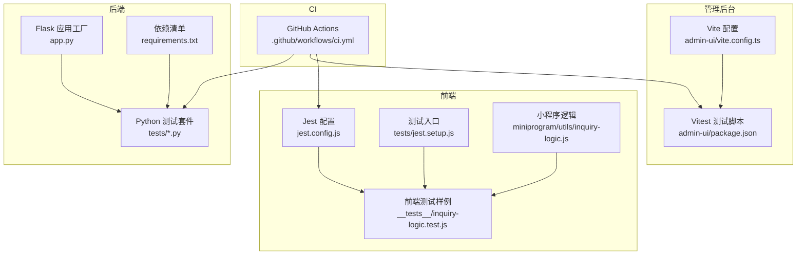
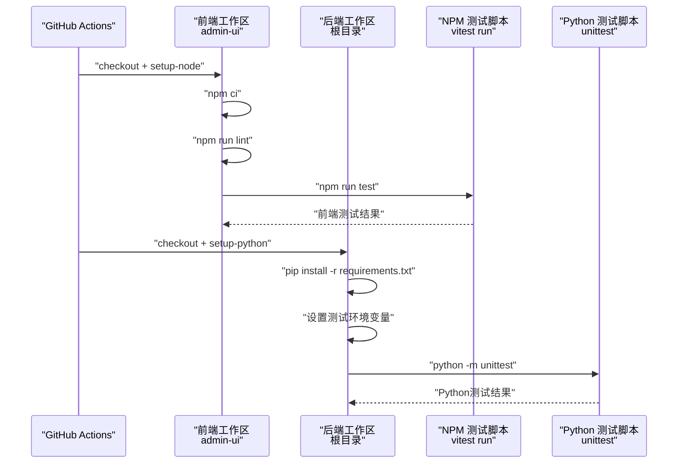
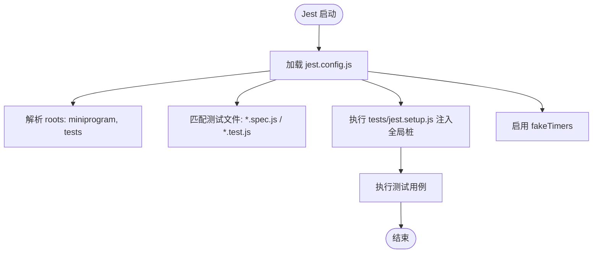
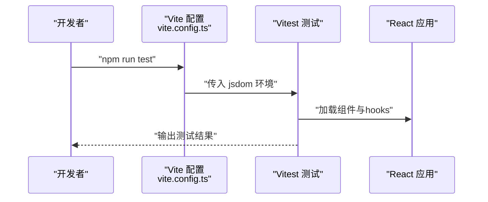
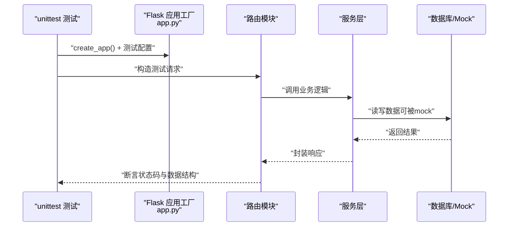
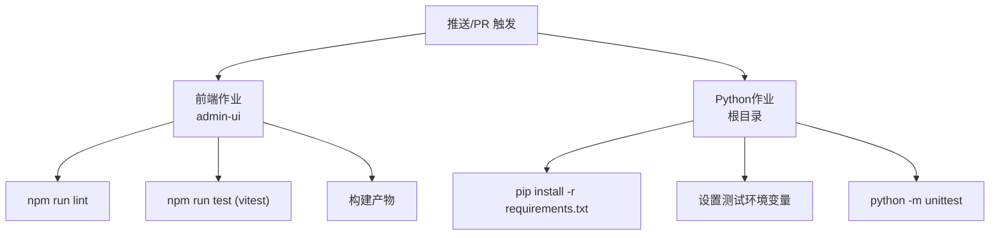
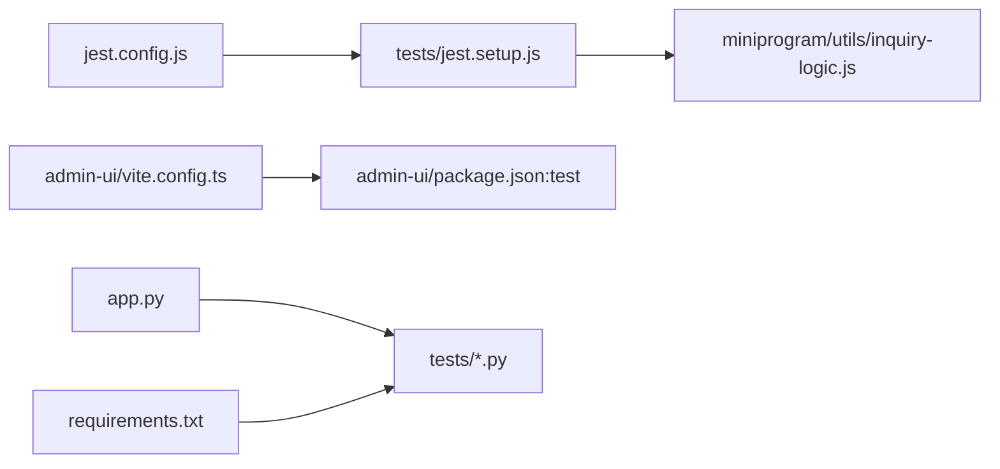

# 测试自动化

<cite>
**本文引用的文件**
- [jest.config.js](file://jest.config.js)
- [tests/jest.setup.js](file://tests/jest.setup.js)
- [.github/workflows/ci.yml](file://.github/workflows/ci.yml)
- [package.json](file://package.json)
- [admin-ui/package.json](file://admin-ui/package.json)
- [admin-ui/vite.config.ts](file://admin-ui/vite.config.ts)
- [__tests__/inquiry-logic.test.js](file://__tests__/inquiry-logic.test.js)
- [miniprogram/utils/inquiry-logic.js](file://miniprogram/utils/inquiry-logic.js)
- [requirements.txt](file://requirements.txt)
- [tests/test_auth.py](file://tests/test_auth.py)
- [tests/test_group_api.py](file://tests/test_group_api.py)
- [tests/test_account.py](file://tests/test_account.py)
- [app.py](file://app.py)
- [.env.example](file://.env.example)
</cite>

## 目录
1. [简介](#简介)
2. [项目结构](#项目结构)
3. [核心组件](#核心组件)
4. [架构总览](#架构总览)
5. [详细组件分析](#详细组件分析)
6. [依赖关系分析](#依赖关系分析)
7. [性能考量](#性能考量)
8. [故障排查指南](#故障排查指南)
9. [结论](#结论)
10. [附录](#附录)

## 简介
本文件面向本项目的测试自动化与CI/CD落地，系统性梳理前端Jest测试、管理后台Vitest测试、以及后端Python测试的配置与执行流程；明确测试环境变量、并行策略、报告输出、覆盖率与质量门禁等最佳实践，并给出在GitHub Actions中的触发条件、失败处理与测试数据隔离方案。

## 项目结构
本仓库包含多语言测试与CI配置：
- 前端测试（Jest）：位于根目录的 Jest 配置与测试脚本，覆盖小程序逻辑与通用测试环境。
- 管理后台（React/Vite）：通过 Vite 配置启用测试环境（jsdom），并使用 Vitest 运行测试。
- 后端Python测试：基于 unittest，配合 Flask 应用工厂与环境变量控制测试行为。
- CI：GitHub Actions 工作流分别执行前端与Python测试，并构建产物。

图表来源
- [jest.config.js](file://jest.config.js#L1-L10)
- [tests/jest.setup.js](file://tests/jest.setup.js#L1-L13)
- [miniprogram/utils/inquiry-logic.js](file://miniprogram/utils/inquiry-logic.js#L1-L204)
- [__tests__/inquiry-logic.test.js](file://__tests__/inquiry-logic.test.js#L1-L174)
- [admin-ui/vite.config.ts](file://admin-ui/vite.config.ts#L68-L70)
- [admin-ui/package.json](file://admin-ui/package.json#L10-L10)
- [app.py](file://app.py#L103-L276)
- [requirements.txt](file://requirements.txt#L1-L12)
- [.github/workflows/ci.yml](file://.github/workflows/ci.yml#L1-L35)

章节来源
- [jest.config.js](file://jest.config.js#L1-L10)
- [admin-ui/vite.config.ts](file://admin-ui/vite.config.ts#L68-L70)
- [.github/workflows/ci.yml](file://.github/workflows/ci.yml#L1-L35)

## 核心组件
- Jest 测试框架与配置：定义测试环境、匹配规则、全局setup与定时器模拟。
- Vitest 测试框架与Vite集成：在jsdom环境中运行前端测试。
- Python unittest测试套件：围绕Flask应用工厂与路由模块进行单元与接口测试。
- GitHub Actions工作流：按分支事件触发，分别执行前端与Python测试，并构建产物。
- 测试环境变量：通过.env与环境变量控制数据库连接、跨域、安全参数与测试模式。

章节来源
- [jest.config.js](file://jest.config.js#L1-L10)
- [tests/jest.setup.js](file://tests/jest.setup.js#L1-L13)
- [admin-ui/vite.config.ts](file://admin-ui/vite.config.ts#L68-L70)
- [admin-ui/package.json](file://admin-ui/package.json#L10-L10)
- [requirements.txt](file://requirements.txt#L1-L12)
- [app.py](file://app.py#L37-L119)
- [.env.example](file://.env.example#L1-L50)

## 架构总览
下图展示CI中测试流程的关键交互：工作流拉取代码、安装依赖、执行测试、产出构建。

图表来源
- [.github/workflows/ci.yml](file://.github/workflows/ci.yml#L1-L35)
- [admin-ui/package.json](file://admin-ui/package.json#L10-L10)
- [requirements.txt](file://requirements.txt#L1-L12)

## 详细组件分析

### Jest 配置与测试运行（小程序/通用逻辑）
- 测试环境：Node环境，匹配规则支持 tests/**/*.spec.js 与 tests/**/*.test.js。
- 根目录扫描：miniprogram 与 tests 目录。
- 全局setup：注入小程序API的jest桩（如wx、Page、getApp），便于逻辑函数单元测试。
- 时钟模拟：启用fakeTimers，确保涉及定时器的逻辑可预测。
- 排除目录：忽略 backend/ 目录，避免无关代码污染测试范围。

图表来源
- [jest.config.js](file://jest.config.js#L1-L10)
- [tests/jest.setup.js](file://tests/jest.setup.js#L1-L13)

章节来源
- [jest.config.js](file://jest.config.js#L1-L10)
- [tests/jest.setup.js](file://tests/jest.setup.js#L1-L13)
- [__tests__/inquiry-logic.test.js](file://__tests__/inquiry-logic.test.js#L1-L174)
- [miniprogram/utils/inquiry-logic.js](file://miniprogram/utils/inquiry-logic.js#L1-L204)

### Vitest 与 Vite 测试（管理后台）
- Vite测试环境：在vite.config.ts中通过test.environment指定jsdom，适配React组件与DOM API。
- 测试脚本：admin-ui/package.json中通过vitest run执行测试。
- 代理与环境变量：Vite配置支持API代理与环境变量加载，便于端到端或集成测试。

图表来源
- [admin-ui/vite.config.ts](file://admin-ui/vite.config.ts#L68-L70)
- [admin-ui/package.json](file://admin-ui/package.json#L10-L10)

章节来源
- [admin-ui/vite.config.ts](file://admin-ui/vite.config.ts#L68-L70)
- [admin-ui/package.json](file://admin-ui/package.json#L10-L10)

### Python 测试（unittest）与Flask应用
- 应用工厂：app.py提供create_app，集中注册蓝图、CORS、日志、错误处理与静态资源路由。
- 环境变量：通过.env与系统环境变量加载，支持NODE_ENV、MONGO_URI、ALLOWED_ORIGINS、WX_*等。
- 测试策略：
  - 使用unittest.TestCase组织测试。
  - 通过mock或内存模型替换真实数据库访问，保证测试独立性与可重复性。
  - 利用SKIP_DB_INIT=1与NODE_ENV=testing跳过数据库初始化，聚焦业务逻辑与接口契约。
- 示例测试：
  - 认证与验证码：验证密码哈希、令牌发放与验证码图像生成。
  - 分组API：通过patch替换模型层，验证创建、查询、更新、删除与成员添加。
  - 账户流程：通过mock模拟实时股价、用户集合、持仓与交易历史，覆盖存款、取款与交易明细。

图表来源
- [app.py](file://app.py#L103-L276)
- [tests/test_auth.py](file://tests/test_auth.py#L1-L69)
- [tests/test_group_api.py](file://tests/test_group_api.py#L1-L158)
- [tests/test_account.py](file://tests/test_account.py#L1-L103)

章节来源
- [app.py](file://app.py#L37-L119)
- [tests/test_auth.py](file://tests/test_auth.py#L1-L69)
- [tests/test_group_api.py](file://tests/test_group_api.py#L1-L158)
- [tests/test_account.py](file://tests/test_account.py#L1-L103)
- [.env.example](file://.env.example#L1-L50)

### CI/CD 测试流程（GitHub Actions）
- 触发条件：push与pull_request事件。
- 前端作业（admin-ui）：
  - 切换到admin-ui目录，安装依赖，执行lint与test，最后构建。
- Python作业：
  - 安装Python依赖，设置SKIP_DB_INIT=1与NODE_ENV=testing，执行unittest主模块。

图表来源
- [.github/workflows/ci.yml](file://.github/workflows/ci.yml#L1-L35)

章节来源
- [.github/workflows/ci.yml](file://.github/workflows/ci.yml#L1-L35)
- [requirements.txt](file://requirements.txt#L1-L12)

## 依赖关系分析
- 前端测试依赖：
  - Jest配置与全局setup文件，确保小程序API可用。
  - 小程序逻辑文件作为被测单元。
- 管理后台测试依赖：
  - Vite配置提供jsdom环境，Vitest脚本负责执行。
- 后端测试依赖：
  - Flask应用工厂与路由模块，unittest与mock共同实现隔离测试。
  - 环境变量控制数据库初始化与跨域策略。

图表来源
- [jest.config.js](file://jest.config.js#L1-L10)
- [tests/jest.setup.js](file://tests/jest.setup.js#L1-L13)
- [miniprogram/utils/inquiry-logic.js](file://miniprogram/utils/inquiry-logic.js#L1-L204)
- [admin-ui/vite.config.ts](file://admin-ui/vite.config.ts#L68-L70)
- [admin-ui/package.json](file://admin-ui/package.json#L10-L10)
- [app.py](file://app.py#L103-L276)
- [requirements.txt](file://requirements.txt#L1-L12)

章节来源
- [jest.config.js](file://jest.config.js#L1-L10)
- [admin-ui/vite.config.ts](file://admin-ui/vite.config.ts#L68-L70)
- [app.py](file://app.py#L103-L276)
- [requirements.txt](file://requirements.txt#L1-L12)

## 性能考量
- 并行测试执行
  - Jest：当前配置未显式开启并行，可在CI中通过并行参数提升速度（需结合测试隔离性评估）。
  - Vitest：可通过参数启用并行（需确保DOM与全局状态隔离）。
  - Python：unittest默认串行，可通过测试分片或外部并发工具拆分执行。
- 测试数据清理
  - 使用内存模型或临时数据库，测试结束后释放资源。
  - 对真实数据库场景，采用事务回滚或专用测试库，避免污染生产数据。
- 依赖安装优化
  - 使用缓存策略（npm/yarn cache、pip cache）减少重复安装时间。
- 报告与覆盖率
  - Jest：可扩展生成Junit XML与覆盖率报告，便于CI聚合。
  - Vitest：支持JSDOM与覆盖率导出，结合CI报告系统。
  - Python：使用coverage.py生成覆盖率报告，结合unittest输出格式化报告。

## 故障排查指南
- 前端测试失败
  - 检查jest.setup.js中的全局桩是否覆盖了被测API。
  - 确认jest.config.js的roots与testMatch是否包含目标测试文件。
  - 若涉及定时器，确保fakeTimers生效且未被外部代码重置。
- 管理后台测试失败
  - 确认vite.config.ts的test.environment为jsdom。
  - 检查代理配置与环境变量，避免API不可达导致断言失败。
- Python测试失败
  - 确保SKIP_DB_INIT=1与NODE_ENV=testing已设置，避免真实数据库连接。
  - 检查mock是否正确替换依赖模块，避免真实网络或数据库调用。
  - 关注app.py中的CORS与错误处理，确保测试请求路径与头部符合预期。
- CI失败处理
  - 在工作流中增加“测试失败时保留日志与产物”的步骤，便于定位。
  - 对不稳定测试（如网络依赖）加入重试或跳过策略。

章节来源
- [tests/jest.setup.js](file://tests/jest.setup.js#L1-L13)
- [jest.config.js](file://jest.config.js#L1-L10)
- [admin-ui/vite.config.ts](file://admin-ui/vite.config.ts#L68-L70)
- [app.py](file://app.py#L168-L276)
- [.github/workflows/ci.yml](file://.github/workflows/ci.yml#L1-L35)

## 结论
本项目已具备完善的前端与后端测试基础：Jest/Vitest测试环境、unittest测试套件与GitHub Actions工作流。建议在现有基础上引入并行执行、覆盖率报告与质量门禁（如覆盖率阈值、测试失败即阻塞发布），并强化测试数据隔离与清理机制，以进一步提升CI稳定性与交付质量。

## 附录

### 测试环境变量配置要点
- Flask相关
  - NODE_ENV：控制日志级别与错误处理策略。
  - MONGO_URI/DATABASE_NAME：数据库连接（测试可跳过初始化）。
  - ALLOWED_ORIGINS：CORS允许的来源列表。
  - WX_*：微信云开发相关配置。
- 测试开关
  - SKIP_DB_INIT=1：跳过数据库初始化，适用于unittest。
  - ENABLE_AUTO_SYNC/AUTO_SYNC_INTERVAL_SECONDS：后台任务开关与周期。
- 示例参考
  - 参考示例环境文件，按需复制为.env.local或在CI中注入。

章节来源
- [app.py](file://app.py#L37-L119)
- [.env.example](file://.env.example#L1-L50)