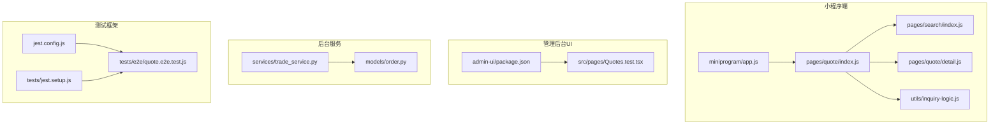
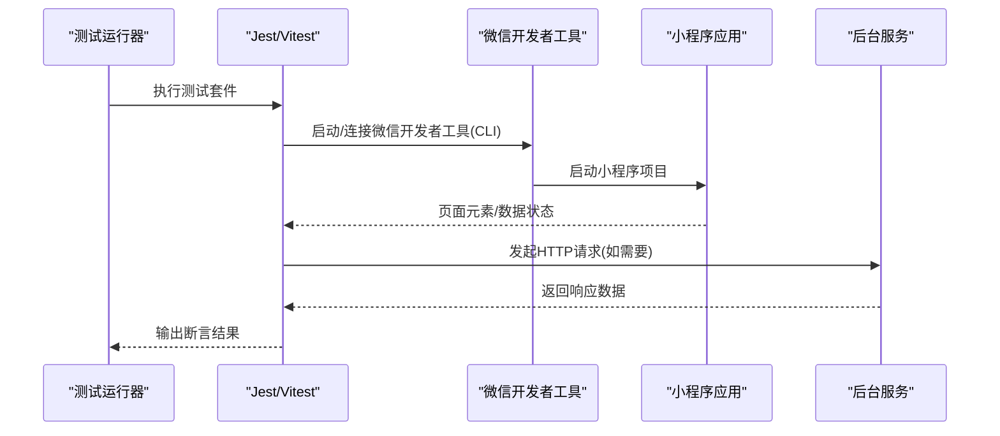
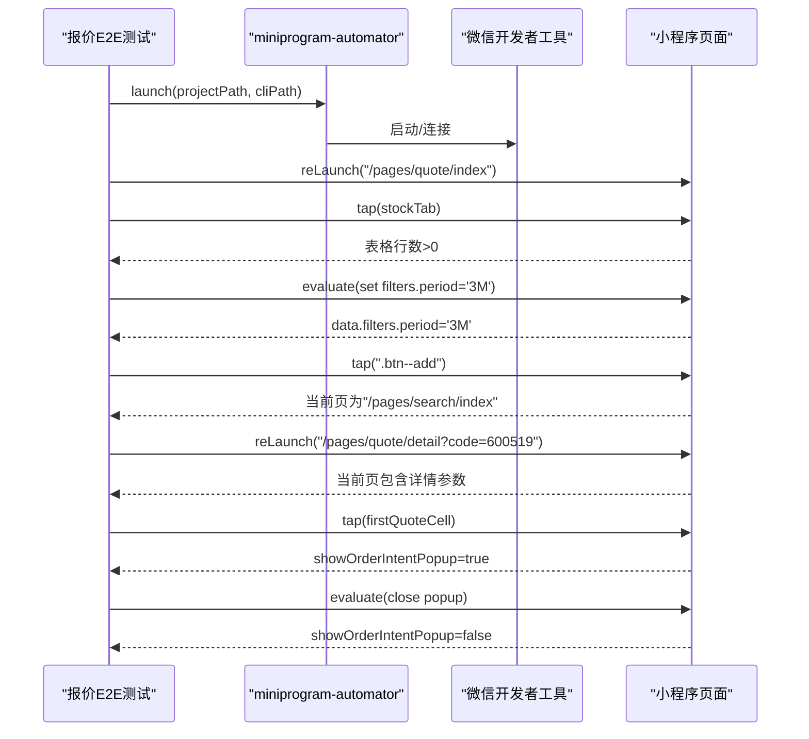
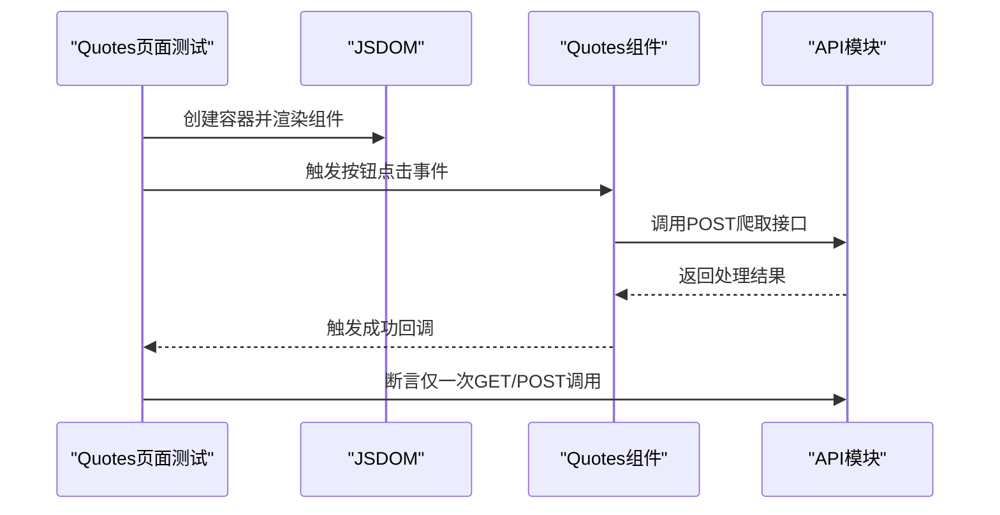
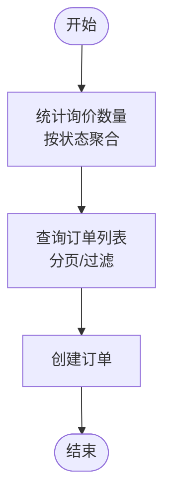
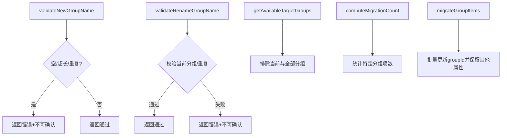
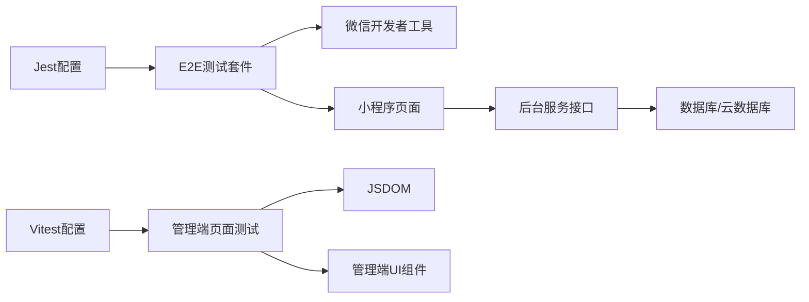

# 端到端测试

<cite>
**本文引用的文件**
- [jest.config.js](file://jest.config.js)
- [tests/jest.setup.js](file://tests/jest.setup.js)
- [tests/e2e/quote.e2e.test.js](file://tests/e2e/quote.e2e.test.js)
- [__tests__/inquiry-logic.test.js](file://__tests__/inquiry-logic.test.js)
- [package.json](file://package.json)
- [admin-ui/package.json](file://admin-ui/package.json)
- [admin-ui/src/pages/Quotes.test.tsx](file://admin-ui/src/pages/Quotes.test.tsx)
- [services/trade_service.py](file://services/trade_service.py)
- [models/order.py](file://models/order.py)
- [miniprogram/app.js](file://miniprogram/app.js)
- [miniprogram/pages/quote/index.js](file://miniprogram/pages/quote/index.js)
- [miniprogram/pages/search/index.js](file://miniprogram/pages/search/index.js)
- [miniprogram/pages/quote/detail.js](file://miniprogram/pages/quote/detail.js)
- [miniprogram/utils/inquiry-logic.js](file://miniprogram/utils/inquiry-logic.js)
</cite>

## 目录
1. [引言](#引言)
2. [项目结构](#项目结构)
3. [核心组件](#核心组件)
4. [架构总览](#架构总览)
5. [详细组件分析](#详细组件分析)
6. [依赖关系分析](#依赖关系分析)
7. [性能考虑](#性能考虑)
8. [故障排查指南](#故障排查指南)
9. [结论](#结论)
10. [附录](#附录)

## 引言
本文件面向“场外期权”项目的端到端测试体系建设，目标是建立覆盖用户操作流程、页面导航与业务流程验证的完整测试体系。内容涵盖测试环境搭建（含测试浏览器/开发者工具配置）、测试数据准备、模拟用户行为方法、关键业务场景用例设计（询价、订单处理、登录等）、测试执行与结果分析（截图、日志、失败重试）、以及性能指标与用户体验测试方法。文档同时给出可落地的实施策略与可视化图示，帮助不同技术背景的读者快速上手。

## 项目结构
该项目包含小程序前端、后台服务、管理后台UI与若干测试脚本。与端到端测试直接相关的结构要点如下：
- 小程序端：使用微信开发者工具进行自动化运行与断言，测试通过 Jest 配置与 setup 文件注入全局能力。
- 管理后台UI：基于 React/Vite，使用 Vitest/JSDOM 进行单元/集成测试。
- 后台服务：Python Flask/Express 提供 REST 接口，支撑询价、订单、用户登录等业务。
- 测试组织：Jest 配置指定根目录与匹配规则；小程序端 E2E 使用 miniprogram-automator；管理端页面组件使用 Vitest/JSDOM。

图表来源
- [miniprogram/app.js](file://miniprogram/app.js)
- [miniprogram/pages/quote/index.js](file://miniprogram/pages/quote/index.js)
- [miniprogram/pages/search/index.js](file://miniprogram/pages/search/index.js)
- [miniprogram/pages/quote/detail.js](file://miniprogram/pages/quote/detail.js)
- [miniprogram/utils/inquiry-logic.js](file://miniprogram/utils/inquiry-logic.js)
- [admin-ui/package.json](file://admin-ui/package.json)
- [admin-ui/src/pages/Quotes.test.tsx](file://admin-ui/src/pages/Quotes.test.tsx)
- [services/trade_service.py](file://services/trade_service.py)
- [models/order.py](file://models/order.py)
- [jest.config.js](file://jest.config.js)
- [tests/jest.setup.js](file://tests/jest.setup.js)
- [tests/e2e/quote.e2e.test.js](file://tests/e2e/quote.e2e.test.js)

章节来源
- [jest.config.js](file://jest.config.js#L1-L10)
- [tests/jest.setup.js](file://tests/jest.setup.js#L1-L13)
- [tests/e2e/quote.e2e.test.js](file://tests/e2e/quote.e2e.test.js#L1-L67)
- [admin-ui/package.json](file://admin-ui/package.json#L1-L38)
- [admin-ui/src/pages/Quotes.test.tsx](file://admin-ui/src/pages/Quotes.test.tsx#L64-L112)
- [services/trade_service.py](file://services/trade_service.py#L70-L105)
- [models/order.py](file://models/order.py#L1-L26)

## 核心组件
- 小程序端 E2E 测试：基于 miniprogram-automator 与 Jest，通过微信开发者工具 CLI 启动小程序，对报价页、搜索页、详情页与询价弹窗进行端到端验证。
- 管理后台页面测试：在 JSDOM 环境下渲染页面组件，使用 Vitest 断言 API 行为与副作用。
- 后台服务接口：提供询价统计、订单创建与查询等接口，支撑端到端业务闭环。
- 测试配置与工具：Jest/Vitest 配置、setup 注入、CLI 路径与开关控制。

章节来源
- [tests/e2e/quote.e2e.test.js](file://tests/e2e/quote.e2e.test.js#L1-L67)
- [admin-ui/src/pages/Quotes.test.tsx](file://admin-ui/src/pages/Quotes.test.tsx#L64-L112)
- [services/trade_service.py](file://services/trade_service.py#L70-L105)
- [jest.config.js](file://jest.config.js#L1-L10)
- [admin-ui/package.json](file://admin-ui/package.json#L1-L38)

## 架构总览
下图展示端到端测试从触发到断言的关键路径，包括小程序自动化、管理端组件测试与后台服务接口。

图表来源
- [tests/e2e/quote.e2e.test.js](file://tests/e2e/quote.e2e.test.js#L1-L67)
- [jest.config.js](file://jest.config.js#L1-L10)
- [admin-ui/package.json](file://admin-ui/package.json#L1-L38)
- [services/trade_service.py](file://services/trade_service.py#L70-L105)

## 详细组件分析

### 小程序端 E2E 测试（报价页）
该套件通过微信开发者工具 CLI 启动小程序，对报价页的 Tab 切换、筛选器交互、搜索跳转与询价弹窗进行验证，并在测试结束后关闭小程序进程。

图表来源
- [tests/e2e/quote.e2e.test.js](file://tests/e2e/quote.e2e.test.js#L1-L67)

章节来源
- [tests/e2e/quote.e2e.test.js](file://tests/e2e/quote.e2e.test.js#L1-L67)

### 管理后台页面组件测试（报价页面爬取按钮）
该测试在 JSDOM 环境下渲染报价页面，模拟点击“爬取”按钮仅调用对应接口且不冒泡，断言成功回调与 API 调用次数。

图表来源
- [admin-ui/src/pages/Quotes.test.tsx](file://admin-ui/src/pages/Quotes.test.tsx#L64-L112)

章节来源
- [admin-ui/src/pages/Quotes.test.tsx](file://admin-ui/src/pages/Quotes.test.tsx#L64-L112)

### 后台服务接口（询价统计与订单）
后台服务提供询价统计与订单管理接口，支持按状态聚合统计与分页查询，用于端到端业务闭环验证。

图表来源
- [services/trade_service.py](file://services/trade_service.py#L70-L105)

章节来源
- [services/trade_service.py](file://services/trade_service.py#L70-L105)
- [models/order.py](file://models/order.py#L1-L26)

### 小程序询价逻辑单元测试
针对小程序侧的询价分组逻辑进行单元测试，覆盖新增/重命名分组校验、可用目标分组计算、迁移计数与迁移过程等。

图表来源
- [__tests__/inquiry-logic.test.js](file://__tests__/inquiry-logic.test.js#L1-L174)
- [miniprogram/utils/inquiry-logic.js](file://miniprogram/utils/inquiry-logic.js)

章节来源
- [__tests__/inquiry-logic.test.js](file://__tests__/inquiry-logic.test.js#L1-L174)

## 依赖关系分析
- 测试运行时依赖：Jest/Vitest、miniprogram-automator、微信开发者工具 CLI。
- 小程序端依赖：微信小程序框架、页面路由与组件。
- 管理端依赖：React、Ant Design、Vite、JSDOM。
- 后台服务依赖：Flask/Express、数据库/云数据库客户端。

图表来源
- [jest.config.js](file://jest.config.js#L1-L10)
- [tests/e2e/quote.e2e.test.js](file://tests/e2e/quote.e2e.test.js#L1-L67)
- [admin-ui/package.json](file://admin-ui/package.json#L1-L38)
- [admin-ui/src/pages/Quotes.test.tsx](file://admin-ui/src/pages/Quotes.test.tsx#L64-L112)
- [services/trade_service.py](file://services/trade_service.py#L70-L105)

章节来源
- [jest.config.js](file://jest.config.js#L1-L10)
- [package.json](file://package.json#L1-L50)
- [admin-ui/package.json](file://admin-ui/package.json#L1-L38)

## 性能考虑
- 启动与等待：小程序自动化需合理设置等待时间，避免过短导致断言失败，过长影响整体耗时。建议结合页面加载状态与元素存在性判断。
- 并发与隔离：E2E 与管理端测试分别运行，避免共享状态干扰；必要时对数据库/缓存进行隔离或清理。
- 录制与回放：在稳定场景使用录制回放减少维护成本，但需注意页面结构变化带来的选择器失效。
- 指标采集：结合后台接口埋点与前端性能 API（如 Navigation Timing），在 CI 中输出关键指标（首屏、交互延迟、错误率）。

## 故障排查指南
- E2E 测试未执行
  - 检查环境变量与 CLI 路径是否正确，确保微信开发者工具安装并可被 CLI 调用。
  - 确认 RUN_MINIPROGRAM_E2E 环境变量已设置为启用值。
- 页面元素选择器失效
  - 随着页面结构迭代，选择器可能失效。建议采用更稳定的定位策略（如语义化类名、可读性更强的选择器）。
- 断言不稳定
  - 对异步渲染与网络请求增加显式等待或条件断言；对弹窗/模态框状态使用 evaluate 修改页面数据后再断言。
- 管理端测试失败
  - 确保在 JSDOM 环境下正确 mock API 与全局对象；避免真实网络请求影响测试稳定性。
- 日志与截图
  - 在 CI 中统一输出测试日志与失败截图，便于定位问题；对关键步骤添加注释与上下文信息。

章节来源
- [tests/e2e/quote.e2e.test.js](file://tests/e2e/quote.e2e.test.js#L1-L67)
- [tests/jest.setup.js](file://tests/jest.setup.js#L1-L13)
- [admin-ui/src/pages/Quotes.test.tsx](file://admin-ui/src/pages/Quotes.test.tsx#L64-L112)

## 结论
本文件建立了覆盖小程序报价页、管理端页面与后台服务的端到端测试体系，明确了测试环境搭建、用例设计、执行与分析方法。通过合理配置与持续优化，可在保证质量的同时提升交付效率。后续建议补充更多业务链路（如登录、下单、结算）的 E2E 用例，并引入性能与用户体验指标监控。

## 附录

### 测试环境搭建与配置
- 小程序 E2E
  - 安装微信开发者工具并配置 CLI 路径，设置 RUN_MINIPROGRAM_E2E=1 以启用 E2E 测试。
  - 使用 Jest 配置与 setup 注入全局能力，确保测试运行环境一致。
- 管理端页面测试
  - 使用 Vitest 与 JSDOM 运行页面组件测试，mock API 与全局对象，避免真实网络请求。
- 后台服务
  - 准备测试数据库/云数据库实例，确保询价与订单接口可用；在 CI 中配置环境变量与密钥。

章节来源
- [tests/e2e/quote.e2e.test.js](file://tests/e2e/quote.e2e.test.js#L1-L67)
- [jest.config.js](file://jest.config.js#L1-L10)
- [tests/jest.setup.js](file://tests/jest.setup.js#L1-L13)
- [admin-ui/package.json](file://admin-ui/package.json#L1-L38)

### 关键业务场景用例设计
- 询价流程
  - 场景：进入报价页 → 切换 Tab → 设置筛选器 → 搜索 → 跳转详情 → 打开询价弹窗 → 关闭弹窗。
  - 断言：页面元素存在、数据状态变更、路由路径包含预期参数。
- 订单处理
  - 场景：后台统计询价数量 → 查询订单列表 → 创建订单 → 校验状态与字段。
  - 断言：接口返回成功、统计数据变化、订单字段符合预期。
- 用户登录
  - 场景：管理员登录 → 获取 token → 微信登录 → 返回 openid 与 token。
  - 断言：状态码为 200、响应体包含 token/openid。

章节来源
- [tests/e2e/quote.e2e.test.js](file://tests/e2e/quote.e2e.test.js#L1-L67)
- [services/trade_service.py](file://services/trade_service.py#L70-L105)
- [tests/test_refactor.py](file://tests/test_refactor.py#L47-L82)

### 测试执行与结果分析
- 执行方式
  - 小程序：Jest 运行 E2E 套件，自动启动/关闭微信开发者工具。
  - 管理端：Vitest 运行页面组件测试，JSDOM 渲染组件。
- 结果分析
  - 失败重试：在 CI 中对偶发失败增加重试策略；对网络/资源加载失败单独处理。
  - 截图与日志：在失败时输出页面截图与关键日志，辅助定位问题。
  - 指标上报：在 CI 中收集关键指标（启动时间、交互延迟、错误率）并生成报告。

章节来源
- [jest.config.js](file://jest.config.js#L1-L10)
- [admin-ui/package.json](file://admin-ui/package.json#L1-L38)