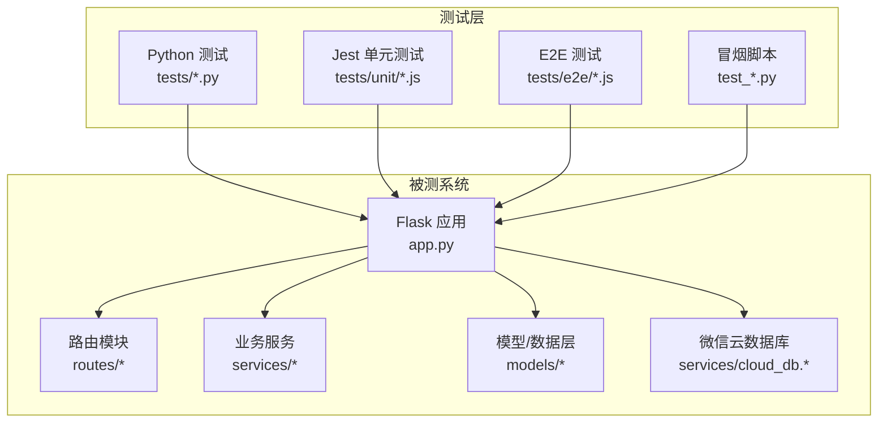
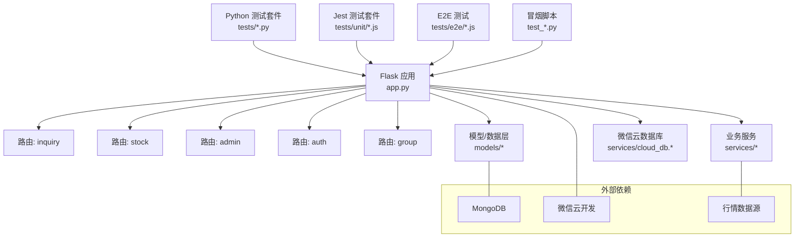
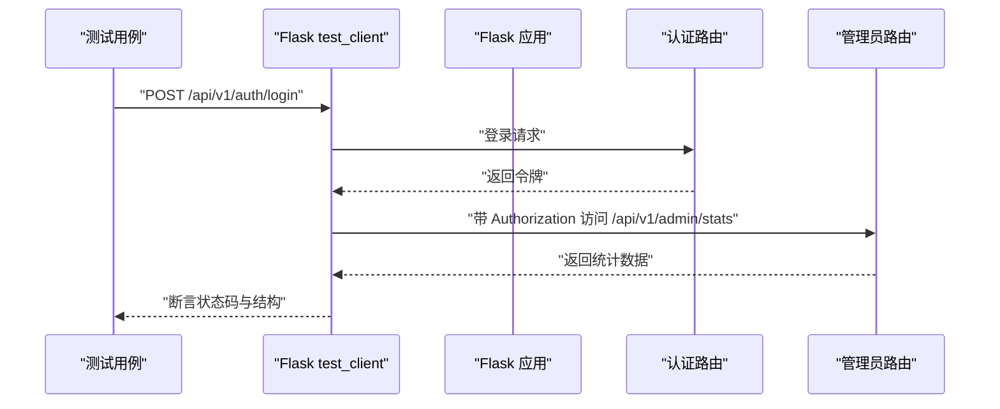
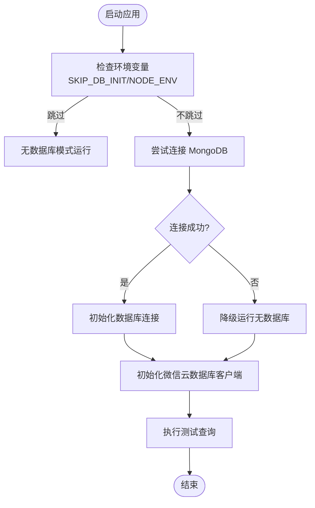
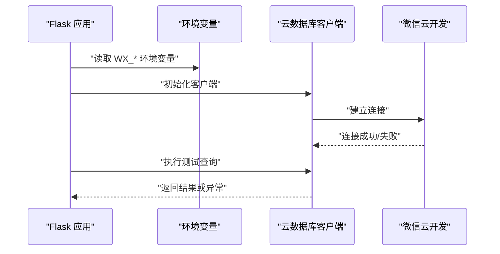
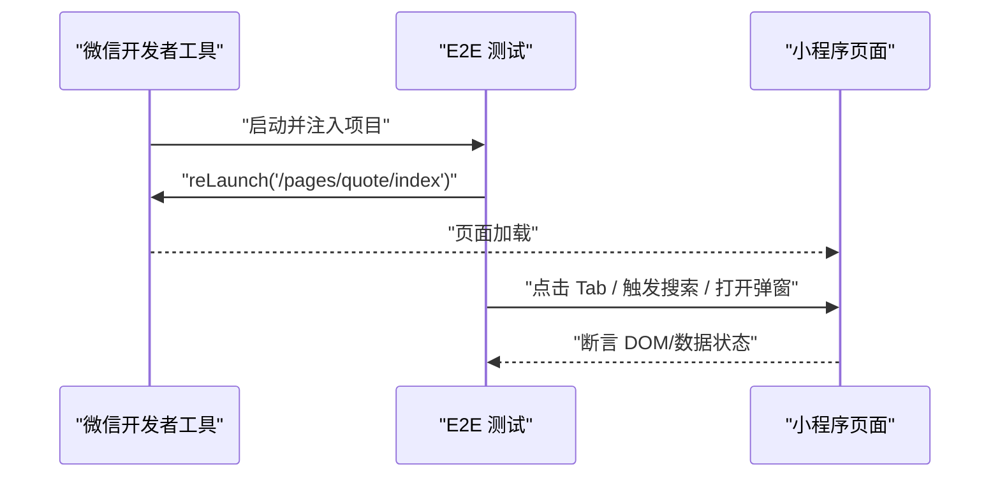
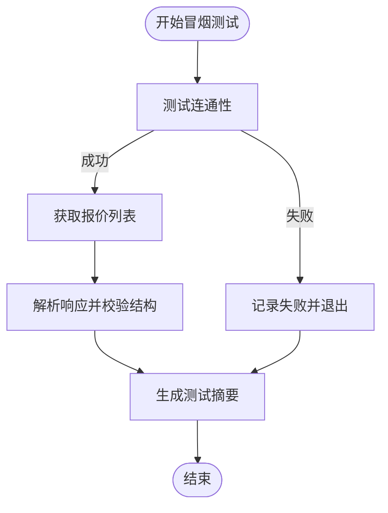
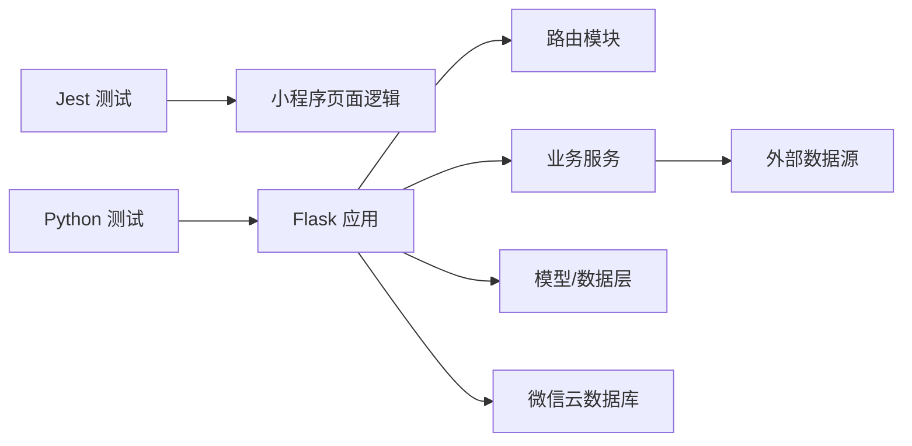

# 集成测试

<cite>
**本文引用的文件**
- [jest.config.js](file://jest.config.js)
- [package.json](file://package.json)
- [tests/jest.setup.js](file://tests/jest.setup.js)
- [tests/test_auth.py](file://tests/test_auth.py)
- [tests/test_admin_api.py](file://tests/test_admin_api.py)
- [tests/test_group_api.py](file://tests/test_group_api.py)
- [tests/test_group_permissions.py](file://tests/test_group_permissions.py)
- [tests/test_security_config.py](file://tests/test_security_config.py)
- [tests/e2e/quote.e2e.test.js](file://tests/e2e/quote.e2e.test.js)
- [tests/unit/quote-index.spec.js](file://tests/unit/quote-index.spec.js)
- [tests/unit/search.spec.js](file://tests/unit/search.spec.js)
- [test_api.py](file://test_api.py)
- [test_cloud_api.py](file://test_cloud_api.py)
- [test_inquiries_api.py](file://test_inquiries_api.py)
- [app.py](file://app.py)
</cite>

## 目录
1. [引言](#引言)
2. [项目结构](#项目结构)
3. [核心组件](#核心组件)
4. [架构总览](#架构总览)
5. [详细组件分析](#详细组件分析)
6. [依赖关系分析](#依赖关系分析)
7. [性能考量](#性能考量)
8. [故障排查指南](#故障排查指南)
9. [结论](#结论)
10. [附录](#附录)

## 引言
本文件面向“场外期权”系统的集成测试，目标是建立覆盖 RESTful API、数据库连接、第三方服务（云开发）以及跨模块功能（权限、安全配置、重构兼容性）的测试策略与验证方法。文档同时给出测试环境配置、测试数据管理、用例设计与执行流程的最佳实践，并提供测试结果分析与问题定位方法。

## 项目结构
该仓库包含多端与多语言测试资产：
- Python 单元/集成测试：位于 tests/ 下，覆盖认证、管理员接口、分组接口、权限控制、安全配置等。
- JavaScript Jest 单元测试：位于 tests/unit/ 与 miniprogram/tests/，覆盖小程序页面逻辑与交互行为。
- E2E 测试：基于微信开发者工具自动化，位于 tests/e2e/，覆盖报价页主流程。
- 独立冒烟脚本：test_api.py、test_cloud_api.py、test_inquiries_api.py，用于快速验证后端接口可用性与数据返回。



图表来源
- [app.py](file://app.py#L103-L200)
- [tests/test_auth.py](file://tests/test_auth.py#L1-L69)
- [tests/test_admin_api.py](file://tests/test_admin_api.py#L1-L54)
- [tests/test_group_api.py](file://tests/test_group_api.py#L1-L158)
- [tests/e2e/quote.e2e.test.js](file://tests/e2e/quote.e2e.test.js#L1-L67)
- [tests/unit/quote-index.spec.js](file://tests/unit/quote-index.spec.js#L1-L18)
- [tests/unit/search.spec.js](file://tests/unit/search.spec.js#L1-L48)
- [test_api.py](file://test_api.py#L1-L116)
- [test_cloud_api.py](file://test_cloud_api.py#L1-L100)
- [test_inquiries_api.py](file://test_inquiries_api.py#L1-L86)

章节来源
- [jest.config.js](file://jest.config.js#L1-L10)
- [package.json](file://package.json#L1-L50)

## 核心组件
- 测试框架与运行环境
  - Jest：用于小程序页面逻辑与交互的单元测试；配置于 jest.config.js，匹配 tests/**/*.test.js。
  - Python unittest：用于后端 API 的集成测试与安全配置校验。
- 被测系统
  - Flask 应用入口与蓝图注册、CORS、数据库与云数据库初始化、健康检查等。
- 测试资产
  - 认证与令牌签发、管理员接口、分组 CRUD 与权限保护、安全配置校验、E2E 报价页流程、冒烟脚本等。

章节来源
- [jest.config.js](file://jest.config.js#L1-L10)
- [tests/jest.setup.js](file://tests/jest.setup.js#L1-L13)
- [app.py](file://app.py#L103-L200)

## 架构总览
下图展示测试与被测系统的交互关系，重点体现 RESTful API、数据库连接、云数据库、小程序端 E2E 与冒烟脚本之间的集成关系。



图表来源
- [app.py](file://app.py#L103-L200)
- [tests/test_auth.py](file://tests/test_auth.py#L1-L69)
- [tests/test_admin_api.py](file://tests/test_admin_api.py#L1-L54)
- [tests/test_group_api.py](file://tests/test_group_api.py#L1-L158)
- [tests/e2e/quote.e2e.test.js](file://tests/e2e/quote.e2e.test.js#L1-L67)
- [test_api.py](file://test_api.py#L1-L116)
- [test_cloud_api.py](file://test_cloud_api.py#L1-L100)
- [test_inquiries_api.py](file://test_inquiries_api.py#L1-L86)

## 详细组件分析

### RESTful API 集成测试
- 测试范围
  - 健康检查、版本信息、股票实时/历史/搜索/列表等公开接口。
  - 管理员接口：统计、分页参数校验等。
  - 认证：登录、令牌签发与校验。
  - 分组接口：创建、查询、更新、删除、成员添加。
- 执行方式
  - 使用 Python requests 发送 HTTP 请求，统一处理超时、连接错误与响应解析。
  - 使用 Flask test_client 进行端到端请求，结合 unittest 断言。
- 关键断言
  - 状态码、CORS 头、响应结构、分页参数合法性、鉴权头有效性。



图表来源
- [tests/test_admin_api.py](file://tests/test_admin_api.py#L1-L54)
- [tests/test_auth.py](file://tests/test_auth.py#L1-L69)
- [test_api.py](file://test_api.py#L1-L116)

章节来源
- [tests/test_admin_api.py](file://tests/test_admin_api.py#L1-L54)
- [tests/test_auth.py](file://tests/test_auth.py#L1-L69)
- [test_api.py](file://test_api.py#L1-L116)

### 数据库连接测试
- 目标
  - 验证 MongoDB 连接初始化、健康检查、无数据库模式降级运行。
- 方法
  - 在 app.py 中封装 init_db 并记录日志；在测试中通过环境变量 SKIP_DB_INIT 或 NODE_ENV=testing 控制跳过初始化。
  - 对云数据库客户端进行初始化与简单查询测试，确保配置正确。
- 断言
  - 日志输出包含连接成功/失败信息；云数据库查询可返回空集但不抛异常。



图表来源
- [app.py](file://app.py#L69-L88)
- [app.py](file://app.py#L121-L152)

章节来源
- [app.py](file://app.py#L69-L88)
- [app.py](file://app.py#L121-L152)

### 第三方服务集成测试（微信云数据库）
- 目标
  - 验证云数据库客户端初始化、配置完整性与查询可用性。
- 方法
  - 通过环境变量 WX_CLOUD_ENV/WX_APPID/WX_SECRET 驱动初始化。
  - 执行简单查询测试连接，捕获配置错误并记录告警。
- 断言
  - 初始化成功日志；查询返回记录条数；配置缺失时抛出特定异常类型。



图表来源
- [app.py](file://app.py#L121-L152)

章节来源
- [app.py](file://app.py#L121-L152)

### 跨模块功能测试
- 用户权限验证
  - 使用 mock 替换路由层的用户上下文与模型，断言受保护资源的拒绝行为。
- 安全配置测试
  - 验证生产环境配置对 SECRET_KEY 的强制要求，缺失时抛出异常。
- 系统重构后的兼容性测试
  - 通过最小化变更的断言与历史行为对比，确保接口语义与响应结构稳定。

```mermaid
classDiagram
class GroupApiTestCase {
+setUp()
+test_create_group()
+test_get_groups()
+test_update_group()
+test_delete_group()
+test_add_member()
}
class GroupPermissionTestCase {
+test_create_protected_group_name_rejected()
+test_update_protected_group_rejected()
+test_update_rename_to_protected_name_rejected()
+test_delete_protected_group_rejected()
}
class SecurityTestCase {
+test_production_config_secret_key()
}
GroupApiTestCase --> "mock 模型" : "替换 get_model"
GroupPermissionTestCase --> "mock 用户ID" : "替换 get_current_user_id"
SecurityTestCase --> "ProductionConfig" : "校验 SECRET_KEY"
```

图表来源
- [tests/test_group_api.py](file://tests/test_group_api.py#L1-L158)
- [tests/test_group_permissions.py](file://tests/test_group_permissions.py#L1-L76)
- [tests/test_security_config.py](file://tests/test_security_config.py#L1-L38)

章节来源
- [tests/test_group_api.py](file://tests/test_group_api.py#L1-L158)
- [tests/test_group_permissions.py](file://tests/test_group_permissions.py#L1-L76)
- [tests/test_security_config.py](file://tests/test_security_config.py#L1-L38)

### 小程序端 E2E 与单元测试
- E2E 测试
  - 基于微信开发者工具自动化，覆盖报价页启动、Tab 切换、筛选器交互、搜索与详情跳转、询价弹窗等。
- 单元测试（Jest）
  - 页面重定向逻辑、防抖与历史记录管理等前端行为。



图表来源
- [tests/e2e/quote.e2e.test.js](file://tests/e2e/quote.e2e.test.js#L1-L67)

章节来源
- [tests/e2e/quote.e2e.test.js](file://tests/e2e/quote.e2e.test.js#L1-L67)
- [tests/unit/quote-index.spec.js](file://tests/unit/quote-index.spec.js#L1-L18)
- [tests/unit/search.spec.js](file://tests/unit/search.spec.js#L1-L48)

### 冒烟测试与第三方接口验证
- 目标
  - 快速验证后端接口连通性与数据返回结构。
- 方法
  - 统一请求头、超时控制、状态码与字段校验；对云端接口进行连通性与数据结构验证。
- 输出
  - 测试摘要与通过/失败状态。



图表来源
- [test_cloud_api.py](file://test_cloud_api.py#L1-L100)
- [test_inquiries_api.py](file://test_inquiries_api.py#L1-L86)

章节来源
- [test_cloud_api.py](file://test_cloud_api.py#L1-L100)
- [test_inquiries_api.py](file://test_inquiries_api.py#L1-L86)

## 依赖关系分析
- 测试框架与模块耦合
  - Jest 仅依赖小程序页面逻辑与全局桩，与后端解耦。
  - Python 测试依赖 Flask 应用工厂与路由蓝图，耦合度较高但可通过 mock 降低。
- 外部依赖
  - MongoDB：通过 app.py 初始化；测试可跳过。
  - 微信云数据库：通过环境变量驱动；初始化失败会降级。
  - 行情数据源：由业务服务调用，测试中可替换为本地数据或 mock。



图表来源
- [jest.config.js](file://jest.config.js#L1-L10)
- [package.json](file://package.json#L1-L50)
- [app.py](file://app.py#L103-L200)

章节来源
- [jest.config.js](file://jest.config.js#L1-L10)
- [package.json](file://package.json#L1-L50)
- [app.py](file://app.py#L103-L200)

## 性能考量
- 测试超时与并发
  - HTTP 请求设置合理超时，避免阻塞测试执行。
  - E2E 测试等待时间需谨慎设置，避免不稳定。
- 数据量与查询
  - 分页参数校验与大数据量场景下的查询性能需纳入测试关注点。
- 环境隔离
  - 使用测试数据库或内存模型，避免对生产数据造成影响。

## 故障排查指南
- 数据库连接失败
  - 检查 MONGO_URI、DATABASE_NAME 与网络可达性；必要时设置 SKIP_DB_INIT=1。
- 云数据库初始化失败
  - 核对 WX_CLOUD_ENV、WX_APPID、WX_SECRET；查看日志中配置错误提示。
- CORS 问题
  - 检查 ALLOWED_ORIGINS 与请求头；确认 OPTIONS 预检通过。
- 权限与鉴权
  - 确认 Authorization 头格式与令牌有效期；检查路由中间件与权限判定逻辑。
- E2E 不稳定
  - 提升等待时间、减少页面结构变化；确保微信开发者工具 CLI 路径正确。

章节来源
- [app.py](file://app.py#L69-L88)
- [app.py](file://app.py#L121-L152)
- [tests/test_admin_api.py](file://tests/test_admin_api.py#L1-L54)
- [tests/e2e/quote.e2e.test.js](file://tests/e2e/quote.e2e.test.js#L1-L67)

## 结论
本集成测试体系覆盖了后端 API、数据库与云数据库、小程序端 E2E 与冒烟脚本，配合权限与安全配置测试，能够有效保障系统在重构与演进过程中的稳定性与一致性。建议持续完善测试用例覆盖面与执行效率，并在 CI 中引入自动化执行与报告归档。

## 附录

### 测试环境配置与数据管理
- 环境变量
  - NODE_ENV、SKIP_DB_INIT、MONGO_URI、DATABASE_NAME、ALLOWED_ORIGINS、WX_* 等。
- 测试数据库
  - 建议使用独立测试数据库或内存模型，避免与生产数据冲突。
- 模拟服务
  - 对外部数据源与云服务采用 mock 或本地替身，确保测试可重复。

### 测试用例设计与执行流程最佳实践
- 用例设计
  - 覆盖正向、边界与异常场景；对关键路径进行参数化测试。
- 执行流程
  - 先运行冒烟脚本快速验证，再执行单元与集成测试，最后运行 E2E。
- 结果分析
  - 以日志与断言为主，结合覆盖率与失败重试策略。