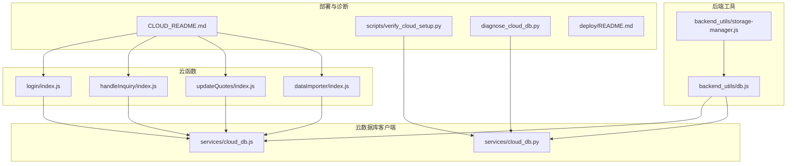
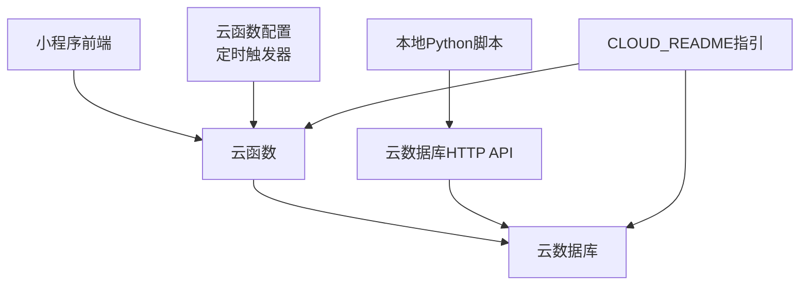
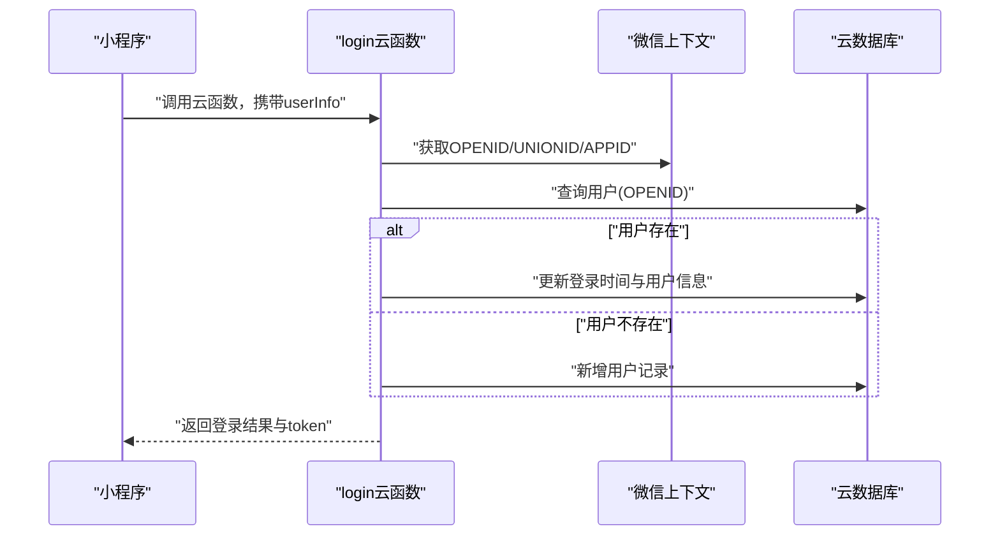
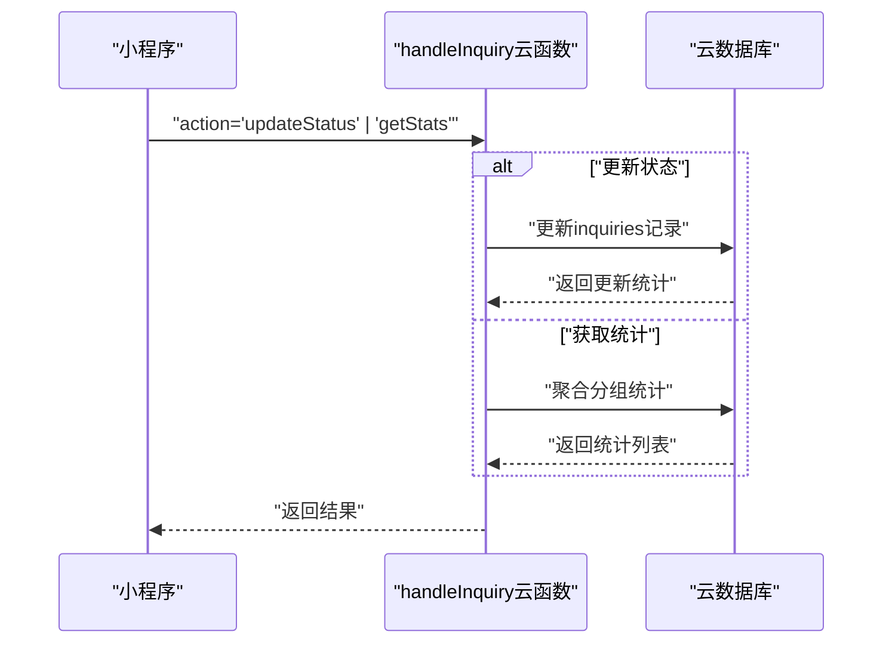
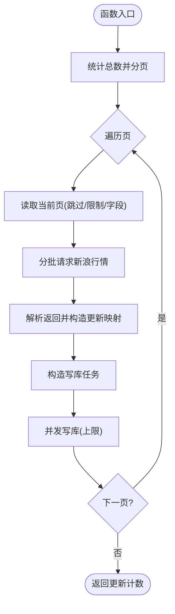
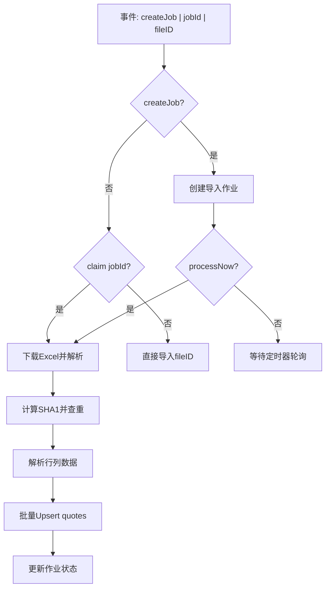
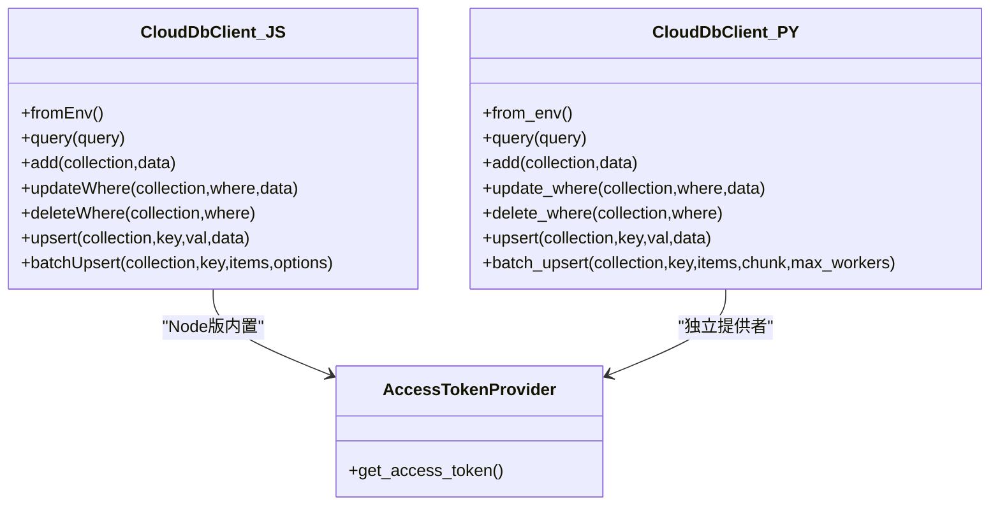
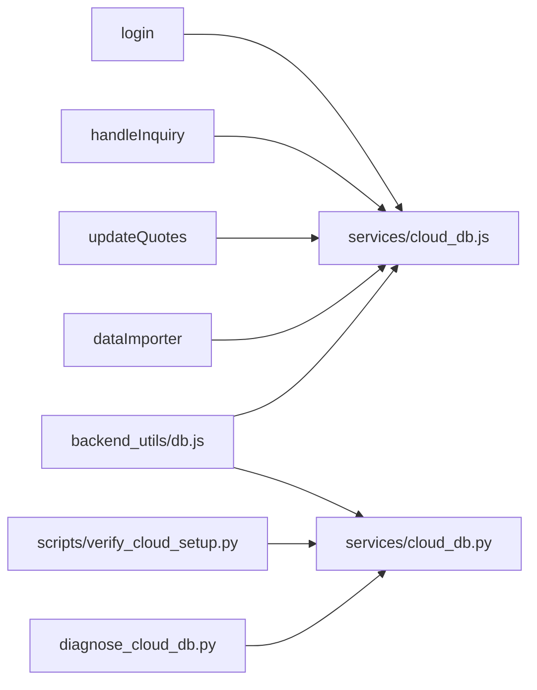

# 云服务调试

<cite>
**本文引用的文件**
- [cloudfunctions/dataImporter/index.js](file://cloudfunctions/dataImporter/index.js)
- [cloudfunctions/dataImporter/config.json](file://cloudfunctions/dataImporter/config.json)
- [cloudfunctions/updateQuotes/index.js](file://cloudfunctions/updateQuotes/index.js)
- [cloudfunctions/updateQuotes/config.json](file://cloudfunctions/updateQuotes/config.json)
- [cloudfunctions/handleInquiry/index.js](file://cloudfunctions/handleInquiry/index.js)
- [cloudfunctions/login/index.js](file://cloudfunctions/login/index.js)
- [services/cloud_db.js](file://services/cloud_db.js)
- [services/cloud_db.py](file://services/cloud_db.py)
- [backend_utils/db.js](file://backend_utils/db.js)
- [backend_utils/storage-manager.js](file://backend_utils/storage-manager.js)
- [CLOUD_README.md](file://CLOUD_README.md)
- [scripts/verify_cloud_setup.py](file://scripts/verify_cloud_setup.py)
- [diagnose_cloud_db.py](file://diagnose_cloud_db.py)
- [deploy/README.md](file://deploy/README.md)
- [package.json](file://package.json)
</cite>

## 目录
1. [简介](#简介)
2. [项目结构](#项目结构)
3. [核心组件](#核心组件)
4. [架构总览](#架构总览)
5. [详细组件分析](#详细组件分析)
6. [依赖关系分析](#依赖关系分析)
7. [性能考量](#性能考量)
8. [故障排查指南](#故障排查指南)
9. [结论](#结论)
10. [附录](#附录)

## 简介
本指南聚焦于微信云开发与云函数的调试实践，涵盖本地调试、云数据库与云存储调试、云函数部署与版本管理、API网关与安全配置、权限控制调试，以及常见问题诊断（如函数执行超时、权限不足、网络连接问题）。文档基于仓库中的云函数、数据库客户端与诊断脚本，提供可操作的调试流程与可视化图示。

## 项目结构
围绕云服务调试的关键目录与文件：
- 云函数：cloudfunctions 下的 login、handleInquiry、updateQuotes、dataImporter
- 云数据库客户端：services/cloud_db.js（Node）、services/cloud_db.py（Python）
- 后端工具：backend_utils/db.js（环境适配与本地回退）、backend_utils/storage-manager.js（本地存储与同步）
- 部署与环境：deploy/README.md、scripts/verify_cloud_setup.py、diagnose_cloud_db.py
- 文档与配置：CLOUD_README.md、各云函数 config.json（触发器）

图表来源
- [cloudfunctions/login/index.js](file://cloudfunctions/login/index.js#L1-L92)
- [cloudfunctions/handleInquiry/index.js](file://cloudfunctions/handleInquiry/index.js#L1-L81)
- [cloudfunctions/updateQuotes/index.js](file://cloudfunctions/updateQuotes/index.js#L1-L180)
- [cloudfunctions/dataImporter/index.js](file://cloudfunctions/dataImporter/index.js#L1-L392)
- [services/cloud_db.js](file://services/cloud_db.js#L1-L327)
- [services/cloud_db.py](file://services/cloud_db.py#L1-L533)
- [backend_utils/db.js](file://backend_utils/db.js#L1-L64)
- [backend_utils/storage-manager.js](file://backend_utils/storage-manager.js#L1-L776)
- [CLOUD_README.md](file://CLOUD_README.md#L1-L87)
- [scripts/verify_cloud_setup.py](file://scripts/verify_cloud_setup.py#L1-L99)
- [diagnose_cloud_db.py](file://diagnose_cloud_db.py#L1-L101)
- [deploy/README.md](file://deploy/README.md#L1-L44)

章节来源
- [package.json](file://package.json#L1-L50)
- [CLOUD_README.md](file://CLOUD_README.md#L1-L87)

## 核心组件
- 云函数
  - 登录：用户登录、用户信息写入与令牌生成
  - 询价：状态更新与统计聚合
  - 行情更新：定时抓取新浪行情并批量写库
  - 数据导入：Excel解析、去重、Upsert与作业队列
- 云数据库客户端
  - Node版：封装查询、新增、更新、删除、Upsert、批量Upsert与重试/并发控制
  - Python版：同上，含访问令牌提供器与线程池并发
- 后端工具
  - db.js：从环境变量初始化客户端，失败则回退本地Mock
  - storage-manager.js：本地存储、缓存、LRU、压缩/加密、观察者与同步队列
- 部署与诊断
  - verify_cloud_setup.py：校验环境变量、获取Access Token、检查集合存在性
  - diagnose_cloud_db.py：初始化客户端并查询集合，定位连接/权限问题

章节来源
- [cloudfunctions/login/index.js](file://cloudfunctions/login/index.js#L1-L92)
- [cloudfunctions/handleInquiry/index.js](file://cloudfunctions/handleInquiry/index.js#L1-L81)
- [cloudfunctions/updateQuotes/index.js](file://cloudfunctions/updateQuotes/index.js#L1-L180)
- [cloudfunctions/dataImporter/index.js](file://cloudfunctions/dataImporter/index.js#L1-L392)
- [services/cloud_db.js](file://services/cloud_db.js#L1-L327)
- [services/cloud_db.py](file://services/cloud_db.py#L1-L533)
- [backend_utils/db.js](file://backend_utils/db.js#L1-L64)
- [backend_utils/storage-manager.js](file://backend_utils/storage-manager.js#L1-L776)
- [scripts/verify_cloud_setup.py](file://scripts/verify_cloud_setup.py#L1-L99)
- [diagnose_cloud_db.py](file://diagnose_cloud_db.py#L1-L101)

## 架构总览
微信云开发整体以“本地数据处理 + 云数据库/云函数”为核心，前端通过小程序直连云数据库或调用云函数；Python脚本负责生成数据并通过HTTP API导入云数据库；云函数负责定时任务与业务逻辑。

图表来源
- [CLOUD_README.md](file://CLOUD_README.md#L1-L87)
- [cloudfunctions/updateQuotes/config.json](file://cloudfunctions/updateQuotes/config.json#L1-L17)
- [cloudfunctions/dataImporter/config.json](file://cloudfunctions/dataImporter/config.json#L1-L13)

## 详细组件分析

### 云函数：登录（login）
- 功能要点
  - 获取微信上下文OPENID/UNIONID/APPID
  - 查询或创建用户记录，更新最近登录时间与用户信息
  - 生成简单token并返回
- 调试建议
  - 使用小程序端传入userInfo进行断点验证
  - 观察数据库集合users写入情况
  - 捕获并记录错误，定位权限或索引问题

图表来源
- [cloudfunctions/login/index.js](file://cloudfunctions/login/index.js#L1-L92)

章节来源
- [cloudfunctions/login/index.js](file://cloudfunctions/login/index.js#L1-L92)

### 云函数：询价处理（handleInquiry）
- 功能要点
  - 根据action路由：更新状态、获取统计
  - 使用聚合查询对状态进行分组统计
- 调试建议
  - 断言必填参数id/status
  - 观察集合inquiries的更新与统计结果
  - 捕获并记录聚合错误

图表来源
- [cloudfunctions/handleInquiry/index.js](file://cloudfunctions/handleInquiry/index.js#L1-L81)

章节来源
- [cloudfunctions/handleInquiry/index.js](file://cloudfunctions/handleInquiry/index.js#L1-L81)

### 云函数：行情更新（updateQuotes）
- 功能要点
  - 分页流式读取quotes集合，避免OOM
  - 并发抓取新浪行情，解析并计算涨跌幅
  - 并发写库，支持每日/盘中定时触发
- 调试建议
  - 关注超时与QPS限制，合理设置并发
  - 分页与批量写库的边界条件
  - 触发器配置与日志输出

图表来源
- [cloudfunctions/updateQuotes/index.js](file://cloudfunctions/updateQuotes/index.js#L1-L180)

章节来源
- [cloudfunctions/updateQuotes/index.js](file://cloudfunctions/updateQuotes/index.js#L1-L180)
- [cloudfunctions/updateQuotes/config.json](file://cloudfunctions/updateQuotes/config.json#L1-L17)

### 云函数：数据导入（dataImporter）
- 功能要点
  - Excel解析（支持复杂矩阵与常规表头）
  - 去重（SHA1）与作业队列（pending/processing/success/failed）
  - Upsert quotes，支持静态字段白名单与并发写
- 调试建议
  - 大文件内存占用与超时保护
  - 重复文件检测与跳过逻辑
  - 事务与批量写库的错误回滚

图表来源
- [cloudfunctions/dataImporter/index.js](file://cloudfunctions/dataImporter/index.js#L1-L392)
- [cloudfunctions/dataImporter/config.json](file://cloudfunctions/dataImporter/config.json#L1-L13)

章节来源
- [cloudfunctions/dataImporter/index.js](file://cloudfunctions/dataImporter/index.js#L1-L392)
- [cloudfunctions/dataImporter/config.json](file://cloudfunctions/dataImporter/config.json#L1-L13)

### 云数据库客户端（Node/Python）
- Node版（services/cloud_db.js）
  - 访问令牌获取与缓存、重试与指数退避
  - 并发信号量控制、请求节流
  - 查询/新增/更新/删除/Upsert/批量Upsert
- Python版（services/cloud_db.py）
  - 线程池并发、连接池适配
  - 详细的日志与错误分类（集合不存在、权限、QPS等）
- 调试建议
  - 检查环境变量WX_CLOUD_ENV/WX_APPID/WX_SECRET
  - 使用verify_cloud_setup.py与diagnose_cloud_db.py快速定位问题

图表来源
- [services/cloud_db.js](file://services/cloud_db.js#L1-L327)
- [services/cloud_db.py](file://services/cloud_db.py#L1-L533)

章节来源
- [services/cloud_db.js](file://services/cloud_db.js#L1-L327)
- [services/cloud_db.py](file://services/cloud_db.py#L1-L533)

### 后端工具：db.js与storage-manager.js
- db.js
  - 从环境变量初始化云数据库客户端
  - 失败时回退到本地mock_db.json
  - 提供分页参数校验
- storage-manager.js
  - 本地存储、缓存、LRU、压缩/加密
  - 观察者模式、同步队列、自动清理
  - 便于本地联调与离线场景

章节来源
- [backend_utils/db.js](file://backend_utils/db.js#L1-L64)
- [backend_utils/storage-manager.js](file://backend_utils/storage-manager.js#L1-L776)

## 依赖关系分析
- 云函数依赖云数据库客户端进行数据操作
- db.js在缺失配置时回退本地存储，保证本地联调可用
- Python诊断脚本依赖云数据库HTTP API进行集合存在性与查询验证

图表来源
- [cloudfunctions/login/index.js](file://cloudfunctions/login/index.js#L1-L92)
- [cloudfunctions/handleInquiry/index.js](file://cloudfunctions/handleInquiry/index.js#L1-L81)
- [cloudfunctions/updateQuotes/index.js](file://cloudfunctions/updateQuotes/index.js#L1-L180)
- [cloudfunctions/dataImporter/index.js](file://cloudfunctions/dataImporter/index.js#L1-L392)
- [services/cloud_db.js](file://services/cloud_db.js#L1-L327)
- [services/cloud_db.py](file://services/cloud_db.py#L1-L533)
- [backend_utils/db.js](file://backend_utils/db.js#L1-L64)
- [scripts/verify_cloud_setup.py](file://scripts/verify_cloud_setup.py#L1-L99)
- [diagnose_cloud_db.py](file://diagnose_cloud_db.py#L1-L101)

## 性能考量
- 流式分页与并发控制
  - updateQuotes采用分页+分批请求+并发写，避免一次性加载与写库压力
- 重试与退避
  - 云数据库客户端在QPS/频率限制时进行指数退避与重试
- 并发上限
  - 通过环境变量控制最大并发与工作线程数，避免资源耗尽
- 本地回退
  - db.js在未配置时回退本地Mock，保障本地联调性能

章节来源
- [cloudfunctions/updateQuotes/index.js](file://cloudfunctions/updateQuotes/index.js#L100-L180)
- [services/cloud_db.js](file://services/cloud_db.js#L106-L139)
- [services/cloud_db.py](file://services/cloud_db.py#L486-L533)
- [backend_utils/db.js](file://backend_utils/db.js#L1-L12)

## 故障排查指南

### 云函数本地调试
- 使用微信开发者工具
  - 在云函数目录右键选择“上传并部署：云端安装依赖”
  - 在“云开发”面板查看日志与触发器
- 本地联调
  - 使用db.js回退本地Mock，结合storage-manager.js进行本地存储与观察者调试
- 日志输出
  - 云函数中使用console输出关键路径与错误信息，便于定位

章节来源
- [CLOUD_README.md](file://CLOUD_README.md#L30-L42)
- [backend_utils/db.js](file://backend_utils/db.js#L1-L12)
- [backend_utils/storage-manager.js](file://backend_utils/storage-manager.js#L1-L776)

### 云数据库调试
- 环境变量校验
  - 使用verify_cloud_setup.py检查WX_CLOUD_ENV/WX_APPID/WX_SECRET与集合存在性
- 连接诊断
  - 使用diagnose_cloud_db.py初始化客户端并查询集合，定位权限或环境ID问题
- Python客户端特性
  - 详细的错误分类与日志，区分集合不存在、权限、QPS限制等情况

章节来源
- [scripts/verify_cloud_setup.py](file://scripts/verify_cloud_setup.py#L1-L99)
- [diagnose_cloud_db.py](file://diagnose_cloud_db.py#L1-L101)
- [services/cloud_db.py](file://services/cloud_db.py#L209-L271)

### 云存储调试
- 本地存储与同步
  - storage-manager.js提供本地缓存、压缩/加密、观察者与同步队列
  - 适用于小程序端离线场景与本地联调

章节来源
- [backend_utils/storage-manager.js](file://backend_utils/storage-manager.js#L1-L776)

### 部署与版本管理
- 使用Docker Compose部署（可选）
  - 参考deploy/README.md准备服务器、域名与HTTPS，再启动服务
- 云函数版本管理
  - 在微信开发者工具中选择“上传并部署”，可在云开发控制台查看版本历史与回滚

章节来源
- [deploy/README.md](file://deploy/README.md#L1-L44)

### 常见问题诊断
- 函数执行超时
  - updateQuotes设置了请求超时与分页并发，避免长时间阻塞
  - dataImporter对大文件进行大小限制与去重，防止内存溢出
- 权限不足
  - verify_cloud_setup.py与diagnose_cloud_db.py会提示集合不存在或权限问题
  - CLOUD_README.md说明集合权限设置为“所有用户可读，仅创建者可读写”
- 网络连接问题
  - 云数据库客户端具备重试与退避机制
  - Python客户端对QPS/频率限制进行指数退避

章节来源
- [cloudfunctions/updateQuotes/index.js](file://cloudfunctions/updateQuotes/index.js#L50-L56)
- [cloudfunctions/dataImporter/index.js](file://cloudfunctions/dataImporter/index.js#L276-L318)
- [services/cloud_db.js](file://services/cloud_db.js#L106-L139)
- [services/cloud_db.py](file://services/cloud_db.py#L486-L533)
- [CLOUD_README.md](file://CLOUD_README.md#L34-L42)

## 结论
本指南提供了从云函数到云数据库、云存储的全链路调试方法，结合本地回退与诊断脚本，能够快速定位配置、权限与性能问题。建议在开发与测试阶段充分利用本地Mock与观察者模式，在生产阶段通过定时触发器与并发控制保障稳定性。

## 附录
- 参考文档与配置
  - CLOUD_README.md：云开发使用与前端调用示例
  - 各云函数config.json：定时触发器配置
  - deploy/README.md：部署与Nginx配置

章节来源
- [CLOUD_README.md](file://CLOUD_README.md#L1-L87)
- [cloudfunctions/updateQuotes/config.json](file://cloudfunctions/updateQuotes/config.json#L1-L17)
- [cloudfunctions/dataImporter/config.json](file://cloudfunctions/dataImporter/config.json#L1-L13)
- [deploy/README.md](file://deploy/README.md#L1-L44)