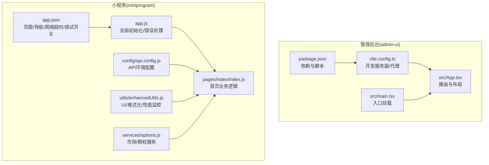
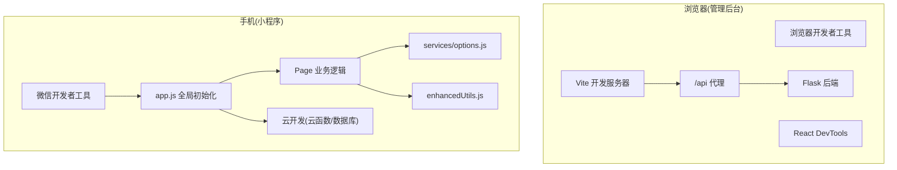
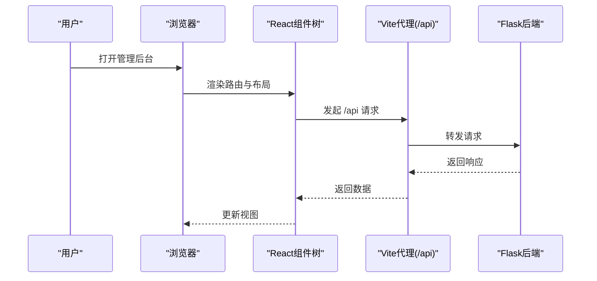
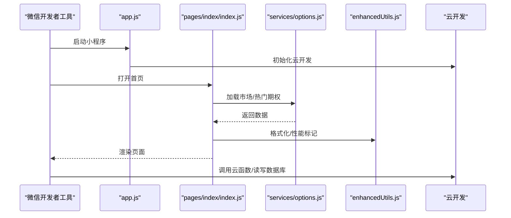
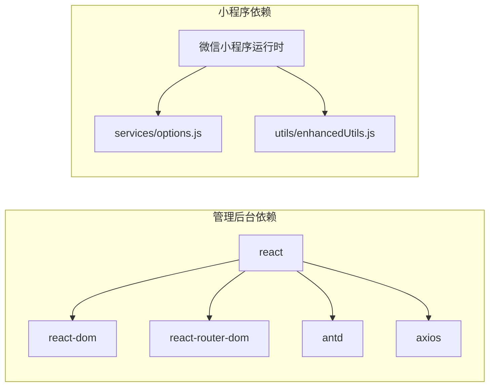

# 前端调试工具

<cite>
**本文引用的文件**
- [admin-ui/package.json](file://admin-ui/package.json)
- [admin-ui/vite.config.ts](file://admin-ui/vite.config.ts)
- [admin-ui/src/main.tsx](file://admin-ui/src/main.tsx)
- [admin-ui/src/App.tsx](file://admin-ui/src/App.tsx)
- [admin-ui/README.md](file://admin-ui/README.md)
- [miniprogram/app.json](file://miniprogram/app.json)
- [miniprogram/app.js](file://miniprogram/app.js)
- [miniprogram/pages/index/index.js](file://miniprogram/pages/index/index.js)
- [miniprogram/utils/enhancedUtils.js](file://miniprogram/utils/enhancedUtils.js)
- [miniprogram/services/options.js](file://miniprogram/services/options.js)
- [miniprogram/config/api.config.js](file://miniprogram/config/api.config.js)
- [utils/request.js](file://utils/request.js)
</cite>

## 目录
1. [简介](#简介)
2. [项目结构](#项目结构)
3. [核心组件](#核心组件)
4. [架构总览](#架构总览)
5. [组件详解](#组件详解)
6. [依赖关系分析](#依赖关系分析)
7. [性能与调试要点](#性能与调试要点)
8. [故障排查指南](#故障排查指南)
9. [结论](#结论)

## 简介
本指南面向前端工程师与测试人员，系统讲解两类前端项目的调试方法与工具链：
- React 管理后台（Vite + React + TypeScript）
- 微信小程序（原生框架 + 云开发）

内容覆盖浏览器开发者工具与 React DevTools 的使用技巧，以及小程序开发者工具的调试面板、真机联调与云开发调试方法，并提供常见问题的定位与解决思路。

## 项目结构
该项目包含两个主要前端工程：
- admin-ui：基于 Vite + React 的管理后台前端
- miniprogram：微信小程序前端，含页面、服务层与工具集

图表来源
- [admin-ui/src/main.tsx](file://admin-ui/src/main.tsx#L1-L14)
- [admin-ui/src/App.tsx](file://admin-ui/src/App.tsx#L1-L57)
- [admin-ui/vite.config.ts](file://admin-ui/vite.config.ts#L1-L78)
- [admin-ui/package.json](file://admin-ui/package.json#L1-L38)
- [miniprogram/app.js](file://miniprogram/app.js#L1-L225)
- [miniprogram/pages/index/index.js](file://miniprogram/pages/index/index.js#L1-L710)
- [miniprogram/utils/enhancedUtils.js](file://miniprogram/utils/enhancedUtils.js#L1-L239)
- [miniprogram/services/options.js](file://miniprogram/services/options.js#L1-L231)
- [miniprogram/config/api.config.js](file://miniprogram/config/api.config.js#L1-L90)
- [miniprogram/app.json](file://miniprogram/app.json#L1-L78)

章节来源
- [admin-ui/package.json](file://admin-ui/package.json#L1-L38)
- [admin-ui/vite.config.ts](file://admin-ui/vite.config.ts#L1-L78)
- [admin-ui/src/main.tsx](file://admin-ui/src/main.tsx#L1-L14)
- [admin-ui/src/App.tsx](file://admin-ui/src/App.tsx#L1-L57)
- [miniprogram/app.json](file://miniprogram/app.json#L1-L78)
- [miniprogram/app.js](file://miniprogram/app.js#L1-L225)
- [miniprogram/pages/index/index.js](file://miniprogram/pages/index/index.js#L1-L710)
- [miniprogram/utils/enhancedUtils.js](file://miniprogram/utils/enhancedUtils.js#L1-L239)
- [miniprogram/services/options.js](file://miniprogram/services/options.js#L1-L231)
- [miniprogram/config/api.config.js](file://miniprogram/config/api.config.js#L1-L90)
- [utils/request.js](file://utils/request.js#L1-L70)

## 核心组件
- 管理后台
  - 入口挂载与主题容器：src/main.tsx
  - 路由与权限守卫：src/App.tsx
  - 开发服务器与 API 代理：vite.config.ts
  - 依赖与脚本：package.json
- 小程序
  - 全局初始化与错误处理：app.js
  - 首页业务逻辑：pages/index/index.js
  - UI/格式化/性能监控：utils/enhancedUtils.js
  - 市场与期权服务：services/options.js
  - API 环境配置：config/api.config.js
  - 应用配置与调试开关：app.json

章节来源
- [admin-ui/src/main.tsx](file://admin-ui/src/main.tsx#L1-L14)
- [admin-ui/src/App.tsx](file://admin-ui/src/App.tsx#L1-L57)
- [admin-ui/vite.config.ts](file://admin-ui/vite.config.ts#L1-L78)
- [admin-ui/package.json](file://admin-ui/package.json#L1-L38)
- [miniprogram/app.js](file://miniprogram/app.js#L1-L225)
- [miniprogram/pages/index/index.js](file://miniprogram/pages/index/index.js#L1-L710)
- [miniprogram/utils/enhancedUtils.js](file://miniprogram/utils/enhancedUtils.js#L1-L239)
- [miniprogram/services/options.js](file://miniprogram/services/options.js#L1-L231)
- [miniprogram/config/api.config.js](file://miniprogram/config/api.config.js#L1-L90)
- [miniprogram/app.json](file://miniprogram/app.json#L1-L78)

## 架构总览
管理后台采用 Vite + React + TypeScript，开发时通过代理将 /api 请求转发至 Flask 后端；小程序通过 app.js 初始化云开发、全局服务与性能监控，页面通过服务层与工具集实现 UI、数据格式化与性能采集。

图表来源
- [admin-ui/vite.config.ts](file://admin-ui/vite.config.ts#L21-L59)
- [admin-ui/src/App.tsx](file://admin-ui/src/App.tsx#L1-L57)
- [miniprogram/app.js](file://miniprogram/app.js#L1-L225)
- [miniprogram/pages/index/index.js](file://miniprogram/pages/index/index.js#L1-L710)
- [miniprogram/services/options.js](file://miniprogram/services/options.js#L1-L231)
- [miniprogram/utils/enhancedUtils.js](file://miniprogram/utils/enhancedUtils.js#L1-L239)

## 组件详解

### 管理后台调试要点（浏览器 + React DevTools）
- 入口与挂载
  - 在 src/main.tsx 中创建根节点并包裹主题容器，便于在 Elements 面板检查根节点结构与样式容器层级。
- 路由与权限
  - App.tsx 中定义了多条路由与权限守卫包装，便于在 Console 面板观察路由切换与守卫逻辑输出。
- 开发服务器与代理
  - vite.config.ts 配置了 /api 代理，开发环境下将请求转发至本地或云端 Flask 服务，便于在 Network 面板观察请求路径与响应状态码。
- Lint 与类型检查
  - package.json 与 admin-ui/README.md 展示了 ESLint 与 TypeScript 配置，有助于在 Console 面板看到类型错误与规则告警。

图表来源
- [admin-ui/src/App.tsx](file://admin-ui/src/App.tsx#L1-L57)
- [admin-ui/vite.config.ts](file://admin-ui/vite.config.ts#L21-L59)

章节来源
- [admin-ui/src/main.tsx](file://admin-ui/src/main.tsx#L1-L14)
- [admin-ui/src/App.tsx](file://admin-ui/src/App.tsx#L1-L57)
- [admin-ui/vite.config.ts](file://admin-ui/vite.config.ts#L1-L78)
- [admin-ui/package.json](file://admin-ui/package.json#L1-L38)
- [admin-ui/README.md](file://admin-ui/README.md#L1-L74)

### 小程序调试要点（微信开发者工具）
- 全局初始化与错误处理
  - app.js 初始化云开发、核心服务、性能监控与全局错误捕获，便于在 Console 面板查看启动日志与错误上报。
- 页面业务逻辑
  - pages/index/index.js 包含搜索、轮播图、快捷功能、下拉刷新等交互，便于在 Network 面板观察请求与在 Elements 面板检查 WXML 结构。
- 工具与服务
  - enhancedUtils.js 提供 UI、格式化与性能监控能力；services/options.js 提供市场指数、热门期权与搜索服务，便于在 Console 面板观察数据流与缓存命中情况。
- API 环境配置
  - config/api.config.js 统一管理开发/生产环境 API 地址，便于在 Network 面板核对请求域名与切换环境。

图表来源
- [miniprogram/app.js](file://miniprogram/app.js#L1-L225)
- [miniprogram/pages/index/index.js](file://miniprogram/pages/index/index.js#L1-L710)
- [miniprogram/services/options.js](file://miniprogram/services/options.js#L1-L231)
- [miniprogram/utils/enhancedUtils.js](file://miniprogram/utils/enhancedUtils.js#L1-L239)

章节来源
- [miniprogram/app.js](file://miniprogram/app.js#L1-L225)
- [miniprogram/pages/index/index.js](file://miniprogram/pages/index/index.js#L1-L710)
- [miniprogram/utils/enhancedUtils.js](file://miniprogram/utils/enhancedUtils.js#L1-L239)
- [miniprogram/services/options.js](file://miniprogram/services/options.js#L1-L231)
- [miniprogram/config/api.config.js](file://miniprogram/config/api.config.js#L1-L90)
- [miniprogram/app.json](file://miniprogram/app.json#L1-L78)

## 依赖关系分析
- 管理后台
  - 依赖 React、React DOM、React Router、Ant Design、Axios 等；开发脚本通过 Vite 启动，代理 /api 到后端。
- 小程序
  - 通过 app.js 注入全局服务（存储、性能、通知），页面通过 services 与 utils 进行数据与 UI 处理；config/api.config.js 统一 API 地址。

图表来源
- [admin-ui/package.json](file://admin-ui/package.json#L13-L36)
- [miniprogram/services/options.js](file://miniprogram/services/options.js#L1-L231)
- [miniprogram/utils/enhancedUtils.js](file://miniprogram/utils/enhancedUtils.js#L1-L239)

章节来源
- [admin-ui/package.json](file://admin-ui/package.json#L1-L38)
- [miniprogram/services/options.js](file://miniprogram/services/options.js#L1-L231)
- [miniprogram/utils/enhancedUtils.js](file://miniprogram/utils/enhancedUtils.js#L1-L239)

## 性能与调试要点
- 浏览器端
  - 使用 React DevTools 检查组件树、Props 与 State，定位渲染热点与不必要的重渲染。
  - 在 Network 面板观察 /api 请求耗时、缓存策略与后端响应码；结合 Console 面板查看代理错误与 CORS 异常。
  - 在 Sources 面板设置断点，逐步跟踪异步流程与状态变更。
- 小程序端
  - 在微信开发者工具 Console 面板查看启动日志、错误上报与性能指标；在 Network 面板核对请求域名与超时设置。
  - 使用 app.js 中的性能监控与 enhancedUtils.js 的 markStart/markEnd 对关键路径打点，定位慢操作。
  - 在设备调试模式下进行真机联调，观察内存与 FPS 指标变化。

章节来源
- [admin-ui/vite.config.ts](file://admin-ui/vite.config.ts#L21-L59)
- [admin-ui/src/App.tsx](file://admin-ui/src/App.tsx#L1-L57)
- [miniprogram/app.js](file://miniprogram/app.js#L144-L175)
- [miniprogram/utils/enhancedUtils.js](file://miniprogram/utils/enhancedUtils.js#L126-L192)
- [miniprogram/app.json](file://miniprogram/app.json#L72-L75)

## 故障排查指南
- 组件渲染问题
  - 现象：页面空白、组件不更新、重复渲染。
  - 排查：在 React DevTools 中检查 props/state 变化；在 Console 面板查看是否有异常抛出；在 Elements 面板确认 DOM 结构是否符合预期。
- 状态管理异常
  - 现象：状态不同步、更新无效。
  - 排查：在 React DevTools 中观察状态树变化；在 Sources 面板设置断点，跟踪状态变更路径。
- API 调用失败
  - 现象：Network 面板出现 401/502、跨域错误或超时。
  - 排查：确认 vite.config.ts 的代理目标与后端是否启动；检查后端返回的业务错误码；在 Console 面板查看代理错误日志。
- 小程序网络与云开发
  - 现象：Network 面板请求失败、云函数调用报错。
  - 排查：核对 config/api.config.js 的环境配置；在 Console 面板查看 app.js 的错误上报；在 Network 面板确认超时与域名白名单。
- 性能瓶颈
  - 现象：页面卡顿、FPS 下降。
  - 排查：使用 enhancedUtils.js 的性能标记与 FPS 监控；在 Console 面板查看内存警告与缓存命中率；在 Sources 面板定位长任务。

章节来源
- [admin-ui/vite.config.ts](file://admin-ui/vite.config.ts#L21-L59)
- [admin-ui/src/App.tsx](file://admin-ui/src/App.tsx#L1-L57)
- [miniprogram/config/api.config.js](file://miniprogram/config/api.config.js#L1-L90)
- [miniprogram/app.js](file://miniprogram/app.js#L191-L198)
- [miniprogram/utils/enhancedUtils.js](file://miniprogram/utils/enhancedUtils.js#L126-L192)
- [utils/request.js](file://utils/request.js#L1-L70)

## 结论
通过合理运用浏览器开发者工具与 React DevTools，以及微信开发者工具与小程序云开发能力，可以高效定位与解决管理后台与小程序中的渲染、状态与网络问题。建议在开发流程中持续使用性能标记与错误上报机制，形成闭环的调试与优化体系。