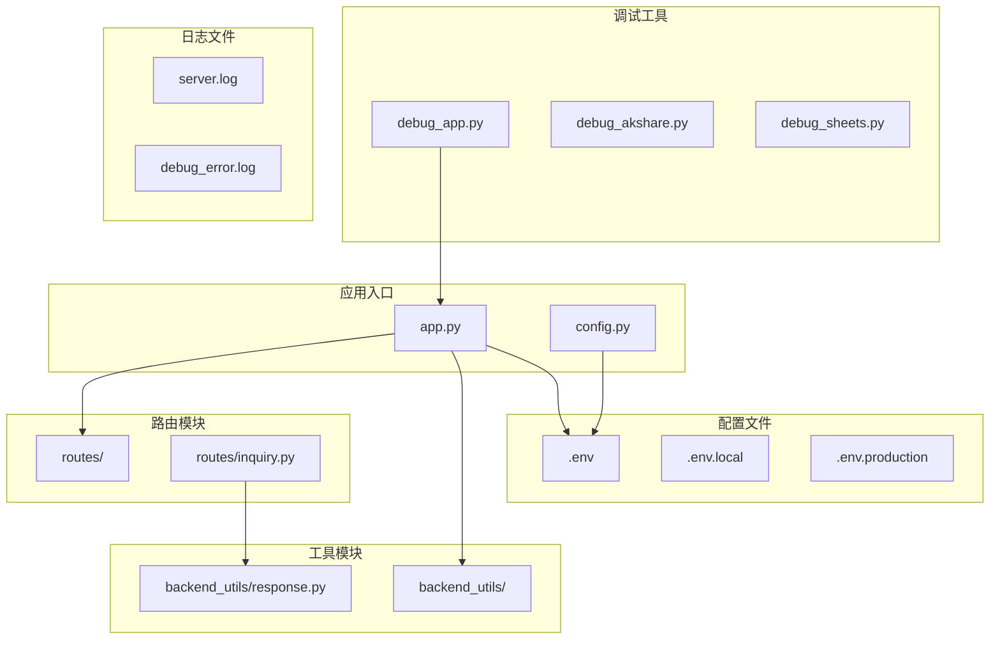
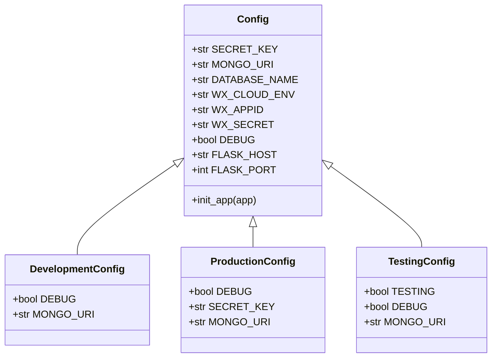
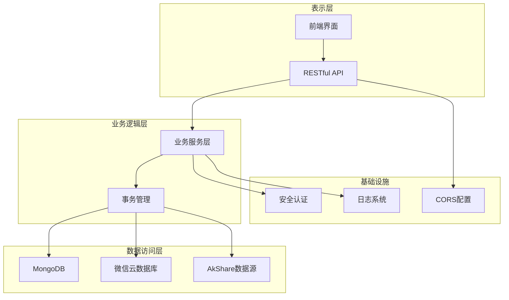
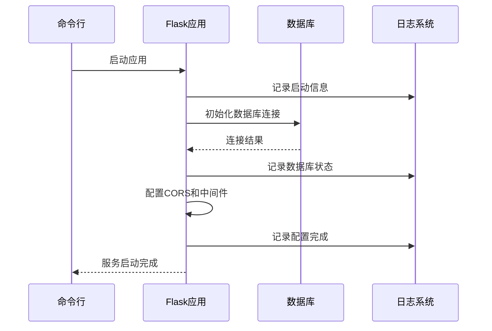
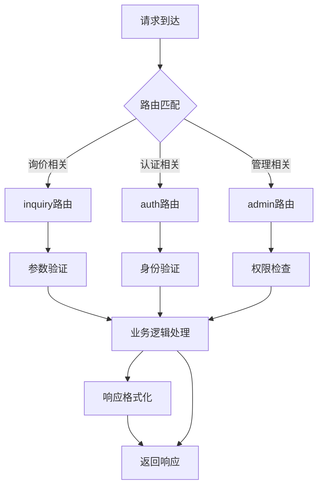
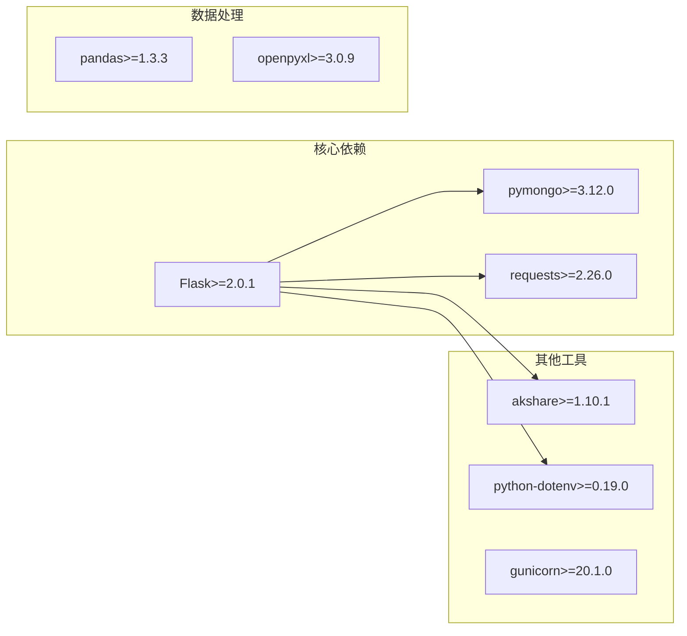

# 后端调试工具

<cite>
**本文档引用的文件**
- [app.py](file://app.py)
- [config.py](file://config.py)
- [requirements.txt](file://requirements.txt)
- [.env](file://.env)
- [.env.local](file://.env.local)
- [.env.production](file://.env.production)
- [server.log](file://server.log)
- [debug_error.log](file://debug_error.log)
- [debug_app.py](file://debug_app.py)
- [debug_akshare.py](file://debug_akshare.py)
- [debug_sheets.py](file://debug_sheets.py)
- [routes/inquiry.py](file://routes/inquiry.py)
- [postman_collection.json](file://postman_collection.json)
- [backend_utils/response.py](file://backend_utils/response.py)
</cite>

## 目录
1. [简介](#简介)
2. [项目结构](#项目结构)
3. [核心组件](#核心组件)
4. [架构概览](#架构概览)
5. [详细组件分析](#详细组件分析)
6. [依赖关系分析](#依赖关系分析)
7. [性能考虑](#性能考虑)
8. [故障排除指南](#故障排除指南)
9. [结论](#结论)

## 简介

本指南专注于Flask应用的调试方法和Python开发工具的使用。项目采用Flask框架构建，集成了MongoDB数据库、微信云数据库、AkShare数据源等技术栈。文档将详细说明：

- Flask应用的调试模式配置和错误追踪
- Python调试工具的使用方法
- API接口调试技巧（Postman、curl）
- 数据库调试方法（MongoDB查询、数据一致性检查）
- 性能分析工具的使用

## 项目结构

该项目采用模块化设计，主要包含以下关键目录和文件：



**图表来源**
- [app.py](file://app.py#L1-L350)
- [config.py](file://config.py#L1-L132)
- [routes/inquiry.py](file://routes/inquiry.py#L1-L175)
- [backend_utils/response.py](file://backend_utils/response.py#L1-L118)

**章节来源**
- [app.py](file://app.py#L1-L350)
- [config.py](file://config.py#L1-L132)

## 核心组件

### Flask应用配置

应用的核心配置通过多种方式实现：

1. **环境变量管理**：支持多环境配置（development、production）
2. **数据库连接**：MongoDB和微信云数据库双数据源
3. **CORS配置**：跨域资源共享设置
4. **日志系统**：完整的日志记录机制

### 配置管理

项目实现了灵活的配置管理：



**图表来源**
- [config.py](file://config.py#L22-L132)

**章节来源**
- [config.py](file://config.py#L1-L132)

## 架构概览

应用采用分层架构设计，包含以下关键层次：



**图表来源**
- [app.py](file://app.py#L103-L276)
- [config.py](file://config.py#L35-L63)

## 详细组件分析

### Flask应用启动和调试

应用启动过程包含多个调试点：



**图表来源**
- [app.py](file://app.py#L333-L350)
- [app.py](file://app.py#L103-L166)

### 调试模式配置

Flask应用的调试模式通过以下方式配置：

1. **环境变量控制**：`NODE_ENV=development` 启用调试模式
2. **端口配置**：支持自定义端口，避免权限问题
3. **重新加载禁用**：开发环境下禁用reloader提高稳定性

**章节来源**
- [app.py](file://app.py#L336-L350)
- [app.py](file://app.py#L90-L101)

### API路由调试

路由模块提供了完整的API接口：



**图表来源**
- [routes/inquiry.py](file://routes/inquiry.py#L11-L175)

**章节来源**
- [routes/inquiry.py](file://routes/inquiry.py#L1-L175)

### 统一响应格式

系统实现了统一的API响应格式：

| 字段名 | 类型 | 描述 | 示例 |
|--------|------|------|------|
| success | boolean | 操作是否成功 | true/false |
| message | string | 响应消息 | "操作成功" |
| code | integer | HTTP状态码 | 200/400 |
| data | any | 返回数据 | {} |

**章节来源**
- [backend_utils/response.py](file://backend_utils/response.py#L11-L118)

## 依赖关系分析

项目的主要依赖关系如下：



**图表来源**
- [requirements.txt](file://requirements.txt#L1-L12)

**章节来源**
- [requirements.txt](file://requirements.txt#L1-L12)

## 性能考虑

### 日志性能监控

应用实现了多层次的日志记录机制：

1. **控制台输出**：实时调试信息
2. **文件日志**：持久化存储，支持轮转
3. **错误追踪**：完整的异常堆栈信息

### 数据库性能优化

1. **连接池管理**：避免频繁连接建立
2. **超时配置**：防止长时间阻塞
3. **异步操作**：后台定时任务分离

## 故障排除指南

### 常见问题诊断

#### 数据库连接问题

**症状**：MongoDB连接失败，服务降级为无数据库模式

**诊断步骤**：
1. 检查MongoDB服务状态
2. 验证连接字符串格式
3. 确认网络连通性
4. 查看超时配置

**解决方法**：
```python
# 在app.py中查看连接日志
# 关键日志：MongoDB连接失败
# 关键日志：服务将以无数据库模式运行
```

**章节来源**
- [server.log](file://server.log#L5-L8)

#### API调用问题

**症状**：405 Method Not Allowed错误

**诊断步骤**：
1. 检查URL路径是否正确
2. 验证HTTP方法是否匹配
3. 确认路由注册情况

**解决方法**：
```bash
# 使用正确的URL路径
curl -X POST http://localhost:5002/api/v1/auth/login
```

**章节来源**
- [server.log](file://server.log#L173-L192)

### 调试工具使用

#### Python调试器(pdb)

```python
# 在代码中添加断点
import pdb; pdb.set_trace()

# 或使用调试脚本
python debug_app.py
```

#### 日志分析

```python
# 查看服务器日志
tail -f server.log

# 分析错误日志
cat debug_error.log
```

#### 环境变量配置

```bash
# 开发环境
export NODE_ENV=development
export FLASK_PORT=5002

# 生产环境
export NODE_ENV=production
export FLASK_PORT=5002
```

**章节来源**
- [debug_app.py](file://debug_app.py#L1-L26)
- [debug_error.log](file://debug_error.log#L1-L12)

### API调试方法

#### Postman使用技巧

1. **环境变量设置**：
   - base_url: https://flask-ym1v-210758-7-1374336462.sh.run.tcloudbase.com/api/v1

2. **请求示例**：
   ```json
   {
       "selectedProduct": {
           "name": "上证50",
           "code": "000016"
       },
       "optionType": "call",
       "structure": "vanilla",
       "term": "1M",
       "notionalAmount": 100,
       "strikePrice": 100,
       "contactName": "测试用户",
       "phone": "13800138000"
   }
   ```

#### curl命令调试

```bash
# 获取报价列表
curl -X GET http://localhost:5002/api/v1/quotes

# 提交询价
curl -X POST http://localhost:5002/api/v1/inquiry \
  -H "Content-Type: application/json" \
  -d '{
    "selectedProduct": {"name": "上证50", "code": "000016"},
    "optionType": "call",
    "structure": "vanilla",
    "term": "1M",
    "notionalAmount": 100,
    "strikePrice": 100,
    "contactName": "测试用户",
    "phone": "13800138000"
  }'

# 管理员登录
curl -X POST http://localhost:5002/api/v1/auth/login \
  -H "Content-Type: application/json" \
  -d '{
    "username": "admin",
    "password": "admin123"
  }'
```

**章节来源**
- [postman_collection.json](file://postman_collection.json#L1-L125)

### 数据库调试

#### MongoDB查询调试

```bash
# 连接到MongoDB
mongosh mongodb://localhost:27017/option_trading

# 查看集合
show collections

# 查询询价数据
db.inquiries.find().pretty()

# 检查索引
db.inquiries.getIndexes()
```

#### 数据一致性检查

```python
# 使用调试脚本检查Excel文件
python debug_sheets.py

# 检查AkShare数据源
python debug_akshare.py
```

**章节来源**
- [debug_sheets.py](file://debug_sheets.py#L1-L30)
- [debug_akshare.py](file://debug_akshare.py#L1-L13)

## 结论

本指南提供了全面的Flask应用调试方法和工具使用指导。通过合理配置环境变量、利用日志系统、使用调试工具和API测试方法，可以有效地诊断和解决后端服务中的各种问题。

关键要点：
1. **环境配置**：正确设置NODE_ENV和端口配置
2. **日志监控**：充分利用server.log进行问题定位
3. **API测试**：使用Postman和curl进行接口验证
4. **数据库调试**：结合MongoDB和Excel文件进行数据验证
5. **性能分析**：通过日志和错误追踪优化系统性能

这些实践方法可以帮助开发者快速识别和解决Flask应用中的常见问题，提高开发效率和系统稳定性。