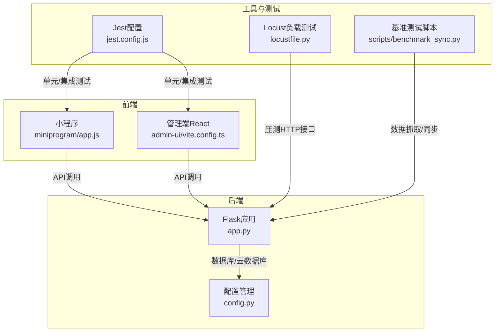
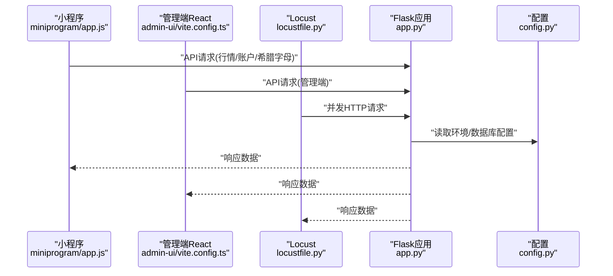
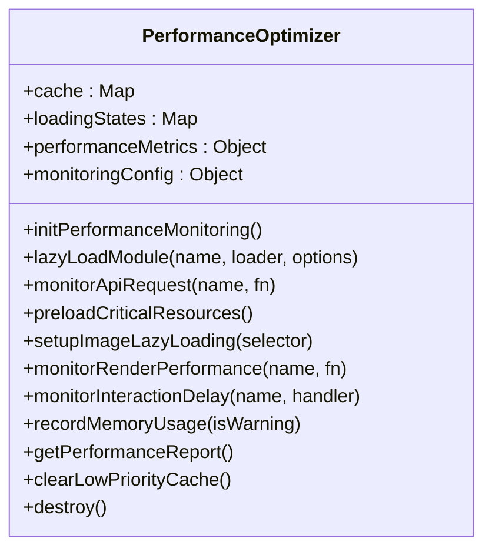
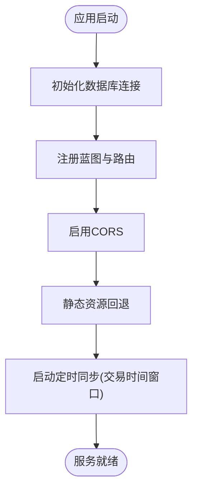
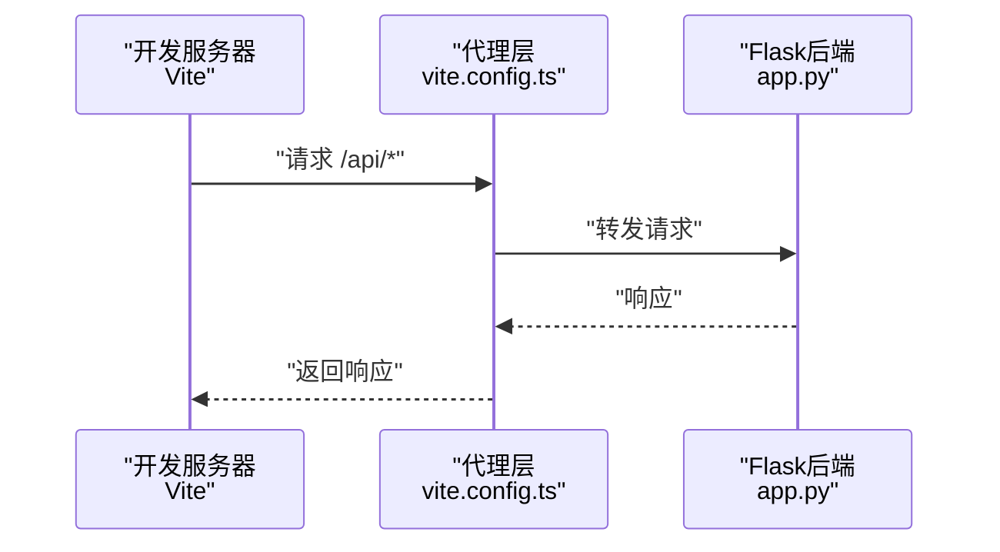
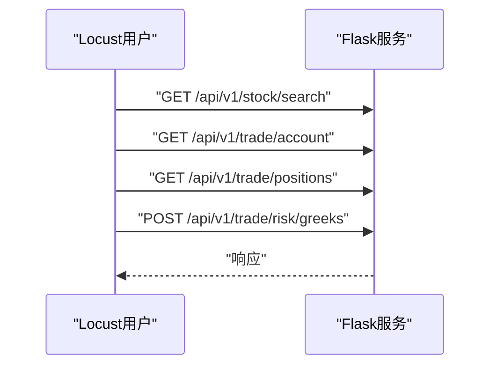
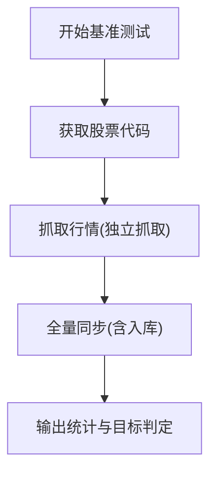
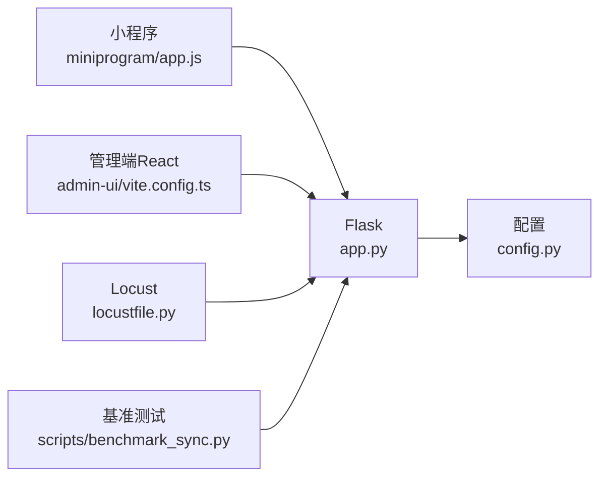

# 性能监控

<cite>
**本文引用的文件**   
- [locustfile.py](file://locustfile.py)
- [jest.config.js](file://jest.config.js)
- [package.json](file://package.json)
- [requirements.txt](file://requirements.txt)
- [backend_utils/performance-optimizer.js](file://backend_utils/performance-optimizer.js)
- [scripts/benchmark_sync.py](file://scripts/benchmark_sync.py)
- [app.py](file://app.py)
- [config.py](file://config.py)
- [admin-ui/vite.config.ts](file://admin-ui/vite.config.ts)
- [admin-ui/package.json](file://admin-ui/package.json)
- [miniprogram/app.js](file://miniprogram/app.js)
</cite>

## 目录
1. [简介](#简介)
2. [项目结构](#项目结构)
3. [核心组件](#核心组件)
4. [架构总览](#架构总览)
5. [详细组件分析](#详细组件分析)
6. [依赖关系分析](#依赖关系分析)
7. [性能考量](#性能考量)
8. [故障排查指南](#故障排查指南)
9. [结论](#结论)
10. [附录](#附录)

## 简介
本指南聚焦于该场外期权项目的性能监控与优化实践，覆盖前端性能监控（小程序与React管理端）、后端性能分析（Flask应用、数据库查询与API响应时间）、负载测试（Locust分布式负载测试）、性能测试（Jest/Vitest）以及自定义基准测试脚本。文档还提供性能瓶颈识别方法（CPU、内存、I/O）与优化建议（缓存策略、数据库索引、代码优化），帮助团队建立系统化的性能保障体系。

## 项目结构
该项目采用多端协同架构：后端使用Flask提供REST API；管理端前端基于Vite+React；小程序端基于微信小程序框架；同时包含Node.js与Python双栈工具链，支持性能监控、基准测试与负载测试。

**图表来源**
- [miniprogram/app.js](file://miniprogram/app.js#L1-L225)
- [admin-ui/vite.config.ts](file://admin-ui/vite.config.ts#L1-L78)
- [app.py](file://app.py#L1-L350)
- [config.py](file://config.py#L1-L132)
- [locustfile.py](file://locustfile.py#L1-L38)
- [jest.config.js](file://jest.config.js#L1-L10)
- [scripts/benchmark_sync.py](file://scripts/benchmark_sync.py#L1-L57)

**章节来源**
- [package.json](file://package.json#L1-L50)
- [requirements.txt](file://requirements.txt#L1-L12)

## 核心组件
- 小程序性能监控与优化器：提供懒加载、缓存、API监控、渲染监控、交互延迟监控、内存使用记录与周期性性能报告生成功能。
- Flask后端：统一健康检查、CORS、日志、静态资源托管、后台定时任务调度与API路由注册。
- 管理端前端（Vite+React）：开发代理、测试环境、构建配置。
- 负载测试（Locust）：模拟用户行为，对搜索、账户、持仓、希腊字母计算等接口进行压力测试。
- 基准测试脚本：对A股行情抓取、同步入库进行耗时统计与目标达成评估。
- Jest/Vitest：测试框架配置，支持前端与Node侧测试。

**章节来源**
- [backend_utils/performance-optimizer.js](file://backend_utils/performance-optimizer.js#L1-L817)
- [app.py](file://app.py#L103-L276)
- [admin-ui/vite.config.ts](file://admin-ui/vite.config.ts#L1-L78)
- [locustfile.py](file://locustfile.py#L1-L38)
- [scripts/benchmark_sync.py](file://scripts/benchmark_sync.py#L1-L57)
- [jest.config.js](file://jest.config.js#L1-L10)

## 架构总览
下图展示从前端到后端再到数据库的整体调用链路与监控点位。

**图表来源**
- [miniprogram/app.js](file://miniprogram/app.js#L144-L175)
- [admin-ui/vite.config.ts](file://admin-ui/vite.config.ts#L21-L59)
- [locustfile.py](file://locustfile.py#L16-L32)
- [app.py](file://app.py#L183-L209)
- [config.py](file://config.py#L22-L63)

## 详细组件分析

### 小程序性能监控与优化器
该模块为小程序端提供全方位性能监控与优化能力，包括：
- 懒加载与缓存：模块按需加载、带TTL缓存、加载状态去重、低优先级缓存清理。
- API请求监控：记录响应时间、估算网络速度、触发性能告警。
- 渲染与交互监控：记录组件渲染耗时、用户交互延迟，超过阈值触发告警。
- 内存与网络监控：周期性记录内存使用、监听网络状态变化并清理缓存。
- 性能报告：聚合页面加载、API、缓存、渲染、交互、网络与内存指标，生成建议清单。

**图表来源**
- [backend_utils/performance-optimizer.js](file://backend_utils/performance-optimizer.js#L7-L767)

**章节来源**
- [backend_utils/performance-optimizer.js](file://backend_utils/performance-optimizer.js#L1-L817)
- [miniprogram/app.js](file://miniprogram/app.js#L44-L119)

### Flask后端性能分析
- 健康检查与路由：统一注册API蓝图，提供健康检查端点。
- CORS与静态资源：跨域配置与静态资源回退至React构建产物。
- 日志与错误处理：请求前后日志、统一错误响应、500/404处理。
- 后台定时任务：按交易时间窗口自动同步行情，降低非交易时段开销。
- 数据库连接：MongoDB连接初始化与失败降级策略。

**图表来源**
- [app.py](file://app.py#L103-L276)
- [app.py](file://app.py#L279-L330)

**章节来源**
- [app.py](file://app.py#L1-L350)
- [config.py](file://config.py#L1-L132)

### 管理端前端（Vite+React）性能
- 开发代理：将/api前缀代理到Flask或云端目标，支持错误提示与超时配置。
- 测试环境：jsdom环境，便于DOM相关测试。
- 依赖与构建：React、Ant Design、Vite、TypeScript生态，减少重复打包。

**图表来源**
- [admin-ui/vite.config.ts](file://admin-ui/vite.config.ts#L21-L59)
- [admin-ui/package.json](file://admin-ui/package.json#L1-L38)

**章节来源**
- [admin-ui/vite.config.ts](file://admin-ui/vite.config.ts#L1-L78)
- [admin-ui/package.json](file://admin-ui/package.json#L1-L38)

### 负载测试（Locust）
- 用户模型：继承HttpUser，模拟登录（携带令牌）、访问搜索、账户、持仓、希腊字母计算等端点。
- 任务权重：搜索任务权重较高，希腊字母计算为POST请求，便于评估计算密集型接口。
- 等待时间：随机等待，模拟真实用户行为。

**图表来源**
- [locustfile.py](file://locustfile.py#L4-L37)

**章节来源**
- [locustfile.py](file://locustfile.py#L1-L38)

### 基准测试脚本（A股行情抓取与同步）
- 目标：评估代码获取、独立抓取、完整同步的耗时，判断是否满足“总耗时小于60秒”的目标。
- 关键步骤：获取股票代码、分片抓取行情、调用同步服务入库，并输出处理数量与UPSERT耗时。

**图表来源**
- [scripts/benchmark_sync.py](file://scripts/benchmark_sync.py#L14-L56)

**章节来源**
- [scripts/benchmark_sync.py](file://scripts/benchmark_sync.py#L1-L57)

### 性能测试（Jest/Vitest）
- 配置：Node环境、根目录扫描、测试匹配规则、全局测试初始化、假时钟。
- 作用：保证前端与Node侧逻辑在变更时具备回归能力，间接保障性能稳定。

**章节来源**
- [jest.config.js](file://jest.config.js#L1-L10)
- [admin-ui/package.json](file://admin-ui/package.json#L10)

## 依赖关系分析
- 前端到后端：小程序与管理端通过HTTP接口调用Flask；Vite代理将/api请求转发至Flask或云端目标。
- 后端到配置：Flask读取环境变量与配置类，决定数据库与CORS策略。
- 工具到后端：Locust与基准测试脚本直接访问Flask接口，形成外部性能输入。

**图表来源**
- [miniprogram/app.js](file://miniprogram/app.js#L144-L175)
- [admin-ui/vite.config.ts](file://admin-ui/vite.config.ts#L21-L59)
- [locustfile.py](file://locustfile.py#L16-L32)
- [scripts/benchmark_sync.py](file://scripts/benchmark_sync.py#L1-L57)
- [app.py](file://app.py#L103-L209)
- [config.py](file://config.py#L22-L63)

**章节来源**
- [package.json](file://package.json#L1-L50)
- [requirements.txt](file://requirements.txt#L1-L12)

## 性能考量
- 前端性能监控要点
  - 使用小程序性能优化器记录页面加载、API响应、渲染与交互延迟，设定阈值触发告警。
  - 对关键资源进行预加载与分包预下载，结合懒加载策略降低首屏与关键路径耗时。
  - 监控内存使用与网络状态变化，必要时清理低优先级缓存。
- 后端性能要点
  - 利用Flask健康检查与日志定位慢请求与错误；在交易时间窗口内执行定时同步，避免非高峰时段压力。
  - 通过CORS与静态资源回退提升跨域与资源加载效率。
- 负载测试与基准测试
  - Locust模拟真实用户行为，关注接口平均响应时间与错误率；基准测试脚本量化抓取与同步耗时，持续评估性能目标达成情况。
- 测试与质量
  - Jest/Vitest在CI中运行，确保变更不会引入性能退化。

[本节为通用指导，无需列出具体文件来源]

## 故障排查指南
- 前端性能告警
  - 若出现“API响应缓慢”“页面加载过长”“渲染耗时过长”“交互延迟过大”，优先检查对应模块的懒加载与缓存命中率，优化热点路径。
  - 内存警告频繁时，清理低优先级缓存并缩短缓存TTL。
- 后端接口异常
  - 查看Flask日志与错误处理器输出，确认404/500错误原因；检查CORS配置与静态资源回退逻辑。
  - 定时同步任务在非交易时间被跳过属预期，若异常执行可检查环境变量与时间窗口逻辑。
- 负载测试失败
  - 检查代理目标与超时配置，确认Flask服务已启动且可访问；关注Locust任务权重与等待时间设置。
- 基准测试未达标
  - 评估抓取并发、分片大小与同步入库策略，逐步调整以逼近目标耗时。

**章节来源**
- [backend_utils/performance-optimizer.js](file://backend_utils/performance-optimizer.js#L160-L183)
- [app.py](file://app.py#L211-L274)
- [admin-ui/vite.config.ts](file://admin-ui/vite.config.ts#L26-L58)
- [scripts/benchmark_sync.py](file://scripts/benchmark_sync.py#L50-L54)

## 结论
通过小程序端性能优化器、Flask后端健康与日志、Vite代理与测试配置、Locust负载测试与基准测试脚本，项目形成了从前端到后端、从开发到生产的全链路性能保障体系。建议持续运行性能报告与告警机制，配合定期基准测试与负载测试，确保系统在高并发与大数据场景下的稳定性与响应速度。

[本节为总结性内容，无需列出具体文件来源]

## 附录
- 前端性能监控最佳实践
  - 设定合理阈值（API响应、页面加载、渲染、交互），定期复审并动态调整。
  - 对热点API与组件进行重点监控，结合缓存命中率与错误率进行优化。
- 后端性能优化建议
  - 交易时间窗口内集中同步，避免全天高频写入；优化查询索引与分页策略。
  - 启用CORS白名单与静态资源压缩，减少跨域与传输开销。
- 负载测试与基准测试建议
  - 逐步提升并发与数据规模，观察P95/P99响应时间与错误率；将关键指标纳入CI质量门禁。

[本节为通用指导，无需列出具体文件来源]