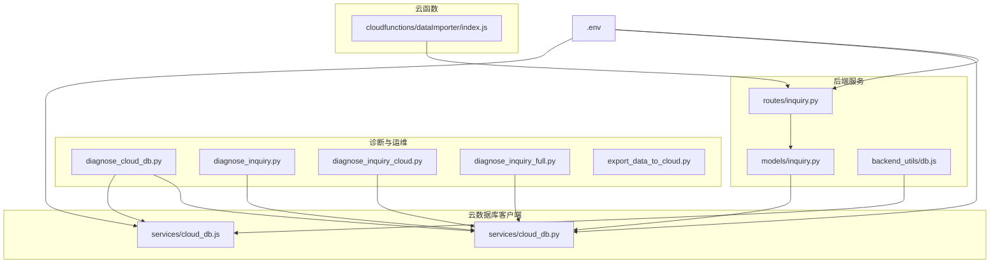
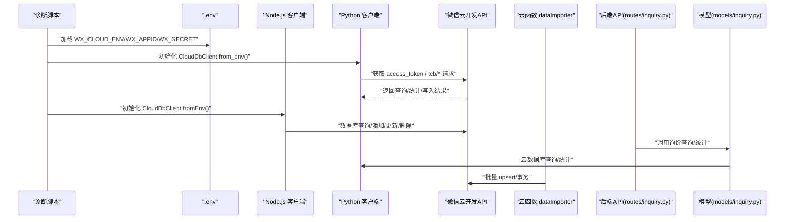
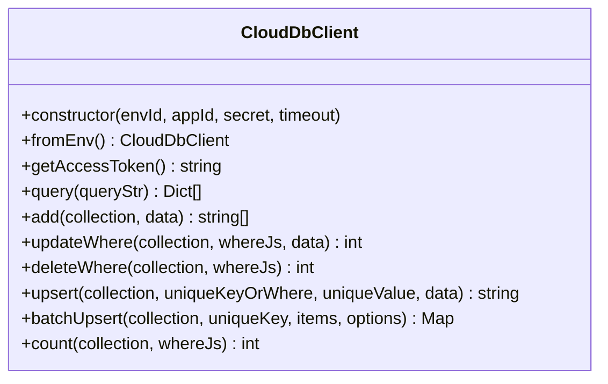
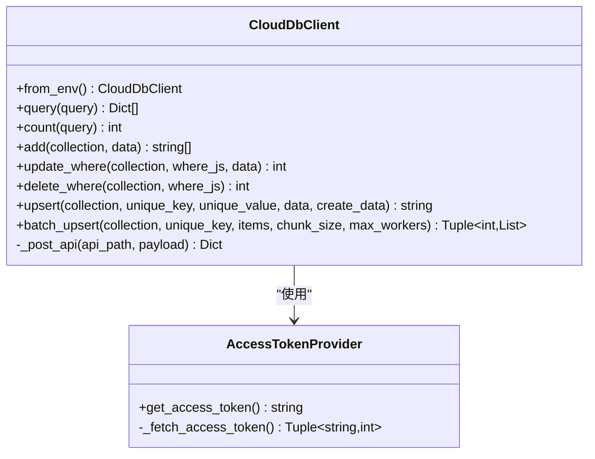
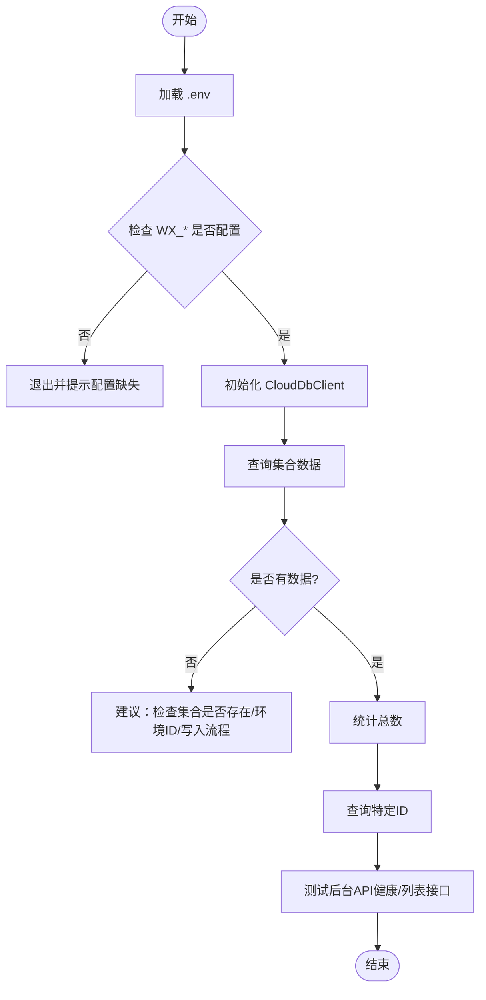
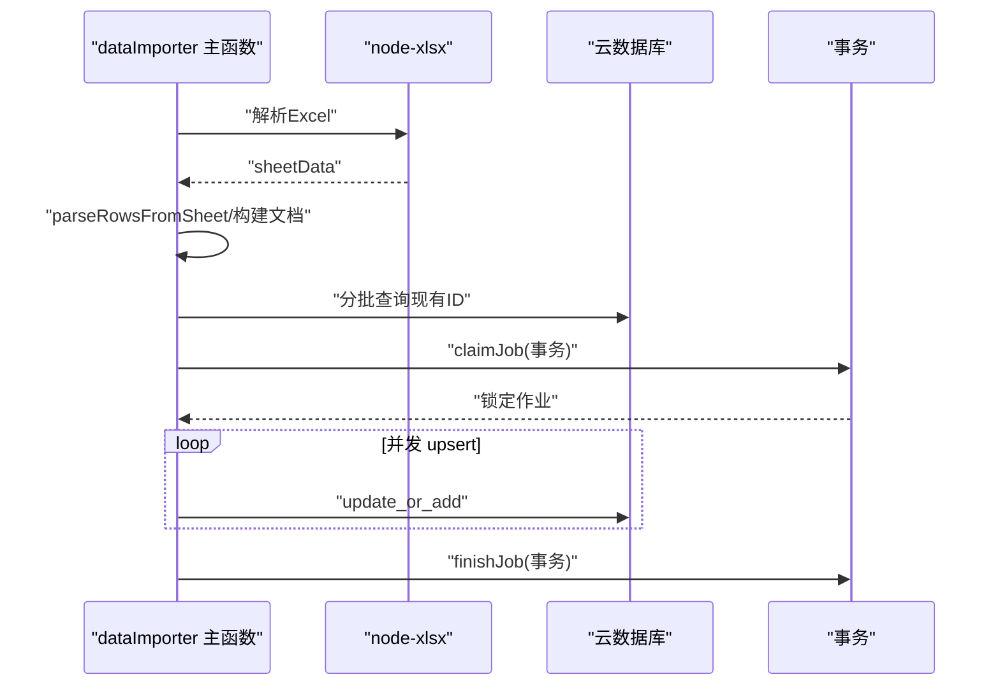
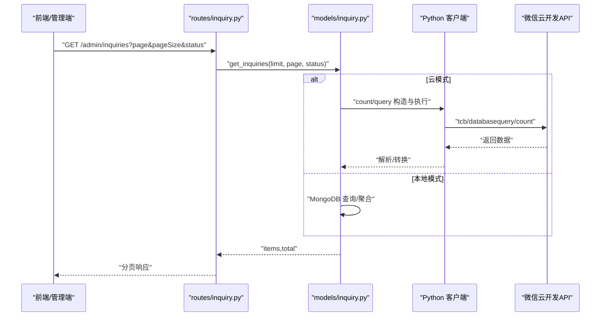
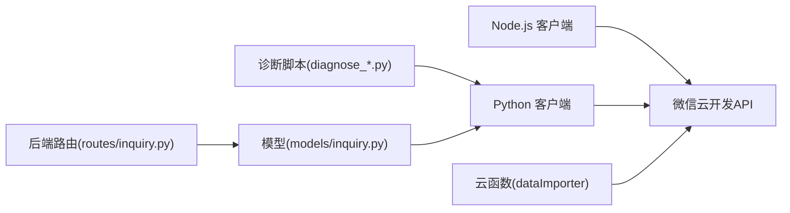

# 数据库调试

<cite>
**本文引用的文件**
- [diagnose_cloud_db.py](file://diagnose_cloud_db.py)
- [services/cloud_db.js](file://services/cloud_db.js)
- [services/cloud_db.py](file://services/cloud_db.py)
- [backend_utils/db.js](file://backend_utils/db.js)
- [cloudfunctions/dataImporter/index.js](file://cloudfunctions/dataImporter/index.js)
- [diagnose_inquiry.py](file://diagnose_inquiry.py)
- [diagnose_inquiry_cloud.py](file://diagnose_inquiry_cloud.py)
- [diagnose_inquiry_full.py](file://diagnose_inquiry_full.py)
- [.env](file://.env)
- [export_data_to_cloud.py](file://export_data_to_cloud.py)
- [test_cloud_db.js](file://test_cloud_db.js)
- [routes/inquiry.py](file://routes/inquiry.py)
- [models/inquiry.py](file://models/inquiry.py)
</cite>

## 目录
1. [简介](#简介)
2. [项目结构](#项目结构)
3. [核心组件](#核心组件)
4. [架构总览](#架构总览)
5. [详细组件分析](#详细组件分析)
6. [依赖关系分析](#依赖关系分析)
7. [性能考量](#性能考量)
8. [故障排查指南](#故障排查指南)
9. [结论](#结论)
10. [附录](#附录)

## 简介
本指南面向数据库调试与问题诊断，聚焦于以下目标：
- 微信云开发数据库（云数据库）的连接、查询、导入与运维调试
- 云数据库查询调试技巧：查询计划与 explain 类似分析、索引使用检查、慢查询日志与性能监控
- 数据一致性检查：数据完整性验证、外键约束检查、事务回滚调试
- 数据迁移调试：备份恢复测试、数据格式转换、批量操作异常处理
- 常见问题诊断流程：连接超时、查询缓慢、数据丢失等

本指南结合仓库中的诊断脚本、云数据库客户端、路由与模型层，提供从底层到上层的系统化调试方法。

## 项目结构
围绕数据库调试的关键目录与文件如下：
- 诊断脚本：用于环境变量检查、云数据库连通性、数据存在性与API可用性验证
- 云数据库客户端：Node.js 与 Python 双端实现，封装查询、添加、更新、删除、upsert、批量 upsert、并发与重试
- 数据导入云函数：Excel 解析、去重、并发 upsert、事务声明式处理
- 后端路由与模型：询价接口、分页与统计、查询构造与索引初始化
- 环境配置：.env 中包含微信云开发关键变量

图表来源
- [diagnose_cloud_db.py](file://diagnose_cloud_db.py#L1-L101)
- [services/cloud_db.js](file://services/cloud_db.js#L1-L327)
- [services/cloud_db.py](file://services/cloud_db.py#L1-L533)
- [routes/inquiry.py](file://routes/inquiry.py#L1-L175)
- [models/inquiry.py](file://models/inquiry.py#L1-L148)
- [backend_utils/db.js](file://backend_utils/db.js#L1-L64)
- [cloudfunctions/dataImporter/index.js](file://cloudfunctions/dataImporter/index.js#L1-L392)
- [.env](file://.env#L1-L32)

章节来源
- [diagnose_cloud_db.py](file://diagnose_cloud_db.py#L1-L101)
- [services/cloud_db.js](file://services/cloud_db.js#L1-L327)
- [services/cloud_db.py](file://services/cloud_db.py#L1-L533)
- [routes/inquiry.py](file://routes/inquiry.py#L1-L175)
- [models/inquiry.py](file://models/inquiry.py#L1-L148)
- [backend_utils/db.js](file://backend_utils/db.js#L1-L64)
- [cloudfunctions/dataImporter/index.js](file://cloudfunctions/dataImporter/index.js#L1-L392)
- [.env](file://.env#L1-L32)

## 核心组件
- 云数据库客户端（Node.js）：支持 access_token 获取、并发限流、重试退避、查询/添加/更新/删除/upsert/batch_upsert/count 等
- 云数据库客户端（Python）：与 Node.js 对等能力，带连接池、线程安全、并发信号量、重试与错误分类
- 诊断脚本：环境变量加载与校验、客户端初始化、查询验证、返回数据结构与空集提示
- 数据导入云函数：Excel 解析、字段映射、去重、并发 upsert、事务声明式处理、作业状态管理
- 后端路由与模型：询价接口、分页与统计、查询构造、索引初始化
- 环境配置：.env 中的 WX_* 关键变量与前端代理配置

章节来源
- [services/cloud_db.js](file://services/cloud_db.js#L1-L327)
- [services/cloud_db.py](file://services/cloud_db.py#L1-L533)
- [diagnose_cloud_db.py](file://diagnose_cloud_db.py#L1-L101)
- [cloudfunctions/dataImporter/index.js](file://cloudfunctions/dataImporter/index.js#L1-L392)
- [routes/inquiry.py](file://routes/inquiry.py#L1-L175)
- [models/inquiry.py](file://models/inquiry.py#L1-L148)
- [.env](file://.env#L1-L32)

## 架构总览
下图展示从诊断脚本到云数据库、再到后端服务与云函数的整体交互：

图表来源
- [diagnose_cloud_db.py](file://diagnose_cloud_db.py#L48-L98)
- [services/cloud_db.js](file://services/cloud_db.js#L27-L37)
- [services/cloud_db.py](file://services/cloud_db.py#L162-L207)
- [routes/inquiry.py](file://routes/inquiry.py#L36-L58)
- [models/inquiry.py](file://models/inquiry.py#L55-L101)
- [cloudfunctions/dataImporter/index.js](file://cloudfunctions/dataImporter/index.js#L251-L265)

## 详细组件分析

### 云数据库客户端（Node.js）
- 能力要点
  - 从环境变量加载 WX_CLOUD_ENV/WX_APPID/WX_SECRET，校验占位符
  - access_token 缓存与过期时间控制
  - 并发限流与队列等待，避免 QPS 抖动
  - 重试机制与指数退避，区分速率限制与一般错误
  - 查询/添加/更新/删除/upsert/batch_upsert/count
- 关键行为
  - query 返回数组，逐项 JSON 解析；解析失败记录警告
  - add 支持单条/批量；批量受微信限制
  - batch_upsert 支持分片、并发写入、去重、upsert 逻辑
  - _post 统一封装请求，错误码统一抛错

图表来源
- [services/cloud_db.js](file://services/cloud_db.js#L7-L324)

章节来源
- [services/cloud_db.js](file://services/cloud_db.js#L1-L327)

### 云数据库客户端（Python）
- 能力要点
  - AccessTokenProvider 管理 access_token 生命周期与并发安全
  - CloudDbClient 封装请求、重试、并发信号量、连接池适配
  - query/count/add/update_where/delete_where/upsert/batch_upsert
  - 错误分类：集合不存在、资源不存在、QPS 限制等
- 关键行为
  - query 返回列表，逐条 JSON 解析，非字符串/非 dict 警告
  - batch_upsert 并行查询现有键、分批插入/更新，错误收集

图表来源
- [services/cloud_db.py](file://services/cloud_db.py#L36-L532)

章节来源
- [services/cloud_db.py](file://services/cloud_db.py#L1-L533)

### 诊断脚本（Python）
- 功能
  - 环境变量检查（WX_CLOUD_ENV/WX_APPID/WX_SECRET）
  - 初始化 CloudDbClient.from_env()
  - 查询集合数据（如 inquiries）、统计总数、特定 ID 查询
  - 后台 API 健康检查与列表接口探测
- 输出
  - 逐步日志、错误堆栈、建议修复点

图表来源
- [diagnose_inquiry_full.py](file://diagnose_inquiry_full.py#L27-L242)
- [diagnose_inquiry_cloud.py](file://diagnose_inquiry_cloud.py#L10-L154)
- [diagnose_inquiry.py](file://diagnose_inquiry.py#L23-L281)

章节来源
- [diagnose_inquiry_full.py](file://diagnose_inquiry_full.py#L1-L243)
- [diagnose_inquiry_cloud.py](file://diagnose_inquiry_cloud.py#L1-L154)
- [diagnose_inquiry.py](file://diagnose_inquiry.py#L1-L281)
- [diagnose_cloud_db.py](file://diagnose_cloud_db.py#L1-L101)

### 数据导入云函数（Excel → 云数据库）
- 能力
  - Excel 解析（支持矩阵/常规表头）
  - 字段映射、规范化、去重、并发 upsert
  - 事务声明式处理（claimJob/finishJob）
  - 作业状态管理（pending/processing/success/failed/skipped）
- 关键流程
  - withConcurrency 控制并发
  - getExistingIdMapByCodes 分批查询现有 ID
  - upsertQuotes 插入/更新，静态字段过滤
  - 重复文件检测（SHA1）

图表来源
- [cloudfunctions/dataImporter/index.js](file://cloudfunctions/dataImporter/index.js#L133-L392)

章节来源
- [cloudfunctions/dataImporter/index.js](file://cloudfunctions/dataImporter/index.js#L1-L392)

### 后端路由与模型（询价）
- 路由
  - 提交询价、管理后台列表、状态更新、统计、批量更新、导出
- 模型
  - create/get/get_by_id/update_inquiry
  - 云模式下构造 where/orderBy/skip/limit/count
  - 本地模式下使用 MongoDB 驱动
  - 初始化索引（createdAt/status/phone）

图表来源
- [routes/inquiry.py](file://routes/inquiry.py#L36-L58)
- [models/inquiry.py](file://models/inquiry.py#L55-L101)
- [services/cloud_db.py](file://services/cloud_db.py#L209-L270)

章节来源
- [routes/inquiry.py](file://routes/inquiry.py#L1-L175)
- [models/inquiry.py](file://models/inquiry.py#L1-L148)
- [services/cloud_db.py](file://services/cloud_db.py#L1-L533)

### 环境配置与本地回退
- .env 中包含 WX_*、FLASK_PORT、前端代理等
- backend_utils/db.js 在未配置云数据库时回退到本地 Mock 存储

章节来源
- [.env](file://.env#L1-L32)
- [backend_utils/db.js](file://backend_utils/db.js#L1-L64)

## 依赖关系分析
- 诊断脚本依赖 Python 客户端进行云数据库连通性与数据存在性验证
- 后端路由依赖模型层，模型层在云模式下调用 Python 客户端
- Node.js 客户端用于本地/测试场景或直接调用微信 API
- 云函数独立于后端服务，直接对接云数据库并支持事务

图表来源
- [diagnose_inquiry_full.py](file://diagnose_inquiry_full.py#L59-L77)
- [routes/inquiry.py](file://routes/inquiry.py#L36-L58)
- [models/inquiry.py](file://models/inquiry.py#L55-L101)
- [services/cloud_db.js](file://services/cloud_db.js#L106-L139)
- [services/cloud_db.py](file://services/cloud_db.py#L486-L532)
- [cloudfunctions/dataImporter/index.js](file://cloudfunctions/dataImporter/index.js#L251-L265)

章节来源
- [diagnose_inquiry_full.py](file://diagnose_inquiry_full.py#L1-L243)
- [routes/inquiry.py](file://routes/inquiry.py#L1-L175)
- [models/inquiry.py](file://models/inquiry.py#L1-L148)
- [services/cloud_db.js](file://services/cloud_db.js#L1-L327)
- [services/cloud_db.py](file://services/cloud_db.py#L1-L533)
- [cloudfunctions/dataImporter/index.js](file://cloudfunctions/dataImporter/index.js#L1-L392)

## 性能考量
- 并发与限流
  - Node.js 客户端内部队列与等待，避免瞬时拥塞
  - Python 客户端使用信号量与连接池适配，提升吞吐
- 重试策略
  - 区分速率限制与一般错误，采用指数退避
- 查询与索引
  - 模型层初始化常用索引（createdAt/status/phone），有助于排序与过滤
- 批量操作
  - Python 客户端 batch_upsert 分片+并发，减少往返次数
  - 云函数 upsertQuotes 并发写入，注意内存与 OOM 风险

章节来源
- [services/cloud_db.js](file://services/cloud_db.js#L57-L139)
- [services/cloud_db.py](file://services/cloud_db.py#L137-L160)
- [models/inquiry.py](file://models/inquiry.py#L24-L30)
- [cloudfunctions/dataImporter/index.js](file://cloudfunctions/dataImporter/index.js#L206-L231)

## 故障排查指南

### 通用诊断流程
- 环境变量检查
  - 确认 WX_CLOUD_ENV/WX_APPID/WX_SECRET 已正确设置且非占位符
- 客户端初始化
  - Node.js：fromEnv 校验失败会抛出配置错误
  - Python：from_env 校验失败会抛出配置错误
- 查询验证
  - 先查集合是否存在（空集提示），再查总数与特定 ID
- API 可用性
  - 健康检查与列表接口探测，区分 401（需鉴权）与其它错误

章节来源
- [diagnose_cloud_db.py](file://diagnose_cloud_db.py#L31-L98)
- [diagnose_inquiry_full.py](file://diagnose_inquiry_full.py#L27-L174)
- [diagnose_inquiry_cloud.py](file://diagnose_inquiry_cloud.py#L18-L149)
- [diagnose_inquiry.py](file://diagnose_inquiry.py#L23-L163)

### 连接超时/失败
- 检查 WX_VERIFY_SSL 与网络可达性
- 查看 Python 客户端重试与错误分类，区分“集合不存在”“速率限制”
- Node.js 客户端内部并发与退避策略

章节来源
- [services/cloud_db.py](file://services/cloud_db.py#L176-L207)
- [services/cloud_db.js](file://services/cloud_db.js#L127-L138)

### 查询缓慢
- 使用 orderBy/where/skip/limit 的组合是否合理
- 检查索引初始化（createdAt/status/phone）
- 分页参数是否过大（pageSize>100 会被拒绝）

章节来源
- [models/inquiry.py](file://models/inquiry.py#L55-L101)
- [backend_utils/db.js](file://backend_utils/db.js#L38-L55)

### 数据丢失/写入失败
- Node.js 测试脚本：写入→读取→清理，验证云数据库可用性
- 云函数：重复文件检测、事务声明式处理、错误收集

章节来源
- [test_cloud_db.js](file://test_cloud_db.js#L1-L68)
- [cloudfunctions/dataImporter/index.js](file://cloudfunctions/dataImporter/index.js#L267-L318)

### 数据一致性与事务
- 云函数使用事务声明式处理作业状态变更
- 导入流程先 claimJob，再 upsert，最后 finishJob，保证幂等与可观测

章节来源
- [cloudfunctions/dataImporter/index.js](file://cloudfunctions/dataImporter/index.js#L251-L265)
- [cloudfunctions/dataImporter/index.js](file://cloudfunctions/dataImporter/index.js#L320-L340)

### 数据迁移调试
- 导出脚本：生成 JSON Lines，便于导入云数据库
- 云函数：解析 Excel、字段映射、并发 upsert、重复检测
- 建议：先小批量导入验证，再扩大规模

章节来源
- [export_data_to_cloud.py](file://export_data_to_cloud.py#L1-L74)
- [cloudfunctions/dataImporter/index.js](file://cloudfunctions/dataImporter/index.js#L133-L318)

## 结论
本指南提供了从环境配置、客户端连通性、查询与索引、事务与一致性、到数据迁移与性能优化的系统化调试方法。建议在日常维护中：
- 将诊断脚本纳入 CI/CD，定期巡检
- 为高频查询建立必要索引
- 使用批量 upsert 与并发控制，避免 QPS 波动
- 通过云函数事务与作业状态，保障导入一致性
- 对大规模导入进行分批与内存监控，防止 OOM

## 附录

### 常用命令与入口
- 诊断云数据库连接与数据：Python 诊断脚本
- 本地/测试写入验证：Node.js 测试脚本
- 导出模拟数据：export_data_to_cloud.py
- 后端服务：Flask（端口来自 .env）

章节来源
- [diagnose_cloud_db.py](file://diagnose_cloud_db.py#L1-L101)
- [test_cloud_db.js](file://test_cloud_db.js#L1-L68)
- [export_data_to_cloud.py](file://export_data_to_cloud.py#L1-L74)
- [.env](file://.env#L23-L32)