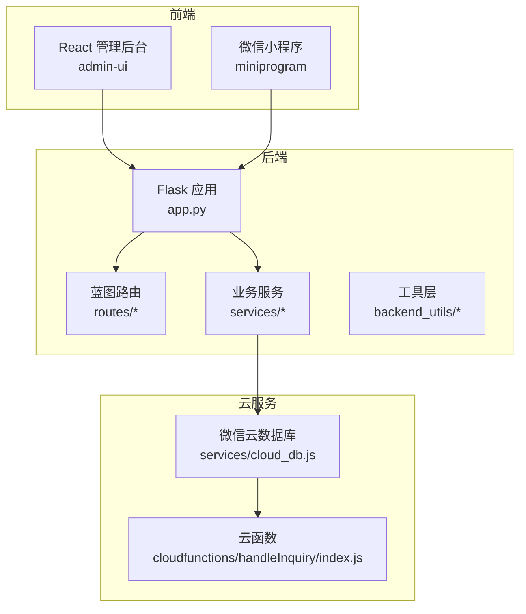
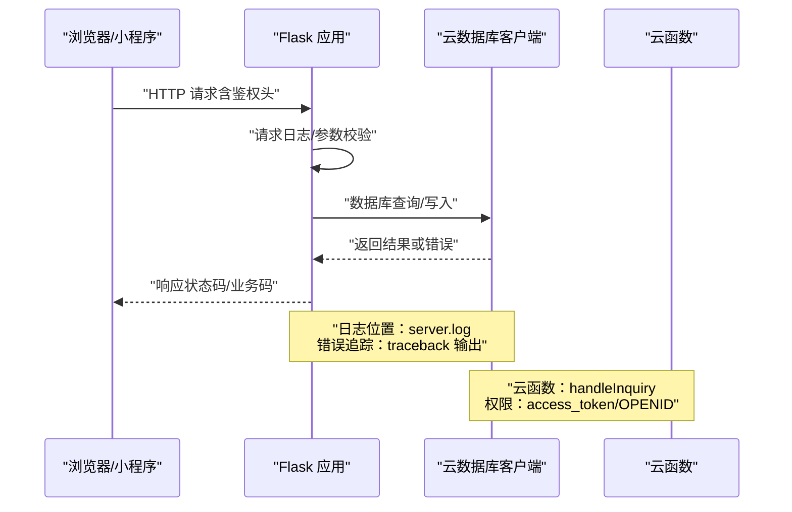
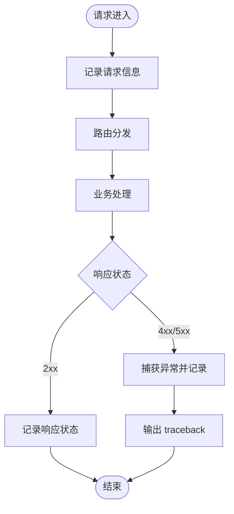
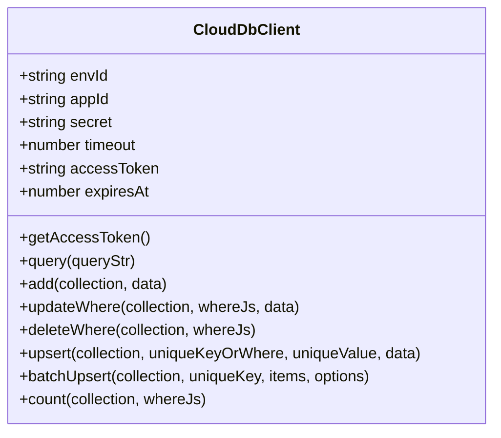
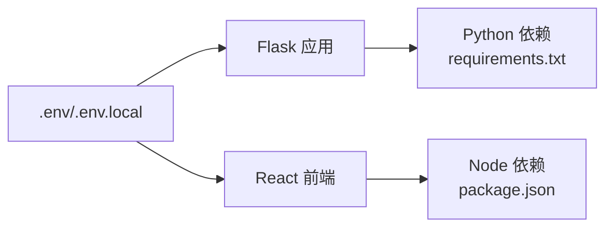

# 调试工具

<cite>
**本文引用的文件**
- [README.md](file://README.md)
- [app.py](file://app.py)
- [package.json](file://package.json)
- [requirements.txt](file://requirements.txt)
- [.env](file://.env)
- [.env.local](file://.env.local)
- [server.log](file://server.log)
- [debug_error.log](file://debug_error.log)
- [admin-ui/package.json](file://admin-ui/package.json)
- [miniprogram/app.js](file://miniprogram/app.js)
- [backend_utils/db.js](file://backend_utils/db.js)
- [services/cloud_db.js](file://services/cloud_db.js)
- [cloudfunctions/handleInquiry/index.js](file://cloudfunctions/handleInquiry/index.js)
- [utils/request.js](file://utils/request.js)
</cite>

## 目录
1. [简介](#简介)
2. [项目结构](#项目结构)
3. [核心组件](#核心组件)
4. [架构总览](#架构总览)
5. [详细组件分析](#详细组件分析)
6. [依赖关系分析](#依赖关系分析)
7. [性能考虑](#性能考虑)
8. [故障排查指南](#故障排查指南)
9. [结论](#结论)
10. [附录](#附录)

## 简介
本指南面向前端、后端与云服务三端，系统化梳理该期权数据服务项目的调试工具与技巧，覆盖浏览器开发者工具、React DevTools、网络请求监控；Flask 应用的日志配置、错误追踪与性能分析；数据库调试（含云数据库）；以及微信云开发的调试与日志分析。文档还提供常见问题的诊断流程与解决方案，帮助快速定位 API 调用失败、数据同步异常等典型问题。

## 项目结构
该项目采用前后端分离架构：
- 后端：Flask 应用，提供 REST API、CORS 支持、健康检查与定时任务调度。
- 前端：React 管理后台（admin-ui），通过 Vite 开发服务器提供热更新与代理。
- 小程序：基于微信小程序框架，使用云开发能力进行数据访问。
- 云函数：微信云开发云函数，处理询价状态更新与统计。
- 工具层：Node.js 侧云数据库客户端封装，支持并发控制、重试与限流。

图表来源
- [app.py](file://app.py#L103-L276)
- [services/cloud_db.js](file://services/cloud_db.js#L1-L327)
- [cloudfunctions/handleInquiry/index.js](file://cloudfunctions/handleInquiry/index.js#L1-L81)

章节来源
- [README.md](file://README.md#L1-L90)
- [package.json](file://package.json#L1-L50)
- [requirements.txt](file://requirements.txt#L1-L12)

## 核心组件
- Flask 应用与中间件
  - 自定义 JSON 提供者，兼容 ObjectId 与日期序列化。
  - 环境变量加载策略与 WX_CLOUD_ENV 检测。
  - CORS 配置与请求/响应日志钩子。
  - 健康检查端点与错误处理器。
- 云数据库客户端
  - 基于 axios 的 HTTP 客户端，支持 access_token 获取、并发与重试控制。
  - 提供查询、新增、更新、删除、upsert、批量 upsert 与统计接口。
- 云函数
  - 处理询价状态更新与统计聚合。
- 前端与小程序
  - React 管理后台与 Vite 开发脚本。
  - 小程序全局错误处理、性能监控与存储管理。

章节来源
- [app.py](file://app.py#L16-L35)
- [app.py](file://app.py#L103-L276)
- [services/cloud_db.js](file://services/cloud_db.js#L1-L327)
- [cloudfunctions/handleInquiry/index.js](file://cloudfunctions/handleInquiry/index.js#L1-L81)
- [admin-ui/package.json](file://admin-ui/package.json#L1-L38)
- [miniprogram/app.js](file://miniprogram/app.js#L1-L225)

## 架构总览
下图展示从浏览器/小程序到 Flask、云数据库与云函数的完整调用链路，标注了关键调试点（日志、网络、权限）。

图表来源
- [app.py](file://app.py#L211-L274)
- [services/cloud_db.js](file://services/cloud_db.js#L106-L139)
- [cloudfunctions/handleInquiry/index.js](file://cloudfunctions/handleInquiry/index.js#L12-L27)

## 详细组件分析

### Flask 应用调试要点
- 日志配置
  - 同时输出到控制台与文件，便于离线分析。
  - 关键启动与环境变量检测日志，便于确认 WX_CLOUD_ENV 是否正确注入。
- 错误处理
  - 404/500 与通用异常捕获，输出详细 traceback。
  - 建议结合 server.log 快速定位异常堆栈。
- CORS 与请求追踪
  - before/after 请求钩子记录请求与响应状态，辅助排查跨域与鉴权问题。
- 健康检查
  - /api/v1/health 返回数据库连接状态与环境信息，便于快速判断服务可用性。

图表来源
- [app.py](file://app.py#L211-L274)

章节来源
- [app.py](file://app.py#L24-L35)
- [app.py](file://app.py#L211-L274)
- [server.log](file://server.log#L1-L120)

### 云数据库客户端调试要点
- 并发与限流
  - 内部队列与最大并发限制，避免触发微信侧 QPS 限制。
- 重试策略
  - 针对 rate/freq/too many 等关键词进行指数退避重试。
- 访问令牌管理
  - 自动刷新 access_token，并在过期前预留缓冲。
- 接口能力
  - query/add/updateWhere/deleteWhere/upsert/batchUpsert/count，配合 server.log 观察调用次数与耗时。

图表来源
- [services/cloud_db.js](file://services/cloud_db.js#L7-L324)

章节来源
- [services/cloud_db.js](file://services/cloud_db.js#L1-L327)

### 云函数调试要点
- 入口与上下文
  - 通过 cloud.init 与 cloud.getWXContext 获取 OPENID 与环境。
- 常见问题
  - 参数校验缺失导致更新失败。
  - 聚合统计异常时返回错误消息，便于前端提示。
- 建议
  - 在本地模拟事件结构，结合云函数日志定位问题。

章节来源
- [cloudfunctions/handleInquiry/index.js](file://cloudfunctions/handleInquiry/index.js#L1-L81)

### 前端与小程序调试要点
- React 管理后台
  - Vite 开发脚本与代理配置，确保 API 请求转发至 Flask。
  - 建议开启浏览器开发者工具 Network 面板，观察请求/响应与鉴权头。
- 小程序
  - 全局错误处理与性能监控，定期输出性能报告。
  - 建议在 App.onShow/onHide 中关注数据同步与缓存清理。

章节来源
- [admin-ui/package.json](file://admin-ui/package.json#L1-L38)
- [miniprogram/app.js](file://miniprogram/app.js#L1-L225)

## 依赖关系分析
- 后端依赖
  - Flask、Flask-CORS、pymongo、akshare、requests、python-dotenv、gunicorn、lxml、PyJWT。
- 前端依赖
  - React、axios、react-router-dom、antd、@vitejs/plugin-react 等。
- 环境变量
  - .env 与 .env.local 控制 NODE_ENV、端口、代理、微信云开发参数等。

图表来源
- [requirements.txt](file://requirements.txt#L1-L12)
- [package.json](file://package.json#L1-L50)
- [.env](file://.env#L1-L32)
- [.env.local](file://.env.local#L1-L16)

章节来源
- [requirements.txt](file://requirements.txt#L1-L12)
- [package.json](file://package.json#L1-L50)
- [.env](file://.env#L1-L32)
- [.env.local](file://.env.local#L1-L16)

## 性能考虑
- Flask
  - 自动同步行情仅在交易时间执行，减少无效负载。
  - 日志级别与输出位置影响 I/O，建议生产环境降低日志冗余。
- 云数据库
  - 并发上限与重试退避可缓解限流压力，但需关注批量 upsert 的分片大小与并发度。
- 前端
  - Vite 热更新与按需加载提升开发体验；生产构建需关注包体积与懒加载策略。

章节来源
- [app.py](file://app.py#L279-L330)
- [services/cloud_db.js](file://services/cloud_db.js#L39-L51)
- [admin-ui/package.json](file://admin-ui/package.json#L1-L38)

## 故障排查指南

### 通用排查流程
- 确认服务可用性
  - 访问 /api/v1/health，检查返回的数据库连接状态与环境信息。
- 查看日志
  - server.log：请求/响应、异常堆栈、云数据库调用与错误。
  - debug_error.log：特定场景下的统计与模型初始化日志。
- 核对环境变量
  - .env 与 .env.local 中的 WX_*、FLASK_PORT、VITE_API_PROXY_TARGET 等。

章节来源
- [app.py](file://app.py#L185-L197)
- [server.log](file://server.log#L1-L120)
- [.env](file://.env#L1-L32)
- [.env.local](file://.env.local#L1-L16)

### API 调用失败
- 症状
  - 405 Method Not Allowed：URL 正确但方法不被允许。
- 排查
  - 检查 Flask 蓝图注册与路由映射，确认端点是否存在。
  - 对照 server.log 中的路由异常信息定位具体 URL 与方法。
- 解决
  - 使用正确的端点与方法（例如 /api/v1/auth/login 而非 /auth/admin/login）。

章节来源
- [server.log](file://server.log#L170-L192)

### 数据同步异常
- 症状
  - 云数据库统计查询报错 invalid credential，提示 access_token 无效或不是最新。
- 排查
  - 检查 WX_APPID/WX_SECRET/WX_CLOUD_ENV 是否正确设置。
  - 观察云数据库客户端的 access_token 刷新逻辑与重试策略。
- 解决
  - 重新获取稳定的 access_token，或调用 getStableAccessToken 接口后再发起查询。

章节来源
- [server.log](file://server.log#L155-L168)
- [services/cloud_db.js](file://services/cloud_db.js#L72-L98)

### 数据库连接失败
- 症状
  - MongoDB 连接超时或失败，服务以“无数据库模式”运行。
- 排查
  - 确认本地 MongoDB 是否启动，或在测试/开发环境关闭数据库初始化。
  - 检查 MONGO_URI 与 DATABASE_NAME。
- 解决
  - 启动本地数据库或设置 SKIP_DB_INIT=1；或修正连接参数。

章节来源
- [app.py](file://app.py#L69-L88)
- [server.log](file://server.log#L1-L120)

### 小程序性能与错误
- 症状
  - 页面卡顿、内存警告频繁。
- 排查
  - 检查 App.onShow/App.onHide 中的数据同步与缓存清理。
  - 关注性能监控输出，识别高开销操作。
- 解决
  - 合理使用懒加载与缓存清理策略，降低内存占用。

章节来源
- [miniprogram/app.js](file://miniprogram/app.js#L144-L175)

### 前端网络请求问题
- 症状
  - 请求 401 未授权或业务错误码。
- 排查
  - 检查 utils/request.js 中的 Authorization 头与业务错误处理。
  - 确认代理配置（VITE_API_PROXY_TARGET）指向正确 Flask 端口。
- 解决
  - 重新登录获取 token，或调整代理目标地址。

章节来源
- [utils/request.js](file://utils/request.js#L1-L70)
- [.env.local](file://.env.local#L20-L24)

## 结论
通过统一的日志体系、完善的错误处理与云数据库客户端的并发/重试机制，本项目在多端（浏览器、小程序、云函数）场景下提供了可追踪、可定位的调试能力。建议在日常开发中：
- 保持 server.log 的持续输出与归档；
- 明确各端的代理与鉴权配置；
- 针对云数据库调用做好限流与重试策略；
- 利用浏览器与小程序开发者工具进行网络与性能分析。

## 附录

### 常用调试命令与端点
- 启动后端与前端
  - npm 脚本：dev:node、dev:flask、dev:ui、dev。
- 健康检查
  - GET /api/v1/health
- 端口与代理
  - FLASK_PORT=5002，VITE_API_PROXY_TARGET=http://127.0.0.1:5002

章节来源
- [package.json](file://package.json#L6-L14)
- [README.md](file://README.md#L66-L90)
- [.env.local](file://.env.local#L3-L4)