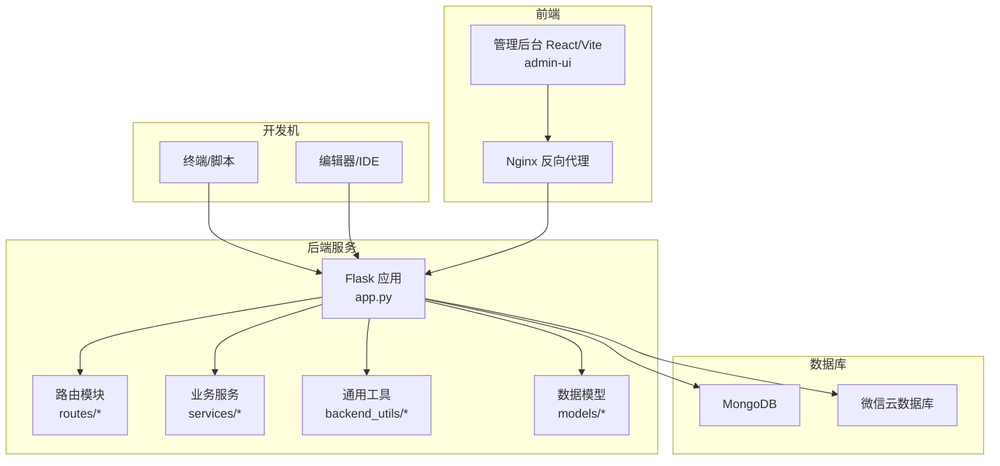
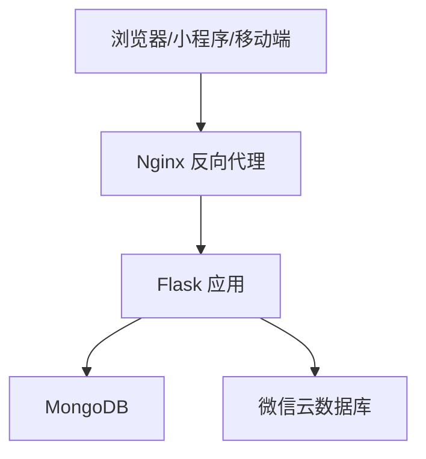
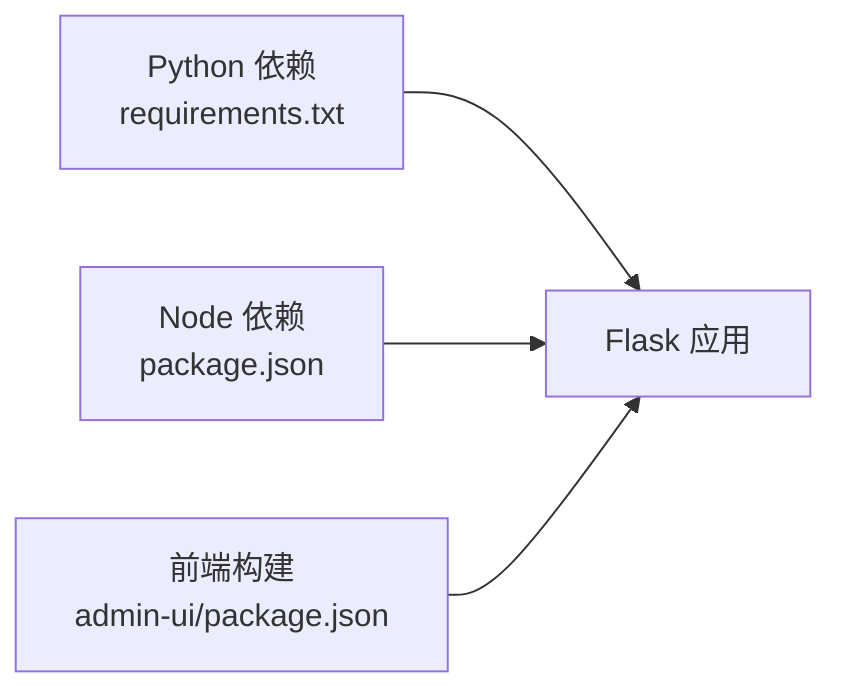

# 快速开始

<cite>
**本文引用的文件**
- [README.md](file://README.md)
- [package.json](file://package.json)
- [requirements.txt](file://requirements.txt)
- [.env.example](file://.env.example)
- [startup.sh](file://startup.sh)
- [startup.ps1](file://startup.ps1)
- [app.py](file://app.py)
- [config.py](file://config.py)
- [Dockerfile](file://Dockerfile)
- [deploy/docker-compose.yml](file://deploy/docker-compose.yml)
- [admin-ui/package.json](file://admin-ui/package.json)
- [services/cloud_db.py](file://services/cloud_db.py)
</cite>

## 目录
1. [简介](#简介)
2. [项目结构](#项目结构)
3. [核心组件](#核心组件)
4. [架构总览](#架构总览)
5. [详细组件分析](#详细组件分析)
6. [依赖关系分析](#依赖关系分析)
7. [性能注意事项](#性能注意事项)
8. [故障排查指南](#故障排查指南)
9. [结论](#结论)
10. [附录](#附录)

## 简介
本指南面向开发者，帮助你在 Windows 与 Linux/macOS 平台上快速搭建并运行“场外期权交易系统”。你将获得完整的环境要求、依赖安装、数据库配置、应用启动流程与验证步骤；同时包含环境变量设置、MongoDB 初始化、必要配置文件创建以及常见问题排查。

## 项目结构
该系统采用前后端分离架构：
- 后端（Python Flask）：提供 REST API、CORS 支持、健康检查、MongoDB 与微信云数据库接入、定时同步等能力。
- 管理后台前端（React/Vite）：位于 admin-ui，构建产物部署于 Nginx 或 Flask 静态资源目录。
- 部署（可选）：Dockerfile 与 docker-compose.yml 支持容器化部署与反向代理。

图表来源
- [app.py](file://app.py#L103-L276)
- [config.py](file://config.py#L22-L132)
- [services/cloud_db.py](file://services/cloud_db.py#L108-L207)
- [deploy/docker-compose.yml](file://deploy/docker-compose.yml#L1-L42)

章节来源
- [README.md](file://README.md#L1-L90)
- [app.py](file://app.py#L103-L276)
- [config.py](file://config.py#L22-L132)

## 核心组件
- Flask 应用与配置
  - 应用入口与蓝图注册、CORS、日志、错误处理、静态资源托管、后台定时任务调度。
- 数据源与数据库
  - MongoDB（管理后台）与微信云数据库（小程序端）双数据源架构，支持混合模式。
- 环境变量与配置加载
  - 优先级：.env.local > 系统 NODE_ENV 对应 .env.production > .env；支持多种 WX_*、MONGO_*、CORS、日志等配置。
- 前端管理后台
  - React/Vite 构建产物，通过 Flask 静态资源或 Nginx 提供。
- 启动与运维
  - Bash/PowerShell 启动脚本，支持自动健康检查、重试、日志与 Git 自动推送。

章节来源
- [app.py](file://app.py#L16-L276)
- [config.py](file://config.py#L22-L132)
- [services/cloud_db.py](file://services/cloud_db.py#L108-L207)
- [startup.sh](file://startup.sh#L106-L146)
- [startup.ps1](file://startup.ps1#L67-L139)

## 架构总览
系统采用“Flask API + React 管理后台 + 双数据库”的分层架构。Flask 负责 API、CORS、认证、定时任务与静态资源；MongoDB 用于管理后台与复杂查询；微信云数据库用于小程序端直连；Nginx 可作为反向代理与静态资源服务。

图表来源
- [app.py](file://app.py#L170-L210)
- [config.py](file://config.py#L35-L46)
- [services/cloud_db.py](file://services/cloud_db.py#L108-L207)
- [deploy/docker-compose.yml](file://deploy/docker-compose.yml#L22-L37)

## 详细组件分析

### 环境与依赖安装
- 环境要求
  - Python 3.9+（推荐使用虚拟环境）
  - Node.js 18+（用于前端构建与开发）
  - MongoDB 服务（本地或远端）
  - 可选：Docker 与 Docker Compose（用于容器化部署）
- 安装步骤
  - 安装 Python 依赖：参考 requirements.txt
  - 安装 Node.js 依赖：参考 package.json 的 scripts 与依赖
  - 如需前端构建：进入 admin-ui 执行构建脚本
- 平台差异
  - Windows：使用 PowerShell 脚本启动与调试
  - Linux/macOS：使用 Bash 脚本启动与调试

章节来源
- [requirements.txt](file://requirements.txt#L1-L12)
- [package.json](file://package.json#L1-L50)
- [admin-ui/package.json](file://admin-ui/package.json#L1-L38)
- [startup.sh](file://startup.sh#L1-L234)
- [startup.ps1](file://startup.ps1#L1-L226)

### 环境变量与配置文件
- 配置加载顺序
  - 优先加载 .env.local；若系统 NODE_ENV 为 production 则加载 .env.production；否则加载 .env；最后回退到默认值。
- 关键环境变量（节选）
  - 数据库：MONGO_URI、DATABASE_NAME
  - 微信云数据库：WX_CLOUD_ENV、WX_APPID、WX_SECRET、WX_VERIFY_SSL
  - CORS：ALLOWED_ORIGINS
  - 日志：LOG_LEVEL、LOG_FILE
  - API 限流：API_RATE_LIMIT
  - JWT：JWT_SECRET、JWT_ALGORITHM、JWT_EXPIRES_SECONDS
  - 管理员账号：ADMIN_USERNAME、ADMIN_PASSWORD、ADMIN_ROLE
- 示例文件
  - .env.example 提供了完整字段示例，建议复制为 .env 并按需修改。

章节来源
- [app.py](file://app.py#L37-L67)
- [.env.example](file://.env.example#L1-L50)

### 数据库配置与初始化
- MongoDB
  - 默认连接串为 mongodb://localhost:27017/option_data；可在 .env 中覆盖。
  - 启动时进行连接测试（ping），失败则以“无数据库模式”运行，部分功能受限。
- 微信云数据库
  - 通过 WX_CLOUD_ENV、WX_APPID、WX_SECRET 初始化客户端。
  - 支持查询、计数、新增、更新、删除、去重写入与批量去重写入。
  - 若配置缺失或无效，应用会记录警告并降级处理。

章节来源
- [app.py](file://app.py#L64-L88)
- [services/cloud_db.py](file://services/cloud_db.py#L108-L207)

### 应用启动流程
- 本地开发
  - 使用 npm 脚本一键启动 Node/Flask/React 前端（如需），或分别启动后端与前端。
  - Bash/PowerShell 启动脚本会自动检测并启动 Node 与 Flask，支持重试与健康检查。
- 容器化部署
  - Dockerfile 分两阶段构建：前端构建与后端安装；最终使用 gunicorn 绑定 80 端口。
  - docker-compose.yml 提供 Flask 与 Nginx 的组合服务，映射端口与挂载日志、静态资源与证书目录。

章节来源
- [package.json](file://package.json#L6-L12)
- [startup.sh](file://startup.sh#L106-L146)
- [startup.ps1](file://startup.ps1#L67-L139)
- [Dockerfile](file://Dockerfile#L1-L48)
- [deploy/docker-compose.yml](file://deploy/docker-compose.yml#L1-L42)

### API 与健康检查
- 健康检查端点
  - GET /api/v1/health 返回服务状态、数据库连接状态与环境信息。
- 静态资源
  - Flask 提供管理后台静态资源回退至 index.html，支持 React 路由。

章节来源
- [app.py](file://app.py#L185-L197)
- [app.py](file://app.py#L226-L250)

## 依赖关系分析
- 后端依赖
  - Flask、Flask-CORS、pymongo、akshare、requests、python-dotenv、gunicorn、lxml、PyJWT 等。
- 前端依赖
  - React、Ant Design、axios、react-router-dom、Vite、TypeScript 等。
- 运维依赖
  - concurrently（并行启动）、nodemon（热重载）、Docker 与 docker-compose（容器化）。

图表来源
- [requirements.txt](file://requirements.txt#L1-L12)
- [package.json](file://package.json#L27-L48)
- [admin-ui/package.json](file://admin-ui/package.json#L13-L36)

章节来源
- [requirements.txt](file://requirements.txt#L1-L12)
- [package.json](file://package.json#L27-L48)
- [admin-ui/package.json](file://admin-ui/package.json#L13-L36)

## 性能注意事项
- 定时同步
  - 默认启用自动同步行情，仅在交易时间段内执行；可通过环境变量调整间隔与开关。
- 并发与限流
  - 微信云数据库支持并发请求与重试策略；可通过环境变量调整最大并发与重试次数。
- 日志与监控
  - 生产环境建议开启文件轮转日志，关注健康检查与错误日志。

章节来源
- [app.py](file://app.py#L279-L330)
- [services/cloud_db.py](file://services/cloud_db.py#L141-L160)

## 故障排查指南
- 端口占用
  - 开发环境若 5000 端口被占用，应用会回退到 5002 端口；也可通过 FLASK_PORT/PORT 覆盖。
- MongoDB 连接失败
  - 启动日志会提示连接失败并以“无数据库模式”运行；请检查 MONGO_URI 与网络连通性。
- 微信云数据库配置错误
  - 缺少 WX_CLOUD_ENV/WX_APPID/WX_SECRET 或值为占位符时会抛出配置错误；请按示例补齐。
- CORS 跨域问题
  - 通过 ALLOWED_ORIGINS 控制允许的来源；默认允许本地开发域名。
- 健康检查失败
  - 使用 /api/v1/health 检查服务与数据库状态；结合 logs 下的日志定位问题。

章节来源
- [app.py](file://app.py#L336-L350)
- [app.py](file://app.py#L69-L88)
- [services/cloud_db.py](file://services/cloud_db.py#L197-L204)
- [app.py](file://app.py#L168-L181)

## 结论
通过本指南，你可以在 Windows 与 Linux/macOS 上完成环境准备、依赖安装、数据库配置与应用启动，并掌握常见问题的排查方法。建议在生产环境中严格设置安全相关环境变量（如 JWT_SECRET、WX_*），并使用 Nginx 与容器化部署提升稳定性与可维护性。

## 附录

### 首次运行后的基本验证步骤
- 访问健康检查
  - http://127.0.0.1:5000/api/v1/health
- 访问管理后台
  - http://127.0.0.1:5000（或 Nginx 映射的域名）
- 查看日志
  - logs/flask.log、logs/node.log、server.log
- 验证 MongoDB
  - 确认连接串可用且存在目标数据库/集合
- 验证微信云数据库
  - 确认 WX_CLOUD_ENV、WX_APPID、WX_SECRET 配置正确，且集合存在

章节来源
- [README.md](file://README.md#L84-L90)
- [app.py](file://app.py#L185-L197)
- [app.py](file://app.py#L226-L250)