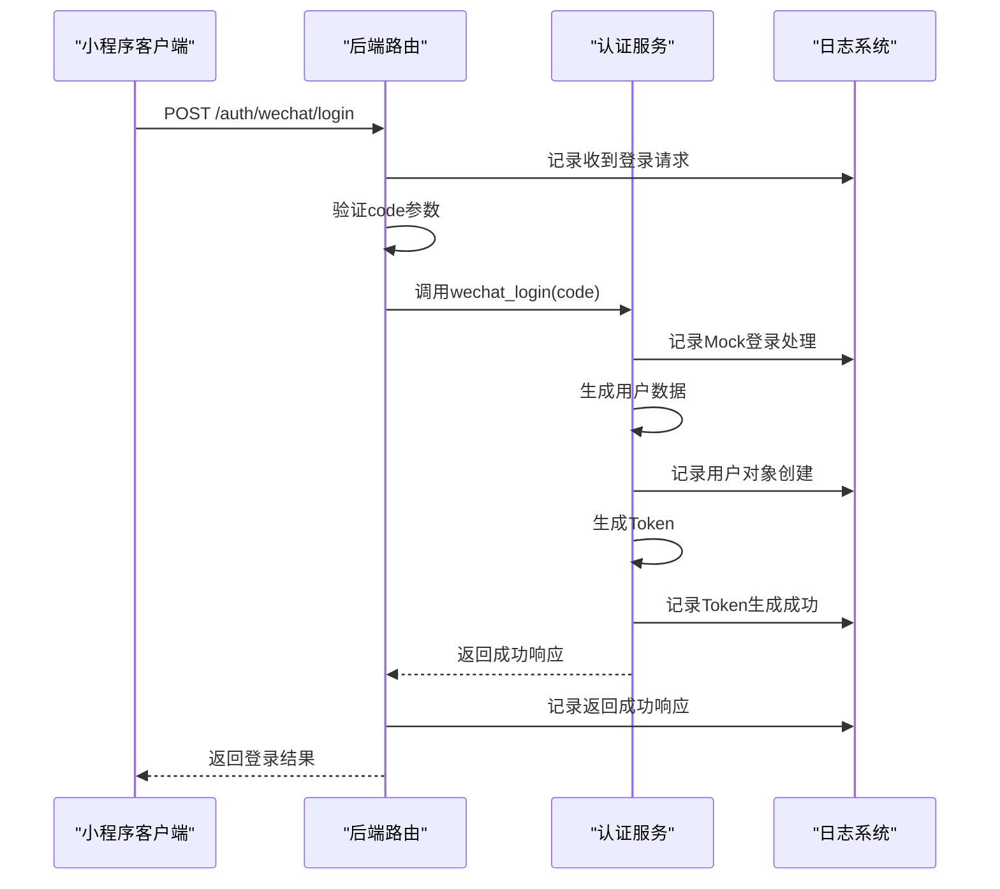
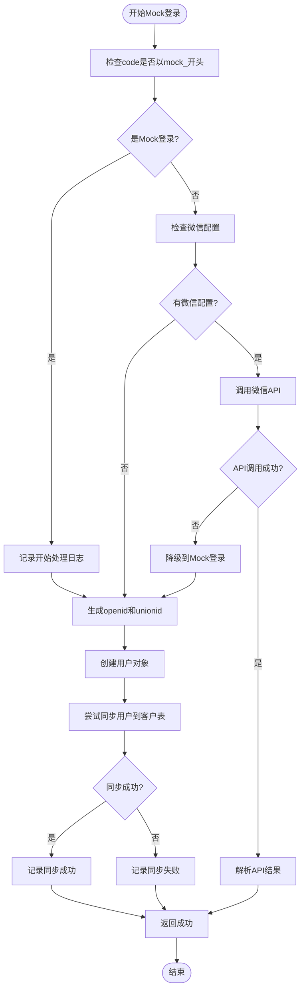
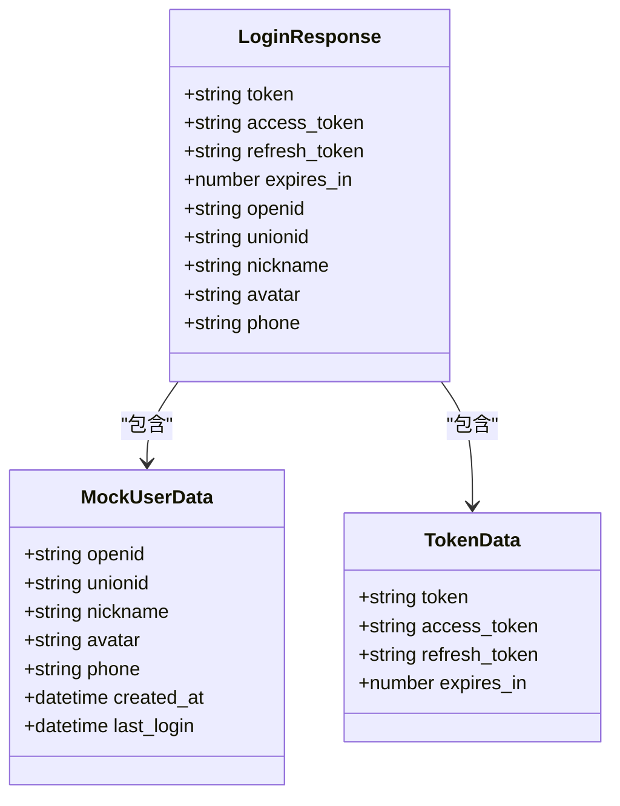
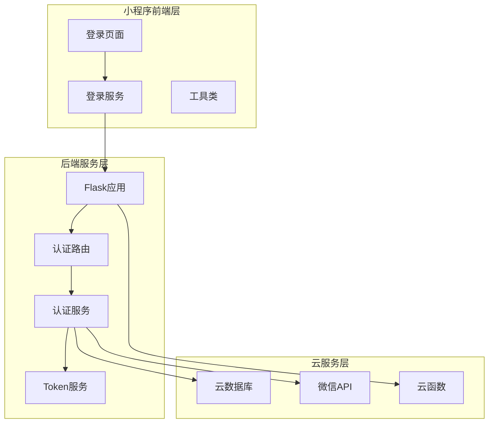
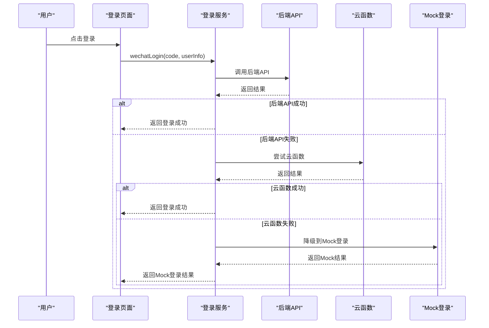
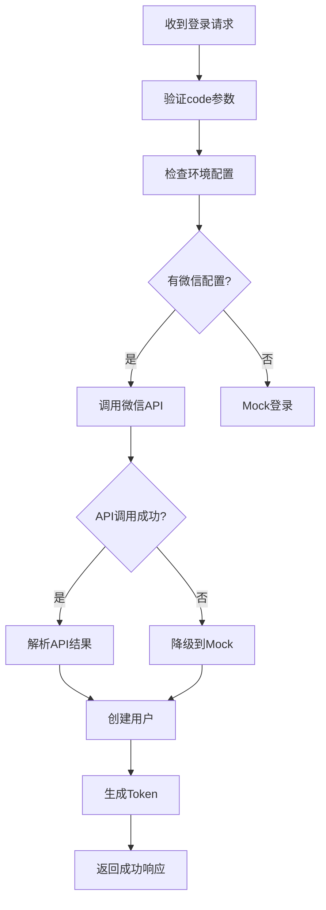
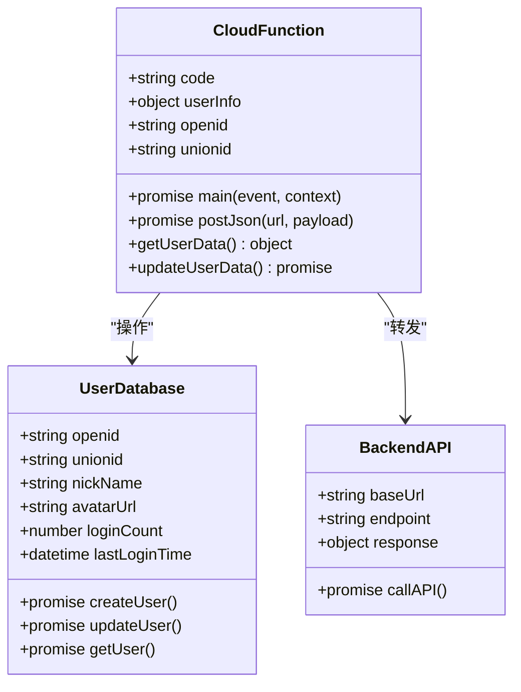
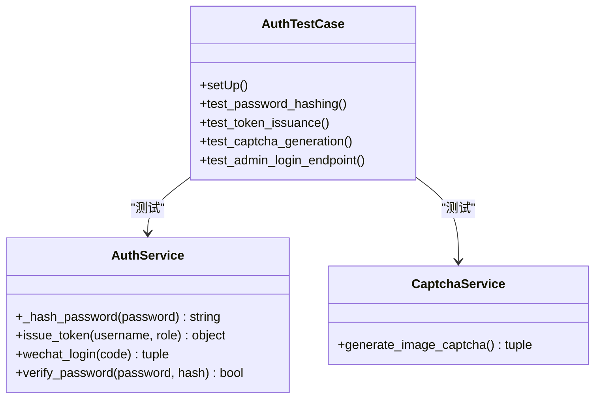
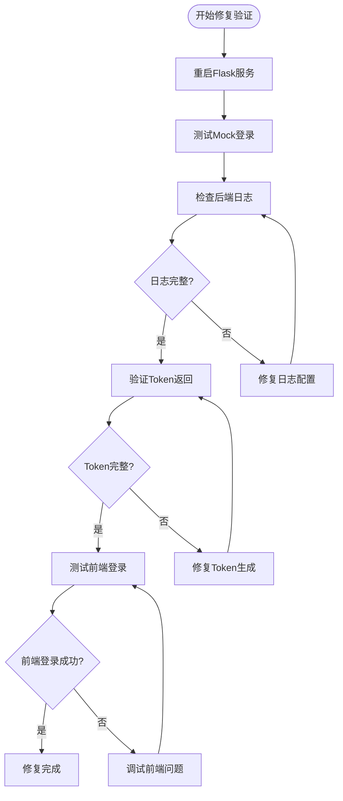

# Mock登录问题诊断

<cite>
**本文档引用的文件**
- [Mock登录问题诊断.md](file://Mock登录问题诊断.md)
- [routes/auth.py](file://routes/auth.py)
- [services/auth_service.py](file://services/auth_service.py)
- [miniprogram/pages/login/login.js](file://miniprogram/pages/login/login.js)
- [miniprogram/utils/loginService.js](file://miniprogram/utils/loginService.js)
- [backend_utils/loginService.js](file://backend_utils/loginService.js)
- [cloudfunctions/login/index.js](file://cloudfunctions/login/index.js)
- [utils/auth.js](file://utils/auth.js)
- [tests/test_auth.py](file://tests/test_auth.py)
</cite>

## 目录
1. [简介](#简介)
2. [问题概述](#问题概述)
3. [诊断过程](#诊断过程)
4. [根本原因分析](#根本原因分析)
5. [修复方案](#修复方案)
6. [系统架构分析](#系统架构分析)
7. [详细组件分析](#详细组件分析)
8. [测试验证](#测试验证)
9. [故障排除指南](#故障排除指南)
10. [总结](#总结)

## 简介

本文档针对"Dev Mock 登录失败"问题进行全面诊断和修复指导。该问题涉及微信小程序登录系统的多个层面，包括前端登录流程、后端认证服务、Mock登录机制以及云函数集成等。

## 问题概述

根据用户报告，开发环境中的Mock登录出现"服务器内部错误，请稍后重试"的错误信息。通过深入分析发现，问题的根本原因在于缺乏详细的调试日志，导致无法准确定位问题发生的具体环节。

## 诊断过程

### 1. 后端路由实现检查

通过检查 `routes/auth.py` 中的 `/auth/wechat/login` 路由，确认了以下关键点：
- 路由逻辑正确，调用 `auth_service.wechat_login(code)`
- 返回格式符合标准：`flask_success_response(data={...}, message="登录成功")`
- 包含完整的日志记录机制

### 2. Mock登录实现验证

检查 `services/auth_service.py` 中的 `wechat_login` 方法，确认Mock登录逻辑的正确性：
- 当code以"mock_"开头时返回模拟用户数据
- 不依赖数据库连接，即使数据库失败也能正常工作
- 返回格式：`(True, user_dict, None)`

### 3. Token生成机制分析

检查 `services/auth_service.py` 中的 `issue_token` 方法，确认双Token机制：
- 生成双Token机制：access_token（15分钟）+ refresh_token（7天）
- 返回格式包含完整的Token信息

## 根本原因分析

经过深入分析，发现问题的根本原因在于**缺少详细日志导致无法定位具体错误**：

1. **请求到达后端的追踪缺失** - 无法确认请求是否成功到达后端
2. **Mock登录逻辑触发确认** - 无法验证Mock登录逻辑是否被正确触发
3. **Token生成过程监控** - 无法追踪Token生成是否成功
4. **异常发生环节定位** - 无法确定在哪个具体环节抛出异常

## 修复方案

基于诊断结果，制定了以下修复方案：

### 修复1：增强后端路由日志

在 `routes/auth.py` 的 `/wechat/login` 路由中增加详细日志：

**图表来源**
- [routes/auth.py:478-522](file://routes/auth.py#L478-L522)

### 修复2：增强Mock登录日志

在 `services/auth_service.py` 的 `wechat_login` 方法中增加详细日志：

**图表来源**
- [services/auth_service.py:316-440](file://services/auth_service.py#L316-L440)

### 修复3：返回完整Token数据

优化路由响应数据结构，确保支持双Token机制：

**图表来源**
- [routes/auth.py:504-515](file://routes/auth.py#L504-L515)

## 系统架构分析

### 整体登录流程架构

**图表来源**
- [miniprogram/pages/login/login.js:12-32](file://miniprogram/pages/login/login.js#L12-L32)
- [routes/auth.py:478-522](file://routes/auth.py#L478-L522)

## 详细组件分析

### 组件A：前端登录服务

前端登录服务采用多层次降级策略：

**图表来源**
- [miniprogram/utils/loginService.js:12-33](file://miniprogram/utils/loginService.js#L12-L33)

**章节来源**
- [miniprogram/utils/loginService.js:12-33](file://miniprogram/utils/loginService.js#L12-L33)
- [miniprogram/pages/login/login.js:67-141](file://miniprogram/pages/login/login.js#L67-L141)

### 组件B：后端认证服务

后端认证服务支持多种登录方式和降级机制：

**图表来源**
- [services/auth_service.py:303-440](file://services/auth_service.py#L303-L440)

**章节来源**
- [services/auth_service.py:303-440](file://services/auth_service.py#L303-L440)
- [routes/auth.py:478-522](file://routes/auth.py#L478-L522)

### 组件C：云函数集成

云函数作为最后的降级方案：

**图表来源**
- [cloudfunctions/login/index.js:52-165](file://cloudfunctions/login/index.js#L52-L165)

**章节来源**
- [cloudfunctions/login/index.js:52-165](file://cloudfunctions/login/index.js#L52-L165)

## 测试验证

### 单元测试覆盖

现有的测试套件提供了基础的功能验证：

**图表来源**
- [tests/test_auth.py:13-69](file://tests/test_auth.py#L13-L69)

**章节来源**
- [tests/test_auth.py:13-69](file://tests/test_auth.py#L13-L69)

## 故障排除指南

### 常见问题诊断步骤

1. **检查后端日志**
   - 查看Flask应用的日志输出
   - 确认登录请求是否到达后端
   - 验证Mock登录逻辑是否触发

2. **验证前端登录流程**
   - 检查小程序控制台输出
   - 确认登录服务的降级机制
   - 验证Token存储和传递

3. **测试云函数功能**
   - 验证云函数的API调用
   - 检查数据库操作是否正常
   - 确认用户数据同步

### 重启和验证流程

**图表来源**
- [Mock登录问题诊断.md:158-171](file://Mock登录问题诊断.md#L158-L171)

## 总结

通过本次Mock登录问题的诊断和修复，我们建立了更加完善的登录系统监控和调试机制。主要成果包括：

1. **完整的日志体系**：实现了从前端到后端的全流程日志记录
2. **多层次降级机制**：确保在各种异常情况下都能提供可用的登录方案
3. **增强的错误定位能力**：通过详细日志快速定位问题发生的具体环节
4. **改进的用户体验**：提供更清晰的错误反馈和恢复机制

这些改进不仅解决了当前的Mock登录问题，更为整个登录系统的稳定性和可维护性奠定了坚实基础。