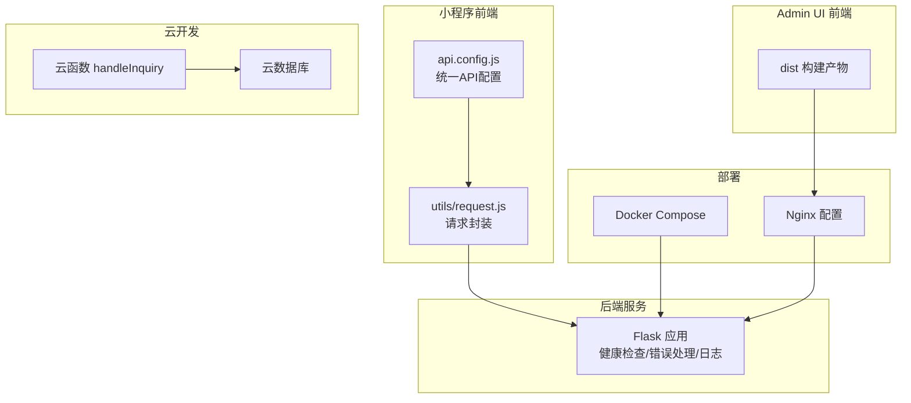
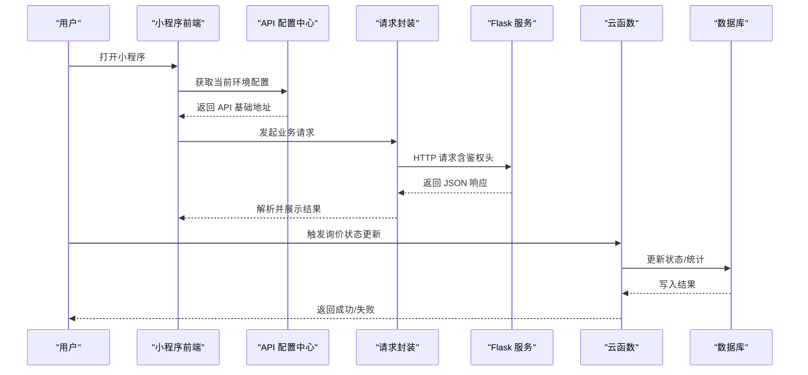
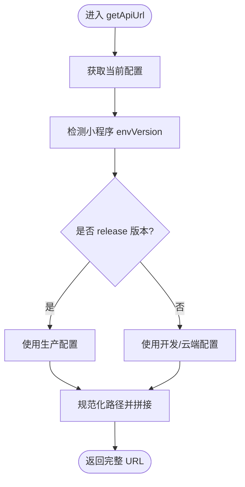
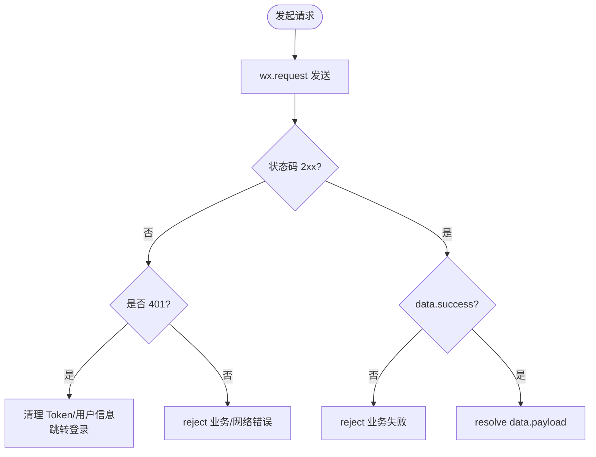
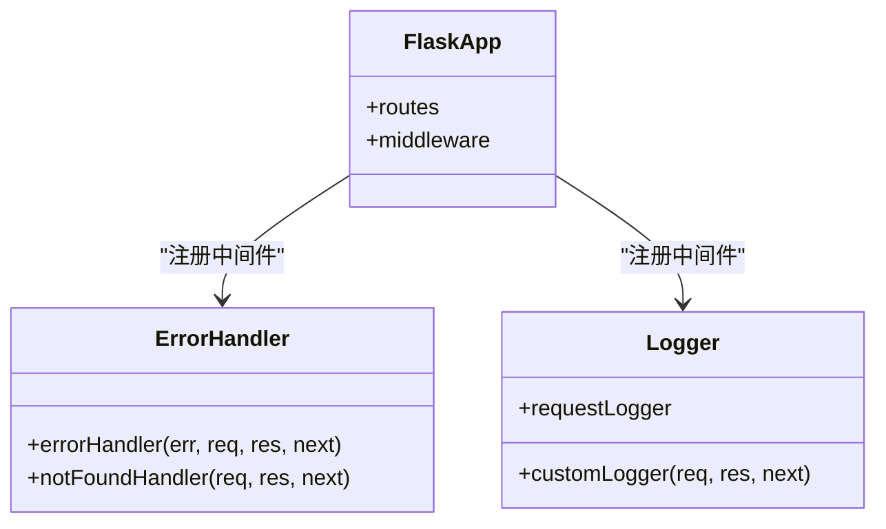
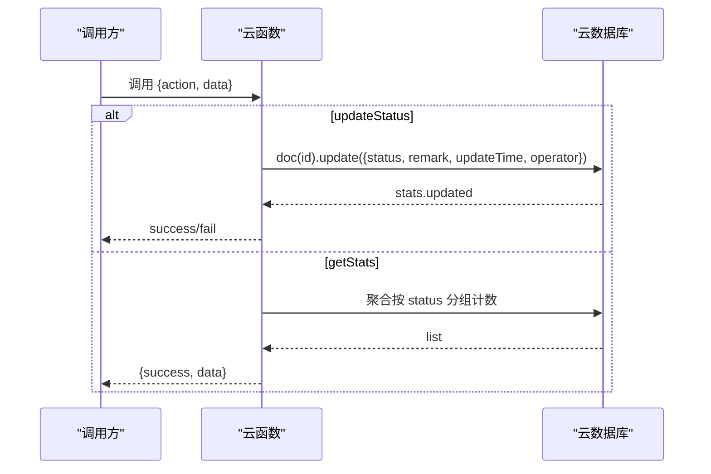
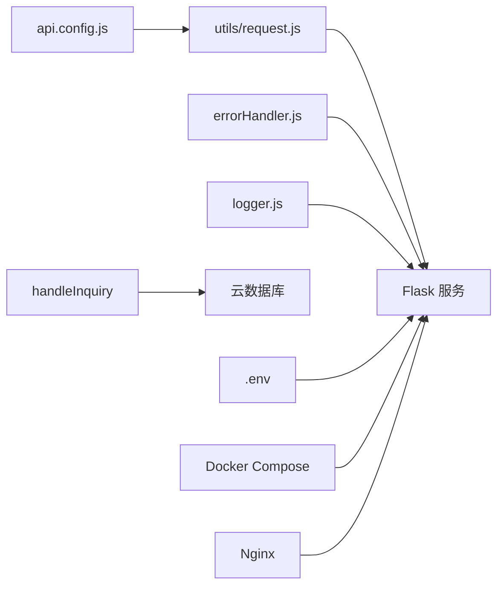

# 故障排除与FAQ

<cite>
**本文引用的文件**
- [README.md](file://README.md)
- [deploy/README.md](file://deploy/README.md)
- [HOTFIX_API_CONNECTION.md](file://HOTFIX_API_CONNECTION.md)
- [PROJECT_COMPLETION_REPORT_V2.md](file://PROJECT_COMPLETION_REPORT_V2.md)
- [cloudfunctions/handleInquiry/index.js](file://cloudfunctions/handleInquiry/index.js)
- [backup_nodejs/middleware/errorHandler.js](file://backup_nodejs/middleware/errorHandler.js)
- [backup_nodejs/middleware/logger.js](file://backup_nodejs/middleware/logger.js)
- [utils/request.js](file://utils/request.js)
- [miniprogram/config/api.config.js](file://miniprogram/config/api.config.js)
- [.env](file://.env)
</cite>

## 目录
1. [简介](#简介)
2. [项目结构](#项目结构)
3. [核心组件](#核心组件)
4. [架构总览](#架构总览)
5. [详细组件分析](#详细组件分析)
6. [依赖关系分析](#依赖关系分析)
7. [性能考虑](#性能考虑)
8. [故障排除指南](#故障排除指南)
9. [结论](#结论)
10. [附录](#附录)

## 简介
本文件面向用户与开发者，提供系统故障排除与常见问题解答，覆盖网络连接、数据库连接、API 调用失败、日志分析、调试工具使用、性能诊断与优化、紧急处理流程、监控与自动恢复机制，以及用户常见问题与最佳实践。

## 项目结构
系统由多端组成：小程序前端、Admin UI 前端、后端 Flask 服务、云开发（云函数与数据库）、以及部署与运维脚本。关键位置如下：
- 小程序前端：统一 API 配置中心、请求封装与错误处理
- Admin UI 前端：构建产物位于 dist，需在部署前构建
- 后端 Flask 服务：健康检查、错误处理、日志中间件
- 云函数：处理询价状态更新与统计
- 部署：Docker Compose 与 Nginx 手动部署指南
- 环境变量：.env 控制开发/测试/生产行为

图表来源
- [miniprogram/config/api.config.js](file://miniprogram/config/api.config.js#L1-L90)
- [utils/request.js](file://utils/request.js#L1-L70)
- [README.md](file://README.md#L1-L90)
- [deploy/README.md](file://deploy/README.md#L1-L44)
- [cloudfunctions/handleInquiry/index.js](file://cloudfunctions/handleInquiry/index.js#L1-L81)

章节来源
- [README.md](file://README.md#L1-L90)
- [deploy/README.md](file://deploy/README.md#L1-L44)

## 核心组件
- 小程序 API 配置中心：集中管理开发/生产环境 API 地址，支持自动切换与云端地址选项
- 请求封装：统一封装 GET/POST/PUT/DELETE，内置鉴权头、401 处理与业务错误分支
- 后端错误处理与日志：全局错误中间件、404 处理、自定义请求日志中间件
- 云函数：处理询价状态更新与统计聚合
- 部署与代理：Docker Compose 与 Nginx 手动部署；前端代理指向本地 Flask 服务
- 环境变量：控制 NODE_ENV、端口、JWT 密钥、前端代理目标、微信云环境等

章节来源
- [miniprogram/config/api.config.js](file://miniprogram/config/api.config.js#L1-L90)
- [utils/request.js](file://utils/request.js#L1-L70)
- [backup_nodejs/middleware/errorHandler.js](file://backup_nodejs/middleware/errorHandler.js#L1-L29)
- [backup_nodejs/middleware/logger.js](file://backup_nodejs/middleware/logger.js#L1-L30)
- [cloudfunctions/handleInquiry/index.js](file://cloudfunctions/handleInquiry/index.js#L1-L81)
- [.env](file://.env#L1-L32)

## 架构总览
下图展示了从前端到后端、云函数与数据库的关键交互路径，以及部署与代理层：

图表来源
- [miniprogram/config/api.config.js](file://miniprogram/config/api.config.js#L26-L82)
- [utils/request.js](file://utils/request.js#L6-L42)
- [cloudfunctions/handleInquiry/index.js](file://cloudfunctions/handleInquiry/index.js#L12-L27)

## 详细组件分析

### 小程序 API 配置中心
- 统一管理开发/生产/云端 API 地址，支持按版本自动切换
- 提供 getApiUrl/getBaseUrl，规范化路径拼接
- 通过微信小程序环境信息判断 release/develop/trial，决定配置

图表来源
- [miniprogram/config/api.config.js](file://miniprogram/config/api.config.js#L26-L74)

章节来源
- [miniprogram/config/api.config.js](file://miniprogram/config/api.config.js#L1-L90)

### 请求封装与鉴权处理
- 统一 header：Content-Type 与 Authorization（Token）
- 成功态：根据状态码与业务字段区分 401、业务失败与正常数据
- 401 处理：清理本地存储、跳转登录页
- 方法封装：get/post/put/del

图表来源
- [utils/request.js](file://utils/request.js#L6-L55)

章节来源
- [utils/request.js](file://utils/request.js#L1-L70)

### 后端错误处理与日志中间件
- 全局错误：打印错误并返回通用 500 响应
- 404：记录请求方法与路径，返回接口不存在
- 自定义日志：记录请求方法/路径/IP/User-Agent，可选打印请求体与查询参数

图表来源
- [backup_nodejs/middleware/errorHandler.js](file://backup_nodejs/middleware/errorHandler.js#L4-L29)
- [backup_nodejs/middleware/logger.js](file://backup_nodejs/middleware/logger.js#L6-L25)

章节来源
- [backup_nodejs/middleware/errorHandler.js](file://backup_nodejs/middleware/errorHandler.js#L1-L29)
- [backup_nodejs/middleware/logger.js](file://backup_nodejs/middleware/logger.js#L1-L30)

### 云函数：询价状态更新与统计
- 支持动作：updateStatus、getStats
- 参数校验：缺失必要参数时直接返回错误
- 写入：使用云开发数据库更新字段与时间
- 聚合：按状态分组统计数量

图表来源
- [cloudfunctions/handleInquiry/index.js](file://cloudfunctions/handleInquiry/index.js#L12-L27)
- [cloudfunctions/handleInquiry/index.js](file://cloudfunctions/handleInquiry/index.js#L34-L58)
- [cloudfunctions/handleInquiry/index.js](file://cloudfunctions/handleInquiry/index.js#L63-L80)

章节来源
- [cloudfunctions/handleInquiry/index.js](file://cloudfunctions/handleInquiry/index.js#L1-L81)

## 依赖关系分析
- 小程序端依赖配置中心与请求封装，避免硬编码 URL
- 后端依赖错误处理与日志中间件，保证可观测性
- 云函数依赖云数据库命令与聚合能力
- 部署层依赖 Docker Compose 与 Nginx，前端代理指向 Flask 服务

图表来源
- [miniprogram/config/api.config.js](file://miniprogram/config/api.config.js#L1-L90)
- [utils/request.js](file://utils/request.js#L1-L70)
- [backup_nodejs/middleware/errorHandler.js](file://backup_nodejs/middleware/errorHandler.js#L1-L29)
- [backup_nodejs/middleware/logger.js](file://backup_nodejs/middleware/logger.js#L1-L30)
- [cloudfunctions/handleInquiry/index.js](file://cloudfunctions/handleInquiry/index.js#L1-L81)
- [.env](file://.env#L1-L32)
- [deploy/README.md](file://deploy/README.md#L1-L44)

章节来源
- [deploy/README.md](file://deploy/README.md#L1-L44)
- [.env](file://.env#L1-L32)

## 性能考虑
- 性能指标参考：首屏加载、API 平均响应时间、内存占用与缓存命中率、崩溃率与错误率
- 建议：持续监控与回归测试，保持前端构建产物更新，关注弱网环境适配

章节来源
- [PROJECT_COMPLETION_REPORT_V2.md](file://PROJECT_COMPLETION_REPORT_V2.md#L121-L137)

## 故障排除指南

### 一、常见错误与解决方案

- 错误：小程序请求被拒绝（如端口 5000 未监听）
  - 现象：控制台出现连接被拒或 404
  - 根因：小程序缓存旧配置，仍在请求已关闭端口
  - 解决：统一使用配置中心，清理小程序缓存并重新编译
  - 预防：提交前检查硬编码 URL，CI 集成自动化检查

- 错误：401 未授权
  - 现象：接口返回 401 或业务层标记 401
  - 根因：Token 失效或缺失
  - 解决：触发 401 处理逻辑，清理本地存储并跳转登录页

- 错误：404 接口不存在
  - 现象：后端返回接口不存在
  - 根因：路由不存在或路径错误
  - 解决：核对路由与路径，确认中间件是否正确注册

- 错误：云函数写入失败或记录不存在
  - 现象：状态更新返回失败
  - 根因：文档 ID 不存在或权限不足
  - 解决：确认 ID 存在与权限，检查聚合统计逻辑

章节来源
- [HOTFIX_API_CONNECTION.md](file://HOTFIX_API_CONNECTION.md#L1-L162)
- [utils/request.js](file://utils/request.js#L22-L55)
- [backup_nodejs/middleware/errorHandler.js](file://backup_nodejs/middleware/errorHandler.js#L14-L24)
- [cloudfunctions/handleInquiry/index.js](file://cloudfunctions/handleInquiry/index.js#L34-L58)

### 二、网络连接问题排查步骤
- 步骤 1：确认服务运行状态
  - 检查端口占用，确保目标端口正在监听
- 步骤 2：清理小程序缓存并重新编译
  - 在开发者工具中清理所有缓存并重新编译
- 步骤 3：验证 API 配置
  - 在控制台输出当前 API 地址，确认与预期一致
- 步骤 4：测试 API 调用
  - 刷新页面观察控制台输出，确认请求目标端口正确

章节来源
- [HOTFIX_API_CONNECTION.md](file://HOTFIX_API_CONNECTION.md#L27-L98)

### 三、数据库连接问题排查步骤
- 云函数侧
  - 参数校验：缺失必要参数直接返回错误
  - 写入校验：检查返回的更新条数，确认文档存在
  - 聚合统计：确认集合存在且权限允许聚合
- 本地/后端
  - 检查数据库连接字符串与凭据
  - 查看日志中间件输出，定位具体请求与错误

章节来源
- [cloudfunctions/handleInquiry/index.js](file://cloudfunctions/handleInquiry/index.js#L34-L58)
- [cloudfunctions/handleInquiry/index.js](file://cloudfunctions/handleInquiry/index.js#L63-L80)
- [backup_nodejs/middleware/logger.js](file://backup_nodejs/middleware/logger.js#L11-L25)

### 四、API 调用失败排查步骤
- 使用请求封装的统一方法，确保 header 与鉴权头正确
- 关注状态码与业务字段，分别处理 401、业务失败与网络错误
- 在后端启用日志中间件，记录请求方法、路径、IP、UA、请求体与查询参数

章节来源
- [utils/request.js](file://utils/request.js#L6-L42)
- [backup_nodejs/middleware/logger.js](file://backup_nodejs/middleware/logger.js#L11-L25)

### 五、日志分析方法与调试工具
- 后端日志
  - 使用自定义日志中间件记录请求上下文
  - 全局错误中间件统一捕获未处理错误
- 小程序调试
  - 开发者工具控制台查看网络请求与配置输出
  - 清理缓存后重新编译，避免旧配置影响

章节来源
- [backup_nodejs/middleware/logger.js](file://backup_nodejs/middleware/logger.js#L1-L30)
- [backup_nodejs/middleware/errorHandler.js](file://backup_nodejs/middleware/errorHandler.js#L1-L29)
- [HOTFIX_API_CONNECTION.md](file://HOTFIX_API_CONNECTION.md#L38-L63)

### 六、紧急故障处理流程与临时方案
- 强制重启开发者工具并删除缓存目录
- 使用脚本检查硬编码 URL，定位新增问题
- 临时切换后端端口（不建议长期使用），优先采用清理缓存与自动化检查

章节来源
- [HOTFIX_API_CONNECTION.md](file://HOTFIX_API_CONNECTION.md#L64-L98)

### 七、监控告警、异常检测与自动恢复
- 建议在 CI/CD 中集成硬编码 URL 检查
- 建议在提交前运行检查脚本
- 建议使用预提交钩子强制执行检查

章节来源
- [HOTFIX_API_CONNECTION.md](file://HOTFIX_API_CONNECTION.md#L100-L124)

### 八、用户常见问题与最佳实践
- 问：如何修改 API 地址？
  - 答：修改配置中心中的开发/生产配置项
- 问：部署到生产环境需要做什么？
  - 答：修改生产配置为实际生产 API 地址
- 最佳实践
  - 避免硬编码 URL，统一走配置中心
  - 前端构建产物需在部署前生成
  - 使用 Docker Compose 或手动 Nginx 部署，确保代理正确

章节来源
- [HOTFIX_API_CONNECTION.md](file://HOTFIX_API_CONNECTION.md#L144-L154)
- [deploy/README.md](file://deploy/README.md#L36-L43)

## 结论
通过统一的 API 配置中心、完善的错误与日志中间件、云函数与数据库的参数校验与聚合统计，以及部署与运维脚本，系统具备了良好的可观测性与可维护性。建议持续执行硬编码 URL 检查、提交前检查与 CI 集成，配合缓存清理与临时应急方案，确保问题快速定位与恢复。

## 附录

### A. 环境变量与部署要点
- 环境变量示例与用途：NODE_ENV、端口、JWT 密钥、前端代理目标、微信云环境
- 部署方式：Docker Compose 与 Nginx 手动部署；Admin UI 需先构建

章节来源
- [.env](file://.env#L1-L32)
- [deploy/README.md](file://deploy/README.md#L1-L44)