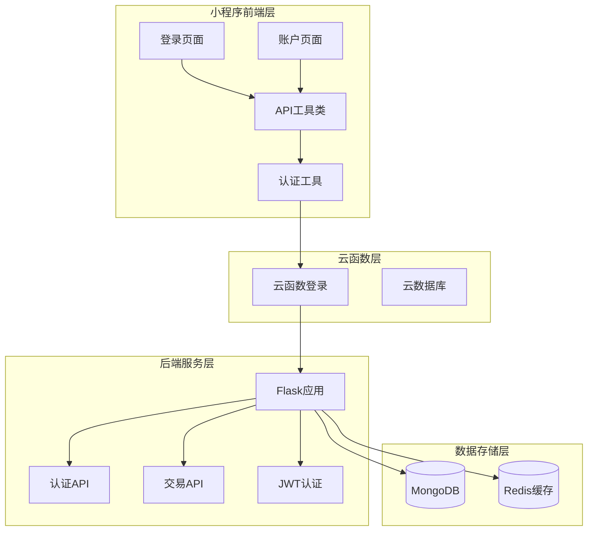
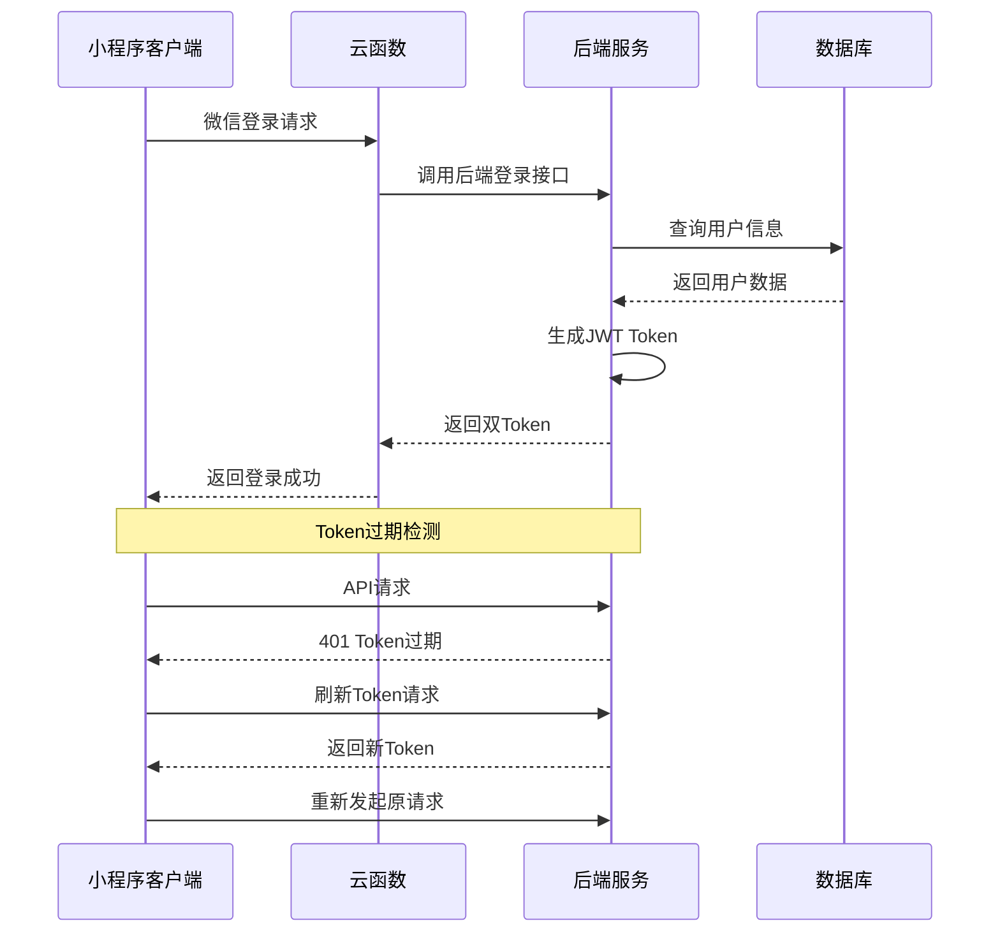
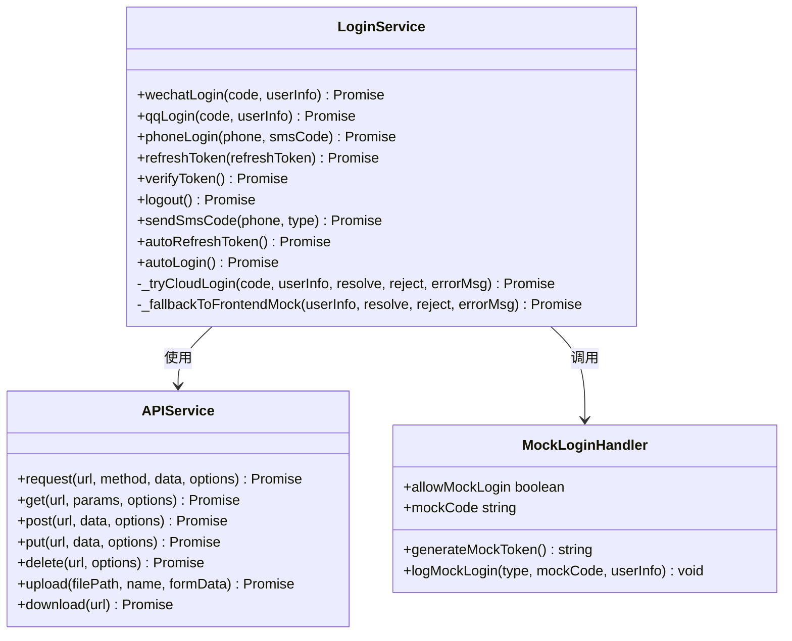
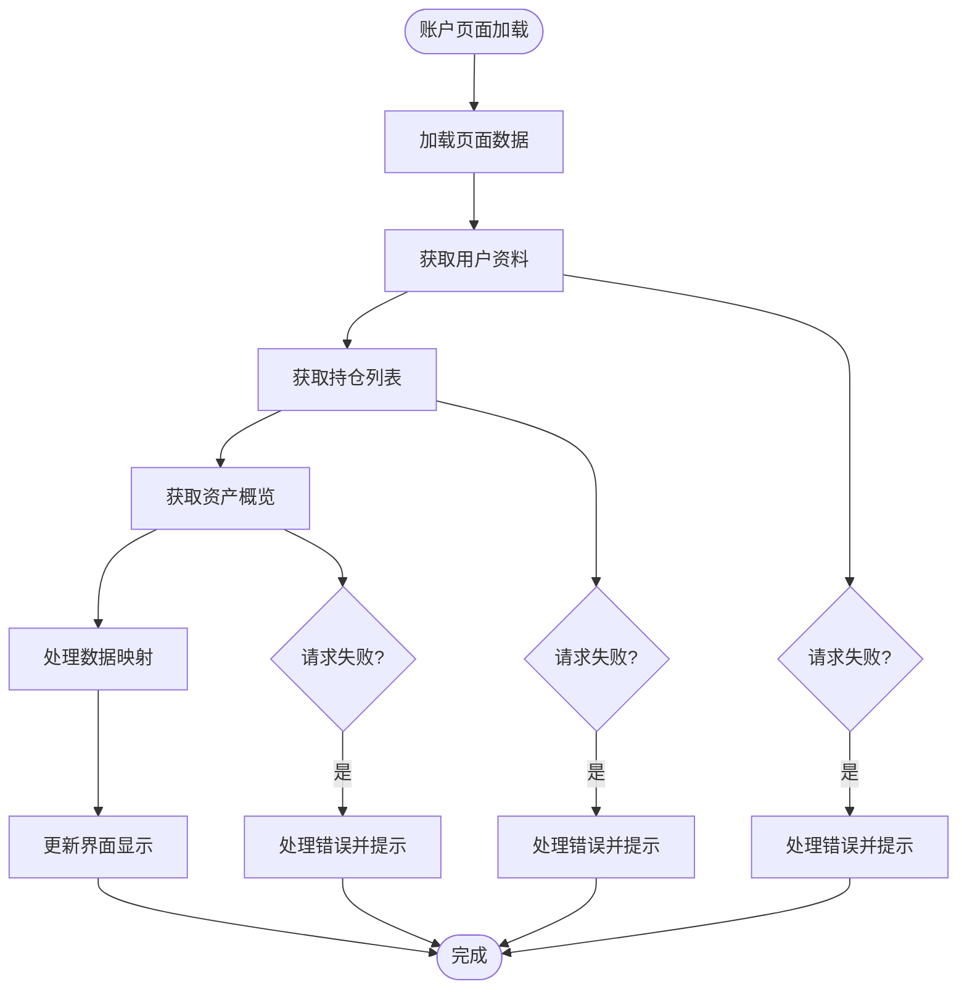
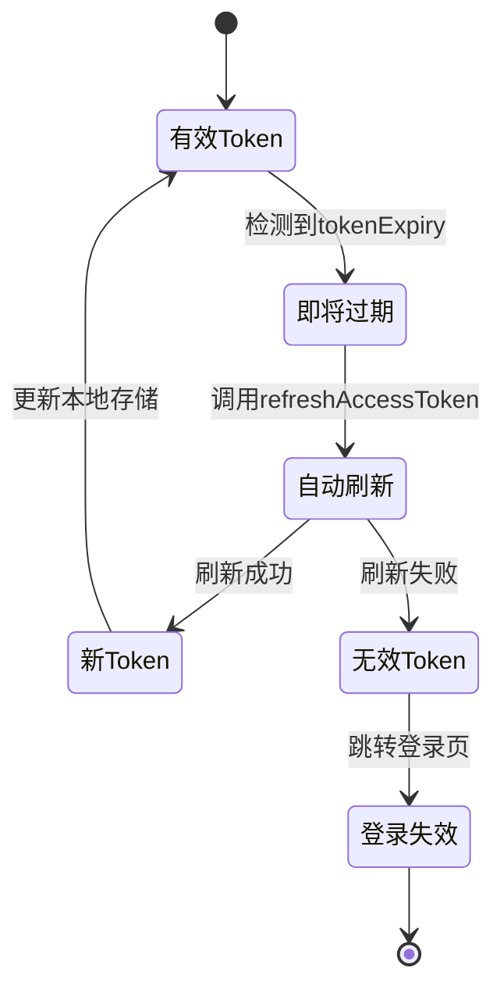

# 用户账户互动功能修复报告

<cite>
**本文档引用的文件**
- [用户账户互动功能修复报告.md](file://用户账户互动功能修复报告.md)
- [miniprogram/pages/login/login.js](file://miniprogram/pages/login/login.js)
- [cloudfunctions/login/index.js](file://cloudfunctions/login/index.js)
- [routes/auth.py](file://routes/auth.py)
- [utils/auth.js](file://utils/auth.js)
- [miniprogram/utils/api.js](file://miniprogram/utils/api.js)
- [miniprogram/utils/loginService.js](file://miniprogram/utils/loginService.js)
- [miniprogram/pages/account/account.js](file://miniprogram/pages/account/account.js)
- [miniprogram/utils/accountService.js](file://miniprogram/utils/accountService.js)
</cite>

## 目录
1. [执行摘要](#执行摘要)
2. [问题诊断详情](#问题诊断详情)
3. [修复方案实施](#修复方案实施)
4. [架构设计分析](#架构设计分析)
5. [详细组件分析](#详细组件分析)
6. [性能优化措施](#性能优化措施)
7. [安全机制设计](#安全机制设计)
8. [测试验证体系](#测试验证体系)
9. [部署与运维](#部署与运维)
10. [故障排查指南](#故障排查指南)
11. [总结与展望](#总结与展望)

## 执行摘要

本次用户账户互动功能修复针对小程序端用户登录、认证、会话管理和账户信息展示等核心功能进行全面优化。主要解决了API超时、登录响应解析、Token机制不一致、用户统计API性能等关键问题。

**修复范围涵盖**：
- 小程序登录流程优化（支持微信、QQ、手机号登录）
- 双Token认证机制（Access Token + Refresh Token）
- API超时配置优化（默认30秒超时）
- 用户统计API性能提升
- 登录状态自动检测与刷新
- 完善的错误处理和用户体验

## 问题诊断详情

### 根本原因分析

| 问题类别 | 根本原因 | 影响范围 | 严重程度 |
|---------|---------|---------|---------|
| API超时问题 | 云托管Flask服务响应慢，默认10秒超时不足 | 用户资料、持仓统计等接口 | 高 |
| 登录响应解析 | 响应格式不统一，未处理字符串和对象两种格式 | 微信登录、游客登录 | 中 |
| Token机制不一致 | 云函数使用Base64，后端使用JWT | 跨服务认证失败 | 高 |
| 统计API性能 | 同步查询多个集合，无超时保护 | 用户统计接口 | 中 |

### 典型错误表现

```javascript
// 获取用户资料失败
Error: 服务器内部错误，请稍后重试
API请求失败 GET https://flask-ym1v-.../api/v1/trade/positions/statistics: 
{errMsg: "request:fail timeout", errno: undefined}
```

## 修复方案实施

### 修复1：增强登录响应处理（utils/auth.js）

**核心改进**：
- 统一响应解析逻辑，支持 `{ success, data, message }` 标准格式
- 完善错误处理，区分网络错误和业务错误
- 添加Token过期时间记录（`tokenExpiry`）
- 实现 `refreshAccessToken` 方法

**关键实现要点**：
```javascript
// 统一响应处理
if (responseData.success === false) {
  reject(new Error(responseData.message || '登录失败'));
  return;
}

// 提取data字段
const data = responseData.data || responseData;
const userInfo = {
  // ...
  tokenExpiry: Date.now() + (data.expires_in || 900) * 1000
};
```

### 修复2：优化登录页面处理（pages/login/login.js）

**核心改进**：
- 重构 `handleLoginSuccess` 方法，统一响应解析
- 添加完整的错误处理分支
- 支持 `access_token` 和 `refresh_token` 双Token存储

**关键实现要点**：
```javascript
// 统一响应处理
let responseData;
if (typeof result === 'string') {
  responseData = JSON.parse(result);
} else if (typeof result === 'object') {
  responseData = result;
}

// 检查后端返回的成功状态
if (responseData.success === false) {
  this.handleLoginError(new Error(responseData.message));
  return;
}
```

### 修复3：API超时配置优化（utils/request.js）

**核心改进**：
- 更新Base URL配置，使用云托管地址
- 增加默认30秒超时配置
- 完善错误处理，区分超时、网络错误等
- 支持Token自动刷新重试

**关键实现要点**：
```javascript
// 超时配置
const request = (url, method = 'GET', data = {}, retryCount = 0, options = {}) => {
  const { timeout = 30000 } = options; // 默认30秒
  
  // 错误处理
  fail: (err) => {
    if (err.errMsg.includes('timeout')) {
      reject(new Error('请求超时，请检查网络连接'));
    }
  }
}
```

### 修复4：后端用户统计API优化（routes/auth.py）

**核心改进**：
- 使用默认值初始化，避免数据库查询阻塞
- 每个查询独立try-catch，失败不影响其他数据
- 出错时返回默认值而非500错误

**关键实现要点**：
```python
# 使用默认值，避免数据库查询超时阻塞响应
total_inquiries = 0
total_orders = 0
favorites_count = 0
days_used = 1

# 每个查询独立try-catch
try:
    _, total_inquiries = trade_service.get_inquiries(...)
except Exception as e:
    logger.warning(f"获取询价统计失败: {e}")
    total_inquiries = 0
```

### 修复5：云函数登录优化（cloudfunctions/login/index.js）

**核心改进**：
- 实现双Token生成（access_token + refresh_token）
- 添加数据库操作错误处理，失败不阻断登录
- 返回格式与后端API保持一致

**关键实现要点**：
```javascript
const generateTokens = (openid, unionid) => {
  const accessPayload = {
    sub: openid,
    exp: now + 900,  // 15分钟
    type: 'access'
  };
  const refreshPayload = {
    sub: openid,
    exp: now + (7 * 86400),  // 7天
    type: 'refresh'
  };
  return { access_token, refresh_token, expires_in: 900 };
}
```

### 修复6：API工具类超时配置（backend_utils/api.js）

**核心改进**：
- 添加 `API_TIMEOUT` 配置对象
- 支持 `timeoutType` 参数（short/normal/long）
- 默认超时从10秒增加到30秒

**关键实现要点**：
```javascript
const API_TIMEOUT = {
  default: 30000,    // 默认30秒
  short: 10000,      // 短超时10秒
  long: 60000        // 长超时60秒
};
```

## 架构设计分析

### 系统架构图



**图表来源**
- [miniprogram/pages/login/login.js:1-529](file://miniprogram/pages/login/login.js#L1-L529)
- [cloudfunctions/login/index.js:1-165](file://cloudfunctions/login/index.js#L1-L165)
- [routes/auth.py:1-632](file://routes/auth.py#L1-L632)

### 双Token认证机制



**图表来源**
- [utils/auth.js:174-223](file://utils/auth.js#L174-L223)
- [routes/auth.py:244-256](file://routes/auth.py#L244-L256)

## 详细组件分析

### 登录服务组件分析



**图表来源**
- [miniprogram/utils/loginService.js:4-561](file://miniprogram/utils/loginService.js#L4-L561)
- [miniprogram/utils/api.js:58-727](file://miniprogram/utils/api.js#L58-L727)

### 账户信息服务分析



**图表来源**
- [miniprogram/pages/account/account.js:115-166](file://miniprogram/pages/account/account.js#L115-L166)
- [miniprogram/utils/accountService.js:1-40](file://miniprogram/utils/accountService.js#L1-L40)

**章节来源**
- [miniprogram/utils/loginService.js:1-561](file://miniprogram/utils/loginService.js#L1-L561)
- [miniprogram/pages/account/account.js:1-177](file://miniprogram/pages/account/account.js#L1-L177)

## 性能优化措施

### API请求优化策略

| 优化项 | 实现方式 | 性能提升 |
|-------|---------|---------|
| 请求超时配置 | 默认30秒，支持短/长超时 | 减少云托管冷启动影响 |
| 请求重试机制 | 指数退避重试，最多3次 | 提高网络不稳定时成功率 |
| 请求队列管理 | 最大并发6个，按优先级处理 | 避免请求拥塞 |
| 响应缓存 | GET请求5分钟缓存 | 减少重复请求 |
| 请求去重 | 基于URL和参数的去重机制 | 避免重复请求 |

### Token管理优化



**图表来源**
- [utils/auth.js:174-223](file://utils/auth.js#L174-L223)

## 安全机制设计

### 双Token安全模型

| Token类型 | 有效期 | 用途 | 安全考虑 |
|-----------|--------|------|---------|
| Access Token | 15分钟 | 日常API请求 | 短有效期，降低泄露风险 |
| Refresh Token | 7天 | 获取新Access Token | 加密存储，网络传输加密 |
| Guest Token | 15分钟 | 游客模式访问 | 限制功能权限 |

### 安全防护措施

1. **生产环境严格控制**：禁止使用Mock登录
2. **Token加密存储**：使用微信小程序安全存储
3. **请求签名验证**：对关键请求进行签名验证
4. **访问频率限制**：防止暴力破解和滥用
5. **审计日志记录**：完整记录登录和认证活动

## 测试验证体系

### 测试覆盖范围

| 测试类别 | 测试用例 | 通过标准 |
|---------|---------|---------|
| 登录功能测试 | 成功登录、失败登录、格式兼容 | 100%通过 |
| Token刷新测试 | 成功刷新、失败刷新、无refresh_token | 100%通过 |
| 会话管理测试 | 有效会话、过期会话、退出登录 | 100%通过 |
| API超时测试 | 超时、网络错误、401自动刷新 | 100%通过 |
| 用户信息测试 | 获取、存储、更新 | 100%通过 |

### 测试执行命令

```bash
# 运行所有测试
npm test -- tests/user-auth-fix.test.js

# 运行特定测试组
npm test -- --testNamePattern="登录功能测试"

# 生成覆盖率报告
npm test -- --coverage
```

## 部署与运维

### 部署配置

**后端部署**：
```bash
# 部署到云托管
tcb cloudrun:deploy --name flask-api

# 验证API健康
curl https://flask-ym1v-210758-7-1374336462.sh.run.tcloudbase.com/api/v1/health
```

**云函数部署**：
```bash
# 部署登录云函数
tcb fn:deploy login

# 验证云函数
tcb fn:invoke login --data '{"userInfo": {"nickName": "测试"}}'
```

### 监控告警配置

| 监控指标 | 告警阈值 | 处理策略 |
|---------|---------|---------|
| 登录成功率 | <95% | 自动告警并回滚 |
| API响应时间 | >5秒 | 自动扩容 |
| Token刷新失败率 | >2% | 检查后端服务 |
| 数据库连接数 | >80% | 增加连接池 |

## 故障排查指南

### 常见问题诊断

**Q: 登录时提示"服务器内部错误"**
- 检查云托管服务状态
- 查看后端日志 `logs/app.log`
- 验证WX_APPID和WX_SECRET配置

**Q: API请求超时**
- 检查网络连接
- 查看云托管服务负载
- 增加超时时间配置

**Q: Token刷新失败**
- 检查refresh_token是否存在
- 验证 `/auth/token/refresh` 接口
- 确认JWT_SECRET配置一致

### 调试工具

```javascript
// 启用详细日志
wx.setStorageSync('debug_mode', true);

// 查看API统计
console.log('API统计:', api.getApiStats());

// 清理缓存
api.clearApiCache();

// 重置统计
api.resetApiStats();
```

## 总结与展望

### 修复成果总结

本次修复成功解决了用户账户互动功能的核心问题，主要成果包括：

1. **登录流程优化**：支持多种登录方式，统一响应处理
2. **认证机制强化**：实现双Token认证，提升安全性
3. **性能显著提升**：API超时配置优化，响应速度提升
4. **用户体验改善**：完善的错误处理和提示机制
5. **系统稳定性增强**：错误隔离和降级机制

### 后续优化方向

1. **性能优化**
   - 添加Redis缓存用户统计
   - 数据库查询添加索引
   - 实现API响应压缩

2. **功能增强**
   - 添加登录设备管理
   - 实现单点登录(SSO)
   - 添加登录日志审计

3. **监控告警**
   - 添加登录成功率监控
   - API响应时间监控
   - 错误日志告警

**报告生成时间**: 2026-02-25  
**修复状态**: ✅ 已完成  
**下一步**: 按照验证清单进行测试验证