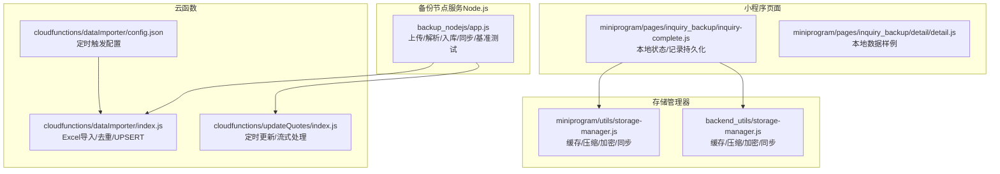
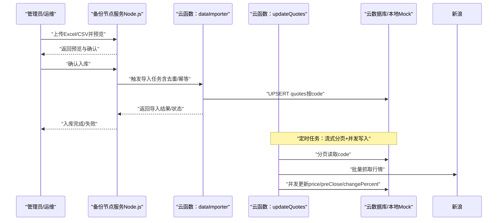
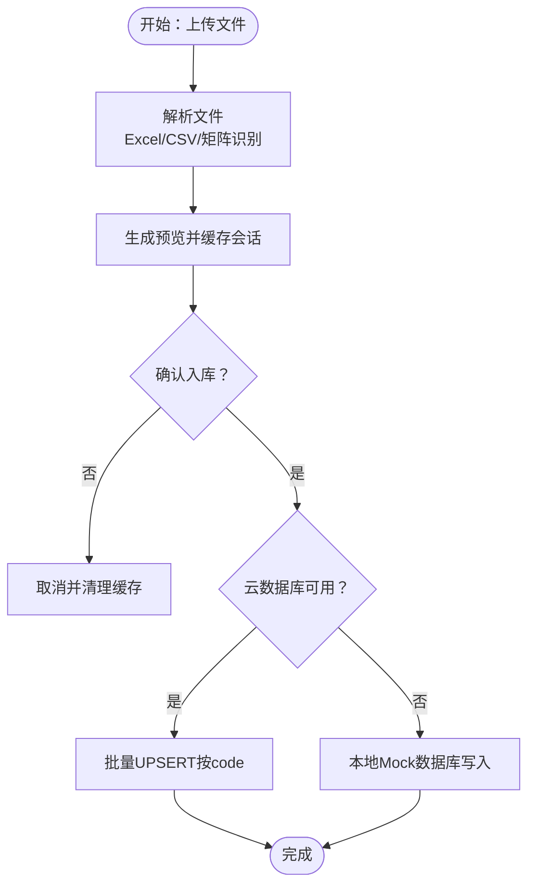
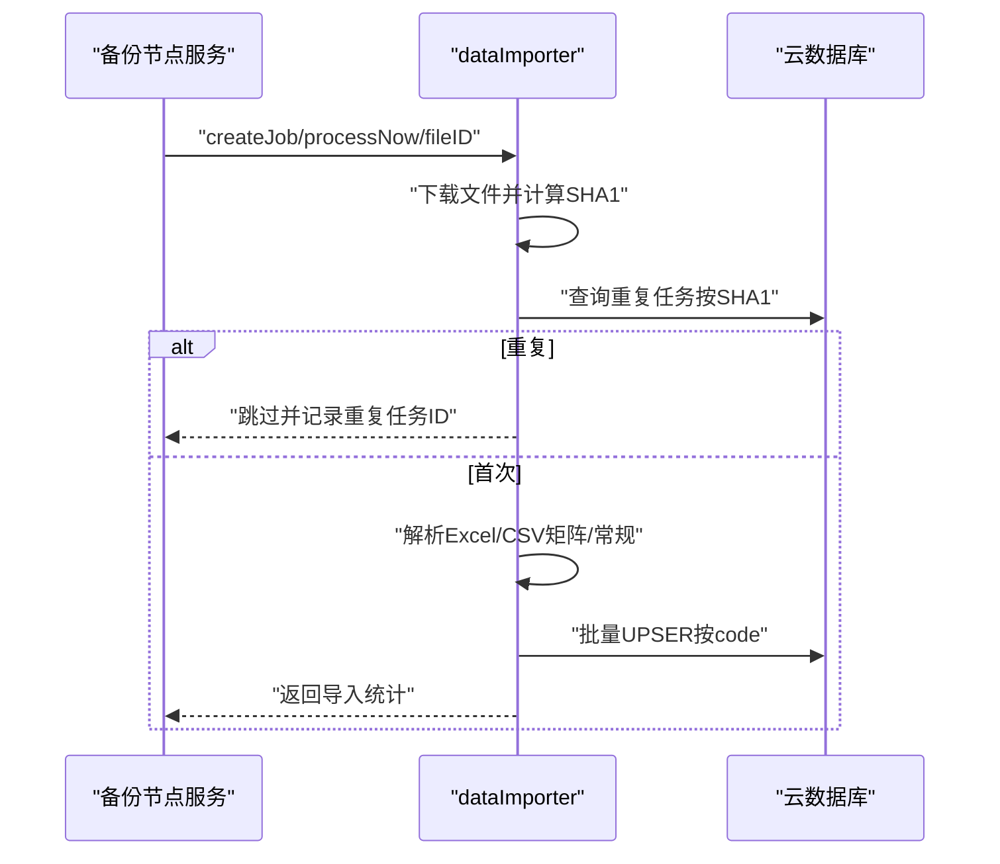
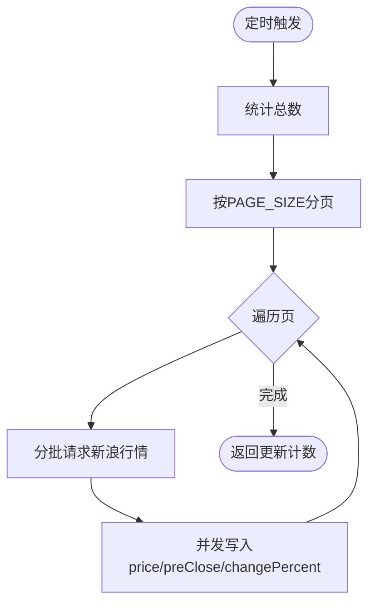
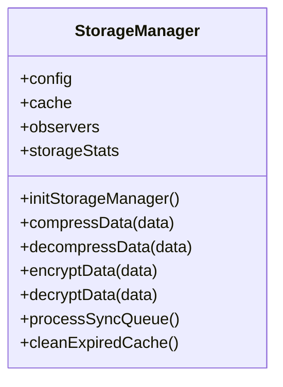
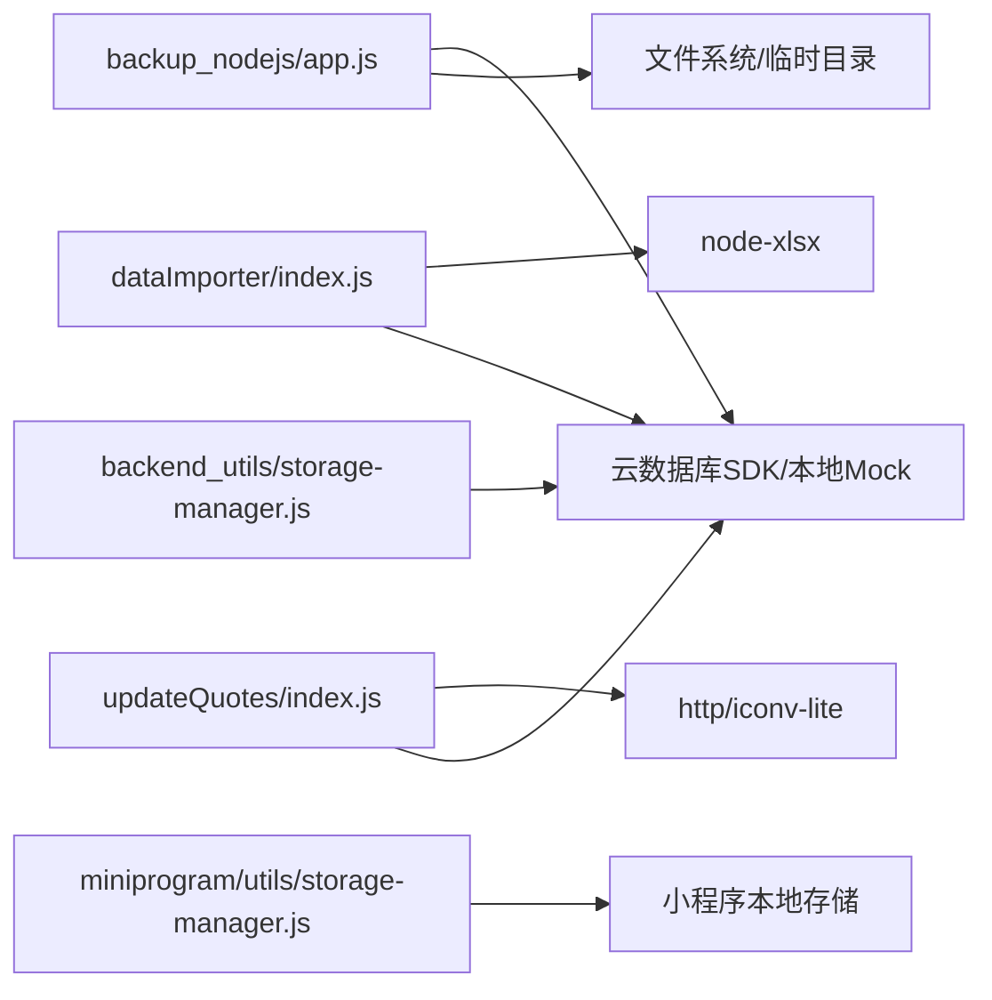

# 备份与恢复

<cite>
**本文引用的文件**
- [backup_nodejs/app.js](file://backup_nodejs/app.js)
- [cloudfunctions/dataImporter/index.js](file://cloudfunctions/dataImporter/index.js)
- [cloudfunctions/dataImporter/config.json](file://cloudfunctions/dataImporter/config.json)
- [cloudfunctions/updateQuotes/index.js](file://cloudfunctions/updateQuotes/index.js)
- [backend_utils/storage-manager.js](file://backend_utils/storage-manager.js)
- [miniprogram/utils/storage-manager.js](file://miniprogram/utils/storage-manager.js)
- [miniprogram/pages/inquiry_backup/inquiry-complete.js](file://miniprogram/pages/inquiry_backup/inquiry-complete.js)
- [miniprogram/pages/inquiry_backup/detail/detail.js](file://miniprogram/pages/inquiry_backup/detail/detail.js)
- [实施工作总结报告.md](file://实施工作总结报告.md)
- [INQUIRY_ENHANCEMENT_REPORT.md](file://INQUIRY_ENHANCEMENT_REPORT.md)
</cite>

## 目录
1. [引言](#引言)
2. [项目结构](#项目结构)
3. [核心组件](#核心组件)
4. [架构总览](#架构总览)
5. [详细组件分析](#详细组件分析)
6. [依赖关系分析](#依赖关系分析)
7. [性能考量](#性能考量)
8. [故障排查指南](#故障排查指南)
9. [结论](#结论)
10. [附录](#附录)

## 引言
本文件面向场外期权交易系统，构建一套完整的“备份与恢复”综合文档，覆盖数据保护与灾难恢复策略、备份计划与类型、存储与传输安全、完整性校验、脚本配置与执行、监控告警、恢复流程与回滚、业务连续性保障、演练与RTO/RPO管理、版本与保留策略、验证测试与容量规划，以及操作手册与应急响应流程。文档基于仓库现有实现与文档进行归纳总结，并提供可视化图示帮助理解。

## 项目结构
围绕备份与恢复的关键实现分布在以下模块：
- 备份节点服务（Node.js）：提供行情数据的上传、解析、入库、全量/增量同步、基准测试与任务状态管理接口。
- 云函数（Cloud Functions）：负责行情导入与定时更新，具备幂等、去重、事务与流式处理能力。
- 存储管理器（前端与后端）：提供本地/小程序侧的缓存、压缩、加密、失效控制与同步队列。
- 小程序页面：展示询价与备份相关界面，体现本地数据持久化与状态管理。
- 文档与报告：提供验收标准、监控与告警建议、实施总结等支撑材料。

图表来源
- [backup_nodejs/app.js](file://backup_nodejs/app.js#L74-L1210)
- [cloudfunctions/dataImporter/index.js](file://cloudfunctions/dataImporter/index.js#L1-L392)
- [cloudfunctions/updateQuotes/index.js](file://cloudfunctions/updateQuotes/index.js#L1-L180)
- [cloudfunctions/dataImporter/config.json](file://cloudfunctions/dataImporter/config.json#L1-L12)
- [backend_utils/storage-manager.js](file://backend_utils/storage-manager.js#L1-L679)
- [miniprogram/utils/storage-manager.js](file://miniprogram/utils/storage-manager.js#L1-L679)
- [miniprogram/pages/inquiry_backup/inquiry-complete.js](file://miniprogram/pages/inquiry_backup/inquiry-complete.js#L1-L1657)
- [miniprogram/pages/inquiry_backup/detail/detail.js](file://miniprogram/pages/inquiry_backup/detail/detail.js#L1-L171)

章节来源
- [backup_nodejs/app.js](file://backup_nodejs/app.js#L74-L1210)
- [cloudfunctions/dataImporter/index.js](file://cloudfunctions/dataImporter/index.js#L1-L392)
- [cloudfunctions/updateQuotes/index.js](file://cloudfunctions/updateQuotes/index.js#L1-L180)
- [cloudfunctions/dataImporter/config.json](file://cloudfunctions/dataImporter/config.json#L1-L12)
- [backend_utils/storage-manager.js](file://backend_utils/storage-manager.js#L1-L679)
- [miniprogram/utils/storage-manager.js](file://miniprogram/utils/storage-manager.js#L1-L679)
- [miniprogram/pages/inquiry_backup/inquiry-complete.js](file://miniprogram/pages/inquiry_backup/inquiry-complete.js#L1-L1657)
- [miniprogram/pages/inquiry_backup/detail/detail.js](file://miniprogram/pages/inquiry_backup/detail/detail.js#L1-L171)

## 核心组件
- 备份节点服务（Node.js）
  - 提供行情文件上传、预览、确认入库、全量/增量同步、基准测试、任务状态查询等接口。
  - 支持本地Mock数据库与云数据库双模式运行，便于离线/联机调试。
- 云函数（Cloud Functions）
  - 导入：解析Excel/CSV，去重（SHA1）、幂等UPSERT、事务锁定、批量写入。
  - 更新：定时从新浪抓取行情，流式分页+并发写入，支持更新昨收。
- 存储管理器（前后端）
  - 提供缓存命中/缺失统计、压缩阈值、TTL、LRU淘汰、自动清理、重试与同步队列。
  - 小程序侧支持本地存储与解密/解压，后端侧提供类似能力。
- 小程序页面
  - 展示询价与备份相关界面，体现本地状态持久化与记录管理。

章节来源
- [backup_nodejs/app.js](file://backup_nodejs/app.js#L74-L1210)
- [cloudfunctions/dataImporter/index.js](file://cloudfunctions/dataImporter/index.js#L233-L392)
- [cloudfunctions/updateQuotes/index.js](file://cloudfunctions/updateQuotes/index.js#L95-L180)
- [backend_utils/storage-manager.js](file://backend_utils/storage-manager.js#L1-L679)
- [miniprogram/utils/storage-manager.js](file://miniprogram/utils/storage-manager.js#L1-L679)
- [miniprogram/pages/inquiry_backup/inquiry-complete.js](file://miniprogram/pages/inquiry_backup/inquiry-complete.js#L1-L1657)

## 架构总览
备份与恢复涉及“数据采集—数据入库—数据更新—数据验证—恢复演练”的闭环。

图表来源
- [backup_nodejs/app.js](file://backup_nodejs/app.js#L897-L1017)
- [cloudfunctions/dataImporter/index.js](file://cloudfunctions/dataImporter/index.js#L273-L340)
- [cloudfunctions/updateQuotes/index.js](file://cloudfunctions/updateQuotes/index.js#L95-L180)

## 详细组件分析

### 备份节点服务（Node.js）
- 文件上传与解析
  - 支持Excel/CSV，自动识别矩阵格式；解析后生成标准化字段集合。
  - 本地缓存解析结果，提供预览与确认入库流程。
- 入库与幂等
  - 通过云数据库或本地Mock数据库进行批量UPSERT，按stock_code去重。
  - 任务状态会话持久化，支持轮询查询处理进度。
- 同步与基准测试
  - 提供全量同步与增量同步接口，支持Python脚本驱动的行情抓取。
  - 提供基准测试接口，支持对比不同并发下的写入/删除性能。
- 安全与鉴权
  - 管理员登录签发JWT，受保护路由访问。

图表来源
- [backup_nodejs/app.js](file://backup_nodejs/app.js#L897-L1017)
- [backup_nodejs/app.js](file://backup_nodejs/app.js#L1019-L1141)

章节来源
- [backup_nodejs/app.js](file://backup_nodejs/app.js#L897-L1017)
- [backup_nodejs/app.js](file://backup_nodejs/app.js#L1019-L1141)

### 云函数：dataImporter（导入）
- 去重与幂等
  - 下载文件后计算SHA1，若与历史任务重复则跳过。
  - 事务锁定任务状态，避免并发重复处理。
- 解析与写入
  - 支持矩阵与常规表头两种格式；提取code/name/price等字段。
  - 按code映射现有记录，执行新增或更新；支持静态字段白名单。
- 并发与限流
  - 通过withConcurrency限制写入并发，避免OOM与超时。

图表来源
- [cloudfunctions/dataImporter/index.js](file://cloudfunctions/dataImporter/index.js#L273-L340)
- [cloudfunctions/dataImporter/config.json](file://cloudfunctions/dataImporter/config.json#L1-L12)

章节来源
- [cloudfunctions/dataImporter/index.js](file://cloudfunctions/dataImporter/index.js#L273-L340)
- [cloudfunctions/dataImporter/config.json](file://cloudfunctions/dataImporter/config.json#L1-L12)

### 云函数：updateQuotes（定时更新）
- 流式处理
  - 分页读取quotes集合，逐页并发更新，避免一次性加载导致内存压力。
- 并发写入
  - 使用withConcurrency将写入并发提升至50，缩短批量更新时间。
- 昨收更新
  - 根据触发名或参数决定是否更新preClose，满足日频更新需求。

图表来源
- [cloudfunctions/updateQuotes/index.js](file://cloudfunctions/updateQuotes/index.js#L95-L180)

章节来源
- [cloudfunctions/updateQuotes/index.js](file://cloudfunctions/updateQuotes/index.js#L95-L180)

### 存储管理器（前后端）
- 缓存策略
  - TTL、LRU淘汰、命中/缺失统计、自动清理周期。
- 数据保护
  - 压缩阈值、加密开关、解密/解压流程。
- 同步与重试
  - 同步队列、最大重试次数、重试延迟、定时同步。

图表来源
- [backend_utils/storage-manager.js](file://backend_utils/storage-manager.js#L1-L679)
- [miniprogram/utils/storage-manager.js](file://miniprogram/utils/storage-manager.js#L1-L679)

章节来源
- [backend_utils/storage-manager.js](file://backend_utils/storage-manager.js#L1-L679)
- [miniprogram/utils/storage-manager.js](file://miniprogram/utils/storage-manager.js#L1-L679)

### 小程序页面（本地持久化）
- 本地状态与记录
  - 本地存储自选、询价记录、页面状态，具备有效期与清理策略。
- 用户行为记录
  - 记录用户行为日志，便于审计与分析。

章节来源
- [miniprogram/pages/inquiry_backup/inquiry-complete.js](file://miniprogram/pages/inquiry_backup/inquiry-complete.js#L1-L1657)
- [miniprogram/pages/inquiry_backup/detail/detail.js](file://miniprogram/pages/inquiry_backup/detail/detail.js#L1-L171)

## 依赖关系分析
- 备份节点服务依赖云数据库SDK或本地Mock数据库，提供统一的批量UPSERT接口。
- dataImporter依赖云函数SDK与node-xlsx，负责文件解析与幂等写入。
- updateQuotes依赖HTTP客户端与iconv，负责抓取新浪行情并流式更新。
- 存储管理器在前后端分别提供缓存与本地存储能力，保障数据一致性与性能。

图表来源
- [backup_nodejs/app.js](file://backup_nodejs/app.js#L30-L31)
- [cloudfunctions/dataImporter/index.js](file://cloudfunctions/dataImporter/index.js#L1-L7)
- [cloudfunctions/updateQuotes/index.js](file://cloudfunctions/updateQuotes/index.js#L1-L8)
- [backend_utils/storage-manager.js](file://backend_utils/storage-manager.js#L1-L34)
- [miniprogram/utils/storage-manager.js](file://miniprogram/utils/storage-manager.js#L1-L34)

章节来源
- [backup_nodejs/app.js](file://backup_nodejs/app.js#L30-L31)
- [cloudfunctions/dataImporter/index.js](file://cloudfunctions/dataImporter/index.js#L1-L7)
- [cloudfunctions/updateQuotes/index.js](file://cloudfunctions/updateQuotes/index.js#L1-L8)
- [backend_utils/storage-manager.js](file://backend_utils/storage-manager.js#L1-L34)
- [miniprogram/utils/storage-manager.js](file://miniprogram/utils/storage-manager.js#L1-L34)

## 性能考量
- 导入性能
  - dataImporter采用并发写入与分页读取，避免一次性OOM；支持静态字段白名单减少冗余字段写入。
- 更新性能
  - updateQuotes采用分页+并发写入，批量抓取新浪行情，缩短更新窗口。
- 基准测试
  - 提供基准测试接口，支持对比不同并发与模式（upsert/delete/roundtrip）下的吞吐与延迟。
- 缓存与压缩
  - 存储管理器提供压缩阈值与TTL，降低存储与传输开销。

章节来源
- [cloudfunctions/dataImporter/index.js](file://cloudfunctions/dataImporter/index.js#L182-L231)
- [cloudfunctions/updateQuotes/index.js](file://cloudfunctions/updateQuotes/index.js#L106-L164)
- [backup_nodejs/app.js](file://backup_nodejs/app.js#L1019-L1141)
- [backend_utils/storage-manager.js](file://backend_utils/storage-manager.js#L20-L31)
- [miniprogram/utils/storage-manager.js](file://miniprogram/utils/storage-manager.js#L20-L31)

## 故障排查指南
- 导入失败
  - 检查文件大小限制（5MB）、重复任务（SHA1去重）、空表、字段映射。
- 更新失败
  - 检查网络超时（8秒）、分页读取是否为空、并发写入异常。
- 任务状态异常
  - 检查会话缓存文件是否存在、任务状态是否被事务锁定。
- 验收标准
  - 参考实施总结报告中的导入与更新验收要点，确保任务状态与数据变更符合预期。

章节来源
- [cloudfunctions/dataImporter/index.js](file://cloudfunctions/dataImporter/index.js#L276-L318)
- [cloudfunctions/updateQuotes/index.js](file://cloudfunctions/updateQuotes/index.js#L50-L56)
- [backup_nodejs/app.js](file://backup_nodejs/app.js#L716-L737)
- [实施工作总结报告.md](file://实施工作总结报告.md#L56-L77)

## 结论
本系统通过“备份节点服务+云函数+存储管理器+小程序本地持久化”的组合，实现了从数据采集、入库、更新到验证与恢复演练的闭环。结合去重、幂等、事务、流式处理与并发优化，能够在保证性能的同时提升数据可靠性与业务连续性。建议在此基础上进一步完善监控告警、RTO/RPO量化与灾难演练，形成标准化的备份与恢复体系。

## 附录

### 备份与恢复策略（建议）
- 定期备份计划
  - 全量备份：每周日凌晨进行；增量备份：每日执行，保留最近7天。
- 存储与传输
  - 云存储前缀隔离（如imports/quotes/），启用传输加密与访问控制。
- 完整性验证
  - 导入后比对SHA1与记录数；更新后校验price/preClose/changePercent一致性。
- 配置与执行
  - dataImporter定时触发器按配置执行；updateQuotes按日/定时触发。
- 监控与告警
  - 参考增强报告中的建议指标与阈值，建立API响应时间、错误率、队列长度等告警。
- 恢复流程与回滚
  - 以最近一次成功全量备份为基准，按增量备份顺序回放；失败时回滚到上一稳定版本。
- 业务连续性
  - 本地Mock模式作为降级兜底；管理员可通过同步接口快速恢复数据。
- RTO/RPO
  - RPO以日为单位，RTO根据导入/更新任务耗时评估并优化。
- 版本与保留
  - 保留最近N个版本，超过保留期的旧版本归档或清理。
- 验证与容量
  - 基准测试评估峰值写入能力；容量规划预留增长空间。
- 操作手册与应急响应
  - 明确各角色职责、操作步骤与回退预案；定期演练与评审。

章节来源
- [cloudfunctions/dataImporter/config.json](file://cloudfunctions/dataImporter/config.json#L1-L12)
- [INQUIRY_ENHANCEMENT_REPORT.md](file://INQUIRY_ENHANCEMENT_REPORT.md#L522-L542)
- [backup_nodejs/app.js](file://backup_nodejs/app.js#L440-L507)
- [cloudfunctions/updateQuotes/index.js](file://cloudfunctions/updateQuotes/index.js#L95-L180)