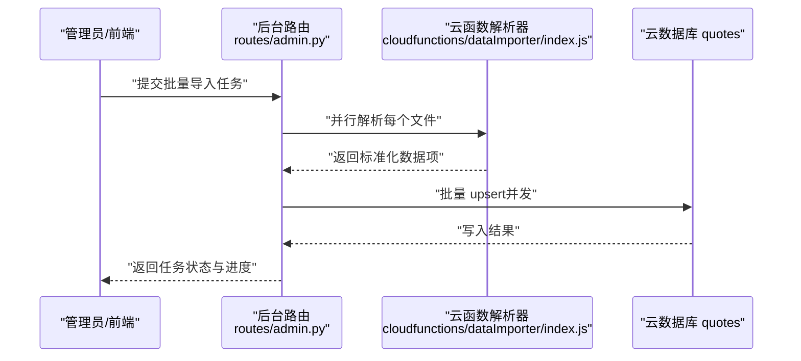
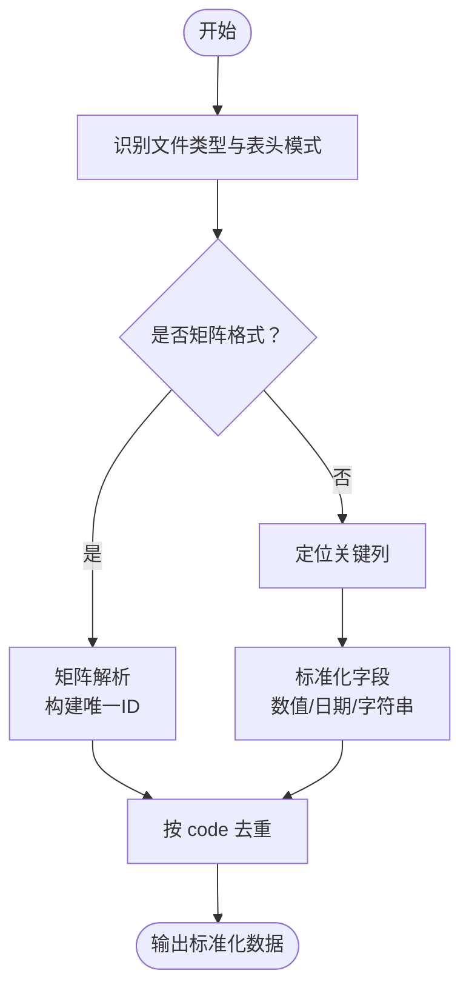
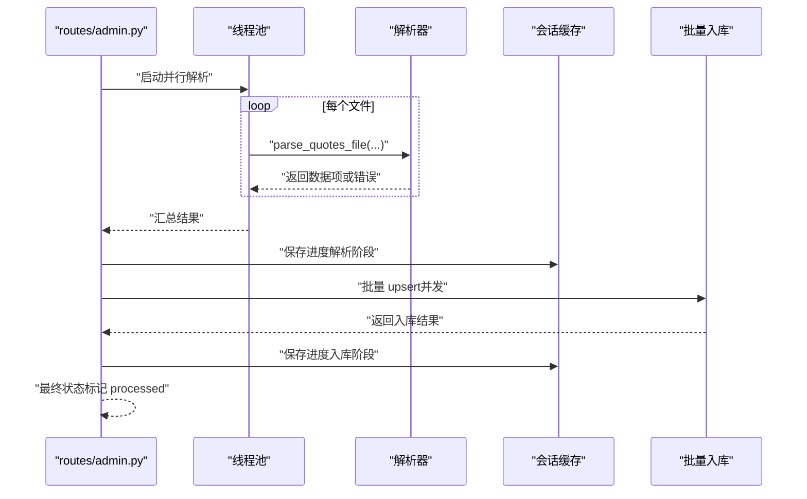
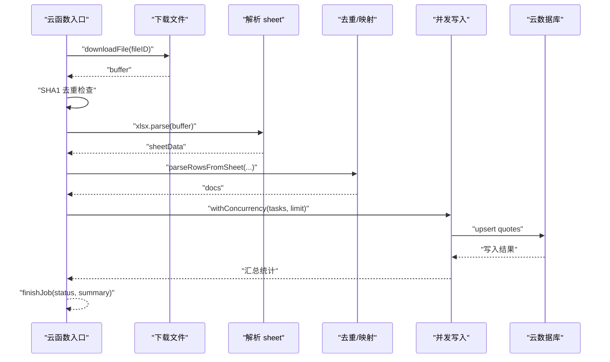
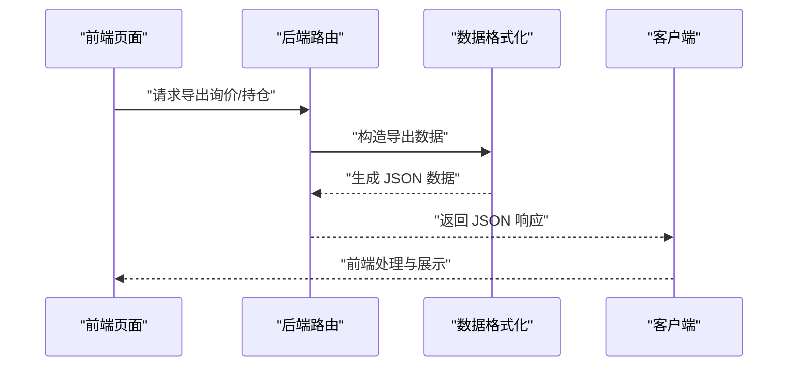
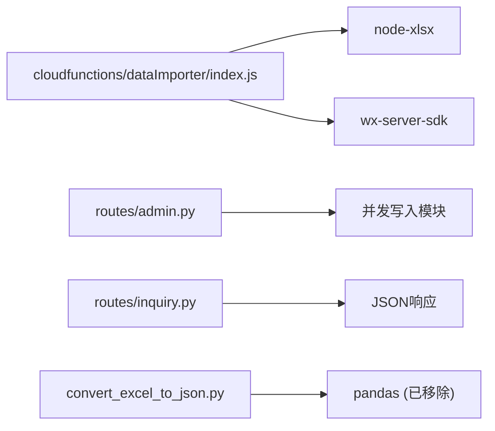

# 数据导入导出

<cite>
**本文引用的文件**
- [routes/admin.py](file://routes/admin.py)
- [services/file_parser.py](file://services/file_parser.py)
- [cloudfunctions/dataImporter/index.js](file://cloudfunctions/dataImporter/index.js)
- [cloudfunctions/updateQuotes/index.js](file://cloudfunctions/updateQuotes/index.js)
- [convert_excel_to_json.py](file://convert_excel_to_json.py)
- [routes/inquiry.py](file://routes/inquiry.py)
- [admin-ui/src/pages/Quotes.tsx](file://admin-ui/src/pages/Quotes.tsx)
- [admin-ui/src/pages/TradePositions.tsx](file://admin-ui/src/pages/TradePositions.tsx)
- [services/sync_service.py](file://services/sync_service.py)
- [cloudfunctions/dataImporter/package.json](file://cloudfunctions/dataImporter/package.json)
</cite>

## 更新摘要
**变更内容**
- 移除了Excel生成和pandas依赖，简化了数据导入导出流程
- 导出功能改为JSON格式响应，不再生成Excel文件
- 本地解析器功能被简化，返回空列表以适应云托管环境
- 云端导入器仍保留Excel解析能力，但移除了pandas依赖

## 目录
1. [简介](#简介)
2. [项目结构](#项目结构)
3. [核心组件](#核心组件)
4. [架构总览](#架构总览)
5. [详细组件分析](#详细组件分析)
6. [依赖关系分析](#依赖关系分析)
7. [性能考量](#性能考量)
8. [故障排除指南](#故障排除指南)
9. [结论](#结论)
10. [附录](#附录)

## 简介
本文件面向场外期权交易系统的数据批量处理能力，系统性梳理数据导入与导出的全流程。经过简化后，系统采用更轻量级的数据处理方式：移除了Excel生成和pandas依赖，导出功能改为JSON格式响应，云端导入器直接处理Excel文件并进行去重、字段映射与标准化。文档涵盖简化的解析流程、格式验证与转换、批量导入脚本、错误处理与进度监控、数据导出（JSON格式）、数据质量检查与重复处理、冲突解决、映射规则与格式标准化、大文件与内存优化、并发控制、校验规则与重试机制，并提供完整示例与排障建议。

## 项目结构
系统围绕"云端直接处理"的简化架构构建：
- 云端直接处理：通过云函数直接解析Excel文件，进行去重、字段映射与标准化，支持并发写入与事务保障。
- 导出功能：支持导出询价与持仓等报表为JSON格式，便于前端处理与外部集成。
- 同步与质量：清洗、去重、并发写入、进度上报、错误聚合与重试策略。

**图表来源**
- [cloudfunctions/dataImporter/index.js](file://cloudfunctions/dataImporter/index.js#L273-L318)
- [routes/inquiry.py](file://routes/inquiry.py#L124-L165)

## 核心组件
- **云端解析器**：直接解析Excel/CSV文件，无需pandas依赖，自动识别复杂矩阵与扁平表头，字段映射与标准化，生成统一数据模型。
- **批量导入API**：并行解析多个文件，统一去重，调用批量入库接口，支持进度回调与状态持久化。
- **云函数导入器**：云端解析Excel/CSV，重复检测（SHA1），并发Upsert，事务保障，分页流式处理。
- **JSON导出功能**：支持导出询价与持仓等报表为JSON格式，便于前端处理与外部系统集成。
- **同步与质量**：清洗、去重、并发写入、进度上报、错误聚合与重试策略。

**章节来源**
- [cloudfunctions/dataImporter/index.js](file://cloudfunctions/dataImporter/index.js#L133-L318)
- [routes/admin.py](file://routes/admin.py#L722-L840)
- [routes/inquiry.py](file://routes/inquiry.py#L124-L165)

## 架构总览
系统采用简化的"云端直接处理"设计，移除了本地解析依赖，直接在云端进行数据处理与导入。

**图表来源**
- [routes/admin.py](file://routes/admin.py#L722-L840)
- [cloudfunctions/dataImporter/index.js](file://cloudfunctions/dataImporter/index.js#L320-L340)

## 详细组件分析

### Excel/CSV解析与字段映射（简化版）
- **云端直接解析**：云函数直接使用node-xlsx解析Excel文件，无需pandas依赖。
- **复杂矩阵识别**：通过前若干行内容启发式判断是否为"矩阵格式"，自动切换解析路径。
- **扁平表头识别**：扫描前若干行，匹配候选关键词，定位关键列位置。
- **字段映射与标准化**：
  - 代码标准化：去除非数字字符，补齐6位。
  - 数值清洗：百分比、千分位等格式清理，NaN过滤。
  - 日期处理：Excel序列号转JS日期。
  - 去重：按code去重，后出现覆盖先出现。
- **输出模型**：统一包含stock_code、code、name、type、term、trader、rate等字段，便于后续入库与展示。

**图表来源**
- [cloudfunctions/dataImporter/index.js](file://cloudfunctions/dataImporter/index.js#L66-L131)
- [cloudfunctions/dataImporter/index.js](file://cloudfunctions/dataImporter/index.js#L133-L165)

**章节来源**
- [cloudfunctions/dataImporter/index.js](file://cloudfunctions/dataImporter/index.js#L66-L131)
- [cloudfunctions/dataImporter/index.js](file://cloudfunctions/dataImporter/index.js#L133-L165)

### 批量导入脚本与进度监控（简化版）
- **并行解析**：ThreadPoolExecutor并行处理多个文件，限制最大并发。
- **去重合并**：按code去重，后出现覆盖先出现，降低重复入库风险。
- **进度回调**：限制更新频率，避免频繁I/O；将入库阶段占比映射到整体进度。
- **状态持久化**：通过上传会话缓存JSON文件记录状态、进度与结果，支持断点续传与重试。

**图表来源**
- [routes/admin.py](file://routes/admin.py#L722-L840)

**章节来源**
- [routes/admin.py](file://routes/admin.py#L722-L840)

### 云端导入器（云函数）
- **重复检测**：下载文件后计算SHA1，若与历史成功/跳过任务一致，则直接跳过，避免重复导入。
- **内存保护**：限制最大文件大小为5MB，超过阈值直接失败，防止OOM。
- **并发写入**：withConcurrency控制并发度，支持静态字段白名单，避免误更新动态字段。
- **事务保障**：作业状态变更采用事务，保证"pending → processing → success/failed/skipped"。

**图表来源**
- [cloudfunctions/dataImporter/index.js](file://cloudfunctions/dataImporter/index.js#L273-L318)
- [cloudfunctions/dataImporter/index.js](file://cloudfunctions/dataImporter/index.js#L182-L231)

**章节来源**
- [cloudfunctions/dataImporter/index.js](file://cloudfunctions/dataImporter/index.js#L273-L318)
- [cloudfunctions/dataImporter/index.js](file://cloudfunctions/dataImporter/index.js#L182-L231)

### 数据导出功能（JSON格式）
- **询价导出**：将询价记录导出为JSON格式，包含ID、提交时间、客户姓名、电话、产品名称、代码、方向、结构、期限、名义本金、行权价、状态、备注等字段。
- **持仓导出**：前端直接生成CSV，包含持仓ID、客户、产品代码/名称、数量、成本价、现价、市值、盈亏、收益率、市场、币种、状态、建仓时间等。

**图表来源**
- [routes/inquiry.py](file://routes/inquiry.py#L124-L165)
- [admin-ui/src/pages/TradePositions.tsx](file://admin-ui/src/pages/TradePositions.tsx#L109-L140)

**章节来源**
- [routes/inquiry.py](file://routes/inquiry.py#L124-L165)
- [admin-ui/src/pages/TradePositions.tsx](file://admin-ui/src/pages/TradePositions.tsx#L109-L140)

### 数据质量检查、重复数据处理与冲突解决
- **云端侧**：
  - 去重：根据SHA1快速识别重复文件，直接跳过，节省资源。
  - 写入：Upsert模式，若存在则更新，否则新增，避免主键冲突。
  - 并发：限制并发度，避免数据库压力过大；分页读取与写入，避免OOM。
- **文件大小限制**：云端侧限制最大文件大小为5MB，防止内存溢出。

**章节来源**
- [cloudfunctions/dataImporter/index.js](file://cloudfunctions/dataImporter/index.js#L276-L301)
- [cloudfunctions/dataImporter/index.js](file://cloudfunctions/dataImporter/index.js#L182-L231)

### 数据映射规则与格式标准化
- **字段映射**：
  - 代码：优先匹配"代码/股票代码/证券代码/A股代码/合约编码/标的代码"等候选。
  - 名称：匹配"名称/股票名称/Name/证券简称/A股简称/合约简称/标的名称"。
  - 价格/涨跌幅/成交量/成交额：按候选集合匹配并清洗。
- **格式标准化**：
  - 代码：6位纯数字，不足补零。
  - 日期：Excel序列号转JS Date。
  - 百分比/千分位：去除单位与逗号后转浮点。
  - 矩阵格式：唯一ID规则为opt_{stock_code}_{type}_{term}_{trader}，确保同一标的多维度共存。

**章节来源**
- [cloudfunctions/dataImporter/index.js](file://cloudfunctions/dataImporter/index.js#L48-L64)
- [cloudfunctions/dataImporter/index.js](file://cloudfunctions/dataImporter/index.js#L111-L129)

### 大文件处理、内存优化与并发控制
- **云端侧**：
  - 文件大小限制：下载前检查buffer长度，限制最大文件大小为5MB，超过阈值直接失败。
  - 并发写入：withConcurrency控制写入并发，避免数据库压力。
  - 分页流式：更新行情时采用分页读取与写入，逐页释放内存。
- **前端侧**：
  - 批量处理：分批处理数据，避免阻塞UI。
  - 防抖：对高频操作进行防抖，减少不必要的刷新。

**章节来源**
- [cloudfunctions/dataImporter/index.js](file://cloudfunctions/dataImporter/index.js#L276-L291)
- [cloudfunctions/updateQuotes/index.js](file://cloudfunctions/updateQuotes/index.js#L101-L142)
- [admin-ui/src/pages/Quotes.tsx](file://admin-ui/src/pages/Quotes.tsx#L74-L127)

### 数据校验规则、异常捕获与重试机制
- **校验规则**：
  - 关键列缺失：抛出异常或跳过该文件/记录。
  - 数值非法：NaN、空字符串、负数等过滤。
  - 日期格式：Excel序列号转换，异常则回退或跳过。
- **异常捕获**：
  - 云端：作业状态失败时记录错误信息，支持重试。
- **重试机制**：
  - 云函数作业采用事务抢占，失败后可再次调度。

**章节来源**
- [cloudfunctions/dataImporter/index.js](file://cloudfunctions/dataImporter/index.js#L329-L336)

## 依赖关系分析
- **云端解析**：依赖node-xlsx，结合微信云开发SDK。
- **批量导入API**：依赖会话缓存与并发写入模块。
- **导出功能**：依赖Flask的JSON响应返回。

**图表来源**
- [cloudfunctions/dataImporter/package.json](file://cloudfunctions/dataImporter/package.json#L6-L9)
- [routes/inquiry.py](file://routes/inquiry.py#L156-L161)

**章节来源**
- [cloudfunctions/dataImporter/package.json](file://cloudfunctions/dataImporter/package.json#L6-L9)
- [routes/inquiry.py](file://routes/inquiry.py#L156-L161)

## 性能考量
- **并行化**：云端写入采用并发，显著缩短处理时间。
- **内存优化**：云端侧限制文件大小与并发，分页流式处理。
- **I/O优化**：进度更新节流，避免频繁写入会话缓存。
- **可扩展性**：通过配置并发度与批大小，适配不同硬件与网络环境。

## 故障排除指南
- **文件过大导致OOM**
  - 云端侧限制文件大小为5MB；本地侧建议拆分文件或提高机器内存。
  - 章节来源: [cloudfunctions/dataImporter/index.js](file://cloudfunctions/dataImporter/index.js#L276-L291)
- **重复导入**
  - 云端侧通过SHA1去重；若需强制导入，请更换文件或清理历史作业。
  - 章节来源: [cloudfunctions/dataImporter/index.js](file://cloudfunctions/dataImporter/index.js#L295-L301)
- **导入进度不更新**
  - 检查会话缓存权限与磁盘空间；确认进度回调频率设置合理。
  - 章节来源: [routes/admin.py](file://routes/admin.py#L786-L800)
- **导出失败**
  - 检查数据为空或字段缺失；确认后端路由与前端下载逻辑。
  - 章节来源: [routes/inquiry.py](file://routes/inquiry.py#L124-L165)

## 结论
系统提供了简化的场外期权数据导入导出能力：云端直接解析、严格的字段映射与格式标准化、强大的去重与冲突处理、并发与内存优化策略，以及完善的进度监控与错误处理。通过移除Excel生成和pandas依赖，系统变得更加轻量级和高效，同时保持了完整的数据处理功能。通过合理的配置与规范化的流程，能够高效、稳定地支撑大规模数据的批量处理需求。

## 附录

### 导入导出示例（步骤说明）
- **云端导入**
  1) 在微信云开发上传文件，创建导入作业。
  2) 云函数自动解析、去重、并发写入。
  3) 查询作业状态，确认导入结果。
  - 章节来源: [cloudfunctions/dataImporter/index.js](file://cloudfunctions/dataImporter/index.js#L342-L391)
- **导出询价/持仓**
  1) 在前端页面点击导出按钮。
  2) 后端生成JSON数据并返回给前端。
  3) 前端处理JSON数据并进行展示。
  - 章节来源: [routes/inquiry.py](file://routes/inquiry.py#L124-L165), [admin-ui/src/pages/TradePositions.tsx](file://admin-ui/src/pages/TradePositions.tsx#L109-L140)

### 数据清洗与同步（参考）
- 数据清洗与并发写入流程，可作为批量导入前的预处理参考。
- 章节来源: [services/sync_service.py](file://services/sync_service.py#L366-L402)