# CRUD操作实现

<cite>
**本文档引用的文件**
- [services/cloud_db.js](file://services/cloud_db.js)
- [services/cloud_db.py](file://services/cloud_db.py)
- [models/customer.py](file://models/customer.py)
- [models/inquiry.py](file://models/inquiry.py)
- [routes/customer.py](file://routes/customer.py)
- [.env](file://.env)
- [.env.example](file://.env.example)
- [backend_utils/db.js](file://backend_utils/db.js)
- [mock_db.json](file://mock_db.json)
</cite>

## 目录
1. [简介](#简介)
2. [项目结构](#项目结构)
3. [核心组件](#核心组件)
4. [架构概览](#架构概览)
5. [详细组件分析](#详细组件分析)
6. [依赖关系分析](#依赖关系分析)
7. [性能考虑](#性能考虑)
8. [故障排除指南](#故障排除指南)
9. [结论](#结论)

## 简介

本文档详细阐述了基于微信云开发的CRUD操作实现，包括查询、插入、更新、删除等核心数据库操作。系统提供了完整的云数据库客户端封装，支持JavaScript和Python两种语言版本，实现了统一的查询构建、结果集处理、批量操作、错误处理和重试机制。

## 项目结构

该项目采用模块化设计，主要包含以下核心模块：

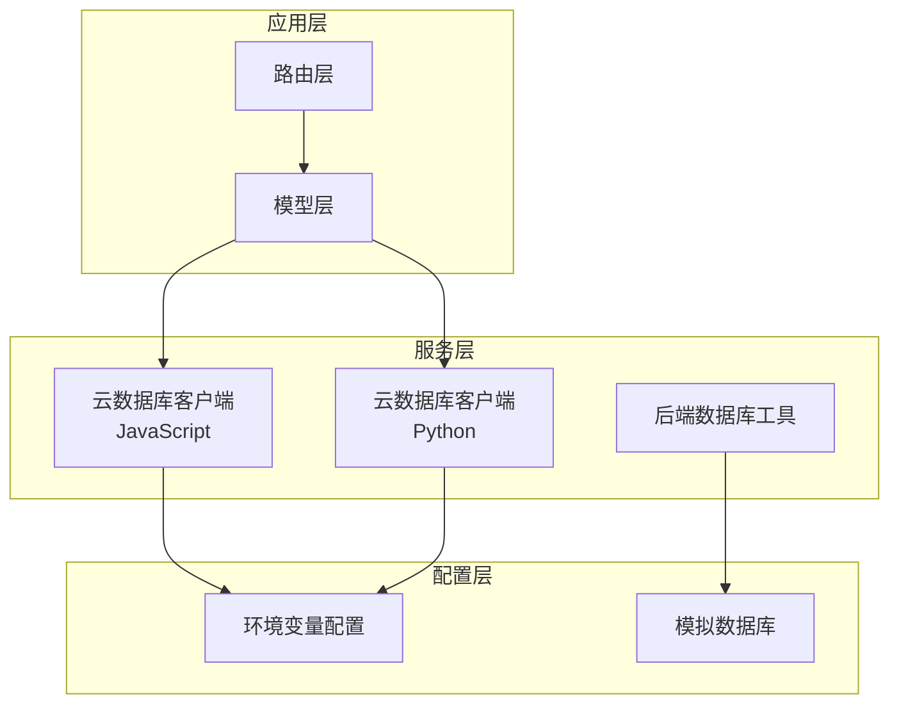

**图表来源**
- [services/cloud_db.js](file://services/cloud_db.js#L1-L327)
- [services/cloud_db.py](file://services/cloud_db.py#L1-L533)
- [models/customer.py](file://models/customer.py#L1-L300)

**章节来源**
- [services/cloud_db.js](file://services/cloud_db.js#L1-L327)
- [services/cloud_db.py](file://services/cloud_db.py#L1-L533)

## 核心组件

### 云数据库客户端

系统提供了两个版本的云数据库客户端，分别针对JavaScript和Python环境：

#### JavaScript版本 (Node.js)
- **类名**: CloudDbClient
- **核心功能**: 
  - 访问令牌管理
  - 请求重试机制
  - 并发请求控制
  - SQL查询构建
  - 批量操作支持

#### Python版本 (Flask)
- **类名**: CloudDbClient
- **核心功能**:
  - 线程安全的访问令牌管理
  - 连接池优化
  - 异步并发处理
  - 错误处理和重试
  - 批量Upsert操作

**章节来源**
- [services/cloud_db.js](file://services/cloud_db.js#L7-L327)
- [services/cloud_db.py](file://services/cloud_db.py#L108-L533)

## 架构概览

系统采用分层架构设计，实现了云数据库操作的统一抽象：

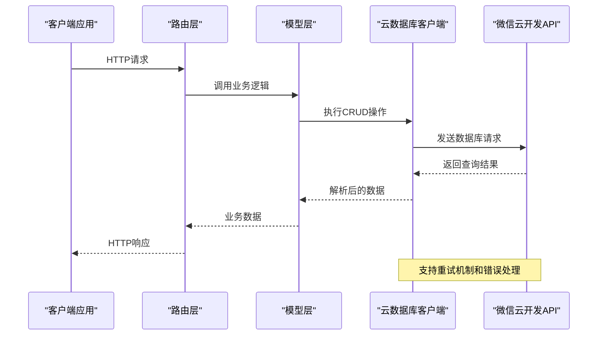

**图表来源**
- [routes/customer.py](file://routes/customer.py#L26-L172)
- [models/customer.py](file://models/customer.py#L23-L64)
- [services/cloud_db.js](file://services/cloud_db.js#L106-L139)

## 详细组件分析

### 查询操作实现

#### JavaScript版本查询实现

查询操作通过动态构建Tencent Cloud Database (TCB)查询语句：

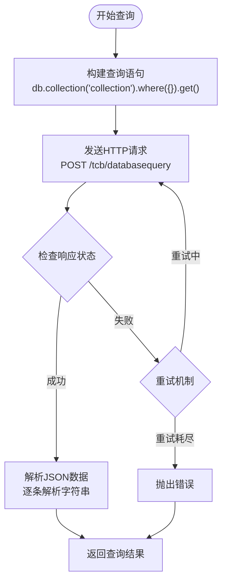

**图表来源**
- [services/cloud_db.js](file://services/cloud_db.js#L144-L153)
- [services/cloud_db.js](file://services/cloud_db.js#L106-L139)

#### Python版本查询实现

Python版本提供了更完善的错误处理和日志记录：

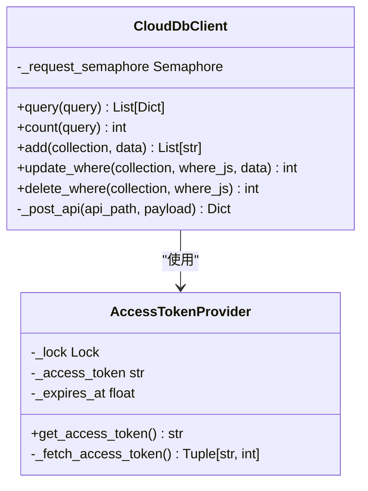

**图表来源**
- [services/cloud_db.py](file://services/cloud_db.py#L108-L533)

**章节来源**
- [services/cloud_db.js](file://services/cloud_db.js#L144-L153)
- [services/cloud_db.py](file://services/cloud_db.py#L209-L270)

### 插入操作实现

#### 数据验证机制

插入操作包含了多层数据验证：

1. **基础字段验证**: 必填字段检查
2. **唯一性约束**: 重复数据检测
3. **格式验证**: 数据类型和格式检查
4. **业务规则**: 业务逻辑验证

#### 批量插入优化

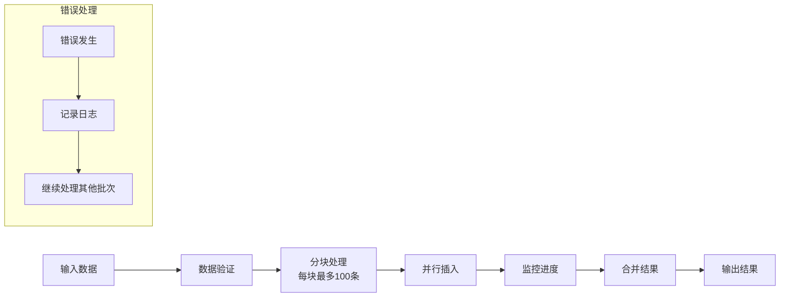

**图表来源**
- [models/customer.py](file://models/customer.py#L23-L64)
- [services/cloud_db.py](file://services/cloud_db.py#L272-L283)

**章节来源**
- [models/customer.py](file://models/customer.py#L23-L64)
- [services/cloud_db.js](file://services/cloud_db.js#L158-L162)

### 更新操作实现

#### 条件匹配策略

更新操作支持多种条件匹配方式：

1. **精确匹配**: 基于主键或唯一标识符
2. **范围查询**: 基于时间范围或其他条件
3. **组合条件**: 多条件组合查询

#### 字段更新机制

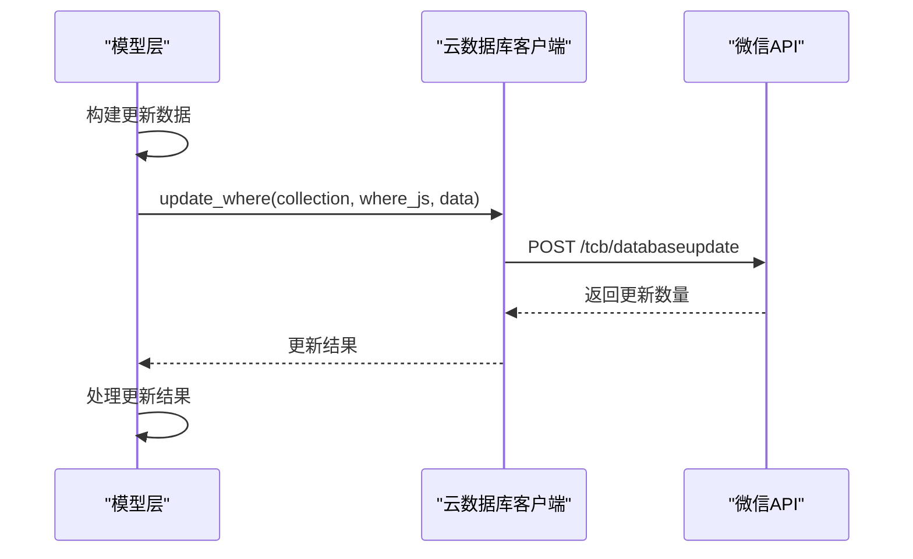

**图表来源**
- [models/customer.py](file://models/customer.py#L219-L244)
- [services/cloud_db.js](file://services/cloud_db.js#L167-L171)

**章节来源**
- [models/customer.py](file://models/customer.py#L219-L244)
- [services/cloud_db.js](file://services/cloud_db.js#L167-L171)

### 删除操作实现

#### 删除策略

系统支持多种删除策略：

1. **硬删除**: 直接从数据库中移除记录
2. **软删除**: 通过标记字段实现逻辑删除
3. **批量删除**: 支持多条记录同时删除

#### 级联删除机制

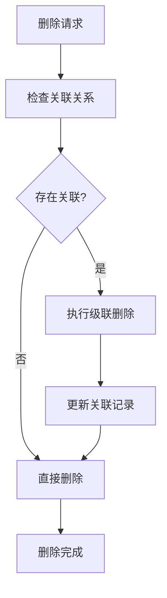

**图表来源**
- [models/customer.py](file://models/customer.py#L246-L258)

**章节来源**
- [models/customer.py](file://models/customer.py#L246-L258)

### Upsert操作实现

Upsert操作结合了插入和更新的功能：

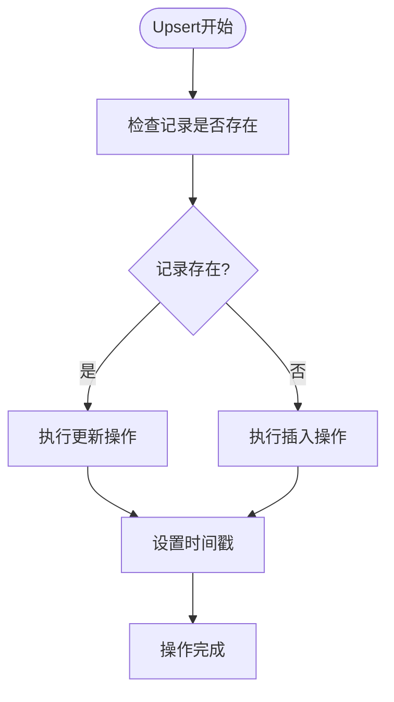

**图表来源**
- [services/cloud_db.js](file://services/cloud_db.js#L188-L222)
- [services/cloud_db.py](file://services/cloud_db.py#L305-L329)

**章节来源**
- [services/cloud_db.js](file://services/cloud_db.js#L188-L222)
- [services/cloud_db.py](file://services/cloud_db.py#L305-L329)

## 依赖关系分析

### 组件耦合度

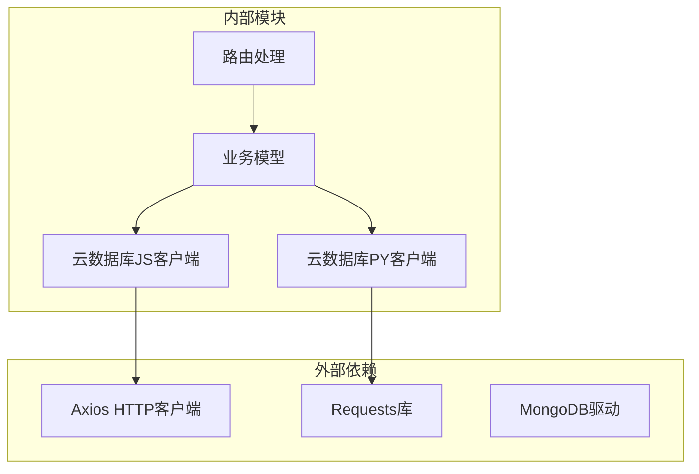

**图表来源**
- [services/cloud_db.js](file://services/cloud_db.js#L1-L3)
- [services/cloud_db.py](file://services/cloud_db.py#L10-L11)

### 错误处理机制

系统实现了多层次的错误处理：

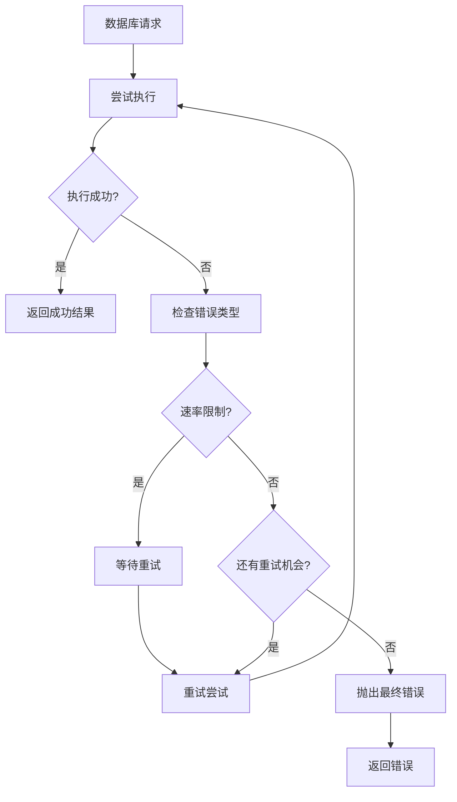

**图表来源**
- [services/cloud_db.js](file://services/cloud_db.js#L109-L139)
- [services/cloud_db.py](file://services/cloud_db.py#L491-L532)

**章节来源**
- [services/cloud_db.js](file://services/cloud_db.js#L109-L139)
- [services/cloud_db.py](file://services/cloud_db.py#L491-L532)

## 性能考虑

### 并发控制

系统实现了智能的并发控制机制：

- **JavaScript版本**: 使用信号量控制最大并发数
- **Python版本**: 使用线程信号量和连接池优化
- **默认并发**: 16个并发请求（JavaScript），64个并发请求（Python）

### 批量处理优化

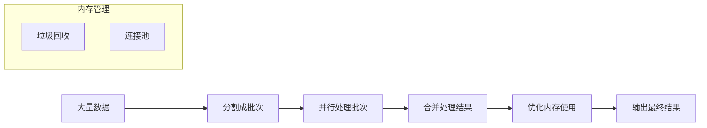

**图表来源**
- [services/cloud_db.js](file://services/cloud_db.js#L224-L314)
- [services/cloud_db.py](file://services/cloud_db.py#L331-L484)

### 缓存策略

系统支持多种缓存策略：
- **访问令牌缓存**: 避免频繁获取令牌
- **查询结果缓存**: 减少重复查询
- **连接复用**: 优化网络连接

## 故障排除指南

### 常见问题及解决方案

#### 环境配置问题

**问题**: 云数据库配置未就绪
**解决方案**: 
1. 检查环境变量是否正确设置
2. 验证微信云开发环境ID
3. 确认AppID和Secret的有效性

#### 访问令牌问题

**问题**: access_token获取失败
**解决方案**:
1. 检查网络连接
2. 验证AppID和Secret
3. 查看微信API返回的具体错误信息

#### 请求超时问题

**问题**: 数据库请求超时
**解决方案**:
1. 增加超时时间配置
2. 检查网络延迟
3. 优化查询条件

**章节来源**
- [.env](file://.env#L24-L27)
- [.env.example](file://.env.example#L33-L38)

### 错误代码对照表

| 错误代码 | 错误类型 | 可能原因 | 解决方案 |
|---------|---------|---------|---------|
| 401 | 未授权 | AppID或Secret无效 | 检查微信云开发配置 |
| 429 | 请求过于频繁 | 速率限制触发 | 降低请求频率或增加等待时间 |
| 500 | 服务器错误 | 云数据库服务异常 | 检查云数据库状态 |
| 503 | 服务不可用 | 数据库连接失败 | 检查网络连接和数据库状态 |

## 结论

本系统提供了完整的云数据库CRUD操作实现，具有以下特点：

1. **统一抽象**: JavaScript和Python版本提供一致的API接口
2. **健壮性**: 完善的错误处理和重试机制
3. **性能优化**: 智能并发控制和批量处理
4. **易用性**: 简化的查询构建和结果集处理
5. **可扩展性**: 支持自定义查询条件和批量操作

通过合理配置环境变量和遵循最佳实践，开发者可以高效地使用这套CRUD操作实现来构建稳定可靠的数据库应用。