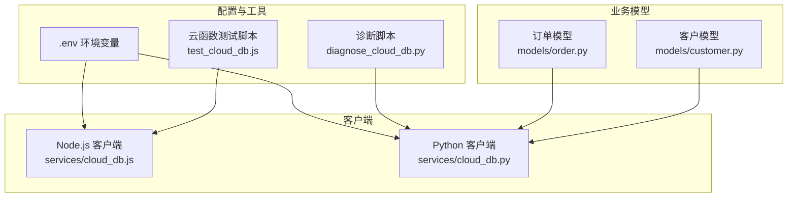
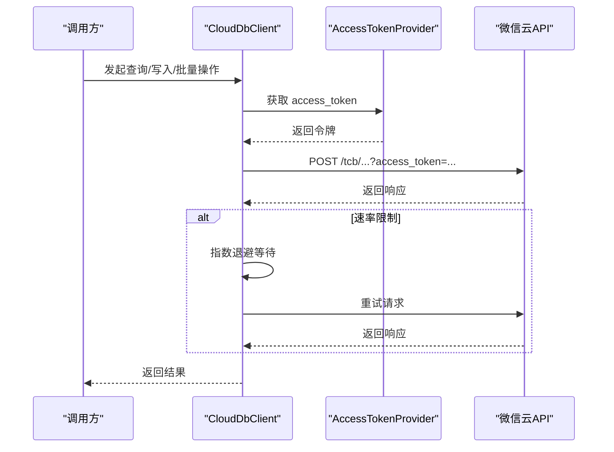
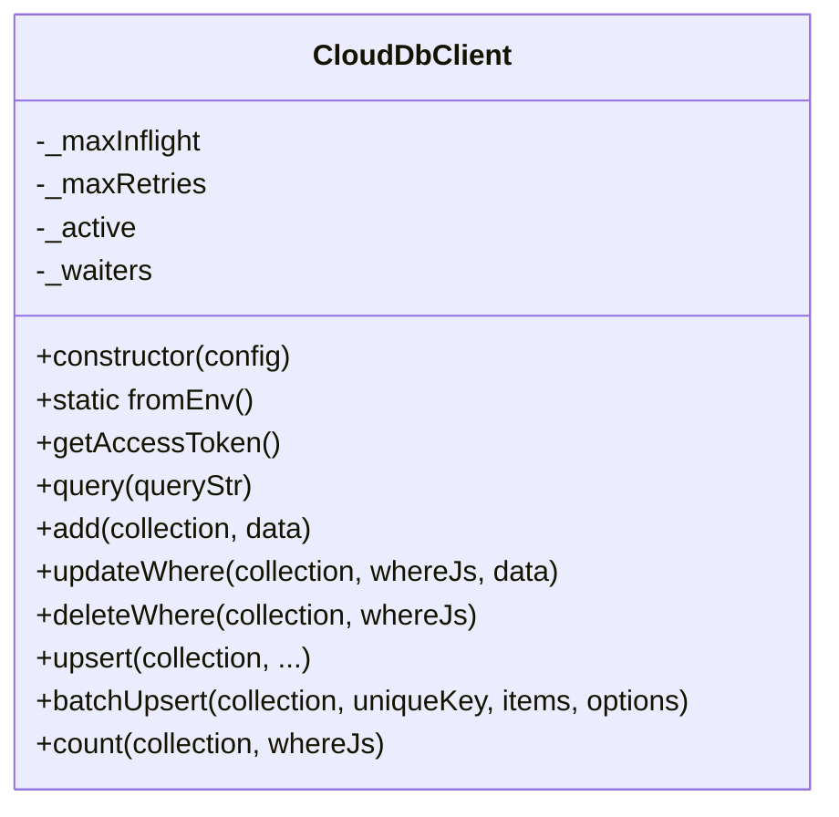
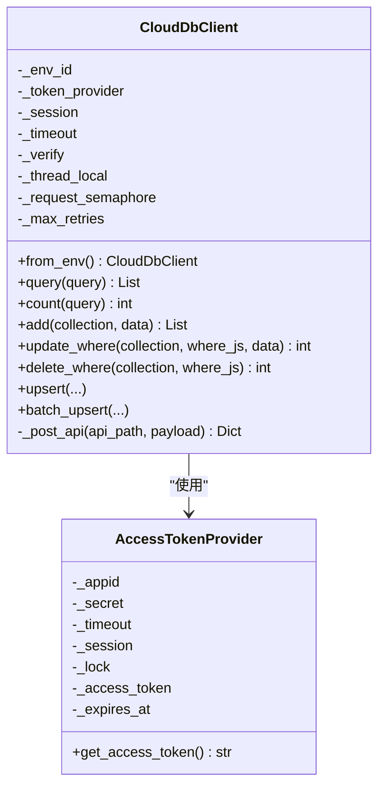
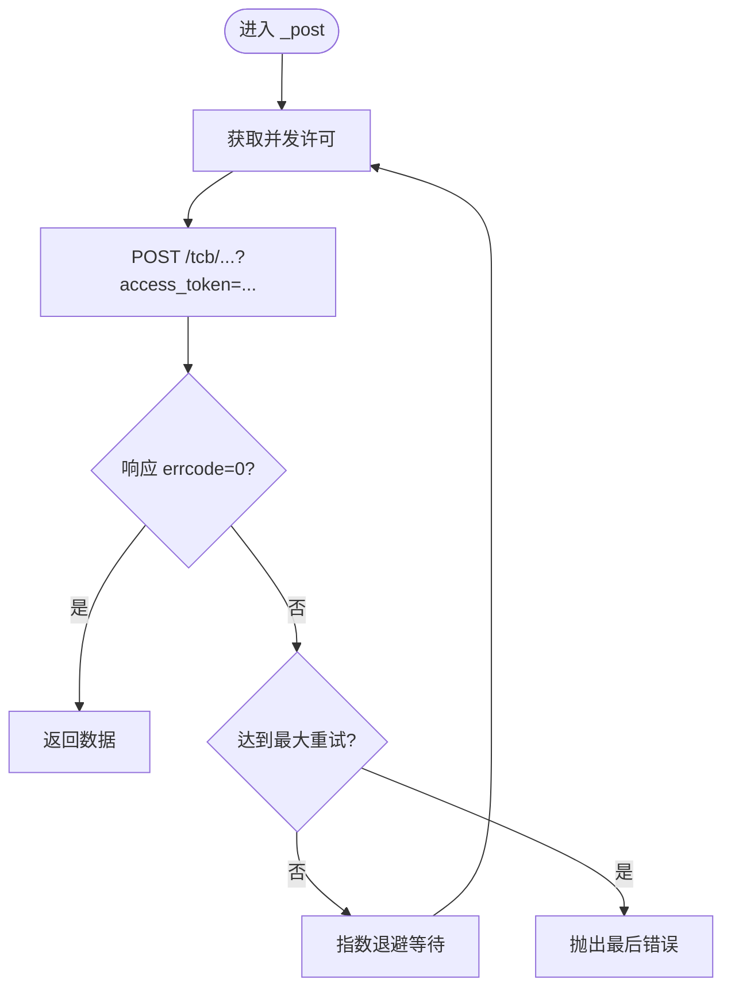
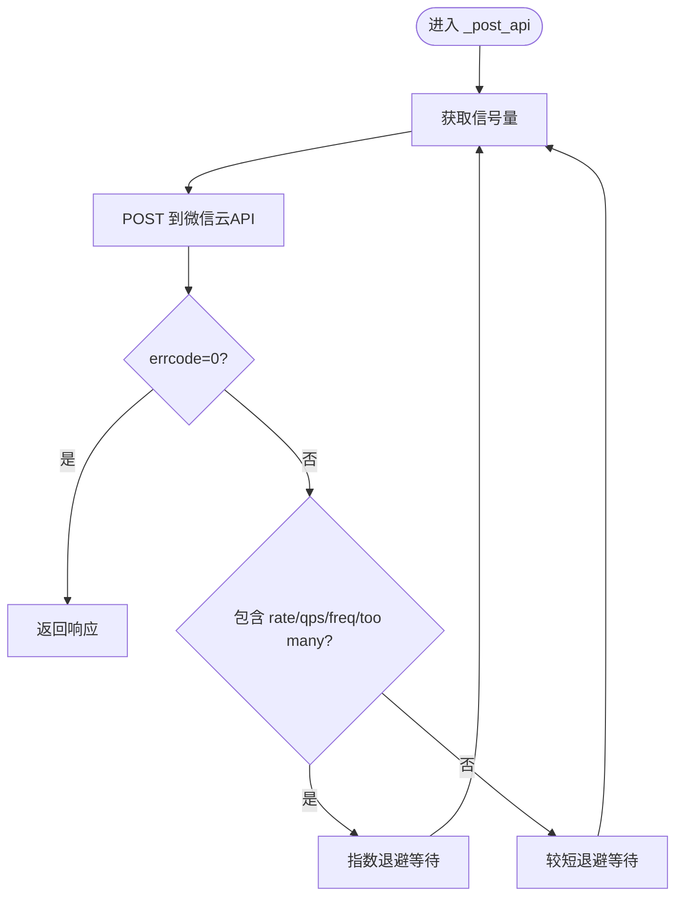
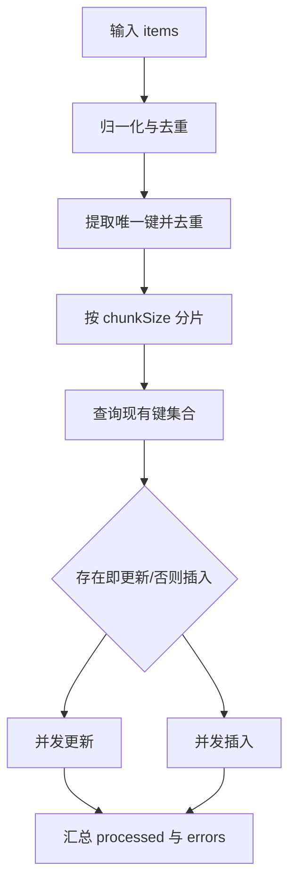
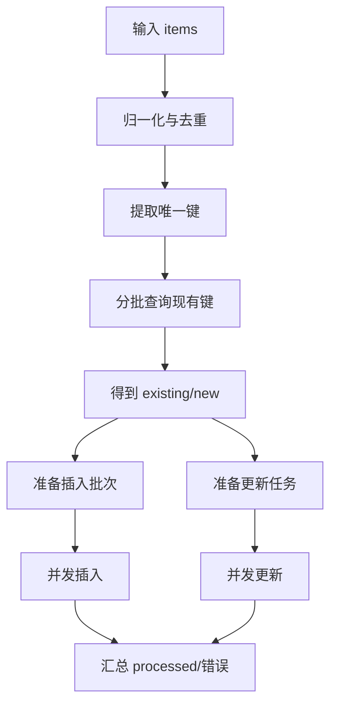
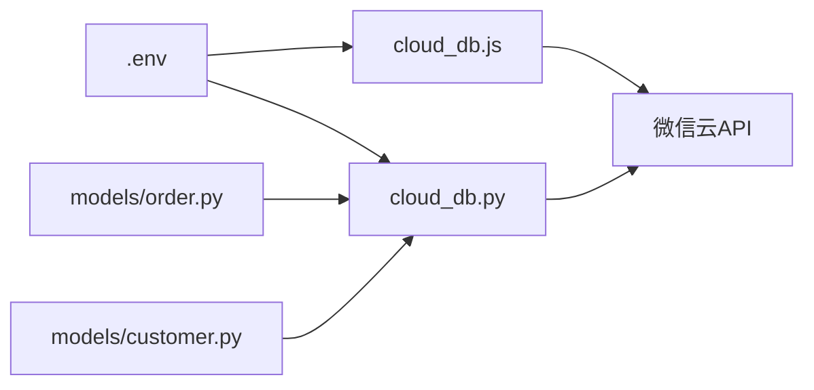

# 云数据库客户端

<cite>
**本文引用的文件**
- [services/cloud_db.js](file://services/cloud_db.js)
- [services/cloud_db.py](file://services/cloud_db.py)
- [.env](file://.env)
- [diagnose_cloud_db.py](file://diagnose_cloud_db.py)
- [test_cloud_db.js](file://test_cloud_db.js)
- [models/order.py](file://models/order.py)
- [models/customer.py](file://models/customer.py)
</cite>

## 目录
1. [简介](#简介)
2. [项目结构](#项目结构)
3. [核心组件](#核心组件)
4. [架构总览](#架构总览)
5. [详细组件分析](#详细组件分析)
6. [依赖关系分析](#依赖关系分析)
7. [性能考量](#性能考量)
8. [故障排查指南](#故障排查指南)
9. [结论](#结论)
10. [附录](#附录)

## 简介
本文件面向“云数据库客户端”的使用者与维护者，系统性阐述微信云开发数据库的客户端设计与实现，重点覆盖以下方面：
- 连接管理：环境变量加载、基础URL与超时配置、会话与连接池适配
- 访问令牌获取：AccessTokenProvider 的令牌缓存、刷新与并发安全
- 请求处理机制：API 路由封装、重试与退避、并发控制与限流
- 错误处理策略：配置错误、请求错误、资源不存在等场景
- 批量操作：upsert 与批量 upsert 的实现、分片与并发写入
- 使用示例：查询、插入、更新、删除与批量 upsert 的实践路径

## 项目结构
围绕云数据库客户端的关键文件与位置如下：
- Node.js 客户端：services/cloud_db.js
- Python 客户端：services/cloud_db.py
- 环境变量示例：.env
- 诊断脚本：diagnose_cloud_db.py
- 云函数测试脚本：test_cloud_db.js
- 业务模型对云数据库的使用：models/order.py、models/customer.py

图表来源
- [services/cloud_db.js](file://services/cloud_db.js#L1-L327)
- [services/cloud_db.py](file://services/cloud_db.py#L1-L533)
- [.env](file://.env#L1-L32)
- [diagnose_cloud_db.py](file://diagnose_cloud_db.py#L1-L101)
- [test_cloud_db.js](file://test_cloud_db.js#L1-L68)
- [models/order.py](file://models/order.py#L54-L97)
- [models/customer.py](file://models/customer.py#L120-L177)

章节来源
- [services/cloud_db.js](file://services/cloud_db.js#L1-L327)
- [services/cloud_db.py](file://services/cloud_db.py#L1-L533)
- [.env](file://.env#L1-L32)

## 核心组件
- Node.js 客户端（CloudDbClient）
  - 构造参数：envId、appId、secret、timeout
  - 环境变量加载：fromEnv() 从 WX_* 变量初始化
  - 并发控制：内部队列与最大并发限制
  - 重试机制：指数退避与速率限制识别
  - API 封装：query/add/updateWhere/deleteWhere/upsert/batchUpsert/count
- Python 客户端（CloudDbClient）
  - 构造参数：env_id、token_provider、timeout、session、verify
  - 令牌提供者：AccessTokenProvider（线程安全、过期预刷新）
  - 连接池：基于 requests.Session 与 HTTPAdapter，按并发自适应
  - 并发控制：BoundedSemaphore 控制同时请求数
  - API 封装：query/count/add/update_where/delete_where/upsert/batch_upsert/_post_api

章节来源
- [services/cloud_db.js](file://services/cloud_db.js#L7-L327)
- [services/cloud_db.py](file://services/cloud_db.py#L108-L533)

## 架构总览
微信云开发数据库 API 的调用链路在两端实现一致：均通过 access_token 获取接口获取令牌，随后拼接 envId 与查询语句，向 tcb/* 接口发起 POST 请求，并在出现 QPS/频率限制时采用指数退避重试。

图表来源
- [services/cloud_db.js](file://services/cloud_db.js#L72-L139)
- [services/cloud_db.py](file://services/cloud_db.py#L486-L532)

## 详细组件分析

### Node.js 客户端：CloudDbClient
- 初始化与环境变量加载
  - fromEnv() 从 WX_CLOUD_ENV/WX_ENV_ID、WX_APPID、WX_SECRET 加载配置；若仍为占位符则抛错
- 并发与限流
  - 内部队列与计数器控制最大并发（_maxInflight），超过时阻塞等待
  - _acquire/_release 实现轻量并发控制
- 访问令牌
  - getAccessToken() 缓存令牌并在过期前 5 分钟刷新
- 请求与重试
  - _post() 统一封装，带最大重试次数；对 rate/QPS/freq/too many 等关键词做指数退避
- API 封装
  - query/add/updateWhere/deleteWhere/count
  - upsert：支持两种签名，先查再决定插入或更新
  - batchUpsert：分片 + 并发写入，先查重再分别更新/插入，支持 chunkSize 与 writeConcurrency

图表来源
- [services/cloud_db.js](file://services/cloud_db.js#L7-L327)

章节来源
- [services/cloud_db.js](file://services/cloud_db.js#L7-L327)

### Python 客户端：CloudDbClient 与 AccessTokenProvider
- AccessTokenProvider
  - 线程锁保护令牌状态；预刷新窗口减少抖动
  - 三段式重试与指数退避
- CloudDbClient
  - Session + HTTPAdapter：按并发数设置连接池大小，避免阻塞
  - BoundedSemaphore：全局并发上限
  - _post_api()：统一请求入口，处理 errcode、集合不存在等错误
  - API 封装：query/count/add/update_where/delete_where/upsert/batch_upsert

图表来源
- [services/cloud_db.py](file://services/cloud_db.py#L36-L139)
- [services/cloud_db.py](file://services/cloud_db.py#L108-L533)

章节来源
- [services/cloud_db.py](file://services/cloud_db.py#L36-L139)
- [services/cloud_db.py](file://services/cloud_db.py#L108-L533)

### 请求处理与重试机制（Node.js）

图表来源
- [services/cloud_db.js](file://services/cloud_db.js#L106-L139)

章节来源
- [services/cloud_db.js](file://services/cloud_db.js#L106-L139)

### 请求处理与重试机制（Python）

图表来源
- [services/cloud_db.py](file://services/cloud_db.py#L486-L532)

章节来源
- [services/cloud_db.py](file://services/cloud_db.py#L486-L532)

### 批量 upsert（Node.js）
- 输入归一化：去除非对象、缺失唯一键、唯一键转字符串
- 分片：按 chunkSize 切分键集合
- 并发写入：withConcurrency 控制写入并发
- 先查重：查询现有键集合，区分新增与更新
- 更新/插入：更新时去除 _id，插入时补齐时间戳字段

图表来源
- [services/cloud_db.js](file://services/cloud_db.js#L224-L314)

章节来源
- [services/cloud_db.js](file://services/cloud_db.js#L224-L314)

### 批量 upsert（Python）
- 归一化与去重：同 Node.js
- 查询现有键：分批查询（每批最多 100），使用线程池并发
- 插入批次：每批最多 100，线程池并发
- 更新任务：逐条更新，记录错误
- 收敛：汇总 processed 与 errors

图表来源
- [services/cloud_db.py](file://services/cloud_db.py#L331-L484)

章节来源
- [services/cloud_db.py](file://services/cloud_db.py#L331-L484)

## 依赖关系分析
- Node.js 客户端依赖 axios 与 crypto，使用进程环境变量进行初始化
- Python 客户端依赖 requests、concurrent.futures、threading，使用 requests.Session 与 HTTPAdapter 进行连接池配置
- 业务模型（订单、客户）通过 cloud_db.py 的客户端封装调用云数据库 API

图表来源
- [.env](file://.env#L24-L27)
- [services/cloud_db.js](file://services/cloud_db.js#L27-L37)
- [services/cloud_db.py](file://services/cloud_db.py#L162-L207)
- [models/order.py](file://models/order.py#L54-L97)
- [models/customer.py](file://models/customer.py#L120-L177)

章节来源
- [.env](file://.env#L24-L27)
- [services/cloud_db.js](file://services/cloud_db.js#L27-L37)
- [services/cloud_db.py](file://services/cloud_db.py#L162-L207)
- [models/order.py](file://models/order.py#L54-L97)
- [models/customer.py](file://models/customer.py#L120-L177)

## 性能考量
- 并发控制
  - Node.js：内部队列 + 最大并发限制，避免过度竞争
  - Python：BoundedSemaphore 控制全局并发，连接池大小与并发数匹配
- 连接池
  - Python：通过 HTTPAdapter 设置 pool_connections/pool_maxsize，提升吞吐
- 重试与退避
  - 识别速率限制关键词，采用指数退避，降低雪崩风险
- 批量写入
  - 分片 + 并发写入，减少单次请求负载
- 字段处理
  - upsert 自动补齐 created_at/updated_at，避免重复 _id 导致写入失败

[本节为通用性能建议，不直接分析具体文件]

## 故障排查指南
- 环境变量检查
  - 确认 WX_CLOUD_ENV、WX_APPID、WX_SECRET 已正确设置且非占位符
  - 可使用诊断脚本加载 .env 并打印变量状态
- 初始化失败
  - from_env() 在变量缺失或占位符时抛出配置错误
- 查询异常
  - 若返回集合不存在，客户端会记录警告并返回空结果或 0
- 速率限制
  - 客户端自动指数退避重试；如仍失败，检查并发与 chunkSize 配置
- SSL 校验
  - Python 客户端支持 WX_VERIFY_SSL 控制证书校验

章节来源
- [diagnose_cloud_db.py](file://diagnose_cloud_db.py#L31-L69)
- [services/cloud_db.py](file://services/cloud_db.py#L162-L207)
- [services/cloud_db.py](file://services/cloud_db.py#L209-L270)
- [services/cloud_db.js](file://services/cloud_db.js#L27-L37)

## 结论
本项目提供了跨语言的云数据库客户端实现，具备完善的令牌缓存与刷新、并发控制、重试与退避、以及批量 upsert 能力。通过环境变量驱动的初始化与诊断脚本，能够快速定位配置问题。业务模型层以一致的 API 封装对接云数据库，便于扩展与维护。

[本节为总结性内容，不直接分析具体文件]

## 附录

### 使用示例（路径指引）
- Node.js 客户端
  - 初始化：参考 [services/cloud_db.js](file://services/cloud_db.js#L27-L37)
  - 查询：参考 [services/cloud_db.js](file://services/cloud_db.js#L144-L153)
  - 插入：参考 [services/cloud_db.js](file://services/cloud_db.js#L158-L162)
  - 更新：参考 [services/cloud_db.js](file://services/cloud_db.js#L167-L171)
  - 删除：参考 [services/cloud_db.js](file://services/cloud_db.js#L176-L180)
  - upsert：参考 [services/cloud_db.js](file://services/cloud_db.js#L188-L222)
  - 批量 upsert：参考 [services/cloud_db.js](file://services/cloud_db.js#L224-L314)
- Python 客户端
  - 初始化：参考 [services/cloud_db.py](file://services/cloud_db.py#L162-L207)
  - 查询：参考 [services/cloud_db.py](file://services/cloud_db.py#L209-L248)
  - 插入：参考 [services/cloud_db.py](file://services/cloud_db.py#L272-L284)
  - 更新：参考 [services/cloud_db.py](file://services/cloud_db.py#L285-L294)
  - 删除：参考 [services/cloud_db.py](file://services/cloud_db.py#L296-L303)
  - upsert：参考 [services/cloud_db.py](file://services/cloud_db.py#L305-L329)
  - 批量 upsert：参考 [services/cloud_db.py](file://services/cloud_db.py#L331-L484)
- 业务模型使用
  - 订单查询与更新：参考 [models/order.py](file://models/order.py#L54-L97)
  - 客户查询与更新：参考 [models/customer.py](file://models/customer.py#L120-L177)
- 云函数测试
  - 参考 [test_cloud_db.js](file://test_cloud_db.js#L1-L68)

章节来源
- [services/cloud_db.js](file://services/cloud_db.js#L27-L327)
- [services/cloud_db.py](file://services/cloud_db.py#L162-L533)
- [models/order.py](file://models/order.py#L54-L97)
- [models/customer.py](file://models/customer.py#L120-L177)
- [test_cloud_db.js](file://test_cloud_db.js#L1-L68)