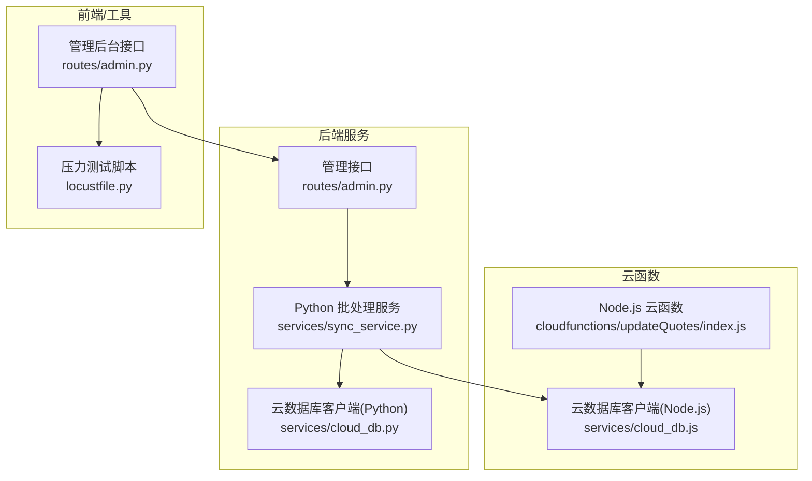
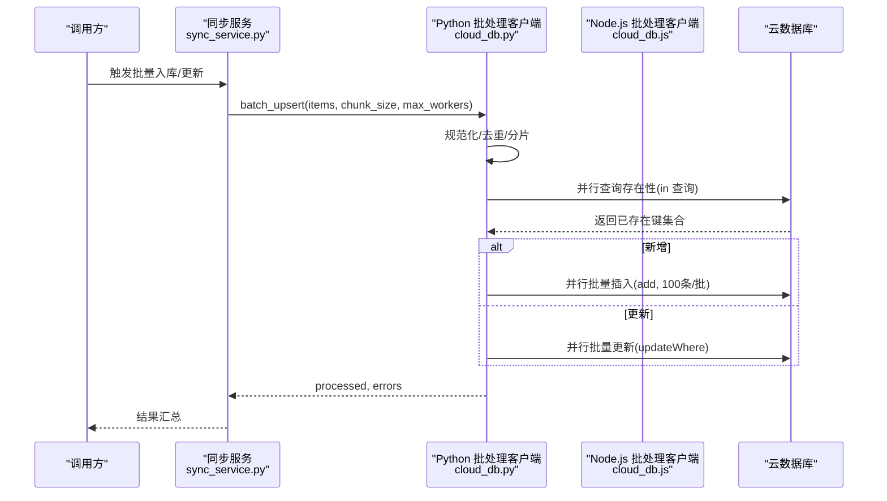
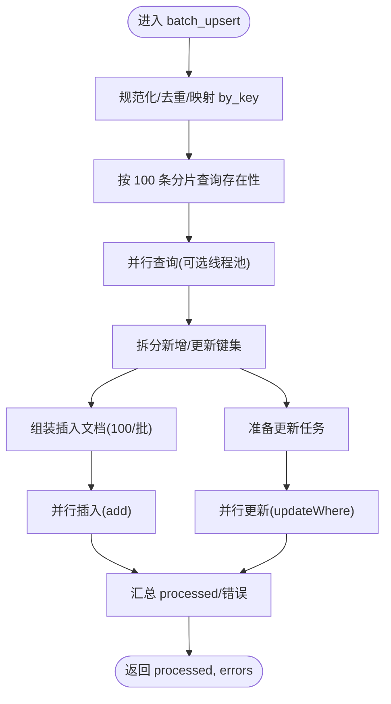
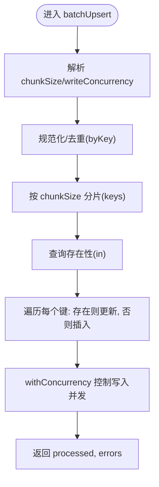
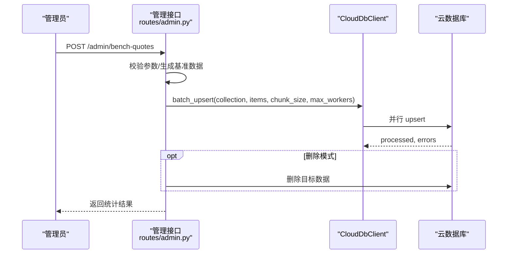
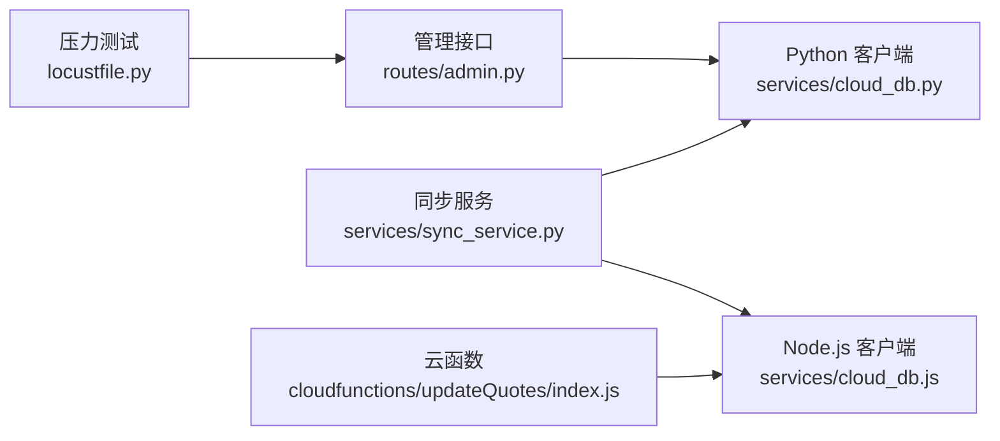

# 批量操作处理

<cite>
**本文引用的文件**
- [services/cloud_db.py](file://services/cloud_db.py)
- [services/cloud_db.js](file://services/cloud_db.js)
- [routes/admin.py](file://routes/admin.py)
- [services/sync_service.py](file://services/sync_service.py)
- [cloudfunctions/updateQuotes/index.js](file://cloudfunctions/updateQuotes/index.js)
- [backup_nodejs/app.js](file://backup_nodejs/app.js)
- [locustfile.py](file://locustfile.py)
</cite>

## 目录
1. [简介](#简介)
2. [项目结构](#项目结构)
3. [核心组件](#核心组件)
4. [架构总览](#架构总览)
5. [详细组件分析](#详细组件分析)
6. [依赖关系分析](#依赖关系分析)
7. [性能考量](#性能考量)
8. [故障排查指南](#故障排查指南)
9. [结论](#结论)
10. [附录](#附录)

## 简介
本文件系统性阐述云数据库批量操作的实现架构与优化策略，覆盖批量插入、批量更新与批量删除的全流程设计，并对并行处理机制、线程池配置、任务分片策略、性能优化、内存管理与错误处理进行深入解析。同时给出配置参数、限制条件与最佳实践，辅以使用示例与性能测试方法，帮助开发者高效、稳定地使用批量操作功能。

## 项目结构
批量操作相关能力横跨后端 Python 服务、Node.js 云函数与前端管理接口，形成“爬取/解析 → 批量入库/更新 → 删除清理”的闭环。

图表来源
- [services/sync_service.py](file://services/sync_service.py#L72-L200)
- [routes/admin.py](file://routes/admin.py#L404-L508)
- [services/cloud_db.py](file://services/cloud_db.py#L331-L484)
- [services/cloud_db.js](file://services/cloud_db.js#L224-L314)
- [cloudfunctions/updateQuotes/index.js](file://cloudfunctions/updateQuotes/index.js#L95-L180)
- [locustfile.py](file://locustfile.py#L1-L38)

章节来源
- [services/sync_service.py](file://services/sync_service.py#L72-L200)
- [routes/admin.py](file://routes/admin.py#L404-L508)
- [services/cloud_db.py](file://services/cloud_db.py#L331-L484)
- [services/cloud_db.js](file://services/cloud_db.js#L224-L314)
- [cloudfunctions/updateQuotes/index.js](file://cloudfunctions/updateQuotes/index.js#L95-L180)
- [locustfile.py](file://locustfile.py#L1-L38)

## 核心组件
- 批量 Upsert 客户端（Python）：提供并行查询、分片、插入与更新的统一入口，支持线程池与信号量限流。
- 批量 Upsert 客户端（Node.js）：提供基于并发池的任务调度与写入，支持按批查询存在性并选择插入或更新。
- 管理接口基准测试：提供 upsert/delete/roundtrip 模式对比，支持多并发 Worker 对比。
- 同步服务：封装爬取、清洗、去重与批量入库流程，直接调用批量 Upsert。
- 云函数批量行情更新：分页读取、分批抓取、并发写库，避免 OOM。
- 压力测试：Locust 脚本用于模拟负载场景。

章节来源
- [services/cloud_db.py](file://services/cloud_db.py#L331-L484)
- [services/cloud_db.js](file://services/cloud_db.js#L224-L314)
- [routes/admin.py](file://routes/admin.py#L404-L508)
- [services/sync_service.py](file://services/sync_service.py#L72-L200)
- [cloudfunctions/updateQuotes/index.js](file://cloudfunctions/updateQuotes/index.js#L95-L180)
- [locustfile.py](file://locustfile.py#L1-L38)

## 架构总览
批量操作整体流程分为“准备阶段（分片/去重/规范化）→ 并行查询存在性 → 插入/更新 → 统计与错误收集”。Python 侧通过线程池与信号量控制并发，Node.js 侧通过自定义并发池与请求限流保障稳定性。

图表来源
- [services/sync_service.py](file://services/sync_service.py#L155-L163)
- [services/cloud_db.py](file://services/cloud_db.py#L331-L484)

章节来源
- [services/sync_service.py](file://services/sync_service.py#L155-L163)
- [services/cloud_db.py](file://services/cloud_db.py#L331-L484)

## 详细组件分析

### Python 批量 Upsert 客户端（CloudDbClient.batch_upsert）
- 规范化与去重：按 unique_key 规范化键值，构建 by_key 映射，保证唯一性。
- 分片策略：查询分片（100/批）与写入分片（插入 100/批）。
- 并行机制：可选线程池（max_workers），查询与写入均支持并发；写入阶段分别维护插入与更新任务列表。
- 错误处理：静默查询错误（假设不存在），写入阶段捕获异常并记录错误明细。
- 限流与稳定性：请求信号量与连接池大小由环境变量控制，默认并发提升以适配全量行情同步。

图表来源
- [services/cloud_db.py](file://services/cloud_db.py#L331-L484)

章节来源
- [services/cloud_db.py](file://services/cloud_db.py#L331-L484)

### Node.js 批量 Upsert 客户端（CloudDbClient.batchUpsert）
- 参数优先级：options.chunkSize > options.chunk_size > 环境变量 WX_DB_CHUNK_SIZE > 默认 50；并发写入数同理。
- 并发池：withConcurrency 控制写入并发，按批长度与并发上限取最小值。
- 存在性判断：一次性 in 查询返回已存在键集合，决定更新或插入。
- 插入/更新策略：若更新返回 0，则尝试插入；插入时自动补齐 created_at/updated_at。

图表来源
- [services/cloud_db.js](file://services/cloud_db.js#L224-L314)

章节来源
- [services/cloud_db.js](file://services/cloud_db.js#L224-L314)

### 管理接口基准测试（routes/admin.py）
- 接口支持 upsert/delete/roundtrip 三种模式，可选是否对比基线与目标并发。
- 自动生成基准数据集（BENCH_ 前缀），支持指定 chunkSize 与 maxWorkers。
- 统计 upsertMs/deleteMs/totalMs，返回 processed/deleted/errors 等指标。

图表来源
- [routes/admin.py](file://routes/admin.py#L404-L508)

章节来源
- [routes/admin.py](file://routes/admin.py#L404-L508)

### 同步服务（services/sync_service.py）
- 爬取与清洗：封装爬虫、去重、清洗流程，生成标准化文档。
- 批量入库：直接调用 CloudDbClient.batch_upsert，内部自行管理分片与并发。
- 日志记录：入库完成后写入 sync_logs 集合，便于审计与追踪。

章节来源
- [services/sync_service.py](file://services/sync_service.py#L72-L200)
- [services/sync_service.py](file://services/sync_service.py#L424-L474)

### 云函数批量行情更新（cloudfunctions/updateQuotes/index.js）
- 流式 Pipeline：按固定页大小分页读取，处理完即释放内存。
- 分批抓取：每页内按固定批次大小并发抓取新浪行情。
- 并发写库：使用自定义并发池，提高写入吞吐，满足分钟级目标。

章节来源
- [cloudfunctions/updateQuotes/index.js](file://cloudfunctions/updateQuotes/index.js#L95-L180)

### Node.js 备用实现（backup_nodejs/app.js）
- 参数校验：count/chunkSize/maxWorkers/mode 的范围与类型校验。
- 模式支持：upsert/delete/roundtrip，便于外部工具或脚本进行批量操作验证。

章节来源
- [backup_nodejs/app.js](file://backup_nodejs/app.js#L1024-L1045)

## 依赖关系分析
- Python 批处理客户端依赖微信云开发 API，通过 access_token 获取与请求重试、QPS 限流。
- Node.js 批处理客户端依赖 axios，通过 acquire/release 机制控制并发。
- 管理接口依赖 Python 批处理客户端，提供基准测试与删除清理能力。
- 同步服务串联爬取、清洗与批量入库，直接复用批处理客户端。
- 云函数独立于后端服务，直接对接云数据库，采用分页+并发写入策略。

图表来源
- [routes/admin.py](file://routes/admin.py#L404-L508)
- [services/sync_service.py](file://services/sync_service.py#L155-L163)
- [services/cloud_db.py](file://services/cloud_db.py#L331-L484)
- [services/cloud_db.js](file://services/cloud_db.js#L224-L314)
- [cloudfunctions/updateQuotes/index.js](file://cloudfunctions/updateQuotes/index.js#L95-L180)
- [locustfile.py](file://locustfile.py#L1-L38)

章节来源
- [routes/admin.py](file://routes/admin.py#L404-L508)
- [services/sync_service.py](file://services/sync_service.py#L155-L163)
- [services/cloud_db.py](file://services/cloud_db.py#L331-L484)
- [services/cloud_db.js](file://services/cloud_db.js#L224-L314)
- [cloudfunctions/updateQuotes/index.js](file://cloudfunctions/updateQuotes/index.js#L95-L180)
- [locustfile.py](file://locustfile.py#L1-L38)

## 性能考量
- 并发与限流
  - Python：请求信号量与连接池大小由环境变量 WX_DB_MAX_INFLIGHT 控制，默认提升并发；写入并发由 WX_DB_MAX_WORKERS 控制。
  - Node.js：通过 acquire/release 与自定义并发池控制写入并发，避免突发写入导致限流。
- 分片与批大小
  - 查询分片：100/批，降低单次 in 查询复杂度。
  - 写入分片：插入 100/批，更新按批并发执行。
  - 可配置：chunkSize 与 writeConcurrency 通过 options 或环境变量设置。
- 内存管理
  - 云函数采用分页读取与“处理完即释放”策略，避免 OOM。
  - 管理接口基准测试生成临时基准数据，避免持久化污染。
- 错误与重试
  - Python 客户端内置指数退避与抖动，针对 QPS/频率限制进行自适应等待。
  - Node.js 客户端对 rate/QPS 等关键字进行差异化退避。
- 压测与验证
  - 管理接口提供 upsert/delete/roundtrip 模式对比，支持多 Worker 对比。
  - Locust 脚本用于模拟真实负载，辅助评估系统在不同并发下的表现。

章节来源
- [services/cloud_db.py](file://services/cloud_db.py#L141-L160)
- [services/cloud_db.py](file://services/cloud_db.py#L362-L378)
- [services/cloud_db.js](file://services/cloud_db.js#L39-L51)
- [services/cloud_db.js](file://services/cloud_db.js#L109-L138)
- [cloudfunctions/updateQuotes/index.js](file://cloudfunctions/updateQuotes/index.js#L101-L163)
- [routes/admin.py](file://routes/admin.py#L404-L508)
- [locustfile.py](file://locustfile.py#L1-L38)

## 故障排查指南
- 配置错误
  - Python 客户端：WX_CLOUD_ENV/WX_APPID/WX_SECRET 缺失或为空会导致配置错误。
  - Node.js 客户端：WX_CLOUD_ENV/WX_APPID/WX_SECRET 缺失或仍为占位符会抛错。
- 请求失败与限流
  - Python 客户端：errcode 非 0 或集合不存在会抛出请求错误；对 rate/QPS 关键词进行指数退避。
  - Node.js 客户端：errcode 非 0 抛错；对 rate/QPS 关键词进行退避。
- 并发过高
  - 调整 WX_DB_MAX_INFLIGHT 与 WX_DB_MAX_WORKERS，观察 upsertMs 与错误率变化。
- 写入异常
  - 检查 unique_key 是否规范（字符串化），是否存在 _id 字段冲突。
  - 管理接口返回的 errors 列表可用于定位具体键值与错误信息。
- 删除异常
  - 删除接口按 500 条/批进行，若无进展可适当减小批大小或增加并发。

章节来源
- [services/cloud_db.py](file://services/cloud_db.py#L197-L207)
- [services/cloud_db.py](file://services/cloud_db.py#L512-L532)
- [services/cloud_db.js](file://services/cloud_db.js#L32-L36)
- [services/cloud_db.js](file://services/cloud_db.js#L117-L138)
- [routes/admin.py](file://routes/admin.py#L470-L478)
- [services/sync_service.py](file://services/sync_service.py#L495-L506)

## 结论
本项目通过 Python 与 Node.js 两端的批量 Upsert 客户端，结合管理接口基准测试与云函数分页并发写入策略，形成了高并发、低内存占用、强容错的批量操作体系。通过合理的分片、并发与限流策略，可在保证稳定性的同时最大化吞吐。建议在生产环境中结合压测结果动态调整 chunkSize 与并发参数，并持续监控错误率与延迟。

## 附录

### 配置参数与限制条件
- Python 客户端
  - WX_DB_MAX_INFLIGHT：最大并发请求数（默认 64，可调高以适配全量行情同步）
  - WX_DB_MAX_WORKERS：批量 Upsert 写入并发（默认 32）
  - WX_DB_MAX_RETRIES：请求重试次数（默认 3）
  - WX_DB_CHUNK_SIZE：批量 Upsert 分片大小（默认 50）
- Node.js 客户端
  - WX_DB_MAX_INFLIGHT：最大并发请求数（默认 16）
  - WX_DB_MAX_WORKERS/WX_CLOUD_MAX_WORKERS：写入并发（默认 8）
  - WX_DB_CHUNK_SIZE：分片大小（默认 50）
- 管理接口基准测试
  - count：1-20000
  - chunkSize：1-200
  - maxWorkers：正整数
  - mode：upsert/delete/roundtrip
- 云函数
  - PAGE_SIZE：200
  - FETCH_BATCH：50
  - 写并发：50

章节来源
- [services/cloud_db.py](file://services/cloud_db.py#L141-L160)
- [services/cloud_db.py](file://services/cloud_db.py#L362-L378)
- [services/cloud_db.js](file://services/cloud_db.js#L39-L51)
- [routes/admin.py](file://routes/admin.py#L414-L431)
- [cloudfunctions/updateQuotes/index.js](file://cloudfunctions/updateQuotes/index.js#L106-L161)

### 使用示例与最佳实践
- 使用管理接口进行基准测试
  - POST /admin/bench-quotes，传入 count、chunkSize、maxWorkers、mode，获取 upsertMs/deleteMs/totalMs 与 processed/deleted/errors。
- 在同步服务中使用批量 Upsert
  - 调用 sync_service.py 的 upsert 流程，内部会按 WX_DB_UPSERT_CHUNK_SIZE 分片并调用 batch_upsert。
- 云函数批量更新
  - 采用分页读取、分批抓取、并发写入策略，避免 OOM 与超时。
- 最佳实践
  - 先小规模压测，逐步增大 chunkSize 与并发，观察错误率与延迟。
  - 对高频写入场景，适当提高 WX_DB_MAX_INFLIGHT 与并发，但需关注平台 QPS 限制。
  - 对唯一键不规范的数据，提前清洗并字符串化 unique_key，避免插入/更新失败。
  - 删除操作建议分批执行并配合进度回调，便于可观测与恢复。

章节来源
- [routes/admin.py](file://routes/admin.py#L404-L508)
- [services/sync_service.py](file://services/sync_service.py#L155-L163)
- [cloudfunctions/updateQuotes/index.js](file://cloudfunctions/updateQuotes/index.js#L101-L163)