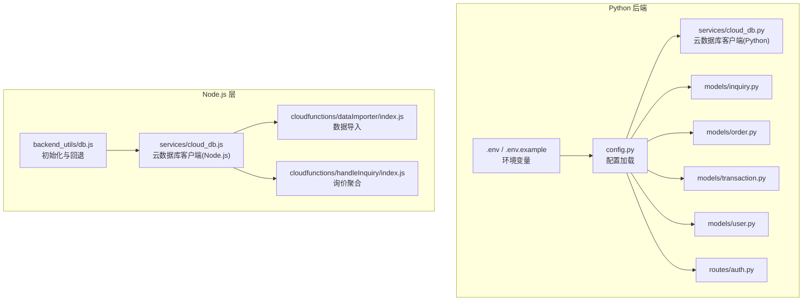
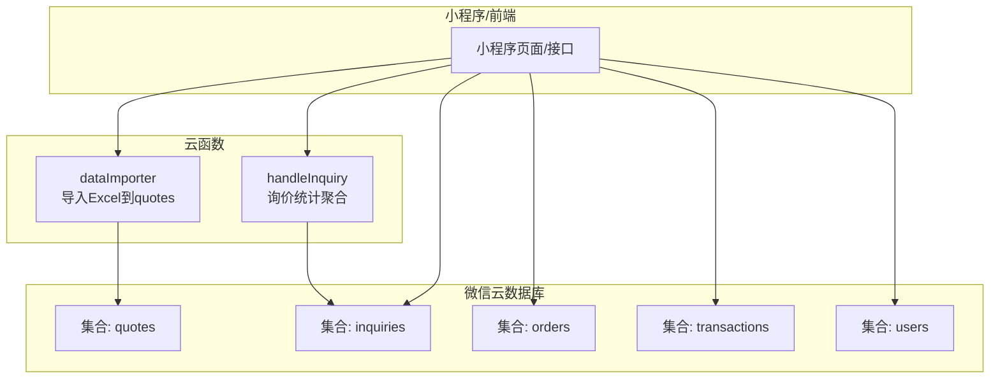
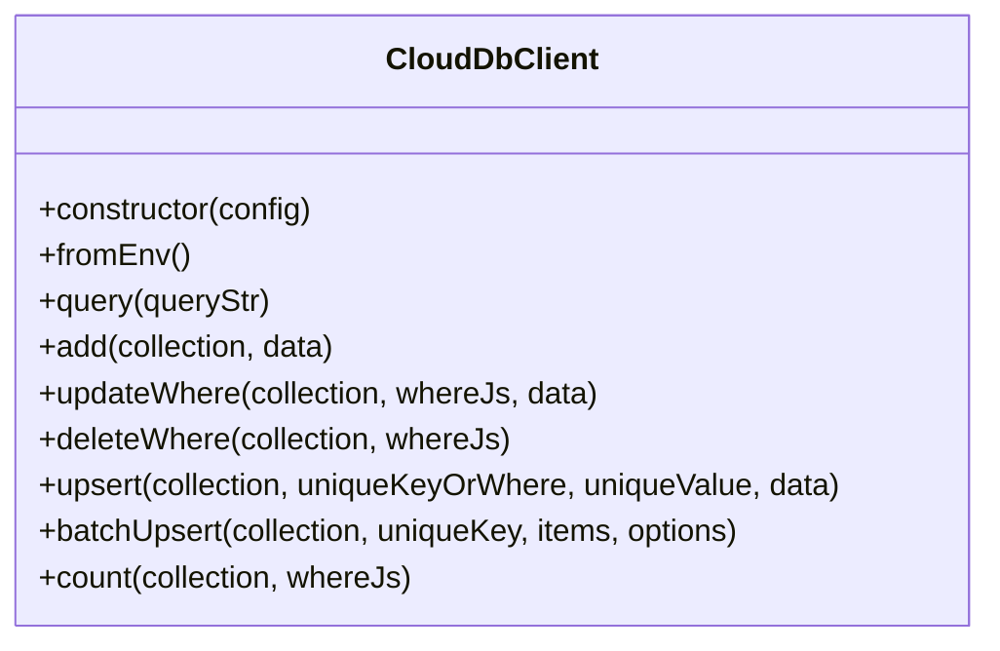
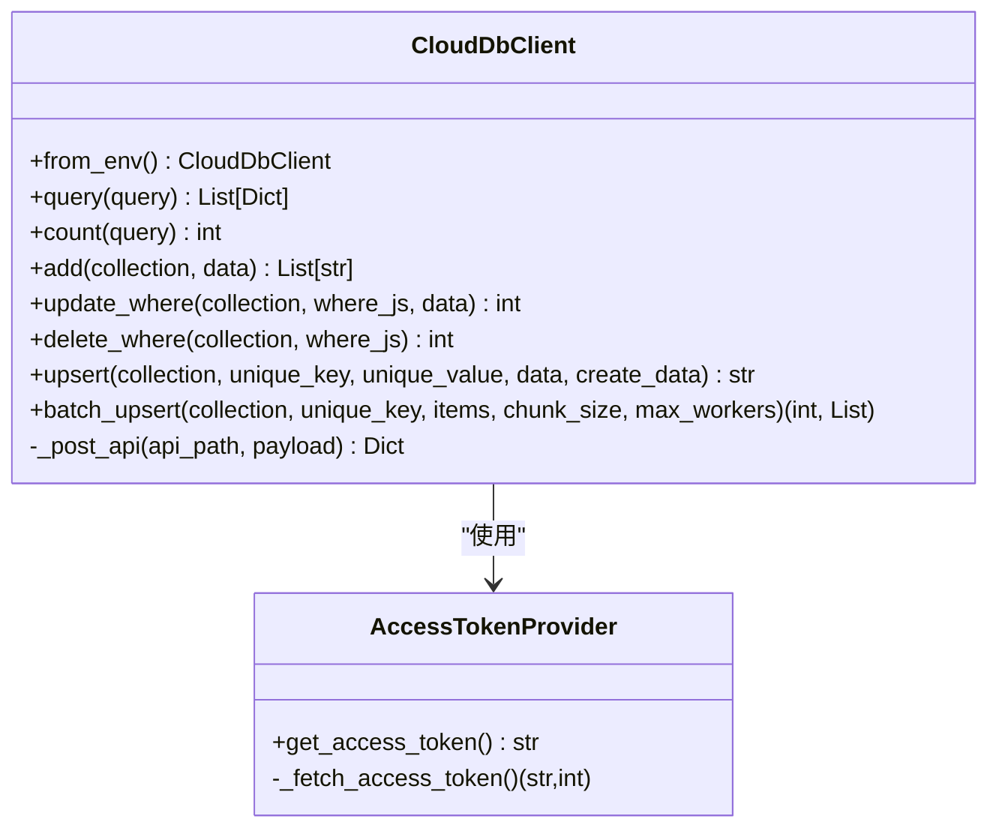
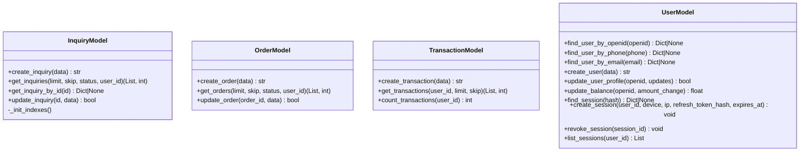
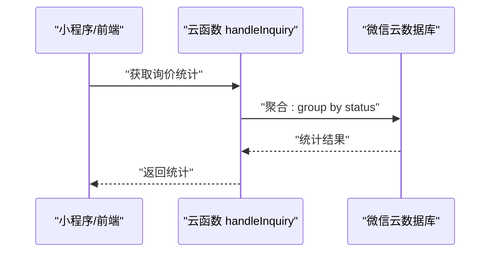
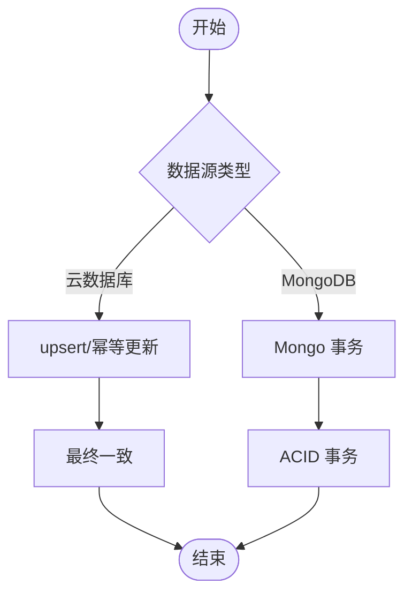
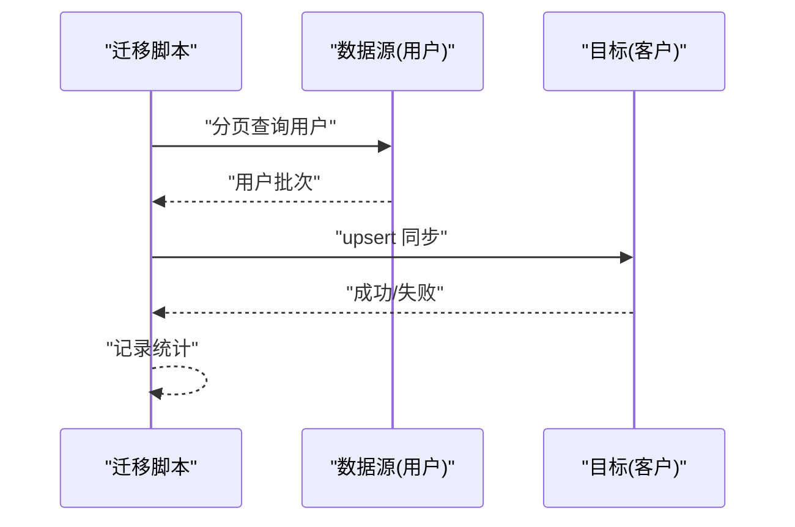
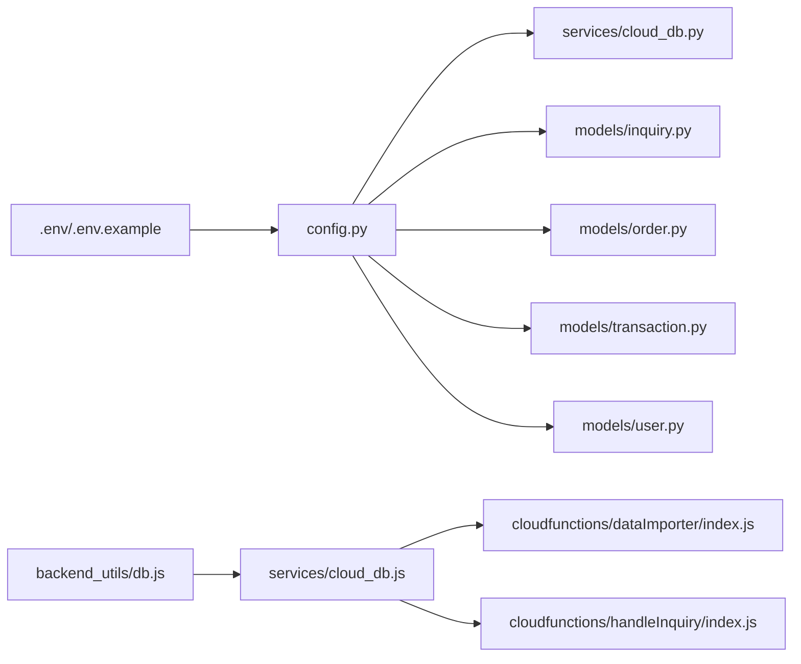

# 数据库操作

<cite>
**本文引用的文件**
- [models/inquiry.py](file://models/inquiry.py)
- [models/order.py](file://models/order.py)
- [models/transaction.py](file://models/transaction.py)
- [models/user.py](file://models/user.py)
- [services/cloud_db.js](file://services/cloud_db.js)
- [services/cloud_db.py](file://services/cloud_db.py)
- [backend_utils/db.js](file://backend_utils/db.js)
- [.env](file://.env)
- [.env.example](file://.env.example)
- [config.py](file://config.py)
- [cloudfunctions/dataImporter/index.js](file://cloudfunctions/dataImporter/index.js)
- [cloudfunctions/handleInquiry/index.js](file://cloudfunctions/handleInquiry/index.js)
- [scripts/migrate_identity.py](file://scripts/migrate_identity.py)
- [routes/auth.py](file://routes/auth.py)
- [services/trade_service.py](file://services/trade_service.py)
</cite>

## 目录
1. [简介](#简介)
2. [项目结构](#项目结构)
3. [核心组件](#核心组件)
4. [架构总览](#架构总览)
5. [详细组件分析](#详细组件分析)
6. [依赖关系分析](#依赖关系分析)
7. [性能考虑](#性能考虑)
8. [故障排查指南](#故障排查指南)
9. [结论](#结论)
10. [附录](#附录)

## 简介
本文件面向场外期权交易系统的数据库访问层，系统同时支持两种数据源：
- 微信云数据库：小程序端直连，用于报价、询价、订单、资金流水等高频读写场景。
- MongoDB：管理后台与数据处理使用，支持复杂查询与聚合。

文档覆盖以下主题：
- 云数据库客户端与连接池管理
- 事务与并发控制
- DAO 模式与 CRUD 实现
- 查询构建器与聚合管道
- 索引策略与查询优化
- 数据迁移、备份与恢复
- 数据一致性与安全配置

## 项目结构
数据库相关代码主要分布在以下模块：
- Python 层（管理后台/数据处理）：模型层（DAO）、云数据库客户端、配置与环境变量
- Node.js 层（小程序/云函数）：云数据库客户端、数据导入与处理云函数
- 配置与环境：.env/.env.example、config.py

图表来源
- [config.py](file://config.py#L1-L120)
- [services/cloud_db.py](file://services/cloud_db.py#L108-L207)
- [models/inquiry.py](file://models/inquiry.py#L10-L31)
- [models/order.py](file://models/order.py#L10-L24)
- [models/transaction.py](file://models/transaction.py#L6-L15)
- [models/user.py](file://models/user.py#L10-L26)
- [routes/auth.py](file://routes/auth.py#L130-L171)
- [services/cloud_db.js](file://services/cloud_db.js#L7-L37)
- [backend_utils/db.js](file://backend_utils/db.js#L1-L11)
- [cloudfunctions/dataImporter/index.js](file://cloudfunctions/dataImporter/index.js#L1-L392)
- [cloudfunctions/handleInquiry/index.js](file://cloudfunctions/handleInquiry/index.js#L52-L80)

章节来源
- [config.py](file://config.py#L1-L120)
- [.env](file://.env#L1-L32)
- [.env.example](file://.env.example#L1-L50)

## 核心组件
- 云数据库客户端（Node.js）：封装微信云 API 的查询、添加、更新、删除、upsert、批量 upsert、并发与重试控制、连接池适配。
- 云数据库客户端（Python）：提供令牌获取、HTTP 会话连接池、并发信号量、重试与错误处理。
- DAO 模型：Inquiry/Order/Transaction/User，统一抽象 CRUD 与分页统计；自动区分云数据库与本地 MongoDB。
- 环境与配置：.env/.env.example、config.py，定义数据源模式、云数据库与 MongoDB 连接参数。
- 云函数：数据导入、询价统计等，展示聚合与事务使用。

章节来源
- [services/cloud_db.js](file://services/cloud_db.js#L7-L327)
- [services/cloud_db.py](file://services/cloud_db.py#L108-L207)
- [models/inquiry.py](file://models/inquiry.py#L10-L148)
- [models/order.py](file://models/order.py#L10-L119)
- [models/transaction.py](file://models/transaction.py#L6-L60)
- [models/user.py](file://models/user.py#L10-L309)
- [.env](file://.env#L1-L32)
- [.env.example](file://.env.example#L1-L50)
- [config.py](file://config.py#L1-L120)

## 架构总览
系统采用“双数据源 + 云函数桥接”的架构：
- 小程序端直连微信云数据库，使用 Node.js 云数据库客户端进行 CRUD 与批量 upsert。
- 管理后台与数据处理使用 Python 云数据库客户端，支持连接池与并发控制。
- 通过云函数实现数据导入、去重、事务性状态变更与聚合统计。

图表来源
- [cloudfunctions/dataImporter/index.js](file://cloudfunctions/dataImporter/index.js#L167-L231)
- [cloudfunctions/handleInquiry/index.js](file://cloudfunctions/handleInquiry/index.js#L63-L80)
- [services/cloud_db.js](file://services/cloud_db.js#L144-L180)

## 详细组件分析

### 云数据库客户端（Node.js）
- 功能要点
  - 令牌获取与缓存、超时与重试
  - 并发控制（最大并发、等待队列）
  - 查询、添加、更新、删除、upsert、批量 upsert
  - 统计 count
- 并发与连接池
  - 最大并发由环境变量控制，默认较高并发以满足行情同步需求
  - 请求使用信号量控制，避免过度并发
- 错误处理
  - 对速率限制、QPS 限制进行指数退避重试
  - 对资源不存在等特定错误进行分类处理

图表来源
- [services/cloud_db.js](file://services/cloud_db.js#L7-L327)

章节来源
- [services/cloud_db.js](file://services/cloud_db.js#L7-L327)

### 云数据库客户端（Python）
- 功能要点
  - 令牌提供者 AccessTokenProvider，线程安全获取 access_token
  - HTTP 会话连接池与并发信号量
  - 查询、统计、增删改、upsert、批量 upsert
- 并发与连接池
  - 通过 HTTPAdapter 设置连接池大小与最大并发
  - 信号量保护请求发送，避免拥塞
- 错误处理
  - 对集合不存在等错误进行降级处理
  - 统一异常类型 CloudDbRequestError

图表来源
- [services/cloud_db.py](file://services/cloud_db.py#L36-L106)
- [services/cloud_db.py](file://services/cloud_db.py#L108-L207)
- [services/cloud_db.py](file://services/cloud_db.py#L486-L533)

章节来源
- [services/cloud_db.py](file://services/cloud_db.py#L108-L207)
- [services/cloud_db.py](file://services/cloud_db.py#L36-L106)
- [services/cloud_db.py](file://services/cloud_db.py#L486-L533)

### DAO 模型（Inquiry/Order/Transaction/User）
- 设计模式
  - DAO 模式：每个领域模型封装对集合的 CRUD 与分页统计
  - 双态支持：通过 _is_cloud() 判断是否使用云数据库客户端
- CRUD 与分页
  - create/get/update，支持分页 skip/limit 与排序
  - count 统计总数，云数据库与本地 MongoDB 分别实现
- 索引策略
  - Inquiry：按 createdAt、status、phone 建立索引
  - Order：按 orderId（唯一）、createdAt 建立索引
- 事务与一致性
  - 云数据库 HTTP API 不支持原生 ACID 事务，通过 upsert 与幂等更新保证最终一致
  - 用户余额更新采用“读取-计算-更新”，需在上层业务保证并发安全

图表来源
- [models/inquiry.py](file://models/inquiry.py#L10-L148)
- [models/order.py](file://models/order.py#L10-L119)
- [models/transaction.py](file://models/transaction.py#L6-L60)
- [models/user.py](file://models/user.py#L10-L309)

章节来源
- [models/inquiry.py](file://models/inquiry.py#L10-L148)
- [models/order.py](file://models/order.py#L10-L119)
- [models/transaction.py](file://models/transaction.py#L6-L60)
- [models/user.py](file://models/user.py#L10-L309)

### 查询构建器与聚合管道
- 查询构建器
  - Node.js 云数据库客户端通过构造查询字符串实现 where、orderBy、skip、limit、count
  - Python 云数据库客户端同样支持 where 与 count 的组合
- 聚合管道
  - 云函数中使用聚合命令进行分组统计（如按状态分组计数）

图表来源
- [cloudfunctions/handleInquiry/index.js](file://cloudfunctions/handleInquiry/index.js#L63-L80)

章节来源
- [services/cloud_db.js](file://services/cloud_db.js#L144-L180)
- [services/cloud_db.py](file://services/cloud_db.py#L209-L271)
- [cloudfunctions/handleInquiry/index.js](file://cloudfunctions/handleInquiry/index.js#L63-L80)

### 事务处理机制
- 云数据库 HTTP API
  - 不支持多文档 ACID 事务；通过 upsert 与幂等更新实现最终一致
  - 云函数支持事务性读写（runTransaction），适合状态变更与去重
- MongoDB
  - 支持事务（多文档 ACID），可在管理后台与数据处理中使用

图表来源
- [services/cloud_db.js](file://services/cloud_db.js#L188-L222)
- [cloudfunctions/dataImporter/index.js](file://cloudfunctions/dataImporter/index.js#L252-L261)

章节来源
- [services/cloud_db.js](file://services/cloud_db.js#L188-L222)
- [cloudfunctions/dataImporter/index.js](file://cloudfunctions/dataImporter/index.js#L252-L261)

### 数据迁移脚本
- 迁移策略
  - 批量扫描用户集合，逐页拉取并同步到客户集合
  - 云数据库与本地 MongoDB 均支持，注意 ID 格式与字段映射
- 云函数辅助
  - 导入云函数中实现去重与事务性状态变更，保障数据质量

图表来源
- [scripts/migrate_identity.py](file://scripts/migrate_identity.py#L46-L98)
- [cloudfunctions/dataImporter/index.js](file://cloudfunctions/dataImporter/index.js#L267-L271)

章节来源
- [scripts/migrate_identity.py](file://scripts/migrate_identity.py#L46-L98)
- [cloudfunctions/dataImporter/index.js](file://cloudfunctions/dataImporter/index.js#L267-L271)

### 索引策略与查询优化
- 索引
  - Inquiry：createdAt、status、phone
  - Order：orderId（唯一）、createdAt
- 查询优化
  - 使用 where 条件与排序字段建立复合索引
  - 分页使用 skip/limit，避免全表扫描
  - 云数据库 count 与 get 分离，减少一次查询的负载

章节来源
- [models/inquiry.py](file://models/inquiry.py#L24-L30)
- [models/order.py](file://models/order.py#L17-L21)

### 安全配置与审计
- 环境变量
  - 微信云开发：WX_APPID、WX_SECRET、WX_CLOUD_ENV、WX_VERIFY_SSL
  - JWT 密钥、管理员账号等安全配置
- 审计
  - 云函数导入流程记录作业状态、重复检测与错误信息
  - 用户会话管理与登录时间更新

章节来源
- [.env](file://.env#L24-L27)
- [.env.example](file://.env.example#L33-L38)
- [models/user.py](file://models/user.py#L27-L91)
- [cloudfunctions/dataImporter/index.js](file://cloudfunctions/dataImporter/index.js#L233-L265)

## 依赖关系分析

图表来源
- [config.py](file://config.py#L1-L120)
- [services/cloud_db.js](file://services/cloud_db.js#L7-L37)
- [services/cloud_db.py](file://services/cloud_db.py#L108-L207)
- [models/inquiry.py](file://models/inquiry.py#L10-L31)
- [models/order.py](file://models/order.py#L10-L24)
- [models/transaction.py](file://models/transaction.py#L6-L15)
- [models/user.py](file://models/user.py#L10-L26)
- [cloudfunctions/dataImporter/index.js](file://cloudfunctions/dataImporter/index.js#L1-L392)
- [cloudfunctions/handleInquiry/index.js](file://cloudfunctions/handleInquiry/index.js#L52-L80)
- [backend_utils/db.js](file://backend_utils/db.js#L1-L11)

章节来源
- [config.py](file://config.py#L1-L120)
- [services/cloud_db.js](file://services/cloud_db.js#L7-L37)
- [services/cloud_db.py](file://services/cloud_db.py#L108-L207)
- [models/inquiry.py](file://models/inquiry.py#L10-L31)
- [models/order.py](file://models/order.py#L10-L24)
- [models/transaction.py](file://models/transaction.py#L6-L15)
- [models/user.py](file://models/user.py#L10-L26)
- [cloudfunctions/dataImporter/index.js](file://cloudfunctions/dataImporter/index.js#L1-L392)
- [cloudfunctions/handleInquiry/index.js](file://cloudfunctions/handleInquiry/index.js#L52-L80)
- [backend_utils/db.js](file://backend_utils/db.js#L1-L11)

## 性能考虑
- 并发与连接池
  - Node.js 客户端默认较高并发，Python 客户端通过连接池适配并发
  - 信号量保护请求，避免拥塞
- 批量操作
  - 批量 upsert 与分片写入，降低单次请求压力
- 重试与退避
  - 针对速率限制与 QPS 限制进行指数退避
- 查询优化
  - 合理使用索引与 where 条件，避免全表扫描
  - 分页 skip/limit 控制单次返回量

章节来源
- [services/cloud_db.js](file://services/cloud_db.js#L39-L51)
- [services/cloud_db.py](file://services/cloud_db.py#L121-L139)
- [services/cloud_db.py](file://services/cloud_db.py#L331-L484)

## 故障排查指南
- 云数据库配置未就绪
  - Node.js 层：初始化失败会回退到本地 Mock 存储
  - Python 层：fromEnv 会抛出配置错误
- 速率限制与 QPS 限制
  - 客户端内置指数退避重试；检查 WX_DB_MAX_RETRIES 与并发设置
- 集合不存在
  - Python 客户端对 ResourceNotFound 进行降级处理；确认集合已创建
- 事务性导入失败
  - 云函数导入流程记录作业状态与错误；检查重复文件与内存限制

章节来源
- [backend_utils/db.js](file://backend_utils/db.js#L6-L11)
- [services/cloud_db.py](file://services/cloud_db.py#L197-L204)
- [services/cloud_db.py](file://services/cloud_db.py#L515-L519)
- [cloudfunctions/dataImporter/index.js](file://cloudfunctions/dataImporter/index.js#L276-L291)
- [cloudfunctions/dataImporter/index.js](file://cloudfunctions/dataImporter/index.js#L320-L340)

## 结论
本系统通过双数据源架构实现了小程序端的高性能读写与管理后台的复杂查询能力。云数据库客户端提供了完善的并发控制、重试与错误处理机制；DAO 模型统一了 CRUD 与分页统计；云函数承担了数据导入、去重与聚合统计等关键职责。通过合理的索引与查询优化，系统在高并发场景下具备良好的稳定性与扩展性。

## 附录
- 环境变量参考
  - 微信云开发：WX_APPID、WX_SECRET、WX_CLOUD_ENV、WX_VERIFY_SSL
  - 数据库：MONGO_URI、DATABASE_NAME
  - 安全：JWT_SECRET、ADMIN_JWT_SECRET
- 配置加载顺序
  - 优先加载本地 .env，其次按 NODE_ENV 选择生产/开发配置

章节来源
- [.env](file://.env#L1-L32)
- [.env.example](file://.env.example#L1-L50)
- [config.py](file://config.py#L1-L120)