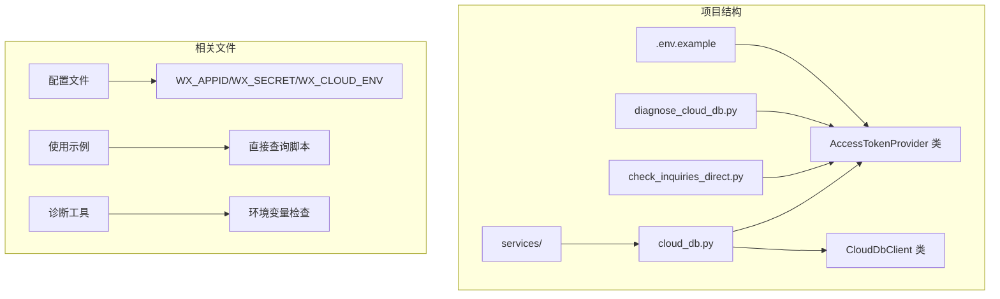
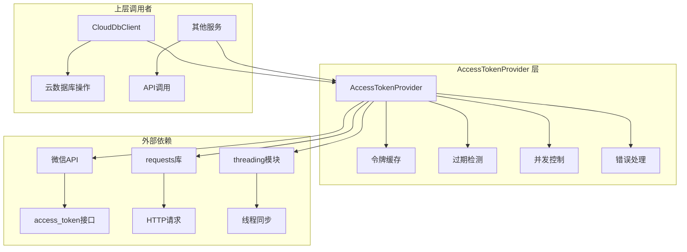
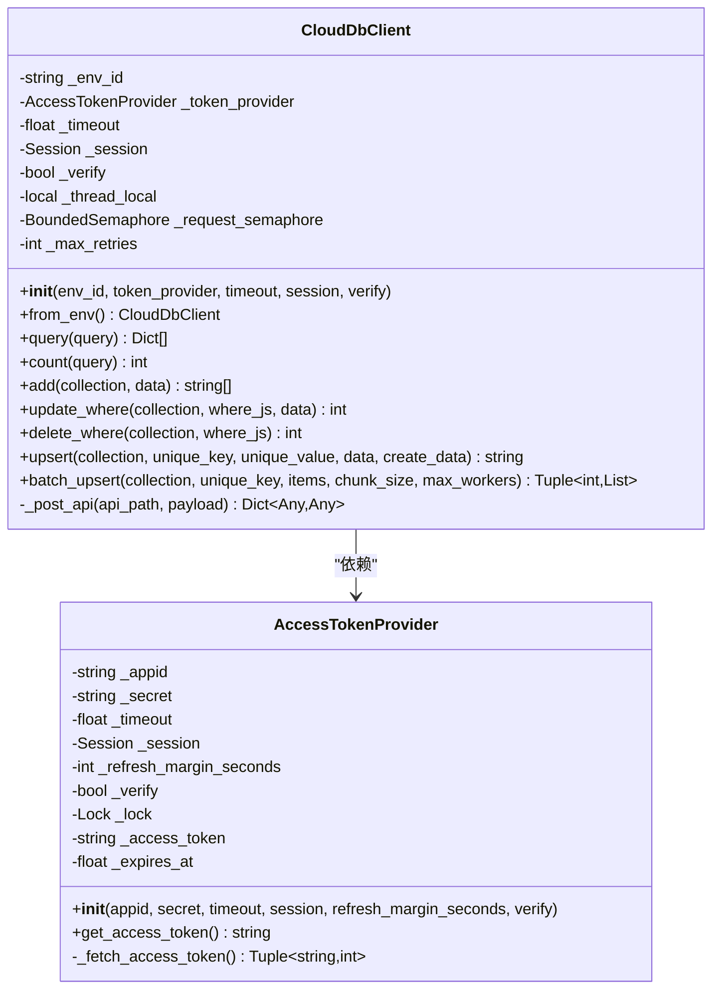
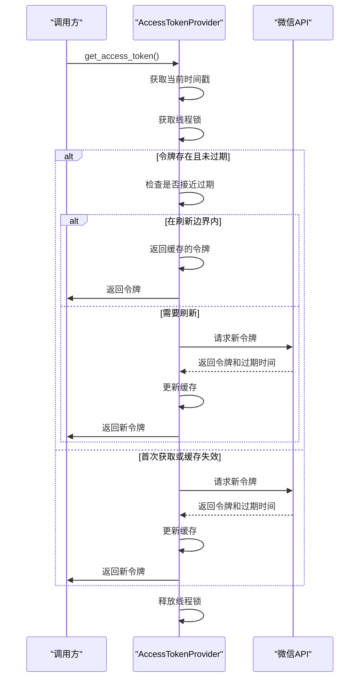
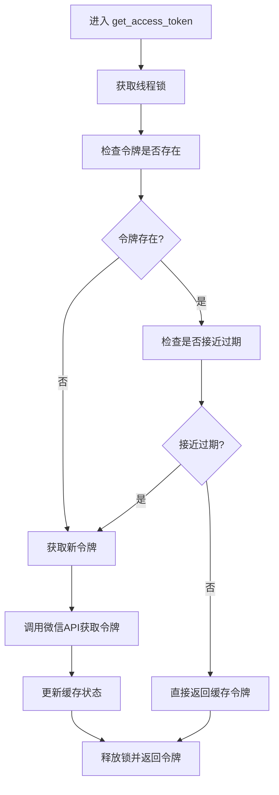
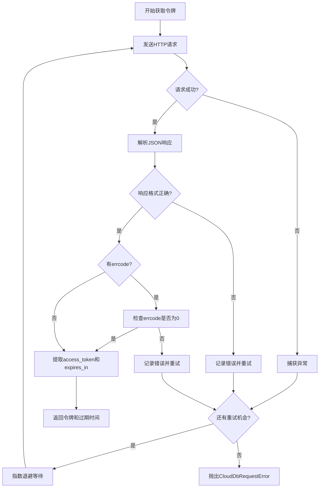
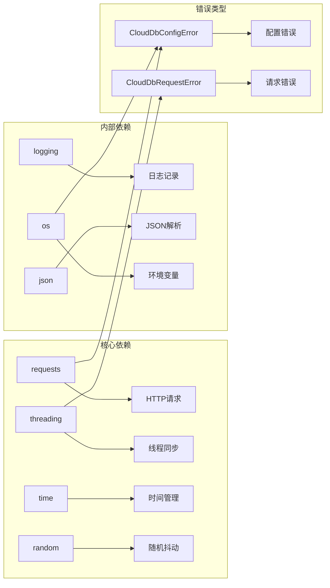

# 访问令牌提供器

<cite>
**本文档引用的文件**
- [services/cloud_db.py](file://services/cloud_db.py)
- [check_inquiries_direct.py](file://check_inquiries_direct.py)
- [.env.example](file://.env.example)
- [diagnose_cloud_db.py](file://diagnose_cloud_db.py)
</cite>

## 目录
1. [简介](#简介)
2. [项目结构](#项目结构)
3. [核心组件](#核心组件)
4. [架构概览](#架构概览)
5. [详细组件分析](#详细组件分析)
6. [依赖关系分析](#依赖关系分析)
7. [性能考虑](#性能考虑)
8. [故障排除指南](#故障排除指南)
9. [结论](#结论)
10. [附录](#附录)

## 简介

AccessTokenProvider 是一个专门设计用于管理微信API访问令牌的Python类。它实现了智能的令牌缓存、自动刷新和并发安全控制机制，确保应用程序能够可靠地获取和使用微信云开发API所需的访问令牌。

该类的核心特性包括：
- 智能令牌缓存和自动刷新
- 并发安全的线程同步机制
- 指数退避重试策略
- 令牌过期检测和边界刷新
- SSL证书验证配置
- 环境变量驱动的配置管理

## 项目结构

AccessTokenProvider 类位于项目的 `services` 目录中，作为云数据库客户端的重要组成部分存在：



**图表来源**
- [services/cloud_db.py](file://services/cloud_db.py#L36-L106)
- [check_inquiries_direct.py](file://check_inquiries_direct.py#L11-L39)

**章节来源**
- [services/cloud_db.py](file://services/cloud_db.py#L1-L533)
- [check_inquiries_direct.py](file://check_inquiries_direct.py#L1-L97)

## 核心组件

AccessTokenProvider 类是整个令牌管理系统的核心，负责以下关键功能：

### 主要职责
- **令牌获取**：从微信API获取新的访问令牌
- **缓存管理**：存储和管理已获取的令牌
- **过期检测**：监控令牌的有效期并触发自动刷新
- **并发控制**：确保多线程环境下的安全访问
- **错误处理**：实现重试机制和异常处理

### 关键属性
- `_appid` 和 `_secret`：微信应用标识和密钥
- `_access_token`：当前有效的访问令牌
- `_expires_at`：令牌过期时间戳
- `_lock`：线程锁，确保并发安全
- `_refresh_margin_seconds`：刷新边界时间（默认300秒）

**章节来源**
- [services/cloud_db.py](file://services/cloud_db.py#L36-L67)

## 架构概览

AccessTokenProvider 的整体架构采用分层设计，确保了良好的内聚性和低耦合性：



**图表来源**
- [services/cloud_db.py](file://services/cloud_db.py#L36-L106)
- [services/cloud_db.py](file://services/cloud_db.py#L108-L207)

## 详细组件分析

### AccessTokenProvider 类设计



**图表来源**
- [services/cloud_db.py](file://services/cloud_db.py#L36-L106)
- [services/cloud_db.py](file://services/cloud_db.py#L108-L207)

### 令牌获取流程

AccessTokenProvider 的令牌获取过程遵循严格的时序控制：



**图表来源**
- [services/cloud_db.py](file://services/cloud_db.py#L58-L67)
- [services/cloud_db.py](file://services/cloud_db.py#L69-L105)

### 并发安全机制

AccessTokenProvider 通过双重检查锁定模式确保线程安全：



**图表来源**
- [services/cloud_db.py](file://services/cloud_db.py#L58-L67)

**章节来源**
- [services/cloud_db.py](file://services/cloud_db.py#L36-L106)

### 错误处理和重试策略

AccessTokenProvider 实现了多层次的错误处理机制：



**图表来源**
- [services/cloud_db.py](file://services/cloud_db.py#L69-L105)

**章节来源**
- [services/cloud_db.py](file://services/cloud_db.py#L69-L105)

## 依赖关系分析

AccessTokenProvider 依赖于多个外部库和组件：



**图表来源**
- [services/cloud_db.py](file://services/cloud_db.py#L1-L12)

**章节来源**
- [services/cloud_db.py](file://services/cloud_db.py#L1-L12)

## 性能考虑

### 缓存策略优化
- **刷新边界设置**：默认300秒（5分钟）提前刷新，避免在临界点发生令牌过期
- **线程安全缓存**：使用锁保护令牌状态，防止并发竞争条件
- **智能复用**：复用HTTP会话，减少连接开销

### 并发控制
- **信号量限制**：CloudDbClient使用有界信号量限制并发请求数量
- **连接池优化**：根据最大并发数动态配置HTTP连接池
- **线程本地存储**：每个线程维护独立的会话实例

### 重试机制
- **指数退避**：重试间隔按2^n递增，最多3次重试
- **抖动添加**：随机抖动±15%避免雪崩效应
- **速率限制感知**：针对速率限制错误使用更长的退避时间

## 故障排除指南

### 常见配置问题

| 问题类型 | 症状 | 解决方案 |
|---------|------|----------|
| 缺少环境变量 | 初始化时抛出配置错误 | 设置 WX_APPID、WX_SECRET、WX_CLOUD_ENV |
| 空值配置 | 配置验证失败 | 确保环境变量非空且格式正确 |
| SSL证书错误 | HTTPS连接失败 | 设置 WX_VERIFY_SSL=false（仅限开发环境） |

### 令牌相关问题

| 问题 | 可能原因 | 处理方法 |
|------|----------|----------|
| 令牌过期 | 刷新边界设置过短 | 调整 refresh_margin_seconds 参数 |
| 并发冲突 | 多线程同时刷新 | 检查锁机制是否正常工作 |
| 请求超时 | 网络延迟或API限流 | 增加 timeout 值或降低并发度 |

**章节来源**
- [diagnose_cloud_db.py](file://diagnose_cloud_db.py#L31-L46)
- [services/cloud_db.py](file://services/cloud_db.py#L197-L204)

## 结论

AccessTokenProvider 类是一个设计精良的令牌管理组件，具有以下优势：

1. **可靠性**：实现了完善的错误处理和重试机制
2. **性能**：通过缓存和连接复用优化性能
3. **安全性**：支持SSL证书验证和线程安全
4. **易用性**：提供简洁的API和灵活的配置选项

该组件为整个微信云开发API访问提供了稳定的基础，确保了应用程序在各种环境下的可靠运行。

## 附录

### 配置示例

#### 环境变量配置
```bash
# 必需配置
WX_APPID=wx83166cb97bfc0d4c
WX_SECRET=your_secret_here
WX_CLOUD_ENV=your_env_id_here

# 可选配置
WX_VERIFY_SSL=true
WX_DB_MAX_INFLIGHT=64
WX_DB_MAX_RETRIES=3
WX_DB_MAX_WORKERS=32
```

#### Python代码示例
```python
from services.cloud_db import AccessTokenProvider, CloudDbClient

# 基础使用
provider = AccessTokenProvider(
    appid="your_appid",
    secret="your_secret"
)

# 高级配置
provider = AccessTokenProvider(
    appid="your_appid",
    secret="your_secret",
    timeout=10.0,
    refresh_margin_seconds=600,
    verify=True
)
```

### 最佳实践

1. **配置管理**：使用环境变量而非硬编码配置
2. **错误处理**：始终捕获并处理 CloudDbRequestError
3. **性能监控**：定期检查令牌刷新频率和API响应时间
4. **安全考虑**：生产环境中始终启用SSL验证
5. **并发控制**：根据实际负载调整并发参数