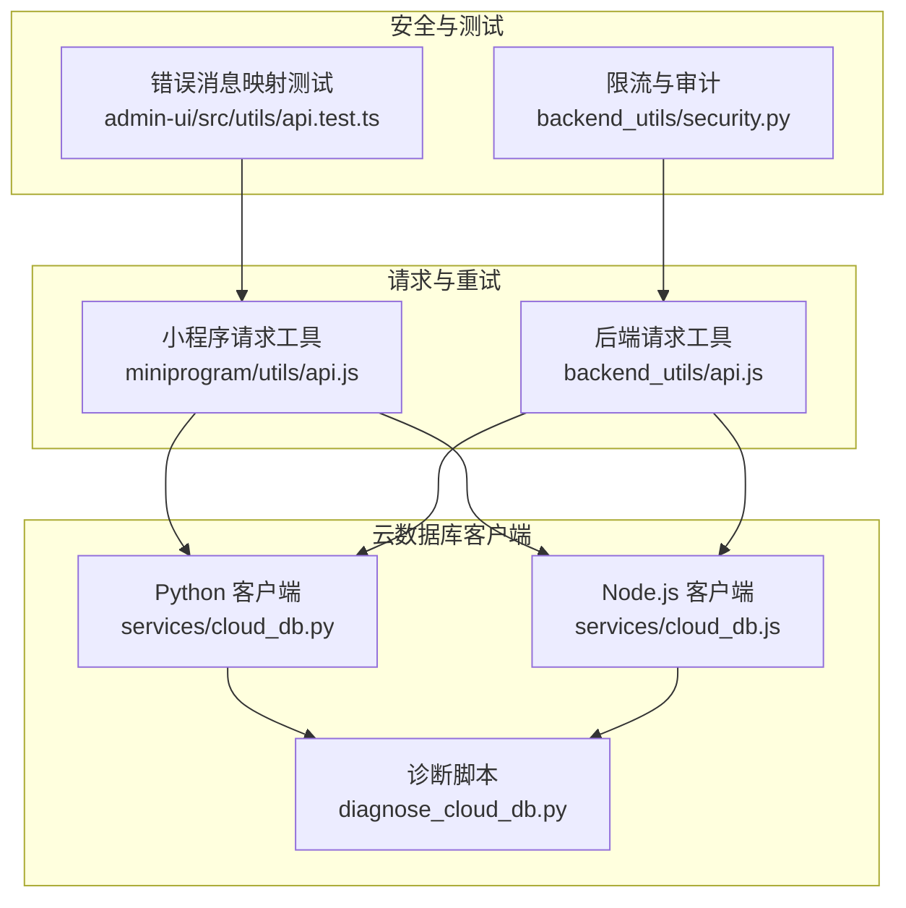
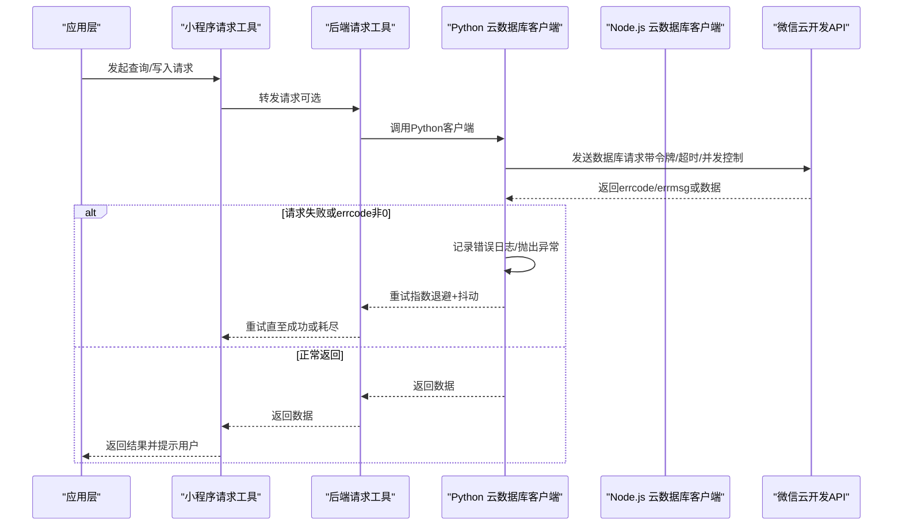
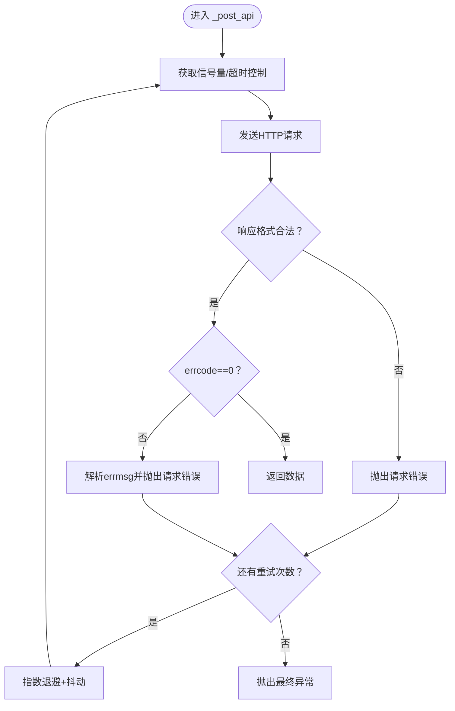
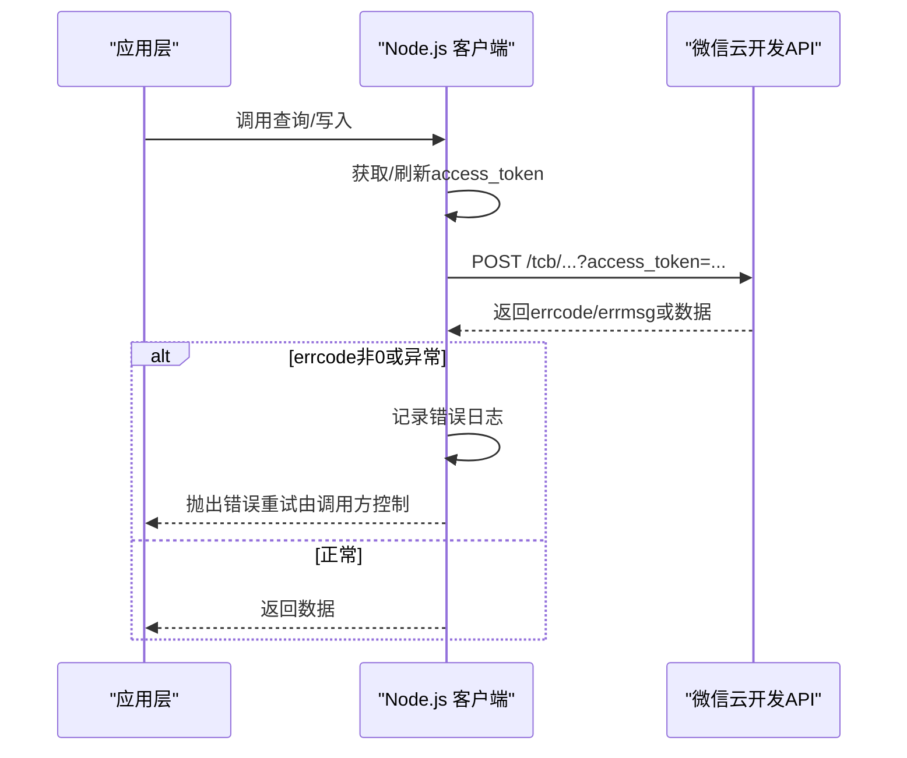
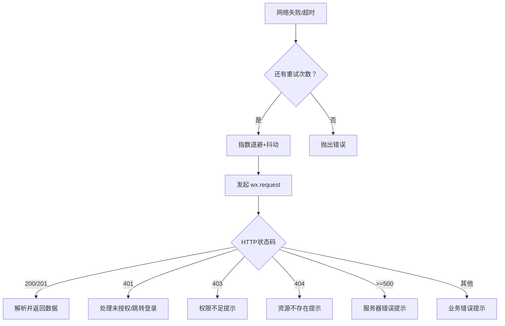
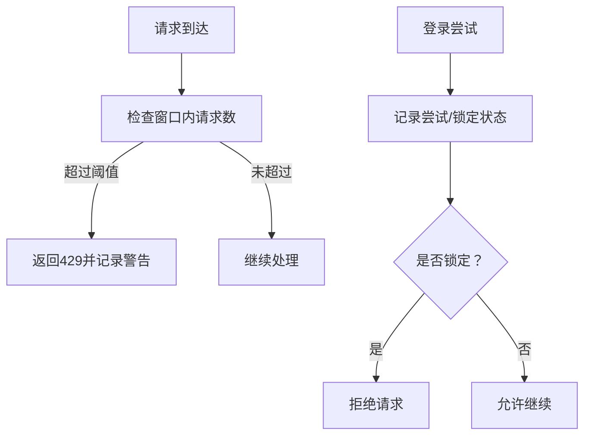
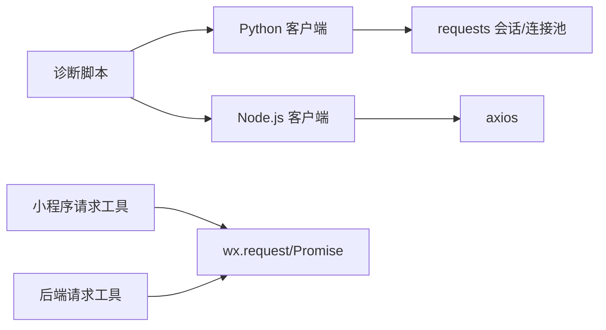

# 错误处理机制

<cite>
**本文档引用的文件**
- [services/cloud_db.py](file://services/cloud_db.py)
- [services/cloud_db.js](file://services/cloud_db.js)
- [backend_utils/api.js](file://backend_utils/api.js)
- [miniprogram/utils/api.js](file://miniprogram/utils/api.js)
- [diagnose_cloud_db.py](file://diagnose_cloud_db.py)
- [backend_utils/security.py](file://backend_utils/security.py)
- [admin-ui/src/utils/api.test.ts](file://admin-ui/src/utils/api.test.ts)
</cite>

## 目录
1. [简介](#简介)
2. [项目结构](#项目结构)
3. [核心组件](#核心组件)
4. [架构总览](#架构总览)
5. [详细组件分析](#详细组件分析)
6. [依赖关系分析](#依赖关系分析)
7. [性能考量](#性能考量)
8. [故障排除指南](#故障排除指南)
9. [结论](#结论)

## 简介
本文件系统性梳理项目中的错误处理机制，聚焦于云数据库操作的异常处理与错误恢复策略。内容涵盖自定义异常类型设计与分类（配置错误、请求错误、业务错误）、错误重试机制与指数退避算法、超时与并发控制、错误日志记录、错误码映射与用户友好提示、网络异常与API限流处理、数据格式校验，以及最佳实践与调试技巧。

## 项目结构
围绕错误处理的关键文件分布如下：
- Python 云数据库客户端与诊断脚本：services/cloud_db.py、diagnose_cloud_db.py
- Node.js 云数据库客户端：services/cloud_db.js
- 小程序与后端通用请求工具与重试机制：miniprogram/utils/api.js、backend_utils/api.js
- 安全与限流中间件：backend_utils/security.py
- 用户端错误消息映射测试：admin-ui/src/utils/api.test.ts

图表来源
- [services/cloud_db.py](file://services/cloud_db.py#L108-L533)
- [services/cloud_db.js](file://services/cloud_db.js#L1-L327)
- [diagnose_cloud_db.py](file://diagnose_cloud_db.py#L1-L101)
- [backend_utils/api.js](file://backend_utils/api.js#L1-L571)
- [miniprogram/utils/api.js](file://miniprogram/utils/api.js#L1-L714)
- [backend_utils/security.py](file://backend_utils/security.py#L1-L117)
- [admin-ui/src/utils/api.test.ts](file://admin-ui/src/utils/api.test.ts#L1-L43)

章节来源
- [services/cloud_db.py](file://services/cloud_db.py#L108-L533)
- [services/cloud_db.js](file://services/cloud_db.js#L1-L327)
- [diagnose_cloud_db.py](file://diagnose_cloud_db.py#L1-L101)
- [backend_utils/api.js](file://backend_utils/api.js#L1-L571)
- [miniprogram/utils/api.js](file://miniprogram/utils/api.js#L1-L714)
- [backend_utils/security.py](file://backend_utils/security.py#L1-L117)
- [admin-ui/src/utils/api.test.ts](file://admin-ui/src/utils/api.test.ts#L1-L43)

## 核心组件
- 自定义异常类型
  - Python 客户端定义了配置错误与请求错误两类异常，用于区分环境配置问题与云数据库请求失败。
  - Node.js 客户端通过抛出标准错误对象承载业务错误信息。
- 错误重试与指数退避
  - Python 与 Node.js 客户端均实现多轮重试，并基于“速率限制/频率过高/请求过多”关键词触发不同的退避上限与抖动。
  - 小程序与后端请求工具同样具备指数退避与重试逻辑。
- 超时与并发控制
  - Python 客户端对请求超时、连接池与信号量进行统一控制；Node.js 客户端采用队列与并发上限。
  - 小程序与后端请求工具内置超时与并发队列。
- 错误日志与用户提示
  - Python 客户端在关键路径记录 INFO/WARNING/ERROR 日志；Node.js 客户端在失败时输出错误日志。
  - 小程序与后端请求工具对网络错误与业务错误给出用户提示。
- API 限流与安全
  - 后端提供基于内存的简单限流装饰器，防止接口被滥用。
- 数据格式校验
  - Python 客户端对响应格式进行严格校验，对非预期格式返回空结果并记录警告。

章节来源
- [services/cloud_db.py](file://services/cloud_db.py#L15-L21)
- [services/cloud_db.js](file://services/cloud_db.js#L106-L139)
- [backend_utils/api.js](file://backend_utils/api.js#L18-L22)
- [miniprogram/utils/api.js](file://miniprogram/utils/api.js#L16-L20)
- [backend_utils/security.py](file://backend_utils/security.py#L17-L45)

## 架构总览
下图展示云数据库请求在不同层的错误处理与恢复路径：

图表来源
- [services/cloud_db.py](file://services/cloud_db.py#L486-L533)
- [services/cloud_db.js](file://services/cloud_db.js#L106-L139)
- [backend_utils/api.js](file://backend_utils/api.js#L258-L330)
- [miniprogram/utils/api.js](file://miniprogram/utils/api.js#L377-L473)

## 详细组件分析

### Python 云数据库客户端（错误处理）
- 异常类型
  - 配置错误：当环境变量缺失或非法时抛出，便于快速定位配置问题。
  - 请求错误：封装云数据库返回的 errcode/errmsg 或网络/解析异常。
- 错误重试与指数退避
  - 在请求失败时按最大重试次数循环重试，依据错误消息关键词选择不同的退避上限与抖动范围。
  - 使用信号量控制并发，避免过度竞争。
- 超时与并发
  - 通过会话与连接池适配器配置连接池大小，提升并发吞吐。
  - 请求超时参数贯穿整个调用链。
- 错误日志
  - 在查询、统计、增删改等关键路径记录详细日志，便于诊断。
- 数据格式校验
  - 对响应数据进行严格校验，非预期格式返回空结果并记录警告。
- 诊断脚本
  - 提供一键诊断流程，覆盖环境变量检查、客户端初始化与查询测试。

图表来源
- [services/cloud_db.py](file://services/cloud_db.py#L486-L533)

章节来源
- [services/cloud_db.py](file://services/cloud_db.py#L15-L21)
- [services/cloud_db.py](file://services/cloud_db.py#L108-L161)
- [services/cloud_db.py](file://services/cloud_db.py#L209-L248)
- [services/cloud_db.py](file://services/cloud_db.py#L249-L271)
- [services/cloud_db.py](file://services/cloud_db.py#L486-L533)
- [diagnose_cloud_db.py](file://diagnose_cloud_db.py#L48-L98)

### Node.js 云数据库客户端（错误处理）
- 异常类型
  - 通过抛出标准错误对象承载业务错误信息，便于上层捕获与统一处理。
- 错误重试与指数退避
  - 与 Python 客户端一致的重试策略，基于关键词判断退避上限。
- 并发与队列
  - 内部维护活跃请求数与等待队列，实现并发上限控制。
- 错误日志
  - 失败时输出错误日志，便于定位问题。

图表来源
- [services/cloud_db.js](file://services/cloud_db.js#L106-L139)

章节来源
- [services/cloud_db.js](file://services/cloud_db.js#L1-L327)

### 小程序请求工具（错误处理与用户提示）
- 重试与指数退避
  - 支持配置最大重试次数与指数退避延迟，失败时自动重试。
- 网络错误处理
  - 对超时、网络失败等场景给出用户可理解的提示。
- 缓存与统计
  - GET 请求支持缓存与 TTL，提供 API 统计信息（成功率、平均响应时间等）。
- 业务错误处理
  - 对 401、403、404、>=500 等状态码进行统一处理与用户提示。

图表来源
- [miniprogram/utils/api.js](file://miniprogram/utils/api.js#L377-L473)

章节来源
- [miniprogram/utils/api.js](file://miniprogram/utils/api.js#L1-L714)

### 后端请求工具（错误处理与用户提示）
- 重试与指数退避
  - 与小程序工具一致的重试策略与退避算法。
- 网络错误处理
  - 对超时、网络失败等场景给出用户可理解的提示。
- 缓存与统计
  - GET 请求缓存与 TTL，提供 API 统计信息。
- 业务错误处理
  - 对 401、403、404、>=500 等状态码进行统一处理与用户提示。

章节来源
- [backend_utils/api.js](file://backend_utils/api.js#L1-L571)

### 安全与限流（API 限制处理）
- 简单限流装饰器
  - 基于内存存储记录每个 IP+端点的请求时间戳，超过阈值返回 429。
- 登录尝试锁定
  - 记录失败尝试次数并在达到阈值时锁定账户一段时间。
- 审计日志
  - 记录用户行为、IP 与状态，便于追踪与审计。

图表来源
- [backend_utils/security.py](file://backend_utils/security.py#L17-L45)
- [backend_utils/security.py](file://backend_utils/security.py#L62-L86)
- [backend_utils/security.py](file://backend_utils/security.py#L87-L117)

章节来源
- [backend_utils/security.py](file://backend_utils/security.py#L1-L117)

### 错误码映射与用户友好提示
- 小程序与后端请求工具对常见 HTTP 状态码与网络错误进行用户友好提示。
- 用户端错误消息映射测试覆盖网络错误与特定状态码的提示映射，保证一致性。

章节来源
- [miniprogram/utils/api.js](file://miniprogram/utils/api.js#L404-L439)
- [backend_utils/api.js](file://backend_utils/api.js#L270-L285)
- [admin-ui/src/utils/api.test.ts](file://admin-ui/src/utils/api.test.ts#L1-L43)

## 依赖关系分析
- Python 客户端依赖 requests 会话与连接池适配器，结合信号量实现并发控制与超时管理。
- Node.js 客户端依赖 axios，内部实现队列与并发上限。
- 小程序与后端请求工具均依赖 wx.request 与 Promise，实现统一的重试、超时与错误处理。
- 诊断脚本依赖 Python 客户端，串联环境变量检查、客户端初始化与查询测试。

图表来源
- [services/cloud_db.py](file://services/cloud_db.py#L108-L161)
- [services/cloud_db.js](file://services/cloud_db.js#L16-L25)
- [miniprogram/utils/api.js](file://miniprogram/utils/api.js#L379-L441)
- [backend_utils/api.js](file://backend_utils/api.js#L259-L300)
- [diagnose_cloud_db.py](file://diagnose_cloud_db.py#L61-L69)

章节来源
- [services/cloud_db.py](file://services/cloud_db.py#L108-L161)
- [services/cloud_db.js](file://services/cloud_db.js#L16-L25)
- [miniprogram/utils/api.js](file://miniprogram/utils/api.js#L379-L441)
- [backend_utils/api.js](file://backend_utils/api.js#L259-L300)
- [diagnose_cloud_db.py](file://diagnose_cloud_db.py#L61-L69)

## 性能考量
- 并发控制
  - Python 客户端通过连接池与信号量限制并发，避免资源争用。
  - Node.js 客户端通过队列与并发上限控制请求速率。
  - 小程序与后端请求工具通过队列与并发上限避免风暴效应。
- 指数退避与抖动
  - 重试时采用指数退避与随机抖动，降低集中重试导致的雪崩风险。
- 缓存
  - GET 请求缓存减少重复请求，提高响应速度与稳定性。
- 统计与可观测性
  - API 统计信息（成功率、平均响应时间、重试次数）有助于性能监控与优化。

## 故障排除指南
- 环境变量检查
  - 确认 WX_CLOUD_ENV、WX_APPID、WX_SECRET 已正确设置且非占位符。
- 集合存在性
  - 若出现“集合不存在”错误，需在微信云开发控制台创建对应集合。
- 速率限制
  - 若出现“速率过高/频率限制”，适当增加重试间隔或降低并发。
- 网络与超时
  - 检查网络连通性与代理设置；适当增大超时时间。
- 日志与诊断
  - 查看 Python 客户端日志与诊断脚本输出，定位具体失败环节。
- 用户提示
  - 小程序与后端工具对网络错误与业务错误提供明确提示，便于用户反馈。

章节来源
- [diagnose_cloud_db.py](file://diagnose_cloud_db.py#L31-L46)
- [services/cloud_db.py](file://services/cloud_db.py#L243-L247)
- [services/cloud_db.py](file://services/cloud_db.py#L528-L531)
- [miniprogram/utils/api.js](file://miniprogram/utils/api.js#L431-L439)
- [backend_utils/api.js](file://backend_utils/api.js#L290-L298)

## 结论
本项目在云数据库操作中建立了完善的错误处理体系：通过自定义异常类型清晰区分配置、请求与业务错误；借助指数退避与抖动的重试机制提升鲁棒性；配合超时与并发控制保障系统稳定性；通过日志记录与用户友好提示提升可观测性与用户体验；并通过限流与审计增强安全性。建议在生产环境中结合统计指标持续优化重试策略与并发参数，并完善监控告警以进一步提升系统的可靠性与可维护性。