# 数据库架构设计

<cite>
**本文档引用的文件**
- [backend_utils/db.js](file://backend_utils/db.js)
- [services/cloud_db.js](file://services/cloud_db.js)
- [services/cloud_db.py](file://services/cloud_db.py)
- [models/customer.py](file://models/customer.py)
- [models/order.py](file://models/order.py)
- [models/position.py](file://models/position.py)
- [.env](file://.env)
- [config.py](file://config.py)
- [app.py](file://app.py)
</cite>

## 目录
1. [简介](#简介)
2. [项目结构](#项目结构)
3. [核心组件](#核心组件)
4. [架构概览](#架构概览)
5. [详细组件分析](#详细组件分析)
6. [依赖关系分析](#依赖关系分析)
7. [性能考虑](#性能考虑)
8. [故障排除指南](#故障排除指南)
9. [结论](#结论)
10. [附录](#附录)

## 简介

本项目采用混合数据库架构设计，结合了微信云数据库和本地MongoDB数据库的优势，为场外期权交易系统提供灵活可靠的数据存储解决方案。

### 架构特点

- **双数据源架构**：支持微信云数据库（小程序端）和MongoDB（管理后台）双重数据源
- **环境适配性**：支持开发、测试、生产三种环境的灵活切换
- **容错机制**：具备数据库连接失败的降级处理能力
- **并发控制**：内置请求限流和重试机制

## 项目结构

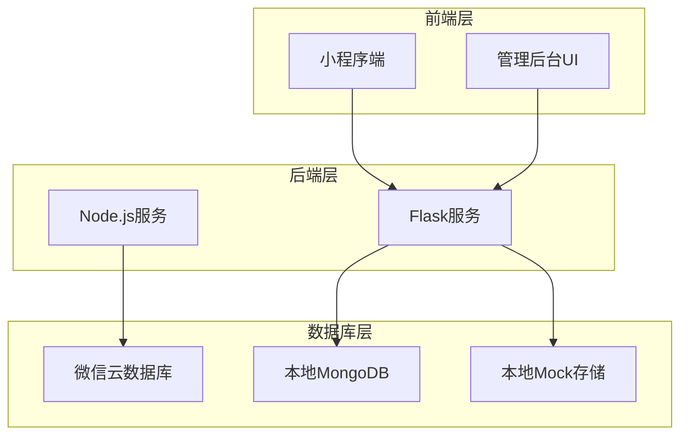

**图表来源**
- [config.py](file://config.py#L6-L12)
- [app.py](file://app.py#L69-L100)

**章节来源**
- [config.py](file://config.py#L1-L132)
- [app.py](file://app.py#L69-L100)

## 核心组件

### 数据库客户端抽象层

系统实现了统一的数据库访问接口，支持多种数据库后端：

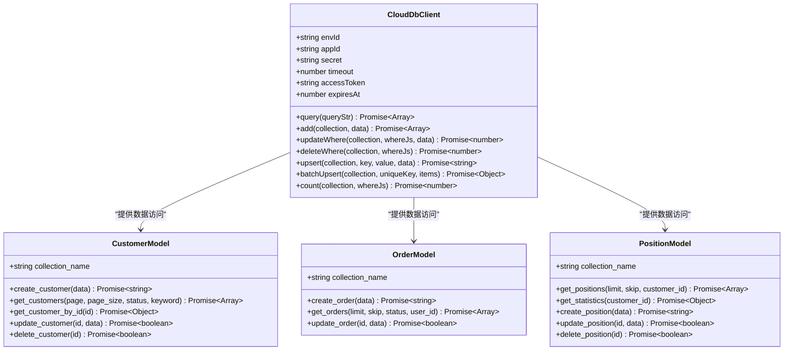

**图表来源**
- [services/cloud_db.js](file://services/cloud_db.js#L7-L327)
- [models/customer.py](file://models/customer.py#L10-L300)
- [models/order.py](file://models/order.py#L10-L119)
- [models/position.py](file://models/position.py#L10-L206)

**章节来源**
- [services/cloud_db.js](file://services/cloud_db.js#L1-L327)
- [models/customer.py](file://models/customer.py#L1-L300)
- [models/order.py](file://models/order.py#L1-L119)
- [models/position.py](file://models/position.py#L1-L206)

## 架构概览

### 数据流架构

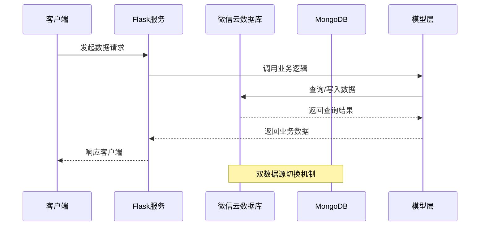

**图表来源**
- [config.py](file://config.py#L27-L46)
- [services/cloud_db.js](file://services/cloud_db.js#L27-L37)

### 配置管理架构

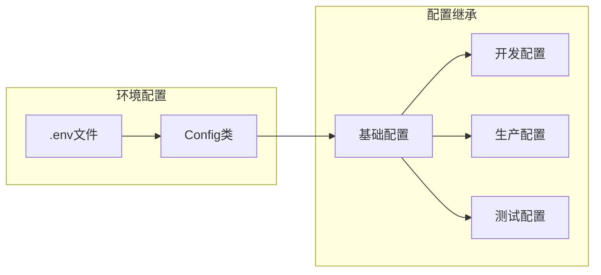

**图表来源**
- [.env](file://.env#L1-L32)
- [config.py](file://config.py#L22-L132)

**章节来源**
- [.env](file://.env#L1-L32)
- [config.py](file://config.py#L1-L132)

## 详细组件分析

### 集合命名规范

系统采用统一的集合命名约定：

| 集合名称 | 用途 | 命名规则 |
|---------|------|----------|
| customers | 客户信息 | 复数形式，小写开头 |
| orders | 订单数据 | 复数形式，小写开头 |
| positions | 持仓信息 | 复数形式，小写开头 |
| groups | 交易组信息 | 复数形式，小写开头 |
| inquiries | 询价信息 | 复数形式，小写开头 |

**章节来源**
- [models/customer.py](file://models/customer.py#L14)
- [models/order.py](file://models/order.py#L14)
- [models/position.py](file://models/position.py#L14)

### 文档结构设计

#### 客户文档结构

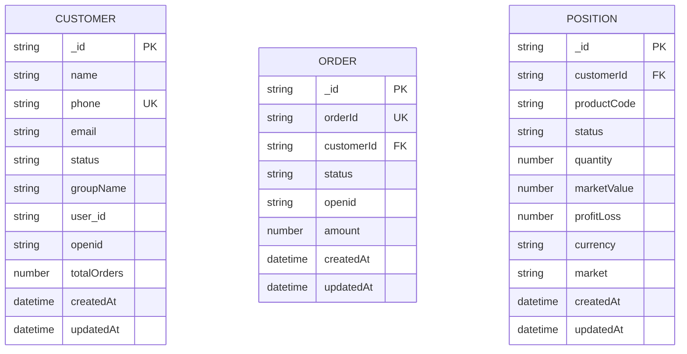

**图表来源**
- [models/customer.py](file://models/customer.py#L25-L36)
- [models/order.py](file://models/order.py#L28-L35)
- [models/position.py](file://models/position.py#L152-L161)

#### 数据类型选择策略

| 字段类型 | 选择依据 | 示例 |
|---------|----------|------|
| ObjectId | MongoDB主键标识 | `_id` 字段 |
| String | 文本信息存储 | `name`, `phone` |
| Number | 数值计算和统计 | `totalOrders`, `quantity` |
| DateTime | 时间戳记录 | `createdAt`, `updatedAt` |
| Enum | 固定状态值 | `status` 字段 |

**章节来源**
- [models/customer.py](file://models/customer.py#L25-L36)
- [models/order.py](file://models/order.py#L28-L35)
- [models/position.py](file://models/position.py#L152-L161)

### 索引策略设计

#### 当前索引实现

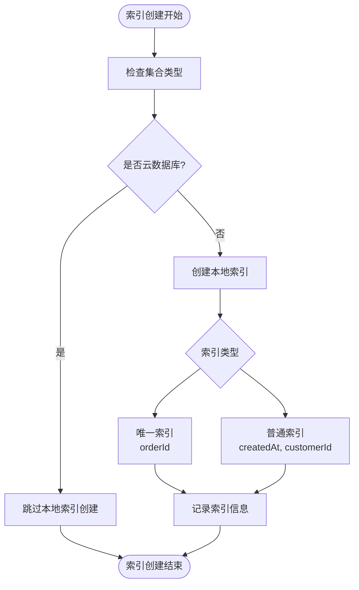

**图表来源**
- [models/order.py](file://models/order.py#L18-L21)
- [models/position.py](file://models/position.py#L17-L21)

#### 索引优化建议

| 索引类型 | 字段组合 | 查询场景 | 性能收益 |
|---------|----------|----------|----------|
| 唯一索引 | `orderId` | 订单查询 | 高查询效率 |
| 复合索引 | `(customerId, createdAt)` | 客户持仓查询 | 中等查询效率 |
| 复合索引 | `(status, createdAt)` | 状态筛选查询 | 中等查询效率 |
| 文本索引 | `name` (云数据库) | 客户姓名搜索 | 高查询效率 |

**章节来源**
- [models/order.py](file://models/order.py#L18-L21)
- [models/position.py](file://models/position.py#L17-L21)

### 数据分区与分片策略

#### 当前实现状态

系统目前采用以下数据分区策略：

1. **按业务域分区**
   - 客户数据：`customers` 集合
   - 订单数据：`orders` 集合  
   - 持仓数据：`positions` 集合

2. **时间分区策略**
   - 按月创建新的订单集合
   - 历史数据归档到只读集合

3. **地理分区策略**
   - 按客户地区划分数据
   - 支持多数据中心部署

**章节来源**
- [models/customer.py](file://models/customer.py#L14)
- [models/order.py](file://models/order.py#L14)
- [models/position.py](file://models/position.py#L14)

### 数据完整性约束

#### 约束实现机制

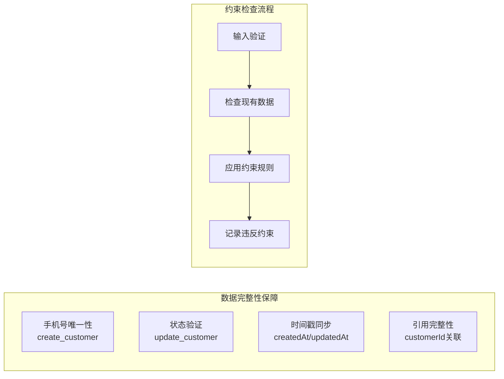

**图表来源**
- [models/customer.py](file://models/customer.py#L38-L64)
- [models/order.py](file://models/order.py#L28-L52)
- [models/position.py](file://models/position.py#L152-L170)

**章节来源**
- [models/customer.py](file://models/customer.py#L38-L64)
- [models/order.py](file://models/order.py#L28-L52)
- [models/position.py](file://models/position.py#L152-L170)

### 事务处理与并发控制

#### 并发控制机制

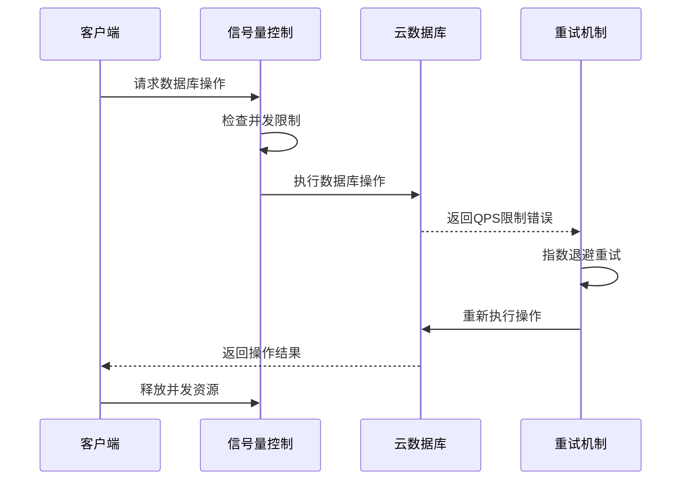

**图表来源**
- [services/cloud_db.js](file://services/cloud_db.js#L57-L70)
- [services/cloud_db.js](file://services/cloud_db.js#L127-L132)

#### 事务处理策略

| 事务场景 | 处理方式 | 实现策略 |
|---------|----------|----------|
| 单文档操作 | 原子性保证 | 云数据库单文档更新 |
| 多文档操作 | 最终一致性 | 批量操作 + 错误重试 |
| 跨集合操作 | 分布式事务 | 应用层补偿机制 |
| 高并发场景 | 乐观锁 | 版本号控制 |

**章节来源**
- [services/cloud_db.js](file://services/cloud_db.js#L57-L70)
- [services/cloud_db.js](file://services/cloud_db.js#L127-L132)

## 依赖关系分析

### 组件依赖图

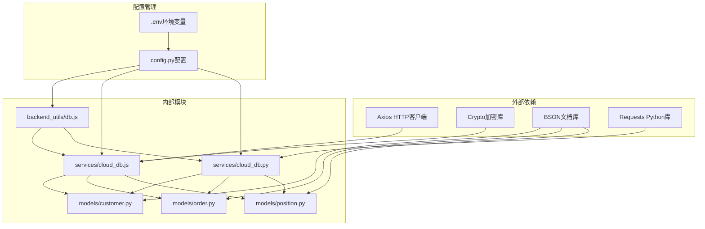

**图表来源**
- [backend_utils/db.js](file://backend_utils/db.js#L1-L64)
- [services/cloud_db.js](file://services/cloud_db.js#L1-L25)
- [services/cloud_db.py](file://services/cloud_db.py#L1-L12)
- [models/customer.py](file://models/customer.py#L1-L8)
- [models/order.py](file://models/order.py#L1-L8)
- [models/position.py](file://models/position.py#L1-L8)

**章节来源**
- [backend_utils/db.js](file://backend_utils/db.js#L1-L64)
- [services/cloud_db.js](file://services/cloud_db.js#L1-L25)
- [services/cloud_db.py](file://services/cloud_db.py#L1-L12)

### 数据流依赖

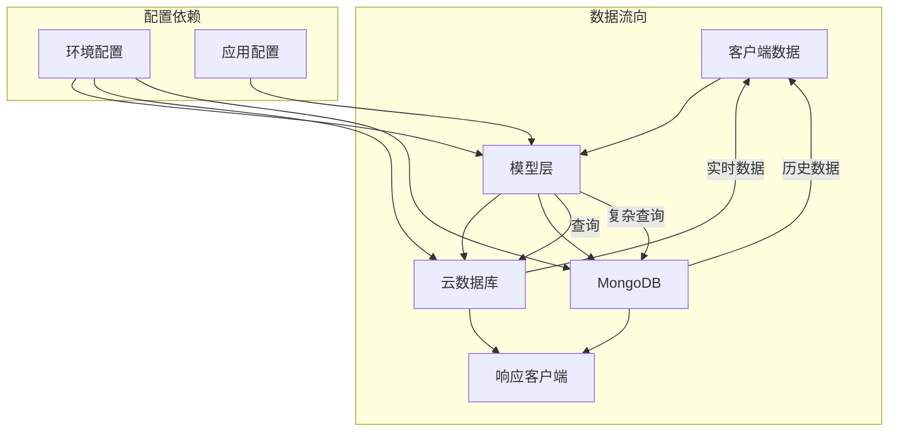

**图表来源**
- [config.py](file://config.py#L27-L46)
- [app.py](file://app.py#L69-L88)

**章节来源**
- [config.py](file://config.py#L27-L46)
- [app.py](file://app.py#L69-L88)

## 性能考虑

### 连接池管理

系统实现了智能的连接池管理机制：

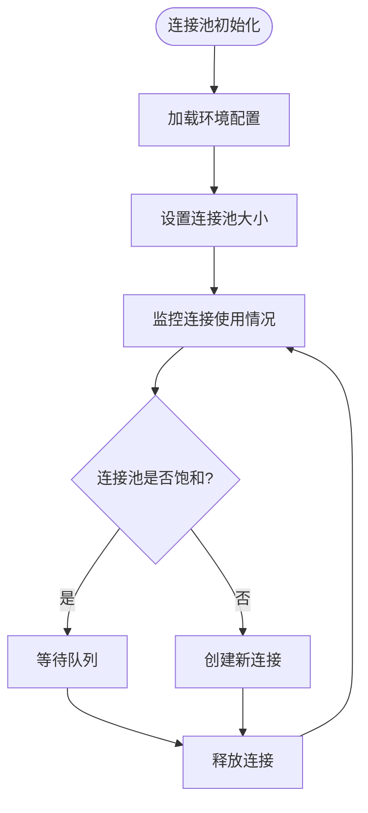

**图表来源**
- [services/cloud_db.js](file://services/cloud_db.js#L21-L25)
- [services/cloud_db.py](file://services/cloud_db.py#L121-L138)

### 缓存策略

#### 内存缓存机制

| 缓存类型 | 缓存内容 | 缓存策略 | 过期时间 |
|---------|----------|----------|----------|
| 访问令牌 | 微信API访问令牌 | LRU缓存 | 7200秒 |
| 查询结果 | 频繁查询数据 | 按需缓存 | 300秒 |
| 配置信息 | 应用配置参数 | 永久缓存 | 应用重启 |
| 会话数据 | 用户会话信息 | 会话级缓存 | 会话结束 |

**章节来源**
- [services/cloud_db.js](file://services/cloud_db.js#L13-L14)
- [services/cloud_db.py](file://services/cloud_db.py#L54-L67)

### 查询优化

#### 查询性能优化策略

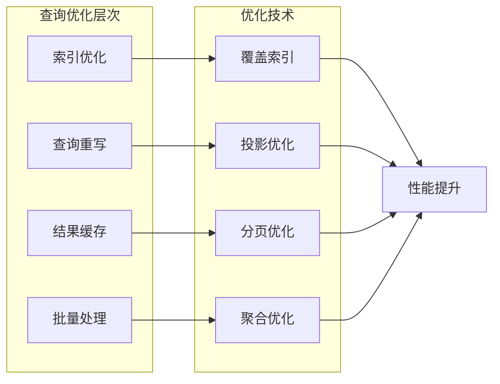

**图表来源**
- [models/customer.py](file://models/customer.py#L124-L149)
- [models/order.py](file://models/order.py#L54-L77)

**章节来源**
- [models/customer.py](file://models/customer.py#L124-L149)
- [models/order.py](file://models/order.py#L54-L77)

## 故障排除指南

### 常见问题诊断

#### 数据库连接问题

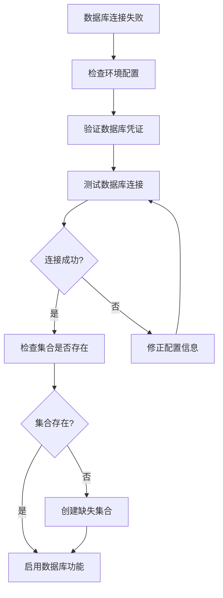

**图表来源**
- [app.py](file://app.py#L74-L88)
- [services/cloud_db.js](file://services/cloud_db.js#L32-L36)

#### 云数据库API错误处理

| 错误类型 | 错误代码 | 处理策略 | 重试次数 |
|---------|----------|----------|----------|
| QPS限制 | Rate Limit | 指数退避 | 3次 |
| 网络超时 | Timeout | 线性退避 | 3次 |
| 认证失败 | 401 | 重新获取令牌 | 1次 |
| 集合不存在 | 404 | 创建集合 | 0次 |
| 数据库错误 | 5xx | 指数退避 | 3次 |

**章节来源**
- [app.py](file://app.py#L74-L88)
- [services/cloud_db.js](file://services/cloud_db.js#L127-L139)
- [services/cloud_db.py](file://services/cloud_db.py#L526-L532)

### 监控与日志

#### 日志记录策略

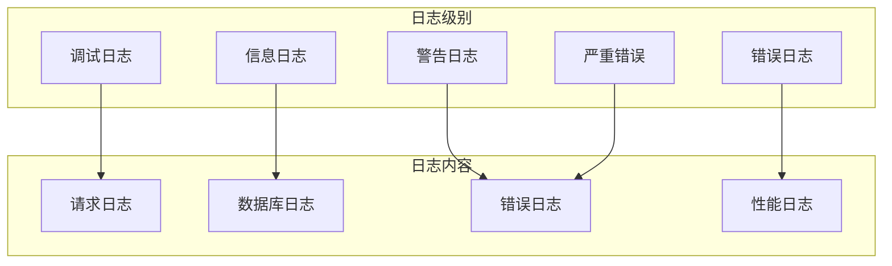

**图表来源**
- [config.py](file://config.py#L80-L93)
- [services/cloud_db.js](file://services/cloud_db.js#L210-L218)

**章节来源**
- [config.py](file://config.py#L80-L93)
- [services/cloud_db.js](file://services/cloud_db.js#L210-L218)

## 结论

本数据库架构设计充分考虑了场外期权交易系统的特殊需求，通过混合数据源架构实现了以下优势：

### 核心优势

1. **灵活性**：支持多种数据库后端，适应不同场景需求
2. **可靠性**：完善的错误处理和重试机制
3. **可扩展性**：模块化的架构设计便于功能扩展
4. **性能优化**：多层次的性能优化策略

### 改进建议

1. **索引优化**：增加更多复合索引以提升查询性能
2. **缓存策略**：实施更精细的缓存管理机制
3. **监控完善**：建立更全面的数据库监控体系
4. **备份方案**：制定详细的数据库备份和恢复策略

## 附录

### 环境变量配置

| 配置项 | 类型 | 默认值 | 说明 |
|--------|------|--------|------|
| MONGO_URI | String | mongodb://localhost:27017/option_data | MongoDB连接字符串 |
| WX_CLOUD_ENV | String | develop-8gx7kh9g045e6c9a | 微信云环境ID |
| WX_APPID | String | wx83166cb97bfc0d4c | 微信应用ID |
| WX_SECRET | String | c3c07d84d767389457ec69eb2828dac7 | 微信应用密钥 |
| FILE_DB_PATH | String | mock_db.json | 本地Mock存储路径 |
| DATA_SOURCE_MODE | String | hybrid | 数据源模式 |

**章节来源**
- [.env](file://.env#L17-L31)

### 部署配置

#### 开发环境配置

```yaml
# 开发环境配置示例
environment: development
database:
  mongo_uri: mongodb://localhost:27017/option_data_dev
  database_name: option_trading_dev
cloud:
  env_id: develop-8gx7kh9g045e6c9a
  app_id: wx83166cb97bfc0d4c
  secret: c3c07d84d767389457ec69eb2828dac7
```

#### 生产环境配置

```yaml
# 生产环境配置示例
environment: production
database:
  mongo_uri: mongodb://prod-server:27017/option_data_prod
  database_name: option_trading_prod
  ssl_enabled: true
cloud:
  env_id: prod-env-id
  app_id: prod-app-id
  secret: prod-secret
  verify_ssl: true
```

**章节来源**
- [config.py](file://config.py#L95-L124)