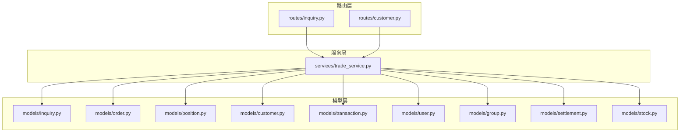
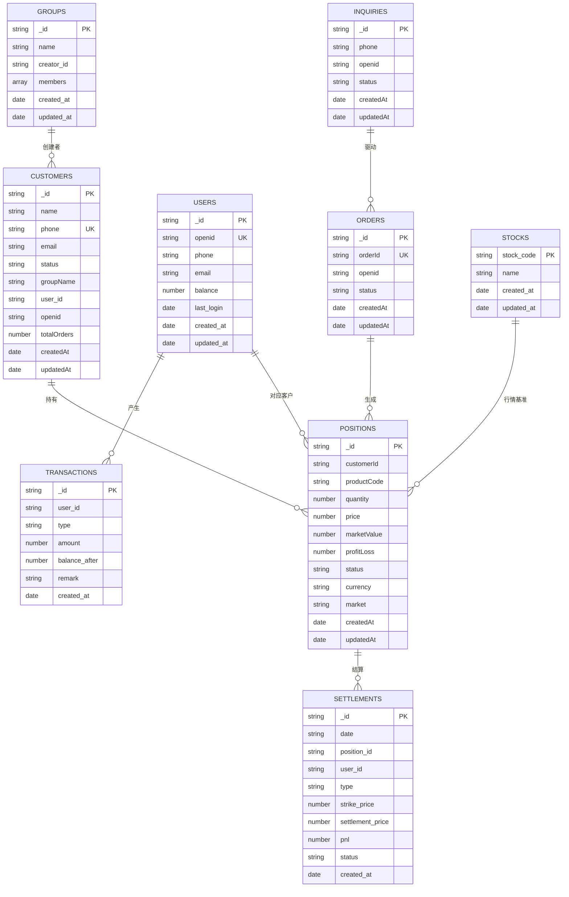
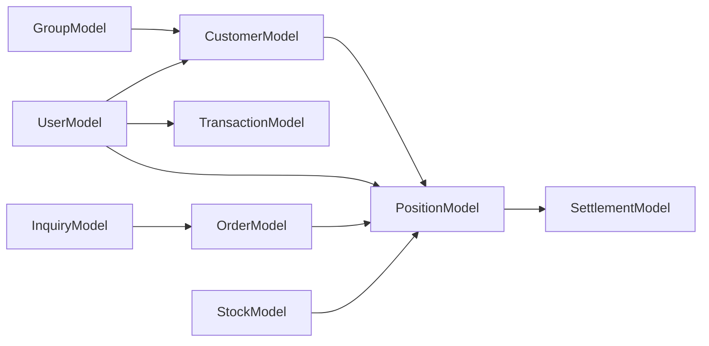

# 数据模型设计

<cite>
**本文引用的文件**
- [models/customer.py](file://models/customer.py)
- [models/inquiry.py](file://models/inquiry.py)
- [models/order.py](file://models/order.py)
- [models/position.py](file://models/position.py)
- [models/transaction.py](file://models/transaction.py)
- [models/group.py](file://models/group.py)
- [models/settlement.py](file://models/settlement.py)
- [models/user.py](file://models/user.py)
- [models/stock.py](file://models/stock.py)
- [routes/inquiry.py](file://routes/inquiry.py)
- [routes/customer.py](file://routes/customer.py)
- [services/trade_service.py](file://services/trade_service.py)
</cite>

## 目录
1. [简介](#简介)
2. [项目结构](#项目结构)
3. [核心组件](#核心组件)
4. [架构总览](#架构总览)
5. [详细组件分析](#详细组件分析)
6. [依赖分析](#依赖分析)
7. [性能考量](#性能考量)
8. [故障排查指南](#故障排查指南)
9. [结论](#结论)
10. [附录](#附录)

## 简介
本文件面向场外期权交易系统，系统性梳理核心数据模型的设计与实现，覆盖询价、订单、持仓、客户、资金交易、用户会话、分组、结算以及行情等关键实体。文档从字段定义、数据类型、约束条件与业务规则出发，解释实体关系与索引策略，并给出序列化/反序列化、时间戳管理、数据校验与完整性保障机制。同时提供常见查询模式、实例化示例与最佳实践，帮助开发者与运维人员高效理解与维护系统。

## 项目结构
系统采用“模型-服务-路由”分层组织，数据模型位于 models 目录，业务逻辑封装于 services，接口路由位于 routes。TradeService 统一协调询价、订单、持仓、资金等模型交互；路由层负责鉴权与参数解析，最终调用服务层完成数据操作。

图表来源
- [routes/inquiry.py](file://routes/inquiry.py#L1-L175)
- [routes/customer.py](file://routes/customer.py#L1-L217)
- [services/trade_service.py](file://services/trade_service.py#L1-L318)
- [models/inquiry.py](file://models/inquiry.py#L1-L148)
- [models/order.py](file://models/order.py#L1-L119)
- [models/position.py](file://models/position.py#L1-L206)
- [models/customer.py](file://models/customer.py#L1-L300)
- [models/transaction.py](file://models/transaction.py#L1-L61)
- [models/user.py](file://models/user.py#L1-L309)
- [models/group.py](file://models/group.py#L1-L283)
- [models/settlement.py](file://models/settlement.py#L1-L57)
- [models/stock.py](file://models/stock.py#L1-L386)

章节来源
- [routes/inquiry.py](file://routes/inquiry.py#L1-L175)
- [routes/customer.py](file://routes/customer.py#L1-L217)
- [services/trade_service.py](file://services/trade_service.py#L1-L318)

## 核心组件
本节对各数据模型进行字段、类型、约束与业务规则的归纳，便于快速查阅与对比。

- 客户模型（CustomerModel）
  - 字段要点：name、phone（唯一）、email、status、groupName、user_id、openid、totalOrders、createdAt、updatedAt
  - 约束与规则：phone 在本地/云数据库均唯一；创建时自动设置 createdAt/updatedAt；支持按状态与关键词检索；支持分组重命名
  - 关系：与用户模型通过 user_id/ openid 关联；与订单/持仓通过 customer_id 关联
  - 索引：无显式索引定义，建议按 phone/status/createdAt 建立复合索引

- 询价模型（InquiryModel）
  - 字段要点：createdAt、updatedAt、status（默认 pending）、phone、openid、产品与客户相关信息
  - 约束与规则：status 默认 pending；支持按 status/openid 查询；创建时统一设置时间戳
  - 关系：与客户/用户通过 phone/openid 关联；作为订单生成的前置流程
  - 索引：createdAt、status、phone（本地Mongo）

- 订单模型（OrderModel）
  - 字段要点：orderId（唯一，自动生成）、createdAt、updatedAt、status、openid、产品与金额信息
  - 约束与规则：orderId 唯一；若未提供则按时间戳生成；支持按 status/openid 查询
  - 关系：与客户/持仓通过 customer_id/openid 关联；与结算通过 position_id 关联
  - 索引：orderId（唯一）、createdAt（本地Mongo）

- 持仓模型（PositionModel）
  - 字段要点：customerId、productCode、quantity、price、marketValue、profitLoss、status、currency、market、createdAt、updatedAt
  - 约束与规则：默认 status=active、currency=CNY、market=CN；支持按 customer_id 查询；提供统计聚合（本地Mongo聚合）
  - 关系：与客户/订单通过 customerId 关联；与结算通过 position_id 关联
  - 索引：customerId、productCode（本地Mongo）

- 资金交易模型（TransactionModel）
  - 字段要点：user_id、type（deposit/withdraw/buy/sell/fee）、amount、balance_after、remark、created_at
  - 约束与规则：按 user_id 查询与计数；创建时统一设置时间戳
  - 关系：与用户通过 user_id 关联；用于账户余额变动记录

- 用户模型（UserModel）
  - 字段要点：用户基本信息、微信 openid、phone/email、balance、last_login、created_at/updated_at；会话表 user_sessions
  - 约束与规则：支持按 openid/phone/email 查找；余额原子性更新（本地实现）；会话有效期与激活状态管理
  - 关系：与客户通过 user_id/openid 关联；与资金交易通过 user_id 关联

- 分组模型（GroupModel）
  - 字段要点：name、creator_id、members（stock_code/market/name/added_at）、created_at/updated_at
  - 约束与规则：成员去重；支持添加/移除成员；按 creator_id 查询
  - 关系：与股票数据通过 stock_code 关联；与客户/用户通过 creator_id 关联

- 结算模型（SettlementModel）
  - 字段要点：date、position_id、user_id、type（expiry/exercise）、strike_price、settlement_price、pnl、status、created_at
  - 约束与规则：按 user_id 查询与分页；创建时统一设置时间戳
  - 关系：与持仓/用户通过 position_id/user_id 关联

- 股票模型（StockModel）
  - 字段要点：stock_code（唯一）、行情字段、created_at/updated_at
  - 约束与规则：stock_code 唯一；支持批量写入；本地文件缓存与原子写入
  - 关系：与持仓/询价通过 productCode 关联；为实时行情计算提供基础

章节来源
- [models/customer.py](file://models/customer.py#L1-L300)
- [models/inquiry.py](file://models/inquiry.py#L1-L148)
- [models/order.py](file://models/order.py#L1-L119)
- [models/position.py](file://models/position.py#L1-L206)
- [models/transaction.py](file://models/transaction.py#L1-L61)
- [models/user.py](file://models/user.py#L1-L309)
- [models/group.py](file://models/group.py#L1-L283)
- [models/settlement.py](file://models/settlement.py#L1-L57)
- [models/stock.py](file://models/stock.py#L1-L386)

## 架构总览
下图展示数据模型间的实体关系与典型交互路径，体现询价-订单-持仓-结算的资金闭环与客户关联。

图表来源
- [models/customer.py](file://models/customer.py#L1-L300)
- [models/user.py](file://models/user.py#L1-L309)
- [models/inquiry.py](file://models/inquiry.py#L1-L148)
- [models/order.py](file://models/order.py#L1-L119)
- [models/position.py](file://models/position.py#L1-L206)
- [models/settlement.py](file://models/settlement.py#L1-L57)
- [models/transaction.py](file://models/transaction.py#L1-L61)
- [models/group.py](file://models/group.py#L1-L283)
- [models/stock.py](file://models/stock.py#L1-L386)

## 详细组件分析

### 客户模型（CustomerModel）
- 字段与类型
  - 基础标识：_id（Mongo ObjectId 或云ID字符串）
  - 联系信息：name、phone（唯一）、email
  - 状态与分组：status、groupName
  - 关联标识：user_id、openid
  - 统计与时间：totalOrders、createdAt、updatedAt
- 约束与规则
  - phone 唯一性：本地与云数据库均检查重复
  - 时间戳：统一使用 ISO 字符串（云）或 datetime 对象（本地）
  - 查询：支持按 status 与关键词（名称/电话）模糊检索；分页排序
  - 分组：支持列出分组与批量重命名
- 关系与索引
  - 与用户模型通过 user_id/openid 关联
  - 与订单/持仓通过 customer_id 关联
  - 建议索引：phone（唯一）、status、createdAt
- 序列化与时间戳
  - 云数据库返回的 _id 统一转为字符串；时间字段在本地序列化为 ISO 字符串
- 最佳实践
  - 创建前先按 phone 检查是否存在
  - 更新时仅允许白名单字段（name、phone、email、status、groupName）

章节来源
- [models/customer.py](file://models/customer.py#L1-L300)

### 询价模型（InquiryModel）
- 字段与类型
  - 标识：_id
  - 客户与产品：phone、openid、产品选择信息
  - 状态与时间：status（默认 pending）、createdAt、updatedAt
- 约束与规则
  - status 默认值与查询过滤
  - 云/本地一致的时间戳处理
  - 支持按 status/openid 查询与分页
- 关系与索引
  - 与客户/用户通过 phone/openid 关联
  - 本地建立 createdAt、status、phone 索引
- 最佳实践
  - 提交前校验 selectedProduct 存在
  - 管理端批量更新状态时逐条记录操作人

章节来源
- [models/inquiry.py](file://models/inquiry.py#L1-L148)
- [routes/inquiry.py](file://routes/inquiry.py#L1-L175)

### 订单模型（OrderModel）
- 字段与类型
  - 标识：_id、orderId（唯一）
  - 客户与产品：openid、产品与金额信息
  - 状态与时间：status、createdAt、updatedAt
- 约束与规则
  - orderId 唯一；未提供时按时间戳生成
  - 支持按 status/openid 查询与分页
- 关系与索引
  - 与客户/持仓通过 customer_id/openid 关联
  - 本地建立 orderId（唯一）、createdAt 索引
- 最佳实践
  - 订单生成后驱动持仓创建
  - 状态变更需幂等处理

章节来源
- [models/order.py](file://models/order.py#L1-L119)

### 持仓模型（PositionModel）
- 字段与类型
  - 标识：_id
  - 客户与产品：customerId、productCode
  - 数量与价值：quantity、price、marketValue、profitLoss
  - 状态与属性：status、currency、market
  - 时间：createdAt、updatedAt
- 约束与规则
  - 默认值：status=active、currency=CNY、market=CN
  - 本地支持聚合统计（总市值、总盈亏、数量）
  - 云数据库受限，采用拉取+内存聚合
- 关系与索引
  - 与客户/订单通过 customerId 关联
  - 本地建立 customerId、productCode 索引
- 最佳实践
  - 实时行情计算在服务层完成，模型仅持久化快照
  - 批量创建时统一设置时间戳与默认值

章节来源
- [models/position.py](file://models/position.py#L1-L206)

### 资金交易模型（TransactionModel）
- 字段与类型
  - 标识：_id
  - 用户与交易：user_id、type、amount、balance_after、remark
  - 时间：created_at
- 约束与规则
  - 按 user_id 查询与计数
  - 云/本地统一时间戳处理
- 关系
  - 与用户通过 user_id 关联
- 最佳实践
  - 余额变动与交易记录成对写入

章节来源
- [models/transaction.py](file://models/transaction.py#L1-L61)

### 用户模型（UserModel）
- 字段与类型
  - 标识：_id、openid（唯一）、phone、email
  - 账户与行为：balance、last_login、created_at/updated_at
  - 会话：user_sessions（user_id、device_info、ip、refresh_token_hash、expires_at、is_active）
  - 管理员：admin_users（username、密码哈希、创建/更新时间）
- 约束与规则
  - openid 唯一；余额原子性更新（本地）
  - 会话有效期与激活状态管理
  - 支持按用户名/邮箱查找管理员
- 关系
  - 与客户通过 user_id/openid 关联
  - 与资金交易通过 user_id 关联
- 最佳实践
  - 登录成功后更新 last_login
  - 会话撤销后禁止复用

章节来源
- [models/user.py](file://models/user.py#L1-L309)

### 分组模型（GroupModel）
- 字段与类型
  - 标识：_id
  - 基本信息：name、creator_id
  - 成员：members（stock_code、market、name、added_at）
  - 时间：created_at/updated_at
- 约束与规则
  - 成员去重；支持添加/移除成员
  - 按 creator_id 查询
- 关系
  - 与股票通过 stock_code 关联
  - 与客户/用户通过 creator_id 关联
- 最佳实践
  - 添加成员前先检查是否已存在
  - 移除成员时同步更新 updated_at

章节来源
- [models/group.py](file://models/group.py#L1-L283)

### 结算模型（SettlementModel）
- 字段与类型
  - 标识：_id
  - 结算信息：date、position_id、user_id、type、strike_price、settlement_price、pnl、status
  - 时间：created_at
- 约束与规则
  - 按 user_id 查询与分页
- 关系
  - 与持仓/用户通过 position_id/user_id 关联
- 最佳实践
  - 结算完成后更新持仓状态与资金流水

章节来源
- [models/settlement.py](file://models/settlement.py#L1-L57)

### 股票模型（StockModel）
- 字段与类型
  - 标识：stock_code（唯一）
  - 行情与时间：name、created_at、updated_at
- 约束与规则
  - stock_code 唯一；支持批量 upsert
  - 本地文件缓存与原子写入
- 关系
  - 与持仓通过 productCode 关联
- 最佳实践
  - 批量写入时统一设置 updated_at 与 created_at
  - 本地缓存失效与重建

章节来源
- [models/stock.py](file://models/stock.py#L1-L386)

## 依赖分析
- 模型间耦合
  - 客户/用户：双向关联（user_id/openid），用于统一身份与权限
  - 订单/持仓：订单驱动持仓创建，持仓参与结算
  - 询价：驱动订单生成，间接影响客户统计
  - 资金：用户余额与交易流水一一对应
  - 股票：为持仓提供实时行情基准
- 外部依赖
  - 云数据库与本地 MongoDB 并存，模型层通过 _is_cloud 判断分支
  - Flask 路由层负责鉴权与参数解析，服务层统一分发
- 潜在环路
  - 无直接循环依赖；服务层聚合调用各模型，避免环状耦合

图表来源
- [models/customer.py](file://models/customer.py#L1-L300)
- [models/user.py](file://models/user.py#L1-L309)
- [models/order.py](file://models/order.py#L1-L119)
- [models/position.py](file://models/position.py#L1-L206)
- [models/inquiry.py](file://models/inquiry.py#L1-L148)
- [models/stock.py](file://models/stock.py#L1-L386)
- [models/group.py](file://models/group.py#L1-L283)
- [models/settlement.py](file://models/settlement.py#L1-L57)
- [models/transaction.py](file://models/transaction.py#L1-L61)

章节来源
- [services/trade_service.py](file://services/trade_service.py#L1-L318)

## 性能考量
- 索引策略
  - 本地Mongo：Inquiries(status, phone, createdAt)、Orders(orderId唯一, createdAt)、Positions(customerId, productCode)、Stocks(stock_code唯一, createdAt, updated_at)
  - 云数据库：索引能力受限，优先在查询侧加条件与分页
- 查询优化
  - 分页与排序：统一按 createdAt 倒序；skip/limit 控制
  - 聚合统计：本地使用聚合管道；云数据库采用拉取+内存聚合
- 序列化与时间戳
  - 云数据库统一返回 ISO 字符串；本地序列化时转换为 ISO 字符串
- 批量操作
  - 股票与持仓支持批量 upsert；注意幂等与一致性
- 缓存与文件存储
  - 股票模型提供本地文件缓存与原子写入，降低频繁写入开销

[本节为通用性能指导，无需特定文件引用]

## 故障排查指南
- 云数据库集合缺失
  - 现象：创建/查询时报集合不存在
  - 处理：在云开发控制台创建对应集合后重试
- 重复键冲突
  - 现象：phone 或 orderId 重复
  - 处理：提交前先查询；订单模型自动生成 orderId 避免冲突
- 时间戳不一致
  - 现象：JSON 序列化失败或前端显示异常
  - 处理：模型层统一转换为 ISO 字符串；本地查询时也做转换
- 余额不足
  - 现象：提现失败
  - 处理：余额原子性更新，不足时抛出异常；前端提示

章节来源
- [models/customer.py](file://models/customer.py#L38-L64)
- [models/order.py](file://models/order.py#L32-L52)
- [models/user.py](file://models/user.py#L291-L309)

## 结论
本系统通过清晰的数据模型分层与强一致的业务规则，实现了从询价到结算的完整闭环。模型层对云/本地双栈兼容，服务层统一编排，路由层严格鉴权与参数校验。建议后续在云数据库场景补充更多索引与聚合能力，持续优化查询与统计性能，并完善审计与回放机制以增强可观测性。

[本节为总结性内容，无需特定文件引用]

## 附录

### 常用查询模式
- 获取客户列表（分页、按状态/关键词）
  - 路由：GET /customers
  - 服务：CustomerModel.get_customers(page, page_size, status, keyword)
- 创建询价
  - 路由：POST /inquiry
  - 服务：TradeService.create_inquiry(data)
- 获取订单列表（分页、按状态/openid）
  - 服务：OrderModel.get_orders(limit, skip, status, user_id)
- 获取持仓列表（分页、按客户）
  - 服务：PositionModel.get_positions(limit, skip, customer_id)
- 获取资金交易流水（分页、按用户）
  - 服务：TransactionModel.get_transactions(user_id, limit, skip)

章节来源
- [routes/customer.py](file://routes/customer.py#L26-L69)
- [routes/inquiry.py](file://routes/inquiry.py#L11-L34)
- [services/trade_service.py](file://services/trade_service.py#L38-L105)
- [models/order.py](file://models/order.py#L54-L97)
- [models/position.py](file://models/position.py#L28-L63)
- [models/transaction.py](file://models/transaction.py#L41-L51)

### 数据模型实例化示例（路径指引）
- 创建客户
  - 路径：models/customer.py::CustomerModel.create_customer(data)
  - 参考：routes/customer.py::create_customer()
- 提交询价
  - 路径：models/inquiry.py::InquiryModel.create_inquiry(data)
  - 参考：routes/inquiry.py::create_inquiry()
- 创建订单
  - 路径：models/order.py::OrderModel.create_order(data)
  - 参考：services/trade_service.py::create_order()
- 创建持仓
  - 路径：models/position.py::PositionModel.create_position(data)
  - 参考：services/trade_service.py::create_position()
- 资金充值/提现
  - 路径：models/user.py::UserModel.update_balance(user_id, amount)
  - 路径：models/transaction.py::TransactionModel.create_transaction(data)
  - 参考：services/trade_service.py::deposit()/withdraw()

章节来源
- [models/customer.py](file://models/customer.py#L23-L64)
- [routes/customer.py](file://routes/customer.py#L102-L131)
- [models/inquiry.py](file://models/inquiry.py#L32-L53)
- [routes/inquiry.py](file://routes/inquiry.py#L11-L34)
- [models/order.py](file://models/order.py#L28-L52)
- [services/trade_service.py](file://services/trade_service.py#L98-L100)
- [models/position.py](file://models/position.py#L152-L170)
- [services/trade_service.py](file://services/trade_service.py#L166-L178)
- [models/user.py](file://models/user.py#L291-L309)
- [models/transaction.py](file://models/transaction.py#L19-L39)
- [services/trade_service.py](file://services/trade_service.py#L281-L310)

### 序列化/反序列化与时间戳管理
- 云数据库：统一将 ObjectId/_id 转为字符串；时间字段转为 ISO 字符串
- 本地数据库：查询结果序列化时将 datetime 转为 ISO 字符串
- 路由层：统一返回 JSON，避免直接暴露内部对象

章节来源
- [models/customer.py](file://models/customer.py#L171-L176)
- [models/inquiry.py](file://models/inquiry.py#L97-L99)
- [models/order.py](file://models/order.py#L93-L96)
- [models/position.py](file://models/position.py#L58-L62)
- [models/transaction.py](file://models/transaction.py#L29-L30)