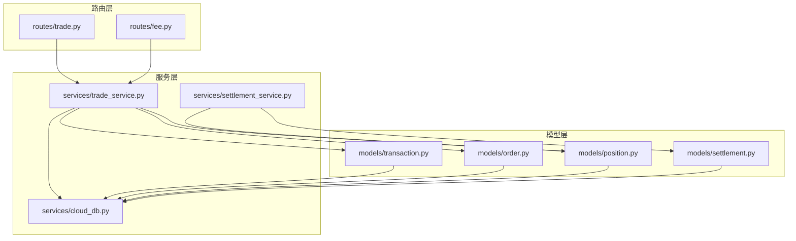
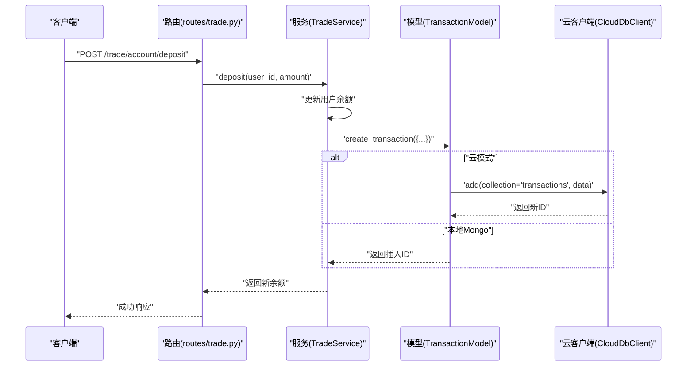
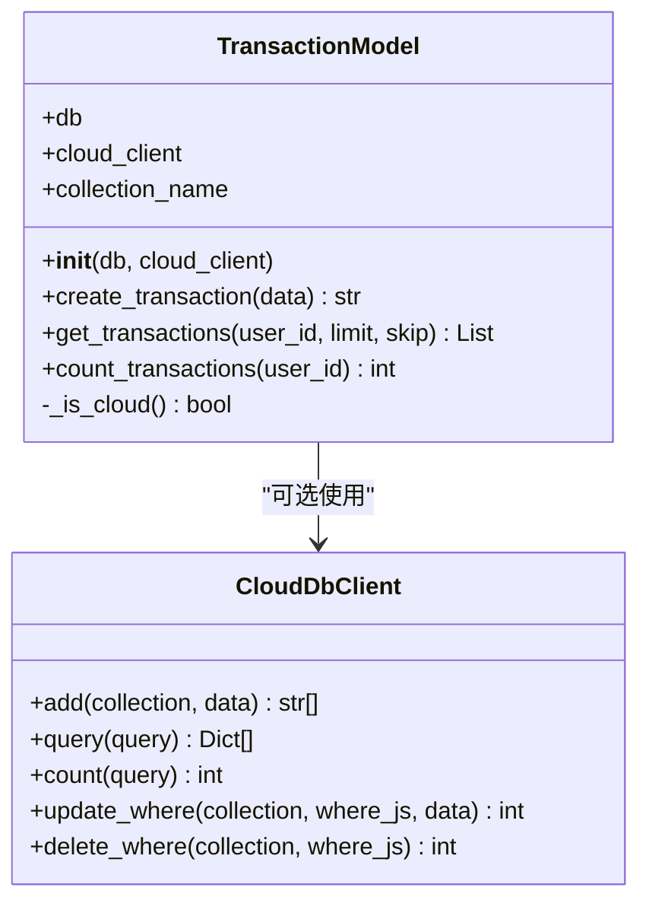
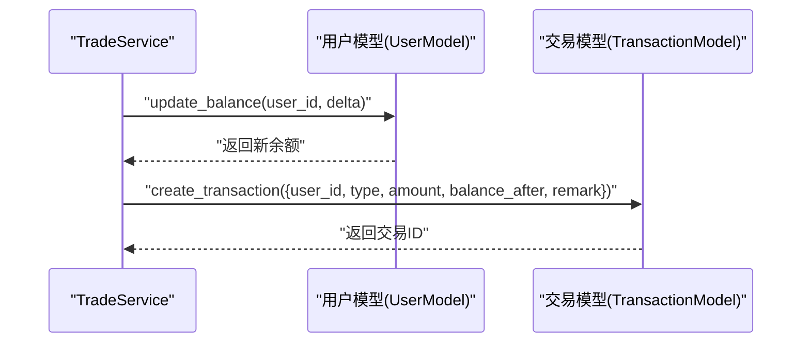
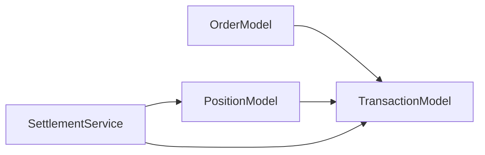
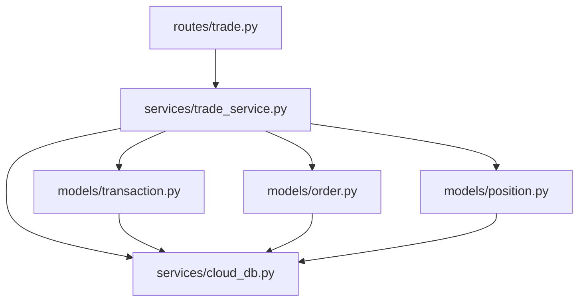

# 交易模型

<cite>
**本文引用的文件**
- [models/transaction.py](file://models/transaction.py)
- [services/trade_service.py](file://services/trade_service.py)
- [routes/trade.py](file://routes/trade.py)
- [services/cloud_db.py](file://services/cloud_db.py)
- [models/order.py](file://models/order.py)
- [models/position.py](file://models/position.py)
- [services/settlement_service.py](file://services/settlement_service.py)
- [models/settlement.py](file://models/settlement.py)
- [routes/fee.py](file://routes/fee.py)
- [tests/test_account.py](file://tests/test_account.py)
</cite>

## 目录
1. [引言](#引言)
2. [项目结构](#项目结构)
3. [核心组件](#核心组件)
4. [架构总览](#架构总览)
5. [详细组件分析](#详细组件分析)
6. [依赖分析](#依赖分析)
7. [性能考虑](#性能考虑)
8. [故障排查指南](#故障排查指南)
9. [结论](#结论)
10. [附录](#附录)

## 引言
本文件聚焦于交易模型的详细设计与实现，围绕 TransactionModel 类展开，系统性说明其字段定义、数据类型、业务属性与约束条件；解释交易记录的生成时机、与订单与持仓的关系；文档化交易查询优化策略、历史数据管理与统计分析能力；并提供交易记录创建、查询与统计的代码示例路径，以及交易数据的审计追踪、合规与归档策略建议。

## 项目结构
交易相关的核心代码分布在以下模块：
- 模型层：交易模型、订单模型、持仓模型、结算模型
- 服务层：交易服务、云数据库客户端、结算服务
- 路由层：交易路由、费用路由
- 测试：账户流测试，覆盖充值、提现与交易流水查询

图表来源
- [routes/trade.py](file://routes/trade.py#L1-L330)
- [routes/fee.py](file://routes/fee.py#L1-L156)
- [services/trade_service.py](file://services/trade_service.py#L1-L318)
- [services/settlement_service.py](file://services/settlement_service.py#L1-L113)
- [services/cloud_db.py](file://services/cloud_db.py#L1-L533)
- [models/transaction.py](file://models/transaction.py#L1-L61)
- [models/order.py](file://models/order.py#L1-L119)
- [models/position.py](file://models/position.py#L1-L206)
- [models/settlement.py](file://models/settlement.py#L1-L57)

章节来源
- [routes/trade.py](file://routes/trade.py#L1-L330)
- [routes/fee.py](file://routes/fee.py#L1-L156)
- [services/trade_service.py](file://services/trade_service.py#L1-L318)
- [services/settlement_service.py](file://services/settlement_service.py#L1-L113)
- [services/cloud_db.py](file://services/cloud_db.py#L1-L533)
- [models/transaction.py](file://models/transaction.py#L1-L61)
- [models/order.py](file://models/order.py#L1-L119)
- [models/position.py](file://models/position.py#L1-L206)
- [models/settlement.py](file://models/settlement.py#L1-L57)

## 核心组件
- 交易模型 TransactionModel：负责交易流水的创建、分页查询与计数，支持本地 MongoDB 与微信云开发两种存储后端。
- 交易服务 TradeService：封装账户资产汇总、充值/提现、交易流水查询等业务逻辑，并协调用户、订单、持仓模型。
- 云数据库客户端 CloudDbClient：抽象云开发数据库的查询、计数、新增、更新、删除等操作，提供并发与重试机制。
- 订单模型 OrderModel：订单创建、查询与状态更新，包含索引与时间戳字段。
- 持仓模型 PositionModel：持仓的增删改查、统计聚合（本地支持聚合，云侧受限）。
- 结算服务 SettlementService：按到期日进行自动结算，计算损益并入账。
- 结算模型 SettlementModel：结算记录的持久化与查询。
- 费用路由 fee.py：费用记录的增删查与统计。

章节来源
- [models/transaction.py](file://models/transaction.py#L6-L61)
- [services/trade_service.py](file://services/trade_service.py#L249-L318)
- [services/cloud_db.py](file://services/cloud_db.py#L108-L533)
- [models/order.py](file://models/order.py#L10-L119)
- [models/position.py](file://models/position.py#L10-L206)
- [services/settlement_service.py](file://services/settlement_service.py#L10-L113)
- [models/settlement.py](file://models/settlement.py#L5-L57)
- [routes/fee.py](file://routes/fee.py#L1-L156)

## 架构总览
交易模型在系统中的位置如下：
- 路由层接收请求，调用服务层；
- 服务层协调模型层与云数据库客户端；
- 模型层负责具体集合的 CRUD 与查询；
- 云数据库客户端统一处理云端 API 的请求、并发与错误。

图表来源
- [routes/trade.py](file://routes/trade.py#L278-L295)
- [services/trade_service.py](file://services/trade_service.py#L281-L294)
- [models/transaction.py](file://models/transaction.py#L19-L39)
- [services/cloud_db.py](file://services/cloud_db.py#L272-L284)

## 详细组件分析

### TransactionModel 设计与实现
- 角色定位：交易流水的唯一数据载体，记录资金变动与余额快照。
- 字段定义与约束
  - user_id：字符串，用户标识，用于查询过滤与审计。
  - type：字符串，枚举值包括 deposit（充值）、withdraw（提现）、buy（买入）、sell（卖出）、fee（手续费）。用于区分流水类型。
  - amount：数值，金额，正数表示流入，负数表示流出。
  - balance_after：数值，变动后的余额快照，用于对账与审计。
  - remark：字符串，备注说明，便于追溯用途。
  - created_at：时间戳，UTC ISO 格式字符串，作为排序主键。
- 生成时机
  - 充值/提现：由 TradeService 在更新用户余额后创建对应交易记录。
  - 买入/卖出/手续费：由订单成交与结算流程触发（见“与订单和持仓的关联关系”）。
- 查询与统计
  - 分页查询：按 created_at 降序，支持 limit/skip。
  - 计数：按 user_id 统计总数，用于分页总条目。
- 云/本地适配
  - 通过 _is_cloud 判断是否使用 CloudDbClient，统一 add/query/count 接口。

图表来源
- [models/transaction.py](file://models/transaction.py#L6-L61)
- [services/cloud_db.py](file://services/cloud_db.py#L108-L330)

章节来源
- [models/transaction.py](file://models/transaction.py#L6-L61)

### 交易记录生成时机与业务流程
- 充值/提现
  - TradeService.deposit/withdraw 更新用户余额后，调用 TransactionModel.create_transaction 写入交易流水。
- 买入/卖出/手续费
  - 订单成交后，通常会触发持仓变更与资金变动，进而产生相应的交易流水记录（具体实现可扩展到订单成交回调中）。
- 结算
  - SettlementService 对到期持仓进行结算，若产生收益则通过 TradeService.deposit 入账，同时写入交易流水。

图表来源
- [services/trade_service.py](file://services/trade_service.py#L281-L310)
- [models/transaction.py](file://models/transaction.py#L19-L39)

章节来源
- [services/trade_service.py](file://services/trade_service.py#L281-L310)
- [models/transaction.py](file://models/transaction.py#L19-L39)

### 与订单和持仓的关联关系
- 订单模型 OrderModel
  - 订单创建时写入 createdAt/updatedAt，支持按状态与用户过滤查询。
  - 与交易模型的关联：订单成交后，通常会产生买入/卖出交易流水；若涉及手续费，也会产生 fee 类型流水。
- 持仓模型 PositionModel
  - 持仓记录包含产品代码、数量、成本价、市值、盈亏等字段；与交易模型的关联：交易行为直接影响持仓数量与成本价，从而影响后续的结算与统计。
- 结算服务 SettlementService
  - 基于到期日判断，对到期持仓进行结算，计算损益并入账，同时可能产生结算相关的交易流水。

图表来源
- [models/order.py](file://models/order.py#L28-L52)
- [models/position.py](file://models/position.py#L152-L170)
- [services/settlement_service.py](file://services/settlement_service.py#L62-L113)
- [models/transaction.py](file://models/transaction.py#L19-L39)

章节来源
- [models/order.py](file://models/order.py#L28-L52)
- [models/position.py](file://models/position.py#L152-L170)
- [services/settlement_service.py](file://services/settlement_service.py#L62-L113)

### 交易查询优化策略
- 分页与排序
  - 交易流水按 created_at 降序分页，避免全表扫描。
- 云侧限制
  - 云数据库查询语法有限，需通过字符串拼接构造 where/orderBy/skip/limit/count，注意字符串转义与字段名一致性。
- 计数与列表分离
  - 先 count 再 query，减少一次网络往返；本地 MongoDB 可直接 count_documents。
- 并发与重试
  - 云客户端内置信号量与指数退避重试，提升稳定性。

章节来源
- [models/transaction.py](file://models/transaction.py#L41-L60)
- [services/cloud_db.py](file://services/cloud_db.py#L209-L271)
- [services/cloud_db.py](file://services/cloud_db.py#L486-L533)

### 历史数据管理与统计分析
- 历史数据管理
  - 交易流水按用户维度分页查询与计数，适合长期积累的历史数据检索。
- 统计分析
  - 交易流水本身不直接聚合统计，可通过外部工具或定时任务对历史数据进行离线统计；费用路由提供费用统计接口，展示总收费、月收费与待收款。
- 与持仓统计的配合
  - 持仓模型在本地支持聚合统计（总市值、总盈亏、数量），云侧受限但可拉取全量后聚合。

章节来源
- [routes/fee.py](file://routes/fee.py#L69-L115)
- [models/position.py](file://models/position.py#L65-L118)

### 代码示例（路径）
- 创建交易记录
  - [services/trade_service.py](file://services/trade_service.py#L281-L294)
  - [models/transaction.py](file://models/transaction.py#L19-L39)
- 查询交易流水
  - [routes/trade.py](file://routes/trade.py#L317-L329)
  - [services/trade_service.py](file://services/trade_service.py#L312-L317)
  - [models/transaction.py](file://models/transaction.py#L41-L51)
- 统计交易条数
  - [services/trade_service.py](file://services/trade_service.py#L312-L317)
  - [models/transaction.py](file://models/transaction.py#L53-L60)
- 测试用例（账户流）
  - [tests/test_account.py](file://tests/test_account.py#L76-L99)

章节来源
- [services/trade_service.py](file://services/trade_service.py#L281-L310)
- [models/transaction.py](file://models/transaction.py#L19-L60)
- [routes/trade.py](file://routes/trade.py#L317-L329)
- [tests/test_account.py](file://tests/test_account.py#L76-L99)

### 审计追踪、合规与数据归档
- 审计追踪
  - 交易流水包含 user_id、type、amount、balance_after、created_at、remark，满足基本审计要素。
  - 建议：在路由层记录请求上下文（如操作员、IP、UA）以便扩展审计。
- 合规要求
  - 保存完整的交易时间戳与余额快照，便于监管检查。
  - 对敏感字段（如用户标识）进行脱敏处理（如仅显示部分）。
- 数据归档
  - 建议：对历史交易流水进行冷热分离，定期归档至低成本存储；归档前进行去重与压缩。

（本节为通用实践建议，不直接分析具体文件）

## 依赖分析
- 模块耦合
  - TradeService 依赖 TransactionModel、OrderModel、PositionModel 与 CloudDbClient。
  - 路由层仅依赖服务层，职责清晰。
- 外部依赖
  - 云数据库客户端封装微信云开发 API，提供统一接口与错误处理。
- 潜在循环依赖
  - 当前未发现循环导入；模型层相互独立，服务层通过延迟导入避免循环。

图表来源
- [routes/trade.py](file://routes/trade.py#L1-L330)
- [services/trade_service.py](file://services/trade_service.py#L1-L318)
- [models/transaction.py](file://models/transaction.py#L1-L61)
- [models/order.py](file://models/order.py#L1-L119)
- [models/position.py](file://models/position.py#L1-L206)
- [services/cloud_db.py](file://services/cloud_db.py#L1-L533)

章节来源
- [routes/trade.py](file://routes/trade.py#L1-L330)
- [services/trade_service.py](file://services/trade_service.py#L1-L318)
- [models/transaction.py](file://models/transaction.py#L1-L61)
- [models/order.py](file://models/order.py#L1-L119)
- [models/position.py](file://models/position.py#L1-L206)
- [services/cloud_db.py](file://services/cloud_db.py#L1-L533)

## 性能考虑
- 查询性能
  - 交易流水按 user_id 过滤 + created_at 降序分页，适合高频查询。
  - 云侧查询语法限制较多，尽量减少复杂 where 条件。
- 写入性能
  - 云侧 add 支持批量写入（建议不超过 100 条/批），本地 MongoDB insert_one/insert_many。
- 并发与稳定性
  - 云客户端内置信号量与重试，避免 QPS 波动导致失败。
- 聚合与统计
  - 本地 MongoDB 支持聚合管道；云侧受限，建议拉取后在服务端聚合或使用云函数。

（本节为通用指导，不直接分析具体文件）

## 故障排查指南
- 云数据库访问失败
  - 检查 WX_CLOUD_ENV、WX_APPID、WX_SECRET 是否正确配置。
  - 关注 CloudDbConfigError 与 CloudDbRequestError 的错误信息。
- 查询/计数异常
  - 确认集合存在且名称一致；云侧查询语句需严格遵循语法。
- 并发过高
  - 查看 WX_DB_MAX_INFLIGHT 与 WX_DB_MAX_WORKERS 设置，适当调整并发度。
- 测试验证
  - 使用测试用例覆盖充值、提现与交易流水查询场景，确保链路正常。

章节来源
- [services/cloud_db.py](file://services/cloud_db.py#L15-L21)
- [services/cloud_db.py](file://services/cloud_db.py#L197-L207)
- [tests/test_account.py](file://tests/test_account.py#L76-L99)

## 结论
TransactionModel 以简洁的数据结构与清晰的业务边界，支撑了充值、提现、买卖与手续费等多类交易流水的统一记录。通过 TradeService 的编排与 CloudDbClient 的适配，系统在本地与云端环境下均具备稳定的交易流水能力。结合订单、持仓与结算模型，形成了从下单到结算的闭环数据流。未来可在订单成交处自动落盘交易流水，并扩展更丰富的统计与归档策略，以满足更高性能与合规要求。

## 附录
- 交易字段定义一览
  - user_id：用户标识
  - type：交易类型（deposit/withdraw/buy/sell/fee）
  - amount：金额（正负表示流入/流出）
  - balance_after：余额快照
  - remark：备注
  - created_at：创建时间（UTC ISO）

章节来源
- [models/transaction.py](file://models/transaction.py#L19-L27)